# RAG功能API

<cite>
**本文档中引用的文件**  
- [__init__.py](file://src/agentscope/rag/__init__.py)
- [_knowledge_base.py](file://src/agentscope/rag/_knowledge_base.py)
- [_simple_knowledge.py](file://src/agentscope/rag/_simple_knowledge.py)
- [_document.py](file://src/agentscope/rag/_document.py)
- [_reader/__init__.py](file://src/agentscope/rag/_reader/__init__.py)
- [_reader/_reader_base.py](file://src/agentscope/rag/_reader/_reader_base.py)
- [_reader/_text_reader.py](file://src/agentscope/rag/_reader/_text_reader.py)
- [_reader/_pdf_reader.py](file://src/agentscope/rag/_reader/_pdf_reader.py)
- [_reader/_word_reader.py](file://src/agentscope/rag/_reader/_word_reader.py)
- [_reader/_image_reader.py](file://src/agentscope/rag/_reader/_image_reader.py)
- [_store/__init__.py](file://src/agentscope/rag/_store/__init__.py)
- [_store/_store_base.py](file://src/agentscope/rag/_store/_store_base.py)
- [_store/_milvuslite_store.py](file://src/agentscope/rag/_store/_milvuslite_store.py)
- [_store/_qdrant_store.py](file://src/agentscope/rag/_store/_qdrant_store.py)
- [examples/functionality/rag/basic_usage.py](file://examples/functionality/rag/basic_usage.py)
- [examples/functionality/rag/multimodal_rag.py](file://examples/functionality/rag/multimodal_rag.py)
- [examples/functionality/rag/react_agent_integration.py](file://examples/functionality/rag/react_agent_integration.py)
- [examples/functionality/rag/agentic_usage.py](file://examples/functionality/rag/agentic_usage.py)
</cite>

## 目录
1. [简介](#简介)
2. [核心组件](#核心组件)
3. [知识库类](#知识库类)
4. [文档读取器](#文档读取器)
5. [向量存储后端](#向量存储后端)
6. [检索增强生成流程](#检索增强生成流程)
7. [多模态RAG](#多模态rag)
8. [与智能体系统集成](#与智能体系统集成)
9. [实时更新机制](#实时更新机制)

## 简介
本API文档详细介绍了AgentScope框架中检索增强生成（RAG）模块的功能。该模块提供了一套完整的知识管理解决方案，包括文档加载、索引构建和查询接口。系统支持多种文档格式的解析，包括PDF、Word、文本和图像，并提供了灵活的向量存储后端选择，如MilvusLite和Qdrant。文档还涵盖了检索增强生成的调用流程、上下文拼接策略和结果排序算法，以及多模态RAG的特殊配置和性能优化建议。

## 核心组件

RAG模块的核心组件包括知识库抽象、文档读取器、向量存储后端和文档数据结构。这些组件协同工作，为检索增强生成提供完整的功能支持。

**中文来源**
- [__init__.py](file://src/agentscope/rag/__init__.py#L1-L38)
- [_knowledge_base.py](file://src/agentscope/rag/_knowledge_base.py#L1-L131)
- [_document.py](file://src/agentscope/rag/_document.py#L1-L52)

## 知识库类

### KnowledgeBase抽象类
`KnowledgeBase`是检索增强生成（RAG）的知识库抽象基类。该类定义了知识库的基本接口，包括检索和添加文档的方法。开发者需要在子类中实现这些抽象方法。

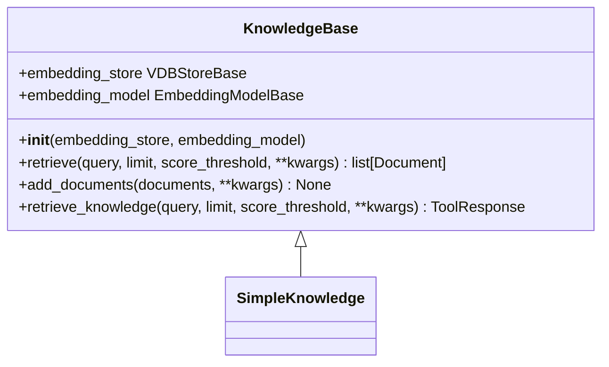

**图示来源**
- [_knowledge_base.py](file://src/agentscope/rag/_knowledge_base.py#L13-L131)

### SimpleKnowledge实现类
`SimpleKnowledge`是`KnowledgeBase`的一个具体实现，提供了完整的知识库功能。该类实现了文档检索和添加的具体逻辑，利用嵌入模型和向量数据库存储来完成相关操作。

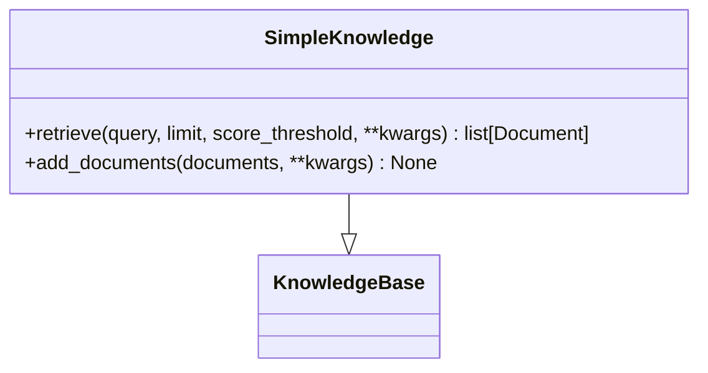

**图示来源**
- [_simple_knowledge.py](file://src/agentscope/rag/_simple_knowledge.py#L10-L85)

**中文来源**
- [_simple_knowledge.py](file://src/agentscope/rag/_simple_knowledge.py#L1-L85)

## 文档读取器

### 读取器基类
`ReaderBase`是所有文档读取器的基类，定义了读取器的基本接口。所有具体的读取器都必须继承这个基类并实现其抽象方法。

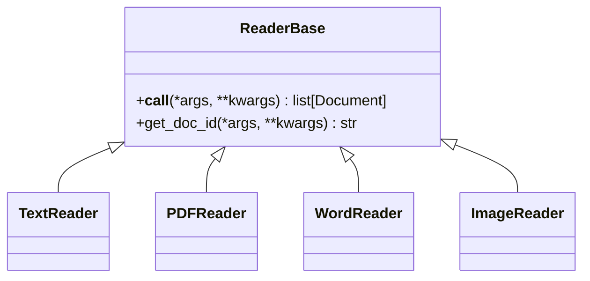

**图示来源**
- [_reader/_reader_base.py](file://src/agentscope/rag/_reader/_reader_base.py#L9-L28)

### 文本读取器
`TextReader`用于读取文本文件并将其分割成块。支持按字符、句子或段落进行分割，并允许配置块大小。

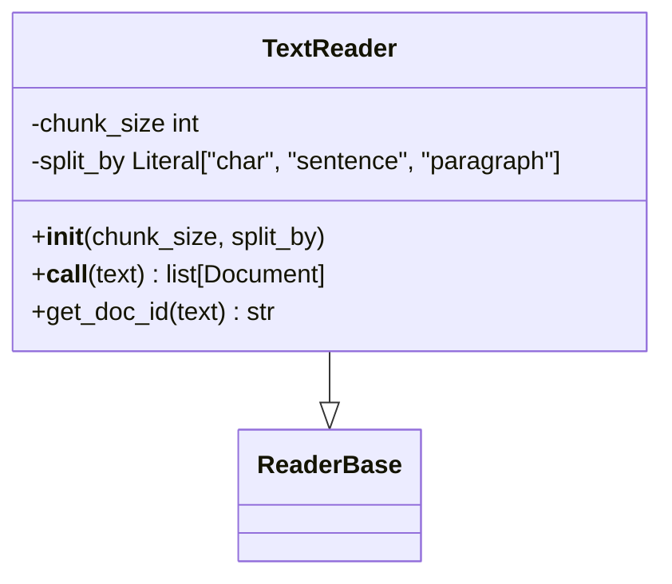

**图示来源**
- [_reader/_text_reader.py](file://src/agentscope/rag/_reader/_text_reader.py#L13-L150)

### PDF读取器
`PDFReader`用于读取PDF文件。它使用`TextReader`来处理文本内容的分割，确保PDF文档能够被正确地分块和索引。

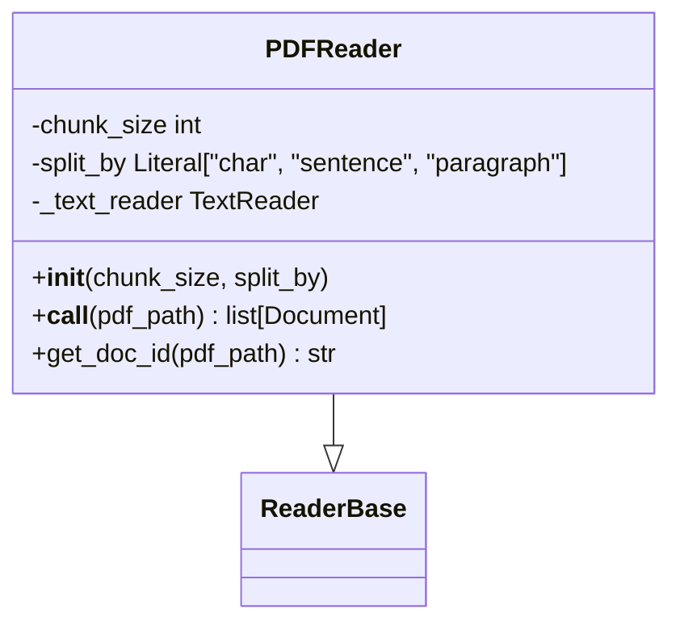

**图示来源**
- [_reader/_pdf_reader.py](file://src/agentscope/rag/_reader/_pdf_reader.py#L11-L87)

### Word读取器
`WordReader`支持读取Word文档（.docx文件），能够提取文本、图像和表格内容。该读取器特别处理了表格的格式化，支持Markdown和JSON两种输出格式。

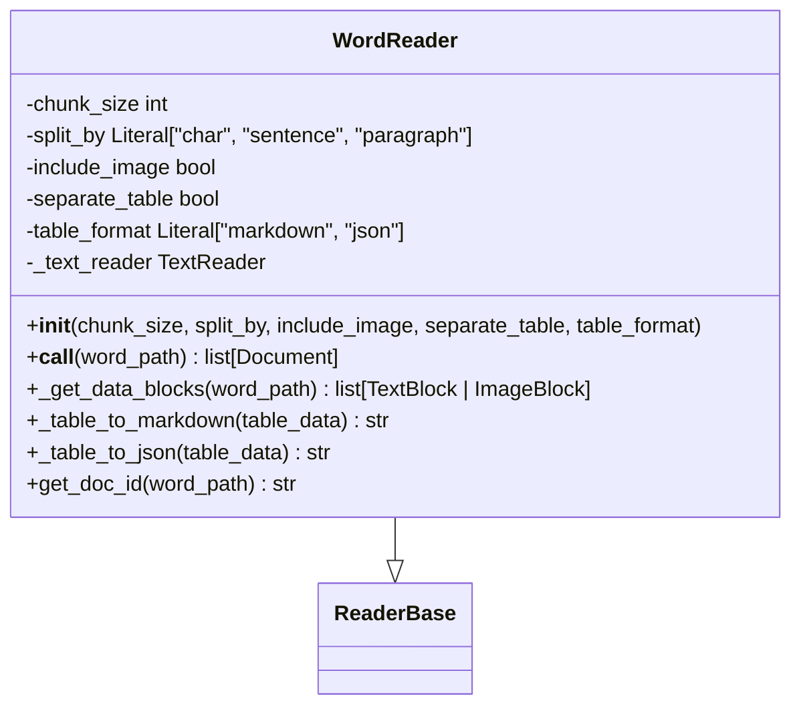

**图示来源**
- [_reader/_word_reader.py](file://src/agentscope/rag/_reader/_word_reader.py#L205-L509)

### 图像读取器
`ImageReader`用于处理图像文件，将图像包装成文档对象以支持多模态RAG。它支持从URL或本地路径读取图像。

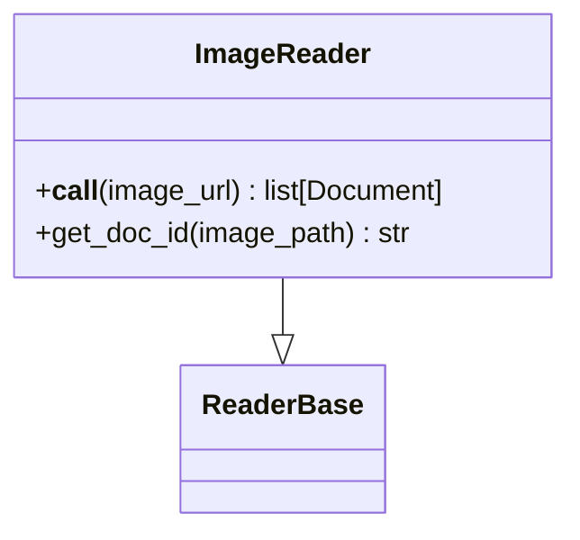

**图示来源**
- [_reader/_image_reader.py](file://src/agentscope/rag/_reader/_image_reader.py#L10-L68)

**中文来源**
- [_reader/__init__.py](file://src/agentscope/rag/_reader/__init__.py#L1-L19)
- [_reader/_reader_base.py](file://src/agentscope/rag/_reader/_reader_base.py#L1-L28)
- [_reader/_text_reader.py](file://src/agentscope/rag/_reader/_text_reader.py#L1-L150)
- [_reader/_pdf_reader.py](file://src/agentscope/rag/_reader/_pdf_reader.py#L1-L87)
- [_reader/_word_reader.py](file://src/agentscope/rag/_reader/_word_reader.py#L1-L509)
- [_reader/_image_reader.py](file://src/agentscope/rag/_reader/_image_reader.py#L1-L68)

## 向量存储后端

### 存储基类
`VDBStoreBase`是向量数据库存储的基类，作为知识库和实际向量数据库实现之间的中间层。它定义了添加、删除和搜索文档的基本接口。

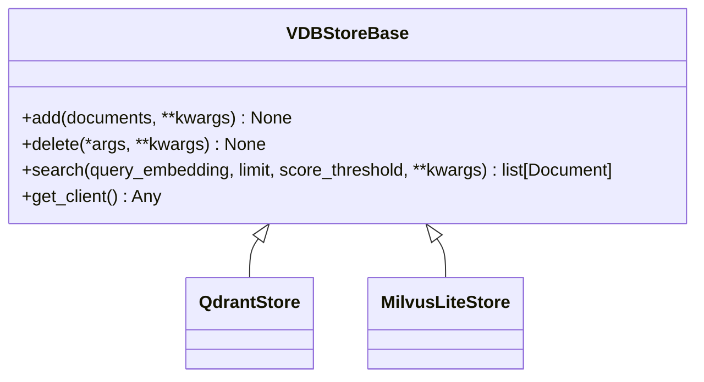

**图示来源**
- [_store/_store_base.py](file://src/agentscope/rag/_store/_store_base.py#L10-L50)

### Qdrant存储
`QdrantStore`是Qdrant向量数据库的实现，支持本地和远程实例。它使用"payload"字段存储文档元数据，包括文档ID、块ID和原始内容。

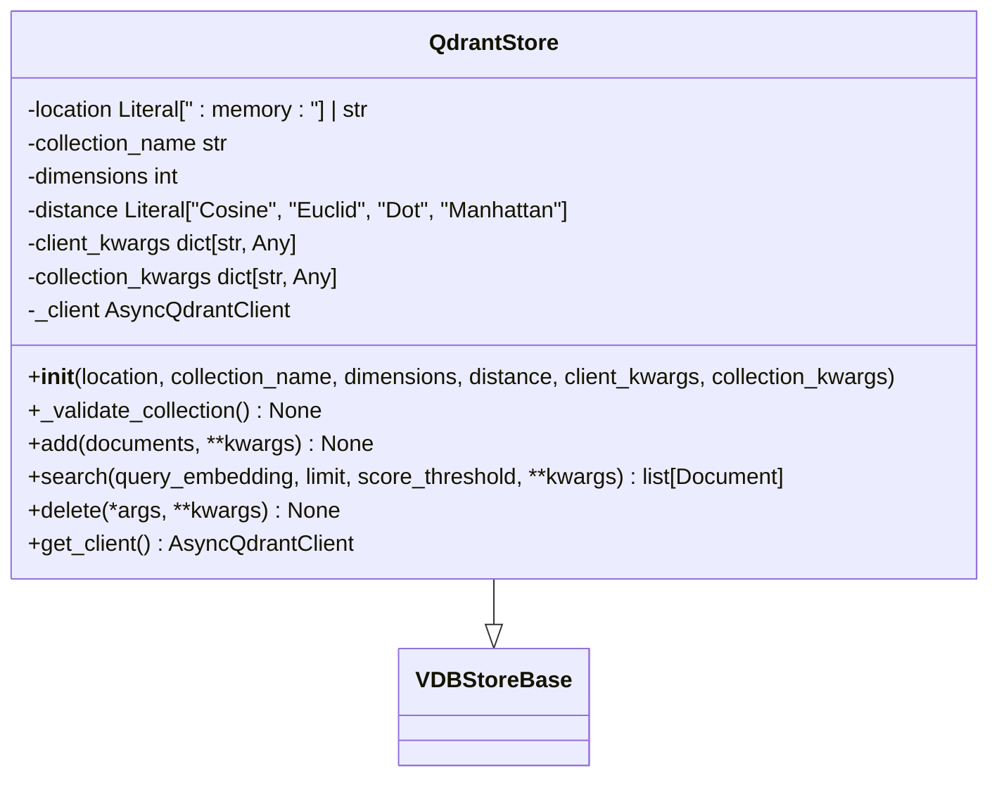

**图示来源**
- [_store/_qdrant_store.py](file://src/agentscope/rag/_store/_qdrant_store.py#L18-L174)

### MilvusLite存储
`MilvusLiteStore`是Milvus Lite向量数据库的实现，支持本地和远程Milvus实例。它使用标量字段存储元数据，并使用新的MilvusClient API进行简化操作。

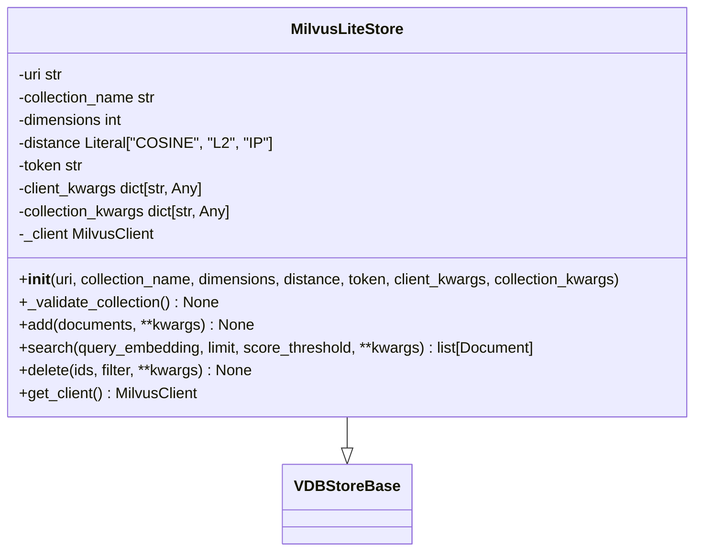

**图示来源**
- [_store/_milvuslite_store.py](file://src/agentscope/rag/_store/_milvuslite_store.py#L19-L258)

**中文来源**
- [_store/__init__.py](file://src/agentscope/rag/_store/__init__.py#L1-L15)
- [_store/_store_base.py](file://src/agentscope/rag/_store/_store_base.py#L1-L50)
- [_store/_qdrant_store.py](file://src/agentscope/rag/_store/_qdrant_store.py#L1-L174)
- [_store/_milvuslite_store.py](file://src/agentscope/rag/_store/_milvuslite_store.py#L1-L258)

## 检索增强生成流程

### 调用流程
检索增强生成的调用流程包括以下步骤：
1. 使用相应的读取器加载文档
2. 将文档分割成块并转换为Document对象
3. 使用嵌入模型生成文档块的嵌入向量
4. 将文档和嵌入向量存储到向量数据库中
5. 接收查询并生成查询嵌入
6. 在向量数据库中搜索相关文档
7. 将检索到的文档与查询拼接，生成增强的上下文
8. 将增强的上下文传递给生成模型

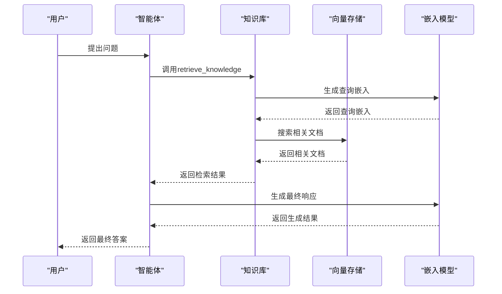

**图示来源**
- [_knowledge_base.py](file://src/agentscope/rag/_knowledge_base.py#L77-L131)
- [_simple_knowledge.py](file://src/agentscope/rag/_simple_knowledge.py#L13-L52)

### 上下文拼接策略
系统采用灵活的上下文拼接策略，将检索到的相关文档与原始查询结合。拼接格式包括文档的相关性分数和内容，以便生成模型能够充分利用检索到的信息。

### 结果排序算法
检索结果根据向量相似度进行排序，使用配置的相似度度量（如余弦相似度、欧几里得距离等）。系统支持通过`score_threshold`参数过滤低质量结果，并通过`limit`参数控制返回结果的数量。

**中文来源**
- [basic_usage.py](file://examples/functionality/rag/basic_usage.py#L1-L80)
- [react_agent_integration.py](file://examples/functionality/rag/react_agent_integration.py#L1-L79)

## 多模态RAG

### 多模态支持
多模态RAG支持处理文本、图像等多种类型的数据。通过`ImageReader`可以将图像文件转换为文档对象，并使用支持多模态的嵌入模型（如`DashScopeMultiModalEmbeding`）生成嵌入向量。

### 配置选项
多模态RAG的配置需要特别注意嵌入模型的选择，必须使用支持多模态输入的模型。同时，向量存储后端需要能够处理多模态数据的元数据。

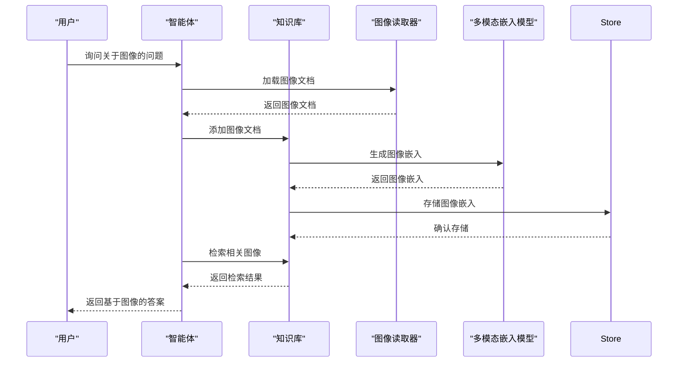

**图示来源**
- [multimodal_rag.py](file://examples/functionality/rag/multimodal_rag.py#L1-L73)

**中文来源**
- [multimodal_rag.py](file://examples/functionality/rag/multimodal_rag.py#L1-L73)

## 与智能体系统集成

### ReAct智能体集成
RAG模块可以无缝集成到ReAct智能体中，通过`knowledge`参数将知识库传递给智能体。智能体在执行过程中可以自动调用知识库进行信息检索。

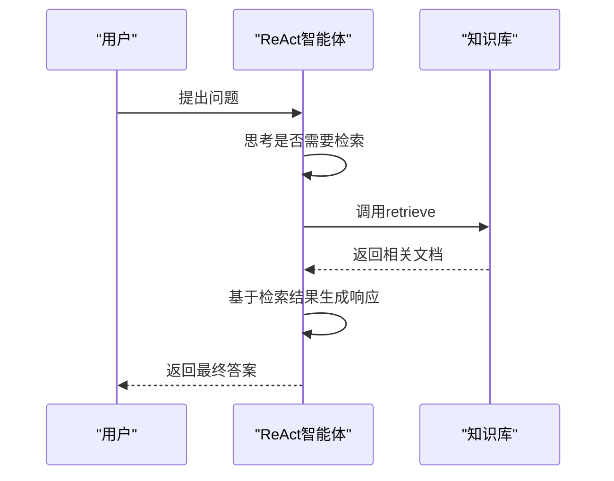

**图示来源**
- [react_agent_integration.py](file://examples/functionality/rag/react_agent_integration.py#L1-L79)

### 工具化集成
RAG功能也可以作为工具注册到智能体的工具包中，使智能体能够显式地调用检索功能。这种方式提供了更大的灵活性，允许智能体根据需要决定何时进行检索。

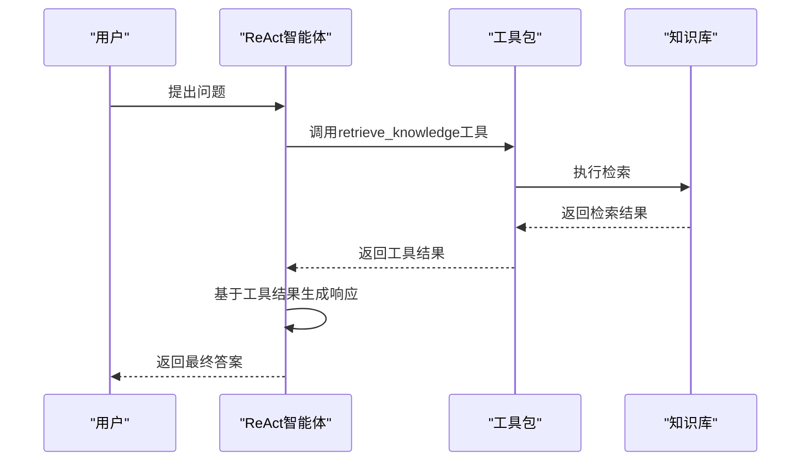

**图示来源**
- [agentic_usage.py](file://examples/functionality/rag/agentic_usage.py#L1-L102)

**中文来源**
- [react_agent_integration.py](file://examples/functionality/rag/react_agent_integration.py#L1-L79)
- [agentic_usage.py](file://examples/functionality/rag/agentic_usage.py#L1-L102)

## 实时更新机制

### 文档添加
系统支持实时添加新文档到知识库中。通过`add_documents`方法，可以将新的文档列表添加到知识库，系统会自动为其生成嵌入并向量存储。

### 动态更新
知识库支持动态更新，允许在运行时添加、删除或修改文档。这种机制使得知识库能够保持最新状态，及时反映最新的信息变化。

### 性能优化
为了优化实时更新的性能，建议批量添加文档而不是逐个添加。同时，合理配置向量数据库的索引策略可以提高检索效率。

**中文来源**
- [_knowledge_base.py](file://src/agentscope/rag/_knowledge_base.py#L60-L73)
- [_simple_knowledge.py](file://src/agentscope/rag/_simple_knowledge.py#L54-L85)