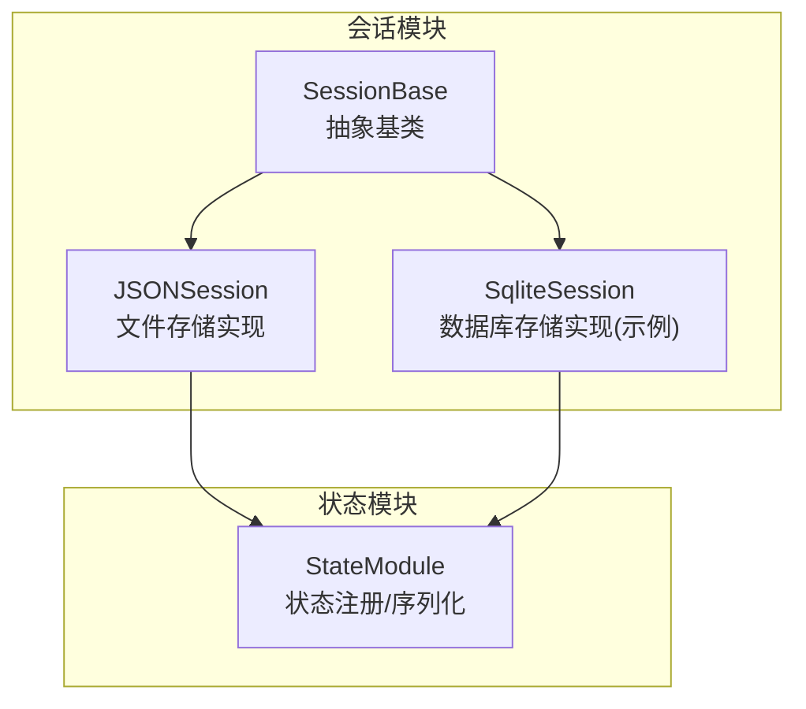
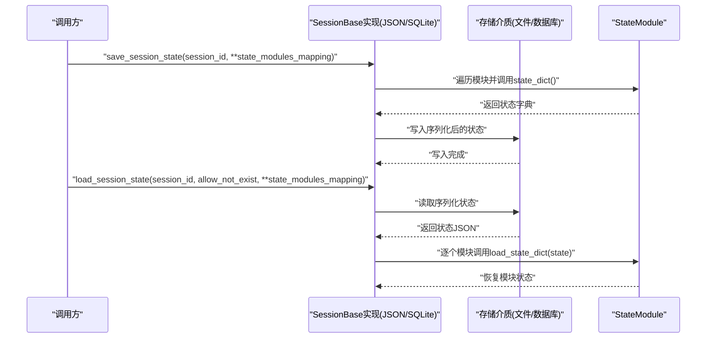
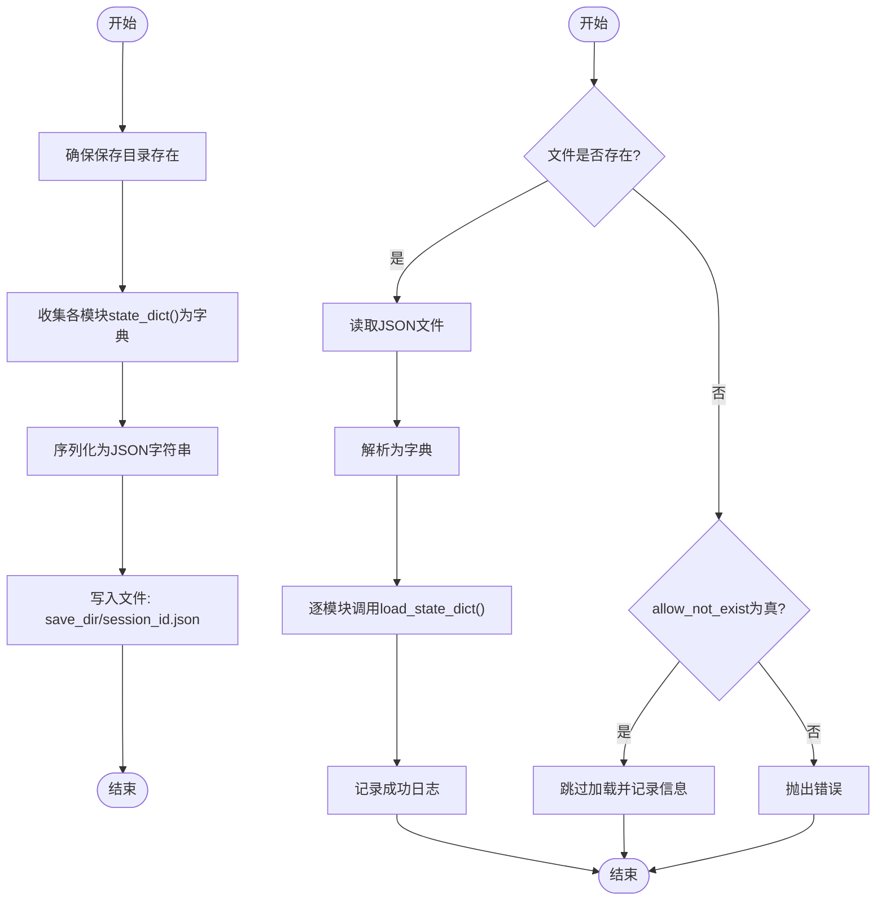
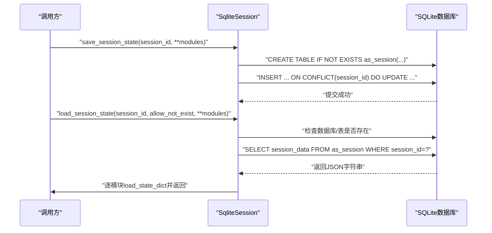
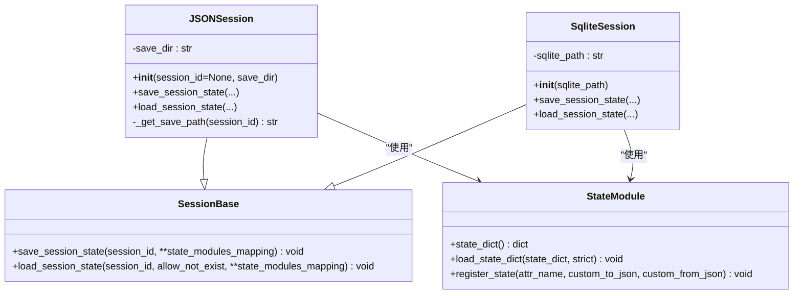

# 会话管理API

<cite>
**本文引用的文件列表**
- [src/agentscope/session/_session_base.py](file://src/agentscope/session/_session_base.py)
- [src/agentscope/session/_json_session.py](file://src/agentscope/session/_json_session.py)
- [src/agentscope/session/__init__.py](file://src/agentscope/session/__init__.py)
- [src/agentscope/module/_state_module.py](file://src/agentscope/module/_state_module.py)
- [examples/functionality/session_with_sqlite/sqlite_session.py](file://examples/functionality/session_with_sqlite/sqlite_session.py)
- [examples/functionality/session_with_sqlite/main.py](file://examples/functionality/session_with_sqlite/main.py)
- [tests/session_test.py](file://tests/session_test.py)
</cite>

## 目录
1. [简介](#简介)
2. [项目结构](#项目结构)
3. [核心组件](#核心组件)
4. [架构总览](#架构总览)
5. [详细组件分析](#详细组件分析)
6. [依赖关系分析](#依赖关系分析)
7. [性能考量](#性能考量)
8. [故障排查指南](#故障排查指南)
9. [结论](#结论)
10. [附录](#附录)

## 简介
本文件为会话管理模块的完整API参考文档，聚焦于SessionBase抽象基类及其具体实现（JSONSession、SqliteSession），系统性地记录会话生命周期（创建、加载、保存、销毁）、状态序列化格式、存储路径配置、并发访问控制策略，并说明与智能体状态的绑定机制、上下文继承关系以及跨会话数据共享策略。同时提供与外部数据库（以SQLite为例）的集成接口与性能优化建议（批量操作、索引优化等）。

## 项目结构
会话管理模块位于src/agentscope/session目录下，包含抽象基类与两个具体实现：
- 抽象基类：SessionBase
- 文件存储实现：JSONSession
- 数据库存储实现：SqliteSession（示例）
- 模块导出：通过__init__.py导出SessionBase与JSONSession

图表来源
- [src/agentscope/session/_session_base.py](file://src/agentscope/session/_session_base.py#L1-L33)
- [src/agentscope/session/_json_session.py](file://src/agentscope/session/_json_session.py#L1-L118)
- [examples/functionality/session_with_sqlite/sqlite_session.py](file://examples/functionality/session_with_sqlite/sqlite_session.py#L1-L168)
- [src/agentscope/module/_state_module.py](file://src/agentscope/module/_state_module.py#L1-L152)

章节来源
- [src/agentscope/session/__init__.py](file://src/agentscope/session/__init__.py#L1-L11)

## 核心组件
- SessionBase：定义异步保存与加载会话状态的抽象接口，参数包含会话ID与若干StateModule实例映射。
- JSONSession：基于文件系统的会话实现，默认将状态序列化为JSON并保存在指定目录；支持按会话ID命名文件。
- SqliteSession：基于SQLite的会话实现，使用JSON字段存储状态字典，支持表自动创建与冲突更新。
- StateModule：用于注册可序列化的状态属性或嵌套子模块，提供state_dict/load_state_dict能力，支撑会话状态的序列化与反序列化。

章节来源
- [src/agentscope/session/_session_base.py](file://src/agentscope/session/_session_base.py#L1-L33)
- [src/agentscope/session/_json_session.py](file://src/agentscope/session/_json_session.py#L1-L118)
- [examples/functionality/session_with_sqlite/sqlite_session.py](file://examples/functionality/session_with_sqlite/sqlite_session.py#L1-L168)
- [src/agentscope/module/_state_module.py](file://src/agentscope/module/_state_module.py#L1-L152)

## 架构总览
会话管理采用“抽象接口 + 多种存储后端”的设计模式。调用方通过SessionBase接口统一进行会话状态的保存与加载，具体实现负责选择存储介质（文件或数据库）。StateModule贯穿其中，作为状态序列化/反序列化的载体。

图表来源
- [src/agentscope/session/_session_base.py](file://src/agentscope/session/_session_base.py#L1-L33)
- [src/agentscope/session/_json_session.py](file://src/agentscope/session/_json_session.py#L53-L118)
- [examples/functionality/session_with_sqlite/sqlite_session.py](file://examples/functionality/session_with_sqlite/sqlite_session.py#L27-L168)
- [src/agentscope/module/_state_module.py](file://src/agentscope/module/_state_module.py#L49-L107)

## 详细组件分析

### SessionBase 抽象基类
- 职责：定义会话状态保存与加载的异步接口，参数为会话ID与若干StateModule实例映射。
- 关键方法
  - save_session_state(session_id, **state_modules_mapping) -> None
  - load_session_state(session_id, allow_not_exist=True, **state_modules_mapping) -> None
- 设计要点
  - 异步接口，便于I/O密集型场景（文件/数据库）。
  - 允许传入多个StateModule实例，支持多模块状态聚合保存/加载。
  - 允许会话不存在时的容错处理（allow_not_exist）。

章节来源
- [src/agentscope/session/_session_base.py](file://src/agentscope/session/_session_base.py#L1-L33)

### JSONSession 文件存储实现
- 配置
  - save_dir：会话状态文件保存目录，默认当前目录。
  - 已弃用构造参数session_id：建议通过save/load方法传入会话ID。
- 序列化格式
  - 将每个StateModule的状态字典封装为一个字典，再整体序列化为JSON文件，文件名为“{session_id}.json”。
- 生命周期
  - 保存：收集所有模块状态字典，写入JSON文件。
  - 加载：若文件存在则读取JSON并逐模块恢复；否则根据allow_not_exist决定跳过或抛错。
- 并发控制
  - 默认未内置锁；建议在应用层对同一会话ID加锁，避免并发写入竞争。

图表来源
- [src/agentscope/session/_json_session.py](file://src/agentscope/session/_json_session.py#L39-L118)
- [src/agentscope/module/_state_module.py](file://src/agentscope/module/_state_module.py#L49-L107)

章节来源
- [src/agentscope/session/_json_session.py](file://src/agentscope/session/_json_session.py#L1-L118)

### SqliteSession 数据库存储实现（示例）
- 配置
  - sqlite_path：SQLite数据库文件路径。
- 表结构
  - 表名：as_session
  - 字段：session_id（主键）、session_data（JSON）、created_at、updated_at
- 序列化格式
  - 同JSONSession，将模块状态字典序列化为JSON字符串存入session_data字段。
- 生命周期
  - 保存：自动创建表，插入或冲突更新（ON CONFLICT），更新updated_at。
  - 加载：检查数据库/表存在性；查询session_data并逐模块恢复；缺失时根据allow_not_exist决定跳过或抛错。
- 并发控制
  - 使用连接级事务；未显式加锁；建议应用层对同一session_id加互斥锁，避免并发写入导致的数据竞争。

图表来源
- [examples/functionality/session_with_sqlite/sqlite_session.py](file://examples/functionality/session_with_sqlite/sqlite_session.py#L27-L168)

章节来源
- [examples/functionality/session_with_sqlite/sqlite_session.py](file://examples/functionality/session_with_sqlite/sqlite_session.py#L1-L168)

### StateModule 状态模块
- 能力
  - state_dict()：递归收集已注册的属性与嵌套StateModule的状态。
  - load_state_dict(state_dict, strict=True)：从字典恢复状态，strict控制缺失键行为。
  - register_state(attr_name, custom_to_json=None, custom_from_json=None)：注册需要序列化的属性，支持自定义JSON转换函数。
- 绑定机制
  - 通过register_state将属性纳入序列化范围；嵌套StateModule自动参与序列化/反序列化。
- 上下文继承
  - 通过逐模块load_state_dict实现状态恢复，从而在不同会话间传递上下文。
- 跨会话数据共享
  - 可通过共享StateModule实例或在不同会话中加载相同模块来实现跨会话状态共享。

章节来源
- [src/agentscope/module/_state_module.py](file://src/agentscope/module/_state_module.py#L1-L152)

### 会话与智能体状态的绑定
- 绑定方式
  - 在调用save_session_state/load_session_state时，将智能体实例作为StateModule传入，键名为会话内标识符。
- 示例
  - 示例展示了将ReActAgent实例命名为“friday_of_user”，并在后续会话中恢复其状态。

章节来源
- [examples/functionality/session_with_sqlite/main.py](file://examples/functionality/session_with_sqlite/main.py#L1-L77)
- [tests/session_test.py](file://tests/session_test.py#L44-L88)

## 依赖关系分析
- SessionBase是所有会话实现的共同接口契约。
- JSONSession与SqliteSession均依赖StateModule进行状态序列化/反序列化。
- 导出入口通过__init__.py暴露SessionBase与JSONSession，便于外部导入。

图表来源
- [src/agentscope/session/_session_base.py](file://src/agentscope/session/_session_base.py#L1-L33)
- [src/agentscope/session/_json_session.py](file://src/agentscope/session/_json_session.py#L1-L118)
- [examples/functionality/session_with_sqlite/sqlite_session.py](file://examples/functionality/session_with_sqlite/sqlite_session.py#L1-L168)
- [src/agentscope/module/_state_module.py](file://src/agentscope/module/_state_module.py#L1-L152)

章节来源
- [src/agentscope/session/__init__.py](file://src/agentscope/session/__init__.py#L1-L11)

## 性能考量
- 文件存储（JSONSession）
  - I/O开销：频繁小文件写入可能产生大量小文件，建议合并写入或定期清理。
  - 压缩：对大体量状态可考虑压缩后再写入，降低磁盘占用与I/O时间。
  - 并发：同一会话ID并发写入需应用层加锁，避免竞态。
- 数据库存储（SqliteSession）
  - 单条记录更新：使用ON CONFLICT更新，避免重复建表与全量删除。
  - 批量操作：可扩展为批量插入/更新，减少往返次数。
  - 索引优化：为session_id建立索引可显著提升查询性能（当前实现按主键查询，主键即索引）。
  - 事务：单次保存已在连接内提交，建议在批量场景中合并多次保存到单个事务。
- 序列化开销
  - StateModule的state_dict/load_state_dict为递归遍历，复杂度与模块树深度成正比；建议合理拆分模块，避免过深嵌套。
- 日志与容错
  - allow_not_exist为True时跳过不存在会话，减少异常开销；False时抛错，便于快速定位问题。

[本节为通用性能建议，不直接分析具体文件，故无章节来源]

## 故障排查指南
- 会话文件不存在
  - JSON：当allow_not_exist为True时会记录信息并跳过；为False时抛出错误。
  - SQLite：当数据库/表不存在且allow_not_exist为True时记录信息并跳过；为False时抛出错误。
- 缺失状态模块
  - 加载时若某模块名称不在会话数据中，且strict为True则抛错；建议确保保存时包含全部模块。
- 并发写入冲突
  - JSON：建议应用层对同一session_id加锁。
  - SQLite：建议应用层对同一session_id加锁；避免多进程/线程同时写入。
- 自定义序列化失败
  - register_state未提供自定义转换函数时，若属性不可JSON序列化会报错；请提供custom_to_json/custom_from_json。

章节来源
- [src/agentscope/session/_json_session.py](file://src/agentscope/session/_json_session.py#L77-L118)
- [examples/functionality/session_with_sqlite/sqlite_session.py](file://examples/functionality/session_with_sqlite/sqlite_session.py#L69-L168)
- [src/agentscope/module/_state_module.py](file://src/agentscope/module/_state_module.py#L108-L152)

## 结论
会话管理模块通过SessionBase抽象统一了保存/加载接口，结合StateModule实现了灵活的状态序列化与恢复。JSONSession适用于轻量场景，SqliteSession提供了可扩展的数据库后端。通过合理的并发控制、批量操作与索引优化，可在保证一致性的同时提升性能。实际部署中建议根据业务规模选择合适的存储后端，并在应用层做好并发与容错处理。

[本节为总结性内容，不直接分析具体文件，故无章节来源]

## 附录

### API参考速查
- SessionBase
  - save_session_state(session_id, **state_modules_mapping) -> None
  - load_session_state(session_id, allow_not_exist=True, **state_modules_mapping) -> None
- JSONSession
  - __init__(session_id=None, save_dir=".") -> None
  - save_session_state(...) -> None
  - load_session_state(...) -> None
  - _get_save_path(session_id) -> str
- SqliteSession
  - __init__(sqlite_path) -> None
  - save_session_state(...) -> None
  - load_session_state(...) -> None
- StateModule
  - state_dict() -> dict
  - load_state_dict(state_dict, strict=True) -> None
  - register_state(attr_name, custom_to_json=None, custom_from_json=None) -> None

章节来源
- [src/agentscope/session/_session_base.py](file://src/agentscope/session/_session_base.py#L1-L33)
- [src/agentscope/session/_json_session.py](file://src/agentscope/session/_json_session.py#L1-L118)
- [examples/functionality/session_with_sqlite/sqlite_session.py](file://examples/functionality/session_with_sqlite/sqlite_session.py#L1-L168)
- [src/agentscope/module/_state_module.py](file://src/agentscope/module/_state_module.py#L1-L152)