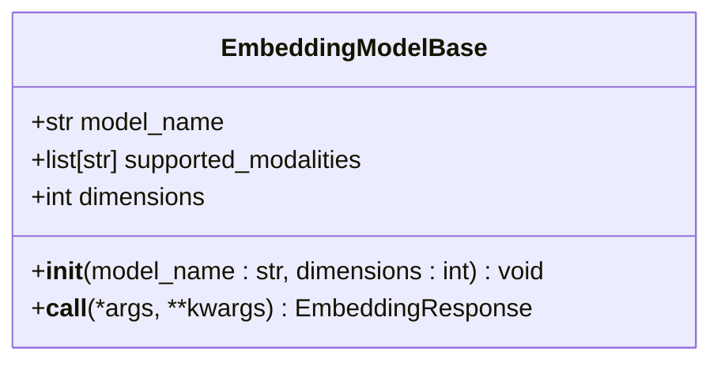
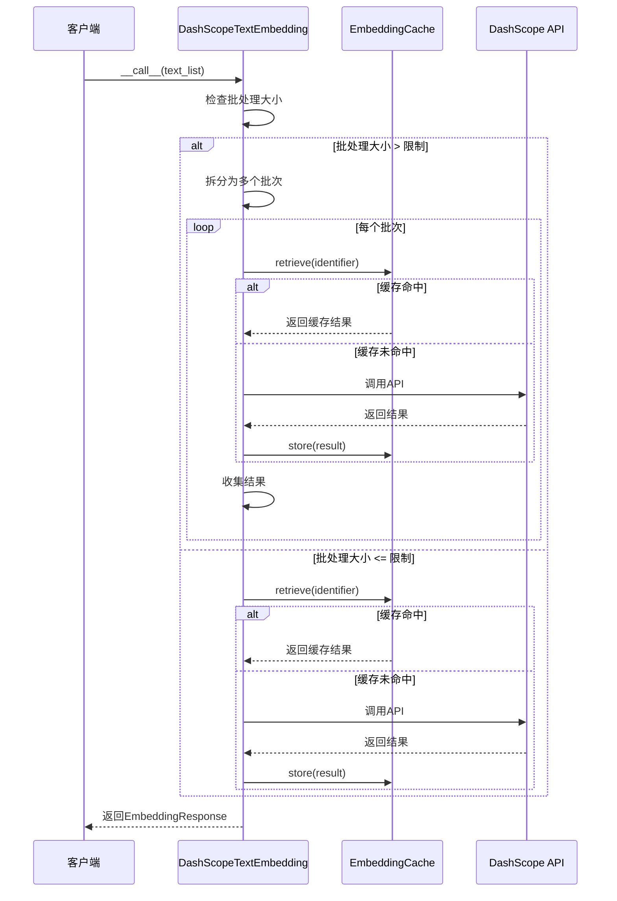
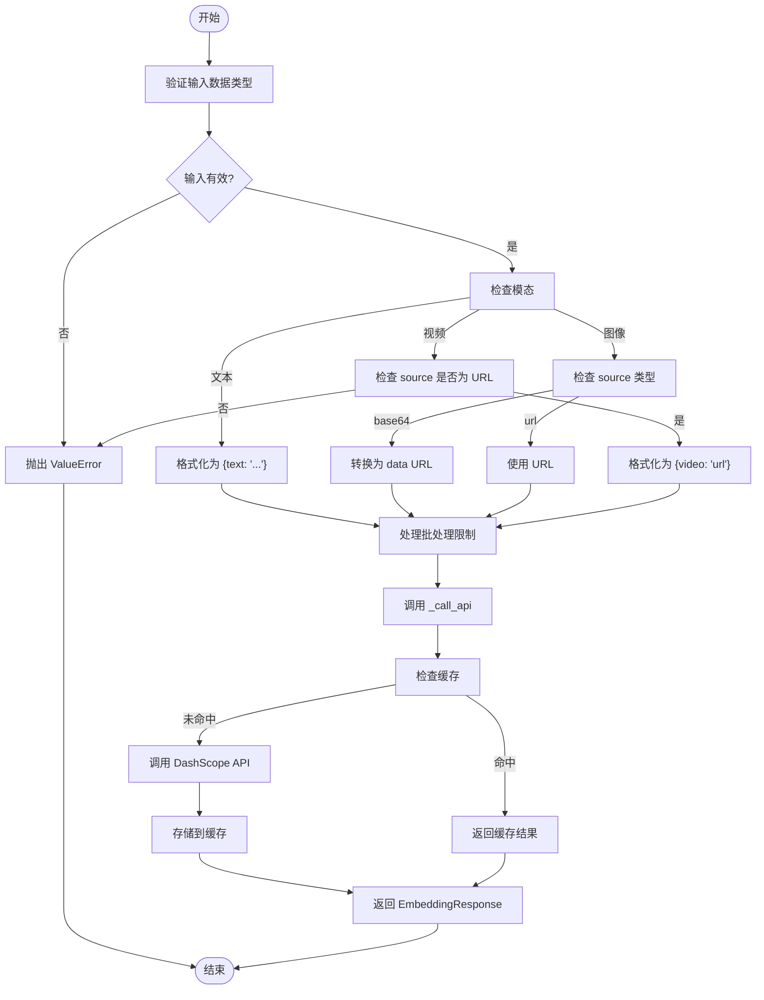
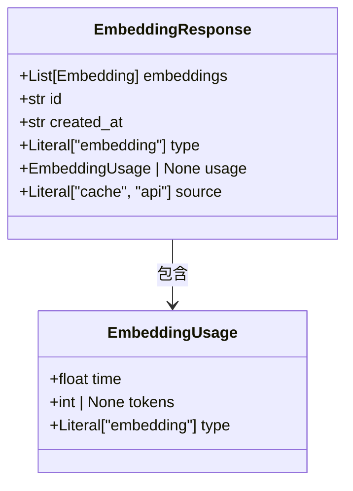
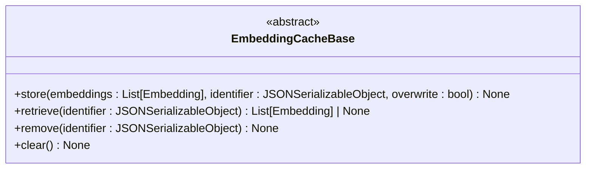

# 嵌入模型API

<cite>
**本文档中引用的文件**  
- [__init__.py](file://src/agentscope/embedding/__init__.py)
- [_embedding_base.py](file://src/agentscope/embedding/_embedding_base.py)
- [_openai_embedding.py](file://src/agentscope/embedding/_openai_embedding.py)
- [_dashscope_embedding.py](file://src/agentscope/embedding/_dashscope_embedding.py)
- [_dashscope_multimodal_embedding.py](file://src/agentscope/embedding/_dashscope_multimodal_embedding.py)
- [_cache_base.py](file://src/agentscope/embedding/_cache_base.py)
- [_file_cache.py](file://src/agentscope/embedding/_file_cache.py)
- [_embedding_response.py](file://src/agentscope/embedding/_embedding_response.py)
- [_embedding_usage.py](file://src/agentscope/embedding/_embedding_usage.py)
- [_gemini_embedding.py](file://src/agentscope/embedding/_gemini_embedding.py)
- [_message_block.py](file://src/agentscope/message/_message_block.py)
- [multimodal_rag.py](file://examples/functionality/rag/multimodal_rag.py)
- [embedding_cache_test.py](file://tests/embedding_cache_test.py)
</cite>

## 目录
1. [简介](#简介)
2. [核心组件](#核心组件)
3. [抽象基类 EmbeddingModelBase](#抽象基类-embeddingmodelbase)
4. [具体实现类](#具体实现类)
   - [OpenAI 文本嵌入模型](#openai-文本嵌入模型)
   - [DashScope 文本嵌入模型](#dashscope-文本嵌入模型)
   - [Gemini 文本嵌入模型](#gemini-文本嵌入模型)
   - [DashScope 多模态嵌入模型](#dashscope-多模态嵌入模型)
5. [嵌入响应与使用信息](#嵌入响应与使用信息)
6. [缓存机制](#缓存机制)
   - [缓存抽象基类 EmbeddingCacheBase](#缓存抽象基类-embeddingcachebase)
   - [文件缓存实现 FileEmbeddingCache](#文件缓存实现-fileembeddingcache)
7. [多模态输入支持](#多模态输入支持)
8. [与RAG和记忆系统的集成](#与rag和记忆系统的集成)
9. [性能指标与调优建议](#性能指标与调优建议)
10. [总结](#总结)

## 简介
本API参考文档详细描述了`agentscope`框架中嵌入模型模块的设计与实现。该模块提供了一套统一的接口，用于与多种嵌入模型服务（如OpenAI、DashScope、Gemini）进行交互，支持文本和多模态（图像、视频）数据的向量化。文档重点阐述了`EmbeddingModelBase`抽象基类及其具体实现，嵌入结果的缓存策略，以及如何将嵌入功能集成到检索增强生成（RAG）和记忆系统中。

## 核心组件

本模块的核心组件包括：
- **EmbeddingModelBase**: 所有嵌入模型的抽象基类，定义了统一的接口。
- **具体实现类**: 如`OpenAITextEmbedding`、`DashScopeTextEmbedding`、`DashScopeMultiModalEmbedding`等，针对不同服务商和功能的实现。
- **EmbeddingResponse**: 封装嵌入结果、使用情况和元数据的响应对象。
- **EmbeddingCacheBase** 和 **FileEmbeddingCache**: 提供嵌入结果的缓存能力，以减少API调用成本和延迟。

**本节来源**
- [__init__.py](file://src/agentscope/embedding/__init__.py)
- [_embedding_base.py](file://src/agentscope/embedding/_embedding_base.py)
- [_embedding_response.py](file://src/agentscope/embedding/_embedding_response.py)
- [_cache_base.py](file://src/agentscope/embedding/_cache_base.py)

## 抽象基类 EmbeddingModelBase

`EmbeddingModelBase`是所有嵌入模型实现的基石，它定义了嵌入模型必须具备的属性和方法。

### 核心属性
- **model_name**: 字符串类型，表示所使用的嵌入模型的名称（如`text-embedding-ada-002`）。
- **supported_modalities**: 字符串列表，声明该模型支持的数据模态，例如`["text"]`或`["text", "image", "video"]`。
- **dimensions**: 整数类型，指定生成的嵌入向量的维度。

### 核心方法
- **`__init__(model_name: str, dimensions: int)`**: 构造函数，用于初始化模型名称和向量维度。
- **`__call__(*args, **kwargs) -> EmbeddingResponse`**: 异步调用方法，是所有嵌入模型的入口点。子类必须实现此方法来处理具体的API调用逻辑。该方法返回一个`EmbeddingResponse`对象。



**图表来源**
- [_embedding_base.py](file://src/agentscope/embedding/_embedding_base.py#L8-L46)

**本节来源**
- [_embedding_base.py](file://src/agentscope/embedding/_embedding_base.py)

## 具体实现类

### OpenAI 文本嵌入模型

`OpenAITextEmbedding`类实现了与OpenAI嵌入API的交互。

#### 初始化参数
- **api_key**: 用于身份验证的OpenAI API密钥。
- **model_name**: OpenAI提供的嵌入模型名称。
- **dimensions**: 请求的嵌入向量维度，默认为1024。
- **embedding_cache**: 可选参数，传入一个`EmbeddingCacheBase`的实例以启用结果缓存。

#### 调用方法
- **`__call__(text: List[str | TextBlock])`**: 接收一个字符串或`TextBlock`对象的列表作为输入。方法内部会将输入格式化，检查缓存，然后调用OpenAI API。成功后，结果会被缓存（如果配置了缓存），并返回`EmbeddingResponse`。

**本节来源**
- [_openai_embedding.py](file://src/agentscope/embedding/_openai_embedding.py)

### DashScope 文本嵌入模型

`DashScopeTextEmbedding`类用于调用阿里云的DashScope文本嵌入API。

#### 特性
- **批处理限制**: 该实现内置了对DashScope API批处理大小限制的处理。例如，`text-embedding-v4`模型的最大批处理大小为10。当输入文本数量超过限制时，该类会自动将其拆分为多个批次进行处理。
- **缓存集成**: 与`OpenAITextEmbedding`类似，支持通过`embedding_cache`参数启用缓存。

#### 初始化参数
- **api_key**: DashScope API密钥。
- **model_name**: 模型名称。
- **dimensions**: 向量维度。
- **embedding_cache**: 缓存实例。



**图表来源**
- [_dashscope_embedding.py](file://src/agentscope/embedding/_dashscope_embedding.py#L14-L170)

**本节来源**
- [_dashscope_embedding.py](file://src/agentscope/embedding/_dashscope_embedding.py)

### Gemini 文本嵌入模型

`GeminiTextEmbedding`类封装了与Google Gemini API的嵌入功能。

#### 初始化参数
- **api_key**: Gemini API密钥。
- **model_name**: 模型名称。
- **dimensions**: 向量维度，默认为3072。
- **embedding_cache**: 缓存实例。

#### 调用方法
- **`__call__(text: List[str | TextBlock])`**: 处理输入文本，检查缓存，调用Gemini API，并返回`EmbeddingResponse`。

**本节来源**
- [_gemini_embedding.py](file://src/agentscope/embedding/_gemini_embedding.py)

### DashScope 多模态嵌入模型

`DashScopeMultiModalEmbedding`是本模块中功能最复杂的实现，支持文本、图像和视频的嵌入。

#### 初始化参数
- **api_key**: API密钥。
- **model_name**: 多模态模型名称，如`multimodal-embedding-v1`或`tongyi-embedding-vision-plus`。
- **dimensions**: 向量维度。该参数的值会根据`model_name`自动校验和设置（例如，`tongyi-embedding-vision-plus`要求维度为1152）。
- **embedding_cache**: 缓存实例。

#### 调用方法
- **`__call__(inputs: list[TextBlock | ImageBlock | VideoBlock])`**: 接收一个包含`TextBlock`、`ImageBlock`或`VideoBlock`对象的列表。
  - **输入验证**: 方法会严格检查每个输入块的类型和必需字段。
  - **图像处理**: `ImageBlock`的`source`可以是`base64`编码的数据或`url`。对于`base64`，方法会将其转换为符合RFC 2397规范的data URL。
  - **视频处理**: `VideoBlock`目前仅支持通过`url`提供。
  - **批处理**: 与文本嵌入类似，该实现也处理批处理限制（不同模型的限制不同，如`vision-plus`模型支持8个）。



**图表来源**
- [_dashscope_multimodal_embedding.py](file://src/agentscope/embedding/_dashscope_multimodal_embedding.py#L17-L245)

**本节来源**
- [_dashscope_multimodal_embedding.py](file://src/agentscope/embedding/_dashscope_multimodal_embedding.py)

## 嵌入响应与使用信息

### EmbeddingResponse 类
该类封装了嵌入API调用的完整响应。

- **embeddings**: `List[Embedding]`类型，即嵌入向量列表。`Embedding`被定义为浮点数列表（`List[float]`）。
- **id**: 响应的唯一标识符，通常为时间戳。
- **created_at**: 响应创建的时间戳。
- **type**: 固定为`"embedding"`。
- **usage**: 一个`EmbeddingUsage`对象，包含调用的使用情况。
- **source**: 字面量`"cache"`或`"api"`，指示结果是来自缓存还是直接来自API调用。

### EmbeddingUsage 类
该类记录了API调用的性能和成本信息。

- **time**: 浮点数，表示API调用所花费的时间（秒）。
- **tokens**: 整数或`None`，表示此次调用消耗的token数量。对于多模态模型，这可能包括`input_tokens`和`image_tokens`的总和。
- **type**: 固定为`"embedding"`。



**图表来源**
- [_embedding_response.py](file://src/agentscope/embedding/_embedding_response.py#L12-L33)
- [_embedding_usage.py](file://src/agentscope/embedding/_embedding_usage.py#L9-L21)

**本节来源**
- [_embedding_response.py](file://src/agentscope/embedding/_embedding_response.py)
- [_embedding_usage.py](file://src/agentscope/embedding/_embedding_usage.py)

## 缓存机制

### 缓存抽象基类 EmbeddingCacheBase

`EmbeddingCacheBase`是一个抽象基类，定义了所有缓存实现必须遵循的接口。

#### 核心方法
- **`store(embeddings: List[Embedding], identifier: JSONSerializableObject, overwrite: bool = False)`**: 将嵌入向量与一个JSON可序列化的标识符关联并存储。
- **`retrieve(identifier: JSONSerializableObject) -> List[Embedding] | None`**: 根据标识符检索嵌入向量。如果未找到，则返回`None`。
- **`remove(identifier: JSONSerializableObject)`**: 删除指定标识符的缓存。
- **`clear()`**: 清除所有缓存。



**图表来源**
- [_cache_base.py](file://src/agentscope/embedding/_cache_base.py#L12-L64)

**本节来源**
- [_cache_base.py](file://src/agentscope/embedding/_cache_base.py)

### 文件缓存实现 FileEmbeddingCache

`FileEmbeddingCache`是`EmbeddingCacheBase`的一个具体实现，它将嵌入向量以二进制`.npy`文件的形式存储在本地文件系统中。

#### 初始化参数
- **cache_dir**: 存储缓存文件的目录，默认为`"./.cache/embeddings"`。
- **max_file_number**: 可保留的最大文件数量。超过此限制时，最旧的文件将被删除。
- **max_cache_size**: 缓存目录的最大大小（以MB为单位）。超过此限制时，将删除最旧的文件直到满足大小要求。

#### 工作原理
- **文件名生成**: `identifier`（通常是API调用的参数字典）会被JSON序列化，然后通过SHA-256哈希生成唯一的文件名。
- **存储与检索**: 使用`numpy.save()`和`numpy.load()`来高效地读写二进制数据。
- **缓存维护**: `store`方法在每次存储后会调用`_maintain_cache_dir`，根据`max_file_number`和`max_cache_size`策略清理旧文件。

```mermaid
flowchart TD
A[store(embeddings, identifier)] --> B["_get_filename(identifier)"]
B --> C["生成 SHA-256 哈希"]
C --> D["filename = hash + '.npy'"]
D --> E["保存到 cache_dir"]
E --> F["_maintain_cache_dir()"]
F --> G{"检查 max_file_number?"}
G --> |是| H["删除最旧的文件"]
G --> |否| I{"检查 max_cache_size?"}
I --> |是| J["删除最旧的文件直到满足大小"]
I --> |否| K[结束]
H --> K
J --> K
```

**图表来源**
- [_file_cache.py](file://src/agentscope/embedding/_file_cache.py#L19-L188)

**本节来源**
- [_file_cache.py](file://src/agentscope/embedding/_file_cache.py)

## 多模态输入支持

多模态嵌入的关键在于`DashScopeMultiModalEmbedding`类和`message`模块中定义的`ContentBlock`类型。

### 消息块定义
- **TextBlock**: 包含`type: "text"`和`text: str`字段。
- **ImageBlock**: 包含`type: "image"`和`source`字段。`source`可以是`Base64Source`（包含`media_type`和`data`）或`URLSource`（包含`url`）。
- **VideoBlock**: 包含`type: "video"`和`source`字段，目前仅支持`URLSource`。

### 集成示例
以下代码片段展示了如何在RAG系统中使用多模态嵌入：

```python
# 示例来自 multimodal_rag.py
knowledge = SimpleKnowledge(
    embedding_model=DashScopeMultiModalEmbedding(
        api_key=os.environ["DASHSCOPE_API_KEY"],
        model_name="multimodal-embedding-v1",
        dimensions=1024,
    ),
    # ... 其他配置
)
```

**本节来源**
- [_dashscope_multimodal_embedding.py](file://src/agentscope/embedding/_dashscope_multimodal_embedding.py)
- [_message_block.py](file://src/agentscope/message/_message_block.py)
- [multimodal_rag.py](file://examples/functionality/rag/multimodal_rag.py)

## 与RAG和记忆系统的集成

嵌入模型是RAG（检索增强生成）和长期记忆系统的核心组件。

### 在RAG中的角色
1. **知识库构建**: 当向`SimpleKnowledge`或`KnowledgeBase`添加文档时，系统会使用配置的`embedding_model`将文档内容（文本、图像等）转换为嵌入向量。
2. **相似性检索**: 当用户提出查询时，查询同样被转换为嵌入向量。系统在向量数据库（如QdrantStore）中搜索与查询向量最相似的文档嵌入，从而检索出最相关的信息。

### 在记忆系统中的角色
- **长期记忆**: 在`reme`或`mem0`等长期记忆实现中，用户的对话历史或关键信息可以被定期嵌入并存储。当需要时，系统可以通过语义搜索这些嵌入来“回忆”相关信息。
- **记忆压缩**: 嵌入可以用于识别和压缩冗余的记忆片段。

**本节来源**
- [multimodal_rag.py](file://examples/functionality/rag/multimodal_rag.py)
- [task_long_term_memory.py](file://docs/tutorial/zh_CN/src/task_long_term_memory.py) (概念性)

## 性能指标与调优建议

### 性能指标
- **延迟 (Latency)**: 通过`EmbeddingUsage.time`字段测量，包括网络往返和API处理时间。
- **成本 (Cost)**: 通过`EmbeddingUsage.tokens`字段估算，与调用次数和输入长度成正比。
- **吞吐量 (Throughput)**: 受API的批处理限制（如DashScope的10或25）影响。

### 调优建议
1. **启用缓存**: 在`EmbeddingModelBase`的子类中传入`FileEmbeddingCache`实例，可以显著减少重复查询的延迟和成本。
2. **合理配置缓存**: 根据可用磁盘空间设置`max_cache_size`，并根据预期的缓存条目数量设置`max_file_number`。
3. **批量处理**: 尽可能将多个文本合并到一次API调用中，以提高效率。嵌入模型实现类会自动处理超出API限制的批量拆分。
4. **选择合适的模型**: 根据需求选择模型。例如，如果需要多模态支持，则使用`DashScopeMultiModalEmbedding`；如果追求成本效益，可选择维度较低的模型。

**本节来源**
- [_openai_embedding.py](file://src/agentscope/embedding/_openai_embedding.py)
- [_dashscope_embedding.py](file://src/agentscope/embedding/_dashscope_embedding.py)
- [_file_cache.py](file://src/agentscope/embedding/_file_cache.py)
- [embedding_cache_test.py](file://tests/embedding_cache_test.py)

## 总结

`agentscope`的嵌入模型模块提供了一个灵活、可扩展且高效的API，用于与多种嵌入服务进行交互。通过`EmbeddingModelBase`抽象基类和`EmbeddingCacheBase`缓存基类，该模块实现了良好的解耦和可维护性。其对多模态嵌入的原生支持，使其非常适合构建先进的AI应用，如多模态RAG系统。通过合理利用缓存和批处理，开发者可以有效优化应用的性能和成本。