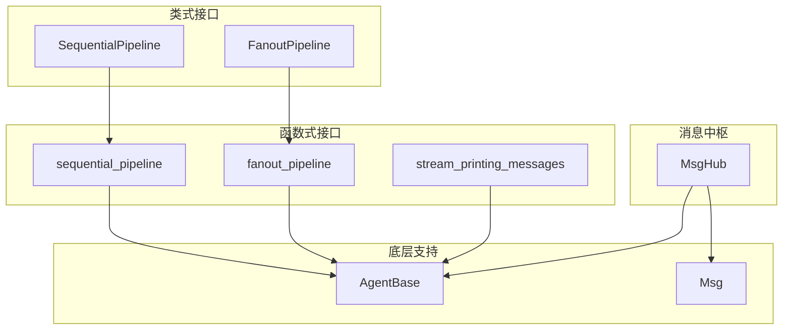
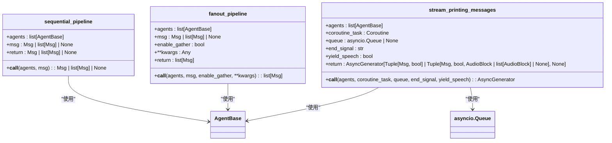
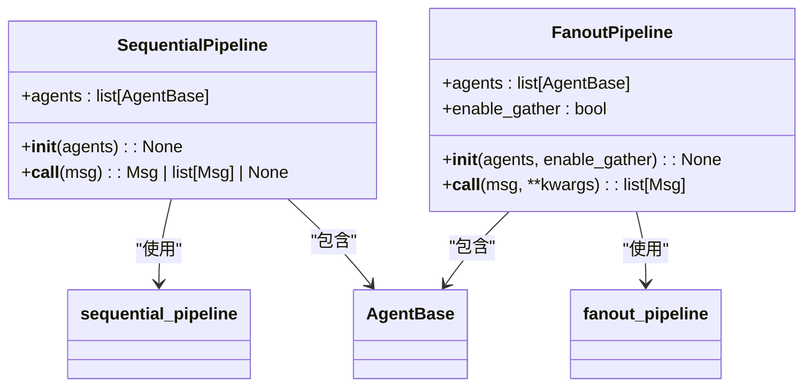
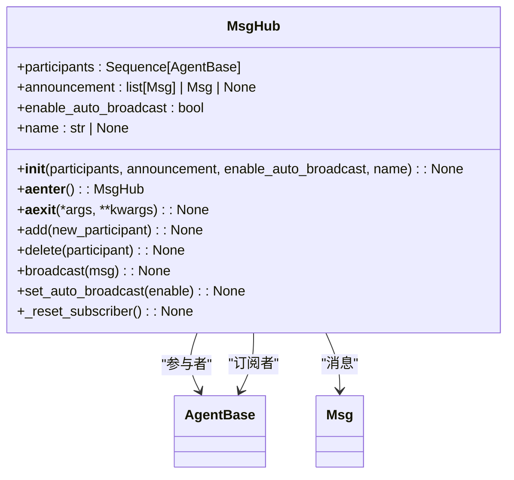
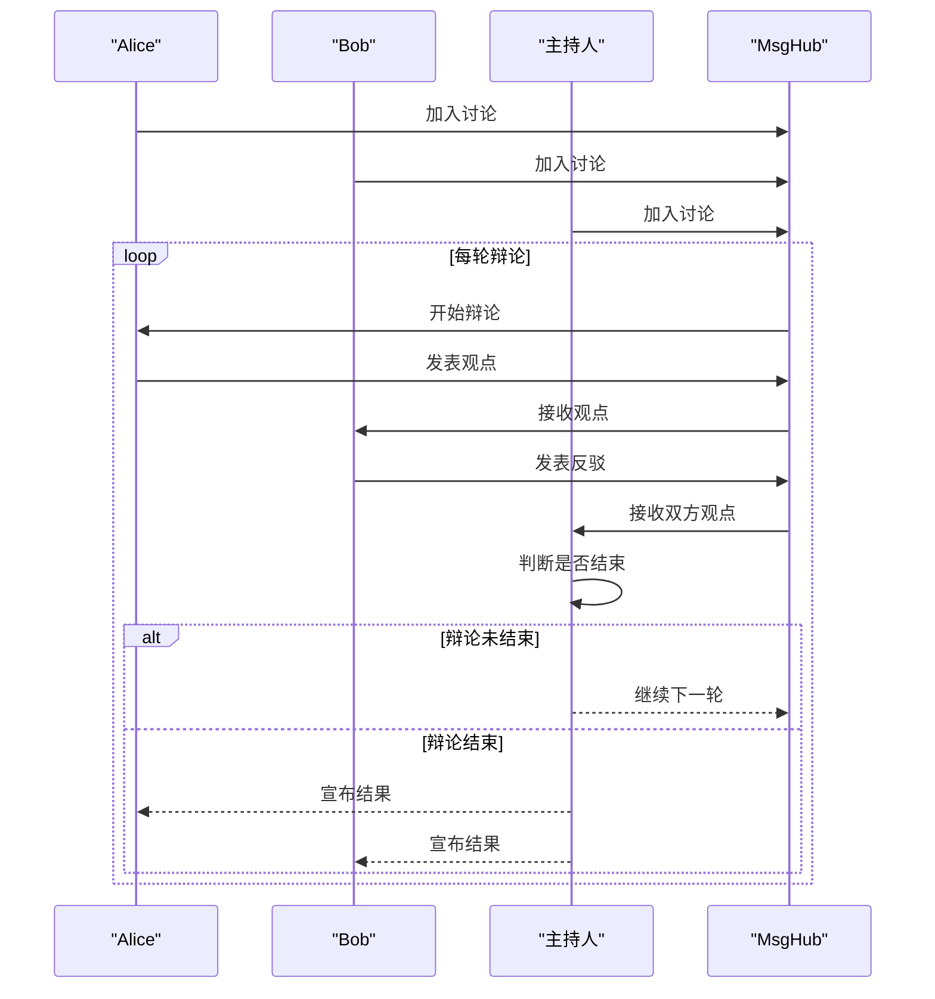
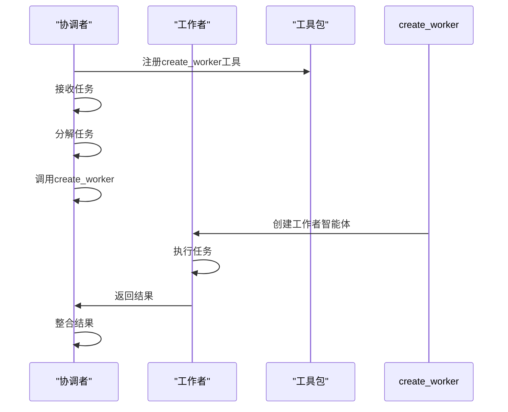
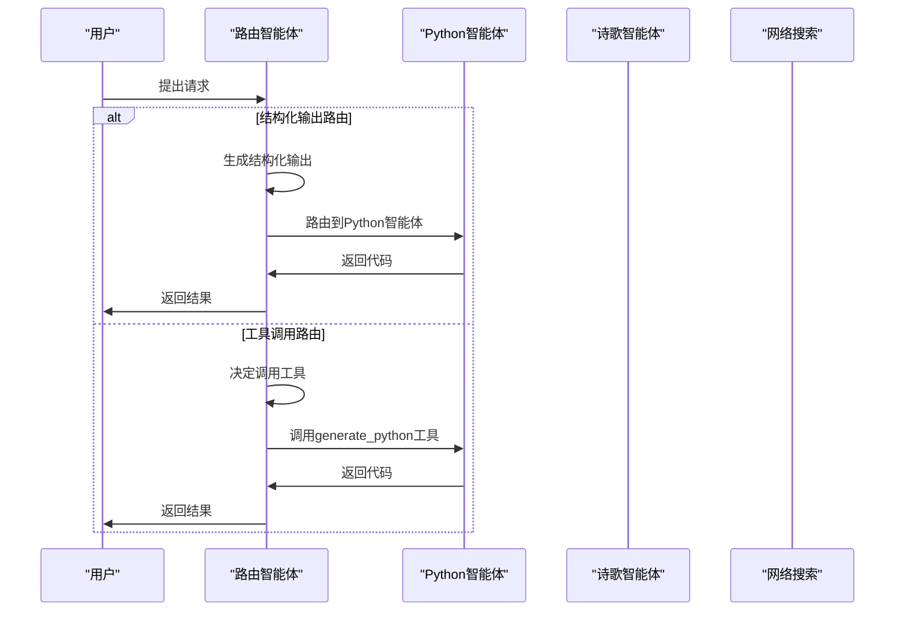
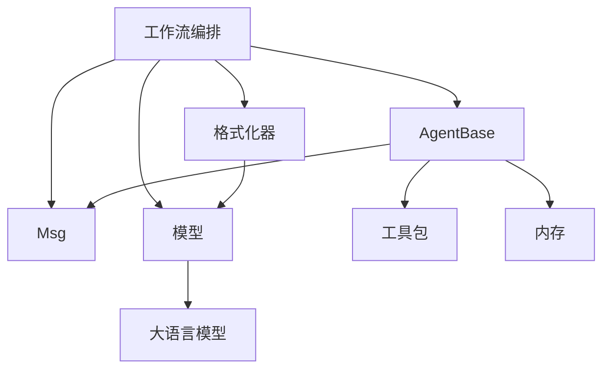

# 工作流编排API

<cite>
**本文档中引用的文件**  
- [__init__.py](file://src/agentscope/pipeline/__init__.py)
- [_functional.py](file://src/agentscope/pipeline/_functional.py)
- [_class.py](file://src/agentscope/pipeline/_class.py)
- [_msghub.py](file://src/agentscope/pipeline/_msghub.py)
- [workflow_concurrent_agents.py](file://docs/tutorial/zh_CN/src/workflow_concurrent_agents.py)
- [workflow_multiagent_debate.py](file://docs/tutorial/zh_CN/src/workflow_multiagent_debate.py)
- [workflow_handoffs.py](file://docs/tutorial/zh_CN/src/workflow_handoffs.py)
- [workflow_routing.py](file://docs/tutorial/zh_CN/src/workflow_routing.py)
- [main.py](file://examples/workflows/multiagent_concurrent/main.py)
- [main.py](file://examples/workflows/multiagent_conversation/main.py)
- [main.py](file://examples/workflows/multiagent_debate/main.py)
- [_agent_base.py](file://src/agentscope/agent/_agent_base.py)
</cite>

## 目录
1. [简介](#简介)
2. [项目结构](#项目结构)
3. [核心组件](#核心组件)
4. [架构概述](#架构概述)
5. [详细组件分析](#详细组件分析)
6. [依赖分析](#依赖分析)
7. [性能考虑](#性能考虑)
8. [故障排除指南](#故障排除指南)
9. [结论](#结论)
10. [附录](#附录)（如有必要）

## 简介
本文档详细记录了AgentScope框架中工作流编排模块的完整API参考。文档涵盖了函数式和类式工作流定义接口，包括顺序执行、并发执行和条件分支的编程模式。详细说明了MsgHub消息中枢的创建、订阅和发布机制，以及多智能体通信的路由规则。文档还包含了工作流状态监控、中断恢复和超时控制的API配置，以及性能指标采集接口，包括执行时长、消息吞吐量和错误率统计。最后，提供了复杂工作流（如辩论模式、代理交接）的构建模板和最佳实践示例。

## 项目结构
工作流编排模块位于`src/agentscope/pipeline`目录下，主要由三个核心文件组成：`_functional.py`提供函数式工作流接口，`_class.py`提供类式工作流接口，`_msghub.py`提供消息中枢功能。这些模块通过`__init__.py`文件导出，形成统一的API接口。此外，`docs/tutorial/zh_CN/src/`目录下提供了多个工作流模式的教程示例，`examples/workflows/`目录下包含了实际应用示例。

```mermaid
graph TD
subgraph "工作流编排模块"
pipeline[__init__.py]
functional[_functional.py]
class[_class.py]
msghub[_msghub.py]
end
subgraph "教程示例"
tutorial[docs/tutorial/zh_CN/src/]
workflow_concurrent[workflow_concurrent_agents.py]
workflow_debate[workflow_multiagent_debate.py]
workflow_handoffs[workflow_handoffs.py]
workflow_routing[workflow_routing.py]
end
subgraph "应用示例"
examples[examples/workflows/]
concurrent[multiagent_concurrent/main.py]
conversation[multiagent_conversation/main.py]
debate[multiagent_debate/main.py]
end
pipeline --> functional
pipeline --> class
pipeline --> msghub
tutorial --> workflow_concurrent
tutorial --> workflow_debate
tutorial --> workflow_handoffs
tutorial --> workflow_routing
examples --> concurrent
examples --> conversation
examples --> debate
```

**图示来源**  
- [__init__.py](file://src/agentscope/pipeline/__init__.py)
- [workflow_concurrent_agents.py](file://docs/tutorial/zh_CN/src/workflow_concurrent_agents.py)
- [main.py](file://examples/workflows/multiagent_concurrent/main.py)

**本节来源**  
- [__init__.py](file://src/agentscope/pipeline/__init__.py)
- [workflow_concurrent_agents.py](file://docs/tutorial/zh_CN/src/workflow_concurrent_agents.py)

## 核心组件
工作流编排模块的核心组件包括函数式工作流接口、类式工作流接口和消息中枢（MsgHub）。函数式接口提供了`sequential_pipeline`和`fanout_pipeline`两个主要函数，分别用于顺序执行和并发执行多个智能体。类式接口提供了`SequentialPipeline`和`FanoutPipeline`两个类，它们封装了相应的函数式接口，提供了可重用的工作流实例。消息中枢`MsgHub`则提供了一个上下文管理器，用于在多个智能体之间共享消息。

**本节来源**  
- [__init__.py](file://src/agentscope/pipeline/__init__.py)
- [_functional.py](file://src/agentscope/pipeline/_functional.py)
- [_class.py](file://src/agentscope/pipeline/_class.py)
- [_msghub.py](file://src/agentscope/pipeline/_msghub.py)

## 架构概述
工作流编排模块的架构设计遵循了函数式和面向对象两种编程范式。函数式接口提供了简洁的API，适合一次性工作流的创建；类式接口则提供了更丰富的配置选项和可重用性，适合复杂和重复使用的工作流场景。消息中枢`MsgHub`采用了上下文管理器的设计模式，通过`__aenter__`和`__aexit__`方法实现了资源的自动管理和释放。整个模块通过异步编程模型实现了高效的并发执行能力。



**图示来源**  
- [_functional.py](file://src/agentscope/pipeline/_functional.py)
- [_class.py](file://src/agentscope/pipeline/_class.py)
- [_msghub.py](file://src/agentscope/pipeline/_msghub.py)
- [_agent_base.py](file://src/agentscope/agent/_agent_base.py)

## 详细组件分析

### 函数式工作流接口分析
函数式工作流接口提供了三个主要函数：`sequential_pipeline`、`fanout_pipeline`和`stream_printing_messages`。`sequential_pipeline`函数实现了智能体的顺序执行，前一个智能体的输出作为后一个智能体的输入。`fanout_pipeline`函数实现了智能体的并发执行，将相同的消息分发给多个智能体，并收集它们的响应。`stream_printing_messages`函数则用于收集和流式输出智能体的打印消息。

#### 函数式工作流类图


**图示来源**  
- [_functional.py](file://src/agentscope/pipeline/_functional.py)
- [_agent_base.py](file://src/agentscope/agent/_agent_base.py)

**本节来源**  
- [_functional.py](file://src/agentscope/pipeline/_functional.py)

### 类式工作流接口分析
类式工作流接口提供了`SequentialPipeline`和`FanoutPipeline`两个类，它们封装了相应的函数式接口，提供了可重用的工作流实例。`SequentialPipeline`类通过`__init__`方法接收智能体列表，并通过`__call__`方法执行顺序工作流。`FanoutPipeline`类除了接收智能体列表外，还可以配置`enable_gather`参数来控制是否并发执行。

#### 类式工作流类图


**图示来源**  
- [_class.py](file://src/agentscope/pipeline/_class.py)
- [_functional.py](file://src/agentscope/pipeline/_functional.py)

**本节来源**  
- [_class.py](file://src/agentscope/pipeline/_class.py)

### 消息中枢（MsgHub）分析
`MsgHub`类提供了一个消息共享机制，允许多个智能体在一个上下文中共享消息。通过`__aenter__`和`__aexit__`方法，`MsgHub`实现了上下文管理器的功能，确保在进入和退出上下文时正确地管理订阅关系。`MsgHub`支持自动广播和手动广播两种模式，可以通过`enable_auto_broadcast`参数进行配置。

#### 消息中枢类图


**图示来源**  
- [_msghub.py](file://src/agentscope/pipeline/_msghub.py)
- [_agent_base.py](file://src/agentscope/agent/_agent_base.py)
- [_message_base.py](file://src/agentscope/message/_message_base.py)

**本节来源**  
- [_msghub.py](file://src/agentscope/pipeline/_msghub.py)

### 复杂工作流模式分析
复杂工作流模式包括多智能体辩论、代理交接和路由等。多智能体辩论模式通过`MsgHub`实现多个智能体之间的消息共享和讨论。代理交接模式通过工具调用的方式实现主智能体与子智能体之间的任务交接。路由模式则通过结构化输出或工具调用来决定消息的流向。

#### 多智能体辩论序列图


**图示来源**  
- [workflow_multiagent_debate.py](file://docs/tutorial/zh_CN/src/workflow_multiagent_debate.py)
- [main.py](file://examples/workflows/multiagent_debate/main.py)

**本节来源**  
- [workflow_multiagent_debate.py](file://docs/tutorial/zh_CN/src/workflow_multiagent_debate.py)
- [main.py](file://examples/workflows/multiagent_debate/main.py)

#### 代理交接序列图


**图示来源**  
- [workflow_handoffs.py](file://docs/tutorial/zh_CN/src/workflow_handoffs.py)
- [main.py](file://examples/workflows/multiagent_concurrent/main.py)

**本节来源**  
- [workflow_handoffs.py](file://docs/tutorial/zh_CN/src/workflow_handoffs.py)

#### 路由模式序列图


**图示来源**  
- [workflow_routing.py](file://docs/tutorial/zh_CN/src/workflow_routing.py)

**本节来源**  
- [workflow_routing.py](file://docs/tutorial/zh_CN/src/workflow_routing.py)

## 依赖分析
工作流编排模块依赖于多个核心组件，包括智能体基类`AgentBase`、消息类`Msg`、格式化器、模型等。`AgentBase`提供了智能体的基本功能，如`reply`、`observe`等方法。`Msg`类用于封装消息内容和元数据。格式化器负责将消息转换为模型可接受的格式。模型则负责实际的推理和生成。



**图示来源**  
- [_functional.py](file://src/agentscope/pipeline/_functional.py)
- [_class.py](file://src/agentscope/pipeline/_class.py)
- [_msghub.py](file://src/agentscope/pipeline/_msghub.py)
- [_agent_base.py](file://src/agentscope/agent/_agent_base.py)

**本节来源**  
- [_functional.py](file://src/agentscope/pipeline/_functional.py)
- [_class.py](file://src/agentscope/pipeline/_class.py)
- [_msghub.py](file://src/agentscope/pipeline/_msghub.py)
- [_agent_base.py](file://src/agentscope/agent/_agent_base.py)

## 性能考虑
工作流编排模块通过异步编程模型实现了高效的并发执行能力。`fanout_pipeline`函数通过`asyncio.gather`实现了智能体的并发执行，大大提高了执行效率。`MsgHub`通过上下文管理器的设计模式，减少了资源的重复创建和销毁。对于长时间运行的任务，建议使用`stream_printing_messages`函数来实时获取和处理中间结果。

## 故障排除指南
在使用工作流编排模块时，可能会遇到一些常见问题。例如，智能体无法正确接收消息，可能是由于没有正确加入`MsgHub`。并发执行效率低下，可能是由于`enable_gather`参数设置为`False`。对于复杂工作流的调试，建议使用`stream_printing_messages`函数来监控中间结果。

**本节来源**  
- [_functional.py](file://src/agentscope/pipeline/_functional.py)
- [_msghub.py](file://src/agentscope/pipeline/_msghub.py)
- [workflow_concurrent_agents.py](file://docs/tutorial/zh_CN/src/workflow_concurrent_agents.py)

## 结论
工作流编排模块提供了灵活且强大的API，支持多种工作流模式的创建和管理。通过函数式和类式两种接口，开发者可以根据具体需求选择合适的编程范式。消息中枢`MsgHub`为多智能体通信提供了优雅的解决方案。结合教程和示例，开发者可以快速上手并构建复杂的多智能体系统。

## 附录
### API参考表
| 函数/类 | 参数 | 返回值 | 描述 |
|--------|------|-------|------|
| sequential_pipeline | agents, msg | Msg \| list[Msg] \| None | 顺序执行多个智能体 |
| fanout_pipeline | agents, msg, enable_gather, **kwargs | list[Msg] | 并发执行多个智能体 |
| stream_printing_messages | agents, coroutine_task, queue, end_signal, yield_speech | AsyncGenerator | 流式输出智能体打印消息 |
| SequentialPipeline | agents | None | 顺序工作流类 |
| FanoutPipeline | agents, enable_gather | None | 并发工作流类 |
| MsgHub | participants, announcement, enable_auto_broadcast, name | None | 消息中枢类 |

**本节来源**  
- [_functional.py](file://src/agentscope/pipeline/_functional.py)
- [_class.py](file://src/agentscope/pipeline/_class.py)
- [_msghub.py](file://src/agentscope/pipeline/_msghub.py)