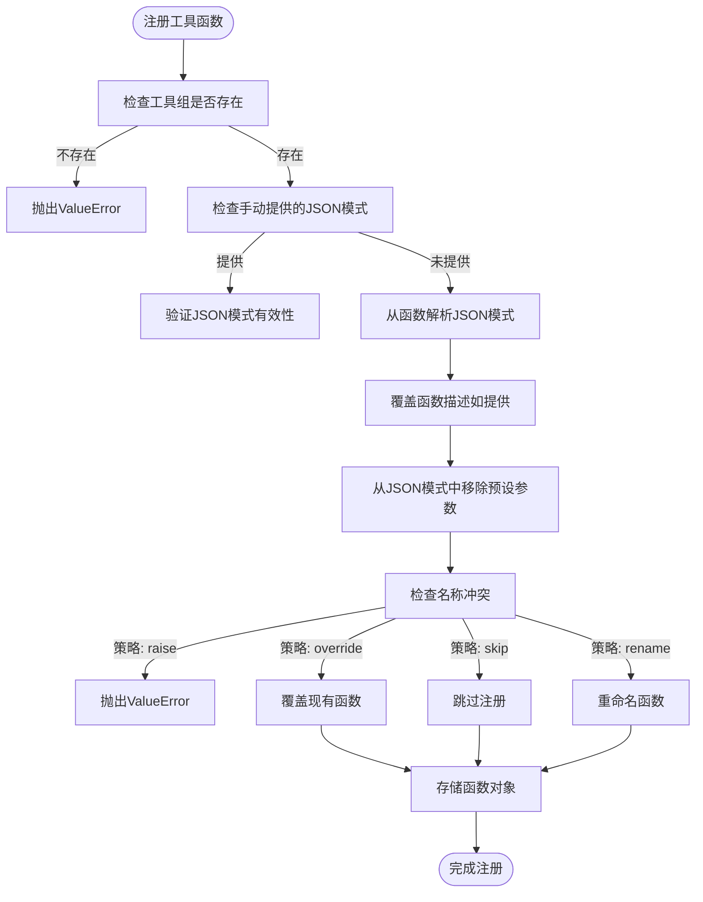
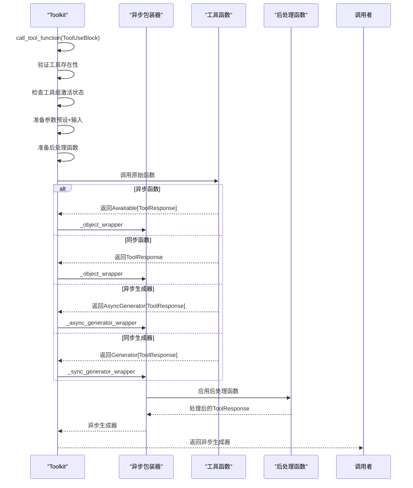
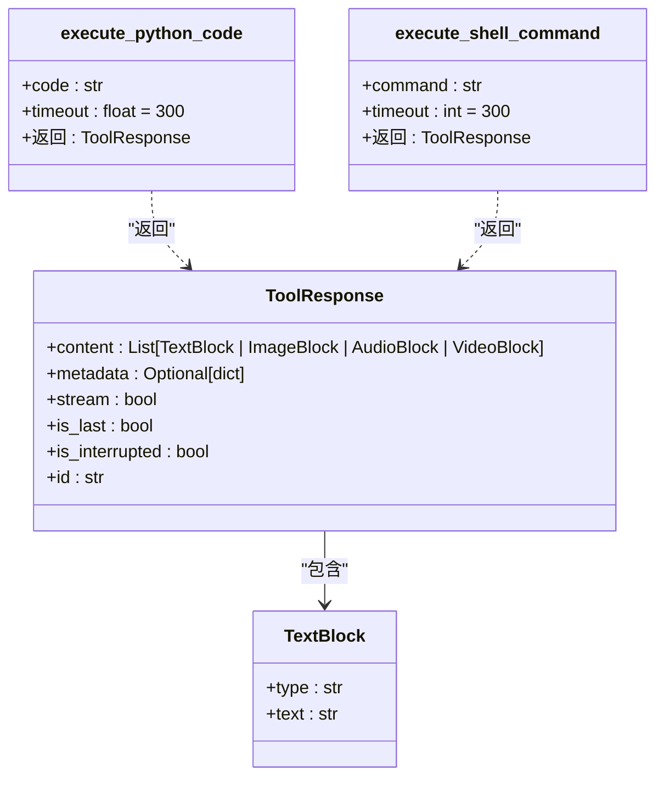
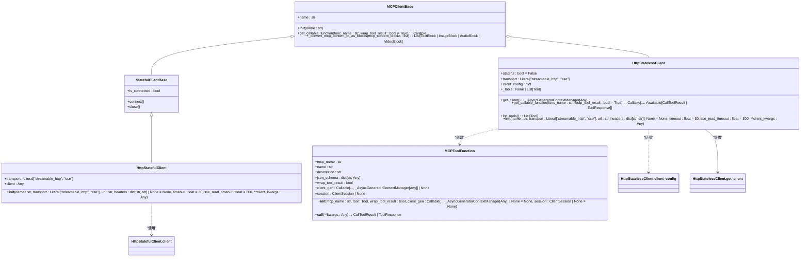
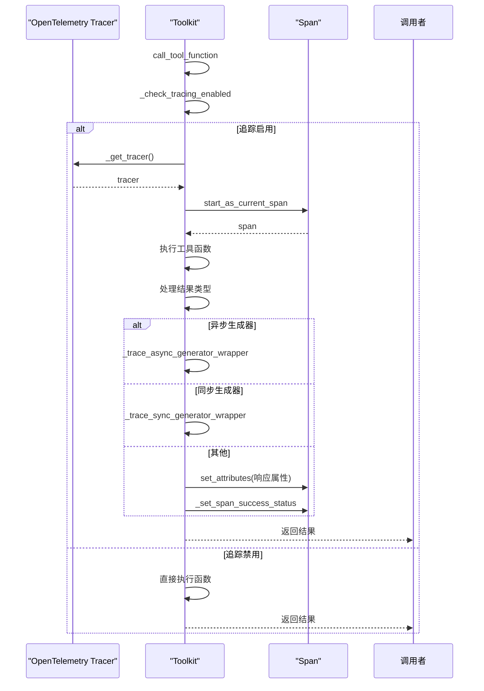

# 工具系统API

<cite>
**本文档中引用的文件**
- [__init__.py](file://src\agentscope\tool\__init__.py)
- [_toolkit.py](file://src\agentscope\tool\_toolkit.py)
- [_async_wrapper.py](file://src\agentscope\tool\_async_wrapper.py)
- [_response.py](file://src\agentscope\tool\_response.py)
- [_types.py](file://src\agentscope\tool\_types.py)
- [_python.py](file://src\agentscope\tool\_coding\_python.py)
- [_shell.py](file://src\agentscope\tool\_coding\_shell.py)
- [__init__.py](file://src\agentscope\tool\_coding\__init__.py)
- [__init__.py](file://src\agentscope\mcp\__init__.py)
- [_client_base.py](file://src\agentscope\mcp\_client_base.py)
- [_mcp_function.py](file://src\agentscope\mcp\_mcp_function.py)
- [_http_stateful_client.py](file://src\agentscope\mcp\_http_stateful_client.py)
- [_http_stateless_client.py](file://src\agentscope\mcp\_http_stateless_client.py)
- [_trace.py](file://src\agentscope\tracing\_trace.py)
</cite>

## 目录
1. [简介](#简介)
2. [工具包注册与管理](#工具包注册与管理)
3. [自定义工具装饰器与参数验证](#自定义工具装饰器与参数验证)
4. [异步执行模式与错误包装](#异步执行模式与错误包装)
5. [内置工具安全限制与运行环境](#内置工具安全限制与运行环境)
6. [MCP客户端接口](#mcp客户端接口)
7. [工具调用链路追踪与性能监控](#工具调用链路追踪与性能监控)
8. [工具权限控制与沙箱执行](#工具权限控制与沙箱执行)

## 简介
工具系统API提供了完整的工具管理框架，支持工具函数的注册、调用和管理。系统通过Toolkit类实现核心功能，包括工具分组管理、MCP客户端集成、Agent技能注册等。工具函数可以是同步或异步的，但必须返回ToolResponse对象或其生成器。系统支持从函数文档字符串自动解析JSON模式，并提供统一的流式接口。

**本文档中引用的文件**
- [__init__.py](file://src\agentscope\tool\__init__.py#L1-L45)
- [_toolkit.py](file://src\agentscope\tool\_toolkit.py#L1-L1127)

## 工具包注册与管理
Toolkit类是工具系统的核心模块，负责注册、管理和删除工具函数、MCP客户端和Agent技能。工具函数可以按组进行管理，支持激活/停用状态控制。通过create_tool_group方法创建工具组，使用register_tool_function方法注册工具函数，支持多种名称冲突处理策略。

```mermaid
classDiagram
class Toolkit {
+tools : dict[str, RegisteredToolFunction]
+groups : dict[str, ToolGroup]
+skills : dict[str, AgentSkill]
+create_tool_group(group_name : str, description : str, active : bool = False, notes : str | None = None)
+update_tool_groups(group_names : list[str], active : bool)
+remove_tool_groups(group_names : str | list[str])
+register_tool_function(tool_func : ToolFunction, group_name : str | Literal["basic"] = "basic", preset_kwargs : dict[str, JSONSerializableObject] | None = None, func_description : str | None = None, json_schema : dict | None = None, include_long_description : bool = True, include_var_positional : bool = False, include_var_keyword : bool = False, postprocess_func : Callable[[ToolUseBlock, ToolResponse], ToolResponse | None] | Callable[[ToolUseBlock, ToolResponse], Awaitable[ToolResponse | None]] | None = None, namesake_strategy : Literal["override", "skip", "raise", "rename"] = "raise")
+remove_tool_function(tool_name : str, allow_not_exist : bool = True)
+get_json_schemas() list[dict]
+set_extended_model(func_name : str, model : Type[BaseModel] | None)
+call_tool_function(tool_call : ToolUseBlock) AsyncGenerator[ToolResponse, None]
+register_mcp_client(mcp_client : MCPClientBase, group_name : str = "basic", enable_funcs : list[str] | None = None, disable_funcs : list[str] | None = None, preset_kwargs_mapping : dict[str, dict[str, Any]] | None = None, postprocess_func : Callable[[ToolUseBlock, ToolResponse], ToolResponse | None] | Callable[[ToolUseBlock, ToolResponse], Awaitable[ToolResponse | None]] | None = None, namesake_strategy : Literal["override", "skip", "raise", "rename"] = "raise")
}
class RegisteredToolFunction {
+name : str
+group : str | Literal["basic"]
+source : Literal["function", "mcp_server", "function_group"]
+original_func : ToolFunction
+json_schema : dict
+preset_kwargs : dict[str, JSONSerializableObject]
+original_name : str | None
+extended_model : Type[BaseModel] | None
+mcp_name : str | None
+postprocess_func : Callable[[ToolUseBlock, ToolResponse], ToolResponse | None] | Callable[[ToolUseBlock, ToolResponse], Awaitable[ToolResponse | None]] | None
+extended_json_schema : dict
}
class ToolGroup {
+name : str
+active : bool
+description : str
+notes : str | None
}
Toolkit --> RegisteredToolFunction : "包含"
Toolkit --> ToolGroup : "包含"
```

**图源**
- [_toolkit.py](file://src\agentscope\tool\_toolkit.py#L55-L804)
- [_types.py](file://src\agentscope\tool\_types.py#L15-L157)

**本文档中引用的文件**
- [_toolkit.py](file://src\agentscope\tool\_toolkit.py#L55-L804)
- [_types.py](file://src\agentscope\tool\_types.py#L15-L157)

## 自定义工具装饰器与参数验证
工具系统支持通过装饰器模式注册工具函数，自动从文档字符串解析JSON模式。参数验证规则通过Pydantic BaseModel实现，支持动态扩展工具函数的JSON模式。register_tool_function方法支持手动提供JSON模式，或从函数签名和文档字符串自动提取。preset_kwargs参数允许预设不暴露给代理的参数。

**图源**
- [_toolkit.py](file://src\agentscope\tool\_toolkit.py#L206-L443)

**本文档中引用的文件**
- [_toolkit.py](file://src\agentscope\tool\_toolkit.py#L206-L443)

## 异步执行模式与错误包装
工具系统提供统一的异步执行接口，支持同步函数、异步函数、同步生成器和异步生成器。通过_async_wrapper模块中的包装器，所有返回类型都被转换为异步生成器。错误包装机制在_postprocess_tool_response函数中实现，支持同步和异步后处理函数。工具调用被@trace_toolkit装饰器追踪。

**图源**
- [_toolkit.py](file://src\agentscope\tool\_toolkit.py#L594-L725)
- [_async_wrapper.py](file://src\agentscope\tool\_async_wrapper.py#L38-L110)

**本文档中引用的文件**
- [_toolkit.py](file://src\agentscope\tool\_toolkit.py#L594-L725)
- [_async_wrapper.py](file://src\agentscope\tool\_async_wrapper.py#L38-L110)

## 内置工具安全限制与运行环境
系统提供内置工具用于Python代码和Shell命令执行，均在沙箱环境中运行。execute_python_code在临时目录中创建.py文件并执行，通过timeout参数限制执行时间。execute_shell_command直接执行shell命令，同样受timeout限制。两个工具都捕获标准输出、标准错误和返回码，并在超时时终止进程。

**图源**
- [_python.py](file://src\agentscope\tool\_coding\_python.py#L17-L91)
- [_shell.py](file://src\agentscope\tool\_coding\_shell.py#L12-L78)
- [_response.py](file://src\agentscope\tool\_response.py#L11-L33)

**本文档中引用的文件**
- [_python.py](file://src\agentscope\tool\_coding\_python.py#L17-L91)
- [_shell.py](file://src\agentscope\tool\_coding\_shell.py#L12-L78)
- [_response.py](file://src\agentscope\tool\_response.py#L11-L33)

## MCP客户端接口
MCP客户端接口支持状态化和非状态化连接，提供函数发现、请求序列化和响应解析功能。HttpStatefulClient维护会话状态，适合需要保持状态的服务器；HttpStatelessClient为无状态客户端，每次调用创建新会话。通过register_mcp_client方法将MCP客户端工具注册到工具包。

**图源**
- [_client_base.py](file://src\agentscope\mcp\_client_base.py#L18-L102)
- [_http_stateful_client.py](file://src\agentscope\mcp\_http_stateful_client.py#L11-L85)
- [_http_stateless_client.py](file://src\agentscope\mcp\_http_stateless_client.py#L16-L149)
- [_mcp_function.py](file://src\agentscope\mcp\_mcp_function.py#L14-L87)

**本文档中引用的文件**
- [_client_base.py](file://src\agentscope\mcp\_client_base.py#L18-L102)
- [_http_stateful_client.py](file://src\agentscope\mcp\_http_stateful_client.py#L11-L85)
- [_http_stateless_client.py](file://src\agentscope\mcp\_http_stateless_client.py#L16-L149)
- [_mcp_function.py](file://src\agentscope\mcp\_mcp_function.py#L14-L87)

## 工具调用链路追踪与性能监控
系统通过OpenTelemetry实现工具调用链路追踪，使用@trace_toolkit装饰器追踪call_tool_function方法。追踪信息包括请求属性、响应属性和操作名称。支持同步和异步生成器的追踪，通过_trace_async_generator_wrapper和_trace_sync_generator_wrapper实现。性能监控数据可通过配置的追踪端点收集。

**图源**
- [_trace.py](file://src\agentscope\tracing\_trace.py#L322-L367)
- [_toolkit.py](file://src\agentscope\tool\_toolkit.py#L594-L725)

**本文档中引用的文件**
- [_trace.py](file://src\agentscope\tracing\_trace.py#L322-L367)
- [_toolkit.py](file://src\agentscope\tool\_toolkit.py#L594-L725)

## 工具权限控制与沙箱执行
工具权限通过工具组的激活状态控制，只有激活组中的工具才包含在JSON模式中。内置工具在沙箱环境中执行，Python代码在临时目录中运行，Shell命令受超时限制。preset_kwargs参数允许预设不暴露给代理的参数，实现细粒度的权限控制。通过remove_tool_function和remove_tool_groups方法实现工具的动态移除。

**本文档中引用的文件**
- [_toolkit.py](file://src\agentscope\tool\_toolkit.py#L119-L204)
- [_python.py](file://src\agentscope\tool\_coding\_python.py#L38-L80)
- [_shell.py](file://src\agentscope\tool\_coding\_shell.py#L33-L65)