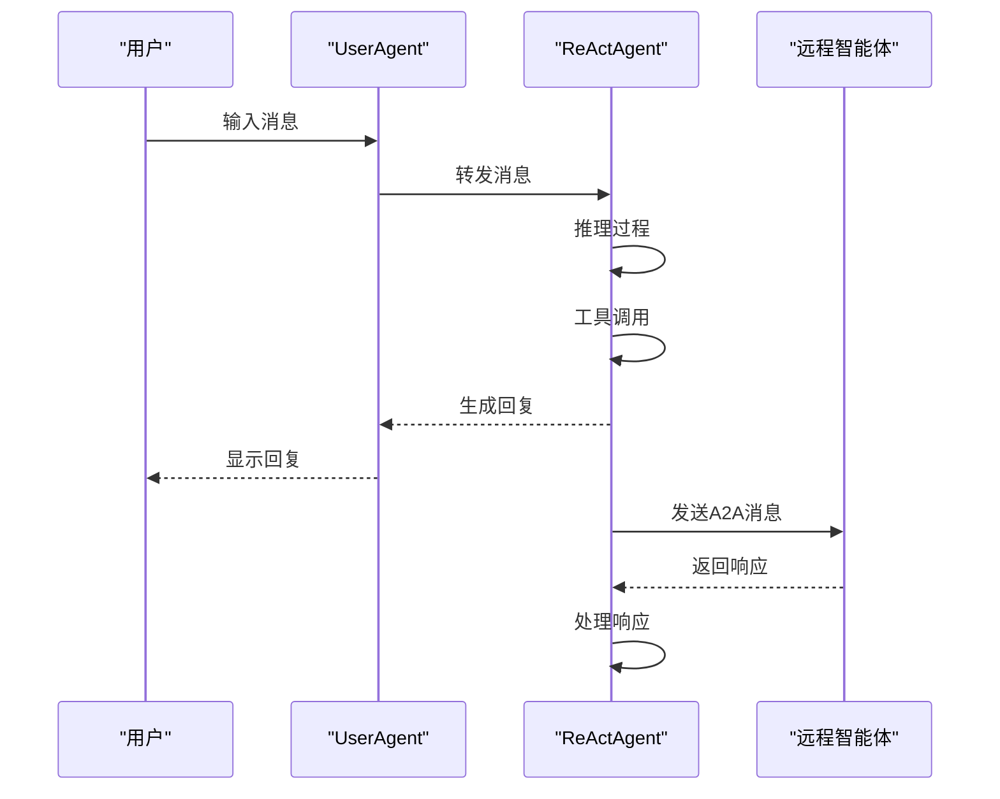

# 智能体API

<cite>
**本文档中引用的文件**   
- [agent_base.py](file://src/agentscope/agent/_agent_base.py)
- [react_agent.py](file://src/agentscope/agent/_react_agent.py)
- [user_agent.py](file://src/agentscope/agent/_user_agent.py)
- [a2a_agent.py](file://src/agentscope/agent/_a2a_agent.py)
- [react_agent_base.py](file://src/agentscope/agent/_react_agent_base.py)
- [user_input.py](file://src/agentscope/agent/_user_input.py)
- [message_base.py](file://src/agentscope/message/_message_base.py)
- [msghub.py](file://src/agentscope/pipeline/_msghub.py)
</cite>

## 目录
1. [简介](#简介)
2. [核心类概述](#核心类概述)
3. [AgentBase类](#agentbase类)
4. [ReActAgent类](#reactagent类)
5. [UserAgent类](#useragent类)
6. [A2AAgent类](#a2aagent类)
7. [消息系统与交互流程](#消息系统与交互流程)
8. [多智能体协作机制](#多智能体协作机制)
9. [配置选项与运行时控制](#配置选项与运行时控制)
10. [异常处理与生命周期管理](#异常处理与生命周期管理)

## 简介
本文档详细介绍了智能体模块的完整API参考，涵盖AgentBase、ReActAgent、UserAgent和A2AAgent等核心类的构造函数、方法签名、参数说明、返回值类型和异常处理机制。文档还提供了每个方法的使用示例，包括异步调用模式和消息交互流程，以及智能体配置选项、运行时行为控制参数和生命周期管理接口。

## 核心类概述
智能体模块提供了多种类型的智能体实现，每种类型都有其特定的适用场景和功能特性。核心类包括：

- **AgentBase**: 所有智能体的基类，提供基本的消息处理、钩子机制和生命周期管理功能
- **ReActAgent**: 基于ReAct算法的智能体实现，支持实时控制、API工具调用和结构化输出生成
- **UserAgent**: 用于处理用户交互的智能体，可以从不同来源获取用户输入
- **A2AAgent**: 实现A2A（Agent-to-Agent）协议的智能体，支持与远程智能体通信

这些智能体类通过消息系统进行交互，支持异步调用模式和复杂的消息路由机制。

## AgentBase类

AgentBase是所有智能体的基类，提供了智能体的基本功能和接口。它定义了智能体的核心行为模式，包括消息观察、回复生成和生命周期管理。

### 构造函数
```python
def __init__(self) -> None:
    """初始化智能体。"""
```

### 核心方法
**observe方法**
```python
async def observe(self, msg: Msg | list[Msg] | None) -> None:
    """接收给定的消息而不生成回复。

    Args:
        msg (`Msg | list[Msg] | None`):
            要观察的消息。
    """
```
该方法用于接收消息，但不生成回复。子类需要实现具体的消息处理逻辑。

**reply方法**
```python
async def reply(self, *args: Any, **kwargs: Any) -> Msg:
    """智能体的主要逻辑，根据当前状态和输入参数生成回复。"""
```
这是智能体的核心方法，负责生成回复消息。所有子类都必须实现此方法。

**print方法**
```python
async def print(
    self,
    msg: Msg,
    last: bool = True,
    speech: AudioBlock | list[AudioBlock] | None = None,
) -> None:
    """显示消息的函数。

    Args:
        msg (`Msg`):
            要打印的消息对象。
        last (`bool`, defaults to `True`):
            这是否是流式消息中的最后一个。对于非流式消息，此值应始终为True。
        speech (`AudioBlock | list[AudioBlock] | None`, optional):
            要播放的音频内容块。
    """
```
该方法用于显示消息，支持文本和音频内容的输出。

**interrupt方法**
```python
async def interrupt(self, msg: Msg | list[Msg] | None = None) -> None:
    """中断当前的回复过程。"""
```
该方法用于中断智能体的当前回复过程，通常在用户请求中断时调用。

**钩子管理方法**
AgentBase提供了多种钩子管理方法，允许在不同执行阶段插入自定义逻辑：

- `register_instance_hook`: 为智能体实例注册钩子
- `remove_instance_hook`: 移除实例级别的钩子
- `register_class_hook`: 为智能体类注册类级别钩子
- `remove_class_hook`: 移除类级别钩子

**控制台输出控制**
```python
def set_console_output_enabled(self, enabled: bool) -> None:
    """启用或禁用智能体的控制台输出。

    Args:
        enabled (`bool`):
            如果为True，则启用控制台输出；如果为False，则禁用控制台输出。
    """
```
该方法允许在运行时控制智能体的控制台输出，适用于生产环境以避免混乱的日志输出。

**消息队列控制**
```python
def set_msg_queue_enabled(
    self,
    enabled: bool,
    queue: Queue | None = None,
) -> None:
    """启用或禁用用于流式输出的消息队列。

    Args:
        enabled (`bool`):
            如果为True，则启用消息队列以允许流式输出；如果为False，则禁用消息队列。
        queue (`Queue | None`, optional):
            用于初始化消息队列的队列实例。
    """
```
该方法控制消息队列的启用状态，支持流式输出功能。

**Section sources**
- [agent_base.py](file://src/agentscope/agent/_agent_base.py#L150-L733)

## ReActAgent类

ReActAgent是基于ReAct算法的智能体实现，支持实时控制、API工具调用和结构化输出生成。它是智能体模块中最复杂和功能最丰富的智能体类型。

### 构造函数
```python
def __init__(
    self,
    name: str,
    sys_prompt: str,
    model: ChatModelBase,
    formatter: FormatterBase,
    toolkit: Toolkit | None = None,
    memory: MemoryBase | None = None,
    long_term_memory: LongTermMemoryBase | None = None,
    long_term_memory_mode: Literal[
        "agent_control",
        "static_control",
        "both",
    ] = "both",
    enable_meta_tool: bool = False,
    parallel_tool_calls: bool = False,
    knowledge: KnowledgeBase | list[KnowledgeBase] | None = None,
    enable_rewrite_query: bool = True,
    plan_notebook: PlanNotebook | None = None,
    print_hint_msg: bool = False,
    max_iters: int = 10,
    tts_model: TTSModelBase | None = None,
) -> None:
    """初始化ReAct智能体"""
```

**参数说明：**
- `name`: 智能体名称
- `sys_prompt`: 系统提示词
- `model`: 用于智能体的聊天模型
- `formatter`: 用于格式化消息的格式化器
- `toolkit`: 包含工具函数的工具包
- `memory`: 用于存储对话历史的内存
- `long_term_memory`: 可选的长期记忆
- `long_term_memory_mode`: 长期记忆模式
- `enable_meta_tool`: 是否启用元工具
- `parallel_tool_calls`: 是否并行执行工具调用
- `knowledge`: 智能体使用的知识库
- `enable_rewrite_query`: 是否重写用户输入查询
- `plan_notebook`: 计划笔记本实例
- `print_hint_msg`: 是否打印提示消息
- `max_iters`: 推理-行动循环的最大迭代次数
- `tts_model`: 智能体使用的TTS模型

### 核心方法
**reply方法**
```python
@trace_reply
async def reply(
    self,
    msg: Msg | list[Msg] | None = None,
    structured_model: Type[BaseModel] | None = None,
) -> Msg:
    """根据当前状态和输入参数生成回复。"""
```
该方法实现了ReAct智能体的核心逻辑，包括推理、行动和循环控制。它支持结构化输出生成和工具调用。

**_reasoning方法**
```python
async def _reasoning(
    self,
    tool_choice: Literal["auto", "none", "required"] | None = None,
) -> Msg:
    """执行推理过程。"""
```
该方法负责智能体的推理过程，将消息格式化为模型API所需的格式并调用模型。

**_acting方法**
```python
async def _acting(self, tool_call: ToolUseBlock) -> dict | None:
    """执行行动过程，并在完成函数调用中返回结构化输出（如果已验证）。"""
```
该方法执行工具调用并处理结果，支持异步生成器处理。

**handle_interrupt方法**
```python
async def handle_interrupt(
    self,
    msg: Msg | list[Msg] | None = None,
    structured_model: Type[BaseModel] | None = None,
) -> Msg:
    """当回复被用户或其他因素中断时的后处理逻辑。"""
```
该方法处理中断情况，返回一个标准的中断响应消息。

**generate_response方法**
```python
def generate_response(
    self,
    **kwargs: Any,
) -> ToolResponse:
    """通过此函数生成所需的结构化输出并返回。"""
```
该方法用于生成结构化输出，是ReActAgent支持结构化输出的关键方法。

**性能特征**
ReActAgent具有以下性能特征：
- 支持并行工具调用，提高执行效率
- 内置最大迭代次数限制，防止无限循环
- 支持流式输出，提供实时反馈
- 集成TTS模型，支持语音输出

**适用场景**
ReActAgent适用于需要复杂决策和工具调用的场景，如：
- 复杂任务分解和执行
- 需要调用外部API的智能助手
- 需要长期记忆和知识检索的应用
- 需要结构化输出的数据处理任务

**Section sources**
- [react_agent.py](file://src/agentscope/agent/_react_agent.py#L53-L800)
- [react_agent_base.py](file://src/agentscope/agent/_react_agent_base.py#L12-L117)

## UserAgent类

UserAgent类用于处理用户交互，允许开发者从不同来源（如Web UI、CLI和其他界面）处理用户输入。

### 构造函数
```python
def __init__(
    self,
    name: str,
) -> None:
    """使用名称初始化用户智能体。"""
```

### 核心方法
**reply方法**
```python
async def reply(
    self,
    msg: Msg | list[Msg] | None = None,
    structured_model: Type[BaseModel] | None = None,
) -> Msg:
    """接收输入消息并生成来自用户的回复消息。"""
```
该方法从指定的输入方法获取输入数据，并生成回复消息。

**输入方法管理**
UserAgent支持两种输入方法管理方式：

**实例级别输入方法覆盖**
```python
def override_instance_input_method(
    self,
    input_method: UserInputBase,
) -> None:
    """覆盖当前UserAgent实例的输入方法。"""
```

**类级别输入方法覆盖**
```python
@classmethod
def override_class_input_method(
    cls,
    input_method: UserInputBase,
) -> None:
    """覆盖当前UserAgent类的输入方法。"""
```

### 内置输入方法
UserAgent模块提供了多种内置输入方法：

**TerminalUserInput**
```python
class TerminalUserInput(UserInputBase):
    """终端用户输入。"""
    
    def __init__(self, input_hint: str = "User Input: ") -> None:
        """使用提示初始化终端用户输入。"""
```
该类处理来自终端的用户输入，支持结构化输入的交互式输入。

**StudioUserInput**
```python
class StudioUserInput(UserInputBase):
    """在AgentScope Studio上托管用户输入的类。"""
```
该类通过WebSocket连接到AgentScope Studio，支持在Web界面上获取用户输入。

**适用场景**
UserAgent适用于需要与用户交互的场景，如：
- 命令行应用程序
- Web界面交互
- 图形用户界面
- 多模态用户交互

**Section sources**
- [user_agent.py](file://src/agentscope/agent/_user_agent.py#L21-L129)
- [user_input.py](file://src/agentscope/agent/_user_input.py#L68-L416)

## A2AAgent类

A2AAgent是AgentScope中A2A协议的实现，支持使用A2A标准协议与远程智能体通信。

### 构造函数
```python
def __init__(
    self,
    agent_card: AgentCard,
    client_config: ClientConfig | None = None,
    consumers: list[Consumer] | None = None,
    additional_transport_producers: dict[str, TransportProducer]
    | None = None,
) -> None:
    """通过给定的智能体卡片初始化A2A智能体实例。"""
```

**参数说明：**
- `agent_card`: 包含远程智能体信息的智能体卡片
- `client_config`: A2A客户端的配置
- `consumers`: 用于处理A2A客户端事件的消费者列表
- `additional_transport_producers`: 用于创建具有特定传输协议的A2A客户端的额外传输生产者

### 核心方法
**observe方法**
```python
async def observe(self, msg: Msg | list[Msg] | None) -> None:
    """接收给定的消息而不生成回复。"""
```
该方法将观察到的消息存储起来，并在调用reply时与输入消息合并。

**reply方法**
```python
async def reply(
    self,
    msg: Msg | list[Msg] | None = None,
    **kwargs: Any,
) -> Msg:
    """向远程A2A智能体发送消息并接收响应。"""
```
该方法将观察到的消息与输入消息合并，发送到远程智能体，并清除处理后的观察消息。

**状态管理方法**
```python
def state_dict(self) -> dict:
    """获取A2A智能体的状态字典。"""

def load_state_dict(self, state_dict: dict, strict: bool = True) -> None:
    """将状态字典加载到模块中。"""
```
这些方法支持A2AAgent的状态序列化和反序列化，便于状态持久化和恢复。

### 限制说明
A2AAgent有以下限制：
- 仅支持聊天机器人场景（用户和助手）的交互
- 不支持reply()方法中的结构化输出
- 存储观察到的消息并在reply()调用时与输入消息合并

### 适用场景
A2AAgent适用于需要与远程智能体通信的场景，如：
- 分布式智能体系统
- 跨平台智能体协作
- 微服务架构中的智能体通信
- 云原生智能体应用

**Section sources**
- [a2a_agent.py](file://src/agentscope/agent/_a2a_agent.py#L48-L289)

## 消息系统与交互流程

智能体模块的消息系统基于Msg类实现，支持多种消息类型和复杂的交互流程。

### 消息类结构
```python
class Msg:
    """智能体中的消息类。"""
    
    def __init__(
        self,
        name: str,
        content: str | Sequence[ContentBlock],
        role: Literal["user", "assistant", "system"],
        metadata: dict[str, JSONSerializableObject] | None = None,
        timestamp: str | None = None,
        invocation_id: str | None = None,
    ) -> None:
        """初始化Msg对象。"""
```

**消息块类型**
消息内容可以包含多种类型的块：
- TextBlock: 文本内容块
- ToolUseBlock: 工具使用块
- ImageBlock: 图像内容块
- AudioBlock: 音频内容块
- VideoBlock: 视频内容块
- ToolResultBlock: 工具结果块

### 消息交互流程
智能体之间的消息交互遵循以下流程：



**Diagram sources**
- [message_base.py](file://src/agentscope/message/_message_base.py#L24-L242)
- [agent_base.py](file://src/agentscope/agent/_agent_base.py#L185-L203)

## 多智能体协作机制

智能体模块提供了强大的多智能体协作机制，支持复杂的智能体间交互和协作。

### MsgHub类
MsgHub类用于在一组智能体之间共享消息，实现自动广播和消息同步。

```python
class MsgHub:
    """MsgHub类，用于控制参与智能体的订阅。"""
    
    def __init__(
        self,
        participants: Sequence[AgentBase],
        announcement: list[Msg] | Msg | None = None,
        enable_auto_broadcast: bool = True,
        name: str | None = None,
    ) -> None:
        """初始化MsgHub上下文管理器。"""
```

**核心功能**
- 自动广播：任何参与者的回复消息都会自动广播给所有其他参与者
- 手动广播：支持手动调用broadcast方法发送消息
- 动态参与者管理：支持在运行时添加或删除参与者
- 自动订阅管理：在进入和退出上下文时自动管理订阅关系

### 使用示例
```python
with MsgHub(participant=[agent1, agent2, agent3]):
    agent1()
    agent2()
```

此代码块等效于手动管理消息广播：
```python
x1 = agent1()
agent2.observe(x1)
agent3.observe(x1)

x2 = agent2()
agent1.observe(x2)
agent3.observe(x2)
```

### 协作模式
智能体模块支持多种协作模式：

**消息路由机制**
- 基于MsgHub的自动广播
- 点对点直接消息传递
- 基于主题的消息订阅

**状态同步机制**
- 通过共享内存实现状态同步
- 通过消息传递实现状态更新
- 基于钩子的事件驱动状态同步

**错误传播机制**
- 异常在智能体间传播
- 中断信号的传递和处理
- 错误消息的广播和记录

**Section sources**
- [msghub.py](file://src/agentscope/pipeline/_msghub.py#L14-L157)

## 配置选项与运行时控制

智能体模块提供了丰富的配置选项和运行时控制参数，允许开发者灵活地控制智能体的行为。

### 智能体配置选项
**通用配置**
- `name`: 智能体名称
- `id`: 智能体唯一标识符
- `disable_console_output`: 控制台输出禁用标志

**ReActAgent特定配置**
- `max_iters`: 最大迭代次数
- `parallel_tool_calls`: 并行工具调用标志
- `print_hint_msg`: 提示消息打印标志
- `enable_rewrite_query`: 查询重写标志

**A2AAgent特定配置**
- `agent_card`: 远程智能体卡片
- `client_config`: 客户端配置
- `consumers`: 事件消费者列表

### 运行时行为控制
智能体模块提供了多种运行时控制接口：

**输出控制**
- `set_console_output_enabled`: 控制控制台输出
- `set_msg_queue_enabled`: 控制消息队列
- `print`: 手动打印消息

**生命周期控制**
- `interrupt`: 中断当前执行
- `handle_interrupt`: 处理中断
- `observe`: 观察消息
- `reply`: 生成回复

**状态管理**
- `state_dict`: 获取状态字典
- `load_state_dict`: 加载状态字典
- `register_state`: 注册状态变量

### 环境变量控制
智能体模块支持通过环境变量控制行为：

- `AGENTSCOPE_DISABLE_CONSOLE_OUTPUT`: 禁用控制台输出
- `DASHSCOPE_API_KEY`: DashScope API密钥
- 其他模型特定的API密钥环境变量

**Section sources**
- [agent_base.py](file://src/agentscope/agent/_agent_base.py#L172-L178)
- [react_agent.py](file://src/agentscope/agent/_react_agent.py#L73-L134)

## 异常处理与生命周期管理

智能体模块提供了完善的异常处理机制和生命周期管理接口，确保智能体的稳定运行。

### 异常处理机制
**中断处理**
```python
async def handle_interrupt(
    self,
    *args: Any,
    **kwargs: Any,
) -> Msg:
    """当回复被用户或其他因素中断时的后处理逻辑。"""
```
该方法在智能体执行被中断时调用，允许进行清理和生成中断响应。

**异常传播**
智能体模块使用标准的Python异常处理机制：
- `NotImplementedError`: 未实现的方法
- `ValueError`: 无效的参数值
- `KeyError`: 缺少必需的键
- `RuntimeError`: 运行时错误

**错误恢复**
智能体模块支持多种错误恢复策略：
- 自动重试
- 状态回滚
- 降级模式

### 生命周期管理
**初始化**
- `__init__`: 构造函数，初始化智能体状态
- `super().__init__()`: 调用父类初始化

**执行阶段**
- `reply`: 主要执行逻辑
- `observe`: 消息观察
- `print`: 消息输出

**清理阶段**
- `__del__`: 析构函数，清理资源
- 连接断开
- 内存释放

### 生命周期钩子
智能体模块提供了多种生命周期钩子：

**类级别钩子**
- `_class_pre_reply_hooks`: 回复前钩子
- `_class_post_reply_hooks`: 回复后钩子
- `_class_pre_print_hooks`: 打印前钩子
- `_class_post_print_hooks`: 打印后钩子

**实例级别钩子**
- `_instance_pre_reply_hooks`: 实例回复前钩子
- `_instance_post_reply_hooks`: 实例回复后钩子
- `_instance_pre_observe_hooks`: 实例观察前钩子
- `_instance_post_observe_hooks`: 实例观察后钩子

这些钩子允许在智能体生命周期的关键点插入自定义逻辑，实现灵活的扩展和监控。

**Section sources**
- [agent_base.py](file://src/agentscope/agent/_agent_base.py#L474-L484)
- [user_agent.py](file://src/agentscope/agent/_user_agent.py#L115-L125)