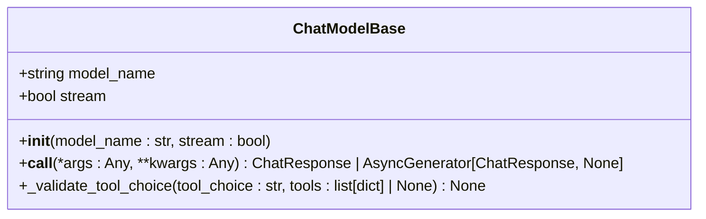
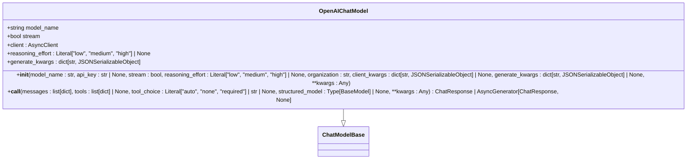
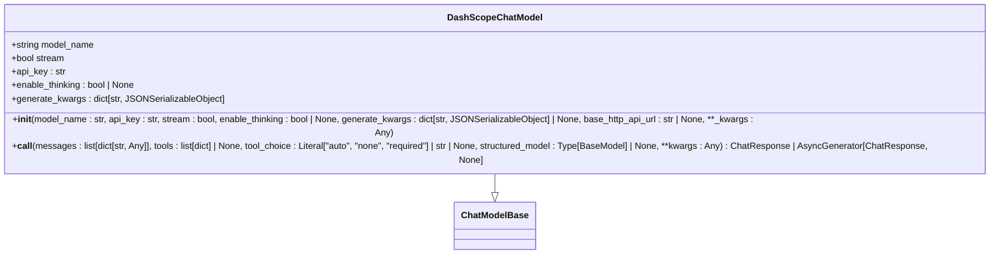
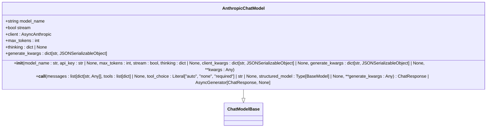
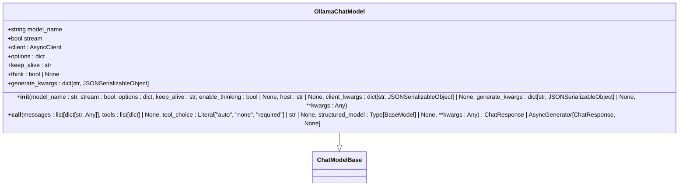
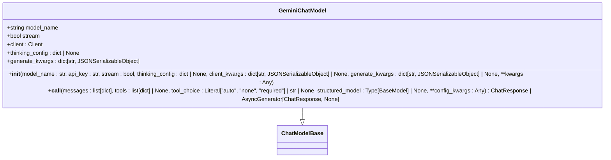
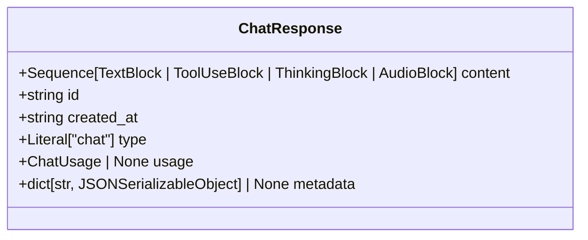
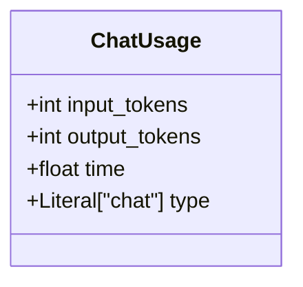
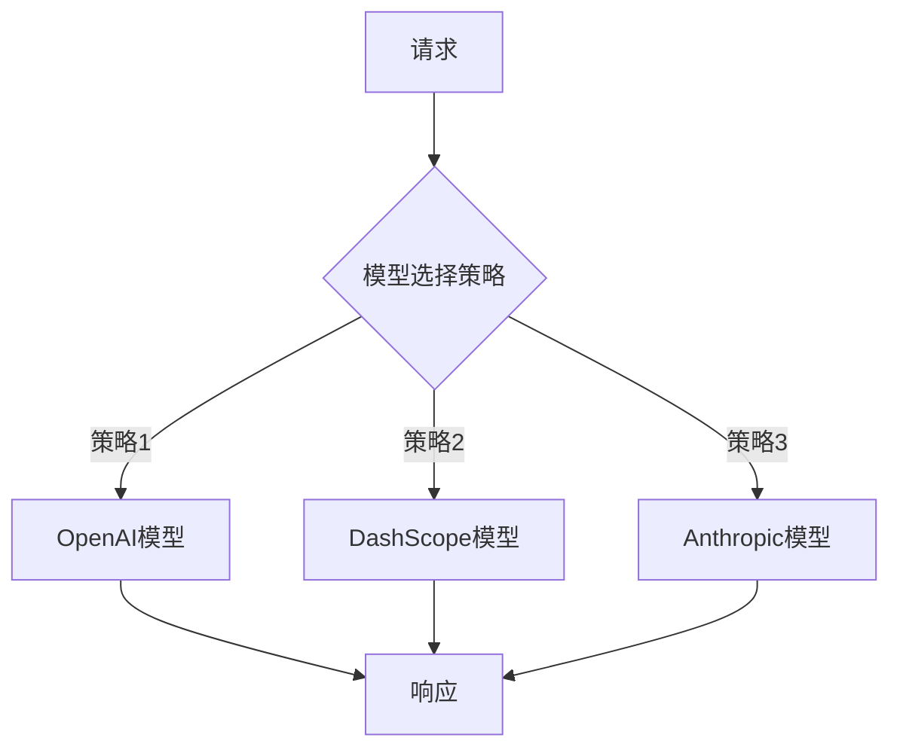

# 模型API

<cite>
**本文档引用的文件**
- [model_base.py](file://src/agentscope/model/_model_base.py)
- [openai_model.py](file://src/agentscope/model/_openai_model.py)
- [dashscope_model.py](file://src/agentscope/model/_dashscope_model.py)
- [anthropic_model.py](file://src/agentscope/model/_anthropic_model.py)
- [ollama_model.py](file://src/agentscope/model/_ollama_model.py)
- [gemini_model.py](file://src/agentscope/model/_gemini_model.py)
- [model_response.py](file://src/agentscope/model/_model_response.py)
- [model_usage.py](file://src/agentscope/model/_model_usage.py)
</cite>

## 目录
1. [简介](#简介)
2. [模型抽象基类](#模型抽象基类)
3. [具体模型实现](#具体模型实现)
4. [认证与配置](#认证与配置)
5. [响应对象结构](#响应对象结构)
6. [性能优化建议](#性能优化建议)
7. [多模型切换与负载均衡](#多模型切换与负载均衡)

## 简介
本API参考文档详细介绍了AgentScope框架中模型集成模块的完整接口。文档涵盖了`ModelBase`抽象基类及其具体实现类（如`OpenAIModel`、`DashScopeModel`、`AnthropicModel`、`OllamaModel`）的接口定义，包括模型初始化参数、推理调用方法、流式响应处理、token计数接口和错误处理策略。同时，文档化了不同LLM提供商的认证配置方式、区域端点设置和模型版本指定方法，以及响应对象结构、使用统计信息和延迟指标。最后，提供了性能优化建议和多模型切换编程接口。

**Section sources**
- [model_base.py](file://src/agentscope/model/_model_base.py#L1-L78)
- [openai_model.py](file://src/agentscope/model/_openai_model.py#L1-L580)

## 模型抽象基类
`ChatModelBase`是所有聊天模型的抽象基类，定义了所有模型实现必须遵循的接口和基本功能。



**Diagram sources**
- [model_base.py](file://src/agentscope/model/_model_base.py#L13-L78)

### 核心属性
- **model_name**: 模型名称
- **stream**: 模型输出是否为流式

### 初始化方法
```python
def __init__(
    self,
    model_name: str,
    stream: bool,
) -> None:
    """
    初始化聊天模型基类。

    Args:
        model_name (`str`):
            模型名称
        stream (`bool`):
            模型输出是否为流式
    """
```

### 调用方法
`__call__`方法是所有模型实现的核心，用于执行模型推理。该方法返回`ChatResponse`对象或`AsyncGenerator[ChatResponse, None]`（流式响应）。

### 工具选择验证
`_validate_tool_choice`方法用于验证`tool_choice`参数的有效性，确保其值在预定义的模式中或与可用工具匹配。

**Section sources**
- [model_base.py](file://src/agentscope/model/_model_base.py#L13-L78)

## 具体模型实现
本节详细介绍了各个LLM提供商的具体模型实现类。

### OpenAI模型
`OpenAIChatModel`类封装了OpenAI API的功能。



**Diagram sources**
- [openai_model.py](file://src/agentscope/model/_openai_model.py#L66-L580)

#### 初始化参数
- **model_name**: 模型名称
- **api_key**: API密钥，若未指定则从环境变量`OPENAI_API_KEY`读取
- **stream**: 是否使用流式输出
- **reasoning_effort**: 推理努力程度，支持o3、o4等模型
- **organization**: 组织ID，若未指定则从环境变量`OPENAI_ORGANIZATION`读取
- **client_kwargs**: 用于初始化OpenAI客户端的额外关键字参数
- **generate_kwargs**: 用于API生成的额外关键字参数，如`temperature`、`seed`

#### 推理调用
`__call__`方法接受消息列表、工具列表、工具选择模式和结构化模型等参数，返回响应对象。

**Section sources**
- [openai_model.py](file://src/agentscope/model/_openai_model.py#L66-L580)

### DashScope模型
`DashScopeChatModel`类封装了阿里云通义千问API的功能。



**Diagram sources**
- [dashscope_model.py](file://src/agentscope/model/_dashscope_model.py#L47-L532)

#### 初始化参数
- **model_name**: 模型名称
- **api_key**: API密钥
- **stream**: 是否使用流式输出
- **enable_thinking**: 是否启用思考模式，仅支持Qwen3、QwQ、DeepSeek-R1等模型
- **generate_kwargs**: 用于API生成的额外关键字参数
- **base_http_api_url**: API请求的基础URL

**Section sources**
- [dashscope_model.py](file://src/agentscope/model/_dashscope_model.py#L47-L532)

### Anthropic模型
`AnthropicChatModel`类封装了Anthropic API的功能。



**Diagram sources**
- [anthropic_model.py](file://src/agentscope/model/_anthropic_model.py#L38-L540)

#### 初始化参数
- **model_name**: 模型名称
- **api_key**: API密钥
- **max_tokens**: 生成的最大token数
- **stream**: 是否使用流式输出
- **thinking**: Claude内部推理过程的配置
- **client_kwargs**: 用于初始化Anthropic客户端的额外关键字参数
- **generate_kwargs**: 用于API生成的额外关键字参数

**Section sources**
- [anthropic_model.py](file://src/agentscope/model/_anthropic_model.py#L38-L540)

### Ollama模型
`OllamaChatModel`类封装了Ollama本地模型的功能。



**Diagram sources**
- [ollama_model.py](file://src/agentscope/model/_ollama_model.py#L32-L353)

#### 初始化参数
- **model_name**: 模型名称
- **stream**: 是否使用流式输出
- **options**: 传递给Ollama API的额外参数
- **keep_alive**: 模型在内存中保持加载的时间
- **enable_thinking**: 是否启用思考模式
- **host**: Ollama服务器的主机地址
- **client_kwargs**: 用于初始化Ollama客户端的额外关键字参数
- **generate_kwargs**: 用于API生成的额外关键字参数

**Section sources**
- [ollama_model.py](file://src/agentscope/model/_ollama_model.py#L32-L353)

### Gemini模型
`GeminiChatModel`类封装了Google Gemini API的功能。



**Diagram sources**
- [gemini_model.py](file://src/agentscope/model/_gemini_model.py#L33-L521)

#### 初始化参数
- **model_name**: 模型名称
- **api_key**: API密钥
- **stream**: 是否使用流式输出
- **thinking_config**: 思考配置，支持2.5 Pro、2.5 Flash等模型
- **client_kwargs**: 用于初始化Gemini客户端的额外关键字参数
- **generate_kwargs**: 用于API生成的额外关键字参数

**Section sources**
- [gemini_model.py](file://src/agentscope/model/_gemini_model.py#L33-L521)

## 认证与配置
不同LLM提供商的认证配置方式如下：

- **OpenAI**: 通过`api_key`参数或环境变量`OPENAI_API_KEY`进行认证
- **DashScope**: 通过`api_key`参数进行认证
- **Anthropic**: 通过`api_key`参数或环境变量`ANTHROPIC_API_KEY`进行认证
- **Ollama**: 本地模型，无需API密钥
- **Gemini**: 通过`api_key`参数进行认证

区域端点设置和模型版本指定通过`model_name`参数完成。

**Section sources**
- [openai_model.py](file://src/agentscope/model/_openai_model.py#L69-L108)
- [dashscope_model.py](file://src/agentscope/model/_dashscope_model.py#L51-L84)
- [anthropic_model.py](file://src/agentscope/model/_anthropic_model.py#L42-L83)
- [ollama_model.py](file://src/agentscope/model/_ollama_model.py#L36-L77)
- [gemini_model.py](file://src/agentscope/model/_gemini_model.py#L37-L77)

## 响应对象结构
模型响应对象的结构由`ChatResponse`类定义。



**Diagram sources**
- [model_response.py](file://src/agentscope/model/_model_response.py#L19-L43)

### 核心属性
- **content**: 响应内容，包含文本块、工具使用块、思考块或音频块
- **id**: 唯一标识符
- **created_at**: 响应创建时间
- **type**: 响应类型，始终为'chat'
- **usage**: 使用信息，包含输入token数、输出token数和使用时间
- **metadata**: 元数据，用于存储结构化输出等信息

使用统计信息和延迟指标通过`ChatUsage`类提供。



**Diagram sources**
- [model_usage.py](file://src/agentscope/model/_model_usage.py#L9-L24)

**Section sources**
- [model_response.py](file://src/agentscope/model/_model_response.py#L19-L43)
- [model_usage.py](file://src/agentscope/model/_model_usage.py#L9-L24)

## 性能优化建议
### 连接池配置
通过`client_kwargs`参数配置连接池，提高并发性能。

### 超时设置
在`client_kwargs`中设置`timeout`参数，避免长时间等待。

### 重试策略
实现自定义重试逻辑，处理网络波动和API限流。

### 流式响应处理
对于长文本生成，使用流式响应以提高用户体验。

**Section sources**
- [openai_model.py](file://src/agentscope/model/_openai_model.py#L69-L108)
- [anthropic_model.py](file://src/agentscope/model/_anthropic_model.py#L42-L83)
- [ollama_model.py](file://src/agentscope/model/_ollama_model.py#L36-L77)

## 多模型切换与负载均衡
通过编程接口实现多模型切换和负载均衡。



**Diagram sources**
- [model_base.py](file://src/agentscope/model/_model_base.py#L13-L78)

**Section sources**
- [model_base.py](file://src/agentscope/model/_model_base.py#L13-L78)