# 计划系统API

<cite>
**本文档中引用的文件**   
- [plan_notebook.py](file://src/agentscope/plan/_plan_notebook.py)
- [plan_model.py](file://src/agentscope/plan/_plan_model.py)
- [storage_base.py](file://src/agentscope/plan/_storage_base.py)
- [in_memory_storage.py](file://src/agentscope/plan/_in_memory_storage.py)
- [main_agent_managed_plan.py](file://examples/functionality/plan/main_agent_managed_plan.py)
- [main_manual_plan.py](file://examples/functionality/plan/main_manual_plan.py)
- [plan_test.py](file://tests/plan_test.py)
</cite>

## 目录
1. [简介](#简介)
2. [核心组件](#核心组件)
3. [任务规划接口](#任务规划接口)
4. [计划存储后端](#计划存储后端)
5. [计划与智能体联动](#计划与智能体联动)
6. [多层级计划管理](#多层级计划管理)
7. [计划可视化与人工干预](#计划可视化与人工干预)
8. [异常恢复策略](#异常恢复策略)

## 简介
计划系统模块为智能体提供了完整的任务规划、执行跟踪和进度管理能力。该系统通过`PlanNotebook`类实现，支持复杂任务的分解、状态跟踪、历史记录和恢复功能。计划系统采用分层架构，包含计划模型、存储后端和执行接口三个核心组件，为智能体提供从任务创建到完成的全生命周期管理。

**Section sources**
- [plan_notebook.py](file://src/agentscope/plan/_plan_notebook.py#L1-L50)
- [plan_model.py](file://src/agentscope/plan/_plan_model.py#L1-L20)

## 核心组件
计划系统由三个核心组件构成：`PlanNotebook`作为主控制器，`Plan`和`SubTask`作为数据模型，以及`PlanStorageBase`作为存储抽象层。这些组件协同工作，实现任务规划的完整功能。

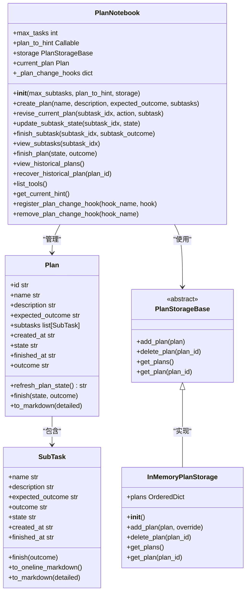

**Diagram sources**
- [plan_notebook.py](file://src/agentscope/plan/_plan_notebook.py#L172-L897)
- [plan_model.py](file://src/agentscope/plan/_plan_model.py#L11-L201)
- [storage_base.py](file://src/agentscope/plan/_storage_base.py#L9-L27)
- [in_memory_storage.py](file://src/agentscope/plan/_in_memory_storage.py#L9-L71)

**Section sources**
- [plan_notebook.py](file://src/agentscope/plan/_plan_notebook.py#L172-L897)
- [plan_model.py](file://src/agentscope/plan/_plan_model.py#L11-L201)

## 任务规划接口
`PlanNotebook`类提供了完整的任务规划接口，包括计划创建、修改、执行和完成等操作。这些接口通过工具函数的形式提供给智能体使用，支持复杂任务的分步执行。

### 计划创建与初始化
通过`create_plan`方法创建新计划，需要提供计划名称、描述、预期结果和子任务列表。如果已有计划存在，新计划将替换当前计划。

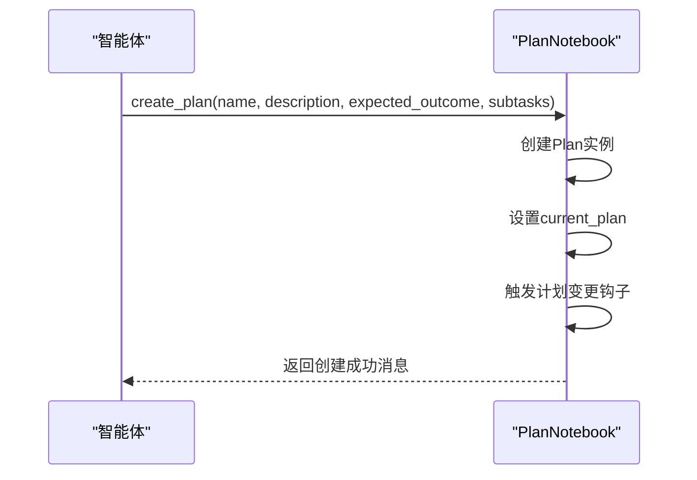

**Diagram sources**
- [plan_notebook.py](file://src/agentscope/plan/_plan_notebook.py#L232-L292)

### 计划修改接口
`revise_current_plan`方法支持对当前计划进行修改，包括添加、修改和删除子任务三种操作。该接口确保计划的灵活性，允许在执行过程中根据实际情况调整计划。

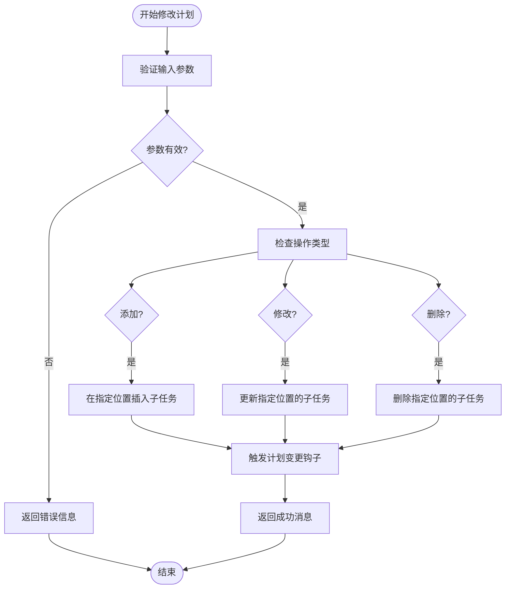

**Diagram sources**
- [plan_notebook.py](file://src/agentscope/plan/_plan_notebook.py#L302-L425)

### 子任务状态管理
`update_subtask_state`和`finish_subtask`方法用于管理子任务的执行状态。系统强制执行顺序约束，确保只有当前子任务完成后才能开始下一个子任务。

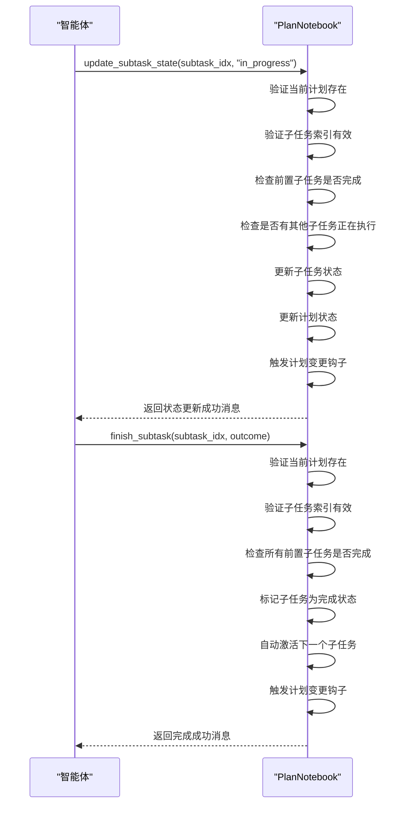

**Diagram sources**
- [plan_notebook.py](file://src/agentscope/plan/_plan_notebook.py#L427-L645)

## 计划存储后端
计划存储系统采用抽象接口设计，支持多种存储实现。当前提供了内存存储作为默认实现，同时为扩展其他存储方式提供了接口。

### 存储接口定义
`PlanStorageBase`是所有计划存储实现的抽象基类，定义了四个核心接口：添加计划、删除计划、获取所有计划和按ID获取计划。

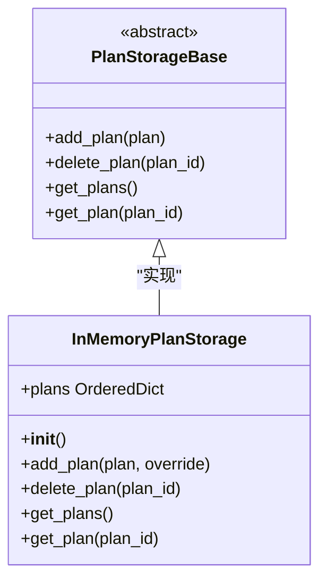

**Diagram sources**
- [storage_base.py](file://src/agentscope/plan/_storage_base.py#L9-L27)
- [in_memory_storage.py](file://src/agentscope/plan/_in_memory_storage.py#L9-L71)

### 内存存储实现
`InMemoryPlanStorage`使用有序字典存储计划，支持计划的序列化和反序列化，确保状态的持久化。

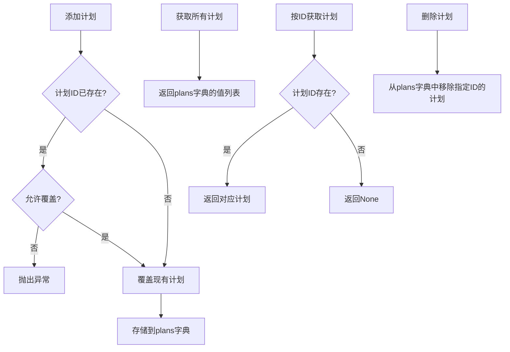

**Diagram sources**
- [in_memory_storage.py](file://src/agentscope/plan/_in_memory_storage.py#L26-L71)

**Section sources**
- [storage_base.py](file://src/agentscope/plan/_storage_base.py#L9-L27)
- [in_memory_storage.py](file://src/agentscope/plan/_in_memory_storage.py#L9-L71)

## 计划与智能体联动
计划系统通过提示生成和状态同步机制与智能体紧密集成，确保智能体能够按照计划执行任务。

### 提示生成机制
`DefaultPlanToHint`类根据当前计划状态生成相应的提示信息，指导智能体下一步操作。系统提供了四种状态的提示模板：无计划、计划开始、子任务进行中和所有子任务完成后。

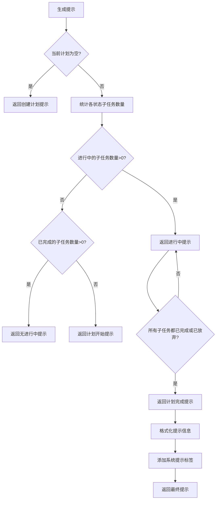

**Diagram sources**
- [plan_notebook.py](file://src/agentscope/plan/_plan_notebook.py#L16-L168)

### 状态同步接口
`get_current_hint`方法获取当前计划的提示信息，`_trigger_plan_change_hooks`方法在计划变更时触发所有注册的钩子函数。

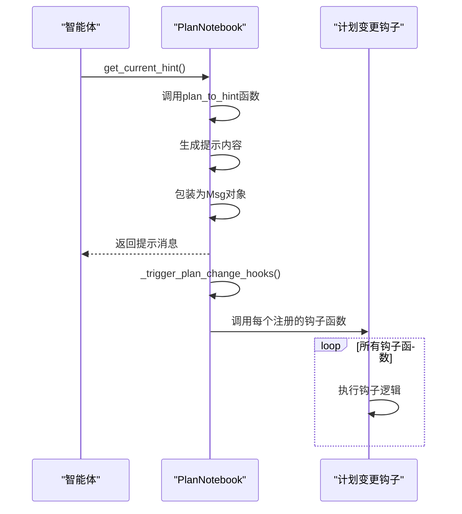

**Diagram sources**
- [plan_notebook.py](file://src/agentscope/plan/_plan_notebook.py#L838-L897)

**Section sources**
- [plan_notebook.py](file://src/agentscope/plan/_plan_notebook.py#L16-L168)
- [plan_notebook.py](file://src/agentscope/plan/_plan_notebook.py#L838-L897)

## 多层级计划管理
计划系统支持多层级任务管理，通过子任务列表实现任务的层次化分解和依赖关系管理。

### 依赖关系与优先级
系统通过子任务的顺序隐式定义依赖关系，强制执行顺序约束。只有当前子任务完成后，才能开始下一个子任务。

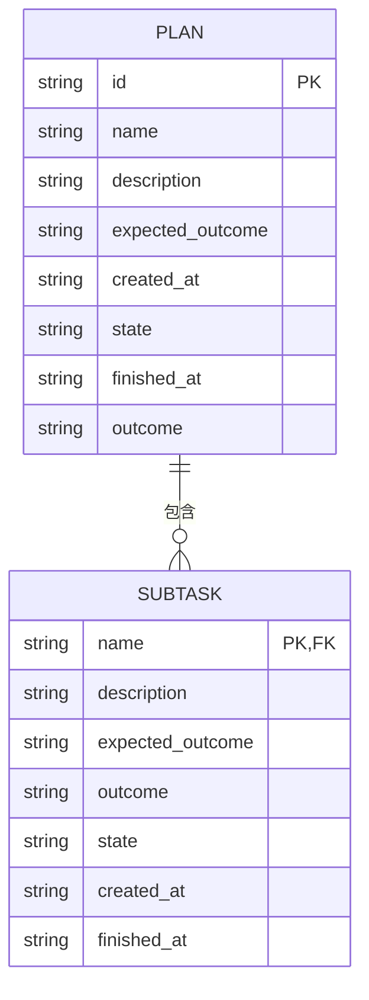

**Diagram sources**
- [plan_model.py](file://src/agentscope/plan/_plan_model.py#L104-L201)

### 优先级调度算法
系统采用简单的顺序调度算法，按照子任务在列表中的顺序依次执行。通过`refresh_plan_state`方法维护计划的整体状态。

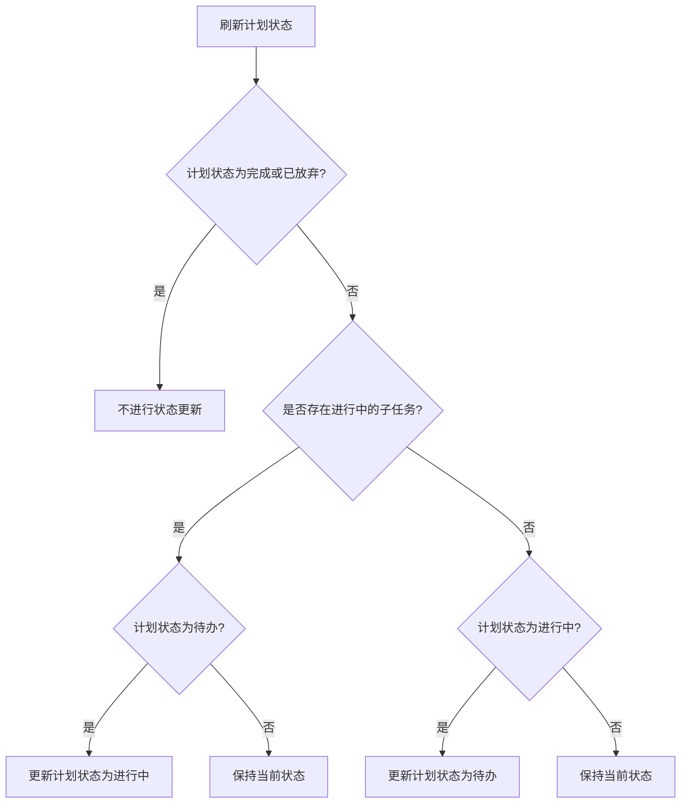

**Diagram sources**
- [plan_model.py](file://src/agentscope/plan/_plan_model.py#L148-L167)

**Section sources**
- [plan_model.py](file://src/agentscope/plan/_plan_model.py#L104-L201)

## 计划可视化与人工干预
计划系统提供了完整的可视化和人工干预接口，支持外部系统监控和干预计划执行过程。

### 可视化接口
通过`register_plan_change_hook`和`remove_plan_change_hook`方法，外部系统可以注册和移除计划变更钩子，实现计划的实时可视化。

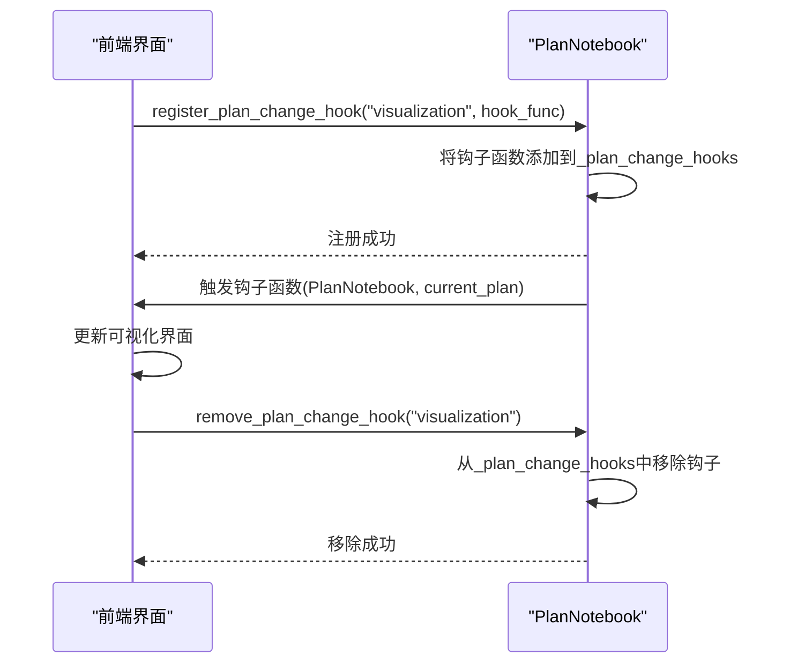

**Diagram sources**
- [plan_notebook.py](file://src/agentscope/plan/_plan_notebook.py#L859-L888)

### 人工干预编程接入
`view_subtasks`和`view_historical_plans`方法提供了计划查看接口，`recover_historical_plan`方法支持从历史计划恢复。

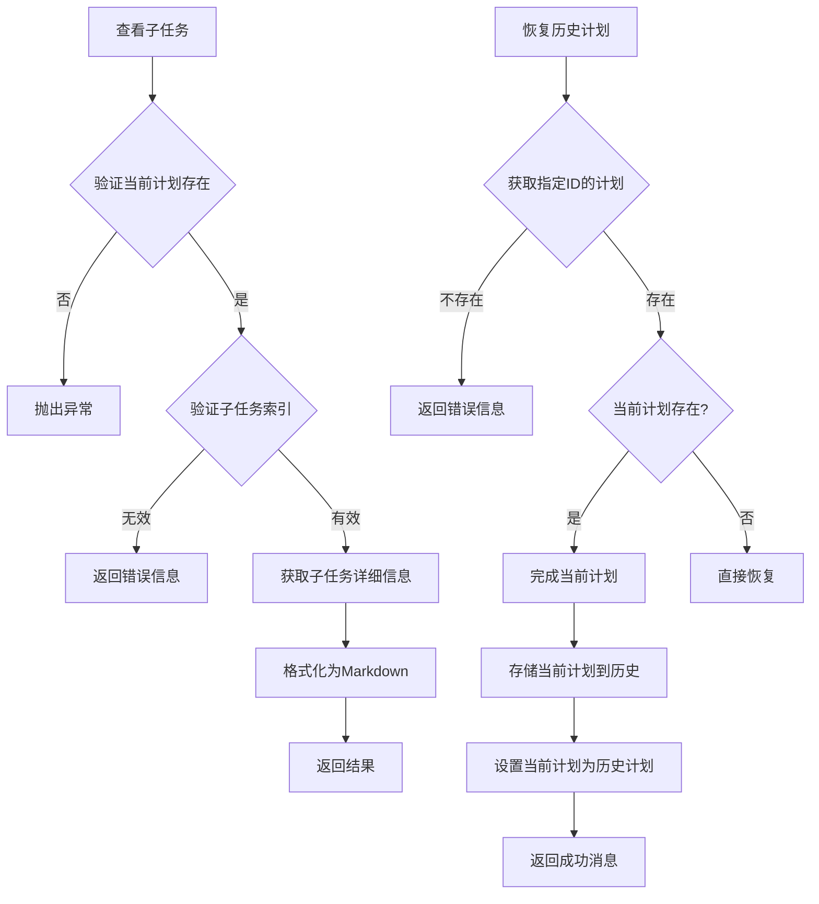

**Diagram sources**
- [plan_notebook.py](file://src/agentscope/plan/_plan_notebook.py#L647-L812)

**Section sources**
- [plan_notebook.py](file://src/agentscope/plan/_plan_notebook.py#L859-L888)
- [plan_notebook.py](file://src/agentscope/plan/_plan_notebook.py#L647-L812)

## 异常恢复策略
计划系统提供了完善的异常恢复机制，确保在意外中断后能够恢复执行状态。

### 状态持久化
通过`state_dict`和`load_state_dict`方法，系统支持计划状态的序列化和反序列化，确保状态的持久化存储。

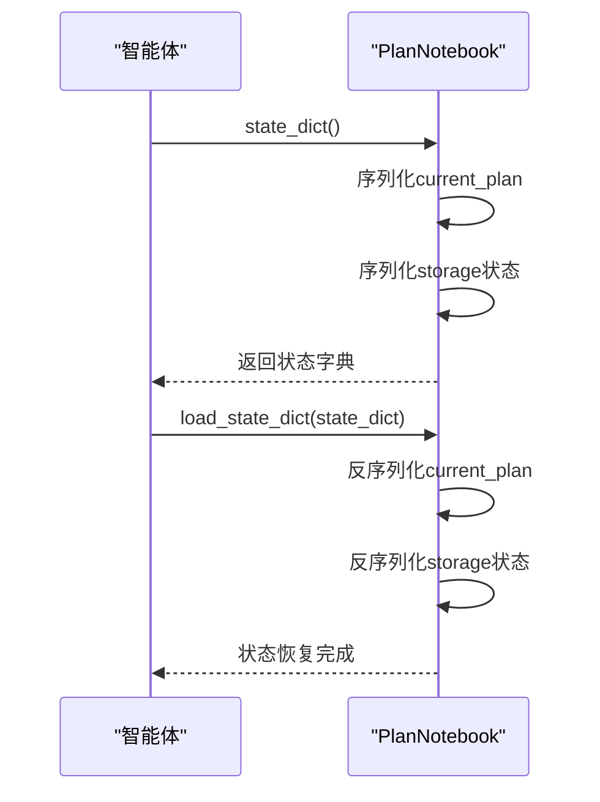

**Diagram sources**
- [plan_notebook.py](file://src/agentscope/plan/_plan_notebook.py#L225-L229)

### 计划完成处理
`finish_plan`方法在完成计划时，会将计划存储到历史记录中，并清理当前计划状态。

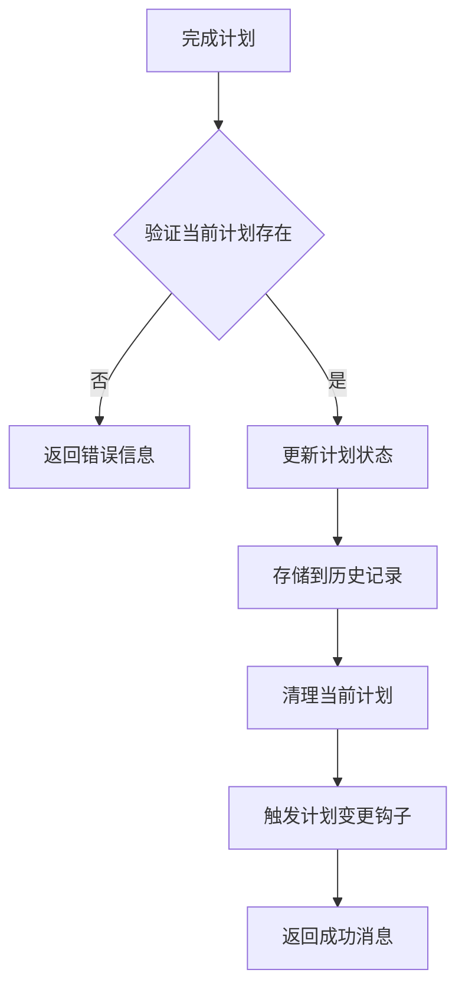

**Diagram sources**
- [plan_notebook.py](file://src/agentscope/plan/_plan_notebook.py#L688-L731)

**Section sources**
- [plan_notebook.py](file://src/agentscope/plan/_plan_notebook.py#L225-L229)
- [plan_notebook.py](file://src/agentscope/plan/_plan_notebook.py#L688-L731)