# 记忆系统API

<cite>
**本文档中引用的文件**   
- [memory_base.py](file://src/agentscope/memory/_memory_base.py)
- [in_memory_memory.py](file://src/agentscope/memory/_in_memory_memory.py)
- [long_term_memory_base.py](file://src/agentscope/memory/_long_term_memory_base.py)
- [mem0_long_term_memory.py](file://src/agentscope/memory/_mem0_long_term_memory.py)
- [reme_long_term_memory_base.py](file://src/agentscope/memory/_reme/_reme_long_term_memory_base.py)
- [reme_personal_long_term_memory.py](file://src/agentscope/memory/_reme/_reme_personal_long_term_memory.py)
- [reme_task_long_term_memory.py](file://src/agentscope/memory/_reme/_reme_task_long_term_memory.py)
- [reme_tool_long_term_memory.py](file://src/agentscope/memory/_reme/_reme_tool_long_term_memory.py)
- [memory_with_compress.py](file://examples/functionality/memory/memory_with_compression/_memory_with_compress.py)
- [memory_storage.py](file://examples/functionality/memory/memory_with_compression/_memory_storage.py)
</cite>

## 目录
1. [简介](#简介)
2. [核心抽象基类](#核心抽象基类)
3. [短期记忆实现](#短期记忆实现)
4. [长期记忆实现](#长期记忆实现)
5. [记忆压缩与管理](#记忆压缩与管理)
6. [会话上下文与持久化](#会话上下文与持久化)
7. [跨智能体记忆共享](#跨智能体记忆共享)
8. [外部存储系统集成](#外部存储系统集成)
9. [性能调优建议](#性能调优建议)

## 简介
记忆系统API为智能体提供了一套完整的记忆管理解决方案，包括短期记忆、长期记忆、记忆压缩和持久化等功能。该系统通过抽象基类和具体实现类的分层设计，支持多种记忆存储策略和外部存储系统的集成。记忆系统不仅能够管理会话上下文，还支持跨智能体的记忆共享，以及与外部存储系统（如SQLite、向量数据库）的连接配置。

**Section sources**
- [memory_base.py](file://src/agentscope/memory/_memory_base.py#L1-L45)
- [long_term_memory_base.py](file://src/agentscope/memory/_long_term_memory_base.py#L1-L95)

## 核心抽象基类

### MemoryBase
`MemoryBase`是所有记忆系统的抽象基类，定义了记忆系统的基本接口。它继承自`StateModule`，提供了记忆读写、检索、大小查询、清除和状态管理等基本操作。

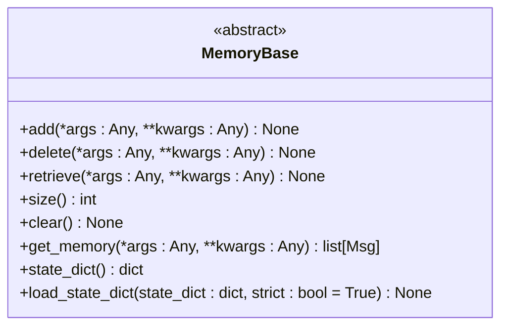

**Diagram sources**
- [memory_base.py](file://src/agentscope/memory/_memory_base.py#L11-L45)

### LongTermMemoryBase
`LongTermMemoryBase`是长期记忆系统的抽象基类，定义了长期记忆管理的核心接口。它支持开发者设计的记忆记录和检索方法，以及智能体主动管理记忆的工具函数。

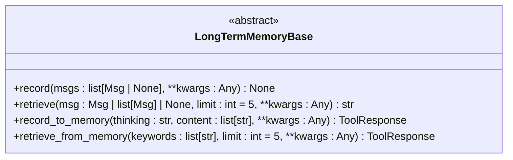

**Diagram sources**
- [long_term_memory_base.py](file://src/agentscope/memory/_long_term_memory_base.py#L11-L95)

**Section sources**
- [memory_base.py](file://src/agentscope/memory/_memory_base.py#L11-L45)
- [long_term_memory_base.py](file://src/agentscope/memory/_long_term_memory_base.py#L11-L95)

## 短期记忆实现

### InMemoryMemory
`InMemoryMemory`是短期记忆的具体实现，用于在内存中存储消息。它实现了`MemoryBase`接口，提供了基于内存的消息存储和管理功能。

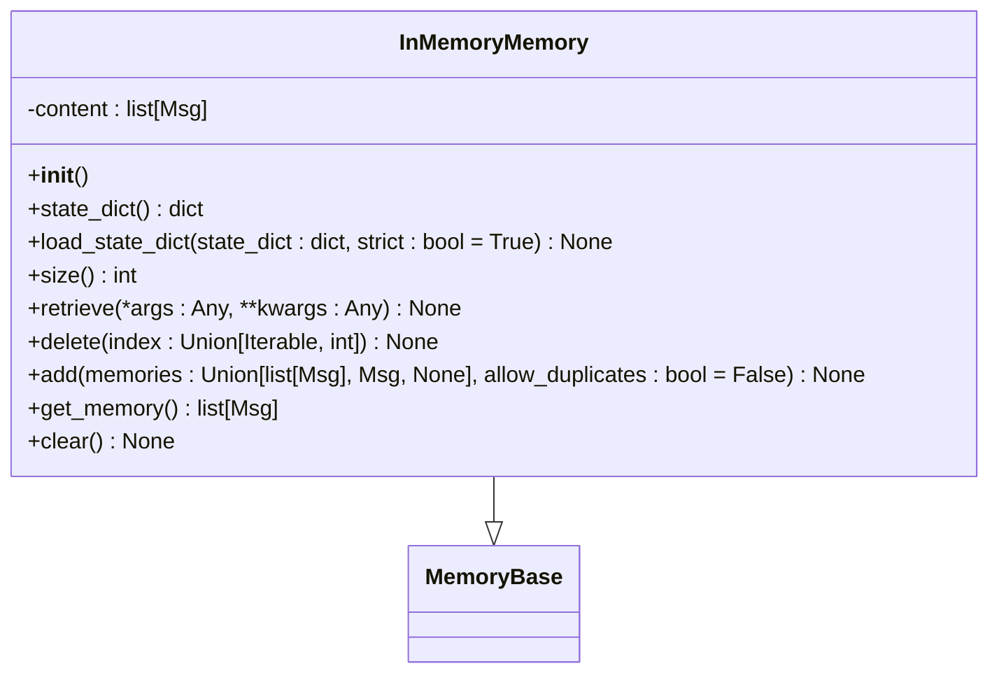

**Diagram sources**
- [in_memory_memory.py](file://src/agentscope/memory/_in_memory_memory.py#L10-L123)

**Section sources**
- [in_memory_memory.py](file://src/agentscope/memory/_in_memory_memory.py#L10-L123)

## 长期记忆实现

### Mem0LongTermMemory
`Mem0LongTermMemory`是基于mem0库的长期记忆实现，提供了持久化的记忆存储和检索能力。它支持多种配置选项，包括模型、嵌入模型、向量存储配置等。

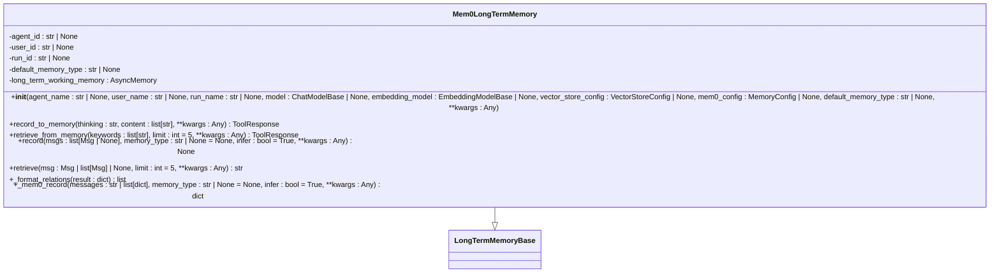

**Diagram sources**
- [mem0_long_term_memory.py](file://src/agentscope/memory/_mem0_long_term_memory.py#L73-L624)

### ReMeLongTermMemoryBase
`ReMeLongTermMemoryBase`是基于ReMe库的长期记忆实现基类，提供了与ReMe库集成的基础功能。它支持DashScope和OpenAI模型提供商，以及灵活的配置选项。

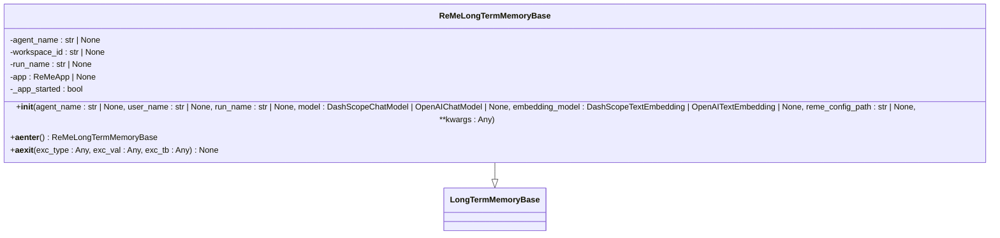

**Diagram sources**
- [reme_long_term_memory_base.py](file://src/agentscope/memory/_reme/_reme_long_term_memory_base.py#L83-L371)

### ReMePersonalLongTermMemory
`ReMePersonalLongTermMemory`是基于ReMe库的个人长期记忆实现，用于存储和检索用户的个人偏好、习惯和事实。

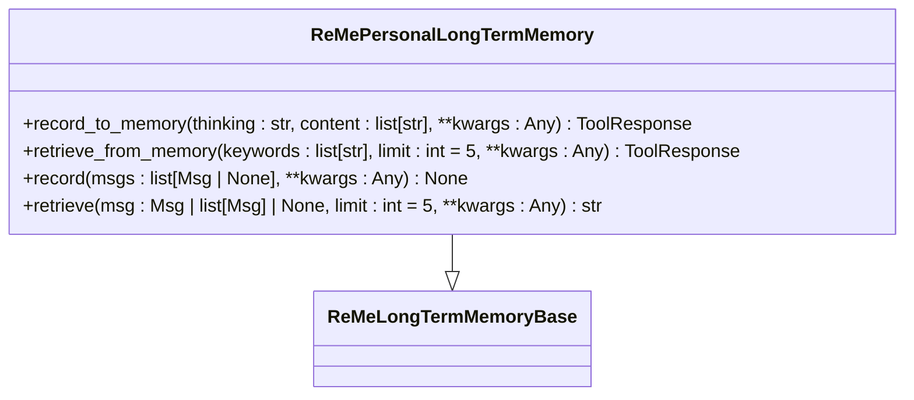

**Diagram sources**
- [reme_personal_long_term_memory.py](file://src/agentscope/memory/_reme/_reme_personal_long_term_memory.py#L17-L415)

### ReMeTaskLongTermMemory
`ReMeTaskLongTermMemory`是基于ReMe库的任务长期记忆实现，用于学习和检索任务执行经验。

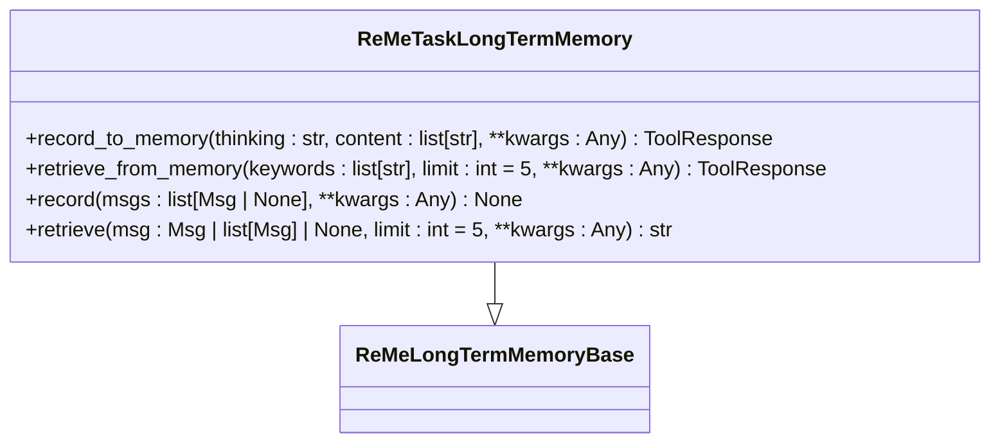

**Diagram sources**
- [reme_task_long_term_memory.py](file://src/agentscope/memory/_reme/_reme_task_long_term_memory.py#L17-L437)

### ReMeToolLongTermMemory
`ReMeToolLongTermMemory`是基于ReMe库的工具长期记忆实现，用于记录工具执行结果和检索工具使用指南。

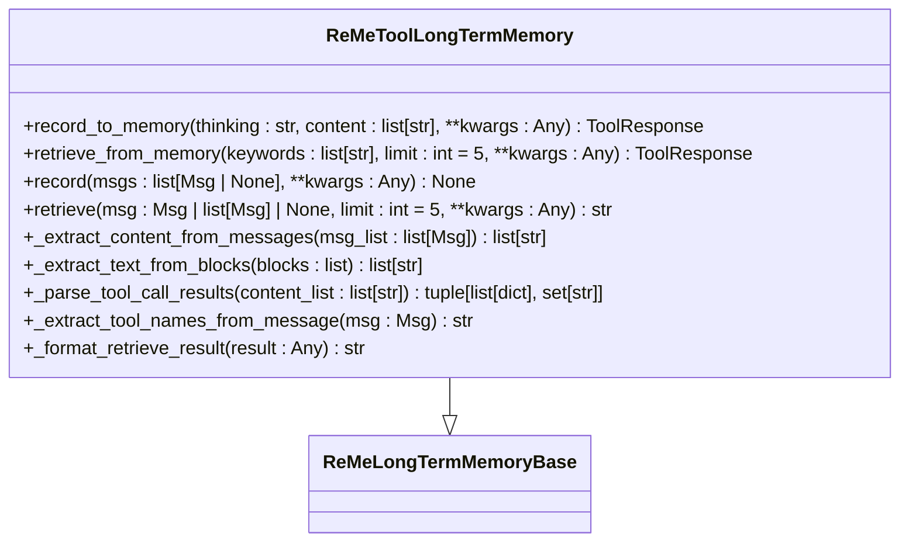

**Diagram sources**
- [reme_tool_long_term_memory.py](file://src/agentscope/memory/_reme/_reme_tool_long_term_memory.py#L17-L546)

**Section sources**
- [mem0_long_term_memory.py](file://src/agentscope/memory/_mem0_long_term_memory.py#L73-L624)
- [reme_long_term_memory_base.py](file://src/agentscope/memory/_reme/_reme_long_term_memory_base.py#L83-L371)
- [reme_personal_long_term_memory.py](file://src/agentscope/memory/_reme/_reme_personal_long_term_memory.py#L17-L415)
- [reme_task_long_term_memory.py](file://src/agentscope/memory/_reme/_reme_task_long_term_memory.py#L17-L437)
- [reme_tool_long_term_memory.py](file://src/agentscope/memory/_reme/_reme_tool_long_term_memory.py#L17-L546)

## 记忆压缩与管理

### MemoryWithCompress
`MemoryWithCompress`是带有压缩功能的记忆管理类，用于在当前会话中存储原始消息和压缩消息。它通过压缩机制管理记忆的token数量，防止超出模型上下文窗口。

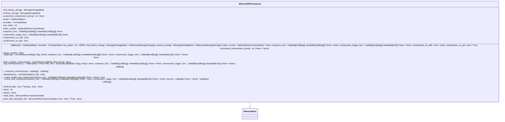

**Diagram sources**
- [memory_with_compress.py](file://examples/functionality/memory/memory_with_compression/_memory_with_compress.py#L64-L714)

### MessageStorageBase
`MessageStorageBase`是消息存储的抽象基类，定义了消息存储的基本接口。它支持异步操作，包括连接、断开、健康检查、添加、删除、清除、获取和替换消息。

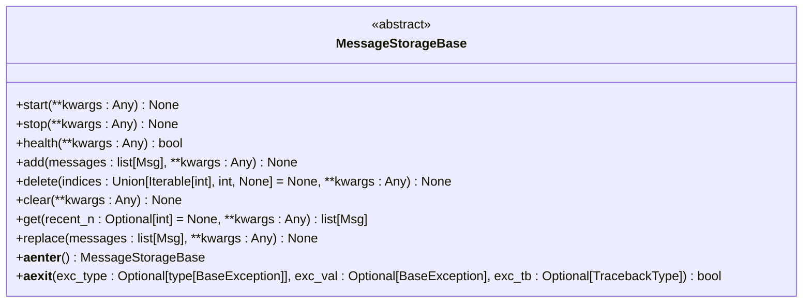

**Diagram sources**
- [memory_storage.py](file://examples/functionality/memory/memory_with_compression/_memory_storage.py#L10-L123)

### InMemoryMessageStorage
`InMemoryMessageStorage`是基于内存的消息存储实现，用于在内存中存储消息。它实现了`MessageStorageBase`接口，提供了基于内存的消息存储和管理功能。

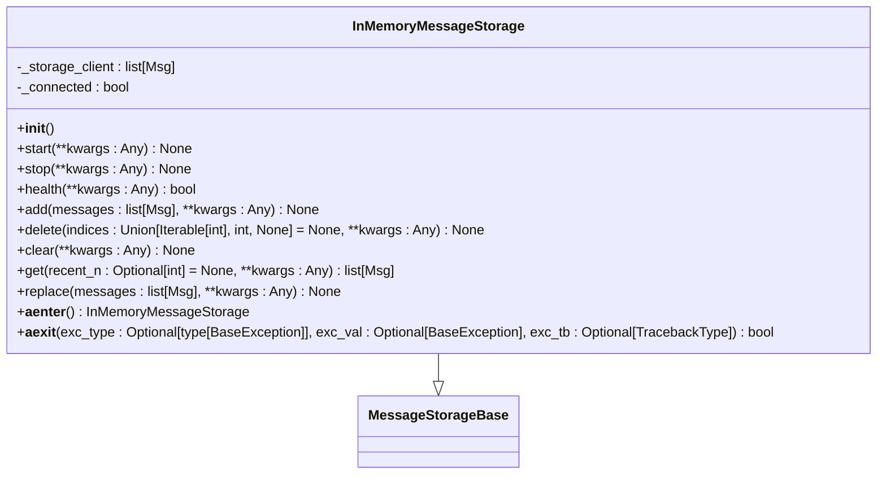

**Diagram sources**
- [memory_storage.py](file://examples/functionality/memory/memory_with_compression/_memory_storage.py#L125-L274)

**Section sources**
- [memory_with_compress.py](file://examples/functionality/memory/memory_with_compression/_memory_with_compress.py#L64-L714)
- [memory_storage.py](file://examples/functionality/memory/memory_with_compression/_memory_storage.py#L10-L274)

## 会话上下文与持久化
记忆系统通过`state_dict()`和`load_state_dict()`方法支持会话状态的持久化。`state_dict()`方法将记忆系统的当前状态转换为字典格式，而`load_state_dict()`方法从字典中加载状态。这种机制允许在不同会话之间保存和恢复记忆状态。

对于长期记忆，系统支持与外部存储系统的集成，如SQLite数据库。通过`sqlite_session.py`中的实现，可以将会话数据持久化到SQLite数据库中，包括会话ID、会话数据、创建时间和更新时间等信息。

**Section sources**
- [memory_base.py](file://src/agentscope/memory/_memory_base.py#L39-L44)
- [sqlite_session.py](file://examples/functionality/session_with_sqlite/sqlite_session.py#L45-L81)

## 跨智能体记忆共享
记忆系统支持跨智能体的记忆共享机制。通过`ReMeLongTermMemoryBase`类的`workspace_id`参数，可以将记忆组织到不同的工作区中，实现不同用户或工作区之间的记忆隔离。同时，通过`agent_name`和`run_name`参数，可以为不同的智能体和运行会话创建独立的记忆空间。

这种设计允许智能体在保持自身记忆独立性的同时，通过共享工作区实现记忆的协同和共享。例如，多个智能体可以共享同一个用户的个人记忆，但各自维护独立的任务记忆和工具记忆。

**Section sources**
- [reme_long_term_memory_base.py](file://src/agentscope/memory/_reme/_reme_long_term_memory_base.py#L196-L197)

## 外部存储系统集成
记忆系统支持与多种外部存储系统的集成，包括向量数据库和关系型数据库。

### 向量数据库集成
通过`VDBStoreBase`抽象基类和具体的实现类（如`QdrantStore`和`MilvusLiteStore`），记忆系统可以与向量数据库集成。这些实现类提供了向量存储、搜索和检索功能，支持基于语义的相似性搜索。

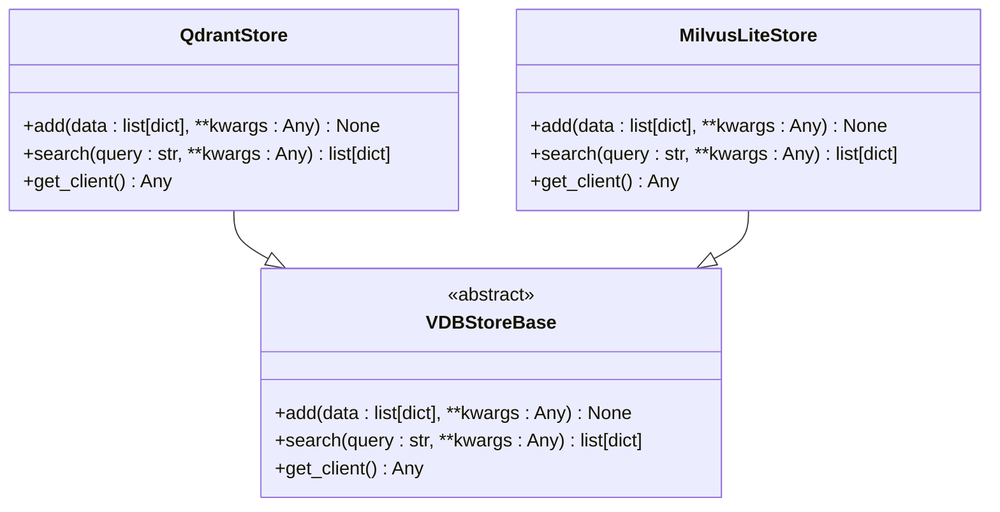

**Diagram sources**
- [store_base.py](file://src/agentscope/rag/_store/_store_base.py#L39-L49)
- [__init__.py](file://src/agentscope/rag/_store/__init__.py#L4-L14)

### SQLite集成
通过`sqlite_session.py`中的实现，记忆系统可以与SQLite数据库集成，实现会话数据的持久化存储。系统支持创建表、插入或替换会话数据、加载会话状态等操作。

**Section sources**
- [store_base.py](file://src/agentscope/rag/_store/_store_base.py#L39-L49)
- [__init__.py](file://src/agentscope/rag/_store/__init__.py#L4-L14)
- [sqlite_session.py](file://examples/functionality/session_with_sqlite/sqlite_session.py#L45-L81)

## 性能调优建议
1. **Token限制选择**：根据模型的上下文窗口和典型对话长度选择合适的`max_token`值。
2. **压缩时机**：建议设置`compression_on_get=True`（默认），在检索时进行压缩；设置`compression_on_add=False`（默认），避免在添加操作时进行压缩，因为压缩可能在`get_memory()`调用前未完成。
3. **异步操作**：所有主要方法都是异步的，调用时应使用`await`。
4. **状态持久化**：使用`state_dict()`和`load_state_dict()`在会话之间保存和恢复对话状态。
5. **自定义压缩**：对于特定领域的压缩需求，实现自定义的`compress_func`（必须是异步的并返回`List[Msg]`）。
6. **压缩触发器**：使用`compression_trigger_func`实现超出token限制的自定义压缩逻辑（例如，N条消息后压缩，或特定条件下的压缩）。
7. **存储后端**：实现自定义的`MessageStorageBase`子类以支持持久化存储（例如，数据库、文件系统）。

**Section sources**
- [README.md](file://examples/functionality/memory/memory_with_compression/README.md#L292-L300)