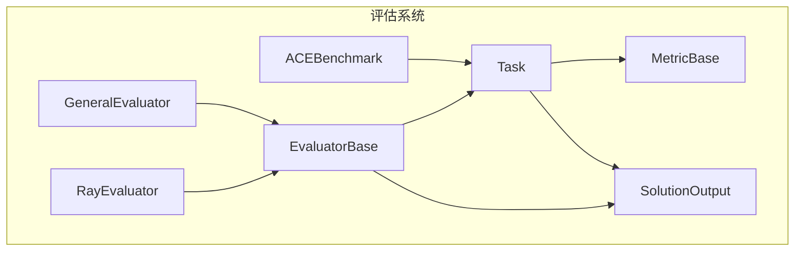
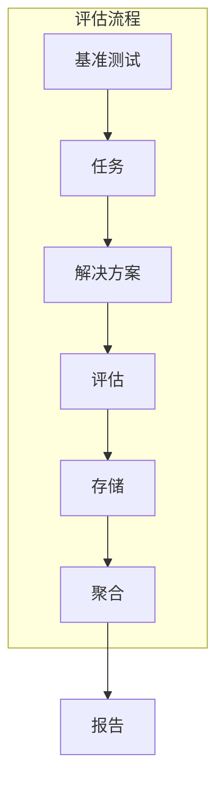
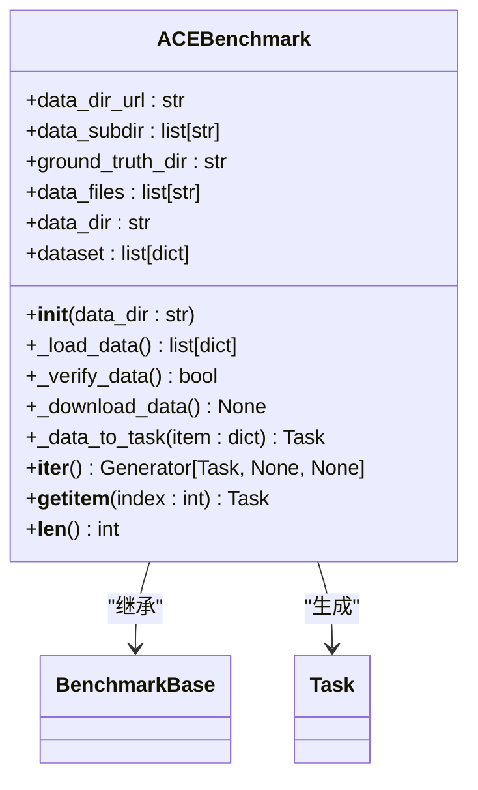
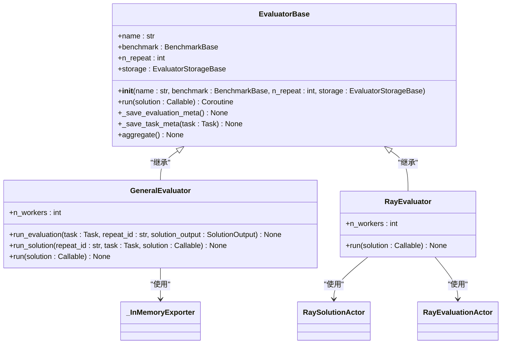
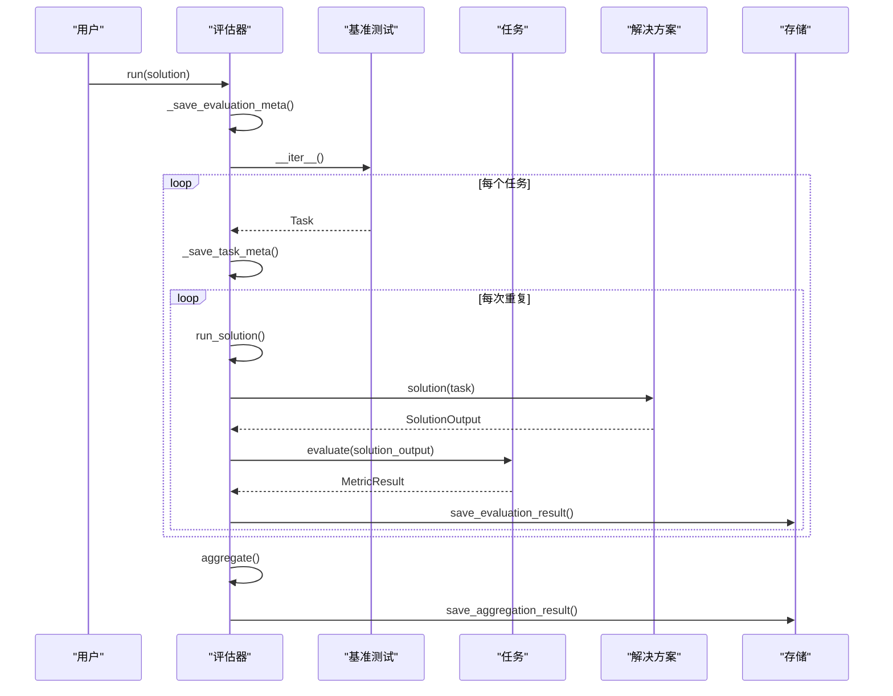
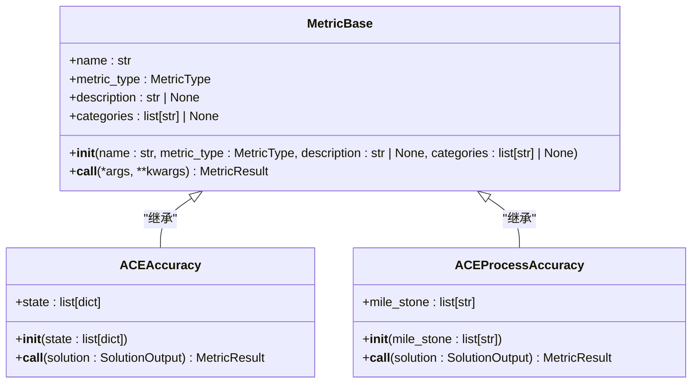
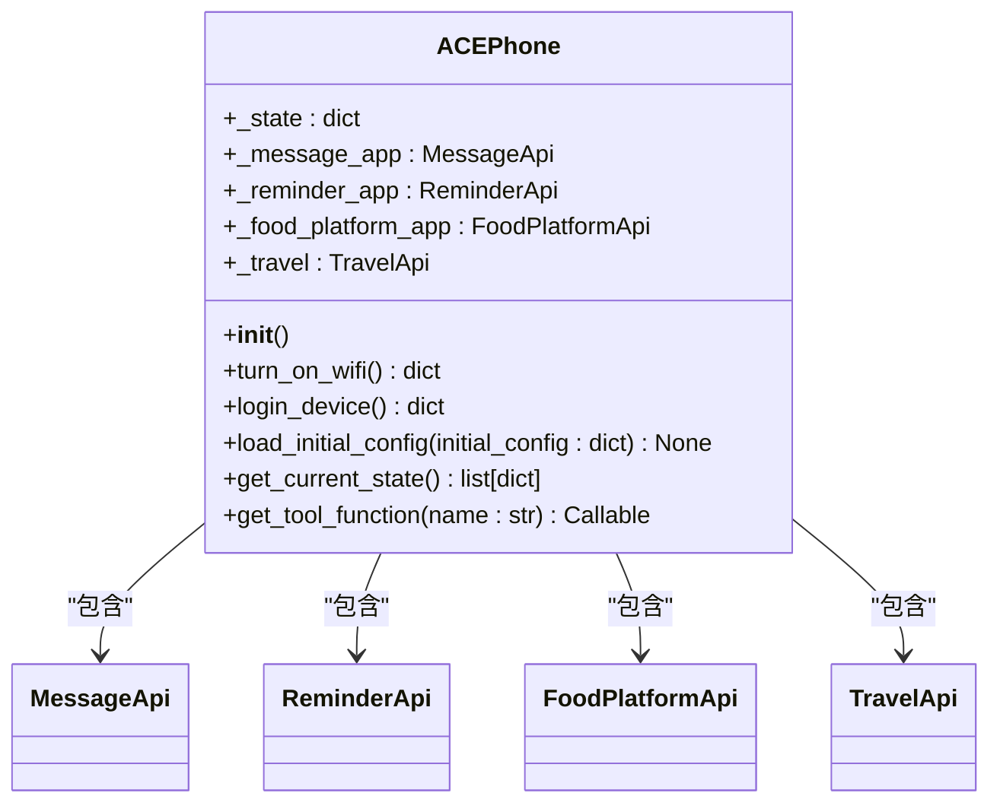
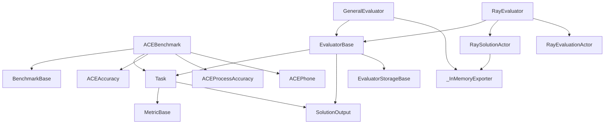

# 评估系统API

<cite>
**本文档中引用的文件**  
- [__init__.py](file://src/agentscope/evaluate/_ace_benchmark/__init__.py)
- [_ace_benchmark.py](file://src/agentscope/evaluate/_ace_benchmark/_ace_benchmark.py)
- [_ace_metric.py](file://src/agentscope/evaluate/_ace_benchmark/_ace_metric.py)
- [_ace_tools_zh.py](file://src/agentscope/evaluate/_ace_benchmark/_ace_tools_zh.py)
- [__init__.py](file://src/agentscope/evaluate/_evaluator/__init__.py)
- [_general_evaluator.py](file://src/agentscope/evaluate/_evaluator/_general_evaluator.py)
- [_ray_evaluator.py](file://src/agentscope/evaluate/_evaluator/_ray_evaluator.py)
- [_evaluator_base.py](file://src/agentscope/evaluate/_evaluator/_evaluator_base.py)
- [_in_memory_exporter.py](file://src/agentscope/evaluate/_evaluator/_in_memory_exporter.py)
- [_benchmark_base.py](file://src/agentscope/evaluate/_benchmark_base.py)
- [_task.py](file://src/agentscope/evaluate/_task.py)
- [_metric_base.py](file://src/agentscope/evaluate/_metric_base.py)
- [__init__.py](file://src/agentscope/evaluate/__init__.py)
- [main.py](file://examples/evaluation/ace_bench/main.py)
</cite>

## 目录
1. [简介](#简介)
2. [项目结构](#项目结构)
3. [核心组件](#核心组件)
4. [架构概述](#架构概述)
5. [详细组件分析](#详细组件分析)
6. [依赖分析](#依赖分析)
7. [性能考虑](#性能考虑)
8. [故障排除指南](#故障排除指南)
9. [结论](#结论)

## 简介
本文档详细记录了ACEBenchmark基准测试框架的配置、执行和结果分析接口。文档涵盖了评估任务定义、指标计算方法和结果可视化选项，以及通用评估器（GeneralEvaluator）的扩展机制、分布式评估（RayEvaluator）的集群配置和结果导出格式。此外，还说明了自定义评估指标的实现方式、测试用例生成策略和性能基准对比方法，并提供了与CI/CD集成的API接口和自动化评估流水线构建指南。

## 项目结构
评估系统模块位于`src/agentscope/evaluate`目录下，主要包含以下几个子模块：

- `_ace_benchmark`：ACEBench基准测试相关实现
- `_evaluator`：评估器实现
- `_evaluator_storage`：评估结果存储实现
- 其他基础类：`_benchmark_base.py`、`_task.py`、`_metric_base.py`等

该模块提供了完整的评估框架，支持从基准测试定义到结果聚合的完整流程。

**图表来源**
- [__init__.py](file://src/agentscope/evaluate/_ace_benchmark/__init__.py)
- [_ace_benchmark.py](file://src/agentscope/evaluate/_ace_benchmark/_ace_benchmark.py)
- [_evaluator_base.py](file://src/agentscope/evaluate/_evaluator/_evaluator_base.py)
- [_task.py](file://src/agentscope/evaluate/_task.py)
- [_metric_base.py](file://src/agentscope/evaluate/_metric_base.py)

**章节来源**
- [__init__.py](file://src/agentscope/evaluate/_ace_benchmark/__init__.py)
- [_ace_benchmark.py](file://src/agentscope/evaluate/_ace_benchmark/_ace_benchmark.py)

## 核心组件
评估系统的核心组件包括ACEBenchmark基准测试类、评估器（Evaluator）和评估指标（Metric）。ACEBenchmark类负责加载和管理ACEBench数据集，评估器负责执行评估流程，而评估指标则用于量化评估结果。

**章节来源**
- [__init__.py](file://src/agentscope/evaluate/_ace_benchmark/__init__.py)
- [_ace_benchmark.py](file://src/agentscope/evaluate/_ace_benchmark/_ace_benchmark.py)
- [_evaluator_base.py](file://src/agentscope/evaluate/_evaluator/_evaluator_base.py)

## 架构概述
评估系统的架构基于模块化设计，主要包括基准测试、评估器、任务、指标和存储等组件。基准测试定义了评估的数据集和任务，评估器负责执行评估流程，任务表示具体的评估项，指标用于量化评估结果，存储则负责持久化评估结果。

**图表来源**
- [_evaluator_base.py](file://src/agentscope/evaluate/_evaluator/_evaluator_base.py)
- [_general_evaluator.py](file://src/agentscope/evaluate/_evaluator/_general_evaluator.py)
- [_ray_evaluator.py](file://src/agentscope/evaluate/_evaluator/_ray_evaluator.py)

## 详细组件分析

### ACEBenchmark分析
ACEBenchmark类是ACEBench基准测试的具体实现，负责加载和管理ACEBench数据集。它提供了数据下载、验证和加载功能，并将数据集转换为评估任务。

**图表来源**
- [_ace_benchmark.py](file://src/agentscope/evaluate/_ace_benchmark/_ace_benchmark.py)
- [_benchmark_base.py](file://src/agentscope/evaluate/_benchmark_base.py)
- [_task.py](file://src/agentscope/evaluate/_task.py)

**章节来源**
- [_ace_benchmark.py](file://src/agentscope/evaluate/_ace_benchmark/_ace_benchmark.py)

### 评估器分析
评估器是评估系统的核心执行组件，负责运行评估流程。系统提供了两种评估器：GeneralEvaluator用于本地调试，RayEvaluator用于分布式并行评估。

#### 评估器类图

**图表来源**
- [_evaluator_base.py](file://src/agentscope/evaluate/_evaluator/_evaluator_base.py)
- [_general_evaluator.py](file://src/agentscope/evaluate/_evaluator/_general_evaluator.py)
- [_ray_evaluator.py](file://src/agentscope/evaluate/_evaluator/_ray_evaluator.py)
- [_in_memory_exporter.py](file://src/agentscope/evaluate/_evaluator/_in_memory_exporter.py)

#### 评估流程序列图

**图表来源**
- [_evaluator_base.py](file://src/agentscope/evaluate/_evaluator/_evaluator_base.py)
- [_general_evaluator.py](file://src/agentscope/evaluate/_evaluator/_general_evaluator.py)
- [_task.py](file://src/agentscope/evaluate/_task.py)

**章节来源**
- [_evaluator_base.py](file://src/agentscope/evaluate/_evaluator/_evaluator_base.py)
- [_general_evaluator.py](file://src/agentscope/evaluate/_evaluator/_general_evaluator.py)
- [_ray_evaluator.py](file://src/agentscope/evaluate/_evaluator/_ray_evaluator.py)

### 评估指标分析
评估指标用于量化评估结果，系统提供了准确性（ACEAccuracy）和过程准确性（ACEProcessAccuracy）两种指标。

**图表来源**
- [_metric_base.py](file://src/agentscope/evaluate/_metric_base.py)
- [_ace_metric.py](file://src/agentscope/evaluate/_ace_benchmark/_ace_metric.py)

**章节来源**
- [_ace_metric.py](file://src/agentscope/evaluate/_ace_benchmark/_ace_metric.py)

### ACEPhone分析
ACEPhone类模拟了ACEBench中的用户手机，包含各种应用和功能，用于评估智能体的交互能力。

**图表来源**
- [_ace_tools_zh.py](file://src/agentscope/evaluate/_ace_benchmark/_ace_tools_zh.py)
- [_ace_tools_api.py](file://src/agentscope/evaluate/_ace_benchmark/_ace_tools_api/__init__.py)

**章节来源**
- [_ace_tools_zh.py](file://src/agentscope/evaluate/_ace_benchmark/_ace_tools_zh.py)

## 依赖分析
评估系统各组件之间的依赖关系如下：

**图表来源**
- [_ace_benchmark.py](file://src/agentscope/evaluate/_ace_benchmark/_ace_benchmark.py)
- [_evaluator_base.py](file://src/agentscope/evaluate/_evaluator/_evaluator_base.py)
- [_general_evaluator.py](file://src/agentscope/evaluate/_evaluator/_general_evaluator.py)
- [_ray_evaluator.py](file://src/agentscope/evaluate/_evaluator/_ray_evaluator.py)
- [_task.py](file://src/agentscope/evaluate/_task.py)
- [_metric_base.py](file://src/agentscope/evaluate/_metric_base.py)

**章节来源**
- [_ace_benchmark.py](file://src/agentscope/evaluate/_ace_benchmark/_ace_benchmark.py)
- [_evaluator_base.py](file://src/agentscope/evaluate/_evaluator/_evaluator_base.py)
- [_general_evaluator.py](file://src/agentscope/evaluate/_evaluator/_general_evaluator.py)
- [_ray_evaluator.py](file://src/agentscope/evaluate/_evaluator/_ray_evaluator.py)

## 性能考虑
评估系统的性能主要受以下因素影响：

1. **数据加载**：ACEBenchmark在初始化时会验证和下载数据集，这可能需要较长时间。
2. **评估并发**：RayEvaluator支持分布式并行评估，可以显著提高评估效率。
3. **存储性能**：评估结果的存储和读取性能会影响整体评估速度。
4. **指标计算**：复杂的指标计算可能成为性能瓶颈。

建议在生产环境中使用RayEvaluator进行分布式评估，并合理配置n_workers参数以平衡资源利用率和评估速度。

## 故障排除指南
### 常见问题
1. **数据下载失败**：检查网络连接，确保可以访问`https://raw.githubusercontent.com/ACEBench/ACEBench/main/data_all`。
2. **Ray未安装**：使用`pip install ray`安装Ray。
3. **API密钥缺失**：确保设置了正确的API密钥环境变量。
4. **存储路径权限**：确保评估器有权限读写指定的存储目录。

### 调试建议
1. 使用GeneralEvaluator进行本地调试，便于跟踪评估流程。
2. 启用OpenTelemetry追踪，查看详细的执行信息。
3. 检查评估结果存储，验证评估流程是否正常执行。

**章节来源**
- [_ace_benchmark.py](file://src/agentscope/evaluate/_ace_benchmark/_ace_benchmark.py)
- [_ray_evaluator.py](file://src/agentscope/evaluate/_evaluator/_ray_evaluator.py)
- [main.py](file://examples/evaluation/ace_bench/main.py)

## 结论
ACEBenchmark评估系统提供了一套完整的评估框架，支持从基准测试定义到结果聚合的完整流程。系统设计模块化，易于扩展和维护。通过GeneralEvaluator和RayEvaluator两种评估器，既支持本地调试，又支持分布式并行评估，满足不同场景的需求。评估指标和存储机制的设计也考虑了灵活性和可扩展性，为构建复杂的评估系统提供了坚实的基础。