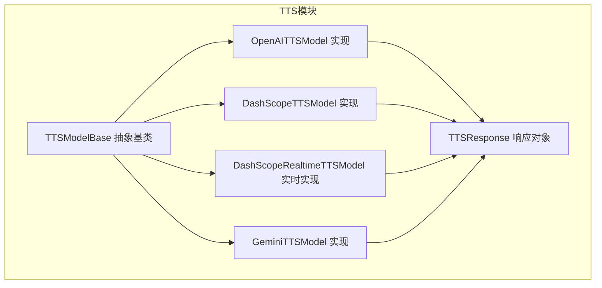
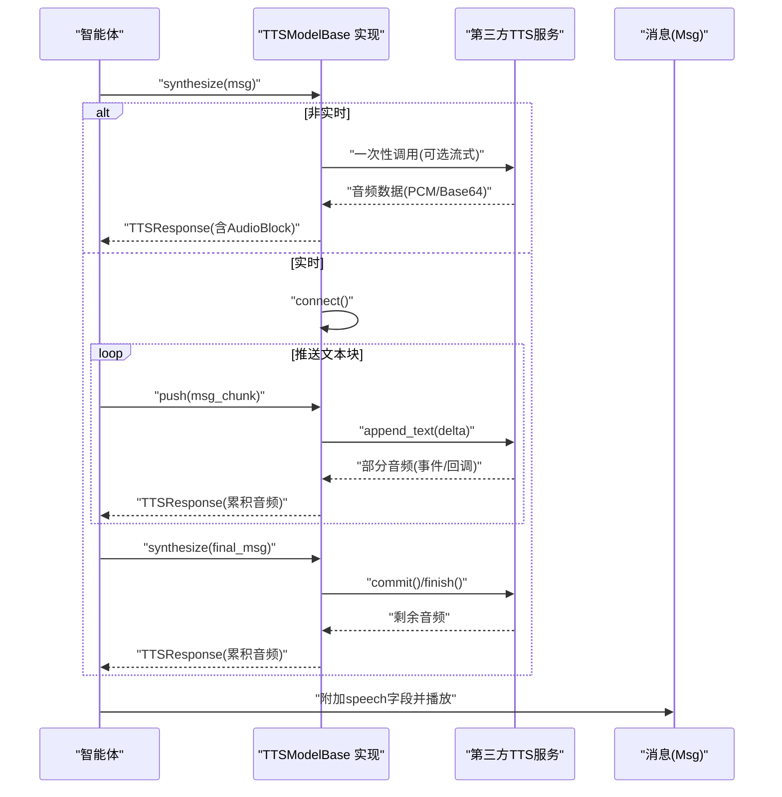
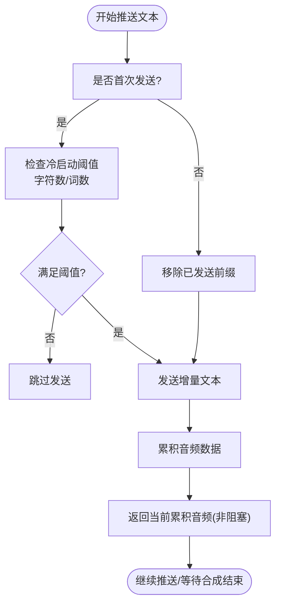
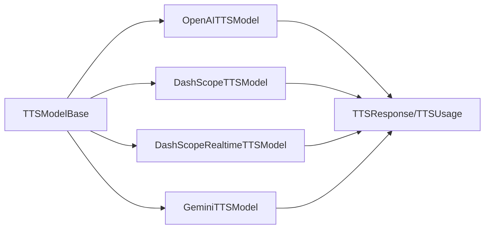

# 语音合成API

<cite>
**本文引用的文件列表**
- [src/agentscope/tts/_tts_base.py](file://src/agentscope/tts/_tts_base.py)
- [src/agentscope/tts/_openai_tts_model.py](file://src/agentscope/tts/_openai_tts_model.py)
- [src/agentscope/tts/_dashscope_tts_model.py](file://src/agentscope/tts/_dashscope_tts_model.py)
- [src/agentscope/tts/_dashscope_realtime_tts_model.py](file://src/agentscope/tts/_dashscope_realtime_tts_model.py)
- [src/agentscope/tts/_gemini_tts_model.py](file://src/agentscope/tts/_gemini_tts_model.py)
- [src/agentscope/tts/_tts_response.py](file://src/agentscope/tts/_tts_response.py)
- [src/agentscope/tts/__init__.py](file://src/agentscope/tts/__init__.py)
- [examples/functionality/tts/main.py](file://examples/functionality/tts/main.py)
- [docs/tutorial/zh_CN/src/task_tts.py](file://docs/tutorial/zh_CN/src/task_tts.py)
</cite>

## 目录
1. [简介](#简介)
2. [项目结构](#项目结构)
3. [核心组件](#核心组件)
4. [架构总览](#架构总览)
5. [详细组件分析](#详细组件分析)
6. [依赖关系分析](#依赖关系分析)
7. [性能与延迟优化](#性能与延迟优化)
8. [错误处理与故障排查](#错误处理与故障排查)
9. [与智能体对话系统集成](#与智能体对话系统集成)
10. [结论](#结论)

## 简介
本文件为 AgentScope 语音合成（Text-to-Speech, TTS）模块的完整API参考文档，覆盖抽象基类与各厂商实现类的接口规范，包括：
- 请求参数（音色、语速、音调等）
- 音频格式选择与流式传输配置
- 实时语音合成（RealtimeTTS）的低延迟优化策略、缓冲控制与网络适应性
- 错误处理机制、配额管理接口与成本监控能力
- 与智能体对话系统的集成模式，包括语音消息的同步播放与中断处理

## 项目结构
TTS 模块采用“抽象基类 + 多实现”的分层设计，支持多家云厂商的TTS服务，并提供统一的响应与生命周期管理。

图表来源
- [src/agentscope/tts/_tts_base.py](file://src/agentscope/tts/_tts_base.py#L1-L144)
- [src/agentscope/tts/_openai_tts_model.py](file://src/agentscope/tts/_openai_tts_model.py#L1-L185)
- [src/agentscope/tts/_dashscope_tts_model.py](file://src/agentscope/tts/_dashscope_tts_model.py#L1-L178)
- [src/agentscope/tts/_dashscope_realtime_tts_model.py](file://src/agentscope/tts/_dashscope_realtime_tts_model.py#L1-L446)
- [src/agentscope/tts/_gemini_tts_model.py](file://src/agentscope/tts/_gemini_tts_model.py#L1-L211)
- [src/agentscope/tts/_tts_response.py](file://src/agentscope/tts/_tts_response.py#L1-L56)

章节来源
- [src/agentscope/tts/__init__.py](file://src/agentscope/tts/__init__.py#L1-L20)

## 核心组件
- 抽象基类：TTSModelBase
  - 定义通用生命周期与接口：连接/关闭、推送文本、合成音频、流式输入支持标记
  - 提供异步上下文管理器入口，便于实时模型资源管理
- 响应对象：TTSResponse
  - 统一承载音频块、时间戳、类型标识、用量信息与流结束标记
- 具体实现：
  - OpenAITTSModel：OpenAI TTS API，支持流式与非流式输出
  - DashScopeTTSModel：阿里云 DashScope 多模态TTS API，支持流式输出
  - DashScopeRealtimeTTSModel：阿里云实时TTS API，支持流式输入与输出
  - GeminiTTSModel：Google Gemini TTS API，支持流式与非流式输出

章节来源
- [src/agentscope/tts/_tts_base.py](file://src/agentscope/tts/_tts_base.py#L1-L144)
- [src/agentscope/tts/_tts_response.py](file://src/agentscope/tts/_tts_response.py#L1-L56)
- [src/agentscope/tts/_openai_tts_model.py](file://src/agentscope/tts/_openai_tts_model.py#L1-L185)
- [src/agentscope/tts/_dashscope_tts_model.py](file://src/agentscope/tts/_dashscope_tts_model.py#L1-L178)
- [src/agentscope/tts/_dashscope_realtime_tts_model.py](file://src/agentscope/tts/_dashscope_realtime_tts_model.py#L1-L446)
- [src/agentscope/tts/_gemini_tts_model.py](file://src/agentscope/tts/_gemini_tts_model.py#L1-L211)

## 架构总览
下图展示 TTS 模块与消息系统、智能体的交互关系，以及实时与非实时路径的差异。

图表来源
- [src/agentscope/tts/_tts_base.py](file://src/agentscope/tts/_tts_base.py#L52-L144)
- [src/agentscope/tts/_dashscope_realtime_tts_model.py](file://src/agentscope/tts/_dashscope_realtime_tts_model.py#L278-L446)
- [src/agentscope/tts/_openai_tts_model.py](file://src/agentscope/tts/_openai_tts_model.py#L76-L185)
- [src/agentscope/tts/_dashscope_tts_model.py](file://src/agentscope/tts/_dashscope_tts_model.py#L78-L178)
- [src/agentscope/tts/_gemini_tts_model.py](file://src/agentscope/tts/_gemini_tts_model.py#L79-L211)

## 详细组件分析

### 抽象基类：TTSModelBase
- 关键职责
  - 生命周期管理：支持异步上下文管理器，实时模型在进入/退出时自动建立与释放连接
  - 接口契约：定义 supports_streaming_input、synthesize、push、connect、close 等抽象方法
  - 参数约定：构造函数接受 model_name 与 stream；synthesize 支持返回 TTSResponse 或异步生成器
- 设计要点
  - supports_streaming_input 作为区分实时/非实时的关键标志
  - push 仅对实时模型有意义，返回非阻塞的累积音频响应
  - synthesize 对实时模型阻塞直至会话完成，对非实时模型一次性返回完整音频

章节来源
- [src/agentscope/tts/_tts_base.py](file://src/agentscope/tts/_tts_base.py#L1-L144)

### 响应对象：TTSResponse
- 字段说明
  - content：包含音频块（AudioBlock），媒体类型与编码由具体实现决定
  - id、created_at：唯一标识与创建时间
  - type：固定为 “tts”
  - usage：用量信息（输入/输出token、耗时），可用于成本监控
  - metadata：扩展元数据
  - is_last：流式输出中标识最后一个响应
- 用途
  - 统一跨厂商的响应格式，便于上层智能体与播放器消费

章节来源
- [src/agentscope/tts/_tts_response.py](file://src/agentscope/tts/_tts_response.py#L1-L56)

### OpenAI TTS 实现：OpenAITTSModel
- 支持特性
  - 非实时合成：支持流式与非流式输出
  - 音色选择：支持多种内置音色
  - 生成参数：支持 temperature、seed 等额外参数透传
- 接口要点
  - 构造函数：api_key、model_name、voice、stream、client_kwargs、generate_kwargs
  - synthesize：根据 stream 返回 TTSResponse 或异步生成器
  - 音频格式：非流式使用 PCM，流式使用 MP3（内部按块转为 Base64）
- 错误与边界
  - 输入为空时返回空响应
  - 流式解析将二进制片段编码为 Base64 并逐块产出

章节来源
- [src/agentscope/tts/_openai_tts_model.py](file://src/agentscope/tts/_openai_tts_model.py#L1-L185)

### 阿里云 DashScope TTS 实现：DashScopeTTSModel
- 支持特性
  - 非实时合成：支持流式输出
  - 语言类型：language_type 支持 Auto，便于多语言发音
  - 音色选择：支持 Cherry、Serena、Ethan、Chelsie 等
- 接口要点
  - 构造函数：api_key、model_name、voice、language_type、stream、generate_kwargs
  - synthesize：流式模式下将分片音频拼接为 Base64，逐块产出
- 错误与边界
  - 输入为空时返回空响应
  - 非流式模式聚合所有音频后一次性返回

章节来源
- [src/agentscope/tts/_dashscope_tts_model.py](file://src/agentscope/tts/_dashscope_tts_model.py#L1-L178)

### 阿里云实时 DashScope TTS 实现：DashScopeRealtimeTTSModel
- 支持特性
  - 实时流式输入：支持边输入边合成，显著降低端到端延迟
  - 冷启动阈值：支持按字符数与词数的冷启动阈值，避免首段过短导致停顿
  - 会话状态：基于 msg.id 维护单一会话状态，不支持并发多请求
- 接口要点
  - 生命周期：connect/close 管理底层客户端连接与会话更新
  - push：非阻塞提交文本增量，返回当前累积音频
  - synthesize：阻塞等待会话完成，返回累积音频或异步生成器
- 低延迟优化
  - 冷启动阈值：仅在达到阈值后再发送，减少首段停顿
  - 增量发送：去除已发送前缀，避免重复合成
  - 回调事件：基于事件驱动累积音频，及时产出中间块

图表来源
- [src/agentscope/tts/_dashscope_realtime_tts_model.py](file://src/agentscope/tts/_dashscope_realtime_tts_model.py#L304-L378)
- [src/agentscope/tts/_dashscope_realtime_tts_model.py](file://src/agentscope/tts/_dashscope_realtime_tts_model.py#L379-L446)

章节来源
- [src/agentscope/tts/_dashscope_realtime_tts_model.py](file://src/agentscope/tts/_dashscope_realtime_tts_model.py#L1-L446)

### Google Gemini TTS 实现：GeminiTTSModel
- 支持特性
  - 非实时合成：支持流式与非流式输出
  - 音色选择：支持 Zephyr、Kore、Orus、Autonoe 等预置音色
  - 生成参数：支持 temperature、seed 等额外参数透传
- 接口要点
  - 构造函数：api_key、model_name、voice、stream、client_kwargs、generate_kwargs
  - synthesize：流式模式下聚合 Base64 音频并逐块产出
- 错误与边界
  - 输入为空时返回空音频块
  - 非流式模式提取 inline_data 并封装为 AudioBlock

章节来源
- [src/agentscope/tts/_gemini_tts_model.py](file://src/agentscope/tts/_gemini_tts_model.py#L1-L211)

## 依赖关系分析
- 组件耦合
  - 所有实现均继承自 TTSModelBase，确保统一接口与生命周期管理
  - 响应对象 TTSResponse 作为跨实现的数据载体，降低上层耦合
- 外部依赖
  - OpenAI：AsyncOpenAI 客户端
  - DashScope：MultiModalConversation 与 QwenTtsRealtime 客户端
  - Google Gemini：genai.Client 与 GenerateContentStream
- 导出清单
  - 模块导出 TTSModelBase、TTSResponse、TTSUsage 与各实现类，便于外部直接引用

图表来源
- [src/agentscope/tts/__init__.py](file://src/agentscope/tts/__init__.py#L1-L20)
- [src/agentscope/tts/_tts_base.py](file://src/agentscope/tts/_tts_base.py#L1-L144)
- [src/agentscope/tts/_tts_response.py](file://src/agentscope/tts/_tts_response.py#L1-L56)

章节来源
- [src/agentscope/tts/__init__.py](file://src/agentscope/tts/__init__.py#L1-L20)

## 性能与延迟优化
- 流式输出优先
  - 非实时模型在 stream=True 时可尽早开始播放，降低感知延迟
  - 实时模型在 push 阶段即可产出中间音频，配合冷启动阈值进一步缩短首包延迟
- 冷启动阈值
  - DashScopeRealtimeTTSModel 支持 cold_start_length 与 cold_start_words，避免短文本导致停顿
- 增量合成
  - 实时模型仅发送新增文本增量，避免重复合成与网络浪费
- 会话状态管理
  - 基于 msg.id 的单一会话约束，简化状态机并避免并发竞争带来的抖动

章节来源
- [src/agentscope/tts/_dashscope_realtime_tts_model.py](file://src/agentscope/tts/_dashscope_realtime_tts_model.py#L188-L243)
- [src/agentscope/tts/_dashscope_realtime_tts_model.py](file://src/agentscope/tts/_dashscope_realtime_tts_model.py#L344-L378)

## 错误处理与故障排查
- 连接与状态
  - 实时模型未连接即调用 push/synthesize 将抛出运行时错误，需先调用 connect
  - 单一会话约束：不同 msg.id 的文本块会被拒绝，需确保同一会话内连续推送
- 空输入
  - 各实现对空文本返回空响应，避免异常传播
- 异常传播
  - 第三方SDK异常将向上抛出，建议在业务侧捕获并记录
- 成本与用量
  - TTSResponse.usage 可用于统计输入/输出token与耗时，结合日志进行成本监控

章节来源
- [src/agentscope/tts/_dashscope_realtime_tts_model.py](file://src/agentscope/tts/_dashscope_realtime_tts_model.py#L327-L337)
- [src/agentscope/tts/_dashscope_realtime_tts_model.py](file://src/agentscope/tts/_dashscope_realtime_tts_model.py#L397-L407)
- [src/agentscope/tts/_tts_response.py](file://src/agentscope/tts/_tts_response.py#L1-L56)

## 与智能体对话系统集成
- 集成模式
  - 智能体在生成文本响应后，自动触发 TTS 合成并将音频附加到 Msg 的 speech 字段
  - 非实时模型适合一次性完整文本；实时模型适合流式文本逐步合成
- 同步播放与中断
  - 播放器应在新文本到达时切换到最新音频，旧音频可安全丢弃
  - 若用户打断或新消息到来，应停止当前播放并清理会话状态
- 示例参考
  - 实时 TTS 与 ReActAgent 的集成示例展示了从对话到语音播放的完整链路

章节来源
- [docs/tutorial/zh_CN/src/task_tts.py](file://docs/tutorial/zh_CN/src/task_tts.py#L133-L214)
- [examples/functionality/tts/main.py](file://examples/functionality/tts/main.py#L19-L57)

## 结论
AgentScope 的 TTS 模块通过统一抽象与清晰的生命周期管理，为多厂商TTS服务提供了可插拔、可扩展的接入方案。非实时模型适用于完整文本场景，实时模型则在流式文本场景下提供更低的感知延迟与更好的用户体验。配合 TTSResponse 的统一响应格式与 usage 用量统计，开发者可在保证易用性的同时实现成本监控与性能优化。