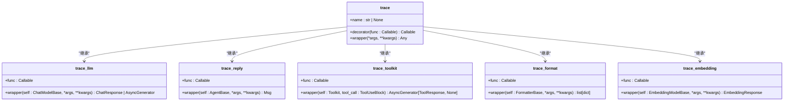

# 追踪系统API

<cite>
**本文档中引用的文件**   
- [__init__.py](file://src/agentscope/tracing/__init__.py)
- [_setup.py](file://src/agentscope/tracing/_setup.py)
- [_trace.py](file://src/agentscope/tracing/_trace.py)
- [_attributes.py](file://src/agentscope/tracing/_attributes.py)
- [_extractor.py](file://src/agentscope/tracing/_extractor.py)
- [_converter.py](file://src/agentscope/tracing/_converter.py)
- [_utils.py](file://src/agentscope/tracing/_utils.py)
- [_run_config.py](file://src/agentscope/_run_config.py)
- [task_tracing.py](file://docs/tutorial/zh_CN/src/task_tracing.py)
</cite>

## 目录
1. [简介](#简介)
2. [追踪系统初始化](#追踪系统初始化)
3. [跨度创建与装饰器](#跨度创建与装饰器)
4. [自定义属性与事件记录](#自定义属性与事件记录)
5. [上下文传播机制](#上下文传播机制)
6. [第三方APM平台集成](#第三方apm平台集成)
7. [性能数据导出与采样](#性能数据导出与采样)
8. [敏感信息过滤](#敏感信息过滤)
9. [分布式追踪调试](#分布式追踪调试)

## 简介

AgentScope追踪系统基于OpenTelemetry实现，为多智能体应用提供全面的可观测性支持。该系统通过自动追踪关键组件（如LLM调用、智能体回复、工具调用等）来生成详细的追踪数据，帮助开发者分析系统性能、调试问题并优化应用行为。

追踪系统的核心功能包括：
- 自动追踪LLM调用、智能体交互、工具执行等关键操作
- 支持与Jaeger、Zipkin等第三方APM平台集成
- 提供丰富的API用于自定义属性添加和事件记录
- 实现跨智能体调用链的上下文传播
- 支持性能数据导出、采样率配置和敏感信息过滤

**Section sources**
- [__init__.py](file://src/agentscope/tracing/__init__.py#L1-L23)
- [task_tracing.py](file://docs/tutorial/zh_CN/src/task_tracing.py#L44-L72)

## 追踪系统初始化

追踪系统的初始化通过`setup_tracing`函数完成，该函数配置OpenTelemetry的追踪导出器端点。初始化过程包括创建追踪提供者、配置批量跨度处理器和设置导出器。

**Diagram sources**
- [_setup.py](file://src/agentscope/tracing/_setup.py#L11-L39)
- [_trace.py](file://src/agentscope/tracing/_trace.py#L192-L319)

**Section sources**
- [_setup.py](file://src/agentscope/tracing/_setup.py#L11-L39)
- [_trace.py](file://src/agentscope/tracing/_trace.py#L69-L77)

## 跨度创建与装饰器

追踪系统提供了一系列装饰器用于创建和管理跨度，支持同步和异步函数以及生成器函数的追踪。

### 核心装饰器

**Diagram sources**
- [_trace.py](file://src/agentscope/tracing/_trace.py#L192-L649)
- [_attributes.py](file://src/agentscope/tracing/_attributes.py#L131-L150)

**Section sources**
- [_trace.py](file://src/agentscope/tracing/_trace.py#L192-L649)
- [_attributes.py](file://src/agentscope/tracing/_attributes.py#L131-L150)

### 装饰器使用示例

**Diagram sources**
- [_trace.py](file://src/agentscope/tracing/_trace.py#L208-L317)
- [_utils.py](file://src/agentscope/tracing/_utils.py#L15-L79)

## 自定义属性与事件记录

追踪系统支持添加自定义属性和记录事件，通过属性提取器和序列化工具实现复杂对象的JSON转换。

### 属性提取机制

**Diagram sources**
- [_attributes.py](file://src/agentscope/tracing/_attributes.py#L8-L184)
- [_extractor.py](file://src/agentscope/tracing/_extractor.py#L52-L800)

**Section sources**
- [_attributes.py](file://src/agentscope/tracing/_attributes.py#L8-L184)
- [_extractor.py](file://src/agentscope/tracing/_extractor.py#L52-L800)

### 对象序列化

**Diagram sources**
- [_utils.py](file://src/agentscope/tracing/_utils.py#L15-L79)
- [_converter.py](file://src/agentscope/tracing/_converter.py#L11-L126)

## 上下文传播机制

追踪系统通过OpenTelemetry的上下文传播机制实现跨智能体调用链的追踪，确保分布式环境下的调用链完整性。

### 上下文传播流程

**Diagram sources**
- [_extractor.py](file://src/agentscope/tracing/_extractor.py#L447-L505)
- [_run_config.py](file://src/agentscope/_run_config.py#L66-L73)

**Section sources**
- [_extractor.py](file://src/agentscope/tracing/_extractor.py#L447-L505)
- [_run_config.py](file://src/agentscope/_run_config.py#L66-L73)

### 跨智能体调用链

**Diagram sources**
- [_trace.py](file://src/agentscope/tracing/_trace.py#L369-L435)
- [_extractor.py](file://src/agentscope/tracing/_extractor.py#L447-L505)

## 第三方APM平台集成

追踪系统支持与多种第三方APM平台集成，通过OTLP协议将追踪数据导出到目标平台。

### 集成配置

**Diagram sources**
- [_setup.py](file://src/agentscope/tracing/_setup.py#L11-L39)
- [task_tracing.py](file://docs/tutorial/zh_CN/src/task_tracing.py#L50-L63)

**Section sources**
- [_setup.py](file://src/agentscope/tracing/_setup.py#L11-L39)
- [task_tracing.py](file://docs/tutorial/zh_CN/src/task_tracing.py#L50-L63)

### 集成示例

**Diagram sources**
- [task_tracing.py](file://docs/tutorial/zh_CN/src/task_tracing.py#L50-L72)
- [_setup.py](file://src/agentscope/tracing/_setup.py#L22-L24)

## 性能数据导出与采样

追踪系统提供灵活的性能数据导出选项和采样率配置，以平衡追踪数据的完整性和系统性能。

### 数据导出配置

**Diagram sources**
- [_setup.py](file://src/agentscope/tracing/_setup.py#L26-L28)
- [_run_config.py](file://src/agentscope/_run_config.py#L66-L73)

**Section sources**
- [_setup.py](file://src/agentscope/tracing/_setup.py#L26-L28)
- [_run_config.py](file://src/agentscope/_run_config.py#L66-L73)

### 采样策略

**Diagram sources**
- [_trace.py](file://src/agentscope/tracing/_trace.py#L69-L77)
- [_setup.py](file://src/agentscope/tracing/_setup.py#L11-L39)

## 敏感信息过滤

追踪系统提供敏感信息过滤机制，通过序列化工具自动处理敏感数据，确保追踪数据的安全性。

### 敏感信息过滤流程

**Diagram sources**
- [_utils.py](file://src/agentscope/tracing/_utils.py#L15-L79)
- [_extractor.py](file://src/agentscope/tracing/_extractor.py#L251-L257)

**Section sources**
- [_utils.py](file://src/agentscope/tracing/_utils.py#L15-L79)
- [_extractor.py](file://src/agentscope/tracing/_extractor.py#L251-L257)

## 分布式追踪调试

追踪系统提供完整的分布式追踪调试支持，包括错误标注、异常处理和调试工具。

### 错误标注策略

**Diagram sources**
- [_trace.py](file://src/agentscope/tracing/_trace.py#L80-L104)
- [_extractor.py](file://src/agentscope/tracing/_extractor.py#L371-L391)

**Section sources**
- [_trace.py](file://src/agentscope/tracing/_trace.py#L80-L104)
- [_extractor.py](file://src/agentscope/tracing/_extractor.py#L371-L391)

### 调试方法

**Diagram sources**
- [_trace.py](file://src/agentscope/tracing/_trace.py#L80-L132)
- [_extractor.py](file://src/agentscope/tracing/_extractor.py#L396-L403)

**Section sources**
- [_trace.py](file://src/agentscope/tracing/_trace.py#L80-L132)
- [_extractor.py](file://src/agentscope/tracing/_extractor.py#L396-L403)