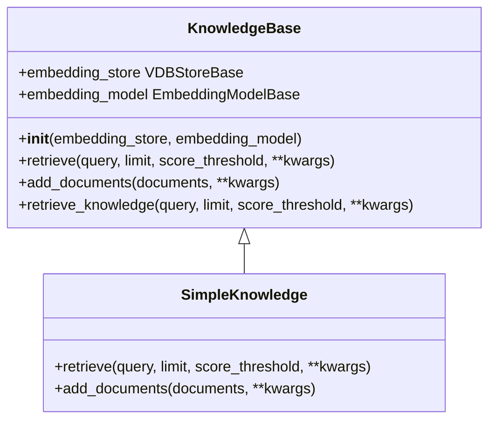
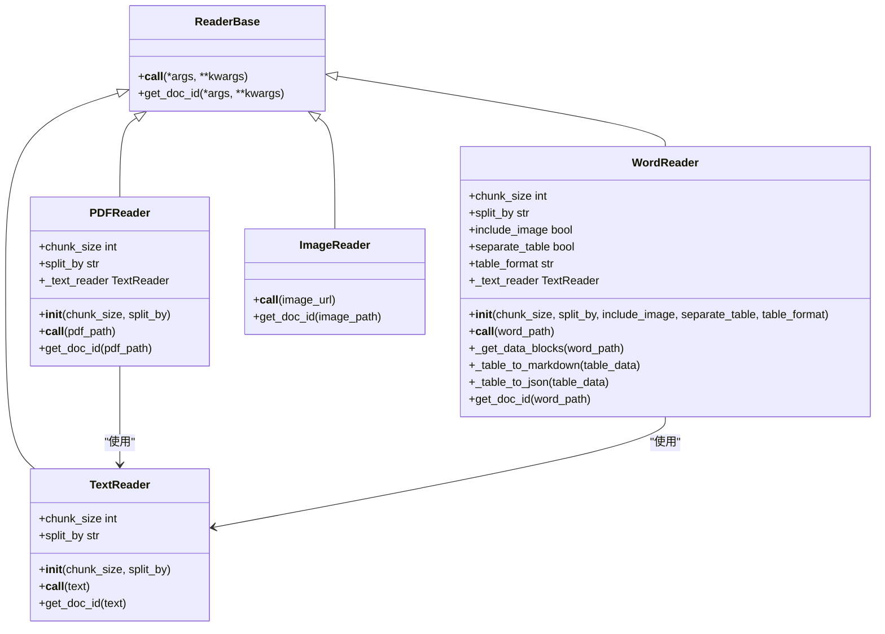
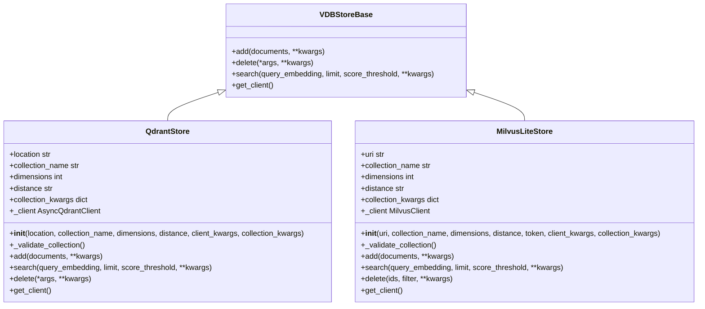
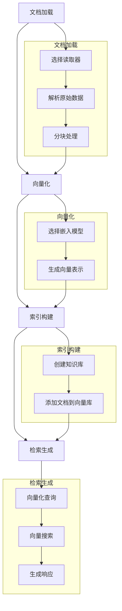
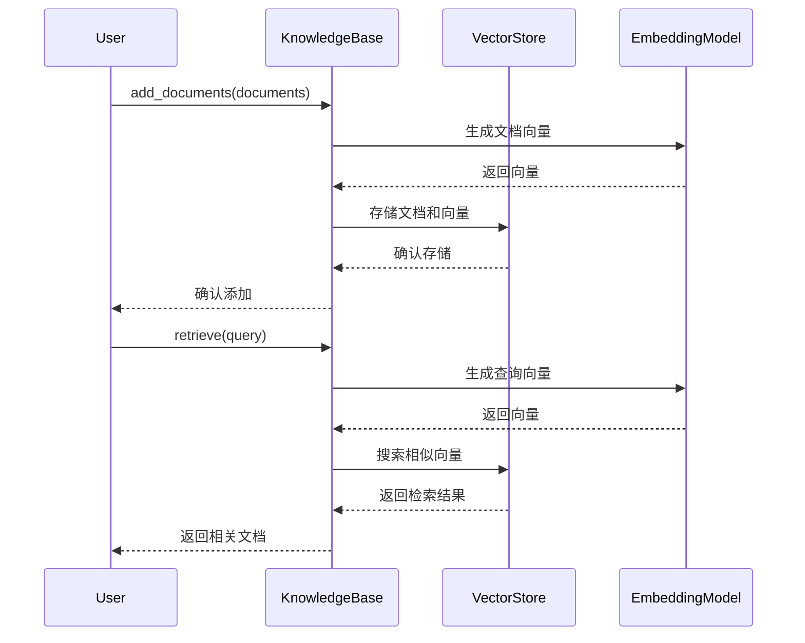
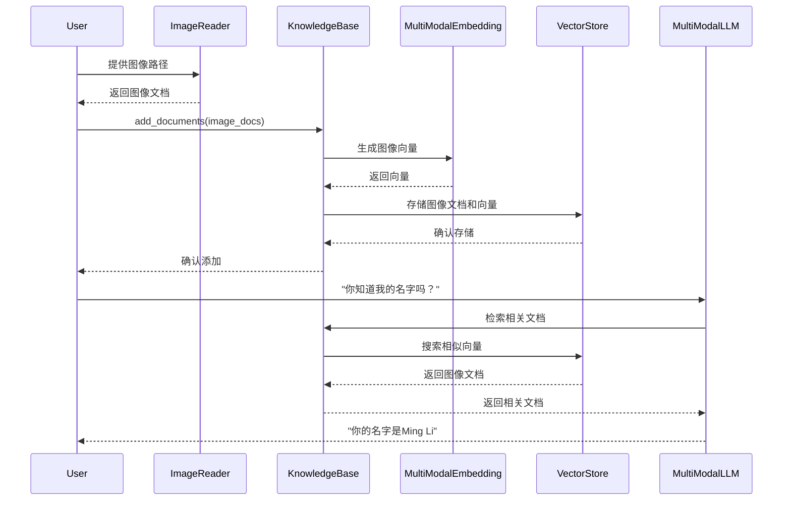
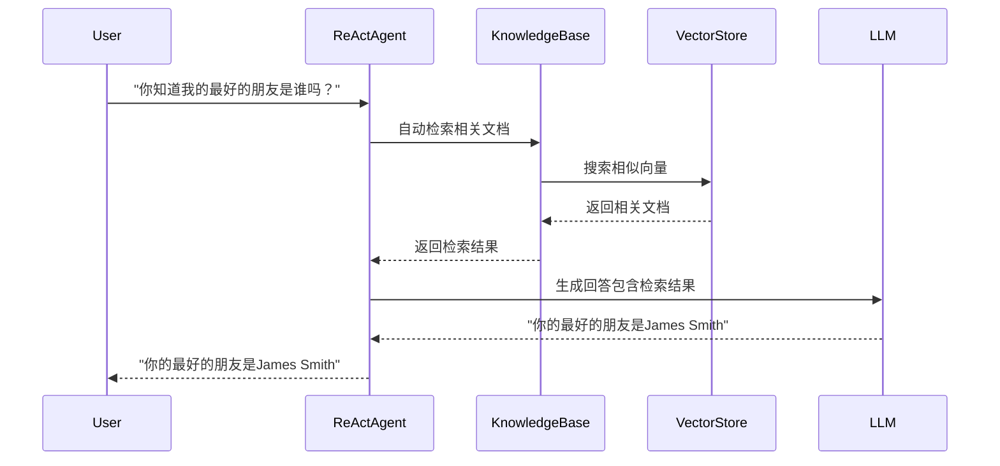

# RAG功能

<cite>
**本文档中引用的文件**  
- [__init__.py](file://src/agentscope/rag/__init__.py)
- [_knowledge_base.py](file://src/agentscope/rag/_knowledge_base.py)
- [_simple_knowledge.py](file://src/agentscope/rag/_simple_knowledge.py)
- [_document.py](file://src/agentscope/rag/_document.py)
- [_reader/__init__.py](file://src/agentscope/rag/_reader/__init__.py)
- [_reader/_reader_base.py](file://src/agentscope/rag/_reader/_reader_base.py)
- [_reader/_text_reader.py](file://src/agentscope/rag/_reader/_text_reader.py)
- [_reader/_pdf_reader.py](file://src/agentscope/rag/_reader/_pdf_reader.py)
- [_reader/_word_reader.py](file://src/agentscope/rag/_reader/_word_reader.py)
- [_reader/_image_reader.py](file://src/agentscope/rag/_reader/_image_reader.py)
- [_store/__init__.py](file://src/agentscope/rag/_store/__init__.py)
- [_store/_store_base.py](file://src/agentscope/rag/_store/_store_base.py)
- [_store/_milvuslite_store.py](file://src/agentscope/rag/_store/_milvuslite_store.py)
- [_store/_qdrant_store.py](file://src/agentscope/rag/_store/_qdrant_store.py)
- [examples/functionality/rag/basic_usage.py](file://examples/functionality/rag/basic_usage.py)
- [examples/functionality/rag/multimodal_rag.py](file://examples/functionality/rag/multimodal_rag.py)
- [examples/functionality/rag/react_agent_integration.py](file://examples/functionality/rag/react_agent_integration.py)
- [examples/functionality/rag/agentic_usage.py](file://examples/functionality/rag/agentic_usage.py)
</cite>

## 目录
1. [简介](#简介)
2. [知识库的创建与管理](#知识库的创建与管理)
3. [文档读取器机制](#文档读取器机制)
4. [向量存储后端集成](#向量存储后端集成)
5. [RAG应用构建流程](#rag应用构建流程)
6. [RAG使用示例](#rag使用示例)
7. [检索优化技术](#检索优化技术)
8. [性能监控与成本优化](#性能监控与成本优化)

## 简介

检索增强生成（RAG）是一种将外部知识库与大语言模型相结合的技术，通过从向量数据库中检索相关信息来增强模型的生成能力。在Agentscope框架中，RAG模块提供了完整的知识管理、文档解析、向量化和检索功能，支持多种文档格式和向量数据库后端。

该模块的核心组件包括文档读取器（Reader）、知识库（KnowledgeBase）、向量存储（VDBStore）和文档数据结构（Document），它们协同工作以实现高效的检索增强生成。系统支持文本、PDF、Word文档和图像等多种数据源，并可通过扩展支持更多格式。

**本节来源**  
- [__init__.py](file://src/agentscope/rag/__init__.py)

## 知识库的创建与管理

知识库是RAG系统的核心组件，负责管理文档的添加、检索和存储。在Agentscope中，`KnowledgeBase`是一个抽象基类，定义了`retrieve`和`add_documents`两个抽象方法，所有具体的知识库实现都必须继承并实现这些方法。

`SimpleKnowledge`类是`KnowledgeBase`的一个具体实现，它封装了向量存储和嵌入模型，提供了完整的知识管理功能。知识库的创建需要指定两个关键组件：向量存储后端（如QdrantStore或MilvusLiteStore）和嵌入模型（如DashScopeTextEmbedding）。这种设计实现了存储与计算的解耦，使得系统具有良好的可扩展性和灵活性。

知识库的管理包括文档的添加和检索。`add_documents`方法负责将文档转换为向量并存储到向量数据库中，而`retrieve`方法则根据查询语句从数据库中检索相关文档。此外，系统还提供了一个便捷的`retrieve_knowledge`方法，该方法将检索结果包装为工具响应格式，便于智能体直接使用。

**图示来源**  
- [_knowledge_base.py](file://src/agentscope/rag/_knowledge_base.py#L13-L131)
- [_simple_knowledge.py](file://src/agentscope/rag/_simple_knowledge.py#L10-L85)

**本节来源**  
- [_knowledge_base.py](file://src/agentscope/rag/_knowledge_base.py#L13-L131)
- [_simple_knowledge.py](file://src/agentscope/rag/_simple_knowledge.py#L10-L85)

## 文档读取器机制

文档读取器负责将原始数据解析为系统可处理的文档对象。Agentscope提供了多种读取器实现，包括`TextReader`、`PDFReader`、`WordReader`和`ImageReader`，它们都继承自`ReaderBase`基类。每个读取器都实现了`__call__`方法，用于将输入数据转换为`Document`对象列表。

`TextReader`是基础的文本读取器，支持按字符、句子或段落进行分块。它可以根据指定的`chunk_size`和`split_by`参数将长文本分割为多个较小的块，便于后续的向量化处理。`PDFReader`基于`TextReader`构建，首先使用`pypdf`库提取PDF文件中的文本内容，然后调用`TextReader`进行分块处理。

`WordReader`是最复杂的读取器，能够处理.docx格式文档中的文本、表格和图像内容。它支持将表格转换为Markdown或JSON格式，并可以选择是否将图像内容包含在输出中。`ImageReader`则专门用于处理图像数据，将图像URL或路径包装为文档对象，支持多模态RAG应用。

所有读取器都实现了`get_doc_id`方法，用于生成文档的唯一标识符。该方法通常基于输入数据的哈希值生成ID，确保相同内容的文档具有相同的ID，便于去重和更新。

**图示来源**  
- [_reader_base.py](file://src/agentscope/rag/_reader/_reader_base.py#L9-L28)
- [_text_reader.py](file://src/agentscope/rag/_reader/_text_reader.py#L13-L150)
- [_pdf_reader.py](file://src/agentscope/rag/_reader/_pdf_reader.py#L11-L87)
- [_word_reader.py](file://src/agentscope/rag/_reader/_word_reader.py#L205-L509)
- [_image_reader.py](file://src/agentscope/rag/_reader/_image_reader.py#L10-L68)

**本节来源**  
- [_reader_base.py](file://src/agentscope/rag/_reader/_reader_base.py#L9-L28)
- [_text_reader.py](file://src/agentscope/rag/_reader/_text_reader.py#L13-L150)
- [_pdf_reader.py](file://src/agentscope/rag/_reader/_pdf_reader.py#L11-L87)
- [_word_reader.py](file://src/agentscope/rag/_reader/_word_reader.py#L205-L509)
- [_image_reader.py](file://src/agentscope/rag/_reader/_image_reader.py#L10-L68)

## 向量存储后端集成

向量存储后端负责存储和检索向量数据，是RAG系统的基础设施。Agentscope通过`VDBStoreBase`抽象基类定义了统一的存储接口，目前支持Qdrant和Milvus Lite两种实现。

`QdrantStore`基于Qdrant向量数据库实现，支持本地内存模式和远程服务器模式。它使用`payload`字段存储文档元数据，包括文档ID、块ID和原始内容。QdrantStore支持多种距离度量方式，包括余弦相似度、欧几里得距离和点积。该实现使用异步Qdrant客户端，提供了高效的向量搜索能力。

`MilvusLiteStore`基于Milvus向量数据库实现，同样支持本地文件模式和远程服务器模式。在Milvus中，文档元数据存储在标量字段中，与向量数据一起存储。MilvusLiteStore支持COSINE、L2和IP三种距离度量方式，并提供了灵活的集合创建选项。

两种存储实现都遵循相同的接口规范，包括`add`、`search`和`delete`方法。`add`方法将文档及其向量添加到数据库中，`search`方法根据查询向量检索最相似的文档，`delete`方法则用于删除指定的文档。系统还提供了`get_client`方法，允许开发者访问底层数据库客户端的完整功能。

**图示来源**  
- [_store_base.py](file://src/agentscope/rag/_store/_store_base.py#L10-L50)
- [_qdrant_store.py](file://src/agentscope/rag/_store/_qdrant_store.py#L18-L174)
- [_milvuslite_store.py](file://src/agentscope/rag/_store/_milvuslite_store.py#L19-L258)

**本节来源**  
- [_store_base.py](file://src/agentscope/rag/_store/_store_base.py#L10-L50)
- [_qdrant_store.py](file://src/agentscope/rag/_store/_qdrant_store.py#L18-L174)
- [_milvuslite_store.py](file://src/agentscope/rag/_store/_milvuslite_store.py#L19-L258)

## RAG应用构建流程

构建一个完整的RAG应用需要经过文档加载、向量化、索引构建和检索生成四个主要步骤。首先，使用适当的文档读取器加载原始数据并将其分割为文档块。然后，通过嵌入模型将每个文档块转换为向量表示。接着，将文档及其向量存储到向量数据库中，构建索引。最后，在查询时，将查询语句向量化，并在数据库中检索最相关的文档。

文档加载阶段，根据数据源类型选择相应的读取器。例如，对于文本文件使用`TextReader`，对于PDF文件使用`PDFReader`。读取器会自动处理文件解析和分块，返回标准化的`Document`对象列表。

向量化阶段，系统使用指定的嵌入模型（如`DashScopeTextEmbedding`）将文档内容转换为固定长度的向量。嵌入模型的选择直接影响检索质量，应根据数据类型和应用场景选择合适的模型。

索引构建阶段，通过知识库的`add_documents`方法将文档批量添加到向量数据库中。该方法会自动处理向量化和存储过程，确保数据的一致性和完整性。

检索生成阶段，当收到查询请求时，系统首先将查询语句向量化，然后在向量空间中搜索最相似的文档。检索结果可以作为上下文提供给大语言模型，用于生成更准确的回答。

**图示来源**  
- [_document.py](file://src/agentscope/rag/_document.py#L17-L52)
- [_knowledge_base.py](file://src/agentscope/rag/_knowledge_base.py#L13-L131)
- [_simple_knowledge.py](file://src/agentscope/rag/_simple_knowledge.py#L10-L85)

**本节来源**  
- [_document.py](file://src/agentscope/rag/_document.py#L17-L52)
- [_knowledge_base.py](file://src/agentscope/rag/_knowledge_base.py#L13-L131)
- [_simple_knowledge.py](file://src/agentscope/rag/_simple_knowledge.py#L10-L85)

## RAG使用示例

### 基本RAG使用

基本RAG使用示例展示了如何创建知识库、添加文档和执行检索。首先，创建`TextReader`和`PDFReader`实例用于处理不同类型的文档。然后，初始化`SimpleKnowledge`知识库，指定`QdrantStore`作为向量存储后端和`DashScopeTextEmbedding`作为嵌入模型。接着，使用`add_documents`方法将文档添加到知识库中。最后，通过`retrieve`方法根据查询语句检索相关文档。

该示例还展示了如何调整检索参数，如`limit`（返回结果数量）和`score_threshold`（相似度阈值），以优化检索结果。通过调整这些参数，可以在召回率和精确率之间取得平衡。

**图示来源**  
- [basic_usage.py](file://examples/functionality/rag/basic_usage.py#L1-L80)

**本节来源**  
- [basic_usage.py](file://examples/functionality/rag/basic_usage.py#L1-L80)

### 多模态RAG

多模态RAG扩展了传统RAG的能力，使其能够处理图像等非文本数据。在多模态RAG示例中，首先使用`ImageReader`将图像文件转换为文档对象。然后，使用支持多模态输入的嵌入模型（如`DashScopeMultiModalEmbedding`）生成图像的向量表示。这些向量与文本向量一起存储在向量数据库中，形成统一的多模态知识库。

当智能体收到包含图像内容的查询时，系统会自动检索相关的图像文档，并将其作为上下文提供给多模态大语言模型（如`qwen3-vl-plus`）。这使得模型能够理解和回答与图像相关的问题，大大扩展了RAG的应用范围。

**图示来源**  
- [multimodal_rag.py](file://examples/functionality/rag/multimodal_rag.py#L1-L73)

**本节来源**  
- [multimodal_rag.py](file://examples/functionality/rag/multimodal_rag.py#L1-L73)

### 与智能体集成

RAG可以与ReAct智能体等高级智能体框架集成，为智能体提供外部知识支持。在集成示例中，将知识库作为参数传递给`ReActAgent`构造函数。当智能体需要回答问题时，它会自动使用知识库检索相关信息，并将检索结果作为上下文用于生成回答。

另一种集成方式是将RAG功能注册为工具。通过`Toolkit`的`register_tool_function`方法，可以将`retrieve_knowledge`方法注册为智能体可用的工具。智能体可以根据需要调用此工具，获取外部知识来辅助决策和回答问题。这种方式提供了更大的灵活性，允许智能体自主决定何时以及如何使用外部知识。

**图示来源**  
- [react_agent_integration.py](file://examples/functionality/rag/react_agent_integration.py#L1-L79)
- [agentic_usage.py](file://examples/functionality/rag/agentic_usage.py#L1-L102)

**本节来源**  
- [react_agent_integration.py](file://examples/functionality/rag/react_agent_integration.py#L1-L79)
- [agentic_usage.py](file://examples/functionality/rag/agentic_usage.py#L1-L102)

## 检索优化技术

### 检索精度优化

检索精度优化是提高RAG系统性能的关键。系统提供了多种参数来调整检索行为，包括`limit`（控制返回结果数量）和`score_threshold`（设置相似度阈值）。通过合理设置这些参数，可以在召回率和精确率之间取得平衡。

查询质量对检索结果有重大影响。建议使用具体且简洁的查询语句，避免使用代词（如"你"、"我"、"他"等）。对于同一问题，可以尝试多种不同的查询方式，以获得最佳结果。例如，将"我的最好的朋友是谁？"改为"John Doe的最好的朋友是谁？"可以显著提高检索精度。

### 相关性排序

相关性排序基于向量相似度计算，系统支持多种距离度量方式，包括余弦相似度、欧几里得距离和内积。余弦相似度是最常用的度量方式，它衡量两个向量方向的相似性，不受向量长度影响。

检索结果按相似度分数降序排列，分数越高表示相关性越强。用户可以通过`score_threshold`参数过滤掉低相关性的结果，确保只有高质量的文档被用作上下文。

### 上下文压缩

上下文压缩技术用于减少传递给大语言模型的上下文长度，从而降低计算成本和延迟。系统可以通过限制返回的文档数量（`limit`参数）或设置相似度阈值（`score_threshold`参数）来实现上下文压缩。

此外，还可以在应用层面对检索结果进行进一步处理，如提取关键信息、摘要生成等，以进一步压缩上下文。这种预处理不仅可以减少上下文长度，还可以提高信息密度，使模型更容易理解和利用外部知识。

**本节来源**  
- [_knowledge_base.py](file://src/agentscope/rag/_knowledge_base.py#L37-L131)
- [_simple_knowledge.py](file://src/agentscope/rag/_simple_knowledge.py#L13-L85)
- [basic_usage.py](file://examples/functionality/rag/basic_usage.py#L53-L76)

## 性能监控与成本优化

性能监控是确保RAG系统稳定运行的重要环节。系统提供了详细的日志记录功能，可以跟踪文档加载、向量化和检索等关键操作的执行情况。通过分析日志，可以识别性能瓶颈并进行针对性优化。

成本优化主要关注计算资源的使用效率。嵌入模型的调用通常是主要的成本来源，因此应尽量减少不必要的向量化操作。可以通过批量处理文档、缓存嵌入结果等方式降低调用频率。

向量数据库的选择和配置也影响系统成本。Qdrant和Milvus Lite都提供了内存模式，适合开发和测试环境。在生产环境中，应根据数据规模和查询负载选择合适的部署方案，并优化索引配置以提高查询效率。

定期清理过期或无用的文档可以减少存储成本并提高检索性能。虽然当前`QdrantStore`实现中删除功能尚未实现，但`MilvusLiteStore`支持基于ID或过滤表达式的删除操作，可用于文档生命周期管理。

**本节来源**  
- [_milvuslite_store.py](file://src/agentscope/rag/_store/_milvuslite_store.py#L221-L248)
- [_qdrant_store.py](file://src/agentscope/rag/_store/_qdrant_store.py#L159-L163)
- [_knowledge_base.py](file://src/agentscope/rag/_knowledge_base.py#L60-L73)