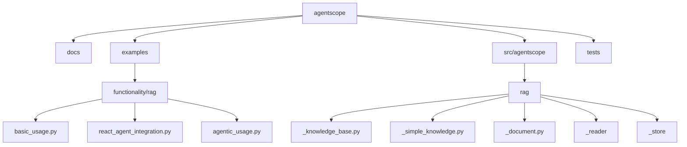
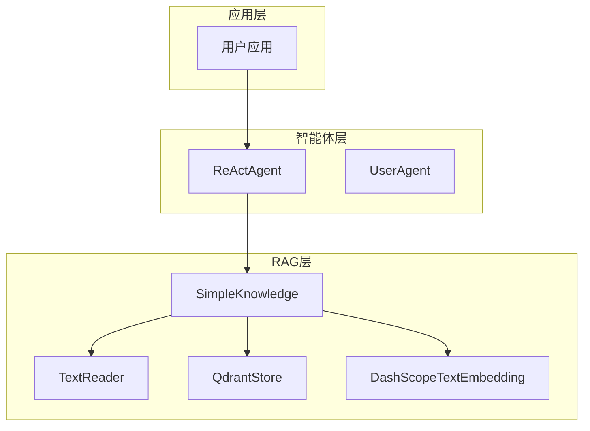
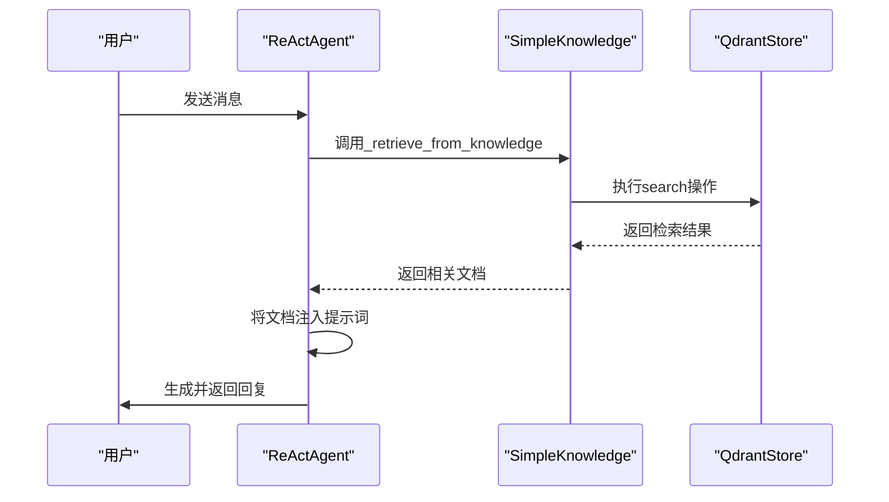
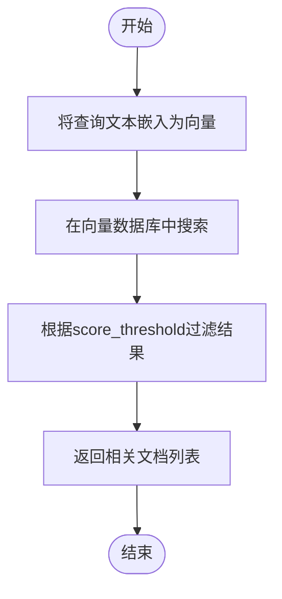
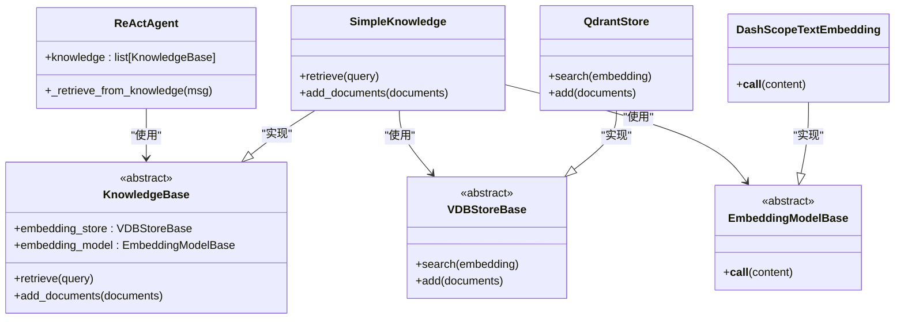

# 与智能体集成

<cite>
**本文档中引用的文件**  
- [react_agent_integration.py](file://examples/functionality/rag/react_agent_integration.py)
- [basic_usage.py](file://examples/functionality/rag/basic_usage.py)
- [agentic_usage.py](file://examples/functionality/rag/agentic_usage.py)
- [_react_agent.py](file://src/agentscope/agent/_react_agent.py)
- [_simple_knowledge.py](file://src/agentscope/rag/_simple_knowledge.py)
- [_knowledge_base.py](file://src/agentscope/rag/_knowledge_base.py)
- [_document.py](file://src/agentscope/rag/_document.py)
- [_text_reader.py](file://src/agentscope/rag/_reader/_text_reader.py)
- [_qdrant_store.py](file://src/agentscope/rag/_store/_qdrant_store.py)
</cite>

## 目录
1. [简介](#简介)
2. [项目结构](#项目结构)
3. [核心组件](#核心组件)
4. [架构概述](#架构概述)
5. [详细组件分析](#详细组件分析)
6. [依赖分析](#依赖分析)
7. [性能考量](#性能考量)
8. [故障排除指南](#故障排除指南)
9. [结论](#结论)

## 简介
本文档详细阐述了如何将检索增强生成（RAG）功能与ReAct智能体等Agent行为集成，实现动态知识检索与决策。通过`react_agent_integration.py`示例，展示智能体在执行任务时自动触发RAG查询的机制。解释检索结果如何作为上下文注入到智能体的提示词中，并影响其工具调用和推理过程。讨论集成过程中的关键设计，如检索时机控制、上下文长度管理、缓存策略和错误回退机制。提供性能监控指标和调试工具，帮助开发者优化智能体与RAG协同工作的效率和准确性。

## 项目结构
项目结构清晰地分为文档、示例、源代码和测试四个主要部分。`examples/functionality/rag/`目录下包含RAG功能的使用示例，包括基础用法、智能体集成和多模态RAG。`src/agentscope/rag/`目录下包含RAG模块的核心实现，包括知识库、文档、读取器和存储组件。

**Diagram sources**
- [react_agent_integration.py](file://examples/functionality/rag/react_agent_integration.py)
- [_simple_knowledge.py](file://src/agentscope/rag/_simple_knowledge.py)

**Section sources**
- [react_agent_integration.py](file://examples/functionality/rag/react_agent_integration.py)
- [basic_usage.py](file://examples/functionality/rag/basic_usage.py)

## 核心组件
RAG功能与智能体系统集成的核心组件包括知识库（KnowledgeBase）、文档（Document）、读取器（Reader）和存储（Store）。`SimpleKnowledge`类实现了`KnowledgeBase`抽象类，提供了具体的检索和添加文档的方法。`TextReader`和`PDFReader`等读取器负责将原始文本或文件分割成可处理的文档块。`QdrantStore`和`MilvusLiteStore`等存储组件负责向量数据库的交互。

**Section sources**
- [_simple_knowledge.py](file://src/agentscope/rag/_simple_knowledge.py)
- [_knowledge_base.py](file://src/agentscope/rag/_knowledge_base.py)
- [_document.py](file://src/agentscope/rag/_document.py)

## 架构概述
RAG与智能体集成的架构分为三个主要层次：应用层、智能体层和RAG层。应用层通过配置和调用智能体来执行任务。智能体层包含ReActAgent，它在推理过程中自动调用RAG功能。RAG层包含知识库、读取器和存储组件，负责文档的嵌入、存储和检索。

**Diagram sources**
- [react_agent_integration.py](file://examples/functionality/rag/react_agent_integration.py)
- [_react_agent.py](file://src/agentscope/agent/_react_agent.py)

## 详细组件分析

### ReAct智能体与RAG集成分析
`ReActAgent`类通过`knowledge`参数接收一个或多个`KnowledgeBase`实例。在每次回复时，智能体会自动调用`_retrieve_from_knowledge`方法，从知识库中检索相关信息，并将结果作为上下文注入到提示词中。

**Diagram sources**
- [_react_agent.py](file://src/agentscope/agent/_react_agent.py)
- [_simple_knowledge.py](file://src/agentscope/rag/_simple_knowledge.py)

**Section sources**
- [_react_agent.py](file://src/agentscope/agent/_react_agent.py#L767-L799)
- [react_agent_integration.py](file://examples/functionality/rag/react_agent_integration.py)

### 知识库检索机制分析
`SimpleKnowledge`类的`retrieve`方法首先使用嵌入模型将查询文本转换为向量，然后在向量数据库中进行相似性搜索，返回最相关的文档列表。

**Diagram sources**
- [_simple_knowledge.py](file://src/agentscope/rag/_simple_knowledge.py#L38-L52)
- [_qdrant_store.py](file://src/agentscope/rag/_store/_qdrant_store.py)

**Section sources**
- [_simple_knowledge.py](file://src/agentscope/rag/_simple_knowledge.py)
- [_knowledge_base.py](file://src/agentscope/rag/_knowledge_base.py)

## 依赖分析
RAG功能与智能体系统的集成依赖于多个核心组件之间的协作。`ReActAgent`依赖于`KnowledgeBase`接口，而`SimpleKnowledge`实现了该接口。`SimpleKnowledge`又依赖于`EmbeddingModelBase`和`VDBStoreBase`抽象类的具体实现，如`DashScopeTextEmbedding`和`QdrantStore`。

**Diagram sources**
- [_react_agent.py](file://src/agentscope/agent/_react_agent.py)
- [_knowledge_base.py](file://src/agentscope/rag/_knowledge_base.py)
- [_simple_knowledge.py](file://src/agentscope/rag/_simple_knowledge.py)

**Section sources**
- [_react_agent.py](file://src/agentscope/agent/_react_agent.py)
- [_knowledge_base.py](file://src/agentscope/rag/_knowledge_base.py)

## 性能考量
在集成RAG功能时，需要考虑多个性能因素。首先，向量嵌入和搜索操作可能成为性能瓶颈，特别是在处理大量文档时。其次，上下文长度管理至关重要，因为LLM的上下文窗口有限。可以通过设置`score_threshold`和`limit`参数来控制检索结果的数量，从而管理上下文长度。此外，可以实现缓存策略来避免重复的嵌入计算和数据库查询。

## 故障排除指南
在集成RAG功能时，可能会遇到以下常见问题：
- **检索结果不相关**：检查查询文本是否具体和简洁，尝试调整`score_threshold`参数。
- **性能低下**：考虑使用更高效的向量数据库或实现缓存策略。
- **上下文溢出**：减少`limit`参数的值，或实现更智能的文档摘要机制。
- **嵌入模型不支持**：确保使用的嵌入模型支持文档的模态（文本、图像等）。

**Section sources**
- [_simple_knowledge.py](file://src/agentscope/rag/_simple_knowledge.py#L67-L74)
- [_knowledge_base.py](file://src/agentscope/rag/_knowledge_base.py#L110-L129)

## 结论
通过将RAG功能与ReAct智能体集成，可以显著增强智能体的知识检索和决策能力。`react_agent_integration.py`示例展示了如何在智能体执行任务时自动触发RAG查询，并将检索结果作为上下文注入提示词中。关键设计包括检索时机控制、上下文长度管理、缓存策略和错误回退机制。通过合理配置和优化，可以构建高效、准确的智能体系统，为用户提供更智能的服务。