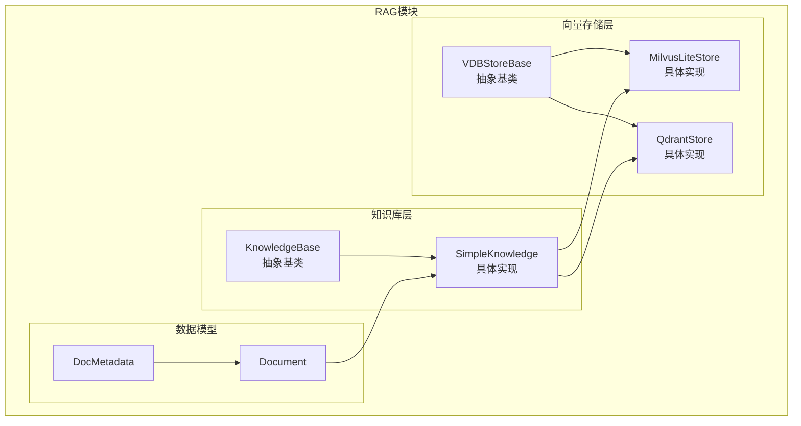
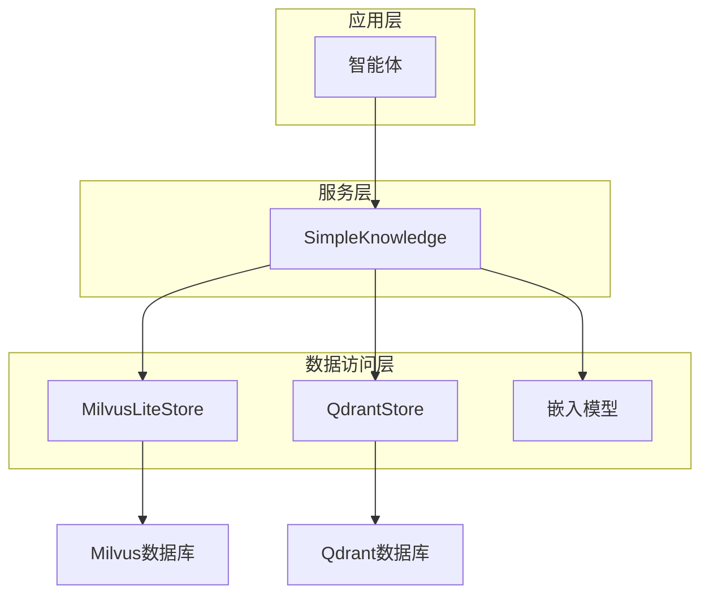
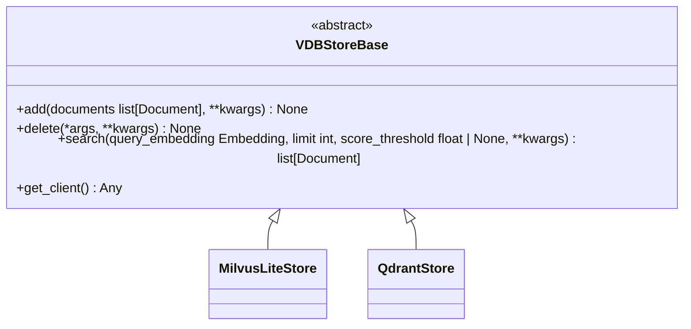
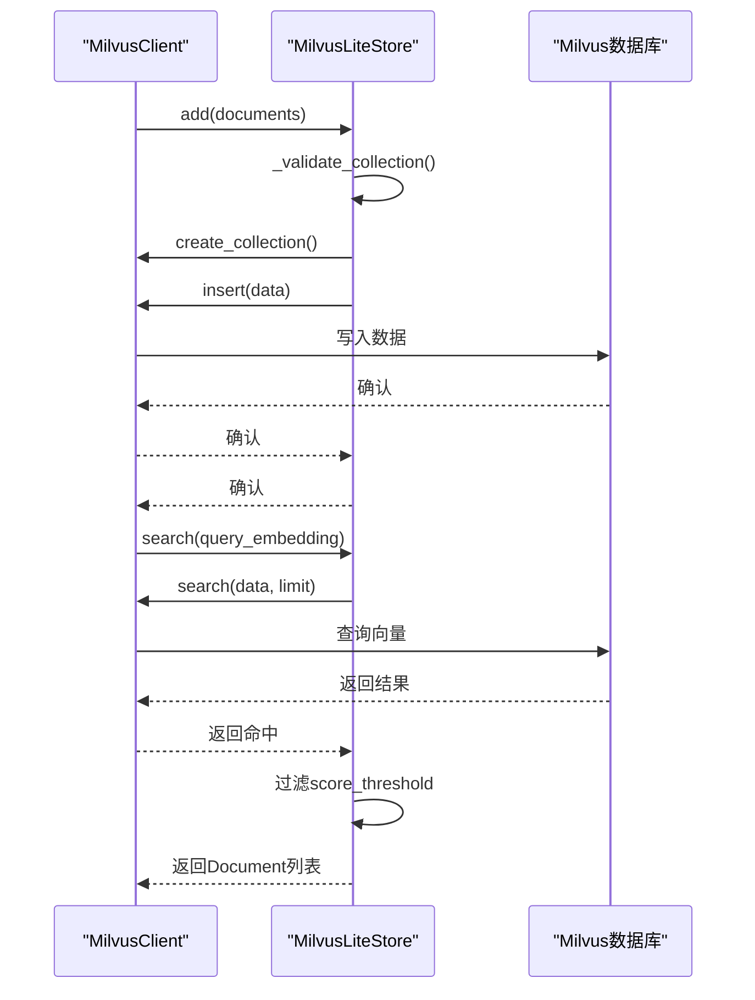
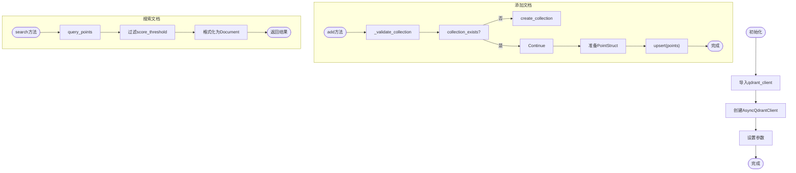
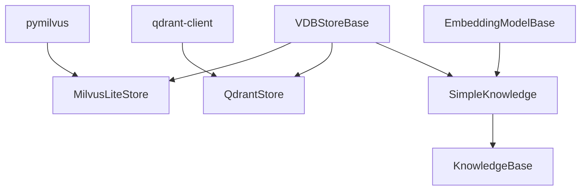

# 向量存储

<cite>
**本文档引用的文件**
- [\_store_base.py](file://src/agentscope/rag/_store/_store_base.py)
- [\_milvuslite_store.py](file://src/agentscope/rag/_store/_milvuslite_store.py)
- [\_qdrant_store.py](file://src/agentscope/rag/_store/_qdrant_store.py)
- [\_knowledge_base.py](file://src/agentscope/rag/_knowledge_base.py)
- [\_simple_knowledge.py](file://src/agentscope/rag/_simple_knowledge.py)
- [main.py](file://examples/functionality/vector_store/milvus_lite/main.py)
- [rag_store_test.py](file://tests/rag_store_test.py)
</cite>

## 目录
1. [引言](#引言)
2. [项目结构](#项目结构)
3. [核心组件](#核心组件)
4. [架构概述](#架构概述)
5. [详细组件分析](#详细组件分析)
6. [依赖分析](#依赖分析)
7. [性能考虑](#性能考虑)
8. [故障排除指南](#故障排除指南)
9. [结论](#结论)

## 引言
本文档全面介绍了AgentScope框架中RAG（检索增强生成）模块的向量存储系统。文档详细阐述了\_store_base.py中定义的抽象接口VDBStoreBase，以及其在\_milvuslite_store.py和\_qdrant_store.py中的具体实现。我们将深入探讨不同向量数据库后端的连接配置、索引管理、数据写入与查询优化策略，并对比它们的性能特点和适用场景，为用户选择合适的存储方案提供指导。此外，文档还包含向量数据库的初始化、集群配置、故障恢复和监控告警等运维指南，以及性能基准测试数据和扩展性建议，旨在帮助用户构建高可用、低延迟的RAG系统。

## 项目结构
向量存储模块位于`src/agentscope/rag/_store/`目录下，是RAG系统的核心组成部分。该模块采用分层架构，通过抽象基类定义统一接口，具体实现类则负责与不同的外部向量数据库进行交互。这种设计实现了数据存储逻辑与业务逻辑的解耦，提高了系统的灵活性和可扩展性。

**图示来源**
- [\_store_base.py](file://src/agentscope/rag/_store/_store_base.py)
- [\_milvuslite_store.py](file://src/agentscope/rag/_store/_milvuslite_store.py)
- [\_qdrant_store.py](file://src/agentscope/rag/_store/_qdrant_store.py)
- [\_knowledge_base.py](file://src/agentscope/rag/_knowledge_base.py)
- [\_simple_knowledge.py](file://src/agentscope/rag/_simple_knowledge.py)

**本节来源**
- [\_store](file://src/agentscope/rag/_store)

## 核心组件
向量存储模块的核心组件包括抽象接口`VDBStoreBase`、具体实现`MilvusLiteStore`和`QdrantStore`，以及上层的知识库抽象`KnowledgeBase`和`SimpleKnowledge`。`VDBStoreBase`定义了向量数据库操作的统一契约，包括添加、搜索和删除文档等基本方法。`MilvusLiteStore`和`QdrantStore`分别实现了与Milvus和Qdrant向量数据库的交互，封装了底层数据库的复杂性。`KnowledgeBase`作为更高层次的抽象，将向量存储与嵌入模型结合，提供了面向应用的知识检索功能。

**本节来源**
- [\_store_base.py](file://src/agentscope/rag/_store/_store_base.py#L10-L50)
- [\_milvuslite_store.py](file://src/agentscope/rag/_store/_milvuslite_store.py#L19-L258)
- [\_qdrant_store.py](file://src/agentscope/rag/_store/_qdrant_store.py#L18-L174)

## 架构概述
向量存储模块的架构遵循分层设计原则，从下到上分为数据访问层、服务层和应用层。数据访问层由`VDBStoreBase`及其子类构成，负责与外部向量数据库进行直接通信。服务层由`KnowledgeBase`及其子类构成，负责管理嵌入模型和向量存储的协同工作。应用层则通过调用服务层提供的API来实现具体的业务逻辑。

**图示来源**
- [\_knowledge_base.py](file://src/agentscope/rag/_knowledge_base.py#L13-L131)
- [\_simple_knowledge.py](file://src/agentscope/rag/_simple_knowledge.py#L10-L85)
- [\_milvuslite_store.py](file://src/agentscope/rag/_store/_milvuslite_store.py#L19-L258)
- [\_qdrant_store.py](file://src/agentscope/rag/_store/_qdrant_store.py#L18-L174)

## 详细组件分析
本节将深入分析向量存储模块中的各个关键组件，包括其设计原理、实现细节和使用方法。

### VDBStoreBase 抽象接口分析
`VDBStoreBase`是所有向量存储实现的抽象基类，它定义了向量数据库操作的标准接口。该类通过`abc`模块的`@abstractmethod`装饰器强制子类实现核心方法，确保了不同后端实现的一致性。

**图示来源**
- [\_store_base.py](file://src/agentscope/rag/_store/_store_base.py#L10-L50)

#### 核心方法说明
- **add**: 该方法用于将文档列表添加到向量数据库中。子类必须实现此方法以支持数据写入。
- **delete**: 该方法用于从向量数据库中删除文档。在`QdrantStore`中，此方法尚未实现。
- **search**: 该方法用于根据查询向量在数据库中检索最相关的文档。`score_threshold`参数可用于过滤低相关性的结果。
- **get_client**: 该方法返回底层向量数据库的客户端实例，允许开发者访问数据库的全部功能。

**本节来源**
- [\_store_base.py](file://src/agentscope/rag/_store/_store_base.py#L10-L50)

### MilvusLiteStore 实现分析
`MilvusLiteStore`是Milvus向量数据库的实现，支持本地文件存储和远程服务器连接。它利用`pymilvus`库提供的`MilvusClient` API进行操作，简化了与Milvus的交互。

**图示来源**
- [\_milvuslite_store.py](file://src/agentscope/rag/_store/_milvuslite_store.py#L19-L258)

#### 连接与配置
`MilvusLiteStore`通过`uri`参数区分本地和远程连接。本地模式使用文件路径（如`./milvus.db`），远程模式使用HTTP URI（如`http://localhost:19530`）。`token`参数用于远程连接的身份验证。

#### 索引与数据管理
该实现自动管理集合（collection）的生命周期。在首次写入时，`_validate_collection`方法会检查集合是否存在，若不存在则创建。文档的元数据（如`doc_id`、`chunk_id`）被存储为标量字段，与向量数据一同保存。

**本节来源**
- [\_milvuslite_store.py](file://src/agentscope/rag/_store/_milvuslite_store.py#L19-L258)

### QdrantStore 实现分析
`QdrantStore`是Qdrant向量数据库的实现，同样支持内存、本地文件和远程服务器三种模式。它使用`qdrant-client`库的异步API，与`MilvusLiteStore`相比，其元数据存储方式有所不同。

**图示来源**
- [\_qdrant_store.py](file://src/agentscope/rag/_store/_qdrant_store.py#L18-L174)

#### 元数据存储
与Milvus不同，Qdrant使用`payload`字段来存储文档的元数据。在`add`方法中，`DocMetadata`对象被直接作为`payload`传递给`PointStruct`，这使得元数据的结构更加灵活。

#### 功能限制
目前`QdrantStore`的`delete`方法尚未实现，这意味着无法通过该接口删除已存储的文档。这是一个需要在后续版本中完善的功能。

**本节来源**
- [\_qdrant_store.py](file://src/agentscope/rag/_store/_qdrant_store.py#L18-L174)

## 依赖分析
向量存储模块的依赖关系清晰，体现了良好的模块化设计。`VDBStoreBase`作为抽象层，不依赖任何具体实现。`MilvusLiteStore`和`QdrantStore`分别依赖于`pymilvus`和`qdrant-client`这两个外部库。上层的`SimpleKnowledge`类依赖于`VDBStoreBase`和`EmbeddingModelBase`，实现了知识检索的核心逻辑。

**图示来源**
- [pyproject.toml](file://pyproject.toml)
- [\_milvuslite_store.py](file://src/agentscope/rag/_store/_milvuslite_store.py#L65)
- [\_qdrant_store.py](file://src/agentscope/rag/_store/_qdrant_store.py#L59)

**本节来源**
- [pyproject.toml](file://pyproject.toml)
- [\_store](file://src/agentscope/rag/_store)

## 性能考虑
选择合适的向量数据库后端对系统性能至关重要。`MilvusLiteStore`和`QdrantStore`各有优势。Milvus以其高性能和丰富的功能著称，特别适合大规模、高并发的生产环境。Qdrant则以其轻量级和易用性见长，适合快速原型开发和中小型应用。`score_threshold`参数的合理设置可以有效减少返回结果的数量，从而降低网络传输和后续处理的开销。对于高延迟的远程连接，建议使用连接池和异步操作来提高吞吐量。

## 故障排除指南
在使用向量存储模块时，可能会遇到以下常见问题：
- **导入错误**: 如果出现`ImportError`，请确保已安装相应的客户端库（`pymilvus[milvus_lite]`或`qdrant-client`）。
- **连接失败**: 检查`uri`或`location`参数是否正确，确保数据库服务正在运行。
- **搜索无结果**: 尝试降低`score_threshold`的值，或检查查询文本和文档的嵌入模型是否匹配。
- **Windows兼容性**: `MilvusLiteStore`目前不支持Windows操作系统，建议在Linux或macOS环境下使用。

**本节来源**
- [\_milvuslite_store.py](file://src/agentscope/rag/_store/_milvuslite_store.py#L67-L70)
- [\_qdrant_store.py](file://src/agentscope/rag/_store/_qdrant_store.py#L61-L64)
- [rag_store_test.py](file://tests/rag_store_test.py#L78-L79)

## 结论
AgentScope的向量存储模块通过清晰的分层架构和抽象接口，为RAG系统提供了强大而灵活的数据存储能力。`VDBStoreBase`定义了统一的API，使得切换不同的向量数据库后端变得简单。`MilvusLiteStore`和`QdrantStore`的实现展示了如何与主流向量数据库进行高效集成。通过合理选择存储后端并优化配置，开发者可以构建出满足不同场景需求的高性能RAG应用。未来的工作可以集中在完善`QdrantStore`的删除功能和提供更详细的性能监控指标上。