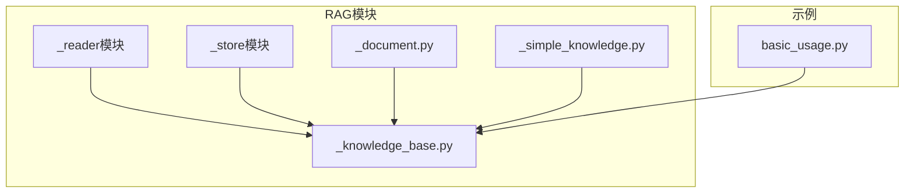
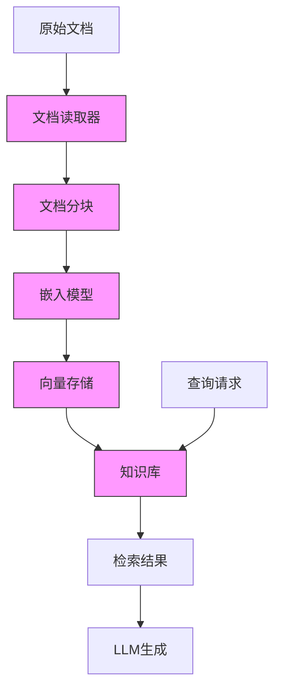
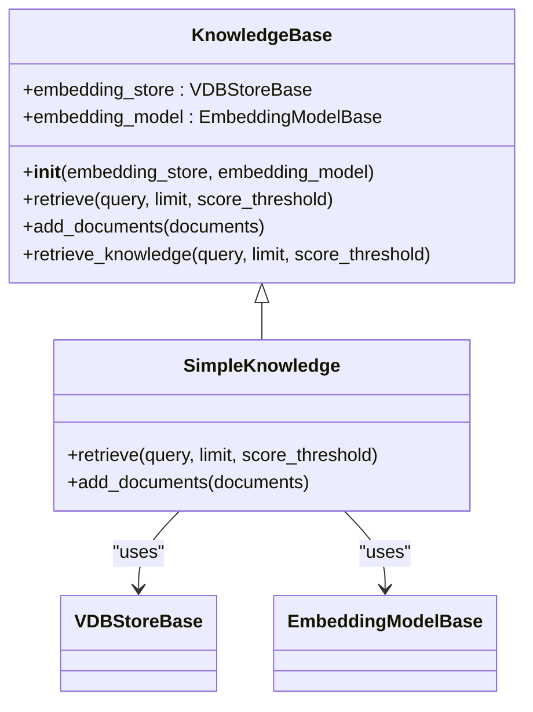
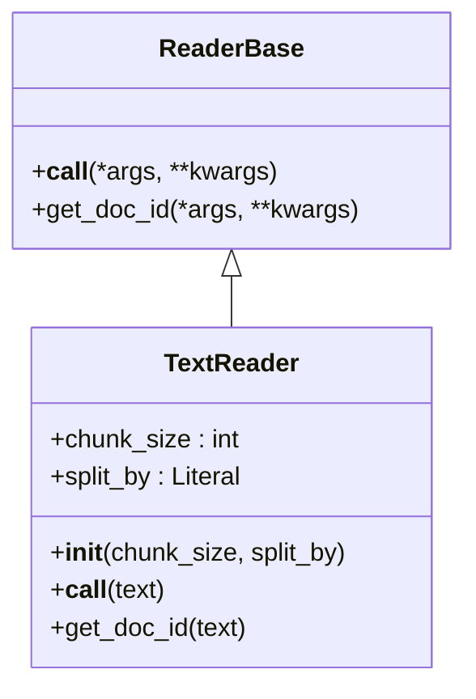
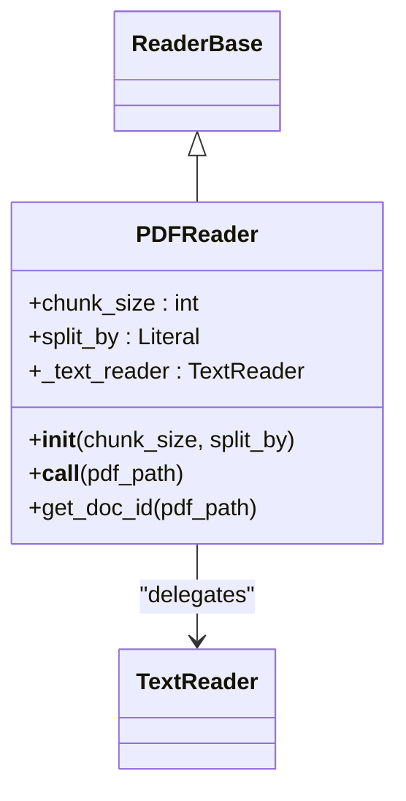
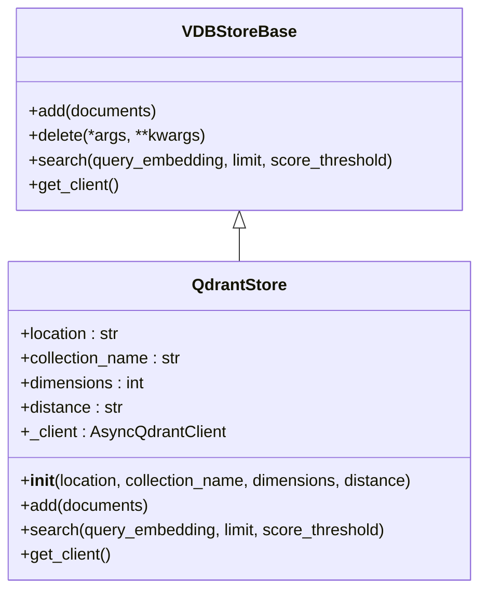
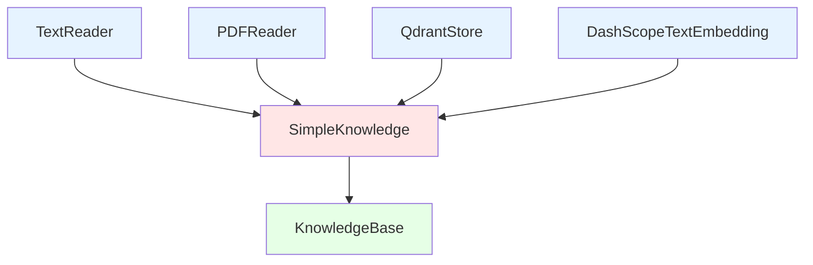

# 基本使用

<cite>
**本文档中引用的文件**  
- [basic_usage.py](file://examples/functionality/rag/basic_usage.py)
- [knowledge_base.py](file://src/agentscope/rag/_knowledge_base.py)
- [simple_knowledge.py](file://src/agentscope/rag/_simple_knowledge.py)
- [document.py](file://src/agentscope/rag/_document.py)
- [text_reader.py](file://src/agentscope/rag/_reader/_text_reader.py)
- [pdf_reader.py](file://src/agentscope/rag/_reader/_pdf_reader.py)
- [qdrant_store.py](file://src/agentscope/rag/_store/_qdrant_store.py)
- [embedding_base.py](file://src/agentscope/embedding/_embedding_base.py)
</cite>

## 目录
1. [简介](#简介)
2. [项目结构](#项目结构)
3. [核心组件](#核心组件)
4. [架构概述](#架构概述)
5. [详细组件分析](#详细组件分析)
6. [依赖分析](#依赖分析)
7. [性能考虑](#性能考虑)
8. [故障排除指南](#故障排除指南)
9. [结论](#结论)

## 简介
本文档详细介绍了AgentScope中检索增强生成（RAG）功能的基本使用方法。重点涵盖知识库的创建与初始化、文本文档加载、向量索引构建以及检索增强生成的执行流程。通过分析`basic_usage.py`示例，展示从文档加载到查询响应的完整链路。文档还深入解析了`KnowledgeBase`类的接口设计、参数配置和调用流程，解释文档分块策略、嵌入模型集成方式以及检索结果与大语言模型（LLM）生成的结合机制。同时提供常见问题的排查方法和最佳实践建议。

## 项目结构
RAG功能在AgentScope项目中位于`src/agentscope/rag/`目录下，主要包含以下几个子模块：
- `_reader/`：负责文档读取和分块处理
- `_store/`：负责向量数据库的存储和检索
- `_knowledge_base.py`：定义知识库的抽象基类
- `_simple_knowledge.py`：提供知识库的简单实现
- `_document.py`：定义文档数据结构

示例代码位于`examples/functionality/rag/`目录下，其中`basic_usage.py`展示了RAG功能的基本使用方法。

**图源**
- [basic_usage.py](file://examples/functionality/rag/basic_usage.py)
- [knowledge_base.py](file://src/agentscope/rag/_knowledge_base.py)

**节源**
- [basic_usage.py](file://examples/functionality/rag/basic_usage.py)
- [knowledge_base.py](file://src/agentscope/rag/_knowledge_base.py)

## 核心组件
RAG功能的核心组件包括文档读取器（Reader）、向量存储（Store）、嵌入模型（Embedding Model）和知识库（Knowledge Base）。这些组件协同工作，实现从原始文档到可检索知识的转换。

**节源**
- [knowledge_base.py](file://src/agentscope/rag/_knowledge_base.py)
- [simple_knowledge.py](file://src/agentscope/rag/_simple_knowledge.py)

## 架构概述
AgentScope的RAG架构采用分层设计，各组件职责明确，便于扩展和维护。整体架构包括文档读取层、向量存储层、嵌入模型层和知识库抽象层。

**图源**
- [knowledge_base.py](file://src/agentscope/rag/_knowledge_base.py)
- [simple_knowledge.py](file://src/agentscope/rag/_simple_knowledge.py)

## 详细组件分析

### 知识库类分析
`KnowledgeBase`是RAG功能的核心抽象类，定义了知识库的基本接口。`SimpleKnowledge`是其具体实现，提供了完整的RAG功能。

#### 类图

**图源**
- [knowledge_base.py](file://src/agentscope/rag/_knowledge_base.py#L13-L131)
- [simple_knowledge.py](file://src/agentscope/rag/_simple_knowledge.py#L10-L85)

### 文档读取器分析
文档读取器负责将原始文档读取并分割成适合处理的块。AgentScope提供了多种读取器，包括文本读取器和PDF读取器。

#### 文本读取器

**图源**
- [text_reader.py](file://src/agentscope/rag/_reader/_text_reader.py#L13-L150)
- [reader_base.py](file://src/agentscope/rag/_reader/_reader_base.py#L9-L28)

#### PDF读取器

**图源**
- [pdf_reader.py](file://src/agentscope/rag/_reader/_pdf_reader.py#L11-L87)
- [text_reader.py](file://src/agentscope/rag/_reader/_text_reader.py#L13-L150)

### 向量存储分析
向量存储负责存储和检索向量数据。AgentScope提供了Qdrant和MilvusLite两种存储实现。

#### Qdrant存储

**图源**
- [qdrant_store.py](file://src/agentscope/rag/_store/_qdrant_store.py#L18-L174)
- [store_base.py](file://src/agentscope/rag/_store/_store_base.py#L10-L50)

**节源**
- [qdrant_store.py](file://src/agentscope/rag/_store/_qdrant_store.py#L1-L174)
- [store_base.py](file://src/agentscope/rag/_store/_store_base.py#L1-L50)

## 依赖分析
RAG功能的组件之间存在清晰的依赖关系，形成了一个完整的处理链路。

**图源**
- [basic_usage.py](file://examples/functionality/rag/basic_usage.py)
- [simple_knowledge.py](file://src/agentscope/rag/_simple_knowledge.py)

**节源**
- [basic_usage.py](file://examples/functionality/rag/basic_usage.py#L6-L12)
- [simple_knowledge.py](file://src/agentscope/rag/_simple_knowledge.py#L10-L85)

## 性能考虑
在使用RAG功能时，需要考虑以下性能因素：
- 文档分块大小：过大的块可能导致信息丢失，过小的块可能影响上下文连贯性
- 嵌入模型选择：不同模型的维度和计算复杂度不同，影响处理速度
- 向量存储配置：内存存储适合开发测试，持久化存储适合生产环境
- 检索参数：limit和score_threshold参数需要根据具体场景调整

## 故障排除指南
### 检索结果不相关
可能原因及解决方案：
- 查询不够具体：尝试使用更具体的查询语句
- 分数阈值过高：降低score_threshold参数值
- 文档分块不当：调整chunk_size和split_by参数
- 嵌入模型不匹配：尝试使用更适合的嵌入模型

### 响应延迟高
可能原因及解决方案：
- 文档过大：优化文档分块策略
- 向量存储性能：检查向量数据库的性能配置
- 网络延迟：确保嵌入模型API的网络连接稳定
- 并发处理：考虑使用异步处理提高效率

**节源**
- [knowledge_base.py](file://src/agentscope/rag/_knowledge_base.py#L77-L131)
- [simple_knowledge.py](file://src/agentscope/rag/_simple_knowledge.py#L13-L53)

## 结论
AgentScope的RAG功能提供了完整的检索增强生成解决方案，通过模块化设计实现了高可扩展性和易用性。`KnowledgeBase`抽象类和`SimpleKnowledge`实现类构成了核心功能，配合多种文档读取器和向量存储选项，能够满足不同场景的需求。通过合理配置文档分块策略、嵌入模型和检索参数，可以构建高效的RAG系统。建议在实际使用中根据具体需求调整参数，并遵循最佳实践以获得最佳效果。