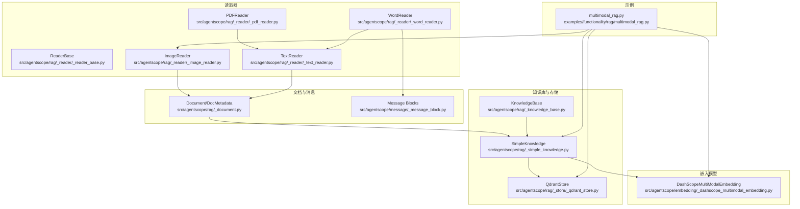
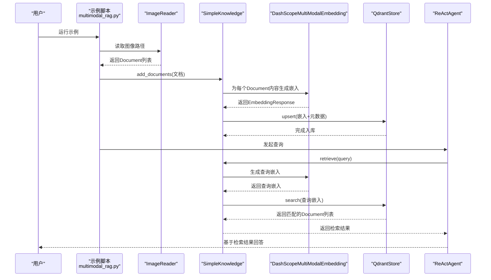
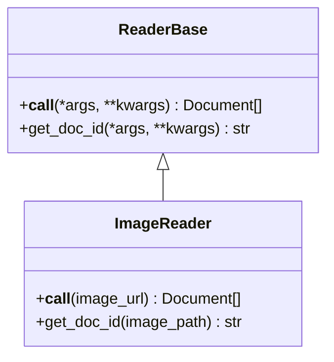
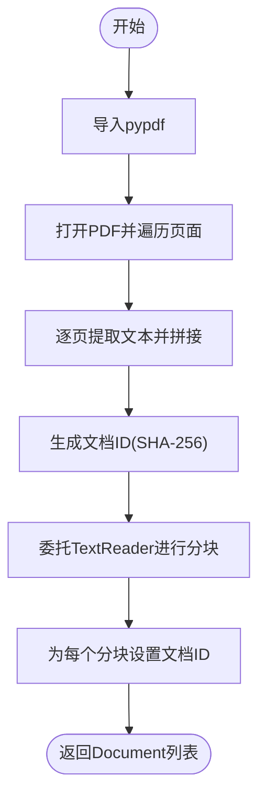
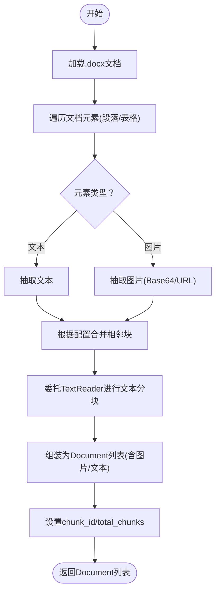
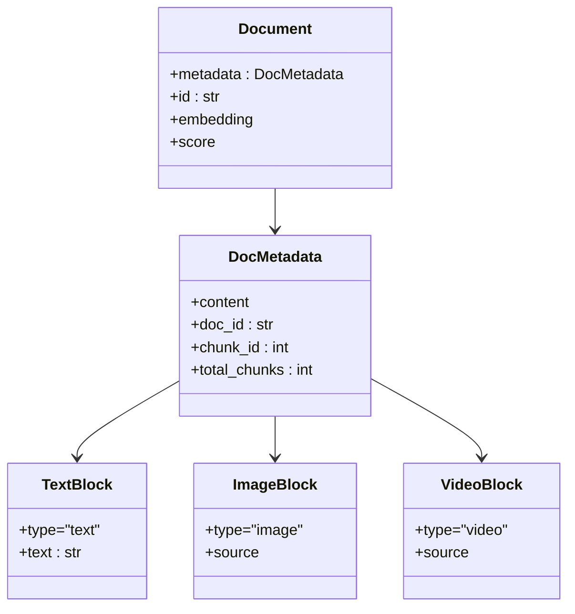
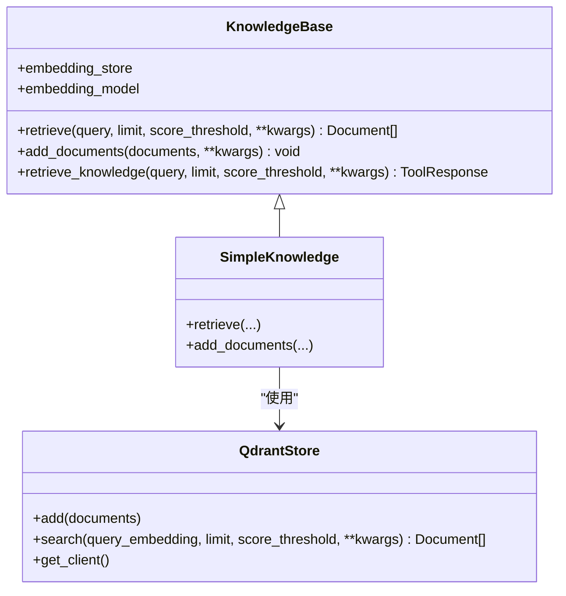
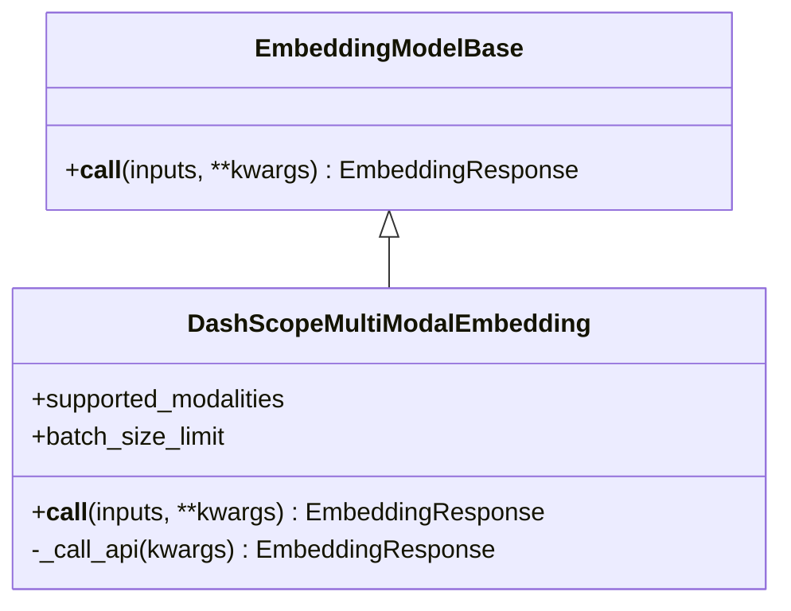
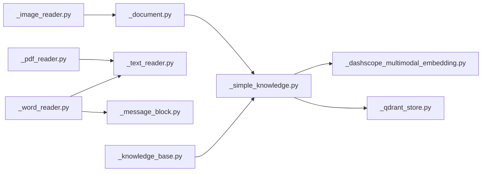

# 多模态RAG

<cite>
**本文引用的文件**
- [multimodal_rag.py](file://examples/functionality/rag/multimodal_rag.py)
- [_image_reader.py](file://src/agentscope/rag/_reader/_image_reader.py)
- [_pdf_reader.py](file://src/agentscope/rag/_reader/_pdf_reader.py)
- [_text_reader.py](file://src/agentscope/rag/_reader/_text_reader.py)
- [_word_reader.py](file://src/agentscope/rag/_reader/_word_reader.py)
- [_reader_base.py](file://src/agentscope/rag/_reader/_reader_base.py)
- [_document.py](file://src/agentscope/rag/_document.py)
- [_knowledge_base.py](file://src/agentscope/rag/_knowledge_base.py)
- [_simple_knowledge.py](file://src/agentscope/rag/_simple_knowledge.py)
- [_qdrant_store.py](file://src/agentscope/rag/_store/_qdrant_store.py)
- [_dashscope_multimodal_embedding.py](file://src/agentscope/embedding/_dashscope_multimodal_embedding.py)
- [_message_block.py](file://src/agentscope/message/_message_block.py)
</cite>

## 目录
1. [引言](#引言)
2. [项目结构](#项目结构)
3. [核心组件](#核心组件)
4. [架构总览](#架构总览)
5. [组件详解](#组件详解)
6. [依赖关系分析](#依赖关系分析)
7. [性能考量](#性能考量)
8. [故障排查指南](#故障排查指南)
9. [结论](#结论)
10. [附录](#附录)

## 引言
本文件围绕 AgentScope 的多模态检索增强生成（RAG）能力进行系统化说明，重点覆盖：
- 图像、PDF 等非文本格式文档的解析与分块策略
- 多模态特征提取与嵌入生成流程
- 基于示例脚本的跨模态检索实践
- 多模态嵌入模型选择与配置要点
- 不同类型数据的融合检索策略
- 实际应用中的挑战与优化建议

## 项目结构
多模态 RAG 在 AgentScope 中由“读取器”“文档结构”“知识库抽象与实现”“向量存储”“嵌入模型”等模块协同完成。下图给出与多模态 RAG 相关的核心文件与职责映射。

图表来源
- [_reader_base.py](file://src/agentscope/rag/_reader/_reader_base.py#L1-L28)
- [_image_reader.py](file://src/agentscope/rag/_reader/_image_reader.py#L1-L68)
- [_pdf_reader.py](file://src/agentscope/rag/_reader/_pdf_reader.py#L1-L87)
- [_text_reader.py](file://src/agentscope/rag/_reader/_text_reader.py#L1-L150)
- [_word_reader.py](file://src/agentscope/rag/_reader/_word_reader.py#L1-L509)
- [_document.py](file://src/agentscope/rag/_document.py#L1-L52)
- [_knowledge_base.py](file://src/agentscope/rag/_knowledge_base.py#L1-L131)
- [_simple_knowledge.py](file://src/agentscope/rag/_simple_knowledge.py#L1-L85)
- [_qdrant_store.py](file://src/agentscope/rag/_store/_qdrant_store.py#L1-L174)
- [_dashscope_multimodal_embedding.py](file://src/agentscope/embedding/_dashscope_multimodal_embedding.py#L1-L245)
- [_message_block.py](file://src/agentscope/message/_message_block.py#L1-L127)
- [multimodal_rag.py](file://examples/functionality/rag/multimodal_rag.py#L1-L73)

章节来源
- [multimodal_rag.py](file://examples/functionality/rag/multimodal_rag.py#L1-L73)
- [_reader_base.py](file://src/agentscope/rag/_reader/_reader_base.py#L1-L28)
- [_document.py](file://src/agentscope/rag/_document.py#L1-L52)
- [_knowledge_base.py](file://src/agentscope/rag/_knowledge_base.py#L1-L131)
- [_simple_knowledge.py](file://src/agentscope/rag/_simple_knowledge.py#L1-L85)
- [_qdrant_store.py](file://src/agentscope/rag/_store/_qdrant_store.py#L1-L174)
- [_dashscope_multimodal_embedding.py](file://src/agentscope/embedding/_dashscope_multimodal_embedding.py#L1-L245)
- [_message_block.py](file://src/agentscope/message/_message_block.py#L1-L127)

## 核心组件
- 读取器基类：定义统一的异步调用接口与文档 ID 生成规范，为不同格式的数据提供一致的输出结构。
- 文档与消息块：以统一的数据块类型承载文本、图像、视频等内容，便于嵌入模型处理。
- 知识库抽象与实现：封装嵌入模型与向量数据库的交互，提供检索与入库流程。
- 向量存储：以 Qdrant 为例，支持本地内存或远程实例，提供 upsert/search 能力。
- 多模态嵌入模型：对接 DashScope 多模态嵌入 API，支持文本、图像、视频输入，并按模型差异设置维度与批大小限制。

章节来源
- [_reader_base.py](file://src/agentscope/rag/_reader/_reader_base.py#L1-L28)
- [_document.py](file://src/agentscope/rag/_document.py#L1-L52)
- [_knowledge_base.py](file://src/agentscope/rag/_knowledge_base.py#L1-L131)
- [_simple_knowledge.py](file://src/agentscope/rag/_simple_knowledge.py#L1-L85)
- [_qdrant_store.py](file://src/agentscope/rag/_store/_qdrant_store.py#L1-L174)
- [_dashscope_multimodal_embedding.py](file://src/agentscope/embedding/_dashscope_multimodal_embedding.py#L1-L245)
- [_message_block.py](file://src/agentscope/message/_message_block.py#L1-L127)

## 架构总览
下图展示了从“输入数据到检索结果”的端到端流程，包括图像读取、文档分块、嵌入生成、入库与检索。

图表来源
- [multimodal_rag.py](file://examples/functionality/rag/multimodal_rag.py#L1-L73)
- [_image_reader.py](file://src/agentscope/rag/_reader/_image_reader.py#L1-L68)
- [_simple_knowledge.py](file://src/agentscope/rag/_simple_knowledge.py#L1-L85)
- [_dashscope_multimodal_embedding.py](file://src/agentscope/embedding/_dashscope_multimodal_embedding.py#L1-L245)
- [_qdrant_store.py](file://src/agentscope/rag/_store/_qdrant_store.py#L1-L174)

## 组件详解

### 图像读取器（ImageReader）
- 职责：将图像 URL 或本地路径包装为文档对象，用于后续嵌入与检索。
- 关键点：
  - 支持单个或多个图像路径输入，统一转换为 ImageBlock 并写入 DocMetadata。
  - 使用哈希生成文档 ID，确保可重复性与去重基础。
- 输出：Document 列表，其中 content 为 ImageBlock。

图表来源
- [_reader_base.py](file://src/agentscope/rag/_reader/_reader_base.py#L1-L28)
- [_image_reader.py](file://src/agentscope/rag/_reader/_image_reader.py#L1-L68)

章节来源
- [_image_reader.py](file://src/agentscope/rag/_reader/_image_reader.py#L1-L68)
- [_reader_base.py](file://src/agentscope/rag/_reader/_reader_base.py#L1-L28)

### PDF 读取器（PDFReader）
- 职责：读取 PDF 内容并按固定大小切分为文本块，再复用 TextReader 完成分块逻辑。
- 关键点：
  - 依赖 pypdf 提取每页文本并合并。
  - 使用 SHA-256 生成文档 ID，便于去重。
  - 将所有分块的 doc_id 统一设置为文档级 ID。
- 输出：Document 列表，content 为 TextBlock。

图表来源
- [_pdf_reader.py](file://src/agentscope/rag/_reader/_pdf_reader.py#L1-L87)
- [_text_reader.py](file://src/agentscope/rag/_reader/_text_reader.py#L1-L150)

章节来源
- [_pdf_reader.py](file://src/agentscope/rag/_reader/_pdf_reader.py#L1-L87)
- [_text_reader.py](file://src/agentscope/rag/_reader/_text_reader.py#L1-L150)

### Word 读取器（WordReader）
- 职责：从 .docx 文件中抽取文本、表格与图片，按顺序组织为数据块；文本部分使用 TextReader 分块；图片以 ImageBlock 形式保留。
- 关键点：
  - 支持两种表格导出格式：Markdown 或 JSON 字符串。
  - 可选择是否包含图片，若启用需使用支持图像输入的嵌入模型。
  - 文档内块顺序保持原文件顺序，便于上下文连贯。
- 输出：Document 列表，content 可为 TextBlock 或包含图片的结构化内容。

图表来源
- [_word_reader.py](file://src/agentscope/rag/_reader/_word_reader.py#L1-L509)
- [_text_reader.py](file://src/agentscope/rag/_reader/_text_reader.py#L1-L150)

章节来源
- [_word_reader.py](file://src/agentscope/rag/_reader/_word_reader.py#L1-L509)
- [_text_reader.py](file://src/agentscope/rag/_reader/_text_reader.py#L1-L150)

### 文档与消息块
- Document/DocMetadata：统一承载内容、文档 ID、分块 ID、总分块数与嵌入结果。
- Message Blocks：定义 TextBlock、ImageBlock、VideoBlock 等内容块，作为嵌入模型输入的基础单元。

图表来源
- [_document.py](file://src/agentscope/rag/_document.py#L1-L52)
- [_message_block.py](file://src/agentscope/message/_message_block.py#L1-L127)

章节来源
- [_document.py](file://src/agentscope/rag/_document.py#L1-L52)
- [_message_block.py](file://src/agentscope/message/_message_block.py#L1-L127)

### 知识库与向量存储
- KnowledgeBase 抽象：定义 retrieve/add_documents 接口，提供便捷的 retrieve_knowledge 工具方法。
- SimpleKnowledge 实现：负责将文档内容送入嵌入模型，写入向量存储，并执行检索。
- QdrantStore：支持本地内存或远程实例，使用 payload 存储元数据，提供 upsert/search。

图表来源
- [_knowledge_base.py](file://src/agentscope/rag/_knowledge_base.py#L1-L131)
- [_simple_knowledge.py](file://src/agentscope/rag/_simple_knowledge.py#L1-L85)
- [_qdrant_store.py](file://src/agentscope/rag/_store/_qdrant_store.py#L1-L174)

章节来源
- [_knowledge_base.py](file://src/agentscope/rag/_knowledge_base.py#L1-L131)
- [_simple_knowledge.py](file://src/agentscope/rag/_simple_knowledge.py#L1-L85)
- [_qdrant_store.py](file://src/agentscope/rag/_store/_qdrant_store.py#L1-L174)

### 多模态嵌入模型（DashScopeMultiModalEmbedding）
- 支持模态：text、image、video。
- 维度与批大小：根据模型前缀自动校验维度与批大小限制；支持缓存命中直接返回。
- 输入格式：对不同模态进行规范化，例如图像支持 base64 或 URL，视频仅支持 URL。
- 输出：EmbeddingResponse，包含 embeddings、usage 与 source。

图表来源
- [_dashscope_multimodal_embedding.py](file://src/agentscope/embedding/_dashscope_multimodal_embedding.py#L1-L245)

章节来源
- [_dashscope_multimodal_embedding.py](file://src/agentscope/embedding/_dashscope_multimodal_embedding.py#L1-L245)

### 示例：跨模态检索（multimodal_rag.py）
- 流程概览：生成示例图像 -> 使用 ImageReader 读取 -> 构建 SimpleKnowledge（指定 DashScope 多模态嵌入与 QdrantStore）-> 添加文档 -> 创建 ReActAgent -> 执行查询并打印检索到的文档内容。
- 关键点：嵌入维度与模型名称需与 DashScope 多模态嵌入模型要求一致；Qdrant 集合维度需与嵌入维度匹配。

章节来源
- [multimodal_rag.py](file://examples/functionality/rag/multimodal_rag.py#L1-L73)

## 依赖关系分析
- 低耦合高内聚：读取器各自独立，统一输出 Document；知识库与存储解耦，便于替换向量库。
- 模型约束：SimpleKnowledge 在 add_documents 时会检查内容模态是否被嵌入模型支持，避免运行期错误。
- 数据一致性：QdrantStore 使用 payload 存储 DocMetadata，检索时重建 Document，保证检索结果的完整性。

图表来源
- [_image_reader.py](file://src/agentscope/rag/_reader/_image_reader.py#L1-L68)
- [_pdf_reader.py](file://src/agentscope/rag/_reader/_pdf_reader.py#L1-L87)
- [_text_reader.py](file://src/agentscope/rag/_reader/_text_reader.py#L1-L150)
- [_word_reader.py](file://src/agentscope/rag/_reader/_word_reader.py#L1-L509)
- [_document.py](file://src/agentscope/rag/_document.py#L1-L52)
- [_knowledge_base.py](file://src/agentscope/rag/_knowledge_base.py#L1-L131)
- [_simple_knowledge.py](file://src/agentscope/rag/_simple_knowledge.py#L1-L85)
- [_qdrant_store.py](file://src/agentscope/rag/_store/_qdrant_store.py#L1-L174)
- [_dashscope_multimodal_embedding.py](file://src/agentscope/embedding/_dashscope_multimodal_embedding.py#L1-L245)
- [_message_block.py](file://src/agentscope/message/_message_block.py#L1-L127)

章节来源
- [_simple_knowledge.py](file://src/agentscope/rag/_simple_knowledge.py#L1-L85)
- [_qdrant_store.py](file://src/agentscope/rag/_store/_qdrant_store.py#L1-L174)
- [_dashscope_multimodal_embedding.py](file://src/agentscope/embedding/_dashscope_multimodal_embedding.py#L1-L245)

## 性能考量
- 嵌入批大小与维度
  - 不同模型具有不同的批大小限制与推荐维度，应在初始化时正确设置，避免运行时报错或性能不佳。
- 缓存利用
  - 多模态嵌入模型支持缓存，合理使用可显著降低重复请求与延迟。
- 向量库参数
  - QdrantStore 的距离度量与集合维度需与嵌入维度一致；内存模式适合小规模测试，生产环境建议使用远程实例。
- 文本分块策略
  - TextReader 支持按字符、句子、段落分块；英文场景可使用句子分块，中文建议按段落或字符分块以避免截断语义。

章节来源
- [_dashscope_multimodal_embedding.py](file://src/agentscope/embedding/_dashscope_multimodal_embedding.py#L1-L245)
- [_qdrant_store.py](file://src/agentscope/rag/_store/_qdrant_store.py#L1-L174)
- [_text_reader.py](file://src/agentscope/rag/_reader/_text_reader.py#L1-L150)

## 故障排查指南
- 嵌入模型不支持的模态
  - 现象：添加文档时报错提示不支持该模态。
  - 处理：确认文档内容类型与嵌入模型支持的模态一致；必要时更换模型或调整读取器输出。
- PDF/Word 依赖缺失
  - 现象：ImportError 提示缺少 pypdf 或 python-docx。
  - 处理：安装对应依赖后重试。
- Qdrant 客户端未安装
  - 现象：ImportError 提示缺少 qdrant-client。
  - 处理：安装 qdrant-client。
- 查询阈值过严导致无结果
  - 现象：retrieve_knowledge 返回“无相关文档”。
  - 处理：适当降低 score_threshold 或增加 limit，或改写更具体的查询词。
- 视频输入限制
  - 现象：多模态嵌入 API 仅支持 URL 输入视频。
  - 处理：确保视频以 URL 形式提供，或改用图像/文本输入。

章节来源
- [_simple_knowledge.py](file://src/agentscope/rag/_simple_knowledge.py#L1-L85)
- [_pdf_reader.py](file://src/agentscope/rag/_reader/_pdf_reader.py#L1-L87)
- [_word_reader.py](file://src/agentscope/rag/_reader/_word_reader.py#L1-L509)
- [_qdrant_store.py](file://src/agentscope/rag/_store/_qdrant_store.py#L1-L174)
- [_dashscope_multimodal_embedding.py](file://src/agentscope/embedding/_dashscope_multimodal_embedding.py#L1-L245)

## 结论
AgentScope 的多模态 RAG 通过标准化的读取器、文档结构与知识库实现，实现了从图像、PDF、Word 等多源数据到统一嵌入与检索的完整链路。结合 DashScope 多模态嵌入模型与 Qdrant 向量库，可在实际应用中快速构建跨模态检索系统。实践中应关注模态支持、维度与批大小配置、缓存与向量库参数，以获得稳定且高效的检索效果。

## 附录

### 多模态嵌入模型选择与配置要点
- 模型前缀与维度
  - 多模态嵌入模型前缀通常决定默认维度与批大小限制，应在初始化时明确维度并遵循模型约束。
- 批大小与吞吐
  - 对于支持更大批大小的模型，可提升批量处理效率；对于单条输入模型，需逐条处理并聚合结果。
- 缓存策略
  - 对重复输入进行缓存，可显著降低 API 调用次数与延迟。

章节来源
- [_dashscope_multimodal_embedding.py](file://src/agentscope/embedding/_dashscope_multimodal_embedding.py#L1-L245)

### 跨模态检索实践建议
- 图像到文本描述
  - 使用图像读取器生成 Document，结合多模态嵌入模型与检索，再由对话模型生成自然语言描述。
- 图文问答
  - 将图像与相关文本同时嵌入，提高检索相关性；在提示工程中强调图文联合推理。
- 表格与图片混合
  - WordReader 可将表格导出为 Markdown 或 JSON，便于检索与后续处理；图片与文本分块需保持上下文连贯。

章节来源
- [_image_reader.py](file://src/agentscope/rag/_reader/_image_reader.py#L1-L68)
- [_word_reader.py](file://src/agentscope/rag/_reader/_word_reader.py#L1-L509)
- [multimodal_rag.py](file://examples/functionality/rag/multimodal_rag.py#L1-L73)