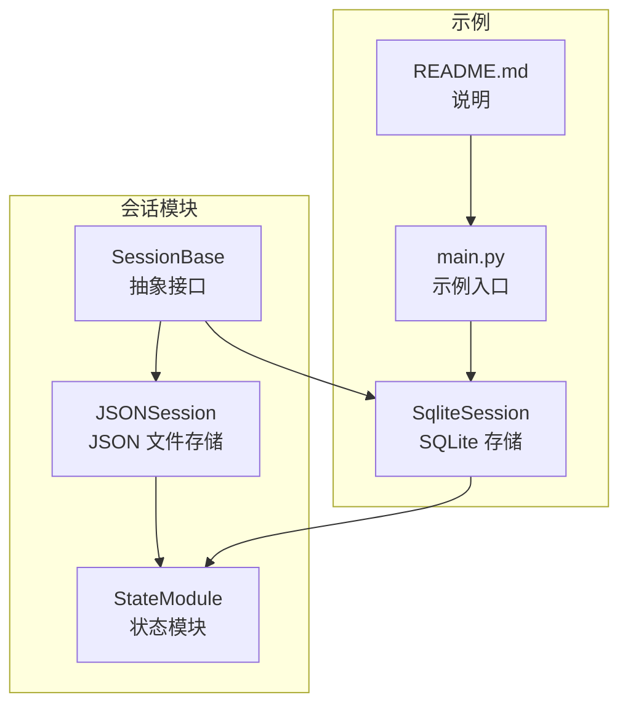
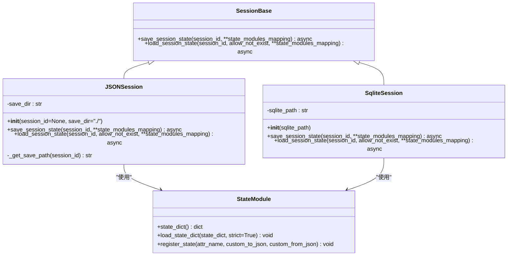
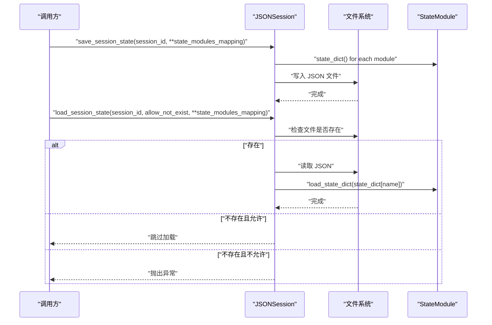
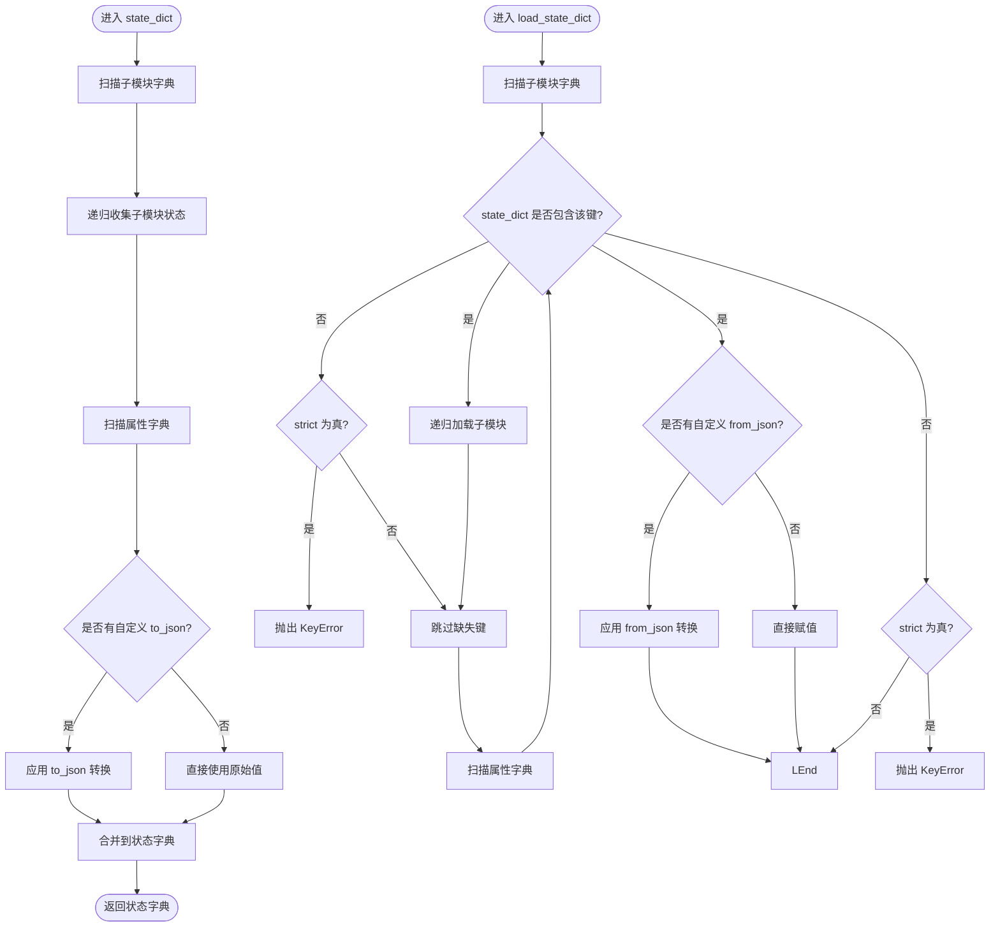
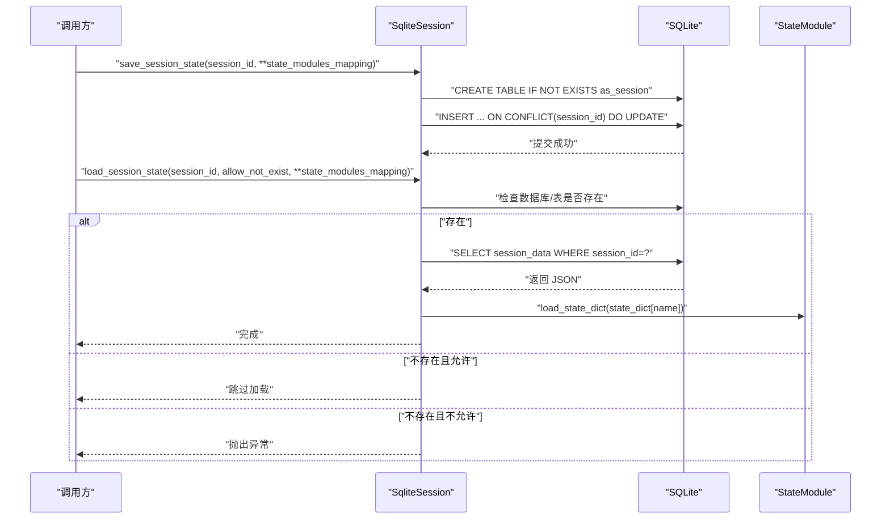
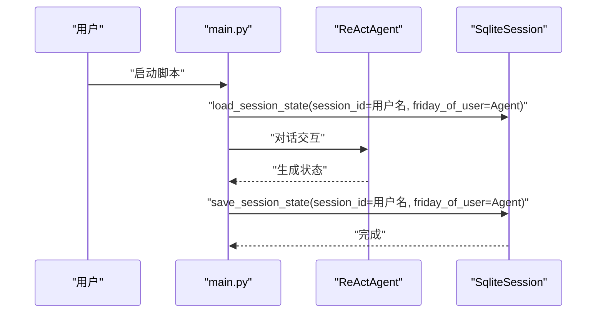
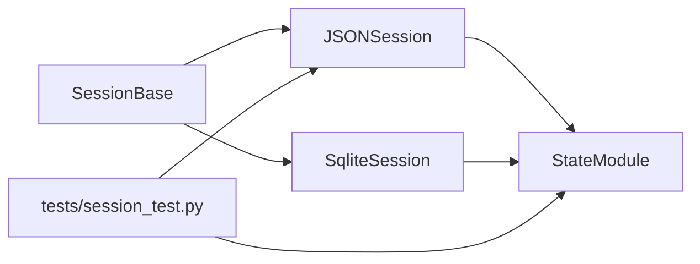

# 会话管理

<cite>
**本文引用的文件列表**
- [src/agentscope/session/__init__.py](file://src/agentscope/session/__init__.py)
- [src/agentscope/session/_session_base.py](file://src/agentscope/session/_session_base.py)
- [src/agentscope/session/_json_session.py](file://src/agentscope/session/_json_session.py)
- [src/agentscope/module/_state_module.py](file://src/agentscope/module/_state_module.py)
- [examples/functionality/session_with_sqlite/sqlite_session.py](file://examples/functionality/session_with_sqlite/sqlite_session.py)
- [examples/functionality/session_with_sqlite/main.py](file://examples/functionality/session_with_sqlite/main.py)
- [examples/functionality/session_with_sqlite/README.md](file://examples/functionality/session_with_sqlite/README.md)
- [tests/session_test.py](file://tests/session_test.py)
</cite>

## 目录
1. [简介](#简介)
2. [项目结构](#项目结构)
3. [核心组件](#核心组件)
4. [架构总览](#架构总览)
5. [详细组件分析](#详细组件分析)
6. [依赖关系分析](#依赖关系分析)
7. [性能考虑](#性能考虑)
8. [故障排查指南](#故障排查指南)
9. [结论](#结论)
10. [附录](#附录)

## 简介
本文件系统性阐述 agentscope 中的会话管理能力，包括：
- 会话的概念、生命周期与状态管理机制
- JSON 会话存储的实现原理与使用方法
- 与 SQLite 数据库集成的配置与实践
- 会话数据的序列化、持久化与恢复流程
- 跨请求上下文保持与状态管理示例
- 安全、过期策略与并发访问控制的建议
- 性能优化（缓存策略、数据库索引）与监控诊断工具

## 项目结构
会话管理相关代码主要位于 session 模块与示例工程中：
- 会话接口与基类：session/_session_base.py
- JSON 会话实现：session/_json_session.py
- 状态模块（支持嵌套序列化/反序列化）：module/_state_module.py
- 示例：session_with_sqlite（演示基于 SQLite 的会话存储）

图表来源
- [src/agentscope/session/_session_base.py](file://src/agentscope/session/_session_base.py#L1-L34)
- [src/agentscope/session/_json_session.py](file://src/agentscope/session/_json_session.py#L1-L118)
- [src/agentscope/module/_state_module.py](file://src/agentscope/module/_state_module.py#L1-L152)
- [examples/functionality/session_with_sqlite/sqlite_session.py](file://examples/functionality/session_with_sqlite/sqlite_session.py#L1-L168)
- [examples/functionality/session_with_sqlite/main.py](file://examples/functionality/session_with_sqlite/main.py#L1-L77)
- [examples/functionality/session_with_sqlite/README.md](file://examples/functionality/session_with_sqlite/README.md#L1-L25)

章节来源
- [src/agentscope/session/__init__.py](file://src/agentscope/session/__init__.py#L1-L11)
- [src/agentscope/session/_session_base.py](file://src/agentscope/session/_session_base.py#L1-L34)
- [src/agentscope/session/_json_session.py](file://src/agentscope/session/_json_session.py#L1-L118)
- [src/agentscope/module/_state_module.py](file://src/agentscope/module/_state_module.py#L1-L152)
- [examples/functionality/session_with_sqlite/sqlite_session.py](file://examples/functionality/session_with_sqlite/sqlite_session.py#L1-L168)
- [examples/functionality/session_with_sqlite/main.py](file://examples/functionality/session_with_sqlite/main.py#L1-L77)
- [examples/functionality/session_with_sqlite/README.md](file://examples/functionality/session_with_sqlite/README.md#L1-L25)

## 核心组件
- SessionBase：定义会话保存与加载的异步接口，约定以 session_id 作为键，state_modules_mapping 为多状态模块映射。
- JSONSession：基于 JSON 文件的会话存储实现，负责将多个状态模块序列化为字典并写入/从 JSON 文件读取。
- StateModule：提供嵌套状态的序列化与反序列化能力，并支持自定义 JSON 转换函数。
- SqliteSession（示例）：基于 SQLite 的会话存储实现，使用 JSON 字符串存储会话数据，支持唯一键冲突更新与时间戳字段。

章节来源
- [src/agentscope/session/_session_base.py](file://src/agentscope/session/_session_base.py#L1-L34)
- [src/agentscope/session/_json_session.py](file://src/agentscope/session/_json_session.py#L1-L118)
- [src/agentscope/module/_state_module.py](file://src/agentscope/module/_state_module.py#L1-L152)
- [examples/functionality/session_with_sqlite/sqlite_session.py](file://examples/functionality/session_with_sqlite/sqlite_session.py#L1-L168)

## 架构总览
会话管理采用“接口 + 多实现”的设计模式：
- SessionBase 抽象出统一的保存/加载协议
- JSONSession 实现本地文件存储
- SqliteSession 实现数据库存储
- StateModule 提供状态序列化/反序列化的通用能力

图表来源
- [src/agentscope/session/_session_base.py](file://src/agentscope/session/_session_base.py#L1-L34)
- [src/agentscope/session/_json_session.py](file://src/agentscope/session/_json_session.py#L1-L118)
- [examples/functionality/session_with_sqlite/sqlite_session.py](file://examples/functionality/session_with_sqlite/sqlite_session.py#L1-L168)
- [src/agentscope/module/_state_module.py](file://src/agentscope/module/_state_module.py#L1-L152)

## 详细组件分析

### SessionBase 接口
- 角色：定义会话保存与加载的异步协议，参数包含 session_id 与多个状态模块实例映射。
- 设计要点：通过抽象方法约束实现类必须支持按 session_id 进行保存/加载；允许在加载时选择是否允许不存在。

章节来源
- [src/agentscope/session/_session_base.py](file://src/agentscope/session/_session_base.py#L1-L34)

### JSONSession 实现
- 初始化：支持指定保存目录；构造函数中的 session_id 参数已标记为弃用，建议在保存/加载时传入 session_id。
- 保存流程：遍历 state_modules_mapping，调用每个模块的 state_dict，合并为字典后以 UTF-8 编码写入 JSON 文件。
- 加载流程：根据 session_id 计算文件路径；若存在则读取 JSON 并逐个模块调用 load_state_dict；allow_not_exist 控制不存在时的行为。
- 错误处理：当 allow_not_exist 为 False 且文件不存在时抛出异常。

图表来源
- [src/agentscope/session/_json_session.py](file://src/agentscope/session/_json_session.py#L1-L118)
- [src/agentscope/module/_state_module.py](file://src/agentscope/module/_state_module.py#L1-L152)

章节来源
- [src/agentscope/session/_json_session.py](file://src/agentscope/session/_json_session.py#L1-L118)

### StateModule 状态模块
- 嵌套序列化：支持将继承自 StateModule 的子模块与通过 register_state 注册的属性纳入状态字典。
- 自定义序列化：register_state 可提供自定义的 to_json/from_json 函数；未提供时要求原属性可被 JSON 序列化。
- 反序列化策略：strict=True 时缺失键会抛错；False 则跳过缺失项。

图表来源
- [src/agentscope/module/_state_module.py](file://src/agentscope/module/_state_module.py#L1-L152)

章节来源
- [src/agentscope/module/_state_module.py](file://src/agentscope/module/_state_module.py#L1-L152)

### SqliteSession 实现（示例）
- 初始化：接收 SQLite 文件路径。
- 保存流程：将多个状态模块序列化为 JSON 字符串，创建表（如不存在），使用唯一键冲突更新策略写入或更新记录。
- 加载流程：先检查数据库文件与表是否存在；查询对应 session_id 的记录；解析 JSON 并逐个模块加载；缺失模块或记录时依据 allow_not_exist 决定日志或抛错。
- 时间戳：创建与更新均记录时间戳，便于审计与过期策略。

图表来源
- [examples/functionality/session_with_sqlite/sqlite_session.py](file://examples/functionality/session_with_sqlite/sqlite_session.py#L1-L168)

章节来源
- [examples/functionality/session_with_sqlite/sqlite_session.py](file://examples/functionality/session_with_sqlite/sqlite_session.py#L1-L168)

### 使用示例：跨请求上下文保持
- 示例入口：通过 main.py 创建代理、加载会话、对话、保存会话。
- 关键点：以用户名作为 session_id，多次运行可恢复之前的上下文，实现跨请求的状态延续。

图表来源
- [examples/functionality/session_with_sqlite/main.py](file://examples/functionality/session_with_sqlite/main.py#L1-L77)
- [examples/functionality/session_with_sqlite/sqlite_session.py](file://examples/functionality/session_with_sqlite/sqlite_session.py#L1-L168)

章节来源
- [examples/functionality/session_with_sqlite/main.py](file://examples/functionality/session_with_sqlite/main.py#L1-L77)
- [examples/functionality/session_with_sqlite/README.md](file://examples/functionality/session_with_sqlite/README.md#L1-L25)

## 依赖关系分析
- SessionBase 是 JSONSession 与 SqliteSession 的共同父类，二者均依赖 StateModule 的序列化/反序列化能力。
- JSONSession 依赖文件系统进行读写；SqliteSession 依赖 SQLite 引擎。
- 测试用例展示了如何将多个状态模块（如代理与内存）一起保存/加载。

图表来源
- [src/agentscope/session/_session_base.py](file://src/agentscope/session/_session_base.py#L1-L34)
- [src/agentscope/session/_json_session.py](file://src/agentscope/session/_json_session.py#L1-L118)
- [examples/functionality/session_with_sqlite/sqlite_session.py](file://examples/functionality/session_with_sqlite/sqlite_session.py#L1-L168)
- [src/agentscope/module/_state_module.py](file://src/agentscope/module/_state_module.py#L1-L152)
- [tests/session_test.py](file://tests/session_test.py#L1-L88)

章节来源
- [tests/session_test.py](file://tests/session_test.py#L1-L88)

## 性能考虑
- 文件系统 I/O
  - JSONSession：频繁写入可能带来磁盘压力。建议：
    - 合并保存时机：批量更新后再统一保存
    - 异步写入：利用现有异步接口减少阻塞
    - 路径与权限：确保保存目录存在且具备写权限
- 数据库 I/O
  - SqliteSession：SQLite 适合轻量场景；建议：
    - 唯一键约束：使用 session_id 作为主键，避免重复写入
    - 索引策略：对 session_id 建立索引以加速查询
    - 连接池：在高并发下考虑连接复用与事务批处理
    - 日志与审计：利用 created_at/updated_at 字段进行统计与清理
- 序列化成本
  - StateModule 的嵌套序列化/反序列化在大对象上会有开销；建议：
    - 对大对象使用自定义序列化函数，减少冗余字段
    - 仅注册必要的状态属性，避免过度序列化
- 缓存策略
  - 可在应用层引入内存缓存（如 LRU）以降低重复加载频率
  - 对热点会话进行预热，减少首次加载延迟

[本节为通用性能建议，不直接分析具体文件]

## 故障排查指南
- JSON 文件不存在
  - 现象：加载阶段提示文件不存在并跳过或抛错
  - 处理：确认 session_id 正确、保存目录存在且有写权限；或设置 allow_not_exist=True
- JSON 文件格式错误
  - 现象：读取 JSON 失败
  - 处理：检查文件完整性；必要时删除或修复
- 状态模块缺失
  - 现象：加载时某模块不在 session 数据中
  - 处理：确保保存时包含该模块；或在严格模式下补充缺失模块
- SQLite 数据库/表不存在
  - 现象：数据库文件或表不存在
  - 处理：首次运行会自动创建表；若删除需重新初始化
- 严格模式错误
  - 现象：strict=True 时缺失键抛错
  - 处理：调整 strict 或补齐状态字典

章节来源
- [src/agentscope/session/_json_session.py](file://src/agentscope/session/_json_session.py#L77-L118)
- [examples/functionality/session_with_sqlite/sqlite_session.py](file://examples/functionality/session_with_sqlite/sqlite_session.py#L86-L168)
- [src/agentscope/module/_state_module.py](file://src/agentscope/module/_state_module.py#L74-L107)

## 结论
- 会话管理通过 SessionBase 抽象统一了保存/加载协议，JSONSession 与 SqliteSession 分别提供了文件与数据库两种持久化方案。
- StateModule 提供了灵活的嵌套状态序列化/反序列化能力，配合自定义转换函数可覆盖复杂对象。
- 示例展示了跨请求的上下文保持与状态恢复，适用于多轮对话与长周期任务。
- 面向生产环境，建议结合数据库索引、连接池与应用层缓存提升性能，并完善安全与过期策略。

[本节为总结性内容，不直接分析具体文件]

## 附录

### 会话生命周期与状态管理机制
- 生命周期
  - 创建：初始化 Session 实例（JSON 或 SQLite）
  - 加载：按 session_id 从存储介质读取状态并注入各状态模块
  - 更新：在业务交互中修改状态模块，随后保存
  - 清理：可按需删除文件或记录，或通过过期策略定期清理
- 状态管理
  - 通过 StateModule.register_state 注册需要持久化的属性
  - 嵌套模块自动纳入状态字典，简化复杂对象的序列化

章节来源
- [src/agentscope/session/_session_base.py](file://src/agentscope/session/_session_base.py#L1-L34)
- [src/agentscope/module/_state_module.py](file://src/agentscope/module/_state_module.py#L108-L152)

### JSON 会话存储使用方法
- 保存：调用 save_session_state，传入 session_id 与多个状态模块映射
- 加载：调用 load_session_state，传入 session_id 与相同映射；allow_not_exist 控制行为
- 注意：构造函数中的 session_id 已弃用，应在方法中传入

章节来源
- [src/agentscope/session/_json_session.py](file://src/agentscope/session/_json_session.py#L53-L118)

### 与 SQLite 集成配置指南
- 表结构：session_id（主键）、session_data（JSON）、created_at、updated_at
- 保存策略：ON CONFLICT(session_id) DO UPDATE，保证幂等
- 加载策略：先检查数据库/表存在性，再按 session_id 查询
- 示例入口：main.py 展示了完整的加载-对话-保存流程

章节来源
- [examples/functionality/session_with_sqlite/sqlite_session.py](file://examples/functionality/session_with_sqlite/sqlite_session.py#L45-L168)
- [examples/functionality/session_with_sqlite/main.py](file://examples/functionality/session_with_sqlite/main.py#L1-L77)
- [examples/functionality/session_with_sqlite/README.md](file://examples/functionality/session_with_sqlite/README.md#L1-L25)

### 会话数据的序列化、持久化与恢复
- 序列化：StateModule.state_dict 递归收集状态；支持自定义 to_json
- 持久化：JSONSession 写入 JSON 文件；SqliteSession 写入 JSON 字符串
- 恢复：StateModule.load_state_dict 递归加载；严格模式下缺失键抛错

章节来源
- [src/agentscope/module/_state_module.py](file://src/agentscope/module/_state_module.py#L49-L107)
- [src/agentscope/session/_json_session.py](file://src/agentscope/session/_json_session.py#L66-L118)
- [examples/functionality/session_with_sqlite/sqlite_session.py](file://examples/functionality/session_with_sqlite/sqlite_session.py#L127-L168)

### 跨请求上下文保持与状态管理示例
- 示例通过用户名作为 session_id，分别对 Alice 与 Bob 进行独立会话管理
- 第二次运行可恢复之前对话历史，验证状态恢复效果

章节来源
- [examples/functionality/session_with_sqlite/main.py](file://examples/functionality/session_with_sqlite/main.py#L16-L77)

### 安全、过期策略与并发访问控制
- 安全
  - 限制会话文件/数据库的访问权限
  - 对敏感状态属性使用自定义序列化函数进行脱敏
- 过期策略
  - 基于 updated_at 字段定期清理长时间未更新的会话
  - 可在应用层维护过期队列，定时扫描并删除
- 并发控制
  - SQLite：使用事务与唯一键冲突更新，避免竞态
  - 文件系统：可引入文件锁或重试机制

[本节为通用建议，不直接分析具体文件]

### 监控会话活动与诊断问题
- 日志：JSONSession 与 SqliteSession 在加载/保存成功或跳过时输出日志
- 审计：利用 created_at/updated_at 字段统计活跃会话与访问频次
- 诊断：检查 session_id 是否正确、数据库/文件是否存在、状态模块是否完整

章节来源
- [src/agentscope/session/_json_session.py](file://src/agentscope/session/_json_session.py#L94-L118)
- [examples/functionality/session_with_sqlite/sqlite_session.py](file://examples/functionality/session_with_sqlite/sqlite_session.py#L127-L168)