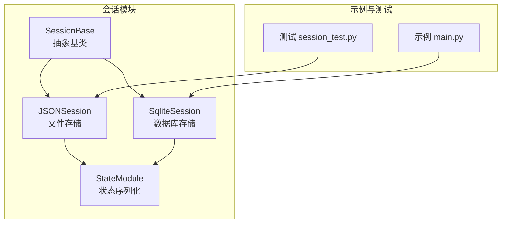
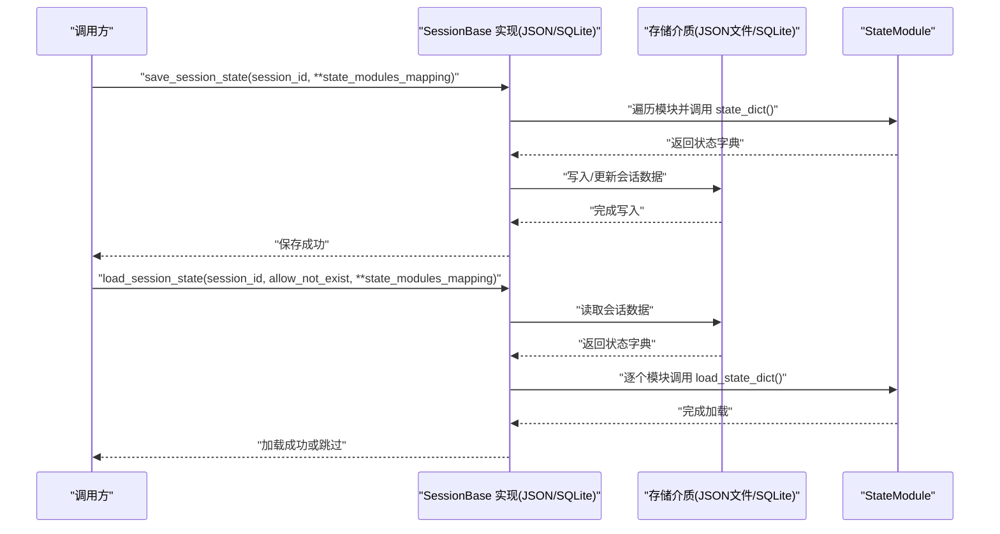
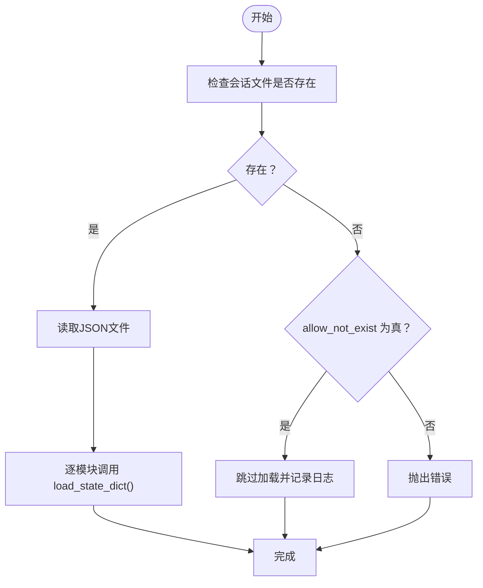
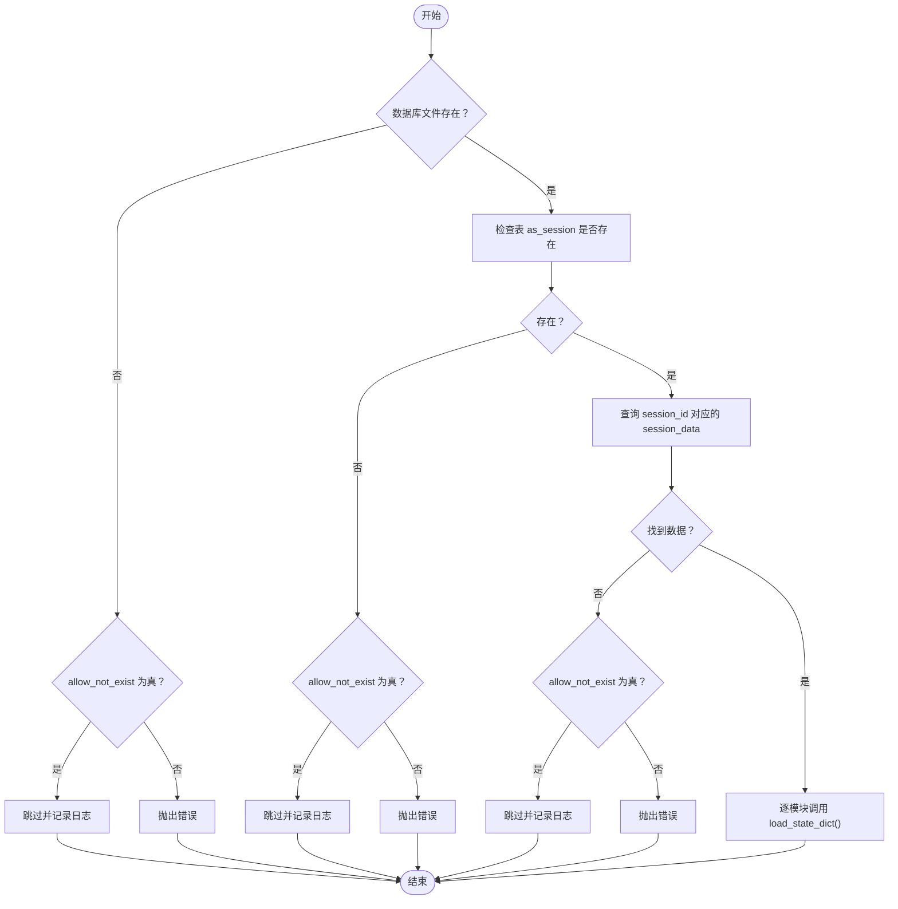
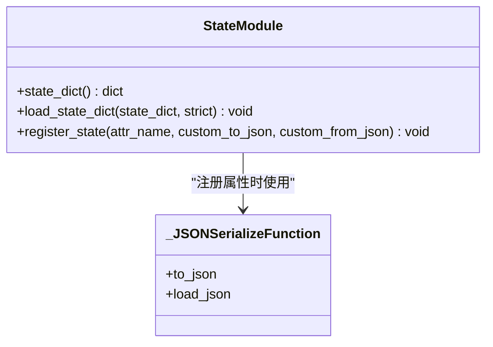
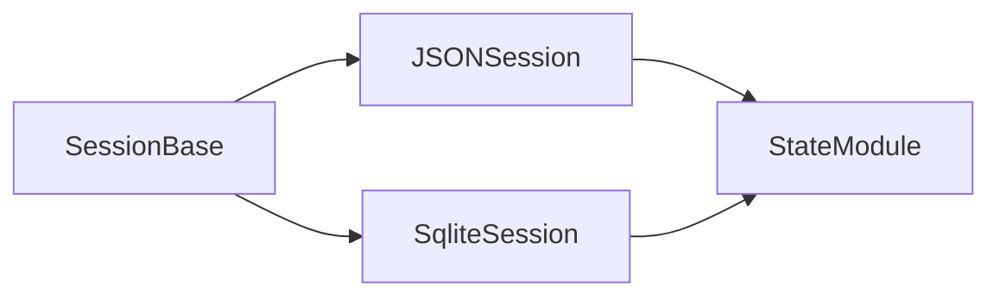

# 基础概念

<cite>
**本文引用的文件**
- [src/agentscope/session/_session_base.py](file://src/agentscope/session/_session_base.py)
- [src/agentscope/session/_json_session.py](file://src/agentscope/session/_json_session.py)
- [src/agentscope/session/_state_module.py](file://src/agentscope/module/_state_module.py)
- [src/agentscope/session/__init__.py](file://src/agentscope/session/__init__.py)
- [examples/functionality/session_with_sqlite/sqlite_session.py](file://examples/functionality/session_with_sqlite/sqlite_session.py)
- [examples/functionality/session_with_sqlite/main.py](file://examples/functionality/session_with_sqlite/main.py)
- [tests/session_test.py](file://tests/session_test.py)
</cite>

## 目录
1. [引言](#引言)
2. [项目结构](#项目结构)
3. [核心组件](#核心组件)
4. [架构总览](#架构总览)
5. [详细组件分析](#详细组件分析)
6. [依赖分析](#依赖分析)
7. [性能考虑](#性能考虑)
8. [故障排查指南](#故障排查指南)
9. [结论](#结论)
10. [附录](#附录)

## 引言
本章节围绕多智能体系统中的“会话（Session）”基础概念展开，重点解释会话在上下文保持、状态追踪与生命周期管理方面的核心作用。我们将从抽象基类 SessionBase 的设计理念与接口定义入手，结合 JSON 与 SQLite 两种持久化实现，说明会话如何初始化、保存运行时状态、跨智能体共享上下文，以及与消息、智能体、工作流之间的交互关系。同时给出常见使用模式、最佳实践（如会话隔离、异常恢复与资源释放），并讨论会话安全设计（会话固定防护与敏感数据处理）。

## 项目结构
会话管理位于 agentscope 的 session 子模块中，核心由抽象基类与两个具体实现组成：
- 抽象基类：SessionBase，定义统一的异步保存/加载接口
- 具体实现：
  - JSONSession：基于文件系统的轻量实现
  - SqliteSession：基于 SQLite 的数据库实现（示例）
- 状态序列化支持：StateModule 提供嵌套状态序列化/反序列化能力
- 示例与测试：演示如何在多智能体场景中使用会话进行状态持久化与恢复

图表来源
- [src/agentscope/session/_session_base.py](file://src/agentscope/session/_session_base.py#L1-L34)
- [src/agentscope/session/_json_session.py](file://src/agentscope/session/_json_session.py#L1-L118)
- [examples/functionality/session_with_sqlite/sqlite_session.py](file://examples/functionality/session_with_sqlite/sqlite_session.py#L1-L168)
- [src/agentscope/module/_state_module.py](file://src/agentscope/module/_state_module.py#L1-L152)
- [examples/functionality/session_with_sqlite/main.py](file://examples/functionality/session_with_sqlite/main.py#L1-L77)
- [tests/session_test.py](file://tests/session_test.py#L1-L88)

章节来源
- [src/agentscope/session/__init__.py](file://src/agentscope/session/__init__.py#L1-L10)

## 核心组件
- SessionBase：定义异步保存与加载会话状态的抽象接口，确保不同存储后端的一致性契约
- JSONSession：将状态以 JSON 文件形式保存到指定目录，支持按 session_id 区分不同会话
- SqliteSession：将状态以 JSON 字符串形式存入 SQLite 表，支持按 session_id 唯一标识
- StateModule：为任意对象提供可序列化的状态字典，支持嵌套模块与自定义 JSON 转换函数

章节来源
- [src/agentscope/session/_session_base.py](file://src/agentscope/session/_session_base.py#L1-L34)
- [src/agentscope/session/_json_session.py](file://src/agentscope/session/_json_session.py#L1-L118)
- [examples/functionality/session_with_sqlite/sqlite_session.py](file://examples/functionality/session_with_sqlite/sqlite_session.py#L1-L168)
- [src/agentscope/module/_state_module.py](file://src/agentscope/module/_state_module.py#L1-L152)

## 架构总览
会话管理采用“抽象基类 + 多实现”的架构，通过 StateModule 统一状态序列化格式，使 SessionBase 的 save/load 接口与具体存储介质解耦。典型调用链如下：

图表来源
- [src/agentscope/session/_session_base.py](file://src/agentscope/session/_session_base.py#L1-L34)
- [src/agentscope/session/_json_session.py](file://src/agentscope/session/_json_session.py#L53-L118)
- [examples/functionality/session_with_sqlite/sqlite_session.py](file://examples/functionality/session_with_sqlite/sqlite_session.py#L27-L168)
- [src/agentscope/module/_state_module.py](file://src/agentscope/module/_state_module.py#L49-L152)

## 详细组件分析

### SessionBase 抽象基类
- 设计理念
  - 通过抽象方法约束所有会话实现必须提供异步保存与加载能力
  - 将“状态字典”作为统一序列化载体，屏蔽底层存储差异
- 关键接口
  - save_session_state(session_id, **state_modules_mapping): 异步保存状态
  - load_session_state(session_id, allow_not_exist=True, **state_modules_mapping): 异步加载状态
- 生命周期管理
  - 会话 ID 由调用方传入，避免在构造函数中固化，便于动态切换
  - 支持“允许不存在”的加载策略，便于首次启动或冷启动场景

章节来源
- [src/agentscope/session/_session_base.py](file://src/agentscope/session/_session_base.py#L1-L34)

### JSONSession 实现
- 初始化与弃用参数
  - 构造函数保留了 session_id 参数，但记录弃用警告，提示未来版本将移除该参数
- 保存流程
  - 遍历 state_modules_mapping，调用每个模块的 state_dict() 获取状态字典
  - 写入 JSON 文件，文件名以 session_id 命名
- 加载流程
  - 若文件存在则读取并逐模块 load_state_dict()
  - allow_not_exist=True 时跳过不存在的会话；否则抛出错误
- 适用场景
  - 开发调试、小规模状态持久化、快速原型验证

图表来源
- [src/agentscope/session/_json_session.py](file://src/agentscope/session/_json_session.py#L53-L118)

章节来源
- [src/agentscope/session/_json_session.py](file://src/agentscope/session/_json_session.py#L1-L118)

### SqliteSession 实现（示例）
- 初始化
  - 接收 SQLite 数据库路径，用于后续持久化
- 保存流程
  - 创建表 as_session（若不存在），以 session_id 为主键
  - 将状态字典序列化为 JSON 并插入或更新
- 加载流程
  - 检查数据库与表是否存在，支持 allow_not_exist
  - 查询 session_id 对应的 session_data，逐模块 load_state_dict()
  - 若模块缺失则抛错，保证状态完整性
- 适用场景
  - 生产环境、需要事务一致性与并发控制的场景

图表来源
- [examples/functionality/session_with_sqlite/sqlite_session.py](file://examples/functionality/session_with_sqlite/sqlite_session.py#L27-L168)

章节来源
- [examples/functionality/session_with_sqlite/sqlite_session.py](file://examples/functionality/session_with_sqlite/sqlite_session.py#L1-L168)

### StateModule 状态模块
- 设计目标
  - 为任意对象提供统一的状态序列化/反序列化接口
  - 支持嵌套模块与属性注册，实现复杂对象的深度序列化
- 关键能力
  - state_dict(): 递归收集模块与已注册属性的状态
  - load_state_dict(state_dict, strict=True): 严格模式下校验缺失键，非严格模式跳过
  - register_state(attr_name, custom_to_json=None, custom_from_json=None): 注册可序列化属性，支持自定义 JSON 转换
- 使用建议
  - 在对象构造函数中先调用父类 __init__，再注册状态属性
  - 对不可原生 JSON 序列化的属性提供自定义转换函数

图表来源
- [src/agentscope/module/_state_module.py](file://src/agentscope/module/_state_module.py#L1-L152)

章节来源
- [src/agentscope/module/_state_module.py](file://src/agentscope/module/_state_module.py#L1-L152)

### 会话与消息、智能体、工作流的交互
- 与消息（Message）的关系
  - 会话通常承载对话历史、工具调用结果等上下文，这些上下文以状态模块的形式参与序列化
- 与智能体（Agent）的关系
  - 智能体内部的内存、工具包、格式化器等均可注册为状态模块，实现跨轮次的上下文延续
  - 示例中 ReActAgent 与自定义 Agent 均可作为状态模块参与保存/加载
- 与工作流（Workflow/Pipeline）的关系
  - 工作流可按需在关键节点触发 save_session_state，或在新阶段前触发 load_session_state
  - 通过 session_id 实现用户级或任务级隔离

章节来源
- [tests/session_test.py](file://tests/session_test.py#L43-L88)
- [examples/functionality/session_with_sqlite/main.py](file://examples/functionality/session_with_sqlite/main.py#L16-L77)

## 依赖分析
- 组件耦合
  - SessionBase 与具体实现之间为“接口与实现”关系，耦合度低
  - StateModule 与 Session 实现之间为“数据契约”关系，通过 state_dict/load_state_dict 解耦
- 外部依赖
  - JSONSession 依赖文件系统
  - SqliteSession 依赖 sqlite3 与 JSON 序列化
- 可能的循环依赖
  - 当前结构无循环依赖，各模块职责清晰

图表来源
- [src/agentscope/session/_session_base.py](file://src/agentscope/session/_session_base.py#L1-L34)
- [src/agentscope/session/_json_session.py](file://src/agentscope/session/_json_session.py#L1-L118)
- [examples/functionality/session_with_sqlite/sqlite_session.py](file://examples/functionality/session_with_sqlite/sqlite_session.py#L1-L168)
- [src/agentscope/module/_state_module.py](file://src/agentscope/module/_state_module.py#L1-L152)

章节来源
- [src/agentscope/session/__init__.py](file://src/agentscope/session/__init__.py#L1-L10)

## 性能考虑
- 文件系统 I/O
  - JSONSession 适合小规模状态；大规模或多并发场景建议使用数据库实现
- 数据库事务
  - SqliteSession 使用单连接事务，适合顺序写入；并发写入时建议引入锁或队列
- 序列化开销
  - 大对象频繁序列化/反序列化会产生额外 CPU 开销，建议仅保存必要状态
- 索引与查询
  - SQLite 表以 session_id 为主键，查询效率高；可根据业务扩展索引策略

## 故障排查指南
- 会话文件不存在
  - JSONSession：allow_not_exist=True 时会跳过加载；False 则抛错
  - SqliteSession：同理，支持灵活的容错策略
- 模块缺失
  - 加载时若某模块未在会话数据中出现，会抛错；请确认保存时是否包含该模块
- 自定义序列化失败
  - register_state 会对不可 JSON 序列化的属性进行检查；提供自定义转换函数
- 资源释放
  - 示例中使用 with 语句管理数据库连接，确保异常时也能正确关闭游标

章节来源
- [src/agentscope/session/_json_session.py](file://src/agentscope/session/_json_session.py#L77-L118)
- [examples/functionality/session_with_sqlite/sqlite_session.py](file://examples/functionality/session_with_sqlite/sqlite_session.py#L69-L168)
- [src/agentscope/module/_state_module.py](file://src/agentscope/module/_state_module.py#L108-L152)

## 结论
会话管理在多智能体系统中承担着上下文保持、状态追踪与生命周期管理的关键角色。通过 SessionBase 抽象基类与 StateModule 统一状态契约，JSONSession 与 SqliteSession 提供了灵活的持久化方案。结合消息、智能体与工作流，会话实现了跨轮次的连续体验与可恢复性。实践中应关注会话隔离、异常恢复与资源释放，并在安全性方面采取必要的防护措施（见附录）。

## 附录

### 常见使用模式与最佳实践
- 会话隔离
  - 使用唯一 session_id（如用户名、任务ID）区分不同用户的上下文
  - 在工作流的关键节点分别触发 load/save，确保状态边界清晰
- 异常恢复
  - 使用 allow_not_exist 控制首次启动行为
  - 对关键状态模块进行严格加载（strict=True），及时发现缺失
- 资源释放
  - 数据库操作使用上下文管理器，确保连接与游标正确关闭
- 状态最小化
  - 仅保存必要的状态模块，减少序列化与 I/O 成本

章节来源
- [examples/functionality/session_with_sqlite/main.py](file://examples/functionality/session_with_sqlite/main.py#L16-L77)
- [tests/session_test.py](file://tests/session_test.py#L43-L88)

### 安全性设计
- 会话固定防护
  - 不要在客户端或请求参数中直接暴露 session_id；服务端生成并绑定到用户会话上下文
  - 对 session_id 进行长度与字符集限制，避免注入风险
- 敏感数据处理
  - 对包含敏感字段的状态模块，使用 register_state 的自定义转换函数进行脱敏或加密
  - 在 JSON/数据库中避免存储明文密钥或令牌；必要时使用安全存储或密钥管理服务
- 访问控制
  - 为会话数据设置访问权限，防止越权读取
  - 对数据库实现，启用只读账户或最小权限原则

章节来源
- [src/agentscope/module/_state_module.py](file://src/agentscope/module/_state_module.py#L108-L152)
- [examples/functionality/session_with_sqlite/sqlite_session.py](file://examples/functionality/session_with_sqlite/sqlite_session.py#L27-L68)