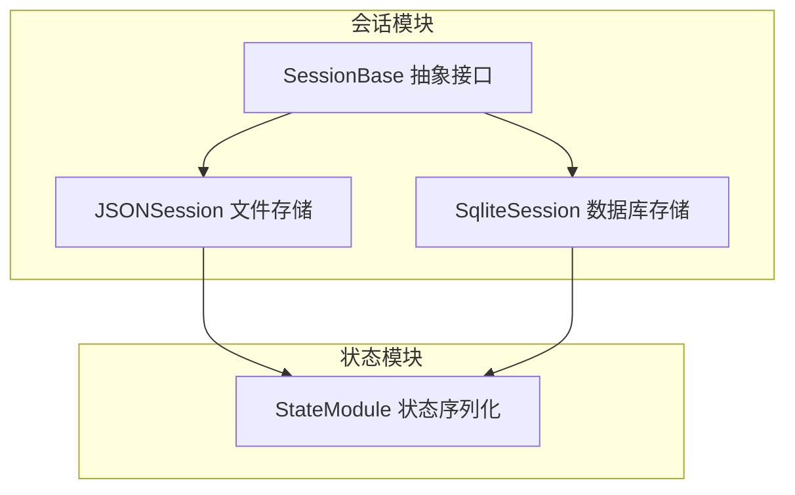
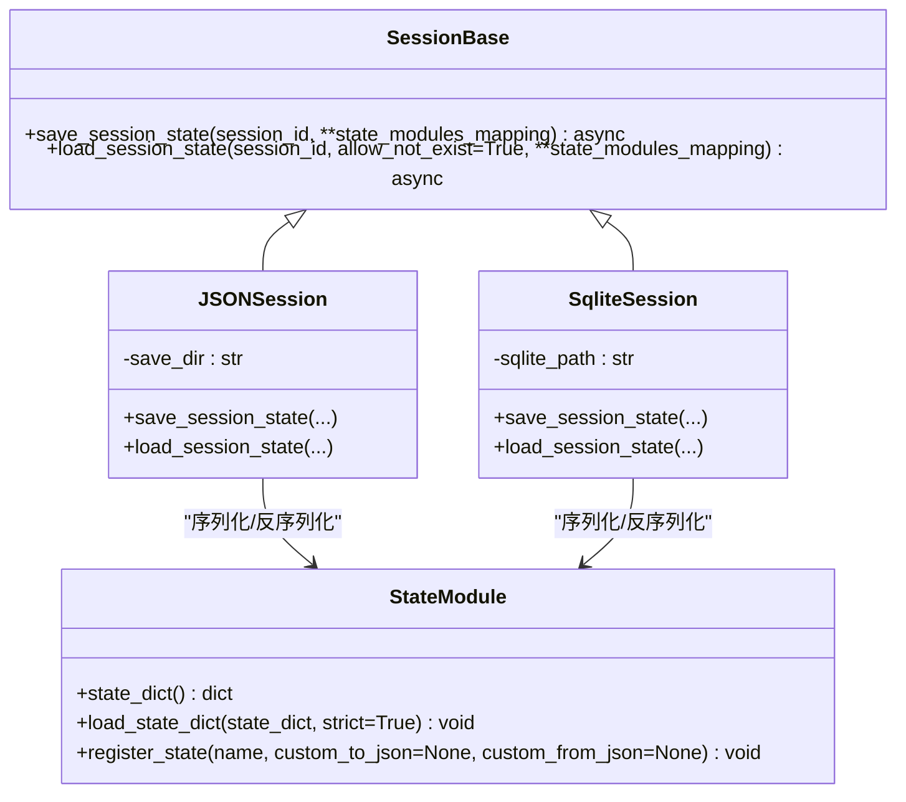
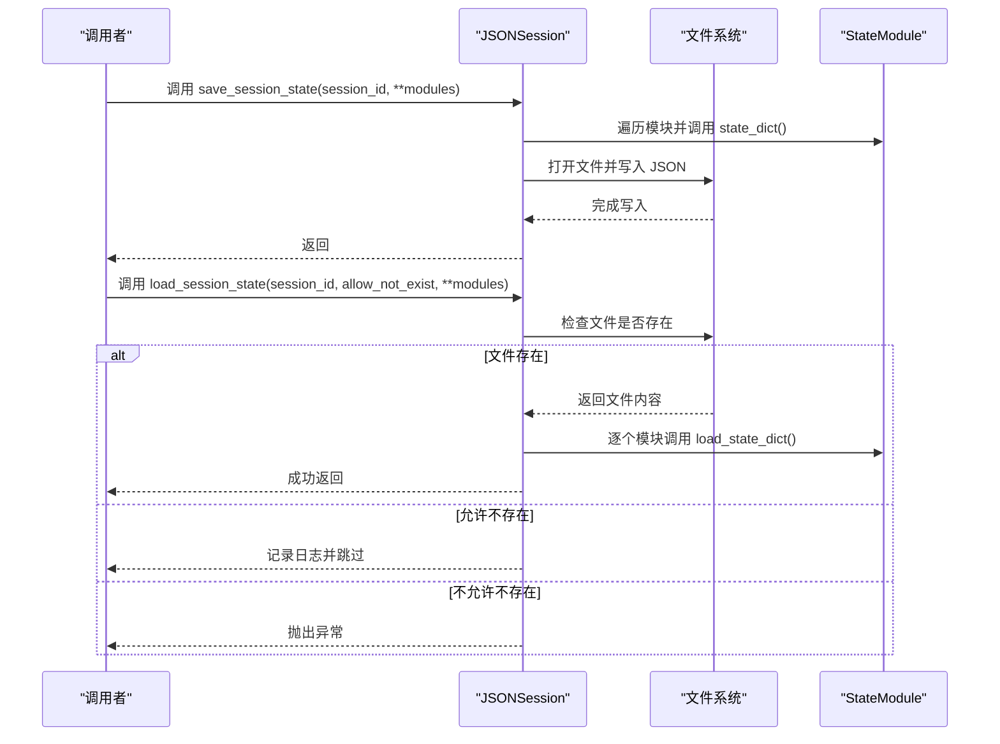
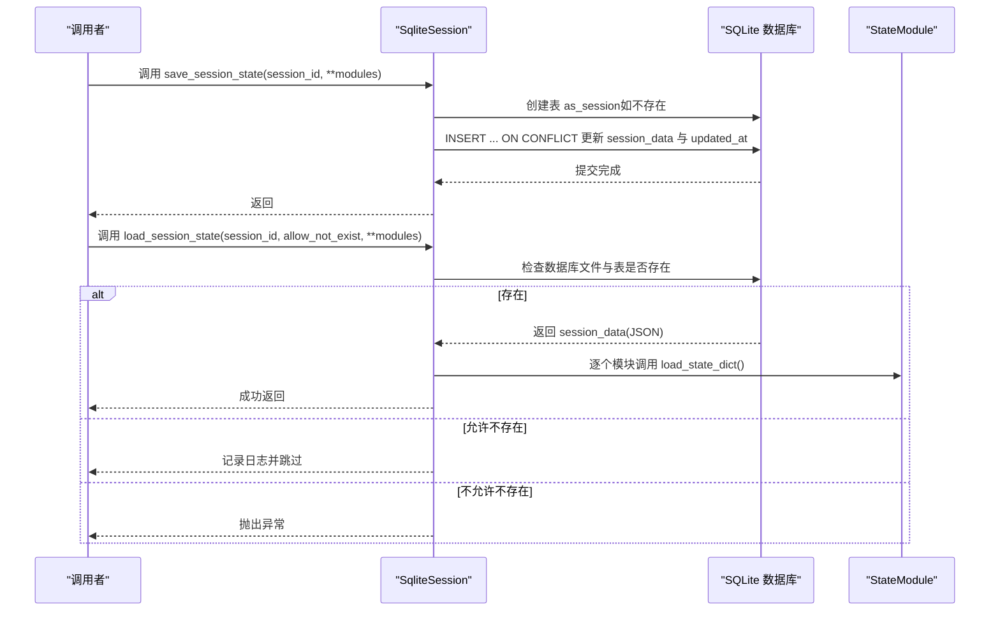
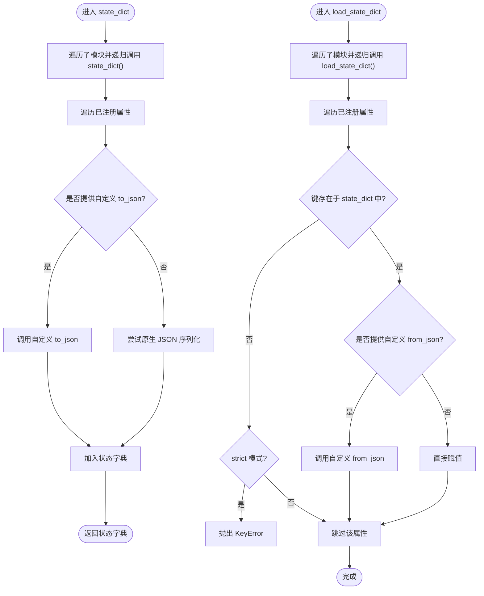
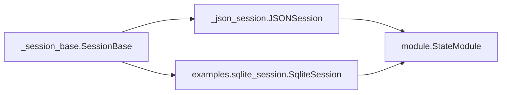

# 存储实现

<cite>
**本文引用的文件**
- [src/agentscope/session/_session_base.py](file://src/agentscope/session/_session_base.py)
- [src/agentscope/session/_json_session.py](file://src/agentscope/session/_json_session.py)
- [src/agentscope/session/__init__.py](file://src/agentscope/session/__init__.py)
- [src/agentscope/module/_state_module.py](file://src/agentscope/module/_state_module.py)
- [examples/functionality/session_with_sqlite/sqlite_session.py](file://examples/functionality/session_with_sqlite/sqlite_session.py)
- [examples/functionality/session_with_sqlite/main.py](file://examples/functionality/session_with_sqlite/main.py)
- [tests/session_test.py](file://tests/session_test.py)
</cite>

## 目录
1. [简介](#简介)
2. [项目结构](#项目结构)
3. [核心组件](#核心组件)
4. [架构总览](#架构总览)
5. [详细组件分析](#详细组件分析)
6. [依赖分析](#依赖分析)
7. [性能考虑](#性能考虑)
8. [故障排查指南](#故障排查指南)
9. [结论](#结论)
10. [附录：配置与迁移指南](#附录配置与迁移指南)

## 简介
本文件围绕会话管理的存储实现进行系统性梳理，重点覆盖：
- JSON 文件存储后端的实现机制：数据序列化格式、文件读写策略、错误处理与容错。
- 自定义会话类集成 SQLite 的实践：从内存存储到关系型数据库的迁移路径。
- 通过实际示例演示会话数据的持久化保存与恢复流程，包含事务管理、并发写入控制与数据一致性保障。
- 对比内存、文件、数据库三类存储方案的性能特征与适用场景。
- 提供配置指南，说明如何注册与切换不同的会话存储后端。

## 项目结构
会话管理位于会话模块中，采用抽象基类定义统一接口，具体存储后端以插件式实现。状态序列化由通用的状态模块负责，确保不同后端的一致性。

图表来源
- [src/agentscope/session/_session_base.py](file://src/agentscope/session/_session_base.py#L1-L34)
- [src/agentscope/session/_json_session.py](file://src/agentscope/session/_json_session.py#L1-L118)
- [examples/functionality/session_with_sqlite/sqlite_session.py](file://examples/functionality/session_with_sqlite/sqlite_session.py#L1-L168)
- [src/agentscope/module/_state_module.py](file://src/agentscope/module/_state_module.py#L1-L152)

章节来源
- [src/agentscope/session/__init__.py](file://src/agentscope/session/__init__.py#L1-L11)

## 核心组件
- SessionBase：定义异步保存与加载会话状态的抽象接口，参数为 session_id 与若干 StateModule 实例映射。
- JSONSession：基于 JSON 文件的会话存储，提供目录级保存与读取，支持“允许不存在”的加载策略。
- SqliteSession：基于 SQLite 的会话存储，使用 JSON 字段持久化状态字典，并通过主键冲突更新实现幂等写入。
- StateModule：统一的状态序列化/反序列化框架，支持嵌套模块与属性注册，保证跨后端一致的数据结构。

章节来源
- [src/agentscope/session/_session_base.py](file://src/agentscope/session/_session_base.py#L1-L34)
- [src/agentscope/session/_json_session.py](file://src/agentscope/session/_json_session.py#L1-L118)
- [examples/functionality/session_with_sqlite/sqlite_session.py](file://examples/functionality/session_with_sqlite/sqlite_session.py#L1-L168)
- [src/agentscope/module/_state_module.py](file://src/agentscope/module/_state_module.py#L1-L152)

## 架构总览
下图展示了会话接口、状态模块与存储后端之间的交互关系。

图表来源
- [src/agentscope/session/_session_base.py](file://src/agentscope/session/_session_base.py#L1-L34)
- [src/agentscope/session/_json_session.py](file://src/agentscope/session/_json_session.py#L1-L118)
- [examples/functionality/session_with_sqlite/sqlite_session.py](file://examples/functionality/session_with_sqlite/sqlite_session.py#L1-L168)
- [src/agentscope/module/_state_module.py](file://src/agentscope/module/_state_module.py#L1-L152)

## 详细组件分析

### JSON 文件存储后端（JSONSession）
- 数据序列化格式
  - 通过遍历传入的 StateModule 映射，调用每个模块的 state_dict() 获取字典，再整体以 JSON 序列化写入文件。
  - 读取时先判断文件是否存在，存在则 JSON 反序列化为字典，再逐个模块调用 load_state_dict() 恢复状态。
- 文件读写策略
  - 写入：在构造函数中可指定保存目录；保存时自动创建目录，文件名以 session_id 命名并带 .json 后缀。
  - 读取：支持 allow_not_exist 参数；当文件不存在且允许不存在时跳过加载并记录日志；否则抛出异常。
- 错误处理
  - 文件不存在：根据 allow_not_exist 控制行为。
  - JSON 解析失败：由标准库 JSON 解析器抛出异常，调用方需捕获处理。
  - 日志记录：成功加载或跳过加载时输出相应信息，便于调试。

图表来源
- [src/agentscope/session/_json_session.py](file://src/agentscope/session/_json_session.py#L53-L118)
- [src/agentscope/module/_state_module.py](file://src/agentscope/module/_state_module.py#L48-L107)

章节来源
- [src/agentscope/session/_json_session.py](file://src/agentscope/session/_json_session.py#L1-L118)
- [src/agentscope/module/_state_module.py](file://src/agentscope/module/_state_module.py#L1-L152)
- [tests/session_test.py](file://tests/session_test.py#L44-L88)

### SQLite 关系型数据库存储后端（SqliteSession）
- 数据序列化格式
  - 与 JSONSession 类似，先收集各模块的状态字典，再以 JSON 字符串形式存入数据库字段。
- 表结构与事务管理
  - 使用表 as_session，主键为 session_id，字段包含 session_id、session_data(JSON)、created_at、updated_at。
  - 写入采用 INSERT ... ON CONFLICT 主键冲突更新，确保幂等写入；使用上下文连接，自动提交。
- 并发写入控制与一致性
  - SQLite 连接默认使用行级锁；在高并发场景建议配合外层应用层的互斥控制或使用 WAL 模式提升并发能力。
  - 读取前检查数据库文件与表是否存在，遵循 allow_not_exist 策略。
- 错误处理
  - 数据库文件不存在或表不存在时，依据 allow_not_exist 决定跳过或抛错。
  - 查询不到对应 session_id 时，同样依据策略处理。
  - JSON 反序列化失败时抛出异常，调用方需捕获处理。

图表来源
- [examples/functionality/session_with_sqlite/sqlite_session.py](file://examples/functionality/session_with_sqlite/sqlite_session.py#L27-L168)
- [src/agentscope/module/_state_module.py](file://src/agentscope/module/_state_module.py#L48-L107)

章节来源
- [examples/functionality/session_with_sqlite/sqlite_session.py](file://examples/functionality/session_with_sqlite/sqlite_session.py#L1-L168)
- [examples/functionality/session_with_sqlite/main.py](file://examples/functionality/session_with_sqlite/main.py#L1-L77)

### 状态模块（StateModule）与序列化机制
- 状态采集
  - state_dict() 递归遍历已注册的子模块与属性，按需调用自定义 to_json 或原生 JSON 可序列化转换。
- 状态恢复
  - load_state_dict() 支持严格模式，缺失键时可选择抛错或跳过；对属性可执行自定义 from_json 转换。
- 注册机制
  - register_state() 支持自定义 JSON 转换函数，若未提供则要求原生可 JSON 序列化，否则抛出类型错误。

图表来源
- [src/agentscope/module/_state_module.py](file://src/agentscope/module/_state_module.py#L48-L152)

章节来源
- [src/agentscope/module/_state_module.py](file://src/agentscope/module/_state_module.py#L1-L152)

## 依赖分析
- 组件耦合
  - SessionBase 与具体后端通过继承解耦，后端仅依赖 StateModule 的序列化接口。
  - JSONSession 与 SqliteSession 分别依赖文件系统与 SQLite 引擎，彼此独立。
- 外部依赖
  - JSONSession 依赖标准库 json 与 os。
  - SqliteSession 依赖 sqlite3 与 json。
- 接口契约
  - 保存/加载方法均以 session_id 作为键，支持多模块映射，便于一次持久化多个对象状态。

图表来源
- [src/agentscope/session/_session_base.py](file://src/agentscope/session/_session_base.py#L1-L34)
- [src/agentscope/session/_json_session.py](file://src/agentscope/session/_json_session.py#L1-L118)
- [examples/functionality/session_with_sqlite/sqlite_session.py](file://examples/functionality/session_with_sqlite/sqlite_session.py#L1-L168)
- [src/agentscope/module/_state_module.py](file://src/agentscope/module/_state_module.py#L1-L152)

章节来源
- [src/agentscope/session/__init__.py](file://src/agentscope/session/__init__.py#L1-L11)

## 性能考虑
- 内存存储
  - 适用于临时会话或单进程内快速迭代，无磁盘 IO 开销，但不具备持久化能力。
- 文件存储（JSON）
  - 优点：实现简单、易备份、可跨进程共享；适合中小规模会话数据。
  - 缺点：顺序写入、大文件读写成本较高；并发写入可能产生竞争；不支持复杂查询与事务。
- 数据库存储（SQLite）
  - 优点：支持 ACID 事务、并发控制更灵活、可扩展性强；适合需要可靠性和可维护性的生产场景。
  - 缺点：引入数据库引擎开销；需要关注锁与 WAL 模式配置；对大规模并发仍需分库分表策略。

[本节为通用性能讨论，不直接分析具体文件，故无章节来源]

## 故障排查指南
- JSON 文件存储常见问题
  - 文件不存在：确认 allow_not_exist 设置；检查保存目录权限与路径。
  - JSON 解析失败：检查模块注册的属性是否可 JSON 序列化；必要时使用 register_state 的自定义转换函数。
  - 权限不足：确保运行用户对保存目录有读写权限。
- SQLite 存储常见问题
  - 数据库文件不存在：确认 sqlite_path 是否正确；首次运行可自动创建表。
  - 表不存在：首次写入会自动建表；若被删除需重新初始化。
  - 并发冲突：在高并发场景建议使用 WAL 模式或外层互斥；避免同时写入同一 session_id。
  - JSON 反序列化失败：检查 session_data 是否被篡改或损坏。

章节来源
- [src/agentscope/session/_json_session.py](file://src/agentscope/session/_json_session.py#L53-L118)
- [examples/functionality/session_with_sqlite/sqlite_session.py](file://examples/functionality/session_with_sqlite/sqlite_session.py#L69-L168)
- [src/agentscope/module/_state_module.py](file://src/agentscope/module/_state_module.py#L108-L152)

## 结论
- 会话存储通过抽象接口与状态模块解耦，既保证了统一的序列化语义，又允许灵活替换后端。
- JSON 文件存储适合快速原型与小规模数据；SQLite 更适合需要可靠性与可扩展性的场景。
- 通过示例可验证从内存状态到持久化的完整链路，建议在生产环境结合事务、并发控制与监控策略。

[本节为总结性内容，不直接分析具体文件，故无章节来源]

## 附录：配置与迁移指南

### 如何注册与切换会话存储后端
- 当前公开导出
  - 会话模块导出了 SessionBase 与 JSONSession，便于直接使用或扩展。
- 切换步骤
  - 在应用初始化阶段创建所需后端实例（例如 JSONSession 或 SqliteSession）。
  - 将 session_id 与若干 StateModule 实例映射传递给 save_session_state/load_session_state。
  - 若需扩展新后端，只需继承 SessionBase 并实现两个抽象方法，复用 StateModule 的序列化能力。

章节来源
- [src/agentscope/session/__init__.py](file://src/agentscope/session/__init__.py#L1-L11)
- [src/agentscope/session/_session_base.py](file://src/agentscope/session/_session_base.py#L1-L34)

### 从内存存储迁移到持久化存储
- 迁移路径
  - 保持现有 Agent/模块的 StateModule 注册不变，仅替换会话后端。
  - JSON 迁移：直接更换为 JSONSession，设置保存目录即可。
  - SQLite 迁移：更换为 SqliteSession，提供数据库文件路径；首次运行会自动建表。
- 注意事项
  - 确保所有状态属性均可 JSON 序列化，必要时通过 register_state 注册自定义转换。
  - 生产环境建议启用 WAL 模式与合理的并发控制策略。

章节来源
- [src/agentscope/session/_json_session.py](file://src/agentscope/session/_json_session.py#L1-L118)
- [examples/functionality/session_with_sqlite/sqlite_session.py](file://examples/functionality/session_with_sqlite/sqlite_session.py#L1-L168)
- [src/agentscope/module/_state_module.py](file://src/agentscope/module/_state_module.py#L108-L152)

### 示例参考
- JSON 文件示例
  - 测试用例展示了如何保存多个模块的状态到 JSON 文件。
- SQLite 示例
  - 示例程序演示了创建代理、加载会话、对话生成状态、保存会话的完整流程。

章节来源
- [tests/session_test.py](file://tests/session_test.py#L44-L88)
- [examples/functionality/session_with_sqlite/main.py](file://examples/functionality/session_with_sqlite/main.py#L1-L77)