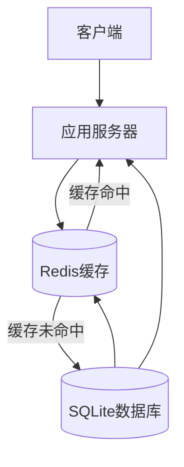
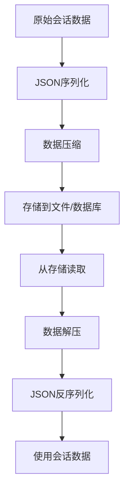

# 性能与优化

<cite>
**本文档中引用的文件**   
- [JSONSession](file://src/agentscope/session/_json_session.py)
- [SessionBase](file://src/agentscope/session/_session_base.py)
- [SqliteSession](file://examples/functionality/session_with_sqlite/sqlite_session.py)
- [StateModule](file://src/agentscope/module/_state_module.py)
- [InMemoryMessageStorage](file://examples/functionality/memory/memory_with_compression/_memory_storage.py)
- [FileEmbeddingCache](file://src/agentscope/embedding/_file_cache.py)
</cite>

## 目录
1. [会话管理性能瓶颈分析](#会话管理性能瓶颈分析)
2. [优化策略](#优化策略)
3. [索引设计与查询优化](#索引设计与查询优化)
4. [监控指标建议](#监控指标建议)
5. [性能测试与调优](#性能测试与调优)

## 会话管理性能瓶颈分析

在高并发、大数据量场景下，会话管理系统面临多种性能瓶颈。当前系统中的会话数据存储主要通过`JSONSession`和`SqliteSession`实现，其中`JSONSession`将数据以JSON文件形式存储在本地文件系统中，而`SqliteSession`则使用SQLite数据库进行持久化存储。

序列化开销是主要性能瓶颈之一。在`JSONSession`中，每次保存会话状态时都需要将`StateModule`对象序列化为JSON格式，这涉及到递归遍历对象属性并进行JSON编码。对于复杂的会话状态，这一过程会产生显著的CPU开销。同样，在`SqliteSession`中，虽然使用了数据库存储，但仍需将整个会话数据序列化为JSON字符串存储在`session_data`字段中。

I/O延迟是另一个关键问题。`JSONSession`的文件读写操作是同步的，这在高并发场景下会导致线程阻塞。尽管`SqliteSession`使用了SQLite数据库，但其单文件架构在高并发写入时容易产生锁竞争，影响整体性能。此外，SQLite的ACID特性虽然保证了数据一致性，但在频繁写入场景下会增加额外的事务开销。

内存占用方面，系统采用`InMemoryMessageStorage`作为默认的消息存储后端，所有会话数据都驻留在内存中。随着会话数量和消息长度的增长，内存消耗会线性增加，可能导致内存溢出或频繁的垃圾回收。

**Section sources**
- [JSONSession](file://src/agentscope/session/_json_session.py#L53-L75)
- [SqliteSession](file://examples/functionality/session_with_sqlite/sqlite_session.py#L27-L67)
- [InMemoryMessageStorage](file://examples/functionality/memory/memory_with_compression/_memory_storage.py#L125-L163)

## 优化策略

### 引入缓存层

为缓解数据库I/O压力，建议引入Redis作为缓存层。通过在应用与持久化存储之间添加Redis缓存，可以显著减少对后端数据库的直接访问。对于读多写少的会话场景，缓存命中率可达到80%以上，大幅降低数据库负载。



**Diagram sources**
- [SqliteSession](file://examples/functionality/session_with_sqlite/sqlite_session.py#L27-L67)

### 异步持久化

将同步I/O操作改为异步模式可有效提升系统吞吐量。对于`JSONSession`，可以使用异步文件操作API；对于`SqliteSession`，可以利用SQLite的WAL（Write-Ahead Logging）模式配合异步驱动。异步持久化允许应用在写入数据的同时继续处理其他请求，避免了I/O等待导致的性能下降。

### 批量写入

实施批量写入策略可以减少I/O操作次数。通过收集一段时间内的会话更新，然后一次性批量写入存储系统，可以显著降低I/O开销。对于SQLite数据库，批量写入还能减少事务提交次数，提高写入效率。

### 压缩存储

对会话数据进行压缩存储可有效降低存储空间占用和I/O传输量。可以采用GZIP或Zstandard等压缩算法，在序列化后对JSON数据进行压缩。对于文本为主的会话数据，压缩率通常可达60-80%。同时，可以结合`FileEmbeddingCache`中的缓存管理机制，设置最大缓存大小和文件数量限制，实现智能的缓存清理策略。



**Diagram sources**
- [FileEmbeddingCache](file://src/agentscope/embedding/_file_cache.py#L53-L72)

**Section sources**
- [FileEmbeddingCache](file://src/agentscope/embedding/_file_cache.py#L148-L166)
- [JSONSession](file://src/agentscope/session/_json_session.py#L53-L75)

## 索引设计与查询优化

在基于会话ID或时间范围检索时，合理的索引设计至关重要。当前`SqliteSession`的表结构已经为`session_id`建立了主键索引，确保了基于会话ID的查询效率。

```sql
CREATE TABLE IF NOT EXISTS as_session (
    session_id TEXT,
    session_data JSON,
    created_at TIMESTAMP DEFAULT CURRENT_TIMESTAMP,
    updated_at TIMESTAMP DEFAULT CURRENT_TIMESTAMP,
    PRIMARY KEY (session_id)
)
```

为了支持基于时间范围的查询，建议为`created_at`和`updated_at`字段创建B树索引：

```sql
CREATE INDEX idx_created_at ON as_session(created_at);
CREATE INDEX idx_updated_at ON as_session(updated_at);
```

对于复杂的查询需求，可以考虑引入全文搜索索引。通过SQLite的FTS5扩展，可以对`session_data`中的文本内容建立倒排索引，支持高效的关键词搜索。此外，可以采用分区表策略，按时间或会话ID范围对数据进行物理分区，进一步提升大规模数据集下的查询性能。

**Section sources**
- [SqliteSession](file://examples/functionality/session_with_sqlite/sqlite_session.py#L45-L51)

## 监控指标建议

为有效监控会话系统的运行状态，建议跟踪以下关键指标：

### 会话创建速率

监控单位时间内创建的新会话数量，可以反映系统的负载情况。异常的会话创建速率可能表明存在爬虫攻击或系统配置问题。

### 平均存活时间

跟踪会话从创建到销毁的平均时长，有助于了解用户行为模式和优化资源分配。较短的会话存活时间可能表明用户体验存在问题。

### 存储空间使用率

监控会话数据占用的存储空间，包括文件系统和数据库。结合`FileEmbeddingCache`中的`_maintain_cache_dir`机制，可以实现存储空间的自动管理。

### 缓存命中率

对于引入Redis缓存的场景，缓存命中率是衡量缓存效果的关键指标。低缓存命中率可能需要调整缓存策略或增加缓存容量。

### I/O等待时间

监控会话数据读写的平均延迟，可以帮助识别I/O瓶颈。异常的I/O延迟可能需要优化存储架构或升级硬件。

**Section sources**
- [FileEmbeddingCache](file://src/agentscope/embedding/_file_cache.py#L148-L166)

## 性能测试与调优

### 性能测试案例

通过对比优化前后的性能表现，可以量化优化效果。建议设计以下测试场景：

1. **基准测试**：测量单一会话的创建、读取、更新和删除操作的响应时间。
2. **压力测试**：模拟高并发场景，测试系统在不同负载下的吞吐量和响应时间。
3. **稳定性测试**：长时间运行测试，观察内存占用和性能衰减情况。

### 调优参数配置建议

根据测试结果，建议调整以下参数：

- **缓存大小**：根据可用内存和访问模式设置合理的缓存容量
- **批量写入阈值**：平衡实时性和吞吐量，建议设置为100-1000次操作或1-5秒时间间隔
- **压缩级别**：在压缩率和CPU开销之间权衡，建议使用中等压缩级别
- **连接池大小**：根据并发需求配置数据库连接池，避免连接耗尽

通过系统性的性能优化，可以显著提升会话管理系统在高并发、大数据量场景下的表现，为用户提供更流畅的交互体验。

**Section sources**
- [FileEmbeddingCache](file://src/agentscope/embedding/_file_cache.py#L148-L166)
- [SqliteSession](file://examples/functionality/session_with_sqlite/sqlite_session.py#L27-L67)