# 工作流编排

<cite>
**本文档中引用的文件**  
- [__init__.py](file://src/agentscope/pipeline/__init__.py)
- [_class.py](file://src/agentscope/pipeline/_class.py)
- [_functional.py](file://src/agentscope/pipeline/_functional.py)
- [_msghub.py](file://src/agentscope/pipeline/_msghub.py)
- [main.py](file://examples/workflows/multiagent_concurrent/main.py)
- [main.py](file://examples/workflows/multiagent_conversation/main.py)
- [main.py](file://examples/workflows/multiagent_debate/main.py)
- [_agent_base.py](file://src/agentscope/agent/_agent_base.py)
- [_message_base.py](file://src/agentscope/message/_message_base.py)
- [pipeline_test.py](file://tests/pipeline_test.py)
</cite>

## 目录
1. [简介](#简介)
2. [核心工作流模式](#核心工作流模式)
3. [管道类设计原理](#管道类设计原理)
4. [消息枢纽通信机制](#消息枢纽通信机制)
5. [复杂工作流构建模式](#复杂工作流构建模式)
6. [多智能体协作场景](#多智能体协作场景)
7. [可视化与监控](#可视化与监控)
8. [性能优化建议](#性能优化建议)
9. [错误处理与调试](#错误处理与调试)
10. [最佳实践](#最佳实践)

## 简介
本文档全面介绍AgentScope框架中的工作流编排能力，重点阐述多智能体系统中的顺序执行、并发执行和辩论模式。文档详细解释了管道（Pipeline）类的设计原理和使用方法，以及消息枢纽（MsgHub）在智能体间通信中的核心作用。通过实际示例展示任务分解、结果聚合和决策共识等多智能体协作场景的实现。同时讨论工作流的可视化、监控和调试技术，并提供并行度控制和资源管理等性能优化建议。

## 核心工作流模式

AgentScope框架提供了多种核心工作流模式，支持复杂的多智能体协作场景。这些模式通过管道（Pipeline）和消息枢纽（MsgHub）机制实现，为开发者提供了灵活的工作流编排能力。

### 顺序执行模式
顺序执行模式是多智能体工作流中最基础的执行方式，其中一个智能体的输出作为下一个智能体的输入，形成链式处理流程。这种模式适用于需要逐步处理和转换数据的场景。

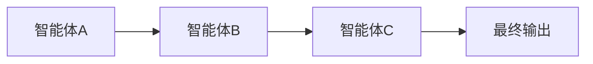

**图示来源**  
- [_functional.py](file://src/agentscope/pipeline/_functional.py#L10-L44)

### 并发执行模式
并发执行模式允许将相同输入分发给多个智能体并行处理，然后收集所有智能体的响应。这种模式通过`fanout_pipeline`函数实现，支持使用`asyncio.gather()`进行真正的并发执行或顺序执行。

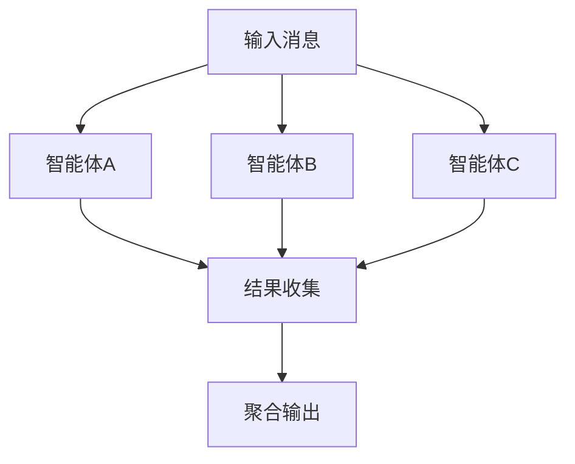

**图示来源**  
- [_functional.py](file://src/agentscope/pipeline/_functional.py#L47-L104)

### 辩论模式
辩论模式是一种高级的多智能体协作模式，其中多个智能体就特定主题进行讨论和辩论，通过一个协调者智能体来评估和决策。这种模式特别适用于需要多方观点碰撞和共识达成的复杂决策场景。

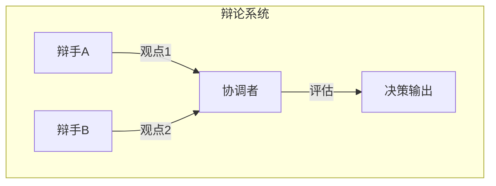

**图示来源**  
- [main.py](file://examples/workflows/multiagent_debate/main.py#L20-L25)

**本节来源**  
- [_functional.py](file://src/agentscope/pipeline/_functional.py#L10-L104)
- [main.py](file://examples/workflows/multiagent_debate/main.py#L20-L25)

## 管道类设计原理

管道类是AgentScope工作流编排的核心组件，提供了可重用的工作流执行器。与函数式管道相比，管道类可以被多次调用，提供了更好的代码复用性和状态管理能力。

### 顺序管道类
`SequentialPipeline`类实现了顺序执行模式，将一组智能体按顺序执行。每个智能体的输出作为下一个智能体的输入，最终返回最后一个智能体的输出。

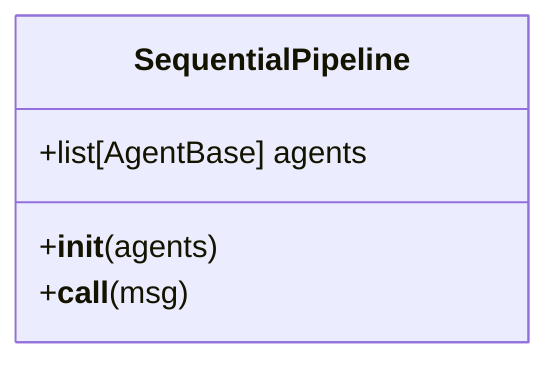

**图示来源**  
- [_class.py](file://src/agentscope/pipeline/_class.py#L10-L41)

### 分发管道类
`FanoutPipeline`类实现了并发执行模式，将相同输入分发给多个智能体处理。通过`enable_gather`参数控制是否使用`asyncio.gather()`进行并发执行。

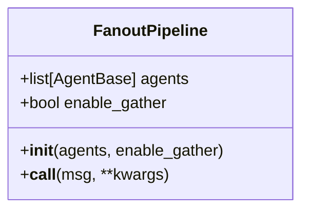

**图示来源**  
- [_class.py](file://src/agentscope/pipeline/_class.py#L43-L90)

### 函数式管道
除了类式管道，框架还提供了函数式管道实现，包括`sequential_pipeline`和`fanout_pipeline`函数。这些函数提供了更简洁的语法糖，适用于一次性工作流。

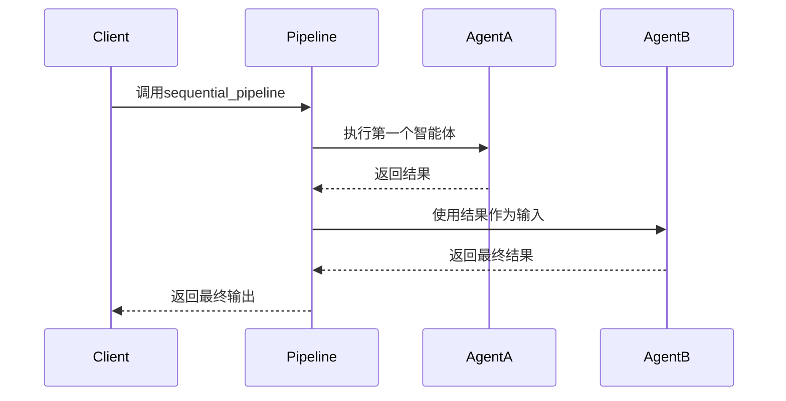

**图示来源**  
- [_functional.py](file://src/agentscope/pipeline/_functional.py#L10-L44)

**本节来源**  
- [_class.py](file://src/agentscope/pipeline/_class.py#L10-L90)
- [_functional.py](file://src/agentscope/pipeline/_functional.py#L10-L104)

## 消息枢纽通信机制

消息枢纽（MsgHub）是多智能体系统中实现智能体间通信的核心机制，它提供了一个消息广播中心，使得参与的智能体能够共享消息和状态。

### 消息枢纽设计
`MsgHub`类通过上下文管理器模式实现，控制参与智能体的订阅关系。当智能体在MsgHub中回复时，其回复消息会自动广播给所有其他参与者。

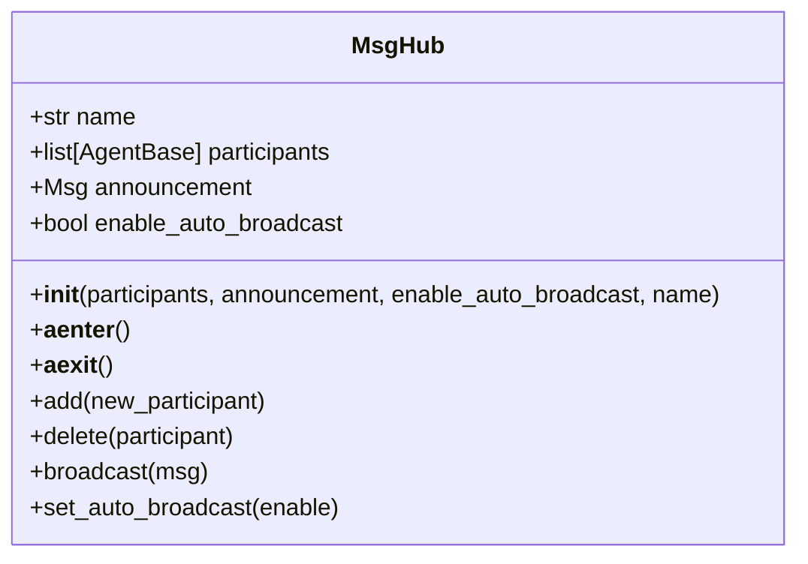

**图示来源**  
- [_msghub.py](file://src/agentscope/pipeline/_msghub.py#L14-L157)

### 通信流程
消息枢纽的通信流程包括初始化、消息广播和资源清理三个阶段。在进入上下文时，会重置订阅者并广播公告消息；在退出时，会清理订阅关系。

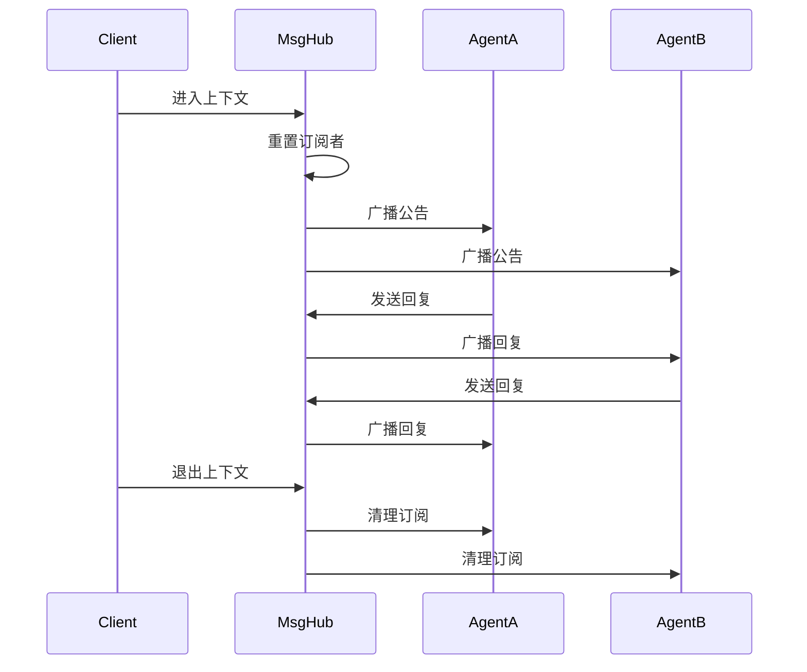

**图示来源**  
- [_msghub.py](file://src/agentscope/pipeline/_msghub.py#L73-L88)

### 动态参与者管理
消息枢纽支持动态添加和删除参与者，通过`add()`和`delete()`方法实现。这使得工作流可以在运行时动态调整参与的智能体。

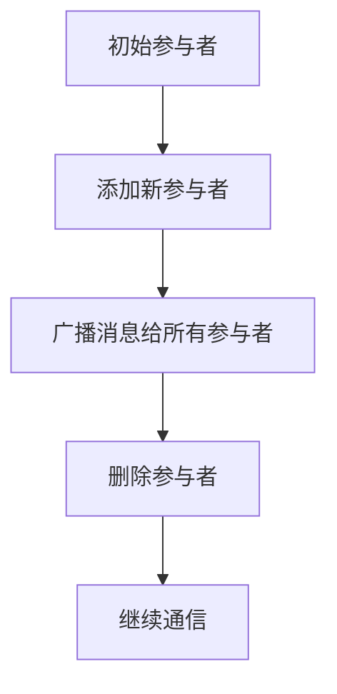

**图示来源**  
- [_msghub.py](file://src/agentscope/pipeline/_msghub.py#L95-L128)

**本节来源**  
- [_msghub.py](file://src/agentscope/pipeline/_msghub.py#L14-L157)

## 复杂工作流构建模式

在实际应用中，需要构建更复杂的多智能体工作流来解决实际问题。以下是几种常见的复杂工作流构建模式。

### 条件分支模式
条件分支模式根据智能体的输出结果决定后续执行路径。这种模式通过在管道中添加条件判断逻辑实现。

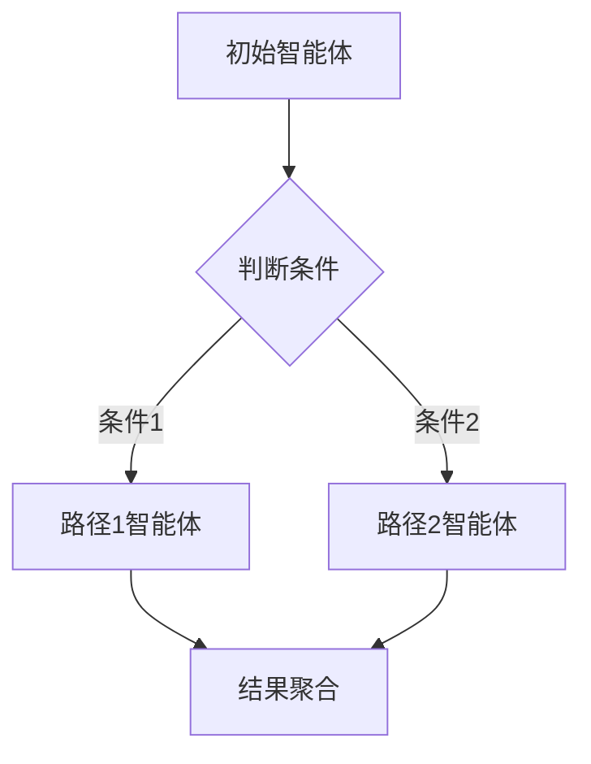

### 循环执行模式
循环执行模式允许智能体重复执行直到满足特定条件。这种模式通过在工作流中添加循环控制逻辑实现。

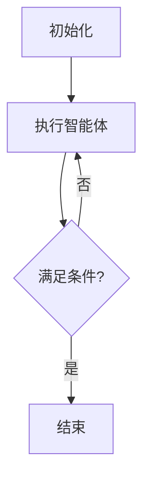

### 错误处理模式
错误处理模式确保工作流在遇到异常时能够优雅地处理。通过try-catch机制和重试策略，提高工作流的鲁棒性。

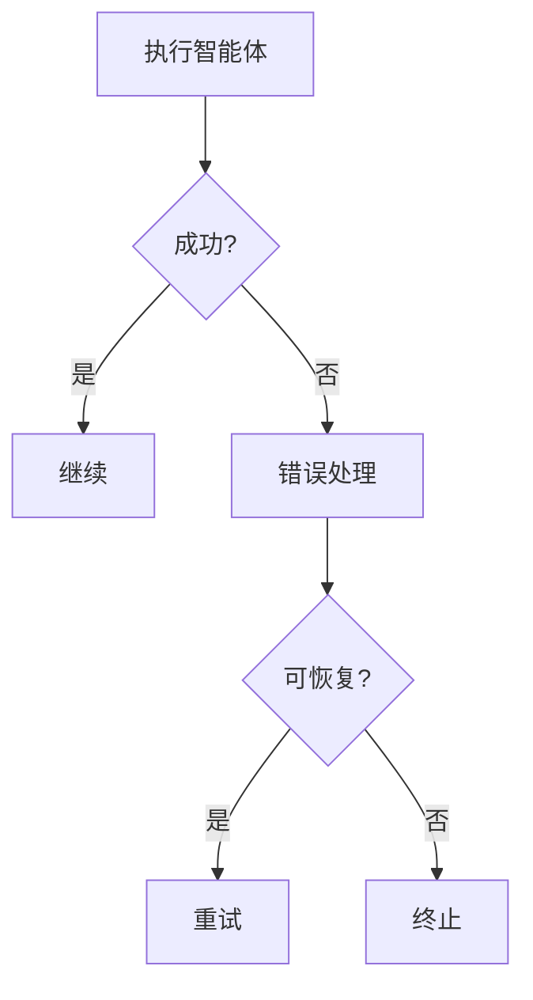

**本节来源**  
- [pipeline_test.py](file://tests/pipeline_test.py#L89-L117)
- [_agent_base.py](file://src/agentscope/agent/_agent_base.py#L474-L484)

## 多智能体协作场景

### 任务分解与执行
任务分解模式通过一个协调者智能体将复杂任务分解为多个子任务，并创建专门的智能体来执行这些子任务。

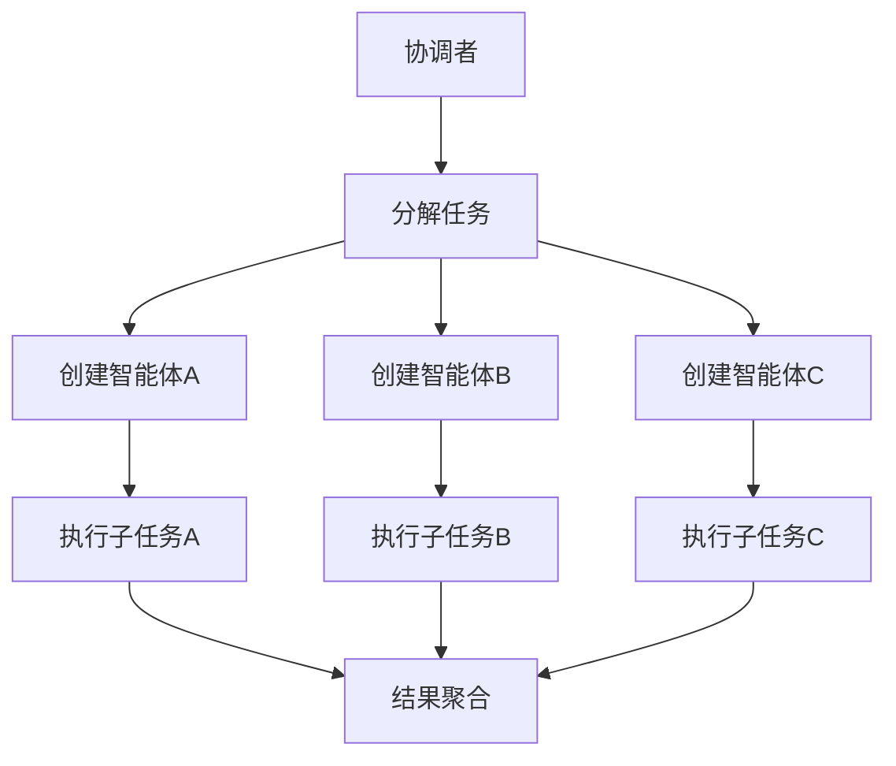

**图示来源**  
- [workflow_handoffs.py](file://docs/tutorial/zh_CN/src/workflow_handoffs.py#L34-L65)

### 结果聚合模式
结果聚合模式收集多个智能体的输出并进行综合处理，生成最终结果。这种模式常用于需要多方意见汇总的决策场景。

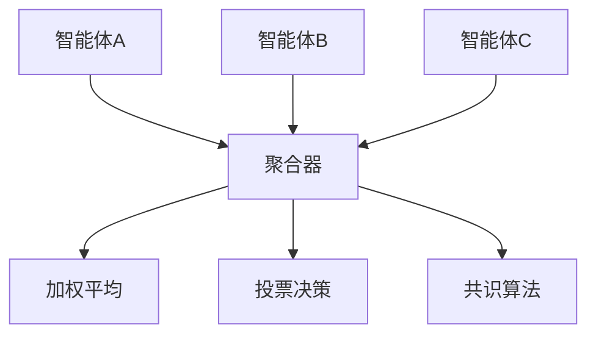

### 决策共识模式
决策共识模式通过多轮讨论和投票，使多个智能体就某个决策达成共识。这种模式在需要多方协商的复杂决策中非常有效。

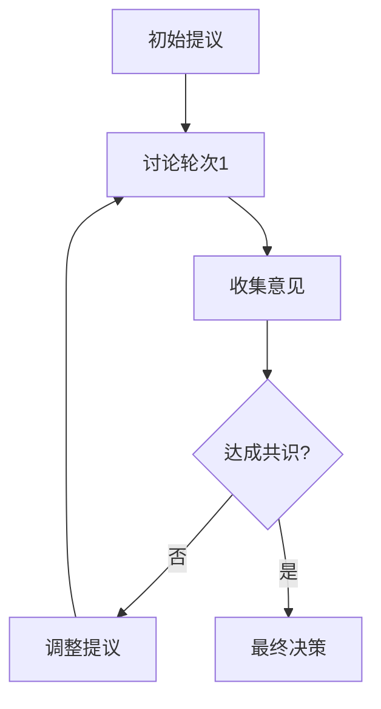

**本节来源**  
- [main.py](file://examples/workflows/multiagent_conversation/main.py#L48-L58)
- [workflow_handoffs.py](file://docs/tutorial/zh_CN/src/workflow_handoffs.py#L34-L65)

## 可视化与监控

### 流式消息输出
流式消息输出功能允许实时监控智能体的输出过程，通过`stream_printing_messages`管道收集和显示中间消息。

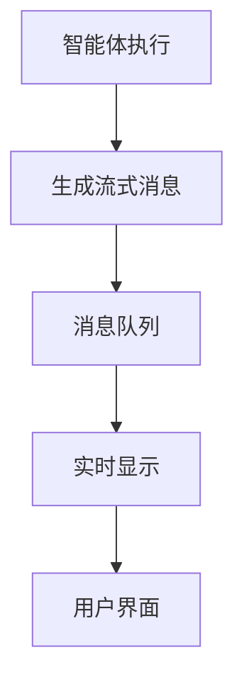

**图示来源**  
- [_functional.py](file://src/agentscope/pipeline/_functional.py#L107-L193)

### 执行跟踪
执行跟踪功能记录工作流的执行过程，包括每个智能体的输入输出、执行时间和状态，便于后续分析和调试。

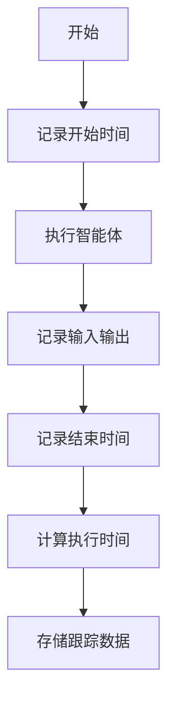

**本节来源**  
- [_functional.py](file://src/agentscope/pipeline/_functional.py#L107-L193)
- [_agent_base.py](file://src/agentscope/agent/_agent_base.py#L205-L225)

## 性能优化建议

### 并行度控制
合理控制并发执行的智能体数量，避免资源过度消耗。通过`enable_gather`参数和任务队列管理，并行度可以根据系统负载动态调整。

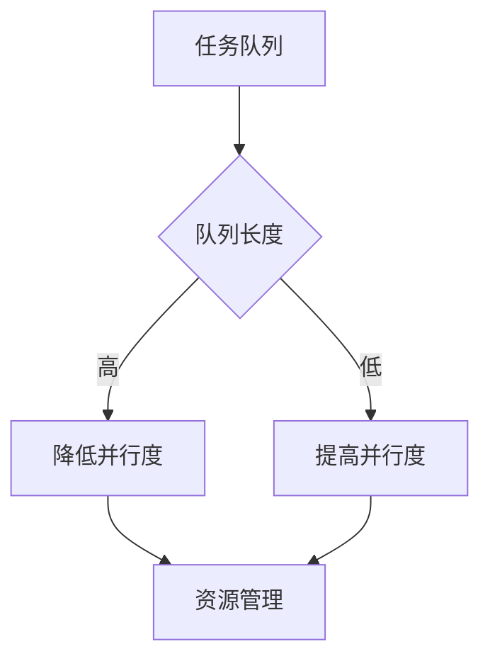

### 资源管理
实施有效的资源管理策略，包括内存管理、连接池和缓存机制，确保系统在高负载下的稳定性。

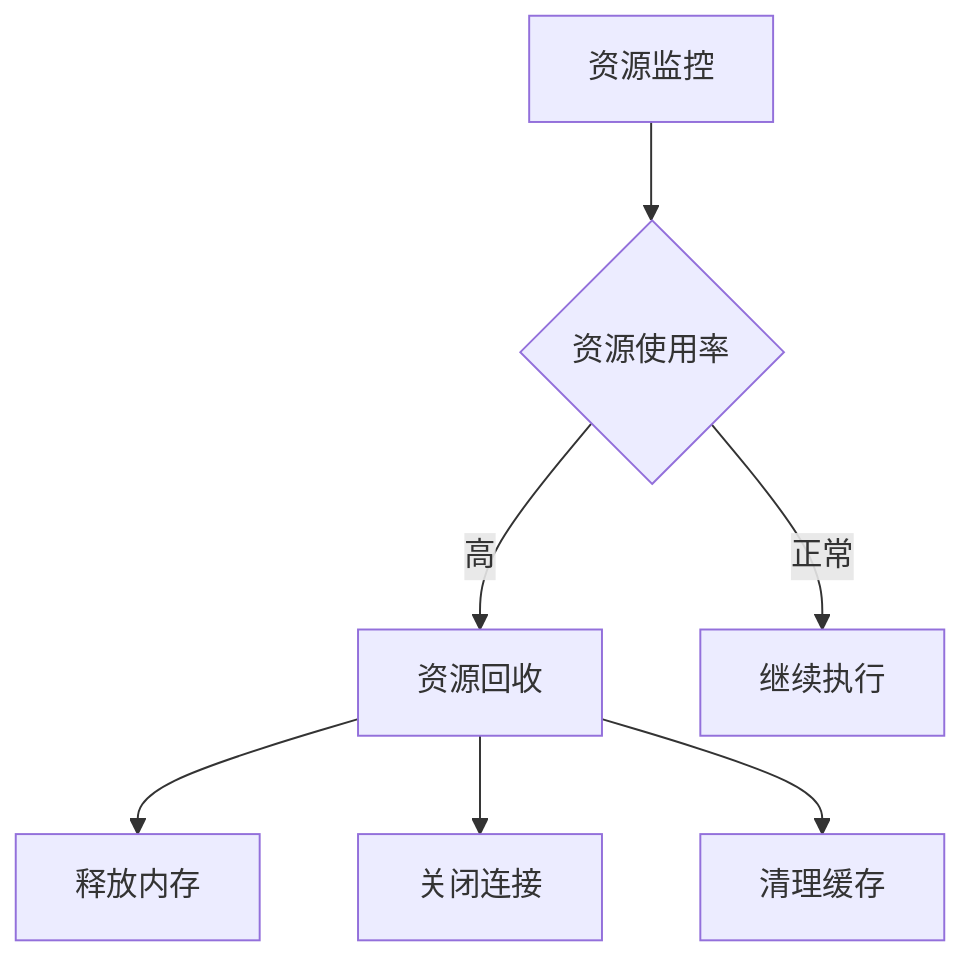

### 异步执行优化
充分利用异步执行的优势，通过`asyncio.gather()`和任务调度器优化执行效率，减少等待时间。

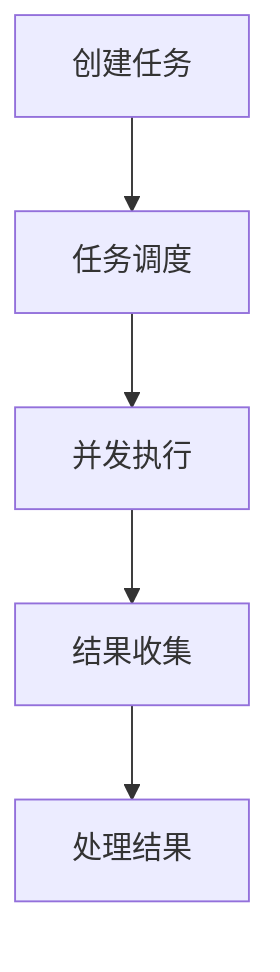

**本节来源**  
- [_functional.py](file://src/agentscope/pipeline/_functional.py#L96-L103)
- [_agent_base.py](file://src/agentscope/agent/_agent_base.py#L444-L463)

## 错误处理与调试

### 异常处理机制
框架提供了完善的异常处理机制，通过`handle_interrupt`方法处理执行中断，确保工作流的稳定性。

```mermaid
classDiagram
class AgentBase {
+handle_interrupt(*args, **kwargs)
+interrupt(msg)
}
```

**图示来源**  
- [_agent_base.py](file://src/agentscope/agent/_agent_base.py#L474-L490)

### 调试工具
提供多种调试工具，包括日志记录、消息队列监控和执行跟踪，帮助开发者快速定位和解决问题。

```mermaid
flowchart TD
A[问题发生] --> B[查看日志]
B --> C[检查消息队列]
C --> D[分析执行跟踪]
D --> E[定位问题]
E --> F[修复问题]
```

**本节来源**  
- [_agent_base.py](file://src/agentscope/agent/_agent_base.py#L474-L490)
- [pipeline_test.py](file://tests/pipeline_test.py#L89-L117)

## 最佳实践

### 智能体设计原则
- **单一职责**：每个智能体应专注于单一任务
- **松耦合**：智能体之间应尽量减少直接依赖
- **可重用性**：设计可跨工作流重用的智能体
- **可测试性**：确保智能体易于单独测试

### 工作流设计原则
- **模块化**：将复杂工作流分解为可管理的模块
- **可配置性**：通过参数化提高工作流的灵活性
- **可观测性**：确保工作流的执行过程可监控和跟踪
- **容错性**：设计健壮的错误处理和恢复机制

### 性能优化原则
- **异步优先**：尽可能使用异步执行模式
- **批量处理**：对相似任务进行批量处理以提高效率
- **缓存策略**：合理使用缓存减少重复计算
- **资源监控**：持续监控系统资源使用情况

**本节来源**  
- [pipeline_test.py](file://tests/pipeline_test.py#L147-L200)
- [_agent_base.py](file://src/agentscope/agent/_agent_base.py#L140-L184)
- [_message_base.py](file://src/agentscope/message/_message_base.py#L24-L74)