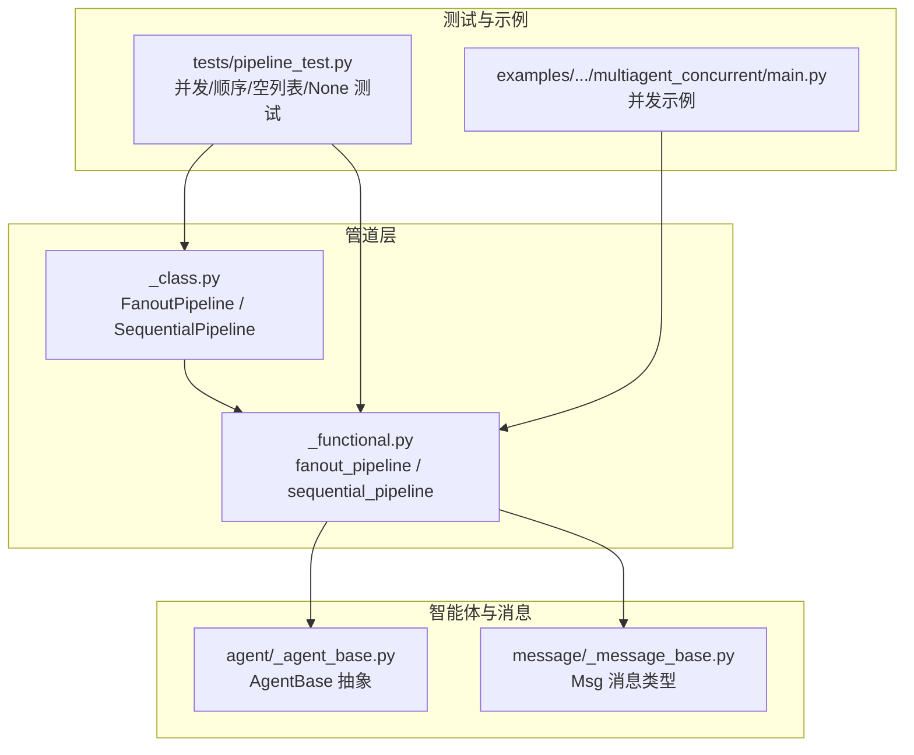
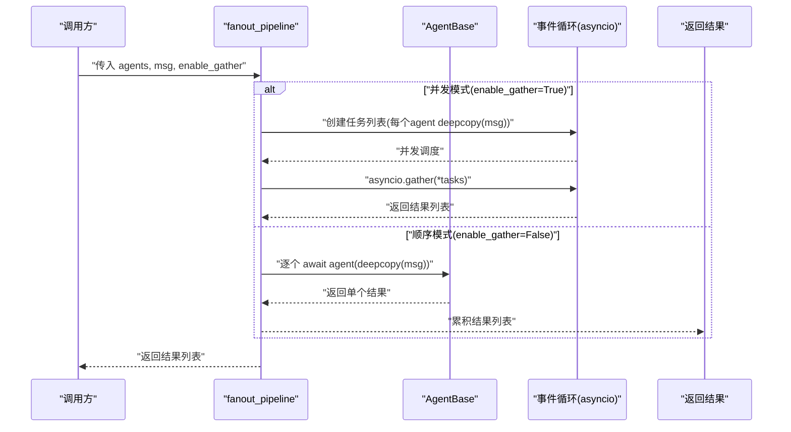
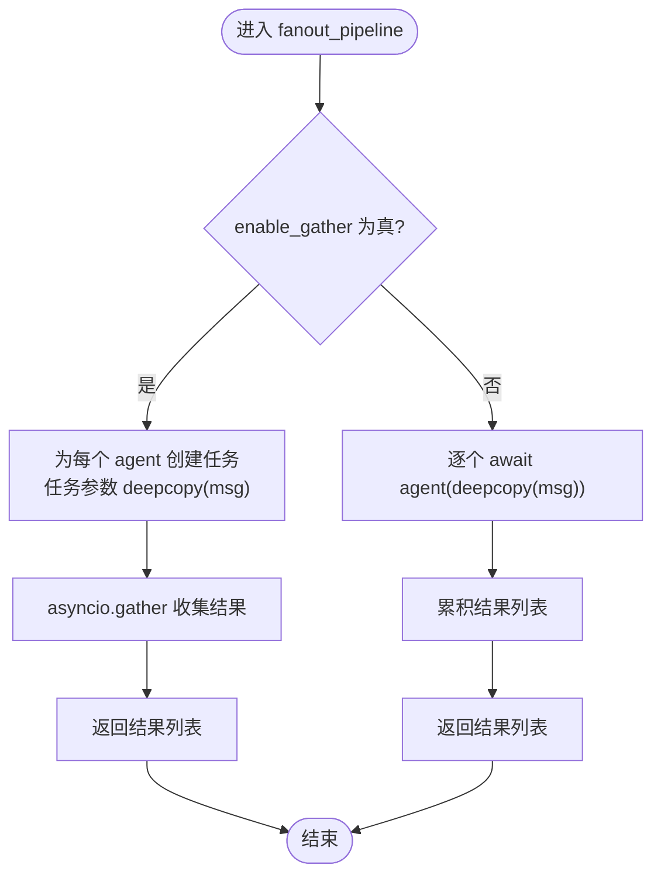
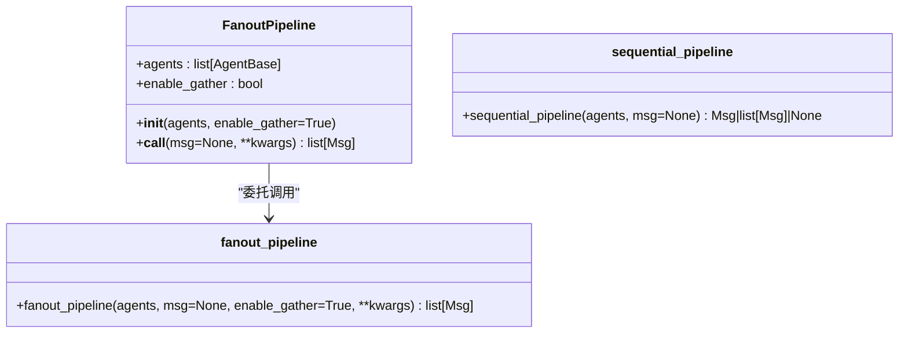
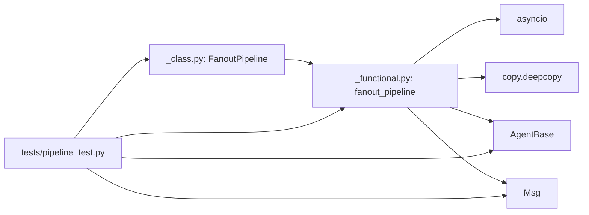

# 并发工作流

<cite>
**本文引用的文件**
- [src/agentscope/pipeline/_functional.py](file://src/agentscope/pipeline/_functional.py)
- [src/agentscope/pipeline/_class.py](file://src/agentscope/pipeline/_class.py)
- [src/agentscope/agent/_agent_base.py](file://src/agentscope/agent/_agent_base.py)
- [src/agentscope/message/_message_base.py](file://src/agentscope/message/_message_base.py)
- [tests/pipeline_test.py](file://tests/pipeline_test.py)
- [examples/workflows/multiagent_concurrent/main.py](file://examples/workflows/multiagent_concurrent/main.py)
</cite>

## 目录
1. [简介](#简介)
2. [项目结构](#项目结构)
3. [核心组件](#核心组件)
4. [架构总览](#架构总览)
5. [详细组件分析](#详细组件分析)
6. [依赖关系分析](#依赖关系分析)
7. [性能考量](#性能考量)
8. [故障排查指南](#故障排查指南)
9. [结论](#结论)
10. [附录](#附录)

## 简介
本文件系统性解析并发工作流中的 fanout_pipeline 与 FanoutPipeline 实现机制，重点说明 enable_gather 参数如何控制并发（使用 asyncio.gather）与顺序执行模式；解释其核心功能是将相同输入分发给多个智能体并收集响应；深入阐述 deepcopy(msg) 如何确保消息隔离；给出多模型对比、并行数据处理等实际应用场景；通过测试用例展示并发与顺序执行在输出上的一致性；讨论性能权衡与资源消耗；说明空智能体列表与 None 消息输入的处理逻辑。

## 项目结构
围绕并发工作流的相关代码主要位于 pipeline 子模块，配合 AgentBase 与 Msg 类型完成消息传递与执行编排：
- 功能式并发管线：fanout_pipeline
- 类式并发管线：FanoutPipeline
- 顺序管线：sequential_pipeline（用于对比）
- 测试用例：覆盖并发/顺序、空列表、None 输入等场景
- 示例：多智能体并发运行示例脚本

图表来源
- [src/agentscope/pipeline/_functional.py](file://src/agentscope/pipeline/_functional.py#L1-L193)
- [src/agentscope/pipeline/_class.py](file://src/agentscope/pipeline/_class.py#L1-L91)
- [src/agentscope/agent/_agent_base.py](file://src/agentscope/agent/_agent_base.py#L1-L200)
- [src/agentscope/message/_message_base.py](file://src/agentscope/message/_message_base.py#L1-L200)
- [tests/pipeline_test.py](file://tests/pipeline_test.py#L250-L439)
- [examples/workflows/multiagent_concurrent/main.py](file://examples/workflows/multiagent_concurrent/main.py#L46-L93)

章节来源
- [src/agentscope/pipeline/_functional.py](file://src/agentscope/pipeline/_functional.py#L1-L193)
- [src/agentscope/pipeline/_class.py](file://src/agentscope/pipeline/_class.py#L1-L91)
- [tests/pipeline_test.py](file://tests/pipeline_test.py#L250-L439)
- [examples/workflows/multiagent_concurrent/main.py](file://examples/workflows/multiagent_concurrent/main.py#L46-L93)

## 核心组件
- fanout_pipeline：将同一输入分发给多个智能体，支持并发（默认）或顺序执行，返回各智能体的响应列表。
- FanoutPipeline：类式封装，便于复用与配置默认参数（enable_gather）。
- sequential_pipeline：顺序管线，用于对比并发行为。
- AgentBase：智能体抽象，每个智能体需实现 reply/observe 等方法。
- Msg：消息载体，包含名称、内容、角色、元数据等字段。

章节来源
- [src/agentscope/pipeline/_functional.py](file://src/agentscope/pipeline/_functional.py#L47-L105)
- [src/agentscope/pipeline/_class.py](file://src/agentscope/pipeline/_class.py#L43-L91)
- [src/agentscope/agent/_agent_base.py](file://src/agentscope/agent/_agent_base.py#L197-L200)
- [src/agentscope/message/_message_base.py](file://src/agentscope/message/_message_base.py#L21-L74)

## 架构总览
并发工作流的调用链路如下：
- 调用方传入 agents 列表与 msg（可为 None），选择是否启用并发（enable_gather）。
- 若启用并发：为每个智能体创建任务，并使用 asyncio.gather 并发等待所有任务完成，统一返回结果列表。
- 若禁用并发：逐个异步调用智能体，按顺序收集结果。
- 无论哪种模式，均对 msg 使用深拷贝以保证消息隔离，避免不同智能体之间的状态互相影响。

图表来源
- [src/agentscope/pipeline/_functional.py](file://src/agentscope/pipeline/_functional.py#L47-L105)
- [src/agentscope/agent/_agent_base.py](file://src/agentscope/agent/_agent_base.py#L197-L200)

## 详细组件分析

### fanout_pipeline 实现机制
- 输入参数
  - agents：智能体列表
  - msg：消息对象或 None
  - enable_gather：是否并发执行，默认 True
  - kwargs：透传给每个智能体的额外参数
- 执行策略
  - 并发：为每个智能体创建任务，使用 asyncio.gather 收集结果
  - 顺序：逐个 await 智能体，收集结果
- 深拷贝隔离
  - 对 msg 使用 deepcopy，确保每个智能体收到独立的消息副本，避免共享状态导致的副作用
- 返回值
  - 返回与 agents 同长度的结果列表，顺序与 agents 一致

图表来源
- [src/agentscope/pipeline/_functional.py](file://src/agentscope/pipeline/_functional.py#L47-L105)

章节来源
- [src/agentscope/pipeline/_functional.py](file://src/agentscope/pipeline/_functional.py#L47-L105)

### FanoutPipeline 类式封装
- 初始化
  - 接收 agents 与 enable_gather（默认 True）
- 调用
  - 通过 __call__ 将调用委托给 fanout_pipeline，保持一致的行为与参数语义
- 复用性
  - 适合多次调用同一组智能体，且可设置默认并发策略

图表来源
- [src/agentscope/pipeline/_class.py](file://src/agentscope/pipeline/_class.py#L43-L91)
- [src/agentscope/pipeline/_functional.py](file://src/agentscope/pipeline/_functional.py#L1-L45)

章节来源
- [src/agentscope/pipeline/_class.py](file://src/agentscope/pipeline/_class.py#L43-L91)

### 消息隔离与 deepcopy(msg)
- 设计要点
  - 每个智能体接收 deepcopy(msg)，避免不同智能体对同一消息对象进行修改造成相互影响
- 适用场景
  - 多智能体并行处理同一输入时，确保各自对消息的读写不会互相干扰
- 注意事项
  - deepcopy 的成本取决于消息结构大小与复杂度，应结合实际消息体量评估

章节来源
- [src/agentscope/pipeline/_functional.py](file://src/agentscope/pipeline/_functional.py#L96-L104)
- [src/agentscope/message/_message_base.py](file://src/agentscope/message/_message_base.py#L21-L74)

### 并发与顺序执行的输出一致性
- 测试验证
  - 并发与顺序两种模式下，对相同 agents 与相同输入，得到的响应数量与顺序一致
  - 不同顺序的 agents 列表在并发/顺序模式下分别保持各自顺序的正确性
- 结论
  - enable_gather 仅改变执行方式，不改变语义与结果集合

章节来源
- [tests/pipeline_test.py](file://tests/pipeline_test.py#L267-L341)

### 实际应用场景
- 多模型对比
  - 将同一输入同时送入多个模型智能体，比较输出差异，适用于评测、A/B 对比等
- 并行数据处理
  - 将同一数据切片或同一请求分发给多个处理智能体，提升吞吐
- 示例脚本
  - 多智能体并发示例展示了使用 asyncio.gather 与 fanout_pipeline 的等价用法

章节来源
- [examples/workflows/multiagent_concurrent/main.py](file://examples/workflows/multiagent_concurrent/main.py#L46-L93)
- [tests/pipeline_test.py](file://tests/pipeline_test.py#L267-L341)

### 空智能体列表与 None 消息输入
- 空智能体列表
  - 返回空列表，不抛异常，便于健壮性处理
- None 消息输入
  - 将 None 传入每个智能体，返回 None 列表，体现“无输入即无输出”的语义

章节来源
- [tests/pipeline_test.py](file://tests/pipeline_test.py#L343-L378)

## 依赖关系分析
- fanout_pipeline 依赖
  - asyncio：并发调度与 gather
  - copy.deepcopy：消息隔离
  - AgentBase：智能体接口
  - Msg：消息类型
- FanoutPipeline 依赖
  - fanout_pipeline：内部委托
- 测试依赖
  - AddAgent/MultAgent：用于验证加法/乘法语义
  - StreamAgent/ErrorAgent：用于流式打印与异常场景

图表来源
- [src/agentscope/pipeline/_functional.py](file://src/agentscope/pipeline/_functional.py#L1-L193)
- [src/agentscope/pipeline/_class.py](file://src/agentscope/pipeline/_class.py#L1-L91)
- [tests/pipeline_test.py](file://tests/pipeline_test.py#L1-L200)

章节来源
- [src/agentscope/pipeline/_functional.py](file://src/agentscope/pipeline/_functional.py#L1-L193)
- [src/agentscope/pipeline/_class.py](file://src/agentscope/pipeline/_class.py#L1-L91)
- [tests/pipeline_test.py](file://tests/pipeline_test.py#L1-L200)

## 性能考量
- 并发优势
  - 提升整体吞吐，缩短端到端时延，尤其在 I/O 密集或远程调用场景
- 资源消耗
  - 并发会增加上下文切换与内存占用（每个任务持有 deepcopy 的消息）
  - 需要合理控制并发度，避免过度并发导致资源争用
- 深拷贝成本
  - 消息越大、嵌套越深，deepcopy 成本越高；可根据业务场景评估是否需要深拷贝
- 顺序执行
  - 降低资源开销，适合轻量计算或需要严格串行化的场景

[本节为通用性能讨论，无需特定文件引用]

## 故障排查指南
- 并发异常
  - 若某个智能体抛出异常，asyncio.gather 会在所有任务完成后聚合异常；建议在上层捕获并记录
- 深拷贝失败
  - 确认消息对象可被 deepcopy；若包含不可序列化字段，需自定义序列化/反序列化策略
- 空智能体列表
  - 返回空列表属预期行为；如需特殊处理，请在外层判断
- None 消息
  - 智能体需自行处理 None 输入，避免空指针错误

章节来源
- [src/agentscope/pipeline/_functional.py](file://src/agentscope/pipeline/_functional.py#L96-L105)
- [tests/pipeline_test.py](file://tests/pipeline_test.py#L343-L378)

## 结论
- enable_gather 控制并发与顺序两种执行模式，语义一致、结果一致
- deepcopy(msg) 是消息隔离的关键，确保多智能体并行时的正确性
- fanout_pipeline 与 FanoutPipeline 提供了灵活的并发工作流能力，适用于多模型对比、并行数据处理等场景
- 在追求性能的同时，需综合考虑资源消耗与深拷贝成本，按需选择并发策略

[本节为总结性内容，无需特定文件引用]

## 附录
- 关键 API 参考
  - fanout_pipeline(agents, msg=None, enable_gather=True, **kwargs) -> list[Msg]
  - FanoutPipeline(agents, enable_gather=True) -> callable(msg=None, **kwargs) -> list[Msg]
- 相关类型
  - AgentBase：智能体抽象接口
  - Msg：消息载体

章节来源
- [src/agentscope/pipeline/_functional.py](file://src/agentscope/pipeline/_functional.py#L47-L105)
- [src/agentscope/pipeline/_class.py](file://src/agentscope/pipeline/_class.py#L43-L91)
- [src/agentscope/agent/_agent_base.py](file://src/agentscope/agent/_agent_base.py#L197-L200)
- [src/agentscope/message/_message_base.py](file://src/agentscope/message/_message_base.py#L21-L74)