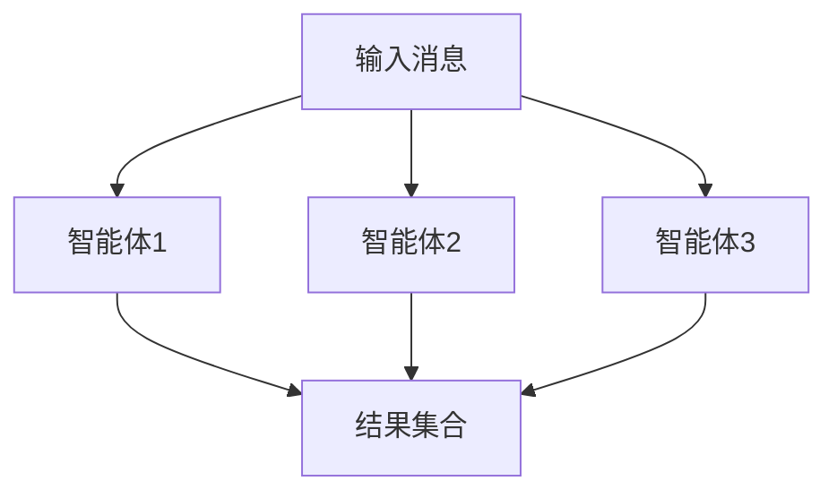
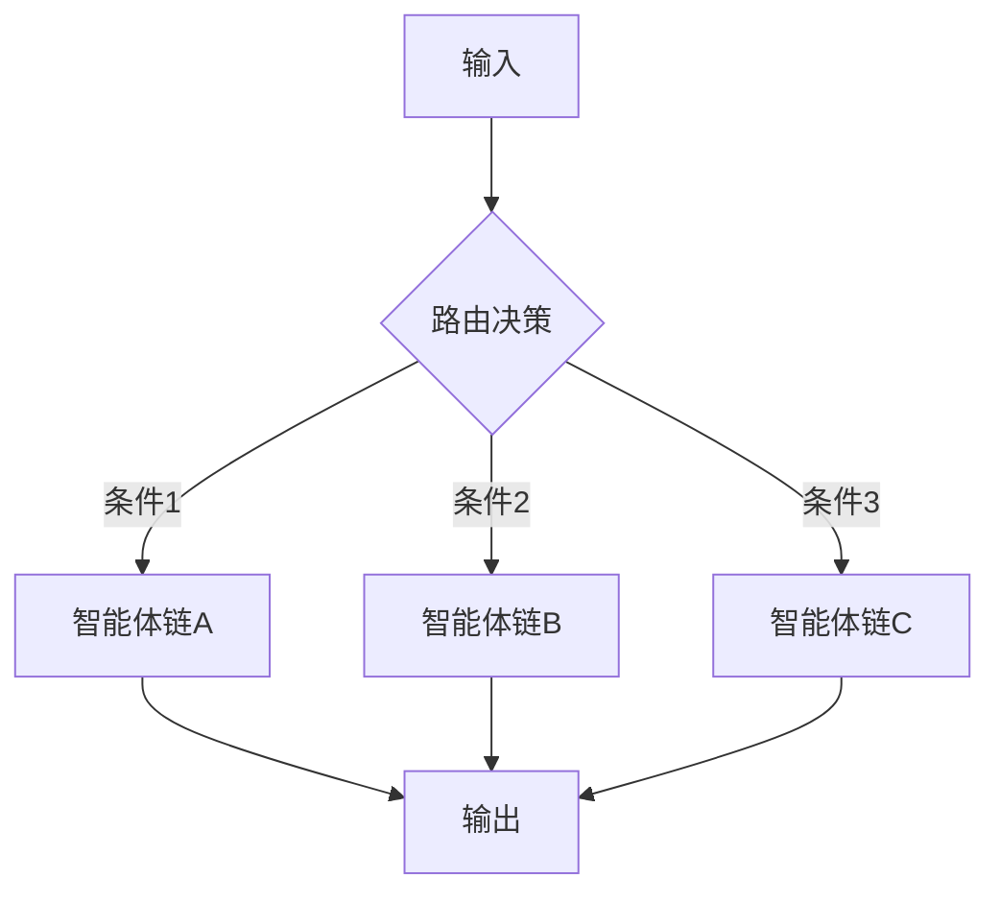
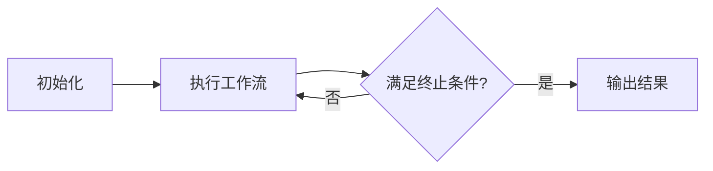
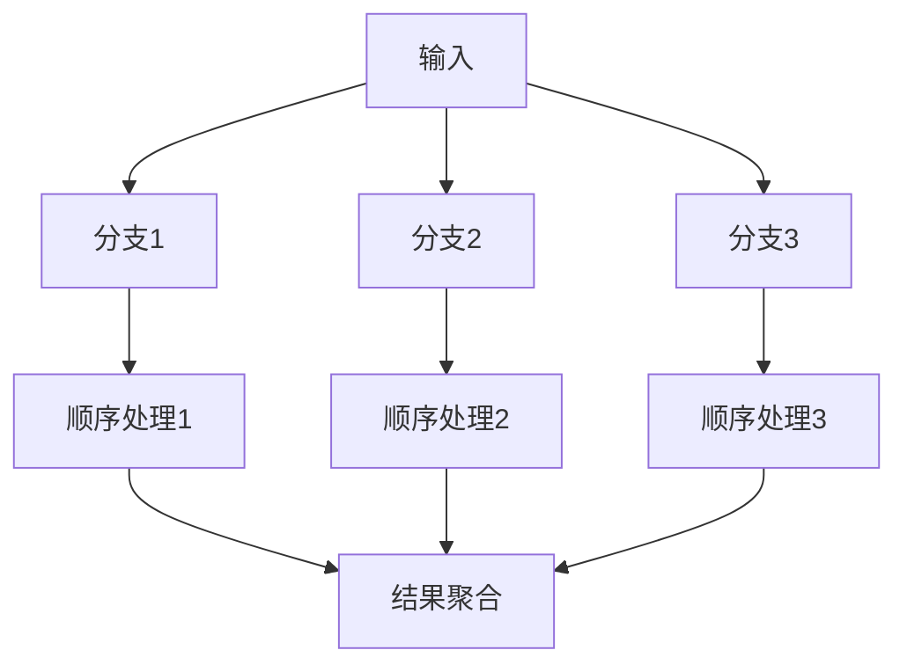
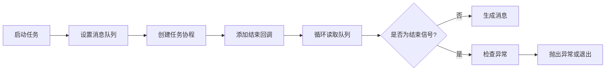
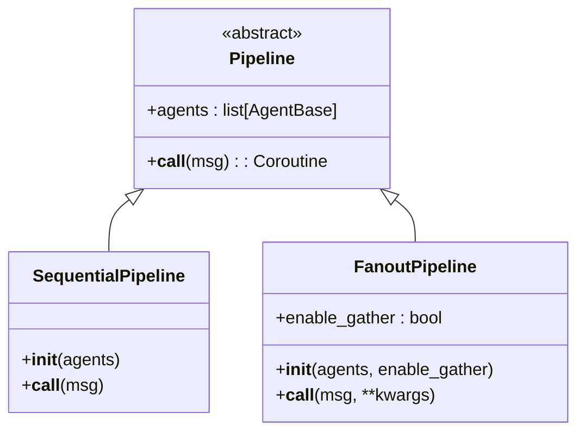
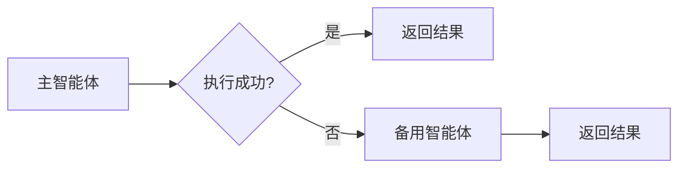

# 自定义工作流

<cite>
**本文档中引用的文件**  
- [__init__.py](file://src/agentscope/pipeline/__init__.py)
- [_msghub.py](file://src/agentscope/pipeline/_msghub.py)
- [_functional.py](file://src/agentscope/pipeline/_functional.py)
- [_class.py](file://src/agentscope/pipeline/_class.py)
- [multi_agent.py](file://examples/functionality/stream_printing_messages/multi_agent.py)
- [single_agent.py](file://examples/functionality/stream_printing_messages/single_agent.py)
- [main.py](file://examples/workflows/multiagent_concurrent/main.py)
- [main.py](file://examples/workflows/multiagent_conversation/main.py)
- [main.py](file://examples/workflows/multiagent_debate/main.py)
- [workflow_routing.py](file://docs/tutorial/en/src/workflow_routing.py)
- [pipeline_test.py](file://tests/pipeline_test.py)
</cite>

## 目录
1. [简介](#简介)
2. [基础工作流组件](#基础工作流组件)
3. [高级工作流模式](#高级工作流模式)
4. [流式消息处理](#流式消息处理)
5. [可复用性设计](#可复用性设计)
6. [错误处理策略](#错误处理策略)
7. [性能优化技巧](#性能优化技巧)

## 简介
本指南详细介绍了如何在AgentScope框架中创建自定义工作流。通过组合顺序执行、并发执行和消息中心（MsgHub）等基础组件，开发者可以构建复杂的多智能体协作模式。文档涵盖了条件分支、循环执行和混合模式等高级模式，并深入解析了流式输出处理机制和可复用性设计原则。

## 基础工作流组件

AgentScope提供了三种核心工作流组件：顺序执行、并发执行和消息中心（MsgHub）。这些组件构成了复杂工作流的基础构建块。

### 顺序执行
顺序执行模式通过`sequential_pipeline`函数或`SequentialPipeline`类实现，按照预定义的顺序依次执行智能体。每个智能体的输出作为下一个智能体的输入，形成链式处理流程。


**组件来源**
- [__init__.py](file://src/agentscope/pipeline/__init__.py#L7-L8)
- [_functional.py](file://src/agentscope/pipeline/_functional.py#L10-L44)
- [_class.py](file://src/agentscope/pipeline/_class.py#L10-L41)

### 并发执行
并发执行模式通过`fanout_pipeline`函数或`FanoutPipeline`类实现，将相同输入分发给多个智能体并行处理。支持使用`asyncio.gather()`进行真正的并发执行或顺序执行。



**组件来源**
- [__init__.py](file://src/agentscope/pipeline/__init__.py#L9-L10)
- [_functional.py](file://src/agentscope/pipeline/_functional.py#L47-L105)
- [_class.py](file://src/agentscope/pipeline/_class.py#L43-L91)

### 消息中心（MsgHub）
消息中心（MsgHub）是一个上下文管理器，用于在一组智能体之间共享消息。它自动将任何参与者的回复广播给其他所有参与者，简化了多智能体对话的实现。

```mermaid
flowchart LR
subgraph MsgHub
A[智能体A]
B[智能体B]
C[智能体C]
end
A < --> B
A < --> C
B < --> C
```

**组件来源**
- [_msghub.py](file://src/agentscope/pipeline/_msghub.py#L14-L157)
- [multiagent_conversation.py](file://examples/workflows/multiagent_conversation/main.py#L11)

## 高级工作流模式

### 条件分支
基于前序结果选择不同智能体链的条件分支模式可以通过结构化输出或工具调用来实现。路由智能体根据输入或中间结果决定后续执行路径。



**模式来源**
- [workflow_routing.py](file://docs/tutorial/en/src/workflow_routing.py#L9-L10)
- [workflow_routing.py](file://docs/tutorial/en/src/workflow_routing.py#L47-L56)

### 循环执行
循环执行模式通过在主循环中重复调用工作流来实现，通常结合条件判断来确定循环终止条件。这种模式适用于需要迭代优化或持续监控的场景。



**模式来源**
- [multiagent_debate.py](file://examples/workflows/multiagent_debate/main.py#L87-L127)

### 混合模式
混合模式结合了顺序和并发执行，例如在并发执行的每个分支中进行顺序处理。这种模式能够实现复杂的并行-串行混合工作流。



**模式来源**
- [multiagent_concurrent.py](file://examples/workflows/multiagent_concurrent/main.py#L73-L76)
- [multiagent_concurrent.py](file://examples/workflows/multiagent_concurrent/main.py#L79-L82)

## 流式消息处理

### stream_printing_messages函数
`stream_printing_messages`函数实现了流式输出处理，能够捕获智能体在执行过程中的中间消息并以异步生成器的形式逐个返回。

#### 消息队列集成
该函数通过为指定智能体启用消息队列来捕获打印消息。所有智能体共享同一个队列，确保消息按时间顺序被处理。


#### 结束信号机制
函数使用特殊信号`[END]`来标识消息流的结束。当协程任务完成时，会向队列发送结束信号，触发生成器的退出循环。

#### 语音块处理
支持可选的语音块处理功能，当`yield_speech`参数为`True`时，生成器会包含与消息关联的音频数据。



**实现来源**
- [_functional.py](file://src/agentscope/pipeline/_functional.py#L107-L193)
- [single_agent.py](file://examples/functionality/stream_printing_messages/single_agent.py#L55-L59)
- [multi_agent.py](file://examples/functionality/stream_printing_messages/multi_agent.py#L55-L59)

## 可复用性设计

### 类封装配置化工作流
通过类封装实现可复用的工作流设计，允许预配置参数并在不同场景中重复使用。`SequentialPipeline`和`FanoutPipeline`类都支持这种设计模式。



**设计来源**
- [_class.py](file://src/agentscope/pipeline/_class.py#L10-L91)
- [pipeline_test.py](file://tests/pipeline_test.py#L169-L223)

## 错误处理策略

### 异常捕获
`stream_printing_messages`函数在处理完所有消息后会检查任务异常，并将异常重新抛出，确保错误不会被静默忽略。

### 回退机制
通过组合不同的工作流组件，可以实现优雅的回退机制。例如，在主智能体失败时切换到备用智能体链。



**策略来源**
- [pipeline_test.py](file://tests/pipeline_test.py#L411-L438)
- [_functional.py](file://src/agentscope/pipeline/_functional.py#L189-L192)

## 性能优化技巧

### 任务分批
对于大量独立任务，使用`fanout_pipeline`的并发模式进行分批处理，可以显著提高吞吐量。

### 资源预分配
在工作流执行前预分配必要的资源（如模型实例、内存等），避免在执行过程中产生额外的延迟。

### 消息广播优化
合理使用MsgHub的自动广播功能，避免不必要的消息传递开销。对于不需要广播的场景，可以禁用自动广播功能。

**优化来源**
- [multiagent_concurrent.py](file://examples/workflows/multiagent_concurrent/main.py#L73-L76)
- [_msghub.py](file://src/agentscope/pipeline/_msghub.py#L46-L47)
- [_msghub.py](file://src/agentscope/pipeline/_msghub.py#L140-L157)