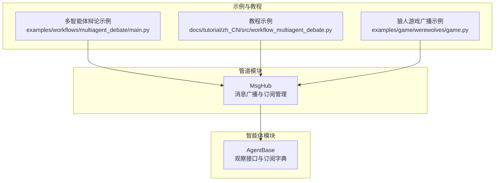
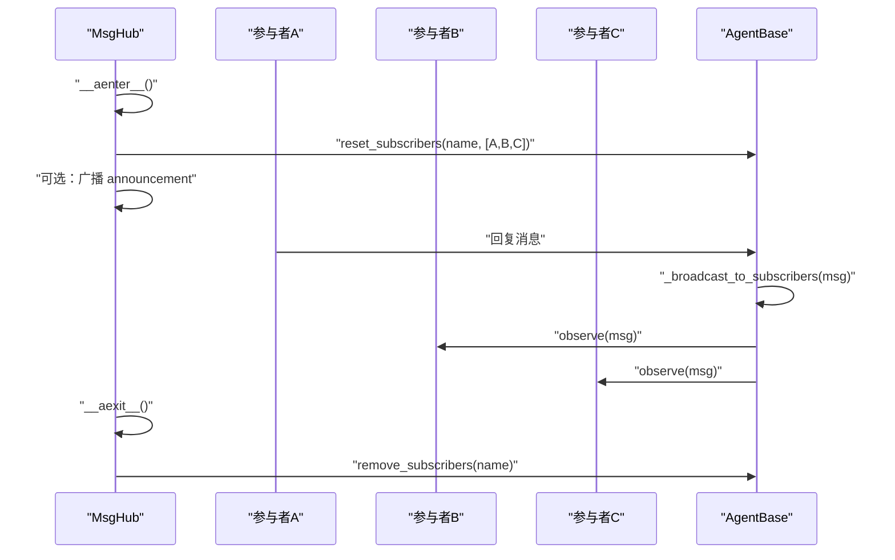
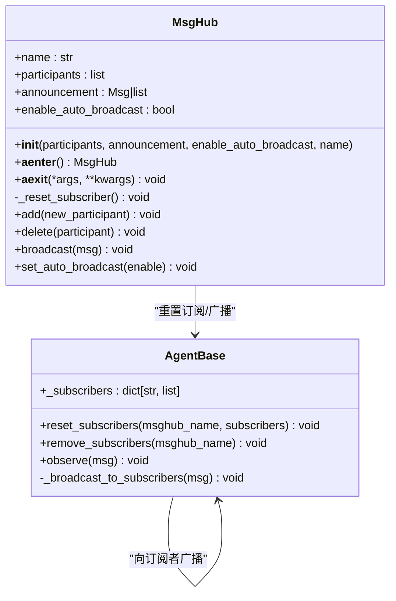
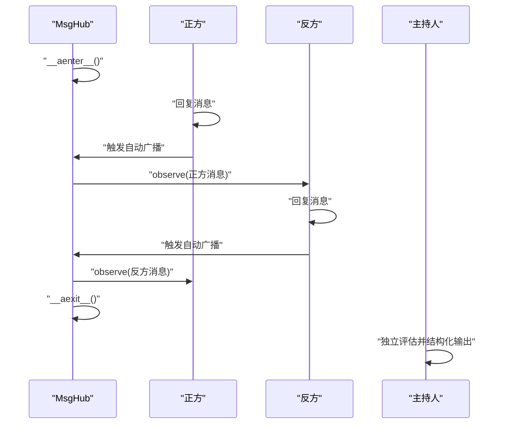
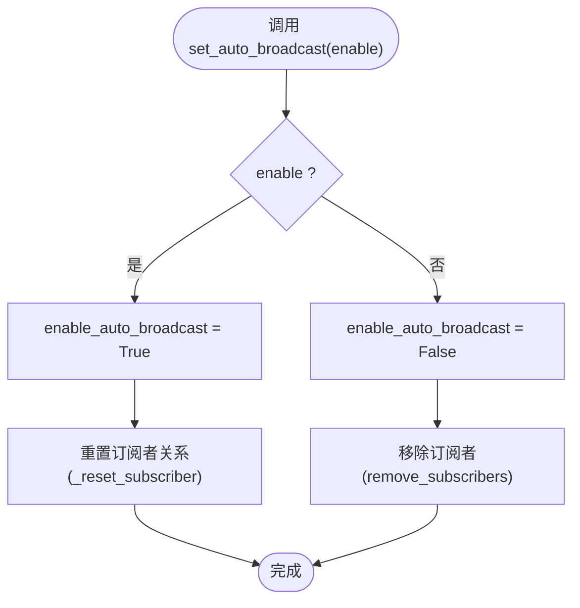
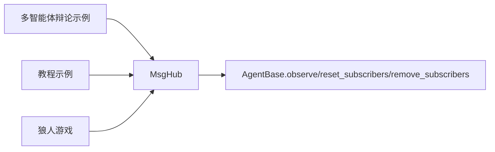

# 辩论工作流

<cite>
**本文引用的文件**
- [src/agentscope/pipeline/_msghub.py](file://src/agentscope/pipeline/_msghub.py)
- [src/agentscope/agent/_agent_base.py](file://src/agentscope/agent/_agent_base.py)
- [examples/workflows/multiagent_debate/main.py](file://examples/workflows/multiagent_debate/main.py)
- [docs/tutorial/zh_CN/src/workflow_multiagent_debate.py](file://docs/tutorial/zh_CN/src/workflow_multiagent_debate.py)
- [examples/game/werewolves/game.py](file://examples/game/werewolves/game.py)
</cite>

## 目录
1. [引言](#引言)
2. [项目结构](#项目结构)
3. [核心组件](#核心组件)
4. [架构总览](#架构总览)
5. [详细组件分析](#详细组件分析)
6. [依赖分析](#依赖分析)
7. [性能考虑](#性能考虑)
8. [故障排查指南](#故障排查指南)
9. [结论](#结论)
10. [附录](#附录)

## 引言
本文件围绕多智能体辩论场景，系统性阐述 MsgHub 如何实现智能体间的实时消息广播与观察机制，解释其作为异步上下文管理器（__aenter__/__aexit__）的工作原理，并深入说明三种通信模式：announcement 初始公告、自动广播（enable_auto_broadcast）与手动广播（broadcast 方法）。通过多智能体对话示例展示辩论流程的构建，涵盖动态参与者管理（add/delete）、运行时广播控制（set_auto_broadcast）等高级能力。最后讨论_msg_reset（即内部_reset_subscriber）如何维护订阅者关系，并给出性能建议与最佳实践。

## 项目结构
- 核心实现位于管道模块的 MsgHub 类，负责订阅管理与广播控制。
- 智能体基类提供观察接口与订阅字典，支撑广播链路。
- 示例与教程展示了辩论工作流的典型用法，包括自动广播与手动广播的组合使用。

图表来源
- [src/agentscope/pipeline/_msghub.py](file://src/agentscope/pipeline/_msghub.py#L1-L157)
- [src/agentscope/agent/_agent_base.py](file://src/agentscope/agent/_agent_base.py#L139-L182)
- [examples/workflows/multiagent_debate/main.py](file://examples/workflows/multiagent_debate/main.py#L85-L130)
- [docs/tutorial/zh_CN/src/workflow_multiagent_debate.py](file://docs/tutorial/zh_CN/src/workflow_multiagent_debate.py#L80-L115)
- [examples/game/werewolves/game.py](file://examples/game/werewolves/game.py#L247-L313)

章节来源
- [src/agentscope/pipeline/_msghub.py](file://src/agentscope/pipeline/_msghub.py#L1-L157)
- [src/agentscope/agent/_agent_base.py](file://src/agentscope/agent/_agent_base.py#L139-L182)
- [examples/workflows/multiagent_debate/main.py](file://examples/workflows/multiagent_debate/main.py#L85-L130)
- [docs/tutorial/zh_CN/src/workflow_multiagent_debate.py](file://docs/tutorial/zh_CN/src/workflow_multiagent_debate.py#L80-L115)
- [examples/game/werewolves/game.py](file://examples/game/werewolves/game.py#L247-L313)

## 核心组件
- MsgHub：异步上下文管理器，负责初始化订阅关系、自动广播与手动广播、动态参与者管理、运行时广播开关。
- AgentBase：提供 observe 接口与订阅字典，支持 reset_subscribers/remove_subscribers，形成广播链路。

关键职责与行为
- 初始化与进入上下文：重置订阅者关系，可选地广播初始公告。
- 退出上下文：在启用自动广播时清理订阅者关系。
- 自动广播：当任一参与者回复消息时，自动向其他订阅者广播。
- 手动广播：显式调用 broadcast 向所有参与者广播消息。
- 动态管理：add/delete 参与者后重置订阅者关系。
- 运行时控制：set_auto_broadcast 在启用/禁用自动广播之间切换。

章节来源
- [src/agentscope/pipeline/_msghub.py](file://src/agentscope/pipeline/_msghub.py#L42-L157)
- [src/agentscope/agent/_agent_base.py](file://src/agentscope/agent/_agent_base.py#L464-L471)
- [src/agentscope/agent/_agent_base.py](file://src/agentscope/agent/_agent_base.py#L658-L687)

## 架构总览
MsgHub 通过智能体的订阅字典建立广播通道：进入上下文时，为每个参与者设置订阅者列表；当参与者回复消息时，由 AgentBase 内部广播至订阅者；退出上下文时，若启用自动广播则清理订阅者，避免残留订阅影响后续流程。

图表来源
- [src/agentscope/pipeline/_msghub.py](file://src/agentscope/pipeline/_msghub.py#L73-L88)
- [src/agentscope/pipeline/_msghub.py](file://src/agentscope/pipeline/_msghub.py#L89-L94)
- [src/agentscope/pipeline/_msghub.py](file://src/agentscope/pipeline/_msghub.py#L130-L139)
- [src/agentscope/agent/_agent_base.py](file://src/agentscope/agent/_agent_base.py#L464-L471)
- [src/agentscope/agent/_agent_base.py](file://src/agentscope/agent/_agent_base.py#L658-L687)

## 详细组件分析

### MsgHub 类与异步上下文管理器
- 初始化参数
  - participants：参与者序列
  - announcement：进入上下文时广播的初始公告
  - enable_auto_broadcast：是否启用自动广播
  - name：MsgHub 名称（默认自动生成）
- 异步上下文生命周期
  - __aenter__：重置订阅者关系；若存在公告则广播
  - __aexit__：若启用自动广播，则移除各参与者的订阅者
- 订阅关系维护
  - _reset_subscriber：对每个参与者设置订阅者列表（排除自身）
  - reset_subscribers/remove_subscribers：智能体侧的订阅字典操作
- 广播能力
  - broadcast：向所有参与者广播消息
  - set_auto_broadcast：运行时切换自动广播
- 动态参与者管理
  - add：添加新参与者并重置订阅者
  - delete：移除参与者并重置订阅者

图表来源
- [src/agentscope/pipeline/_msghub.py](file://src/agentscope/pipeline/_msghub.py#L42-L157)
- [src/agentscope/agent/_agent_base.py](file://src/agentscope/agent/_agent_base.py#L139-L182)
- [src/agentscope/agent/_agent_base.py](file://src/agentscope/agent/_agent_base.py#L464-L471)
- [src/agentscope/agent/_agent_base.py](file://src/agentscope/agent/_agent_base.py#L658-L687)

章节来源
- [src/agentscope/pipeline/_msghub.py](file://src/agentscope/pipeline/_msghub.py#L42-L157)
- [src/agentscope/agent/_agent_base.py](file://src/agentscope/agent/_agent_base.py#L139-L182)
- [src/agentscope/agent/_agent_base.py](file://src/agentscope/agent/_agent_base.py#L464-L471)
- [src/agentscope/agent/_agent_base.py](file://src/agentscope/agent/_agent_base.py#L658-L687)

### 三种通信模式详解

#### 1) announcement 初始公告
- 作用：进入 MsgHub 上下文时，向所有参与者广播一次初始公告。
- 触发时机：__aenter__ 中在重置订阅者之后执行。
- 典型用途：向所有参与者介绍议题、角色或规则。

章节来源
- [src/agentscope/pipeline/_msghub.py](file://src/agentscope/pipeline/_msghub.py#L73-L81)

#### 2) 自动广播（enable_auto_broadcast）
- 作用：当任一参与者回复消息时，自动将其回复广播给其他订阅者。
- 实现机制：由 AgentBase 内部广播至订阅者列表。
- 控制方式：set_auto_broadcast 运行时切换；退出上下文时若启用自动广播则清理订阅者。

章节来源
- [src/agentscope/pipeline/_msghub.py](file://src/agentscope/pipeline/_msghub.py#L89-L94)
- [src/agentscope/pipeline/_msghub.py](file://src/agentscope/pipeline/_msghub.py#L140-L157)
- [src/agentscope/agent/_agent_base.py](file://src/agentscope/agent/_agent_base.py#L464-L471)

#### 3) 手动广播（broadcast 方法）
- 作用：显式向所有参与者广播消息，不依赖参与者的回复。
- 使用场景：需要统一推送信息、阶段性总结或临时通知。

章节来源
- [src/agentscope/pipeline/_msghub.py](file://src/agentscope/pipeline/_msghub.py#L130-L139)

### 多智能体对话示例：辩论流程构建
- 基本流程
  - 使用 MsgHub 包裹正方与反方智能体，主持人在上下文外部独立评估。
  - 正方先发言，反方随后回应，双方回复消息会被自动广播给所有参与者。
  - 退出上下文后，主持人基于已广播的历史进行结构化判断，决定是否结束辩论并给出正确答案。
- 关键点
  - 参与者在 MsgHub 内的回复消息自动广播，简化了手动转发逻辑。
  - 主持人不在 MsgHub 内，避免泄露主持人内部信息给其他智能体。

图表来源
- [examples/workflows/multiagent_debate/main.py](file://examples/workflows/multiagent_debate/main.py#L85-L130)
- [docs/tutorial/zh_CN/src/workflow_multiagent_debate.py](file://docs/tutorial/zh_CN/src/workflow_multiagent_debate.py#L80-L115)
- [src/agentscope/pipeline/_msghub.py](file://src/agentscope/pipeline/_msghub.py#L73-L88)
- [src/agentscope/agent/_agent_base.py](file://src/agentscope/agent/_agent_base.py#L464-L471)

章节来源
- [examples/workflows/multiagent_debate/main.py](file://examples/workflows/multiagent_debate/main.py#L85-L130)
- [docs/tutorial/zh_CN/src/workflow_multiagent_debate.py](file://docs/tutorial/zh_CN/src/workflow_multiagent_debate.py#L80-L115)

### 高级功能：动态参与者管理与运行时控制
- add(new_participant)
  - 将新智能体加入参与者列表，并重置订阅者关系。
- delete(participant)
  - 从参与者列表移除指定智能体，并重置订阅者关系。
- set_auto_broadcast(enable)
  - 启用时：重置订阅者关系，使新参与者立即生效。
  - 禁用时：移除各参与者的订阅者，停止自动广播。

图表来源
- [src/agentscope/pipeline/_msghub.py](file://src/agentscope/pipeline/_msghub.py#L140-L157)

章节来源
- [src/agentscope/pipeline/_msghub.py](file://src/agentscope/pipeline/_msghub.py#L95-L129)
- [src/agentscope/pipeline/_msghub.py](file://src/agentscope/pipeline/_msghub.py#L140-L157)

### _msg_reset 机制与订阅者关系维护
- _reset_subscriber：在启用自动广播时，为每个参与者设置订阅者列表（排除自身），确保广播链路完整。
- 退出上下文：若启用自动广播，逐个移除订阅者，防止残留订阅影响后续流程。
- add/delete：变更参与者列表后，重新计算订阅者关系，保证广播范围准确。

章节来源
- [src/agentscope/pipeline/_msghub.py](file://src/agentscope/pipeline/_msghub.py#L89-L94)
- [src/agentscope/pipeline/_msghub.py](file://src/agentscope/pipeline/_msghub.py#L95-L129)
- [src/agentscope/agent/_agent_base.py](file://src/agentscope/agent/_agent_base.py#L658-L687)

## 依赖分析
- MsgHub 依赖 AgentBase 的订阅字典与观察接口，形成广播链路。
- 示例与教程依赖 MsgHub 提供的自动广播与手动广播能力，构建多智能体辩论工作流。
- 狼人游戏示例展示了在不同阶段动态开启/关闭自动广播，避免信息泄露。

图表来源
- [src/agentscope/pipeline/_msghub.py](file://src/agentscope/pipeline/_msghub.py#L73-L88)
- [src/agentscope/agent/_agent_base.py](file://src/agentscope/agent/_agent_base.py#L464-L471)
- [examples/workflows/multiagent_debate/main.py](file://examples/workflows/multiagent_debate/main.py#L85-L130)
- [docs/tutorial/zh_CN/src/workflow_multiagent_debate.py](file://docs/tutorial/zh_CN/src/workflow_multiagent_debate.py#L80-L115)
- [examples/game/werewolves/game.py](file://examples/game/werewolves/game.py#L247-L313)

章节来源
- [src/agentscope/pipeline/_msghub.py](file://src/agentscope/pipeline/_msghub.py#L73-L88)
- [src/agentscope/agent/_agent_base.py](file://src/agentscope/agent/_agent_base.py#L464-L471)
- [examples/workflows/multiagent_debate/main.py](file://examples/workflows/multiagent_debate/main.py#L85-L130)
- [docs/tutorial/zh_CN/src/workflow_multiagent_debate.py](file://docs/tutorial/zh_CN/src/workflow_multiagent_debate.py#L80-L115)
- [examples/game/werewolves/game.py](file://examples/game/werewolves/game.py#L247-L313)

## 性能考虑
- 避免循环广播
  - 订阅者列表排除自身，防止消息回环。
  - 若需临时屏蔽广播，可在需要时调用 set_auto_broadcast(False)。
- 管理参与者生命周期
  - 在不需要广播时及时退出 MsgHub 上下文，触发 remove_subscribers 清理订阅者。
  - 动态增删参与者后立即重置订阅者，减少无效广播。
- 广播粒度控制
  - 使用 broadcast 显式推送，避免不必要的自动广播。
  - 在敏感阶段（如投票、私语）关闭自动广播，降低消息传播面。

章节来源
- [src/agentscope/pipeline/_msghub.py](file://src/agentscope/pipeline/_msghub.py#L89-L94)
- [src/agentscope/pipeline/_msghub.py](file://src/agentscope/pipeline/_msghub.py#L140-L157)
- [examples/game/werewolves/game.py](file://examples/game/werewolves/game.py#L270-L282)

## 故障排查指南
- 订阅者未生效
  - 检查是否在 MsgHub 上下文中调用 reset_subscribers；确认 enable_auto_broadcast 已启用。
- 消息未到达预期智能体
  - 确认参与者是否在 participants 列表中；使用 add/delete 后是否重置订阅者。
- 退出后仍有消息干扰
  - 确认 __aexit__ 是否被调用；若禁用了自动广播，需确保 remove_subscribers 被正确执行。
- 广播范围异常
  - 检查订阅者列表是否包含自身；确认 set_auto_broadcast 的状态。

章节来源
- [src/agentscope/pipeline/_msghub.py](file://src/agentscope/pipeline/_msghub.py#L73-L88)
- [src/agentscope/pipeline/_msghub.py](file://src/agentscope/pipeline/_msghub.py#L89-L94)
- [src/agentscope/agent/_agent_base.py](file://src/agentscope/agent/_agent_base.py#L658-L687)

## 结论
MsgHub 通过异步上下文管理器与智能体订阅字典，提供了简洁高效的多智能体广播机制。借助 announcement、自动广播与手动广播三种模式，开发者可以灵活构建辩论、讨论与协作工作流。动态参与者管理与运行时广播控制进一步增强了系统的可扩展性与安全性。遵循本文的性能建议与最佳实践，可有效避免循环广播与信息泄露，提升整体稳定性与可维护性。

## 附录
- 示例参考路径
  - 多智能体辩论示例：[examples/workflows/multiagent_debate/main.py](file://examples/workflows/multiagent_debate/main.py#L85-L130)
  - 教程示例：[docs/tutorial/zh_CN/src/workflow_multiagent_debate.py](file://docs/tutorial/zh_CN/src/workflow_multiagent_debate.py#L80-L115)
  - 狼人游戏广播示例：[examples/game/werewolves/game.py](file://examples/game/werewolves/game.py#L247-L313)