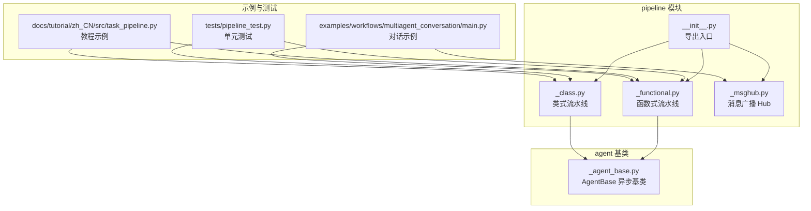
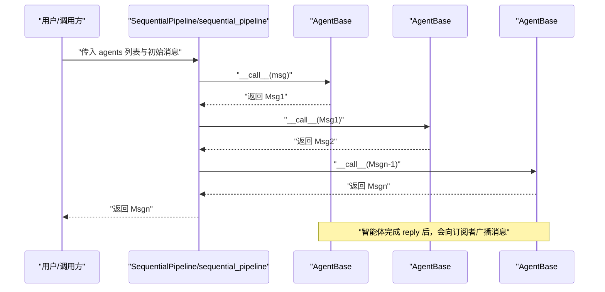
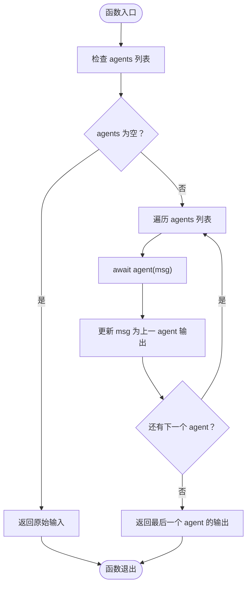
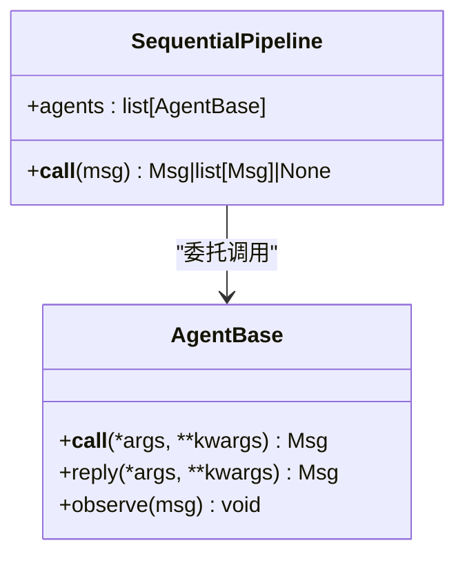
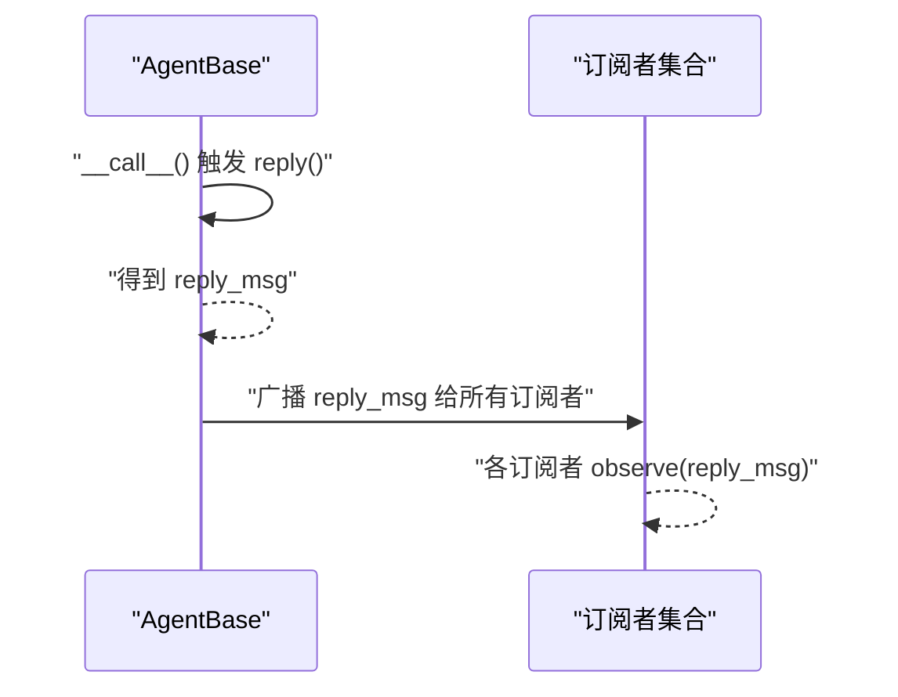
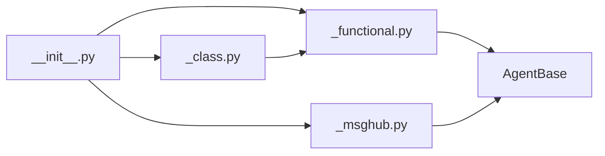

# 顺序工作流

<cite>
**本文引用的文件**
- [src/agentscope/pipeline/__init__.py](file://src/agentscope/pipeline/__init__.py)
- [src/agentscope/pipeline/_functional.py](file://src/agentscope/pipeline/_functional.py)
- [src/agentscope/pipeline/_class.py](file://src/agentscope/pipeline/_class.py)
- [src/agentscope/pipeline/_msghub.py](file://src/agentscope/pipeline/_msghub.py)
- [src/agentscope/agent/_agent_base.py](file://src/agentscope/agent/_agent_base.py)
- [tests/pipeline_test.py](file://tests/pipeline_test.py)
- [docs/tutorial/zh_CN/src/task_pipeline.py](file://docs/tutorial/zh_CN/src/task_pipeline.py)
- [examples/workflows/multiagent_conversation/main.py](file://examples/workflows/multiagent_conversation/main.py)
</cite>

## 目录
1. [简介](#简介)
2. [项目结构](#项目结构)
3. [核心组件](#核心组件)
4. [架构总览](#架构总览)
5. [详细组件分析](#详细组件分析)
6. [依赖关系分析](#依赖关系分析)
7. [性能考量](#性能考量)
8. [故障排查指南](#故障排查指南)
9. [结论](#结论)
10. [附录](#附录)

## 简介
本文件系统化阐述 AgentScope 中“顺序工作流”的实现与使用，重点覆盖两类顺序执行流水线：
- 函数式：sequential_pipeline
- 类式：SequentialPipeline

其核心原理是将前一个智能体的输出作为下一个智能体的输入，形成链式执行；并通过异步机制与消息传递实现高并发与低耦合。文档还提供多阶段处理流水线（如数据预处理→分析→生成报告）的实践思路，讨论空输入、空智能体列表、单智能体等边界场景，以及错误传播与执行延迟等性能问题，并通过测试用例验证行为特征。

## 项目结构
围绕顺序工作流的相关模块主要位于 pipeline 子包，配合 agent 基类与消息模型协同工作。

图表来源
- [src/agentscope/pipeline/__init__.py](file://src/agentscope/pipeline/__init__.py#L1-L21)
- [src/agentscope/pipeline/_functional.py](file://src/agentscope/pipeline/_functional.py#L1-L193)
- [src/agentscope/pipeline/_class.py](file://src/agentscope/pipeline/_class.py#L1-L91)
- [src/agentscope/pipeline/_msghub.py](file://src/agentscope/pipeline/_msghub.py#L1-L157)
- [src/agentscope/agent/_agent_base.py](file://src/agentscope/agent/_agent_base.py#L444-L463)
- [tests/pipeline_test.py](file://tests/pipeline_test.py#L1-L439)
- [docs/tutorial/zh_CN/src/task_pipeline.py](file://docs/tutorial/zh_CN/src/task_pipeline.py#L1-L284)
- [examples/workflows/multiagent_conversation/main.py](file://examples/workflows/multiagent_conversation/main.py#L1-L81)

章节来源
- [src/agentscope/pipeline/__init__.py](file://src/agentscope/pipeline/__init__.py#L1-L21)

## 核心组件
- 函数式顺序流水线：sequential_pipeline
  - 接收智能体列表与初始消息，按序调用每个智能体，前一智能体输出作为下一智能体输入，最终返回最后一个智能体的输出。
  - 支持 None 输入与空列表输入的边界处理。
- 类式顺序流水线：SequentialPipeline
  - 通过构造函数注入智能体列表，提供可复用的执行接口，内部委托给函数式实现。
- 消息传递与订阅：AgentBase
  - 智能体通过 __call__ 触发 reply，完成后向订阅者广播消息；顺序流水线在链式调用中天然形成“前一智能体输出即下一智能体输入”的消息传递。
- 流式消息捕获：stream_printing_messages
  - 在协程任务执行期间，启用消息队列捕获智能体 print 的中间消息，以异步生成器形式逐条产出，便于前端实时渲染。

章节来源
- [src/agentscope/pipeline/_functional.py](file://src/agentscope/pipeline/_functional.py#L10-L45)
- [src/agentscope/pipeline/_class.py](file://src/agentscope/pipeline/_class.py#L10-L41)
- [src/agentscope/agent/_agent_base.py](file://src/agentscope/agent/_agent_base.py#L444-L463)
- [src/agentscope/pipeline/_functional.py](file://src/agentscope/pipeline/_functional.py#L107-L193)

## 架构总览
顺序工作流的执行路径由“函数式/类式流水线”驱动，底层依赖智能体的异步调用与消息广播机制。

图表来源
- [src/agentscope/pipeline/_class.py](file://src/agentscope/pipeline/_class.py#L27-L41)
- [src/agentscope/pipeline/_functional.py](file://src/agentscope/pipeline/_functional.py#L10-L45)
- [src/agentscope/agent/_agent_base.py](file://src/agentscope/agent/_agent_base.py#L444-L463)

## 详细组件分析

### 函数式顺序流水线 sequential_pipeline
- 执行逻辑
  - 遍历 agents 列表，依次 await agent(msg)，并将上一个 agent 的返回值作为下一个 agent 的输入。
  - 若输入为 None，则直接返回 None；若 agents 为空，则返回原始输入（保持不变）。
- 异步与消息传递
  - 每次调用 agent(...) 均为异步，遵循 AgentBase 的 __call__ 行为：触发 reply，完成后向订阅者广播消息。
- 边界情况
  - 空 agents：返回原输入（保持引用与内容一致）。
  - None 输入：返回 None。
  - 单智能体：等价于直接调用该智能体一次。

图表来源
- [src/agentscope/pipeline/_functional.py](file://src/agentscope/pipeline/_functional.py#L10-L45)

章节来源
- [src/agentscope/pipeline/_functional.py](file://src/agentscope/pipeline/_functional.py#L10-L45)
- [tests/pipeline_test.py](file://tests/pipeline_test.py#L191-L223)
- [tests/pipeline_test.py](file://tests/pipeline_test.py#L224-L239)
- [tests/pipeline_test.py](file://tests/pipeline_test.py#L240-L264)

### 类式顺序流水线 SequentialPipeline
- 设计要点
  - 通过构造函数注入 agents 列表，提供可复用的执行接口。
  - __call__ 内部直接委托给函数式 sequential_pipeline，保持语义一致。
- 复用性优势
  - 可多次复用同一实例，仅替换输入消息即可重复执行相同顺序的智能体序列。

图表来源
- [src/agentscope/pipeline/_class.py](file://src/agentscope/pipeline/_class.py#L10-L41)
- [src/agentscope/agent/_agent_base.py](file://src/agentscope/agent/_agent_base.py#L444-L463)

章节来源
- [src/agentscope/pipeline/_class.py](file://src/agentscope/pipeline/_class.py#L10-L41)
- [tests/pipeline_test.py](file://tests/pipeline_test.py#L169-L189)

### 异步执行机制与消息传递
- 异步执行
  - sequential_pipeline 与 AgentBase 的 __call__ 均为异步，确保 I/O 密集型场景（如模型调用、工具调用）不阻塞事件循环。
- 消息传递
  - 智能体完成 reply 后，通过内部广播机制向订阅者 observe 消息，形成“前一智能体输出即下一智能体输入”的隐式传递。
- 订阅管理
  - MsgHub 提供自动广播能力，使智能体在群组内互相可见彼此的回复；也可手动广播或动态增删参与者。

图表来源
- [src/agentscope/agent/_agent_base.py](file://src/agentscope/agent/_agent_base.py#L444-L463)
- [src/agentscope/pipeline/_msghub.py](file://src/agentscope/pipeline/_msghub.py#L130-L157)

章节来源
- [src/agentscope/agent/_agent_base.py](file://src/agentscope/agent/_agent_base.py#L444-L463)
- [src/agentscope/pipeline/_msghub.py](file://src/agentscope/pipeline/_msghub.py#L1-L157)

### 多阶段处理流水线示例思路
- 数据预处理 → 分析 → 生成报告
  - 预处理智能体：清洗、标准化、抽取关键字段。
  - 分析智能体：统计、建模、打分或分类。
  - 报告生成智能体：格式化、可视化、摘要。
- 实践建议
  - 使用 sequential_pipeline 按顺序串联三阶段智能体。
  - 若需并发收集多方意见，可在分析阶段使用扇出流水线（见 fanout_pipeline），再将结果汇总到报告生成阶段。
  - 使用 stream_printing_messages 获取中间输出，便于前端实时展示进度与结果。

章节来源
- [docs/tutorial/zh_CN/src/task_pipeline.py](file://docs/tutorial/zh_CN/src/task_pipeline.py#L146-L173)
- [docs/tutorial/zh_CN/src/task_pipeline.py](file://docs/tutorial/zh_CN/src/task_pipeline.py#L175-L214)
- [docs/tutorial/zh_CN/src/task_pipeline.py](file://docs/tutorial/zh_CN/src/task_pipeline.py#L217-L247)
- [examples/workflows/multiagent_conversation/main.py](file://examples/workflows/multiagent_conversation/main.py#L38-L63)

### 边界情况处理
- 空输入（msg 为 None）
  - 函数式与类式顺序流水线均返回 None。
- 空智能体列表（agents 为空）
  - 返回原始输入（保持引用与内容一致）。
- 单智能体
  - 等价于直接调用该智能体一次。
- 错误传播
  - 任一智能体抛出异常将中断后续执行；若使用 stream_printing_messages 包裹协程任务，即使智能体先打印部分消息再抛错，也会在生成器结束后抛出异常。

章节来源
- [tests/pipeline_test.py](file://tests/pipeline_test.py#L191-L223)
- [tests/pipeline_test.py](file://tests/pipeline_test.py#L224-L239)
- [tests/pipeline_test.py](file://tests/pipeline_test.py#L240-L264)
- [src/agentscope/pipeline/_functional.py](file://src/agentscope/pipeline/_functional.py#L107-L193)

## 依赖关系分析
- 模块间依赖
  - __init__.py 导出顺序流水线、扇出流水线与消息流工具。
  - _class.py 依赖 _functional.py 的函数式实现。
  - _functional.py 依赖 AgentBase 与 Msg。
  - _msghub.py 依赖 AgentBase 与 Msg，用于广播与订阅。
- 耦合与内聚
  - 顺序流水线与类式流水线高度内聚，职责清晰；与 AgentBase 解耦，通过异步调用与消息广播实现松耦合。
- 循环依赖
  - 未发现循环导入；模块职责边界明确。

图表来源
- [src/agentscope/pipeline/__init__.py](file://src/agentscope/pipeline/__init__.py#L1-L21)
- [src/agentscope/pipeline/_class.py](file://src/agentscope/pipeline/_class.py#L1-L91)
- [src/agentscope/pipeline/_functional.py](file://src/agentscope/pipeline/_functional.py#L1-L193)
- [src/agentscope/pipeline/_msghub.py](file://src/agentscope/pipeline/_msghub.py#L1-L157)
- [src/agentscope/agent/_agent_base.py](file://src/agentscope/agent/_agent_base.py#L444-L463)

章节来源
- [src/agentscope/pipeline/__init__.py](file://src/agentscope/pipeline/__init__.py#L1-L21)
- [src/agentscope/pipeline/_class.py](file://src/agentscope/pipeline/_class.py#L1-L91)
- [src/agentscope/pipeline/_functional.py](file://src/agentscope/pipeline/_functional.py#L1-L193)
- [src/agentscope/pipeline/_msghub.py](file://src/agentscope/pipeline/_msghub.py#L1-L157)
- [src/agentscope/agent/_agent_base.py](file://src/agentscope/agent/_agent_base.py#L444-L463)

## 性能考量
- 并发与延迟
  - 顺序流水线本身串行执行，适合需要确定性与资源控制的场景；若某阶段 I/O 密集，可考虑在分析阶段使用扇出流水线并发执行，再汇总到报告生成阶段。
- 错误传播
  - 任一智能体异常会中断后续执行；在长链路中建议在上游智能体中进行必要的校验与降级策略，减少下游失败概率。
- 执行延迟
  - 顺序流水线的总延迟近似等于各阶段耗时之和；可通过并行化非依赖阶段、缓存中间结果等方式优化。
- 流式输出
  - 使用 stream_printing_messages 可以边生成边输出，降低首屏延迟，提升用户体验。

章节来源
- [src/agentscope/pipeline/_functional.py](file://src/agentscope/pipeline/_functional.py#L107-L193)
- [docs/tutorial/zh_CN/src/task_pipeline.py](file://docs/tutorial/zh_CN/src/task_pipeline.py#L205-L214)

## 故障排查指南
- 常见问题
  - 智能体未产生输出：检查智能体 reply 是否返回 Msg；确认 observe 是否被正确订阅。
  - 顺序中断：任一智能体抛错会导致后续阶段不执行；定位异常智能体并修复。
  - 流式消息异常：即使智能体先打印部分消息再抛错，stream_printing_messages 会在生成器结束后抛出异常；注意捕获并记录日志。
- 定位手段
  - 使用 tests/pipeline_test.py 中的断言与示例，复现边界场景（空 agents、None 输入、单智能体）。
  - 在示例工程中参考多智能体对话与消息广播的使用方式，验证订阅与广播链路。

章节来源
- [tests/pipeline_test.py](file://tests/pipeline_test.py#L150-L189)
- [tests/pipeline_test.py](file://tests/pipeline_test.py#L191-L264)
- [tests/pipeline_test.py](file://tests/pipeline_test.py#L379-L439)
- [examples/workflows/multiagent_conversation/main.py](file://examples/workflows/multiagent_conversation/main.py#L38-L81)

## 结论
顺序工作流通过函数式与类式两种形态，提供了简洁、可复用且易于扩展的多智能体链式执行能力。其异步与消息广播机制保证了高并发与低耦合，结合流式输出与订阅广播，能够满足从简单串行到复杂多阶段流水线的多样化需求。在生产环境中，应关注错误传播、执行延迟与资源控制，并通过测试用例与示例工程验证行为特征。

## 附录
- 快速上手
  - 函数式：sequential_pipeline([agent1, agent2, agent3], msg)
  - 类式：SequentialPipeline([agent1, agent2, agent3])(msg)
- 实战参考
  - 教程示例：顺序流水线与扇出流水线的对比与使用
  - 对话示例：结合 MsgHub 的多智能体协作与顺序执行

章节来源
- [docs/tutorial/zh_CN/src/task_pipeline.py](file://docs/tutorial/zh_CN/src/task_pipeline.py#L146-L173)
- [docs/tutorial/zh_CN/src/task_pipeline.py](file://docs/tutorial/zh_CN/src/task_pipeline.py#L175-L214)
- [examples/workflows/multiagent_conversation/main.py](file://examples/workflows/multiagent_conversation/main.py#L38-L81)