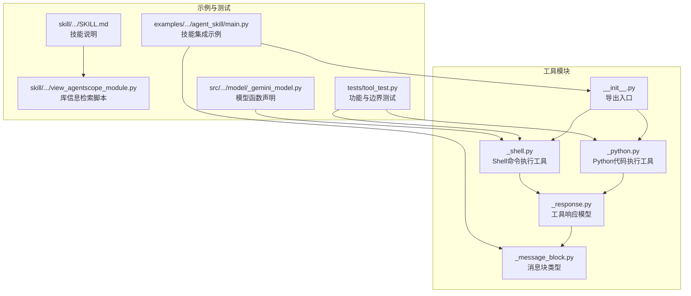
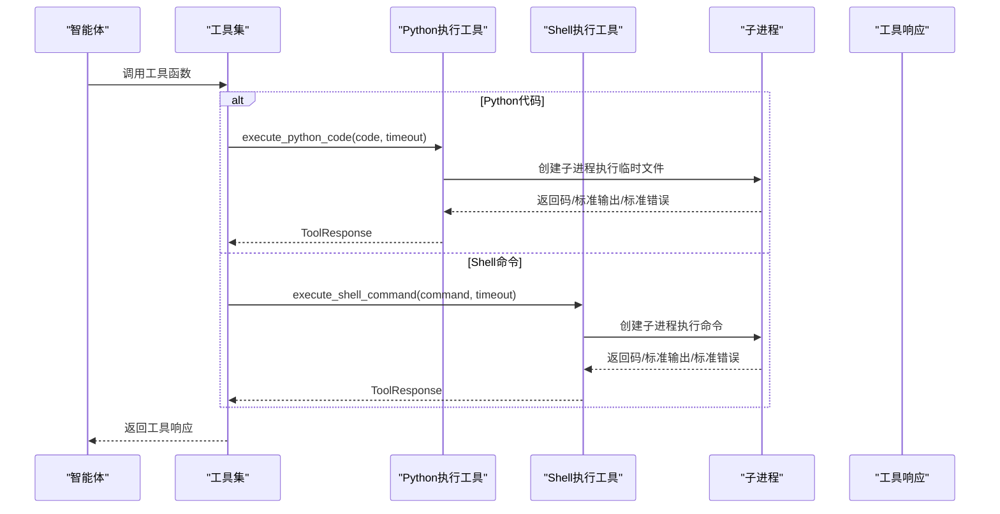
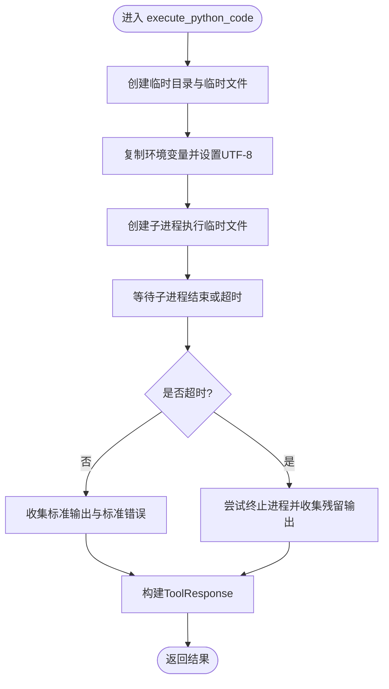
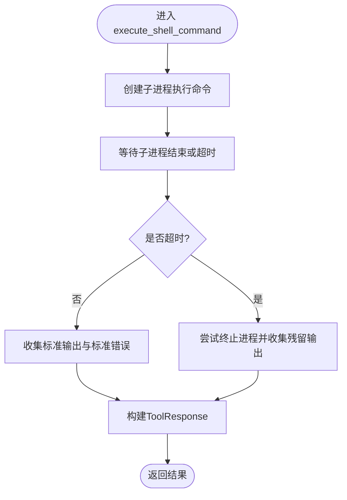
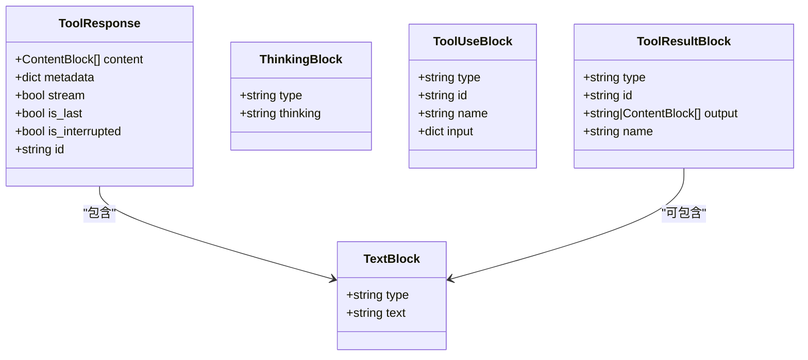
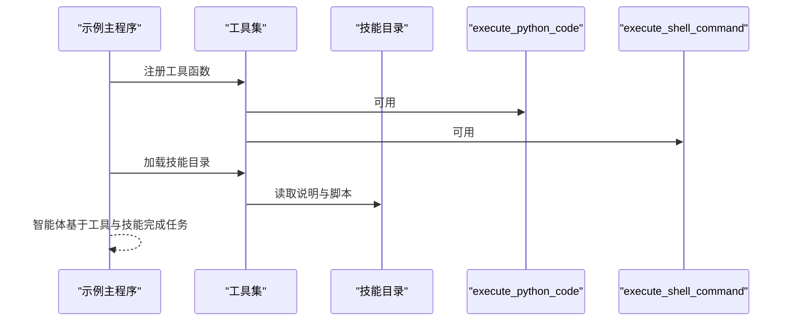
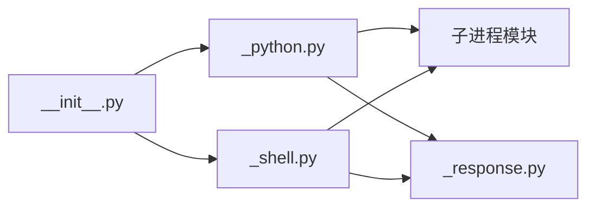

# 代码执行工具

<cite>
**本文引用的文件**
- [src/agentscope/tool/_coding/_python.py](file://src/agentscope/tool/_coding/_python.py)
- [src/agentscope/tool/_coding/_shell.py](file://src/agentscope/tool/_coding/_shell.py)
- [src/agentscope/tool/_response.py](file://src/agentscope/tool/_response.py)
- [src/agentscope/message/_message_block.py](file://src/agentscope/message/_message_block.py)
- [src/agentscope/tool/__init__.py](file://src/agentscope/tool/__init__.py)
- [examples/functionality/agent_skill/main.py](file://examples/functionality/agent_skill/main.py)
- [examples/functionality/agent_skill/skill/analyzing-agentscope-library/SKILL.md](file://examples/functionality/agent_skill/skill/analyzing-agentscope-library/SKILL.md)
- [examples/functionality/agent_skill/skill/analyzing-agentscope-library/view_agentscope_module.py](file://examples/functionality/agent_skill/skill/analyzing-agentscope-library/view_agentscope_module.py)
- [tests/tool_test.py](file://tests/tool_test.py)
- [src/agentscope/model/_gemini_model.py](file://src/agentscope/model/_gemini_model.py)
</cite>

## 目录
1. [简介](#简介)
2. [项目结构](#项目结构)
3. [核心组件](#核心组件)
4. [架构总览](#架构总览)
5. [详细组件分析](#详细组件分析)
6. [依赖关系分析](#依赖关系分析)
7. [性能考量](#性能考量)
8. [故障排查指南](#故障排查指南)
9. [结论](#结论)
10. [附录](#附录)

## 简介
本文件围绕代码执行工具进行系统化技术文档编写，重点解析：
- Python代码执行工具：沙箱环境、安全限制（如禁用危险内置函数）、执行上下文管理与结果捕获机制
- Shell命令执行工具：命令注入防护、权限控制、输出流处理与错误码映射
- 将代码工具集成到智能体技能中的实践范式
- 安全风险（如远程代码执行RCE）与缓解措施（输入验证、超时控制、资源限制）
- 自定义代码执行策略的扩展指南（语法高亮、执行日志记录、性能分析）

## 项目结构
与代码执行工具直接相关的核心文件位于工具子模块中，并在示例与测试中得到验证与演示。

图表来源
- [src/agentscope/tool/_coding/_python.py](file://src/agentscope/tool/_coding/_python.py#L1-L91)
- [src/agentscope/tool/_coding/_shell.py](file://src/agentscope/tool/_coding/_shell.py#L1-L78)
- [src/agentscope/tool/_response.py](file://src/agentscope/tool/_response.py#L1-L33)
- [src/agentscope/message/_message_block.py](file://src/agentscope/message/_message_block.py#L1-L127)
- [src/agentscope/tool/__init__.py](file://src/agentscope/tool/__init__.py#L1-L45)
- [examples/functionality/agent_skill/main.py](file://examples/functionality/agent_skill/main.py#L1-L80)
- [examples/functionality/agent_skill/skill/analyzing-agentscope-library/SKILL.md](file://examples/functionality/agent_skill/skill/analyzing-agentscope-library/SKILL.md#L1-L79)
- [examples/functionality/agent_skill/skill/analyzing-agentscope-library/view_agentscope_module.py](file://examples/functionality/agent_skill/skill/analyzing-agentscope-library/view_agentscope_module.py#L1-L307)
- [tests/tool_test.py](file://tests/tool_test.py#L49-L128)
- [src/agentscope/model/_gemini_model.py](file://src/agentscope/model/_gemini_model.py#L446-L480)

章节来源
- [src/agentscope/tool/_coding/_python.py](file://src/agentscope/tool/_coding/_python.py#L1-L91)
- [src/agentscope/tool/_coding/_shell.py](file://src/agentscope/tool/_coding/_shell.py#L1-L78)
- [src/agentscope/tool/_response.py](file://src/agentscope/tool/_response.py#L1-L33)
- [src/agentscope/message/_message_block.py](file://src/agentscope/message/_message_block.py#L1-L127)
- [src/agentscope/tool/__init__.py](file://src/agentscope/tool/__init__.py#L1-L45)
- [examples/functionality/agent_skill/main.py](file://examples/functionality/agent_skill/main.py#L1-L80)
- [examples/functionality/agent_skill/skill/analyzing-agentscope-library/SKILL.md](file://examples/functionality/agent_skill/skill/analyzing-agentscope-library/SKILL.md#L1-L79)
- [examples/functionality/agent_skill/skill/analyzing-agentscope-library/view_agentscope_module.py](file://examples/functionality/agent_skill/skill/analyzing-agentscope-library/view_agentscope_module.py#L1-L307)
- [tests/tool_test.py](file://tests/tool_test.py#L49-L128)
- [src/agentscope/model/_gemini_model.py](file://src/agentscope/model/_gemini_model.py#L446-L480)

## 核心组件
- Python代码执行工具：以临时文件与子进程方式运行用户代码，捕获返回码、标准输出与标准错误，支持超时控制与进程终止清理
- Shell命令执行工具：以子进程方式执行命令，捕获返回码、标准输出与标准错误，支持超时控制与进程终止清理
- 工具响应模型：统一的工具调用结果封装，便于上层智能体消费
- 消息块类型：文本、思考、工具调用与工具结果等多模态内容块的类型定义
- 导出入口：对外暴露工具函数与工具集

章节来源
- [src/agentscope/tool/_coding/_python.py](file://src/agentscope/tool/_coding/_python.py#L17-L91)
- [src/agentscope/tool/_coding/_shell.py](file://src/agentscope/tool/_coding/_shell.py#L12-L78)
- [src/agentscope/tool/_response.py](file://src/agentscope/tool/_response.py#L11-L33)
- [src/agentscope/message/_message_block.py](file://src/agentscope/message/_message_block.py#L9-L127)
- [src/agentscope/tool/__init__.py](file://src/agentscope/tool/__init__.py#L4-L18)

## 架构总览
下图展示了从智能体到工具执行再到结果返回的整体流程。

图表来源
- [src/agentscope/tool/_coding/_python.py](file://src/agentscope/tool/_coding/_python.py#L17-L91)
- [src/agentscope/tool/_coding/_shell.py](file://src/agentscope/tool/_coding/_shell.py#L12-L78)
- [src/agentscope/tool/_response.py](file://src/agentscope/tool/_response.py#L11-L33)

## 详细组件分析

### Python代码执行工具
- 沙箱环境与上下文管理
  - 使用临时目录存放待执行的Python文件，执行完成后自动清理
  - 复制当前环境变量并设置UTF-8编码，确保输出正确解码
  - 通过子进程执行，避免直接在当前进程中运行用户代码
- 安全限制
  - 未显式禁用危险内置函数；建议在生产环境中结合外部沙箱或容器隔离
- 执行与结果捕获
  - 子进程等待超时后触发异常处理，尝试终止进程并合并残留输出
  - 统一返回包含返回码、标准输出与标准错误的文本块
- 错误处理
  - 超时返回特殊返回码并追加超时提示
  - 异常栈信息随标准错误返回，便于定位问题

图表来源
- [src/agentscope/tool/_coding/_python.py](file://src/agentscope/tool/_coding/_python.py#L38-L90)

章节来源
- [src/agentscope/tool/_coding/_python.py](file://src/agentscope/tool/_coding/_python.py#L17-L91)
- [tests/tool_test.py](file://tests/tool_test.py#L49-L96)

### Shell命令执行工具
- 命令注入防护
  - 直接拼接命令字符串存在注入风险；建议在调用前对输入进行白名单校验或参数化
- 权限控制
  - 在当前用户权限下执行；建议通过系统级权限隔离与最小权限原则降低风险
- 输出流处理与错误码映射
  - 标准输出与标准错误分别捕获，返回码用于表示执行状态
- 超时与中断
  - 超时触发异常处理，尝试终止进程并合并残留输出

图表来源
- [src/agentscope/tool/_coding/_shell.py](file://src/agentscope/tool/_coding/_shell.py#L33-L77)

章节来源
- [src/agentscope/tool/_coding/_shell.py](file://src/agentscope/tool/_coding/_shell.py#L12-L78)
- [tests/tool_test.py](file://tests/tool_test.py#L98-L128)
- [src/agentscope/model/_gemini_model.py](file://src/agentscope/model/_gemini_model.py#L446-L480)

### 工具响应与消息块
- 工具响应模型
  - 统一封装内容、元数据、流式标记、是否中断、是否最后一条、唯一标识等字段
- 消息块类型
  - 文本、思考、图像、音频、视频、工具调用与工具结果等多模态内容块
  - 工具结果块支持字符串或内容块列表作为输出

图表来源
- [src/agentscope/tool/_response.py](file://src/agentscope/tool/_response.py#L11-L33)
- [src/agentscope/message/_message_block.py](file://src/agentscope/message/_message_block.py#L9-L127)

章节来源
- [src/agentscope/tool/_response.py](file://src/agentscope/tool/_response.py#L11-L33)
- [src/agentscope/message/_message_block.py](file://src/agentscope/message/_message_block.py#L1-L127)

### 智能体技能集成示例
- 示例入口
  - 在示例主程序中注册Python与Shell执行工具，并加载一个技能目录
- 技能说明
  - 技能目录包含说明文档与辅助脚本，用于检索AgentScope库信息
- 集成要点
  - 将工具函数注册到工具集，再由智能体使用工具集完成任务

图表来源
- [examples/functionality/agent_skill/main.py](file://examples/functionality/agent_skill/main.py#L19-L33)
- [examples/functionality/agent_skill/skill/analyzing-agentscope-library/SKILL.md](file://examples/functionality/agent_skill/skill/analyzing-agentscope-library/SKILL.md#L1-L79)
- [examples/functionality/agent_skill/skill/analyzing-agentscope-library/view_agentscope_module.py](file://examples/functionality/agent_skill/skill/analyzing-agentscope-library/view_agentscope_module.py#L201-L291)

章节来源
- [examples/functionality/agent_skill/main.py](file://examples/functionality/agent_skill/main.py#L1-L80)
- [examples/functionality/agent_skill/skill/analyzing-agentscope-library/SKILL.md](file://examples/functionality/agent_skill/skill/analyzing-agentscope-library/SKILL.md#L1-L79)
- [examples/functionality/agent_skill/skill/analyzing-agentscope-library/view_agentscope_module.py](file://examples/functionality/agent_skill/skill/analyzing-agentscope-library/view_agentscope_module.py#L1-L307)

## 依赖关系分析
- Python执行工具依赖
  - 子进程模块用于执行临时文件
  - 工具响应模型用于统一结果封装
- Shell执行工具依赖
  - 子进程模块用于执行命令
  - 工具响应模型用于统一结果封装
- 导出入口
  - 对外暴露工具函数与工具集

图表来源
- [src/agentscope/tool/_coding/_python.py](file://src/agentscope/tool/_coding/_python.py#L17-L91)
- [src/agentscope/tool/_coding/_shell.py](file://src/agentscope/tool/_coding/_shell.py#L12-L78)
- [src/agentscope/tool/_response.py](file://src/agentscope/tool/_response.py#L11-L33)
- [src/agentscope/tool/__init__.py](file://src/agentscope/tool/__init__.py#L4-L18)

章节来源
- [src/agentscope/tool/_coding/_python.py](file://src/agentscope/tool/_coding/_python.py#L17-L91)
- [src/agentscope/tool/_coding/_shell.py](file://src/agentscope/tool/_coding/_shell.py#L12-L78)
- [src/agentscope/tool/__init__.py](file://src/agentscope/tool/__init__.py#L4-L18)

## 性能考量
- 超时控制
  - 两种工具均支持超时参数，避免长时间阻塞
- I/O处理
  - 子进程以管道方式捕获输出，减少缓冲区占用
- 资源限制
  - 当前实现未显式设置CPU/内存/文件句柄等资源上限；建议结合系统级限制或容器化运行

[本节为通用指导，不直接分析具体文件]

## 故障排查指南
- 超时问题
  - Python工具：超时会返回特殊返回码并附加超时提示
  - Shell工具：超时同样会返回特殊返回码并附加超时提示
- 异常与错误栈
  - Python工具：异常栈信息随标准错误返回
  - Shell工具：非零返回码通常对应命令失败
- 测试参考
  - 单测覆盖了空输出、异常、超时等场景，可作为行为对照

章节来源
- [tests/tool_test.py](file://tests/tool_test.py#L49-L128)
- [src/agentscope/tool/_coding/_python.py](file://src/agentscope/tool/_coding/_python.py#L62-L90)
- [src/agentscope/tool/_coding/_shell.py](file://src/agentscope/tool/_coding/_shell.py#L47-L77)

## 结论
- Python与Shell执行工具提供了统一的异步执行接口与结果封装，具备超时控制与进程清理能力
- 在生产环境中应加强安全限制（如禁用危险内置函数、容器隔离）、完善输入验证与权限控制
- 通过工具集与技能目录的组合，可将代码执行工具无缝集成到智能体工作流中

[本节为总结性内容，不直接分析具体文件]

## 附录

### 安全风险与缓解措施
- 远程代码执行（RCE）
  - 风险：直接执行用户提供的代码或命令可能导致任意代码执行
  - 缓解：
    - 输入验证：对代码与命令进行白名单校验与参数化
    - 超时控制：限制执行时间，防止长时间阻塞
    - 资源限制：限制CPU、内存、文件句柄等资源使用
    - 沙箱/容器：在受限环境中执行，必要时使用容器或系统级沙箱
    - 最小权限：以最低权限运行，避免访问敏感资源

[本节为通用指导，不直接分析具体文件]

### 自定义扩展指南
- 语法高亮
  - 在工具结果中嵌入语言标签，便于前端渲染器进行高亮显示
- 执行日志记录
  - 在工具内部或上层代理处记录执行时间、输入摘要、返回码与关键错误信息
- 性能分析
  - 记录执行耗时、输出大小、异常次数等指标，定期评估与优化

[本节为通用指导，不直接分析具体文件]