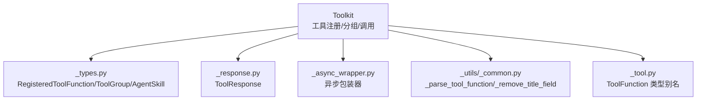
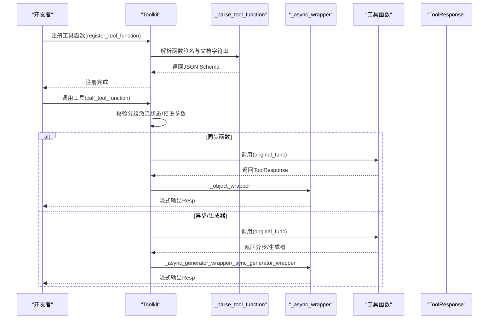
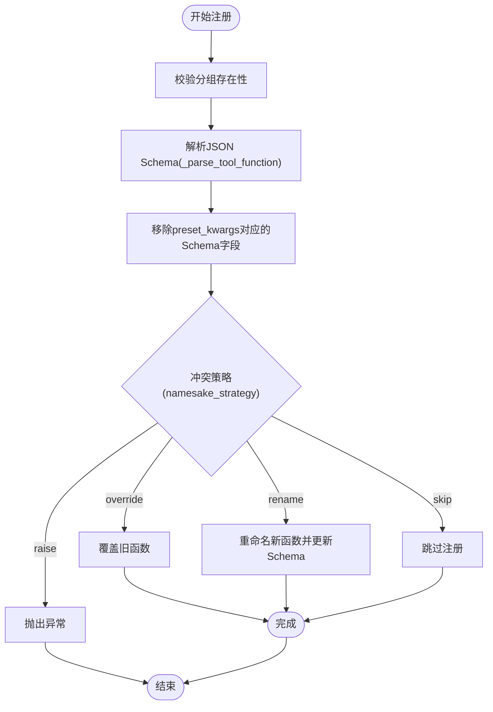
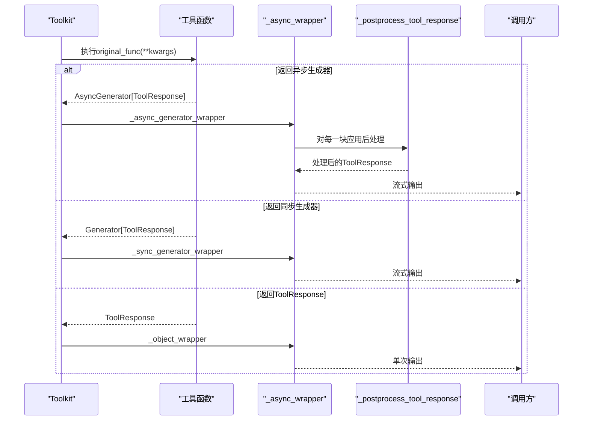
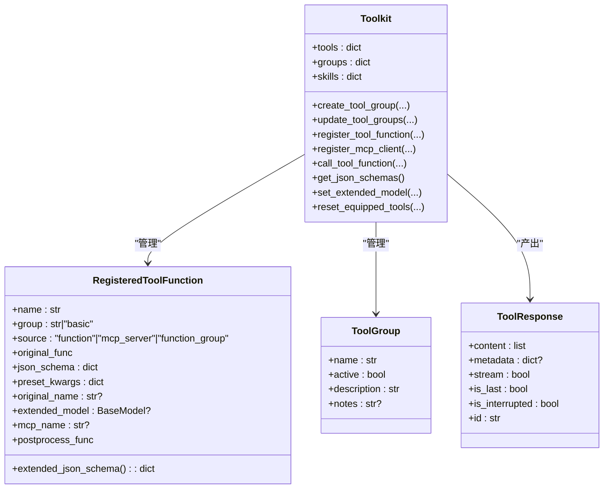
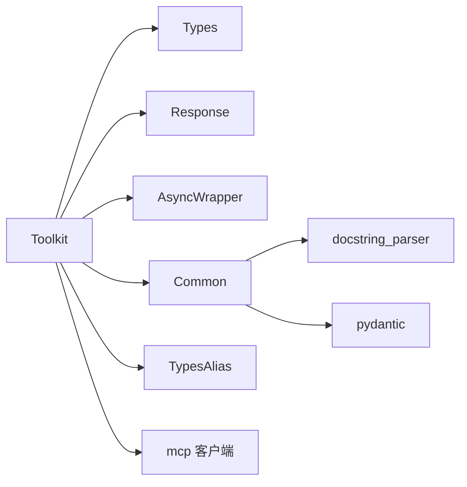

# 基础工具

<cite>
**本文引用的文件列表**
- [src/agentscope/tool/_toolkit.py](file://src/agentscope/tool/_toolkit.py)
- [src/agentscope/tool/_async_wrapper.py](file://src/agentscope/tool/_async_wrapper.py)
- [src/agentscope/tool/_response.py](file://src/agentscope/tool/_response.py)
- [src/agentscope/tool/_types.py](file://src/agentscope/tool/_types.py)
- [src/agentscope/types/_tool.py](file://src/agentscope/types/_tool.py)
- [src/agentscope/_utils/_common.py](file://src/agentscope/_utils/_common.py)
- [tests/toolkit_basic_test.py](file://tests/toolkit_basic_test.py)
- [tests/toolkit_meta_tool_test.py](file://tests/toolkit_meta_tool_test.py)
- [tests/mcp_sse_client_test.py](file://tests/mcp_sse_client_test.py)
</cite>

## 目录
1. [简介](#简介)
2. [项目结构](#项目结构)
3. [核心组件](#核心组件)
4. [架构总览](#架构总览)
5. [详细组件分析](#详细组件分析)
6. [依赖关系分析](#依赖关系分析)
7. [性能考量](#性能考量)
8. [故障排查指南](#故障排查指南)
9. [结论](#结论)
10. [附录](#附录)

## 简介
本文件系统化梳理 Agentscope 的“基础工具”模块，重点围绕 Toolkit 类的设计与实现，阐述其作为工具注册与管理核心的职责边界与运行机制。内容覆盖：
- 工具函数注册机制与 JSON Schema 自动生成
- 工具分组管理（创建、激活/停用、删除）
- 工具调用生命周期与统一流式接口
- 核心类型定义：ToolFunction、RegisteredToolFunction、ToolGroup、ToolResponse
- 异步包装器 _async_wrapper 的实现与中断处理
- 冲突处理策略 namesake_strategy 与预设参数 preset_kwargs 的安全设计
- 错误处理最佳实践与性能监控集成点

## 项目结构
基础工具模块位于 src/agentscope/tool 下，核心文件包括：
- _toolkit.py：Toolkit 类及工具生命周期管理
- _async_wrapper.py：统一异步/同步/生成器工具返回的包装器
- _response.py：工具响应数据结构 ToolResponse
- _types.py：RegisteredToolFunction、ToolGroup、AgentSkill 等类型
- _tool.py：ToolFunction 类型别名
- _utils/_common.py：工具函数签名解析、MCP 工具 Schema 提取、通用工具函数

图表来源
- [src/agentscope/tool/_toolkit.py](file://src/agentscope/tool/_toolkit.py#L1-L120)
- [src/agentscope/tool/_types.py](file://src/agentscope/tool/_types.py#L1-L60)
- [src/agentscope/tool/_response.py](file://src/agentscope/tool/_response.py#L1-L33)
- [src/agentscope/tool/_async_wrapper.py](file://src/agentscope/tool/_async_wrapper.py#L1-L110)
- [src/agentscope/_utils/_common.py](file://src/agentscope/_utils/_common.py#L315-L432)
- [src/agentscope/types/_tool.py](file://src/agentscope/types/_tool.py#L1-L37)

章节来源
- [src/agentscope/tool/_toolkit.py](file://src/agentscope/tool/_toolkit.py#L1-L120)
- [src/agentscope/tool/_types.py](file://src/agentscope/tool/_types.py#L1-L60)
- [src/agentscope/tool/_response.py](file://src/agentscope/tool/_response.py#L1-L33)
- [src/agentscope/tool/_async_wrapper.py](file://src/agentscope/tool/_async_wrapper.py#L1-L110)
- [src/agentscope/_utils/_common.py](file://src/agentscope/_utils/_common.py#L315-L432)
- [src/agentscope/types/_tool.py](file://src/agentscope/types/_tool.py#L1-L37)

## 核心组件
- Toolkit：工具注册与管理的核心容器，支持：
  - 工具函数注册（含 MCP 客户端工具）
  - 工具分组管理（创建、激活/停用、删除）
  - JSON Schema 动态扩展（基于 Pydantic BaseModel）
  - 统一的工具调用接口（支持同步、异步、生成器、流式）
- RegisteredToolFunction：封装已注册工具函数的元信息与行为
- ToolGroup：工具分组模型，包含名称、是否激活、描述与使用提示
- ToolResponse：工具调用结果块的数据结构
- _async_wrapper：将不同返回形态统一为异步生成器流式输出，并处理中断
- ToolFunction 类型别名：对工具函数签名的统一约束

章节来源
- [src/agentscope/tool/_toolkit.py](file://src/agentscope/tool/_toolkit.py#L55-L120)
- [src/agentscope/tool/_types.py](file://src/agentscope/tool/_types.py#L15-L129)
- [src/agentscope/tool/_response.py](file://src/agentscope/tool/_response.py#L11-L33)
- [src/agentscope/tool/_async_wrapper.py](file://src/agentscope/tool/_async_wrapper.py#L1-L110)
- [src/agentscope/types/_tool.py](file://src/agentscope/types/_tool.py#L1-L37)

## 架构总览
下图展示了 Toolkit 的核心交互：注册阶段将函数签名解析为 JSON Schema；调用阶段根据分组状态与预设参数组装实参，统一通过异步包装器输出流式响应。

图表来源
- [src/agentscope/tool/_toolkit.py](file://src/agentscope/tool/_toolkit.py#L206-L726)
- [src/agentscope/_utils/_common.py](file://src/agentscope/_utils/_common.py#L315-L432)
- [src/agentscope/tool/_async_wrapper.py](file://src/agentscope/tool/_async_wrapper.py#L38-L110)

章节来源
- [src/agentscope/tool/_toolkit.py](file://src/agentscope/tool/_toolkit.py#L206-L726)
- [src/agentscope/_utils/_common.py](file://src/agentscope/_utils/_common.py#L315-L432)
- [src/agentscope/tool/_async_wrapper.py](file://src/agentscope/tool/_async_wrapper.py#L38-L110)

## 详细组件分析

### Toolkit 类与工具注册机制
- 注册入口
  - register_tool_function：支持普通函数、partial 函数、MCPToolFunction；自动解析 JSON Schema；支持预设参数 preset_kwargs、后处理函数 postprocess_func、冲突策略 namesake_strategy
  - register_mcp_client：从 MCP 客户端批量注册工具函数，支持启用/禁用过滤、预设参数映射、冲突策略
- JSON Schema 自动生成
  - 使用 _parse_tool_function 基于函数签名与 docstring 生成参数 Schema，并移除 title 字段以避免误导
  - 支持手动传入 json_schema 进行覆盖校验
- 预设参数与安全设计
  - preset_kwargs 不暴露给 LLM，会从 JSON Schema 中剔除对应参数与 required 字段
  - 通过 extended_model 可动态扩展参数结构，合并 $defs 并进行冲突检测
- 分组管理
  - create_tool_group/update_tool_groups/remove_tool_groups：创建、激活/停用、删除工具分组
  - reset_equipped_tools：元工具，用于绝对设置所有分组状态，返回激活分组的使用说明
- 调用生命周期
  - call_tool_function：统一入口，按名称查找工具、检查分组激活、组装 kwargs、执行 original_func、包装为流式响应
  - 支持取消中断：异步生成器在被取消时追加中断信息并标记 is_interrupted/is_last

图表来源
- [src/agentscope/tool/_toolkit.py](file://src/agentscope/tool/_toolkit.py#L206-L443)
- [src/agentscope/_utils/_common.py](file://src/agentscope/_utils/_common.py#L315-L432)

章节来源
- [src/agentscope/tool/_toolkit.py](file://src/agentscope/tool/_toolkit.py#L119-L205)
- [src/agentscope/tool/_toolkit.py](file://src/agentscope/tool/_toolkit.py#L206-L443)
- [src/agentscope/tool/_toolkit.py](file://src/agentscope/tool/_toolkit.py#L444-L528)
- [src/agentscope/tool/_toolkit.py](file://src/agentscope/tool/_toolkit.py#L529-L556)
- [src/agentscope/tool/_toolkit.py](file://src/agentscope/tool/_toolkit.py#L557-L651)
- [src/agentscope/tool/_toolkit.py](file://src/agentscope/tool/_toolkit.py#L593-L726)
- [src/agentscope/_utils/_common.py](file://src/agentscope/_utils/_common.py#L315-L432)

### 异步包装器与统一调用接口
- _async_wrapper 提供三种包装器：
  - _object_wrapper：将 ToolResponse 包装为单次异步生成器
  - _sync_generator_wrapper：将同步生成器包装为异步生成器
  - _async_generator_wrapper：将异步生成器包装为异步生成器，并在取消时追加中断信息
- _postprocess_tool_response：对每个响应块执行后处理函数（可同步或异步），支持链式处理
- Toolkit 在 call_tool_function 中根据返回类型选择对应包装器，保证统一的流式输出语义

图表来源
- [src/agentscope/tool/_async_wrapper.py](file://src/agentscope/tool/_async_wrapper.py#L16-L110)
- [src/agentscope/tool/_toolkit.py](file://src/agentscope/tool/_toolkit.py#L672-L726)

章节来源
- [src/agentscope/tool/_async_wrapper.py](file://src/agentscope/tool/_async_wrapper.py#L16-L110)
- [src/agentscope/tool/_toolkit.py](file://src/agentscope/tool/_toolkit.py#L672-L726)

### ToolFunction、RegisteredToolFunction、ToolGroup、ToolResponse 类型定义
- ToolFunction：工具函数签名的统一约束，支持同步/异步/生成器/协程返回 ToolResponse 或其流式形式
- RegisteredToolFunction：封装工具函数的名称、分组、来源、原始函数、JSON Schema、预设参数、扩展模型、MCP 名称、后处理函数等
- ToolGroup：工具分组，包含名称、是否激活、描述与使用提示
- ToolResponse：工具调用结果块，包含内容、元数据、流式标记、是否最后一条、是否中断、唯一标识

图表来源
- [src/agentscope/tool/_toolkit.py](file://src/agentscope/tool/_toolkit.py#L55-L120)
- [src/agentscope/tool/_types.py](file://src/agentscope/tool/_types.py#L15-L129)
- [src/agentscope/tool/_response.py](file://src/agentscope/tool/_response.py#L11-L33)
- [src/agentscope/types/_tool.py](file://src/agentscope/types/_tool.py#L1-L37)

章节来源
- [src/agentscope/tool/_types.py](file://src/agentscope/tool/_types.py#L15-L129)
- [src/agentscope/tool/_response.py](file://src/agentscope/tool/_response.py#L11-L33)
- [src/agentscope/types/_tool.py](file://src/agentscope/types/_tool.py#L1-L37)

### 工具分组管理与元工具 reset_equipped_tools
- create_tool_group：创建工具分组，支持描述与使用提示
- update_tool_groups：批量激活/停用指定分组
- remove_tool_groups：删除分组并清理对应工具
- reset_equipped_tools：元工具，用于绝对设置所有分组状态，返回激活分组的使用说明；同时动态扩展其参数 Schema，将各分组描述作为布尔参数
- get_activated_notes：汇总激活分组的使用提示，便于注入系统提示

章节来源
- [src/agentscope/tool/_toolkit.py](file://src/agentscope/tool/_toolkit.py#L119-L205)
- [src/agentscope/tool/_toolkit.py](file://src/agentscope/tool/_toolkit.py#L466-L528)
- [src/agentscope/tool/_toolkit.py](file://src/agentscope/tool/_toolkit.py#L937-L999)
- [src/agentscope/tool/_toolkit.py](file://src/agentscope/tool/_toolkit.py#L919-L936)

### JSON Schema 自动生成功能
- _parse_tool_function：从函数签名与 docstring 生成参数 Schema，支持可变参数、可选参数、默认值、类型注解与参数描述
- _remove_title_field：递归移除 Schema 中的 title 字段，避免误导模型
- RegisteredToolFunction.extended_json_schema：合并扩展模型与原 Schema，处理字段冲突与 $defs 合并

章节来源
- [src/agentscope/_utils/_common.py](file://src/agentscope/_utils/_common.py#L315-L432)
- [src/agentscope/tool/_types.py](file://src/agentscope/tool/_types.py#L58-L129)

### 工具调用生命周期与错误处理
- call_tool_function：
  - 校验工具是否存在与分组是否激活
  - 组装 kwargs：preset_kwargs 与调用输入合并
  - 执行 original_func：区分同步/异步/生成器
  - 统一封装为异步生成器流式输出
  - 异常捕获：返回包含错误文本的 ToolResponse
  - 取消中断：异步生成器被取消时追加中断信息并标记 is_interrupted/is_last
- 后处理函数：支持同步或异步，可对每个响应块进行二次加工

章节来源
- [src/agentscope/tool/_toolkit.py](file://src/agentscope/tool/_toolkit.py#L593-L726)
- [src/agentscope/tool/_async_wrapper.py](file://src/agentscope/tool/_async_wrapper.py#L16-L110)

### 实际使用示例（基于测试）
以下示例路径展示了典型流程：
- 工具注册与调用
  - [tests/toolkit_basic_test.py](file://tests/toolkit_basic_test.py#L191-L333)：重复注册、冲突策略、预设参数、扩展模型、生成器与异步工具调用
- 元工具与分组激活
  - [tests/toolkit_meta_tool_test.py](file://tests/toolkit_meta_tool_test.py#L90-L276)：创建分组、注册工具、调用 reset_equipped_tools 激活/停用分组、验证可用工具与提示
- MCP 客户端工具注册
  - [tests/mcp_sse_client_test.py](file://tests/mcp_sse_client_test.py#L203-L374)：注册 MCP 工具、预设参数映射、调用工具与断言响应

章节来源
- [tests/toolkit_basic_test.py](file://tests/toolkit_basic_test.py#L191-L333)
- [tests/toolkit_meta_tool_test.py](file://tests/toolkit_meta_tool_test.py#L90-L276)
- [tests/mcp_sse_client_test.py](file://tests/mcp_sse_client_test.py#L203-L374)

## 依赖关系分析
- Toolkit 依赖：
  - _types：RegisteredToolFunction、ToolGroup、AgentSkill
  - _response：ToolResponse
  - _async_wrapper：统一异步/同步/生成器包装
  - _utils._common：_parse_tool_function、_remove_title_field、_extract_json_schema_from_mcp_tool
  - types._tool：ToolFunction 类型别名
- 耦合与内聚：
  - Toolkit 将注册、分组、调用、扩展模型等功能聚合，内聚度高
  - 通过包装器与工具函数签名约束降低外部耦合
- 外部依赖：
  - docstring_parser：解析函数 docstring
  - pydantic：动态模型与 JSON Schema 生成
  - mcp：MCP 客户端工具解析与调用

图表来源
- [src/agentscope/tool/_toolkit.py](file://src/agentscope/tool/_toolkit.py#L1-L120)
- [src/agentscope/_utils/_common.py](file://src/agentscope/_utils/_common.py#L1-L120)

章节来源
- [src/agentscope/tool/_toolkit.py](file://src/agentscope/tool/_toolkit.py#L1-L120)
- [src/agentscope/_utils/_common.py](file://src/agentscope/_utils/_common.py#L1-L120)

## 性能考量
- 流式输出：统一采用异步生成器，避免一次性累积大响应，降低内存峰值
- Schema 解析：仅在注册阶段解析一次，后续复用缓存结果
- 扩展模型合并：在需要时动态创建扩展模型，避免不必要的开销
- 异步执行：对异步/生成器工具直接透传，减少额外包装成本
- 日志与追踪：通过装饰器 trace_toolkit 记录调用轨迹，便于性能分析与问题定位

[本节为通用指导，不直接分析具体文件]

## 故障排查指南
- 工具未找到
  - 现象：调用时报错提示找不到函数
  - 排查：确认工具已注册且名称正确；检查分组是否激活
  - 参考：[src/agentscope/tool/_toolkit.py](file://src/agentscope/tool/_toolkit.py#L612-L626)
- 工具分组未激活
  - 现象：调用时报错提示工具处于非激活分组
  - 排查：调用 reset_equipped_tools 激活目标分组；查看 get_activated_notes 获取使用提示
  - 参考：[src/agentscope/tool/_toolkit.py](file://src/agentscope/tool/_toolkit.py#L631-L650)
- 冲突处理策略
  - raise：默认策略，遇到同名冲突直接报错
  - skip：跳过注册，保留旧函数
  - override：覆盖旧函数
  - rename：重命名新函数并更新 Schema
  - 参考：[src/agentscope/tool/_toolkit.py](file://src/agentscope/tool/_toolkit.py#L383-L443)
- 预设参数未生效
  - 现象：LLM 看到预设参数导致调用失败
  - 排查：preset_kwargs 会从 Schema 中剔除，确保只在内部使用
  - 参考：[src/agentscope/tool/_toolkit.py](file://src/agentscope/tool/_toolkit.py#L350-L370)
- 中断处理
  - 现象：用户中断异步生成器
  - 排查：包装器会在最后一条响应中追加中断信息并标记 is_interrupted/is_last
  - 参考：[src/agentscope/tool/_async_wrapper.py](file://src/agentscope/tool/_async_wrapper.py#L71-L110)
- 扩展模型冲突
  - 现象：扩展模型字段与原 Schema 冲突或 $defs 不一致
  - 排查：RegisteredToolFunction.extended_json_schema 会进行冲突检测并抛出异常
  - 参考：[src/agentscope/tool/_types.py](file://src/agentscope/tool/_types.py#L58-L129)

章节来源
- [src/agentscope/tool/_toolkit.py](file://src/agentscope/tool/_toolkit.py#L612-L650)
- [src/agentscope/tool/_toolkit.py](file://src/agentscope/tool/_toolkit.py#L350-L443)
- [src/agentscope/tool/_types.py](file://src/agentscope/tool/_types.py#L58-L129)
- [src/agentscope/tool/_async_wrapper.py](file://src/agentscope/tool/_async_wrapper.py#L71-L110)

## 结论
Toolkit 通过“注册即解析”的方式将函数签名与文档字符串转换为标准化 JSON Schema，并以统一的异步生成器接口对外输出，既保证了与 LLM 的兼容性，又提供了强大的扩展能力（分组、预设参数、扩展模型、后处理）。其内置的冲突处理策略与中断处理机制，使得在复杂场景下仍能保持稳定与可控。结合测试用例与源码分析，该模块在安全性、一致性与易用性方面达到了良好平衡。

[本节为总结性内容，不直接分析具体文件]

## 附录
- 关键 API 路径参考
  - 注册工具函数：[src/agentscope/tool/_toolkit.py](file://src/agentscope/tool/_toolkit.py#L206-L443)
  - 注册 MCP 工具：[src/agentscope/tool/_toolkit.py](file://src/agentscope/tool/_toolkit.py#L727-L866)
  - 获取 JSON Schema：[src/agentscope/tool/_toolkit.py](file://src/agentscope/tool/_toolkit.py#L466-L528)
  - 设置扩展模型：[src/agentscope/tool/_toolkit.py](file://src/agentscope/tool/_toolkit.py#L529-L556)
  - 调用工具：[src/agentscope/tool/_toolkit.py](file://src/agentscope/tool/_toolkit.py#L593-L726)
  - 异步包装器：[src/agentscope/tool/_async_wrapper.py](file://src/agentscope/tool/_async_wrapper.py#L16-L110)
  - 工具响应结构：[src/agentscope/tool/_response.py](file://src/agentscope/tool/_response.py#L11-L33)
  - 工具函数类型别名：[src/agentscope/types/_tool.py](file://src/agentscope/types/_tool.py#L1-L37)
  - Schema 解析与标题移除：[src/agentscope/_utils/_common.py](file://src/agentscope/_utils/_common.py#L315-L432)