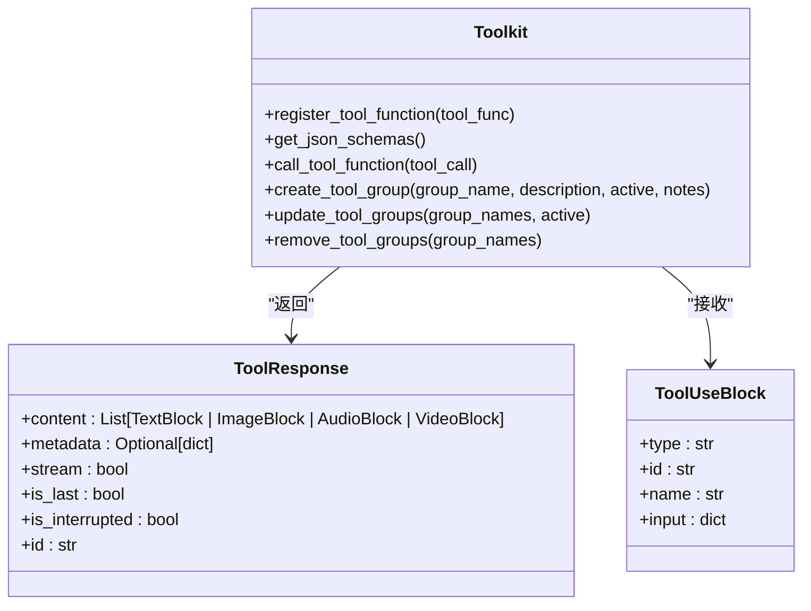
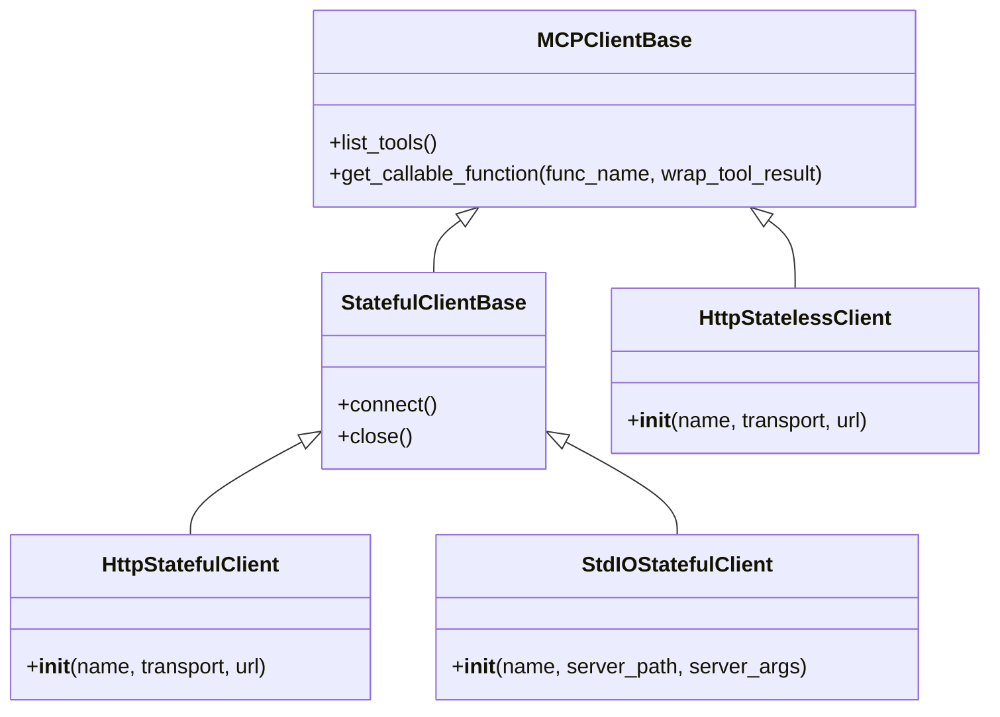

# 工具系统

<cite>
**本文档中引用的文件**   
- [__init__.py](file://src\agentscope\tool\__init__.py)
- [_toolkit.py](file://src\agentscope\tool\_toolkit.py)
- [_types.py](file://src\agentscope\tool\_types.py)
- [_response.py](file://src\agentscope\tool\_response.py)
- [_async_wrapper.py](file://src\agentscope\tool\_async_wrapper.py)
- [_python.py](file://src\agentscope\tool\_coding\_python.py)
- [_shell.py](file://src\agentscope\tool\_coding\_shell.py)
- [__init__.py](file://src\agentscope\mcp\__init__.py)
- [_mcp_function.py](file://src\agentscope\mcp\_mcp_function.py)
- [task_tool.py](file://docs\tutorial\zh_CN\src\task_tool.py)
- [task_mcp.py](file://docs\tutorial\zh_CN\src\task_mcp.py)
- [tool_test.py](file://tests\tool_test.py)
- [toolkit_basic_test.py](file://tests\toolkit_basic_test.py)
</cite>

## 目录
1. [引言](#引言)
2. [工具调用机制](#工具调用机制)
3. [代码执行工具](#代码执行工具)
4. [MCP工具集成](#mcp工具集成)
5. [自定义工具创建](#自定义工具创建)
6. [工具权限与沙箱](#工具权限与沙箱)
7. [工具链与自动化](#工具链与自动化)
8. [安全风险与缓解](#安全风险与缓解)
9. [性能监控与日志](#性能监控与日志)
10. [结论](#结论)

## 引言

AgentScope的工具系统是一个功能强大且灵活的框架，旨在为智能体提供丰富的外部能力。该系统通过`Toolkit`类为核心，实现了工具的注册、发现和执行流程，支持同步和异步工具函数，以及流式工具响应。工具系统不仅支持从文档字符串自动解析工具函数，还支持对工具JSON Schema的动态扩展，以及用户实时中断工具的执行。

工具系统的设计考虑了多种使用场景，包括代码执行、文件操作、网络请求等。通过内置的`execute_python_code`和`execute_shell_command`工具，智能体可以直接执行Python代码和Shell命令。同时，系统还支持MCP（Model Context Protocol）协议，允许智能体与外部服务进行交互。

本文档将全面介绍AgentScope工具系统的各个方面，包括工具调用机制、代码执行工具的实现原理、MCP工具的集成方式、自定义工具的创建方法、工具权限管理和沙箱执行的概念、工具链的构建和复杂任务的自动化、工具调用的安全风险和缓解策略，以及性能监控和调用日志的配置方法。

**Section sources**
- [task_tool.py](file://docs\tutorial\zh_CN\src\task_tool.py#L1-L458)
- [task_mcp.py](file://docs\tutorial\zh_CN\src\task_mcp.py#L1-L204)

## 工具调用机制

AgentScope的工具调用机制以`Toolkit`类为核心，负责管理工具函数的注册、发现和执行。`Toolkit`类提供了一套完整的API，用于注册工具函数、获取工具的JSON Schema、调用工具函数等。

### 工具注册与管理

工具函数的注册是通过`Toolkit`类的`register_tool_function`方法完成的。该方法接受一个工具函数作为参数，并将其注册到工具箱中。注册的工具函数需要返回一个`ToolResponse`对象或产生`ToolResponse`对象的生成器（可以是异步或同步）。工具函数的文档字符串用于自动解析其功能和参数。



**Diagram sources **
- [src\agentscope\tool\_toolkit.py](file://src\agentscope\tool\_toolkit.py#L55-L751)
- [src\agentscope\tool\_response.py](file://src\agentscope\tool\_response.py#L11-L33)
- [src\agentscope\message.py](file://src\agentscope\message.py#L1-L100)

### 工具发现与执行

工具的发现是通过`Toolkit`类的`get_json_schemas`方法完成的。该方法返回一个包含所有已注册工具函数的JSON Schema的列表。这些Schema可以用于智能体的决策过程，帮助智能体选择合适的工具来完成任务。

工具的执行是通过`Toolkit`类的`call_tool_function`方法完成的。该方法接受一个`ToolUseBlock`对象作为参数，该对象包含了要调用的工具函数的名称和输入参数。`call_tool_function`方法返回一个异步生成器，该生成器产生`ToolResponse`对象。

**Section sources**
- [src\agentscope\tool\_toolkit.py](file://src\agentscope\tool\_toolkit.py#L594-L725)
- [src\agentscope\tool\_response.py](file://src\agentscope\tool\_response.py#L11-L33)

## 代码执行工具

AgentScope提供了两个内置的代码执行工具：`execute_python_code`和`execute_shell_command`。这两个工具允许智能体执行Python代码和Shell命令，为智能体提供了强大的外部计算能力。

### Python代码执行

`execute_python_code`工具允许智能体执行Python代码。该工具通过创建一个临时文件，将代码写入该文件，然后使用`subprocess`模块执行该文件。执行结果包括返回码、标准输出和标准错误，这些信息被封装在`ToolResponse`对象中返回。

```python
async def execute_python_code(
    code: str,
    timeout: float = 300,
    **kwargs: Any,
) -> ToolResponse:
    """Execute the given python code in a temp file and capture the return
    code, standard output and error. Note you must `print` the output to get
    the result, and the tmp file will be removed right after the execution.

    Args:
        code (`str`):
            The Python code to be executed.
        timeout (`float`, defaults to `300`):
            The maximum time (in seconds) allowed for the code to run.

    Returns:
        `ToolResponse`:
            The response containing the return code, standard output, and
            standard error of the executed code.
    """
```

**Section sources**
- [src\agentscope\tool\_coding\_python.py](file://src\agentscope\tool\_coding\_python.py#L17-L91)
- [tests\tool_test.py](file://tests\tool_test.py#L30-L97)

### Shell命令执行

`execute_shell_command`工具允许智能体执行Shell命令。该工具通过`subprocess`模块执行命令，捕获返回码、标准输出和标准错误，并将这些信息封装在`ToolResponse`对象中返回。

```python
async def execute_shell_command(
    command: str,
    timeout: int = 300,
    **kwargs: Any,
) -> ToolResponse:
    """Execute given command and return the return code, standard output and
    error within <returncode></returncode>, <stdout></stdout> and
    <stderr></stderr> tags.

    Args:
        command (`str`):
            The shell command to execute.
        timeout (`float`, defaults to `300`):
            The maximum time (in seconds) allowed for the command to run.

    Returns:
        `ToolResponse`:
            The tool response containing the return code, standard output, and
            standard error of the executed command.
    """
```

**Section sources**
- [src\agentscope\tool\_coding\_shell.py](file://src\agentscope\tool\_coding\_shell.py#L12-L78)
- [tests\tool_test.py](file://tests\tool_test.py#L98-L153)

## MCP工具集成

MCP（Model Context Protocol）是一种允许智能体与外部服务进行交互的协议。AgentScope支持MCP协议，提供了对MCP工具的细粒度管理，包括MCP级别和函数级别的管理。

### MCP客户端

AgentScope提供了两种类型的MCP客户端：有状态和无状态。有状态客户端在其生命周期内维持与MCP服务器的持久会话，而无状态客户端在调用工具函数时创建新会话，并在工具函数调用完成后立即销毁会话。



**Diagram sources **
- [src\agentscope\mcp\__init__.py](file://src\agentscope\mcp\__init__.py#L5-L21)
- [src\agentscope\mcp\_client_base.py](file://src\agentscope\mcp\_client_base.py#L1-L100)
- [src\agentscope\mcp\_stateful_client_base.py](file://src\agentscope\mcp\_stateful_client_base.py#L1-L100)

### MCP工具管理

MCP工具的管理分为MCP级别和函数级别。MCP级别管理允许开发者将MCP服务器的所有工具一次性注册到`Toolkit`中，而函数级别管理允许开发者通过工具名从MCP客户端获取可调用的函数对象，进行更细粒度的控制。

```python
async def example_register_stateless_mcp() -> None:
    """注册无状态客户端 MCP 工具的示例。"""
    # 从 MCP 服务器注册所有工具
    await toolkit.register_mcp_client(
        stateless_client,
        # group_name="map_services",  # 可选的组名
    )

    print("注册的 MCP 工具总数：", len(toolkit.get_json_schemas()))

    maps_geo = next(
        tool
        for tool in toolkit.get_json_schemas()
        if tool["function"]["name"] == "maps_geo"
    )
    print("\n示例 ``maps_geo`` 函数：")
    print(
        json.dumps(
            maps_geo,
            indent=4,
            ensure_ascii=False,
        ),
    )
```

**Section sources**
- [src\agentscope\tool\_toolkit.py](file://src\agentscope\tool\_toolkit.py#L727-L787)
- [docs\tutorial\zh_CN\src\task_mcp.py](file://docs\tutorial\zh_CN\src\task_mcp.py#L104-L129)

## 自定义工具创建

创建自定义工具是扩展智能体能力的重要方式。AgentScope提供了简单而灵活的API，允许开发者创建自定义工具函数，并将其注册到`Toolkit`中。

### 装饰器使用

虽然AgentScope没有提供专门的装饰器来创建工具函数，但开发者可以通过`register_tool_function`方法将任何Python可调用对象注册为工具函数。工具函数的文档字符串用于自动解析其功能和参数。

```python
def my_search(query: str, api_key: str) -> ToolResponse:
    """一个简单的示例工具函数。

    Args:
        query (str):
            搜索查询。
        api_key (str):
            用于身份验证的 API 密钥。
    """
    return ToolResponse(
        content=[
            TextBlock(
                type="text",
                text=f"正在使用 API 密钥 '{api_key}' 搜索 '{query}'",
            ),
        ],
    )

toolkit = Toolkit()
toolkit.register_tool_function(my_search)
```

**Section sources**
- [docs\tutorial\zh_CN\src\task_tool.py](file://docs\tutorial\zh_CN\src\task_tool.py#L78-L95)
- [src\agentscope\tool\_toolkit.py](file://src\agentscope\tool\_toolkit.py#L206-L443)

### 参数验证和错误处理

工具函数的参数验证和错误处理是确保工具安全和可靠运行的重要环节。AgentScope通过`ToolResponse`对象的`content`字段返回错误信息，开发者可以在工具函数中捕获异常，并将错误信息封装在`ToolResponse`对象中返回。

```python
async def execute_python_code(
    code: str,
    timeout: float = 300,
    **kwargs: Any,
) -> ToolResponse:
    """Execute the given python code in a temp file and capture the return
    code, standard output and error. Note you must `print` the output to get
    the result, and the tmp file will be removed right after the execution.

    Args:
        code (`str`):
            The Python code to be executed.
        timeout (`float`, defaults to `300`):
            The maximum time (in seconds) allowed for the code to run.

    Returns:
        `ToolResponse`:
            The response containing the return code, standard output, and
            standard error of the executed code.
    """
    try:
        # 执行代码
        ...
    except asyncio.TimeoutError:
        # 处理超时错误
        ...
    except Exception as e:
        # 处理其他错误
        return ToolResponse(
            content=[
                TextBlock(
                    type="text",
                    text=f"Error: {e}",
                ),
            ],
        )
```

**Section sources**
- [src\agentscope\tool\_coding\_python.py](file://src\agentscope\tool\_coding\_python.py#L17-L91)
- [src\agentscope\tool\_coding\_shell.py](file://src\agentscope\tool\_coding\_shell.py#L12-L78)

## 工具权限与沙箱

工具权限管理和沙箱执行是确保智能体安全运行的重要机制。AgentScope通过工具组和元工具函数实现了工具的动态管理和权限控制。

### 工具组

工具组是一组相关工具函数的集合，例如浏览器使用工具、地图服务工具等。工具组有激活和非激活两种状态，只有工具组被激活，其中的工具函数才对智能体可见。通过`create_tool_group`方法创建工具组，通过`update_tool_groups`方法激活或停用工具组。

```python
toolkit.create_tool_group(
    group_name="browser_use",
    description="用于网页浏览的工具函数。",
    active=False,
    notes="""1. 使用 ``navigate`` 打开网页。
2. 当需要用户身份验证时，请向用户询问凭据
3. ...""",
)

toolkit.register_tool_function(navigate, group_name="browser_use")
toolkit.register_tool_function(click_element, group_name="browser_use")
```

**Section sources**
- [src\agentscope\tool\_toolkit.py](file://src\agentscope\tool\_toolkit.py#L119-L198)
- [docs\tutorial\zh_CN\src\task_tool.py](file://docs\tutorial\zh_CN\src\task_tool.py#L354-L366)

### 元工具函数

元工具函数`reset_equipped_tools`允许智能体调用该工具来决定要激活哪些工具组。该工具函数将所有组名（除了"basic"）作为一个bool型的参数，让智能体调用该工具来决定要激活哪些工具组。

```python
# 注册元工具函数
toolkit.register_tool_function(toolkit.reset_equipped_tools)

reset_equipped = next(
    tool
    for tool in toolkit.get_json_schemas()
    if tool["function"]["name"] == "reset_equipped_tools"
)
print("``reset_equipped_tools`` 函数的 JSON schema：")
print(
    json.dumps(
        reset_equipped,
        indent=4,
        ensure_ascii=False,
    ),
)
```

**Section sources**
- [src\agentscope\tool\_toolkit.py](file://src\agentscope\tool\_toolkit.py#L504-L527)
- [docs\tutorial\zh_CN\src\task_tool.py](file://docs\tutorial\zh_CN\src\task_tool.py#L391-L407)

## 工具链与自动化

工具链的构建和复杂任务的自动化是智能体系统的重要应用。通过组合多个工具函数，智能体可以完成复杂的任务，如数据分析、文件处理、网络爬虫等。

### 工具链构建

工具链的构建是通过将多个工具函数按顺序调用实现的。每个工具函数的输出作为下一个工具函数的输入，形成一个处理链。通过`Toolkit`类的`call_tool_function`方法，可以依次调用多个工具函数，实现复杂任务的自动化。

```python
async def example_tool_chain() -> None:
    """工具链示例。"""
    res = await toolkit.call_tool_function(
        ToolUseBlock(
            type="tool_use",
            id="123",
            name="my_search",
            input={"query": "AgentScope"},
        ),
    )
    async for tool_response in res:
        print(tool_response)

    res = await toolkit.call_tool_function(
        ToolUseBlock(
            type="tool_use",
            id="124",
            name="execute_python_code",
            input={"code": "print('Hello, World!')"},
        ),
    )
    async for tool_response in res:
        print(tool_response)
```

**Section sources**
- [docs\tutorial\zh_CN\src\task_tool.py](file://docs\tutorial\zh_CN\src\task_tool.py#L130-L147)
- [src\agentscope\tool\_toolkit.py](file://src\agentscope\tool\_toolkit.py#L594-L725)

## 安全风险与缓解

工具调用的安全风险是智能体系统设计中必须考虑的重要问题。AgentScope通过多种机制来缓解这些风险，包括代码执行的沙箱环境、工具权限管理、输入验证等。

### 代码执行安全

代码执行工具`execute_python_code`和`execute_shell_command`存在潜在的安全风险，如执行恶意代码、访问敏感文件等。为了缓解这些风险，AgentScope通过在临时目录中执行代码，并设置执行超时，限制了代码的执行环境和时间。

```python
with tempfile.TemporaryDirectory() as temp_dir:
    temp_file = os.path.join(temp_dir, f"tmp_{shortuuid.uuid()}.py")
    with open(temp_file, "w", encoding="utf-8") as f:
        f.write(code)

    env = os.environ.copy()
    env["PYTHONUTF8"] = "1"
    env["PYTHONIOENCODING"] = "utf-8"
    proc = await asyncio.create_subprocess_exec(
        sys.executable,
        "-u",
        temp_file,
        stdout=asyncio.subprocess.PIPE,
        stderr=asyncio.subprocess.PIPE,
        env=env,
    )

    try:
        await asyncio.wait_for(proc.wait(), timeout=timeout)
        stdout, stderr = await proc.communicate()
        stdout_str = stdout.decode("utf-8")
        stderr_str = stderr.decode("utf-8")
        returncode = proc.returncode
    except asyncio.TimeoutError:
        # 处理超时错误
        ...
```

**Section sources**
- [src\agentscope\tool\_coding\_python.py](file://src\agentscope\tool\_coding\_python.py#L38-L80)
- [src\agentscope\tool\_coding\_shell.py](file://src\agentscope\tool\_coding\_shell.py#L33-L65)

### 输入验证

输入验证是防止恶意输入的重要手段。AgentScope通过`ToolResponse`对象的`content`字段返回错误信息，开发者可以在工具函数中验证输入参数，确保其符合预期。

```python
async def view_text_file(file_path: str, ranges: list[int] | None = None) -> ToolResponse:
    """View the content of a text file.

    Args:
        file_path (`str`):
            The path of the file to be viewed.
        ranges (`list[int] | None`, optional):
            The line ranges to be viewed, e.g. [3, 5] means viewing lines 3 to 5.
            If not provided, the whole file will be viewed.

    Returns:
        `ToolResponse`:
            The response containing the content of the file.
    """
    if not os.path.exists(file_path):
        return ToolResponse(
            content=[
                TextBlock(
                    type="text",
                    text=f"Error: The file {file_path} does not exist.",
                ),
            ],
        )
    if not os.path.isfile(file_path):
        return ToolResponse(
            content=[
                TextBlock(
                    type="text",
                    text=f"Error: The path {file_path} is not a file.",
                ),
            ],
        )
    ...
```

**Section sources**
- [src\agentscope\tool\_text_file\_view_text_file.py](file://src\agentscope\tool\_text_file\_view_text_file.py#L1-L100)
- [tests\tool_test.py](file://tests\tool_test.py#L155-L193)

## 性能监控与日志

性能监控和调用日志是确保智能体系统稳定运行的重要手段。AgentScope通过`tracing`模块提供了性能监控和调用日志的功能。

### 性能监控

性能监控通过`tracing`模块的`trace_toolkit`装饰器实现。该装饰器可以记录工具函数的调用时间、输入参数、输出结果等信息，帮助开发者分析工具函数的性能。

```python
from agentscope.tracing._trace import trace_toolkit

@trace_toolkit
async def call_tool_function(
    self,
    tool_call: ToolUseBlock,
) -> AsyncGenerator[ToolResponse, None]:
    """Execute the tool function by the `ToolUseBlock` and return the
    tool response chunk in unified streaming mode, i.e. an async
    generator of `ToolResponse` objects.

    .. note:: The tool response chunk is **accumulated**.

    Args:
        tool_call (`ToolUseBlock`):
            A tool call block.

    Yields:
        `ToolResponse`:
            The tool response chunk, in accumulative manner.
    """
    ...
```

**Section sources**
- [src\agentscope\tool\_toolkit.py](file://src\agentscope\tool\_toolkit.py#L593-L725)
- [src\agentscope\tracing\_trace.py](file://src\agentscope\tracing\_trace.py#L1-L100)

### 调用日志

调用日志通过`logger`模块实现。`Toolkit`类中的`logger`对象用于记录工具函数的调用信息，包括注册、调用、错误等。

```python
from agentscope._logging import logger

class Toolkit(StateModule):
    """Toolkit is the core module to register, manage and delete tool
    functions, MCP clients, Agent skills in AgentScope.

    About tool functions:

    - Register and parse JSON schemas from their docstrings automatically.
    - Group-wise tools management, and agentic tools activation/deactivation.
    - Extend the tool function JSON schema dynamically with Pydantic BaseModel.
    - Tool function execution with unified streaming interface.

    About MCP clients:

    - Register tool functions from MCP clients directly.
    - Client-level tool functions removal.

    About Agent skills:

    - Register agent skills from the given directory.
    - Provide prompt for the registered skills to the agent.
    """

    def register_tool_function(
        self,
        tool_func: ToolFunction,
        group_name: str | Literal["basic"] = "basic",
        preset_kwargs: dict[str, JSONSerializableObject] | None = None,
        func_description: str | None = None,
        json_schema: dict | None = None,
        include_long_description: bool = True,
        include_var_positional: bool = False,
        include_var_keyword: False,
        postprocess_func: (
            Callable[
                [ToolUseBlock, ToolResponse],
                ToolResponse | None,
            ]
            | Callable[
                [ToolUseBlock, ToolResponse],
                Awaitable[ToolResponse | None],
            ]
        )
        | None = None,
        namesake_strategy: Literal[
            "override",
            "skip",
            "raise",
            "rename",
        ] = "raise",
    ) -> None:
        """Register a tool function to the toolkit.

        Args:
            tool_func (`ToolFunction`):
                The tool function, which can be async or sync, streaming or
                not-streaming, but the response must be a `ToolResponse`
                object.
            group_name (`str | Literal["basic"]`, defaults to `"basic"`):
                The belonging group of the tool function. Tools in "basic"
                group is always included in the JSON schema, while the others
                are only included when their group is active.
            preset_kwargs (`dict[str, JSONSerializableObject] | None`, \
            optional):
                Preset arguments by the user, which will not be included in
                the JSON schema, nor exposed to the agent.
            func_description (`str | None`, optional):
                The function description. If not provided, the description
                will be extracted from the docstring automatically.
            json_schema (`dict | None`, optional):
                Manually provided JSON schema for the tool function, which
                should be `{"type": "function", "function": {"name":
                "function_name": "xx", "description": "xx",
                "parameters": {...}}}`
            include_long_description (`bool`, defaults to `True`):
                When extracting function description from the docstring, if
                the long description will be included.
            include_var_positional (`bool`, defaults to `False`):
                Whether to include the variable positional arguments (`*args`)
                in the function schema.
            include_var_keyword (`bool`, defaults to `False`):
                Whether to include the variable keyword arguments (`**kwargs`)
                in the function schema.
            postprocess_func (`(Callable[[ToolUseBlock, ToolResponse], \
            ToolResponse | None] | Callable[[ToolUseBlock, ToolResponse], \
            Awaitable[ToolResponse | None]]) | None`, optional):
                A post-processing function that will be called after the tool
                function is executed, taking the tool call block and tool
                response as arguments. The function can be either sync or
                async. If it returns `None`, the tool result will be
                returned as is. If it returns a `ToolResponse`,
                the returned block will be used as the final tool result.
            namesake_strategy (`Literal['raise', 'override', 'skip', \
            'rename']`, defaults to `'raise'`):
                The strategy to handle the tool function name conflict:
                - 'raise': raise a ValueError (default behavior).
                - 'override': override the existing tool function with the new
                  one.
                - 'skip': skip the registration of the new tool function.
                - 'rename': rename the new tool function by appending a random
                  suffix to make it unique.
        """
        # Arguments checking
        if group_name not in self.groups and group_name != "basic":
            raise ValueError(
                f"Tool group '{group_name}' not found.",
            )

        # Check the manually provided JSON schema if provided
        if json_schema:
            assert (
                isinstance(json_schema, dict)
                and "type" in json_schema
                and json_schema["type"] == "function"
                and "function" in json_schema
                and isinstance(json_schema["function"], dict)
            ), "Invalid JSON schema for the tool function."

        # Handle MCP tool function and regular function respectively
        mcp_name = None
        if isinstance(tool_func, MCPToolFunction):
            func_name = tool_func.name
            original_func = tool_func.__call__
            json_schema = json_schema or tool_func.json_schema
            mcp_name = tool_func.mcp_name

        elif isinstance(tool_func, partial):
            # partial function
            kwargs = tool_func.keywords
            # Turn args into keyword arguments
            if tool_func.args:
                param_names = list(
                    inspect.signature(tool_func.func).parameters.keys(),
                )
                for i, arg in enumerate(tool_func.args):
                    if i < len(param_names):
                        kwargs[param_names[i]] = arg

            preset_kwargs = {
                **kwargs,
                **(preset_kwargs or {}),
            }

            func_name = tool_func.func.__name__
            original_func = tool_func.func
            json_schema = json_schema or _parse_tool_function(
                tool_func.func,
                include_long_description=include_long_description,
                include_var_positional=include_var_positional,
                include_var_keyword=include_var_keyword,
            )

        else:
            # normal function
            func_name = tool_func.__name__
            original_func = tool_func
            json_schema = json_schema or _parse_tool_function(
                tool_func,
                include_long_description=include_long_description,
                include_var_positional=include_var_positional,
                include_var_keyword=include_var_keyword,
            )

        # Override the description if provided
        if func_description:
            json_schema["function"]["description"] = func_description

        # Remove the preset kwargs from the JSON schema
        for arg_name in preset_kwargs or {}:
            if arg_name in json_schema["function"]["parameters"]["properties"]:
                json_schema["function"]["parameters"]["properties"].pop(
                    arg_name,
                )

        if "required" in json_schema["function"]["parameters"]:
            for arg_name in preset_kwargs or {}:
                if (
                    arg_name
                    in json_schema["function"]["parameters"]["required"]
                ):
                    json_schema["function"]["parameters"]["required"].remove(
                        arg_name,
                    )

            # Remove the required field if it is empty
            if len(json_schema["function"]["parameters"]["required"]) == 0:
                json_schema["function"]["parameters"].pop("required", None)

        func_obj = RegisteredToolFunction(
            name=func_name,
            group=group_name,
            source="function",
            original_func=original_func,
            json_schema=json_schema,
            preset_kwargs=preset_kwargs or {},
            extended_model=None,
            mcp_name=mcp_name,
            postprocess_func=postprocess_func,
        )

        if func_name in self.tools:
            if namesake_strategy == "raise":
                raise ValueError(
                    f"A function with name '{func_name}' is already "
                    f"registered in the toolkit.",
                )

            if namesake_strategy == "skip":
                logger.warning(
                    "A function with name '%s' is already "
                    "registered in the toolkit. Skipping registration.",
                    func_name,
                )

            elif namesake_strategy == "override":
                logger.warning(
                    "A function with name '%s' is already registered "
                    "in the toolkit. Overriding with the new function.",
                    func_name,
                )
                self.tools[func_name] = func_obj

            elif namesake_strategy == "rename":
                new_func_name = func_name
                for _ in range(100):
                    suffix = shortuuid.uuid()[:5]
                    new_func_name = f"{func_name}_{suffix}"
                    if new_func_name not in self.tools:
                        break

                # Raise error if failed to find a unique name
                if new_func_name in self.tools:
                    raise RuntimeError(
                        f"Failed to register tool function '{func_name}' with "
                        "a unique name after 100 attempts.",
                    )
                logger.warning(
                    "A function with name '%s' is already "
                    "registered in the toolkit. Renaming the new function to "
                    "'%s'.",
                    func_name,
                    new_func_name,
                )

                # Replace the function name with the new one
                func_obj.original_name = func_name
                func_obj.name = new_func_name
                func_obj.json_schema["function"]["name"] = new_func_name

                self.tools[new_func_name] = func_obj

            else:
                raise ValueError(
                    f"Invalid namesake_strategy: {namesake_strategy}. "
                    "Supported strategies are 'raise', 'override', 'skip', "
                    "and 'rename'.",
                )

        else:
            self.tools[func_name] = func_obj
```

**Section sources**
- [src\agentscope\tool\_toolkit.py](file://src\agentscope\tool\_toolkit.py#L1-L1127)
- [src\agentscope\_logging.py](file://src\agentscope\_logging.py#L1-L100)

## 结论

AgentScope的工具系统提供了一套完整而灵活的机制，用于管理智能体的外部能力。通过`Toolkit`类，开发者可以轻松地注册、发现和执行工具函数，支持同步和异步工具函数，以及流式工具响应。系统内置的代码执行工具和MCP协议支持，为智能体提供了强大的外部计算和交互能力。

通过工具组和元工具函数，系统实现了工具的动态管理和权限控制，确保了智能体的安全运行。同时，系统还提供了性能监控和调用日志的功能，帮助开发者分析和优化工具函数的性能。

总之，AgentScope的工具系统是一个功能强大且易于使用的框架，为智能体系统的开发和应用提供了坚实的基础。