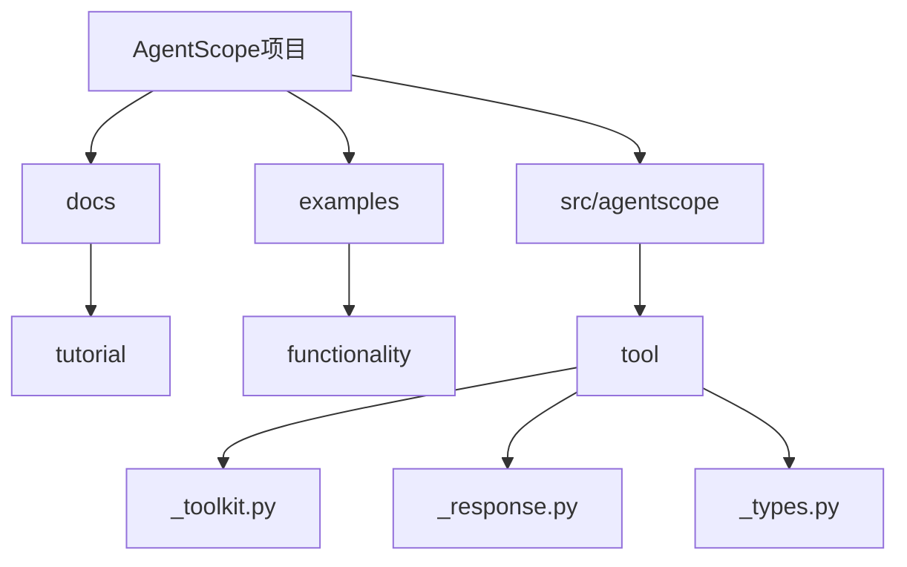
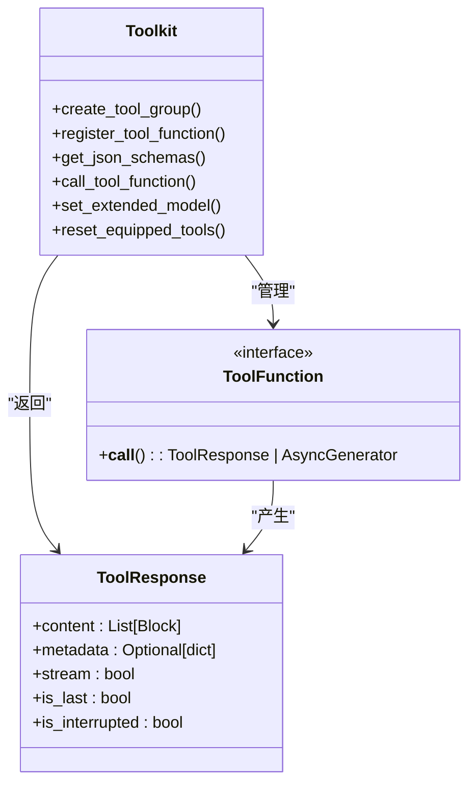
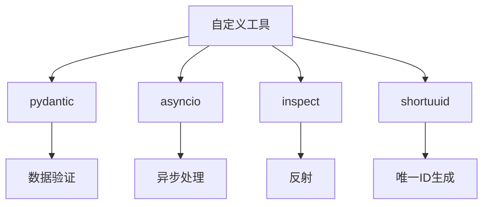

# 自定义工具创建

<cite>
**本文档中引用的文件**  
- [task_tool.py](file://docs/tutorial/zh_CN/src/task_tool.py)
- [task_agent_skill.py](file://docs/tutorial/zh_CN/src/task_agent_skill.py)
- [main.py](file://examples/functionality/agent_skill/main.py)
- [view_agentscope_module.py](file://examples/functionality/agent_skill/skill/analyzing-agentscope-library/view_agentscope_module.py)
- [SKILL.md](file://examples/functionality/agent_skill/skill/analyzing-agentscope-library/SKILL.md)
- [_toolkit.py](file://src/agentscope/tool/_toolkit.py)
- [_response.py](file://src/agentscope/tool/_response.py)
- [_types.py](file://src/agentscope/types/_tool.py)
</cite>

## 目录
1. [简介](#简介)
2. [项目结构](#项目结构)
3. [核心组件](#核心组件)
4. [架构概述](#架构概述)
5. [详细组件分析](#详细组件分析)
6. [依赖分析](#依赖分析)
7. [性能考虑](#性能考虑)
8. [故障排除指南](#故障排除指南)
9. [结论](#结论)

## 简介
本文档详细介绍了在AgentScope框架中创建自定义工具的完整流程。涵盖了从基础工具函数的创建到高级功能的使用，包括动态扩展工具参数模型、调用后处理、工具组的动态激活/停用等。通过结合`task_tool.py`教程示例和`agent_skill`示例，全面展示了如何开发和管理智能体工具。

## 项目结构
AgentScope项目结构清晰，主要分为文档、示例和源代码三个部分。工具相关的核心代码位于`src/agentscope/tool`目录下，而教程和示例则分别位于`docs/tutorial`和`examples`目录中。



**图示来源**
- [task_tool.py](file://docs/tutorial/zh_CN/src/task_tool.py)
- [_toolkit.py](file://src/agentscope/tool/_toolkit.py)

**本节来源**
- [task_tool.py](file://docs/tutorial/zh_CN/src/task_tool.py)
- [project_structure](file://project_structure)

## 核心组件
自定义工具创建的核心组件包括`Toolkit`类、`ToolResponse`类和工具函数的注册机制。`Toolkit`是管理工具函数的核心模块，负责工具的注册、执行和生命周期管理。

**本节来源**
- [_toolkit.py](file://src/agentscope/tool/_toolkit.py)
- [_response.py](file://src/agentscope/tool/_response.py)
- [task_tool.py](file://docs/tutorial/zh_CN/src/task_tool.py)

## 架构概述
AgentScope的工具系统采用模块化设计，通过`Toolkit`类统一管理所有工具函数。工具函数可以是同步或异步的，支持流式响应，并可以通过预设参数、动态扩展模型等方式进行高级配置。



**图示来源**
- [_toolkit.py](file://src/agentscope/tool/_toolkit.py)
- [_response.py](file://src/agentscope/tool/_response.py)

## 详细组件分析

### 基础工具创建
创建自定义工具的第一步是定义工具函数。工具函数必须返回`ToolResponse`对象或产生`ToolResponse`对象的生成器（同步或异步）。工具函数的docstring必须遵循OpenAI规范，以便自动生成JSON Schema。

```python
def my_search(query: str, api_key: str) -> ToolResponse:
    """一个简单的示例工具函数。

    Args:
        query (str):
            搜索查询。
        api_key (str):
            用于身份验证的API密钥。
    """
    return ToolResponse(
        content=[
            TextBlock(
                type="text",
                text=f"正在使用API密钥'{api_key}'搜索'{query}'",
            ),
        ],
    )
```

**本节来源**
- [task_tool.py](file://docs/tutorial/zh_CN/src/task_tool_tool.py)
- [_toolkit.py](file://src/agentscope/tool/_toolkit.py)

### 工具注册与管理
使用`Toolkit`类的`register_tool_function`方法注册工具函数。可以为工具函数预设参数，这些参数不会出现在JSON Schema中，但在调用时会自动传递。

```python
toolkit = Toolkit()
toolkit.register_tool_function(my_search, preset_kwargs={"api_key": "xxx"})
```

**本节来源**
- [task_tool.py](file://docs/tutorial/zh_CN/src/task_tool.py)
- [_toolkit.py](file://src/agentscope/tool/_toolkit.py)

### 动态扩展参数模型
通过`set_extended_model`方法可以动态扩展工具函数的JSON Schema。这对于实现思维链（CoT）推理等高级功能非常有用。

```python
class ThinkingModel(BaseModel):
    thinking: str = Field(
        description="总结当前状态并决定下一步做什么。"
    )

toolkit.set_extended_model("my_search", ThinkingModel)
```

**本节来源**
- [task_tool.py](file://docs/tutorial/zh_CN/src/task_tool.py)
- [_toolkit.py](file://src/agentscope/tool/_toolkit.py)

### 调用后处理
通过`postprocess_func`参数可以为工具函数设置调用后处理函数。后处理函数接收工具调用块和工具响应作为参数，可以修改或替换最终的工具结果。

```python
def postprocess(tool_call: ToolUseBlock, tool_response: ToolResponse) -> ToolResponse:
    # 在这里进行后处理
    return tool_response

toolkit.register_tool_function(my_search, postprocess_func=postprocess)
```

**本节来源**
- [_toolkit.py](file://src/agentscope/tool/_toolkit.py)
- [task_tool.py](file://docs/tutorial/zh_CN/src/task_tool.py)

### 工具组与动态激活
`Toolkit`通过工具组（Group）的概念支持自动工具管理。可以创建工具组并动态激活或停用它们。特殊的`basic`组始终处于激活状态。

```python
toolkit.create_tool_group(
    group_name="browser_use",
    description="用于网页浏览的工具函数。",
    active=False,
)

toolkit.register_tool_function(navigate, group_name="browser_use")
toolkit.update_tool_groups(group_names=["browser_use"], active=True)
```

**本节来源**
- [task_tool.py](file://docs/tutorial/zh_CN/src/task_tool.py)
- [_toolkit.py](file://src/agentscope/tool/_toolkit.py)

### 技能化工具
通过`register_agent_skill`方法可以注册技能化工具。技能化工具包含一个`SKILL.md`文件，描述如何使用该技能。

```python
toolkit.register_agent_skill("./skill/analyzing-agentscope-library")
```

**本节来源**
- [main.py](file://examples/functionality/agent_skill/main.py)
- [SKILL.md](file://examples/functionality/agent_skill/skill/analyzing-agentscope-library/SKILL.md)
- [_toolkit.py](file://src/agentscope/tool/_toolkit.py)

## 依赖分析
自定义工具系统依赖于多个核心模块，包括`pydantic`用于数据验证，`asyncio`用于异步处理，以及`inspect`用于反射和元编程。



**图示来源**
- [_toolkit.py](file://src/agentscope/tool/_toolkit.py)
- [_response.py](file://src/agentscope/tool/_response.py)

**本节来源**
- [_toolkit.py](file://src/agentscope/tool/_toolkit.py)
- [requirements.txt](file://requirements.txt)

## 性能考虑
在创建自定义工具时，需要考虑以下性能因素：
- 异步工具函数可以提高并发性能
- 流式响应可以减少延迟
- 预设参数可以减少不必要的数据传输
- 工具组的动态管理可以减少上下文开销

**本节来源**
- [task_tool.py](file://docs/tutorial/zh_CN/src/task_tool.py)
- [_toolkit.py](file://src/agentscope/tool/_toolkit.py)

## 故障排除指南
### 常见陷阱与解决方案
1. **异步函数返回类型错误**：确保异步工具函数返回`ToolResponse`或`AsyncGenerator[ToolResponse, None]`
2. **工具函数名称冲突**：使用`namesake_strategy`参数处理名称冲突
3. **参数解析失败**：检查docstring格式是否符合OpenAI规范
4. **工具执行中断**：正确处理`asyncio.CancelledError`异常

### 调试技巧
- 使用`get_json_schemas()`方法检查生成的JSON Schema
- 使用`call_tool_function()`方法测试工具函数的执行
- 查看日志输出以诊断问题

**本节来源**
- [_toolkit.py](file://src/agentscope/tool/_toolkit.py)
- [task_tool.py](file://docs/tutorial/zh_CN/src/task_tool.py)
- [exception/_tool.py](file://src/agentscope/exception/_tool.py)

## 结论
本文档全面介绍了在AgentScope中创建自定义工具的完整流程。从基础工具函数的创建到高级功能的使用，涵盖了工具注册、动态扩展、后处理、工具组管理等各个方面。通过结合教程示例和实际代码分析，为开发者提供了详细的指导和最佳实践。