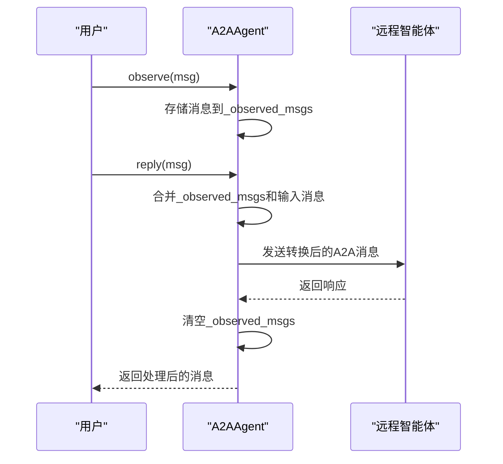
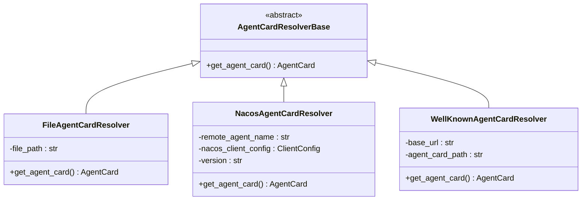
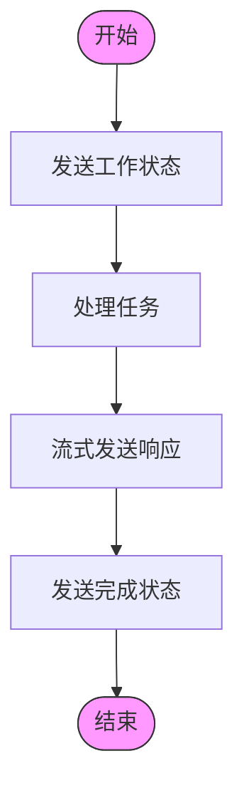
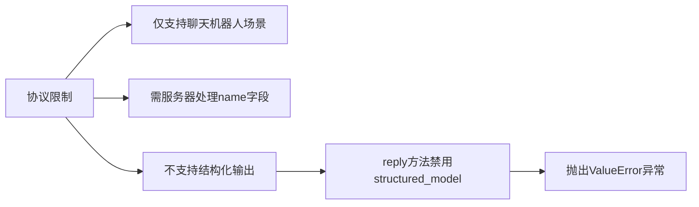

# A2A协议实现

<cite>
**本文档中引用的文件**  
- [A2AAgent.py](file://src/agentscope/agent/_a2a_agent.py)
- [a2a_formatter.py](file://src/agentscope/formatter/_a2a_formatter.py)
- [agent_card.py](file://examples/agent/a2a_agent/agent_card.py)
- [setup_a2a_server.py](file://examples/agent/a2a_agent/setup_a2a_server.py)
- [base.py](file://src/agentscope/a2a/_base.py)
- [file_resolver.py](file://src/agentscope/a2a/_file_resolver.py)
- [nacos_resolver.py](file://src/agentscope/a2a/_nacos_resolver.py)
- [well_known_resolver.py](file://src/agentscope/a2a/_well_known_resolver.py)
</cite>

## 目录
1. [A2A协议概述](#a2a协议概述)
2. [A2AAgent通信机制](#a2aagent通信机制)
3. [服务发现与AgentCard解析](#服务发现与agentcard解析)
4. [任务生命周期与流式传输](#任务生命周期与流式传输)
5. [协议限制与技术约束](#协议限制与技术约束)

## A2A协议概述

A2A（Agent-to-Agent）协议是一种开放标准协议，用于实现不同AI智能体之间的互操作通信。在AgentScope框架中，A2A协议的实现主要通过A2AAgent类来完成，该类支持与远程智能体的通信、消息格式转换、任务生命周期管理等功能。协议的核心是通过AgentCard来描述远程智能体的能力和配置信息，包括名称、URL、版本、功能特性等。

**本节来源**  
- [A2AAgent.py](file://src/agentscope/agent/_a2a_agent.py#L1-L10)
- [agent_card.py](file://examples/agent/a2a_agent/agent_card.py#L1-L38)

## A2AAgent通信机制

A2AAgent类实现了与远程A2A智能体的通信功能。其核心机制包括消息转换、观察机制和回复处理。A2AAgent使用A2AChatFormatter进行消息格式的双向转换，将AgentScope的Msg对象转换为A2A协议的Message对象，反之亦然。

通信过程中，A2AAgent通过observe()方法接收并存储消息，这些消息会在后续的reply()调用中与输入消息合并后发送给远程智能体。这种设计允许智能体在不立即回复的情况下先观察和积累上下文信息。在reply()方法执行后，已处理的观察消息会被清除，确保每次通信都是基于最新的上下文。

**图示来源**  
- [A2AAgent.py](file://src/agentscope/agent/_a2a_agent.py#L154-L254)
- [a2a_formatter.py](file://src/agentscope/formatter/_a2a_formatter.py#L35-L145)

**本节来源**  
- [A2AAgent.py](file://src/agentscope/agent/_a2a_agent.py#L154-L254)
- [a2a_formatter.py](file://src/agentscope/formatter/_a2a_formatter.py#L35-L145)

## 服务发现与AgentCard解析

A2A协议通过AgentCardResolverBase基类和其具体实现来完成服务发现功能。AgentCardResolverBase定义了获取智能体卡片的抽象接口，具体的解析器实现包括FileAgentCardResolver、NacosAgentCardResolver和WellKnownAgentCardResolver。

FileAgentCardResolver从本地JSON文件加载智能体卡片信息，适用于静态配置场景。NacosAgentCardResolver通过Nacos服务注册中心获取智能体卡片，支持动态服务发现和配置管理。WellKnownAgentCardResolver则通过well-known URL路径从远程服务器获取智能体卡片，遵循标准的发现协议。

这些解析器的共同目标是获取包含智能体元数据的AgentCard对象，包括名称、URL、功能特性等信息，为后续的通信建立基础。

**图示来源**  
- [base.py](file://src/agentscope/a2a/_base.py#L12-L25)
- [file_resolver.py](file://src/agentscope/a2a/_file_resolver.py#L15-L79)
- [nacos_resolver.py](file://src/agentscope/a2a/_nacos_resolver.py#L17-L99)
- [well_known_resolver.py](file://src/agentscope/a2a/_well_known_resolver.py#L15-L91)

**本节来源**  
- [base.py](file://src/agentscope/a2a/_base.py#L12-L25)
- [file_resolver.py](file://src/agentscope/a2a/_file_resolver.py#L15-L79)
- [nacos_resolver.py](file://src/agentscope/a2a/_nacos_resolver.py#L17-L99)
- [well_known_resolver.py](file://src/agentscope/a2a/_well_known_resolver.py#L15-L91)

## 任务生命周期与流式传输

A2A协议支持任务生命周期管理和流式传输功能。在服务器端实现中，通过TaskStatusUpdateEvent来通知任务状态的变化，包括工作中的状态更新和最终完成状态。流式传输允许服务器在处理过程中逐步发送响应，提高用户体验。

在setup_a2a_server.py示例中，SimpleStreamHandler的on_message_send_stream方法展示了任务处理的完整流程：首先发送工作中的状态更新，然后通过流式方式发送处理结果，最后发送任务完成状态。这种设计支持长时间运行的任务，并能及时向客户端反馈处理进度。

**图示来源**  
- [setup_a2a_server.py](file://examples/agent/a2a_agent/setup_a2a_server.py#L35-L131)

**本节来源**  
- [setup_a2a_server.py](file://examples/agent/a2a_agent/setup_a2a_server.py#L35-L131)

## 协议限制与技术约束

A2A协议在AgentScope中的实现存在一些重要的限制和技术约束。首先，协议仅支持聊天机器人场景的交互，即用户与助手之间的对话模式。要支持多智能体交互，需要服务器端正确处理A2A消息中的'name'字段。

其次，由于A2A协议本身不支持结构化输出，A2AAgent的reply()方法禁用了structured_model参数。当尝试使用此参数时，会抛出ValueError异常，明确指出该功能不被支持。这一限制源于协议设计，无法通过客户端实现来克服。

这些限制反映了A2A协议在当前阶段的功能边界，开发者在使用时需要充分考虑这些约束对应用场景的影响。

**图示来源**  
- [A2AAgent.py](file://src/agentscope/agent/_a2a_agent.py#L39-L43)
- [A2AAgent.py](file://src/agentscope/agent/_a2a_agent.py#L206-L211)

**本节来源**  
- [A2AAgent.py](file://src/agentscope/agent/_a2a_agent.py#L39-L43)
- [A2AAgent.py](file://src/agentscope/agent/_a2a_agent.py#L206-L211)