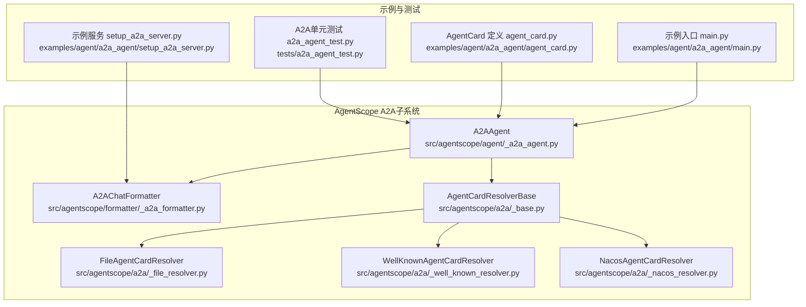
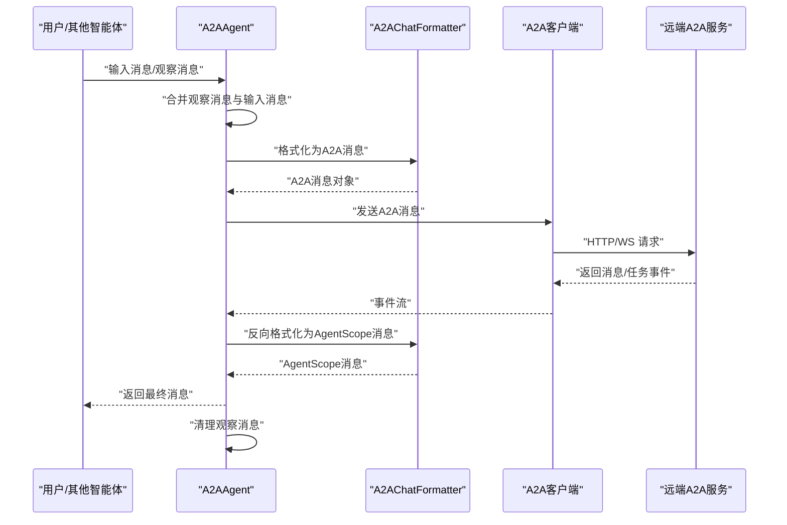
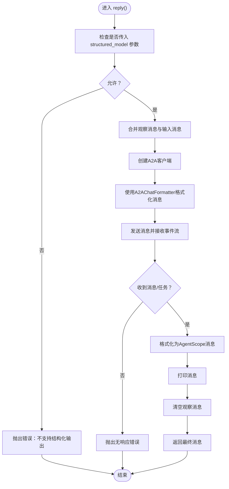
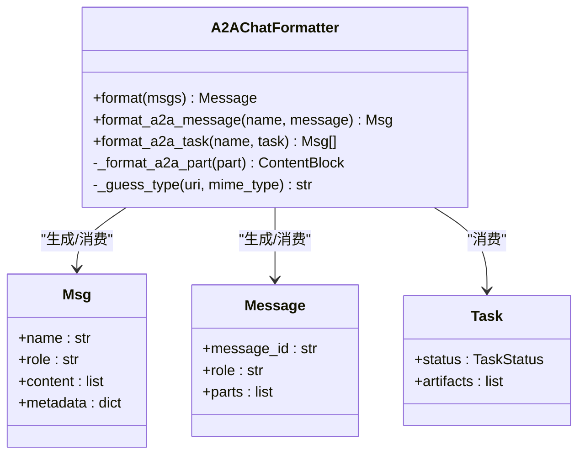
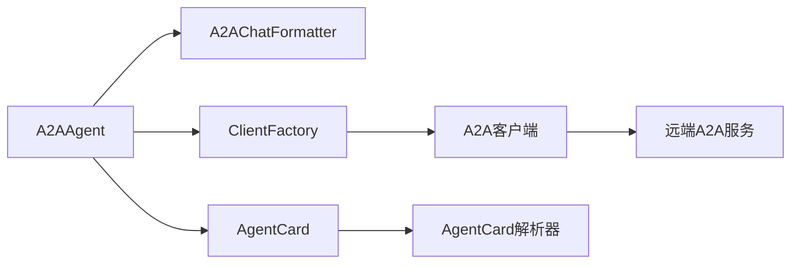

# A2A协议限制与约束

<cite>
**本文引用的文件列表**
- [src/agentscope/agent/_a2a_agent.py](file://src/agentscope/agent/_a2a_agent.py)
- [src/agentscope/formatter/_a2a_formatter.py](file://src/agentscope/formatter/_a2a_formatter.py)
- [src/agentscope/a2a/_base.py](file://src/agentscope/a2a/_base.py)
- [src/agentscope/a2a/_file_resolver.py](file://src/agentscope/a2a/_file_resolver.py)
- [src/agentscope/a2a/_well_known_resolver.py](file://src/agentscope/a2a/_well_known_resolver.py)
- [src/agentscope/a2a/_nacos_resolver.py](file://src/agentscope/a2a/_nacos_resolver.py)
- [examples/agent/a2a_agent/main.py](file://examples/agent/a2a_agent/main.py)
- [examples/agent/a2a_agent/setup_a2a_server.py](file://examples/agent/a2a_agent/setup_a2a_server.py)
- [examples/agent/a2a_agent/agent_card.py](file://examples/agent/a2a_agent/agent_card.py)
- [tests/a2a_agent_test.py](file://tests/a2a_agent_test.py)
</cite>

## 目录
1. [引言](#引言)
2. [项目结构](#项目结构)
3. [核心组件](#核心组件)
4. [架构总览](#架构总览)
5. [详细组件分析](#详细组件分析)
6. [依赖关系分析](#依赖关系分析)
7. [性能考量](#性能考量)
8. [故障排查指南](#故障排查指南)
9. [结论](#结论)
10. [附录](#附录)

## 引言
本文件聚焦于AgentScope中A2A协议的实现与限制，围绕以下关键问题展开：为何A2A协议仅支持“用户—助手”对话场景、在多智能体系统中服务器端必须正确处理name字段以实现多智能体通信的技术原因；协议本身不支持结构化输出导致A2AAgent的reply()方法禁用structured_model参数的设计决策及影响；以及当输入消息为空时返回提示消息的行为逻辑及其在实际应用中的意义。文档通过代码级分析与可视化图示，帮助读者全面理解A2A协议在AgentScope中的技术边界与工程实践建议。

## 项目结构
与A2A协议直接相关的模块主要分布在以下位置：
- agent层：A2AAgent负责与远端A2A智能体通信、消息合并与状态管理
- formatter层：A2AChatFormatter负责消息格式转换（AgentScope Msg ↔ A2A Message/Task）
- a2a解析器：AgentCard解析器基类与多种实现（文件、well-known、Nacos），用于发现远端AgentCard
- 示例与测试：提供最小可运行示例与单元测试，验证行为边界

图表来源
- [src/agentscope/agent/_a2a_agent.py](file://src/agentscope/agent/_a2a_agent.py#L1-L289)
- [src/agentscope/formatter/_a2a_formatter.py](file://src/agentscope/formatter/_a2a_formatter.py#L1-L365)
- [src/agentscope/a2a/_base.py](file://src/agentscope/a2a/_base.py#L1-L26)
- [src/agentscope/a2a/_file_resolver.py](file://src/agentscope/a2a/_file_resolver.py)
- [src/agentscope/a2a/_well_known_resolver.py](file://src/agentscope/a2a/_well_known_resolver.py)
- [src/agentscope/a2a/_nacos_resolver.py](file://src/agentscope/a2a/_nacos_resolver.py)
- [examples/agent/a2a_agent/main.py](file://examples/agent/a2a_agent/main.py#L1-L29)
- [examples/agent/a2a_agent/setup_a2a_server.py](file://examples/agent/a2a_agent/setup_a2a_server.py#L1-L132)
- [examples/agent/a2a_agent/agent_card.py](file://examples/agent/a2a_agent/agent_card.py#L1-L38)
- [tests/a2a_agent_test.py](file://tests/a2a_agent_test.py#L1-L254)

章节来源
- [src/agentscope/agent/_a2a_agent.py](file://src/agentscope/agent/_a2a_agent.py#L1-L289)
- [src/agentscope/formatter/_a2a_formatter.py](file://src/agentscope/formatter/_a2a_formatter.py#L1-L365)
- [src/agentscope/a2a/_base.py](file://src/agentscope/a2a/_base.py#L1-L26)
- [examples/agent/a2a_agent/main.py](file://examples/agent/a2a_agent/main.py#L1-L29)
- [examples/agent/a2a_agent/setup_a2a_server.py](file://examples/agent/a2a_agent/setup_a2a_server.py#L1-L132)
- [examples/agent/a2a_agent/agent_card.py](file://examples/agent/a2a_agent/agent_card.py#L1-L38)
- [tests/a2a_agent_test.py](file://tests/a2a_agent_test.py#L1-L254)

## 核心组件
- A2AAgent：封装与远端A2A智能体的通信，负责消息合并、格式转换、任务流式响应处理、状态持久化与中断处理。
- A2AChatFormatter：负责将AgentScope消息转换为A2A消息对象，或将A2A消息/任务转换回AgentScope消息。
- AgentCard解析器：提供从文件、well-known路径或Nacos注册中心解析AgentCard的能力，支撑A2A客户端初始化。

章节来源
- [src/agentscope/agent/_a2a_agent.py](file://src/agentscope/agent/_a2a_agent.py#L1-L289)
- [src/agentscope/formatter/_a2a_formatter.py](file://src/agentscope/formatter/_a2a_formatter.py#L1-L365)
- [src/agentscope/a2a/_base.py](file://src/agentscope/a2a/_base.py#L1-L26)

## 架构总览
A2A协议在AgentScope中的调用链路如下：用户/其他智能体通过A2AAgent发起请求，A2AAgent将AgentScope消息转换为A2A消息，经由A2A客户端发送至远端服务；远端服务可能以消息或任务形式返回结果，A2AChatFormatter再将其转换回AgentScope消息；A2AAgent维护观察到的消息并在每次回复后清理，确保上下文的正确传递。

图表来源
- [src/agentscope/agent/_a2a_agent.py](file://src/agentscope/agent/_a2a_agent.py#L177-L261)
- [src/agentscope/formatter/_a2a_formatter.py](file://src/agentscope/formatter/_a2a_formatter.py#L31-L184)
- [examples/agent/a2a_agent/setup_a2a_server.py](file://examples/agent/a2a_agent/setup_a2a_server.py#L31-L118)

## 详细组件分析

### A2AAgent：协议限制与行为边界
- 仅支持“用户—助手”对话场景：A2AAgent注释明确指出协议限制，仅支持单轮对话（用户与助手）。若需多智能体交互，服务器端必须正确处理name字段以区分不同发送方。
- 不支持结构化输出：reply()方法显式拒绝structured_model参数，因为A2A协议不支持结构化输出。
- 观察消息机制：A2AAgent内部维护_observed_msgs，在每次reply()后清空，确保上下文按轮次隔离。
- 空输入提示行为：当输入消息为空（None或空列表或仅包含None）时，A2AAgent会触发一个提示消息作为默认响应，便于用户引导与调试。

图表来源
- [src/agentscope/agent/_a2a_agent.py](file://src/agentscope/agent/_a2a_agent.py#L177-L261)

章节来源
- [src/agentscope/agent/_a2a_agent.py](file://src/agentscope/agent/_a2a_agent.py#L37-L46)
- [src/agentscope/agent/_a2a_agent.py](file://src/agentscope/agent/_a2a_agent.py#L206-L211)
- [src/agentscope/agent/_a2a_agent.py](file://src/agentscope/agent/_a2a_agent.py#L154-L176)
- [src/agentscope/agent/_a2a_agent.py](file://src/agentscope/agent/_a2a_agent.py#L252-L261)
- [tests/a2a_agent_test.py](file://tests/a2a_agent_test.py#L149-L189)

### A2AChatFormatter：消息与任务转换
- 输入合并策略：A2A协议要求单请求消息，因此A2AChatFormatter会将多个AgentScope消息合并为一个A2A Message，角色统一为user。
- 反向转换：将A2A Message/Task转换回AgentScope消息，支持文本、文件（URL/base64）、工具调用/结果等块类型。
- 名称映射：在将A2A消息转回AgentScope消息时，使用A2AAgent.name作为发送者名称，这体现了服务器端正确处理name字段的重要性。

图表来源
- [src/agentscope/formatter/_a2a_formatter.py](file://src/agentscope/formatter/_a2a_formatter.py#L31-L184)
- [src/agentscope/formatter/_a2a_formatter.py](file://src/agentscope/formatter/_a2a_formatter.py#L224-L271)
- [src/agentscope/formatter/_a2a_formatter.py](file://src/agentscope/formatter/_a2a_formatter.py#L273-L365)

章节来源
- [src/agentscope/formatter/_a2a_formatter.py](file://src/agentscope/formatter/_a2a_formatter.py#L31-L184)
- [src/agentscope/formatter/_a2a_formatter.py](file://src/agentscope/formatter/_a2a_formatter.py#L224-L271)

### 多智能体通信与name字段处理
- 协议限制：A2A协议本身未提供多智能体间角色/发送方标识的标准化字段，因此AgentScope侧通过A2AChatFormatter在反向转换时使用A2AAgent.name作为发送者名称。
- 服务器端责任：要实现多智能体通信，服务器端需要在A2A消息中携带并正确解析name字段，以便客户端能够区分不同发送方，从而在UI或业务逻辑中正确呈现。

章节来源
- [src/agentscope/agent/_a2a_agent.py](file://src/agentscope/agent/_a2a_agent.py#L37-L46)
- [src/agentscope/formatter/_a2a_formatter.py](file://src/agentscope/formatter/_a2a_formatter.py#L147-L184)

### 结构化输出禁用与替代方案
- 设计决策：A2AAgent.reply()显式拒绝structured_model参数，因为A2A协议不支持结构化输出。
- 开发影响：开发者无法直接通过A2AAgent进行结构化输出推理，需要依赖远端服务或在消息中携带结构化内容（如DataPart），由A2AChatFormatter识别并透传。
- 替代方案：
  - 使用工具调用/结果块（tool_use/tool_result）在消息中嵌入结构化数据，由远端服务解析执行。
  - 在消息文本中约定结构化格式（如JSON字符串），由远端服务解析并返回非结构化文本摘要或工具结果。
  - 若需强结构化输出能力，优先使用本地Agent（如ReActAgent）而非A2A代理。

章节来源
- [src/agentscope/agent/_a2a_agent.py](file://src/agentscope/agent/_a2a_agent.py#L206-L211)
- [src/agentscope/formatter/_a2a_formatter.py](file://src/agentscope/formatter/_a2a_formatter.py#L124-L131)
- [src/agentscope/formatter/_a2a_formatter.py](file://src/agentscope/formatter/_a2a_formatter.py#L333-L359)

### 空输入提示行为与实际意义
- 行为逻辑：当输入消息为空（None、空列表或仅包含None）时，A2AAgent会返回一个提示消息，作为默认响应，避免无输入导致的异常。
- 实际意义：
  - 用户体验：在示例或调试场景中，空输入可触发友好提示，便于用户继续交互。
  - 流程控制：在工作流中，空输入可作为占位或触发条件，结合观察消息机制实现更灵活的上下文管理。
  - 测试覆盖：单元测试验证了该行为，确保边界情况得到妥善处理。

章节来源
- [tests/a2a_agent_test.py](file://tests/a2a_agent_test.py#L149-L189)
- [src/agentscope/agent/_a2a_agent.py](file://src/agentscope/agent/_a2a_agent.py#L252-L261)

### 示例与集成要点
- 示例入口：示例main.py展示了A2AAgent与UserAgent的简单对话流程。
- 示例服务：setup_a2a_server.py演示了如何在服务器端将A2A消息转换为AgentScope消息，再驱动本地Agent执行任务，并通过事件流返回状态更新。
- AgentCard：agent_card.py定义了远端Agent的基本信息与能力，供客户端初始化与路由。

章节来源
- [examples/agent/a2a_agent/main.py](file://examples/agent/a2a_agent/main.py#L1-L29)
- [examples/agent/a2a_agent/setup_a2a_server.py](file://examples/agent/a2a_agent/setup_a2a_server.py#L31-L118)
- [examples/agent/a2a_agent/agent_card.py](file://examples/agent/a2a_agent/agent_card.py#L1-L38)

## 依赖关系分析
- 组件耦合：
  - A2AAgent依赖A2AChatFormatter进行双向消息转换。
  - A2AAgent通过ClientFactory创建A2A客户端，间接依赖远端服务的A2A实现。
  - AgentCard解析器为AgentScope提供AgentCard来源，支撑A2A客户端初始化。
- 外部依赖：
  - a2a.types与a2a.client：A2A协议的类型与客户端接口。
  - httpx：异步HTTP客户端，用于A2A客户端的网络通信。
- 潜在循环依赖：
  - 当前模块采用延迟导入与运行时类型检查，避免显式循环依赖。

图表来源
- [src/agentscope/agent/_a2a_agent.py](file://src/agentscope/agent/_a2a_agent.py#L74-L113)
- [src/agentscope/formatter/_a2a_formatter.py](file://src/agentscope/formatter/_a2a_formatter.py#L31-L184)
- [src/agentscope/a2a/_base.py](file://src/agentscope/a2a/_base.py#L12-L26)

章节来源
- [src/agentscope/agent/_a2a_agent.py](file://src/agentscope/agent/_a2a_agent.py#L74-L113)
- [src/agentscope/a2a/_base.py](file://src/agentscope/a2a/_base.py#L12-L26)

## 性能考量
- 流式传输：A2A协议支持任务状态流式更新，A2AAgent通过事件流逐步输出中间结果，减少等待时间。
- 消息合并：将多条消息合并为单条A2A消息，降低请求次数，但需注意消息长度与服务器限制。
- 观察消息清理：每轮回复后清理观察消息，避免内存累积与上下文污染。
- 超时与重试：客户端配置了较长超时，适用于长任务；建议在服务器端合理设置任务超时与重试策略。

[本节为通用指导，无需列出具体文件来源]

## 故障排查指南
- 结构化输出报错：若在A2AAgent.reply()中传入structured_model参数，将抛出错误。请移除该参数或改用本地Agent。
- 无响应错误：当远端未返回任何消息/任务时，A2AAgent会抛出无响应错误。检查远端服务是否正确处理A2A消息并返回事件。
- 空输入提示：空输入会返回提示消息，这是预期行为。若需自定义提示，请在调用前注入观察消息或在上层逻辑中处理空输入。
- 观察消息未清理：若多次调用未见清理，检查是否在异常分支提前返回而未完成清理流程。
- 服务器端name字段缺失：多智能体场景下，若消息发送者名称不正确，需确认服务器端是否正确携带并解析name字段。

章节来源
- [src/agentscope/agent/_a2a_agent.py](file://src/agentscope/agent/_a2a_agent.py#L206-L211)
- [src/agentscope/agent/_a2a_agent.py](file://src/agentscope/agent/_a2a_agent.py#L252-L261)
- [tests/a2a_agent_test.py](file://tests/a2a_agent_test.py#L149-L189)

## 结论
A2A协议在AgentScope中的实现体现了“协议即边界”的工程原则：协议不支持结构化输出与多智能体角色标识，导致A2AAgent在设计上做了明确限制与取舍。通过观察消息机制与事件流式处理，A2AAgent在有限协议能力下仍能提供可用的对话与任务执行能力。对于多智能体与结构化输出需求，应优先考虑本地Agent或在消息中嵌入结构化数据的折衷方案，并在服务器端正确处理name字段以实现多发送方语义。

[本节为总结性内容，无需列出具体文件来源]

## 附录
- 示例与测试参考：
  - 示例入口与服务：[examples/agent/a2a_agent/main.py](file://examples/agent/a2a_agent/main.py#L1-L29)、[examples/agent/a2a_agent/setup_a2a_server.py](file://examples/agent/a2a_agent/setup_a2a_server.py#L31-L118)
  - AgentCard定义：[examples/agent/a2a_agent/agent_card.py](file://examples/agent/a2a_agent/agent_card.py#L1-L38)
  - 单元测试覆盖：[tests/a2a_agent_test.py](file://tests/a2a_agent_test.py#L149-L189)

[本节为补充材料，无需列出具体文件来源]