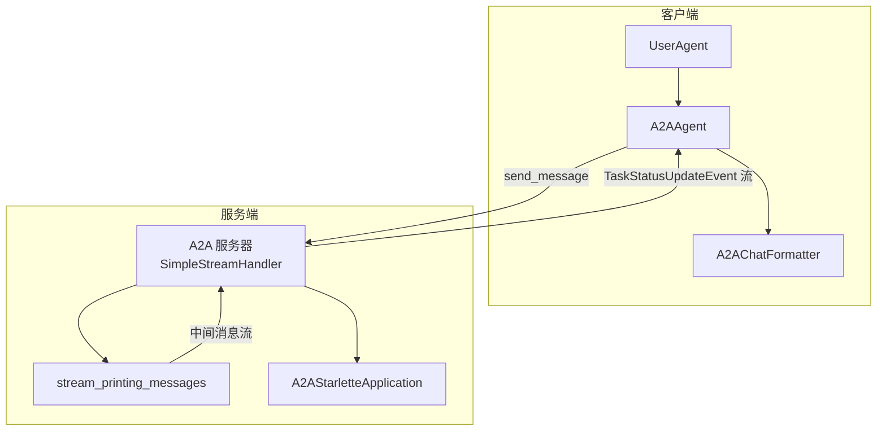
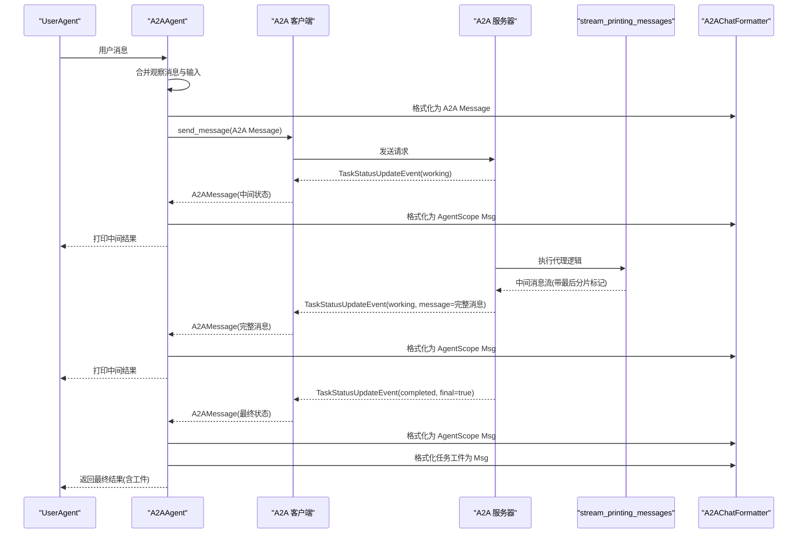
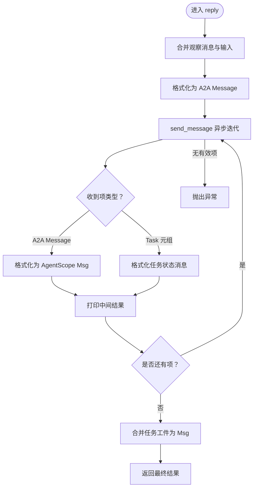
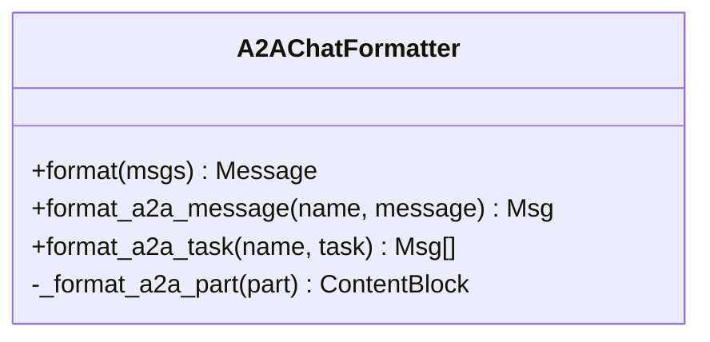
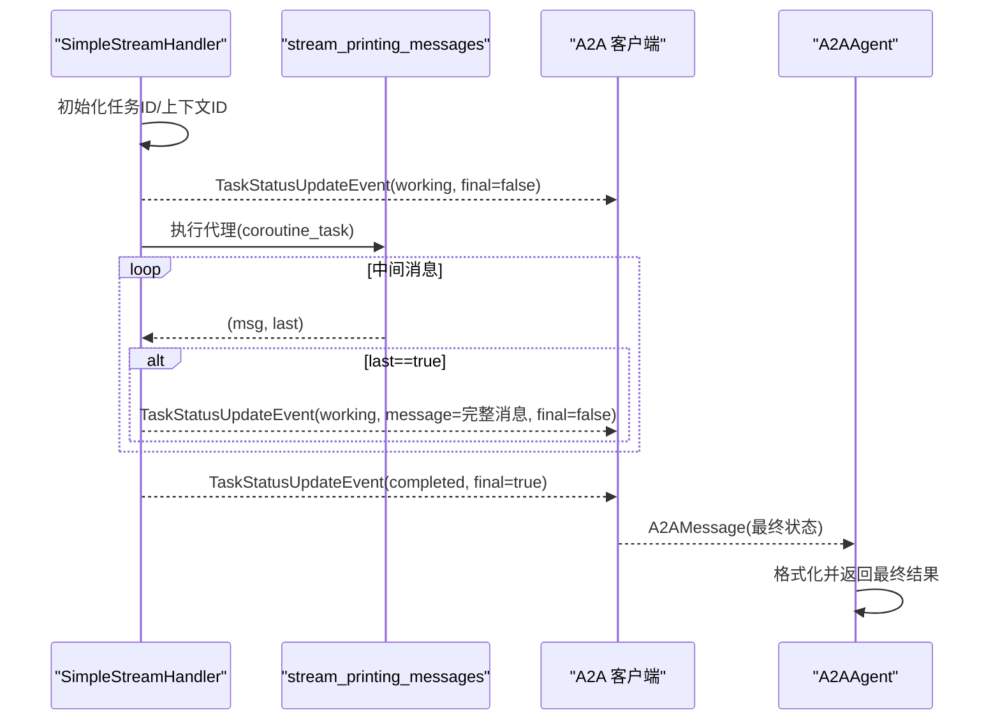
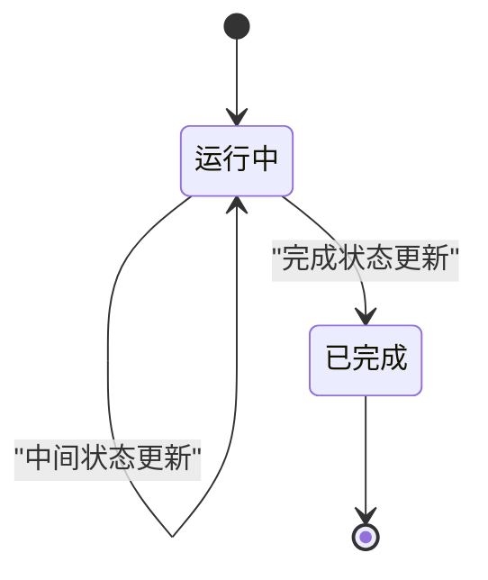
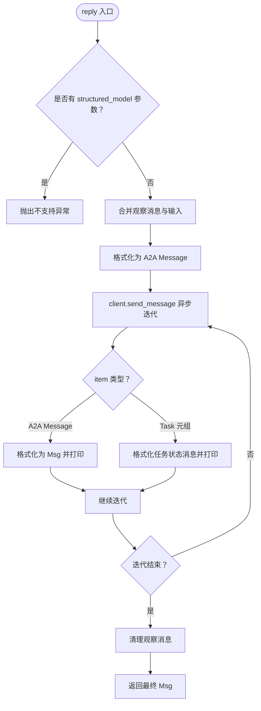
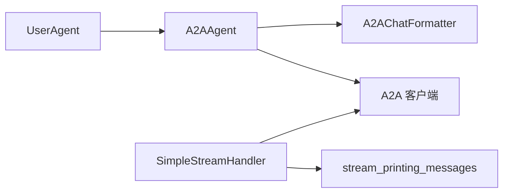

# 任务生命周期与流式传输

<cite>
**本文引用的文件**
- [src/agentscope/agent/_a2a_agent.py](file://src/agentscope/agent/_a2a_agent.py)
- [src/agentscope/formatter/_a2a_formatter.py](file://src/agentscope/formatter/_a2a_formatter.py)
- [src/agentscope/pipeline/_functional.py](file://src/agentscope/pipeline/_functional.py)
- [examples/agent/a2a_agent/setup_a2a_server.py](file://examples/agent/a2a_agent/setup_a2a_server.py)
- [examples/agent/a2a_agent/main.py](file://examples/agent/a2a_agent/main.py)
- [tests/a2a_agent_test.py](file://tests/a2a_agent_test.py)
- [docs/tutorial/zh_CN/src/task_a2a.py](file://docs/tutorial/zh_CN/src/task_a2a.py)
</cite>

## 目录
1. [引言](#引言)
2. [项目结构](#项目结构)
3. [核心组件](#核心组件)
4. [架构总览](#架构总览)
5. [详细组件分析](#详细组件分析)
6. [依赖关系分析](#依赖关系分析)
7. [性能考量](#性能考量)
8. [故障排查指南](#故障排查指南)
9. [结论](#结论)

## 引言
本文件围绕 A2AAgent 对任务生命周期的管理机制展开，重点解释其如何通过异步生成器（async for）消费来自远程代理的流式响应，包括中间状态更新与最终结果的接收；并说明任务（Task）对象在协议中的表示、状态转换（运行中、已完成）以及工件（artifacts）的传递机制。同时，结合示例与测试用例，分析流式传输在用户体验与系统性能方面的优势，并给出处理长时任务的最佳实践建议。

## 项目结构
与 A2AAgent 任务生命周期直接相关的模块与示例如下：
- A2AAgent 实现：负责与远程 A2A 代理通信、消息格式化、任务状态与工件处理
- A2AChatFormatter：负责 AgentScope 与 A2A 消息/任务格式之间的双向转换
- stream_printing_messages：捕获 Agent 打印输出并以异步生成器形式产出中间消息
- 示例服务端：演示如何在服务端产生 TaskStatusUpdateEvent 流，配合流式消息推送
- 示例客户端：演示用户与 A2AAgent 的交互流程
- 测试用例：验证 observe/reply 合并、任务返回、错误传播等行为

**图表来源**
- [src/agentscope/agent/_a2a_agent.py](file://src/agentscope/agent/_a2a_agent.py#L177-L289)
- [src/agentscope/formatter/_a2a_formatter.py](file://src/agentscope/formatter/_a2a_formatter.py#L31-L365)
- [src/agentscope/pipeline/_functional.py](file://src/agentscope/pipeline/_functional.py#L106-L191)
- [examples/agent/a2a_agent/setup_a2a_server.py](file://examples/agent/a2a_agent/setup_a2a_server.py#L31-L131)
- [examples/agent/a2a_agent/main.py](file://examples/agent/a2a_agent/main.py#L1-L29)

**章节来源**
- [src/agentscope/agent/_a2a_agent.py](file://src/agentscope/agent/_a2a_agent.py#L1-L289)
- [src/agentscope/formatter/_a2a_formatter.py](file://src/agentscope/formatter/_a2a_formatter.py#L1-L365)
- [src/agentscope/pipeline/_functional.py](file://src/agentscope/pipeline/_functional.py#L106-L191)
- [examples/agent/a2a_agent/setup_a2a_server.py](file://examples/agent/a2a_agent/setup_a2a_server.py#L1-L131)
- [examples/agent/a2a_agent/main.py](file://examples/agent/a2a_agent/main.py#L1-L29)

## 核心组件
- A2AAgent：封装 A2A 客户端工厂、消息合并与观察、异步迭代远程响应、格式化回传消息与任务工件
- A2AChatFormatter：将 AgentScope Msg 列表合并为单条 A2A Message；将 A2A Message/Task 转换为 AgentScope Msg
- stream_printing_messages：捕获 Agent 打印输出，按“最后分片”标记逐条产出中间消息
- A2A 服务器 SimpleStreamHandler：在收到消息请求后，先发出“工作态”状态更新，再通过中间消息流持续推送，最后发出“完成态”状态更新

**章节来源**
- [src/agentscope/agent/_a2a_agent.py](file://src/agentscope/agent/_a2a_agent.py#L177-L289)
- [src/agentscope/formatter/_a2a_formatter.py](file://src/agentscope/formatter/_a2a_formatter.py#L31-L365)
- [src/agentscope/pipeline/_functional.py](file://src/agentscope/pipeline/_functional.py#L106-L191)
- [examples/agent/a2a_agent/setup_a2a_server.py](file://examples/agent/a2a_agent/setup_a2a_server.py#L31-L131)

## 架构总览
A2AAgent 在一次对话中承担以下职责：
- 将用户输入与历史观察消息合并为一条 A2A 请求消息
- 通过 A2A 客户端发送给远端代理
- 使用异步生成器消费远端返回的消息或任务
- 将 A2A 消息转换为 AgentScope Msg 并打印
- 若返回任务，则将任务状态消息与工件合并为最终 Msg 返回

**图表来源**
- [src/agentscope/agent/_a2a_agent.py](file://src/agentscope/agent/_a2a_agent.py#L177-L289)
- [src/agentscope/formatter/_a2a_formatter.py](file://src/agentscope/formatter/_a2a_formatter.py#L147-L271)
- [src/agentscope/pipeline/_functional.py](file://src/agentscope/pipeline/_functional.py#L106-L191)
- [examples/agent/a2a_agent/setup_a2a_server.py](file://examples/agent/a2a_agent/setup_a2a_server.py#L31-L131)

## 详细组件分析

### A2AAgent 的任务生命周期管理
- 观察与合并：A2AAgent 维护一个观察消息列表，在 reply 时将其与本次输入合并，形成单条 A2A 请求消息
- 异步迭代：通过 client.send_message 的异步迭代，逐步接收 A2A 消息或任务元组
- 状态与工件：当接收到任务时，优先格式化任务状态消息并打印；最终将任务工件合并到返回消息中
- 错误处理：若未收到任何有效响应，抛出异常；若客户端抛错，由上层捕获

**图表来源**
- [src/agentscope/agent/_a2a_agent.py](file://src/agentscope/agent/_a2a_agent.py#L177-L289)
- [src/agentscope/formatter/_a2a_formatter.py](file://src/agentscope/formatter/_a2a_formatter.py#L224-L271)

**章节来源**
- [src/agentscope/agent/_a2a_agent.py](file://src/agentscope/agent/_a2a_agent.py#L177-L289)
- [tests/a2a_agent_test.py](file://tests/a2a_agent_test.py#L120-L178)

### A2AChatFormatter 的消息与任务转换
- 请求侧：将多条 AgentScope Msg 合并为单条 A2A Message，角色统一为 user，内容块映射文本、思考、多媒体与工具调用/结果
- 响应侧：将 A2A Message 转换为 AgentScope Msg；将 A2A Task 的状态消息与工件分别转换为 Msg，并合并到同一助手消息中

**图表来源**
- [src/agentscope/formatter/_a2a_formatter.py](file://src/agentscope/formatter/_a2a_formatter.py#L31-L365)

**章节来源**
- [src/agentscope/formatter/_a2a_formatter.py](file://src/agentscope/formatter/_a2a_formatter.py#L31-L365)

### 流式传输与轮询模式支持
- 流式传输：服务端通过 stream_printing_messages 捕获中间消息，并以“最后分片标记”区分完整消息；客户端在收到 A2A Message 时即刻打印，提升实时反馈
- 轮询模式：A2A 协议本身不直接提供轮询语义，但可通过 TaskStatusUpdateEvent 的周期性推送模拟轮询效果；服务端在工作态阶段持续推送中间状态，最终以完成态收尾
- 事件驱动：服务端在 on_message_send_stream 中先发出 working 状态，随后在中间消息流中按需推送 working 状态，最后发出 completed 状态

**图表来源**
- [examples/agent/a2a_agent/setup_a2a_server.py](file://examples/agent/a2a_agent/setup_a2a_server.py#L31-L131)
- [src/agentscope/pipeline/_functional.py](file://src/agentscope/pipeline/_functional.py#L106-L191)
- [src/agentscope/agent/_a2a_agent.py](file://src/agentscope/agent/_a2a_agent.py#L177-L289)

**章节来源**
- [examples/agent/a2a_agent/setup_a2a_server.py](file://examples/agent/a2a_agent/setup_a2a_server.py#L31-L131)
- [src/agentscope/pipeline/_functional.py](file://src/agentscope/pipeline/_functional.py#L106-L191)

### 任务对象在协议中的表示与状态转换
- 表示：Task 包含 id、context_id、status（含 state 与 message）、artifacts（可为空）
- 状态：TaskState.working 与 TaskState.completed；服务端在工作阶段持续推送 working 状态，最终推送 completed
- 工件：artifacts 作为附加内容合并到最终返回消息中，便于前端展示与后续处理

**图表来源**
- [examples/agent/a2a_agent/setup_a2a_server.py](file://examples/agent/a2a_agent/setup_a2a_server.py#L86-L118)
- [tests/a2a_agent_test.py](file://tests/a2a_agent_test.py#L120-L178)

**章节来源**
- [examples/agent/a2a_agent/setup_a2a_server.py](file://examples/agent/a2a_agent/setup_a2a_server.py#L86-L118)
- [tests/a2a_agent_test.py](file://tests/a2a_agent_test.py#L120-L178)

### reply() 方法的异步生成器处理流程
- 输入合并：将观察消息与当前输入合并为 A2A Message
- 异步迭代：client.send_message 返回异步迭代器，逐项处理
- 分支处理：若为 A2A Message，格式化并打印；若为 Task 元组，格式化任务状态消息并打印
- 最终返回：清理观察消息，返回最终 Msg（包含工件）

**图表来源**
- [src/agentscope/agent/_a2a_agent.py](file://src/agentscope/agent/_a2a_agent.py#L177-L289)

**章节来源**
- [src/agentscope/agent/_a2a_agent.py](file://src/agentscope/agent/_a2a_agent.py#L177-L289)

## 依赖关系分析
- A2AAgent 依赖 A2AChatFormatter 进行消息与任务的双向转换
- A2AAgent 通过 A2A 客户端工厂创建客户端，使用异步迭代消费远端响应
- 服务端通过 stream_printing_messages 捕获中间消息，结合 TaskStatusUpdateEvent 推送状态
- 示例客户端 UserAgent 与 A2AAgent 形成交互闭环

**图表来源**
- [src/agentscope/agent/_a2a_agent.py](file://src/agentscope/agent/_a2a_agent.py#L1-L289)
- [src/agentscope/formatter/_a2a_formatter.py](file://src/agentscope/formatter/_a2a_formatter.py#L1-L365)
- [src/agentscope/pipeline/_functional.py](file://src/agentscope/pipeline/_functional.py#L106-L191)
- [examples/agent/a2a_agent/setup_a2a_server.py](file://examples/agent/a2a_agent/setup_a2a_server.py#L31-L131)
- [examples/agent/a2a_agent/main.py](file://examples/agent/a2a_agent/main.py#L1-L29)

**章节来源**
- [src/agentscope/agent/_a2a_agent.py](file://src/agentscope/agent/_a2a_agent.py#L1-L289)
- [src/agentscope/formatter/_a2a_formatter.py](file://src/agentscope/formatter/_a2a_formatter.py#L1-L365)
- [src/agentscope/pipeline/_functional.py](file://src/agentscope/pipeline/_functional.py#L106-L191)
- [examples/agent/a2a_agent/setup_a2a_server.py](file://examples/agent/a2a_agent/setup_a2a_server.py#L1-L131)
- [examples/agent/a2a_agent/main.py](file://examples/agent/a2a_agent/main.py#L1-L29)

## 性能考量
- 流式传输的优势
  - 低延迟：中间消息即时打印，减少等待时间
  - 资源友好：避免一次性累积大量中间文本，降低内存峰值
  - 可中断：用户可在任意时刻中断，A2AAgent 提供中断后的消息记录与提示
- 长时任务最佳实践
  - 服务端应尽早发出 working 状态，保持心跳式更新
  - 中间消息仅在 last==true 时才推送完整消息，避免重复渲染
  - 工件合并策略：将工件内容追加到助手消息末尾，确保最终结果可被前端直接消费
  - 错误快速失败：一旦发生异常，立即停止中间推送并返回错误，避免无效等待

[本节为通用指导，无需列出具体文件来源]

## 故障排查指南
- 无响应或空响应
  - 检查 A2A 客户端是否正确创建与配置
  - 确认服务端是否发出 completed 状态事件
  - 参考测试用例中对“无消息”场景的断言
- 结构化输出不支持
  - reply 不支持 structured_model 参数，会抛出异常
- 观察消息未生效
  - 确认 observe 是否在 reply 前调用，且未被清理
- 中间消息异常
  - stream_printing_messages 在任务完成后会抛出异常，确保异常处理链路完善

**章节来源**
- [tests/a2a_agent_test.py](file://tests/a2a_agent_test.py#L120-L178)
- [src/agentscope/agent/_a2a_agent.py](file://src/agentscope/agent/_a2a_agent.py#L177-L289)
- [src/agentscope/pipeline/_functional.py](file://src/agentscope/pipeline/_functional.py#L106-L191)

## 结论
A2AAgent 通过异步生成器与 A2A 协议的事件推送，实现了对任务生命周期的细粒度控制：从工作态到完成态的状态流转、中间消息的即时呈现、以及最终工件的合并返回。配合 stream_printing_messages 的中间消息捕获与 TaskStatusUpdateEvent 的状态推送，系统在用户体验与性能方面均具备良好表现。对于长时任务，建议服务端采用“尽早工作态、周期性中间态、最终完成态”的策略，并在异常时快速失败，保障整体稳定性与可维护性。