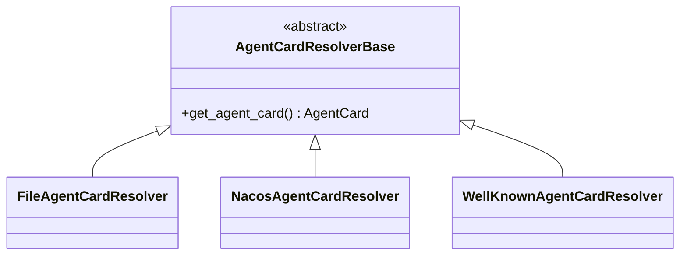
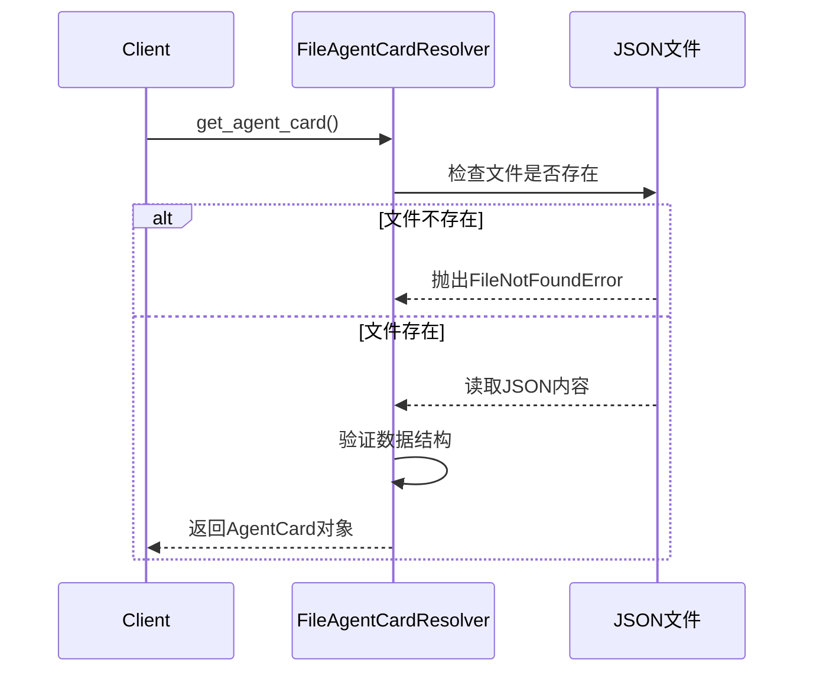
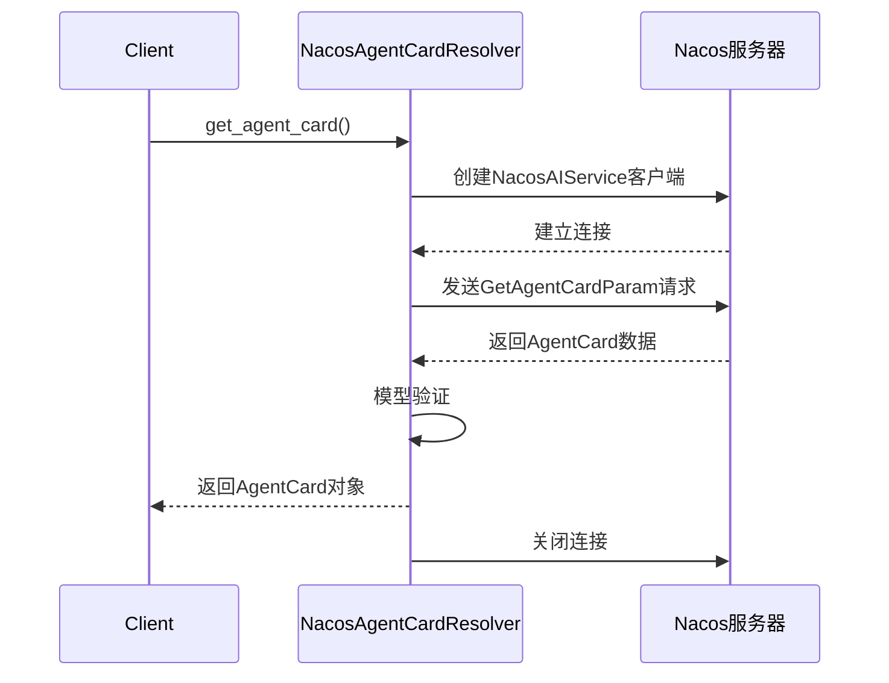
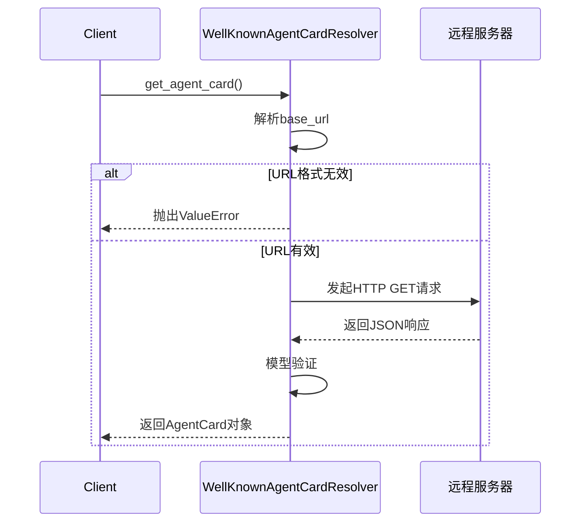

# 智能体卡片解析机制

<cite>
**本文档引用文件**  
- [AgentCardResolverBase](file://src/agentscope/a2a/_base.py)
- [FileAgentCardResolver](file://src/agentscope/a2a/_file_resolver.py)
- [NacosAgentCardResolver](file://src/agentscope/a2a/_nacos_resolver.py)
- [WellKnownAgentCardResolver](file://src/agentscope/a2a/_well_known_resolver.py)
- [a2a_resolver_test.py](file://tests/a2a_resolver_test.py)
- [agent_card.py](file://examples/agent/a2a_agent/agent_card.py)
</cite>

## 目录
1. [引言](#引言)
2. [核心组件](#核心组件)
3. [抽象基类：AgentCardResolverBase](#抽象基类agentcardresolverbase)
4. [文件解析器：FileAgentCardResolver](#文件解析器fileagentcardresolver)
5. [Nacos解析器：NacosAgentCardResolver](#nacos解析器nacosagentcardresolver)
6. [标准端点解析器：WellKnownAgentCardResolver](#标准端点解析器wellknownagentcardresolver)
7. [解析器对比与适用场景](#解析器对比与适用场景)
8. [结论](#结论)

## 引言
A2A协议中的智能体卡片（AgentCard）是一种描述远程智能体元数据的结构化对象，包含名称、URL、能力、技能等关键信息。为了支持多种服务发现机制，系统设计了统一的解析架构，通过不同的解析器从本地文件、服务注册中心或标准HTTP端点动态获取AgentCard。本文将系统性地介绍这一解析机制的设计与实现。

## 核心组件
智能体卡片解析机制由一个抽象基类和三个具体实现构成，分别对应不同的服务发现方式。这些组件共同构成了灵活、可扩展的AgentCard获取体系。

**本节来源**  
- [AgentCardResolverBase](file://src/agentscope/a2a/_base.py#L1-L25)
- [FileAgentCardResolver](file://src/agentscope/a2a/_file_resolver.py#L1-L79)
- [NacosAgentCardResolver](file://src/agentscope/a2a/_nacos_resolver.py#L1-L99)
- [WellKnownAgentCardResolver](file://src/agentscope/a2a/_well_known_resolver.py#L1-L91)

## 抽象基类：AgentCardResolverBase
`AgentCardResolverBase` 是所有AgentCard解析器的抽象基类，定义了统一的契约接口。该类继承自Python的`abc`模块，确保所有子类必须实现核心方法。



**图示来源**  
- [AgentCardResolverBase](file://src/agentscope/a2a/_base.py#L12-L25)

**本节来源**  
- [AgentCardResolverBase](file://src/agentscope/a2a/_base.py#L12-L25)

### 接口定义
基类中定义的`get_agent_card`方法是所有解析器的核心接口，采用异步方式返回`AgentCard`对象：

```python
@abstractmethod
async def get_agent_card(self, *args: Any, **kwargs: Any) -> AgentCard:
    """从配置的数据源获取AgentCard对象。"""
```

此设计实现了以下优势：
- **统一调用接口**：上层逻辑无需关心具体解析方式
- **异步支持**：适应网络请求、文件I/O等耗时操作
- **类型安全**：通过类型注解明确返回值类型

## 文件解析器：FileAgentCardResolver
`FileAgentCardResolver` 实现了从本地JSON文件加载AgentCard的功能，适用于静态配置或开发测试场景。



**图示来源**  
- [FileAgentCardResolver](file://src/agentscope/a2a/_file_resolver.py#L15-L78)

**本节来源**  
- [FileAgentCardResolver](file://src/agentscope/a2a/_file_resolver.py#L15-L78)
- [a2a_resolver_test.py](file://tests/a2a_resolver_test.py#L53-L72)

### 实现细节
- **构造函数**：接收`file_path`参数指定JSON文件路径
- **文件验证**：检查文件是否存在及是否为有效文件
- **数据解析**：使用`json.load()`读取内容并通过`AgentCard.model_validate()`进行模型验证
- **错误处理**：对文件不存在或路径无效的情况抛出相应异常

### 配置示例
```json
{
    "name": "RemoteAgent",
    "url": "http://localhost:8000",
    "version": "1.0.0",
    "capabilities": {},
    "default_input_modes": ["text/plain"],
    "default_output_modes": ["text/plain"],
    "skills": []
}
```

## Nacos解析器：NacosAgentCardResolver
`NacosAgentCardResolver` 通过Nacos服务注册与配置中心动态发现智能体，适用于微服务架构中的服务发现场景。



**图示来源**  
- [NacosAgentCardResolver](file://src/agentscope/a2a/_nacos_resolver.py#L17-L98)

**本节来源**  
- [NacosAgentCardResolver](file://src/agentscope/a2a/_nacos_resolver.py#L17-L98)

### 实现细节
- **构造函数参数**：
  - `remote_agent_name`：远程智能体在Nacos中的名称
  - `nacos_client_config`：Nacos客户端配置（必需）
  - `version`：可选的版本号，`None`表示获取最新版本
- **依赖管理**：在运行时动态导入Nacos SDK，若未安装则提示用户安装
- **资源管理**：使用`try...finally`确保客户端连接在使用后正确关闭
- **错误处理**：对配置缺失或连接失败等情况进行妥善处理

### 适用场景
- 云原生微服务架构
- 动态服务发现与负载均衡
- 需要实时更新智能体元数据的场景

## 标准端点解析器：WellKnownAgentCardResolver
`WellKnownAgentCardResolver` 遵循Web标准，通过`/.well-known/a2a.json`等标准HTTP端点获取AgentCard，适用于开放平台和跨域服务发现。



**图示来源**  
- [WellKnownAgentCardResolver](file://src/agentscope/a2a/_well_known_resolver.py#L15-L90)

**本节来源**  
- [WellKnownAgentCardResolver](file://src/agentscope/a2a/_well_known_resolver.py#L15-L90)

### 实现细节
- **构造函数参数**：
  - `base_url`：目标服务的基础URL
  - `agent_card_path`：可选的自定义路径，默认使用`AGENT_CARD_WELL_KNOWN_PATH`
- **URL处理**：使用`urlparse`验证URL格式的合法性
- **HTTP客户端**：使用`httpx.AsyncClient`进行异步HTTP请求，设置600秒超时
- **委托模式**：内部使用`A2ACardResolver`完成实际的HTTP通信和数据解析
- **错误传播**：捕获网络异常并包装为`RuntimeError`向上抛出

### 标准路径
默认路径遵循`/.well-known/`惯例，如：
- `https://example.com/.well-known/a2a.json`
- `https://api.example.com/.well-known/agent-card.json`

## 解析器对比与适用场景
下表对比了三种解析器的核心特性与适用场景：

| 特性 | 文件解析器 | Nacos解析器 | 标准端点解析器 |
|------|-----------|------------|----------------|
| **数据源** | 本地JSON文件 | Nacos服务注册中心 | HTTP标准端点 |
| **适用场景** | 开发测试、静态配置 | 微服务架构、动态发现 | 开放平台、跨域服务 |
| **配置复杂度** | 低 | 中 | 低 |
| **依赖外部服务** | 否 | 是（Nacos） | 是（目标服务器） |
| **实时性** | 低（需重启） | 高（支持订阅更新） | 中（HTTP缓存） |
| **安全性** | 文件系统权限 | Nacos认证 | HTTPS、CORS |
| **典型配置** | `file_path="./agent.json"` | `nacos_client_config=...` | `base_url="https://example.com"` |

### 配置建议
- **开发环境**：优先使用`FileAgentCardResolver`，便于快速迭代
- **生产环境**：微服务架构选用`NacosAgentCardResolver`，开放API选用`WellKnownAgentCardResolver`
- **混合部署**：可通过配置注入机制动态选择解析器类型

## 结论
A2A协议的智能体卡片解析机制通过抽象基类`AgentCardResolverBase`统一了服务发现的接口契约，实现了三种具体解析器：`FileAgentCardResolver`适用于静态配置场景，`NacosAgentCardResolver`面向微服务架构的动态发现需求，`WellKnownAgentCardResolver`则遵循Web标准支持开放平台集成。这种分层设计既保证了接口的一致性，又提供了灵活的扩展能力，能够适应从开发测试到生产部署的各种应用场景。