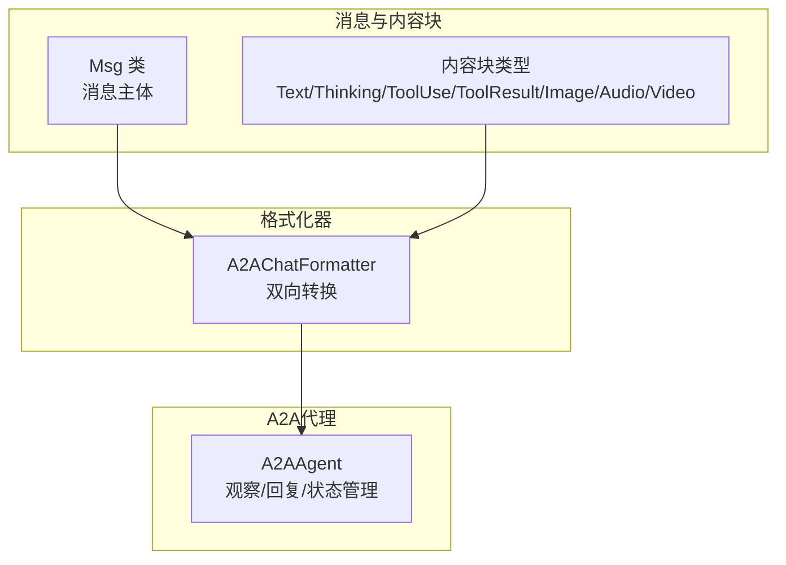
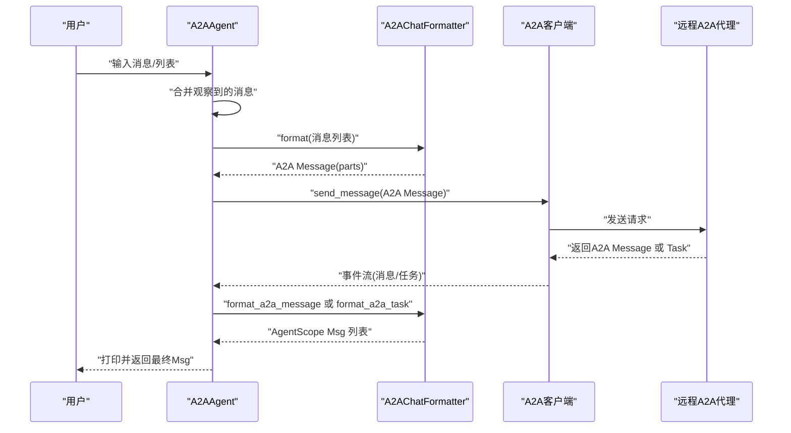
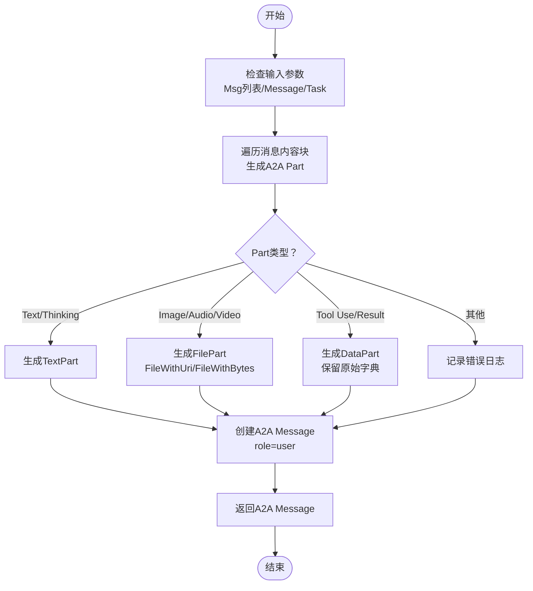
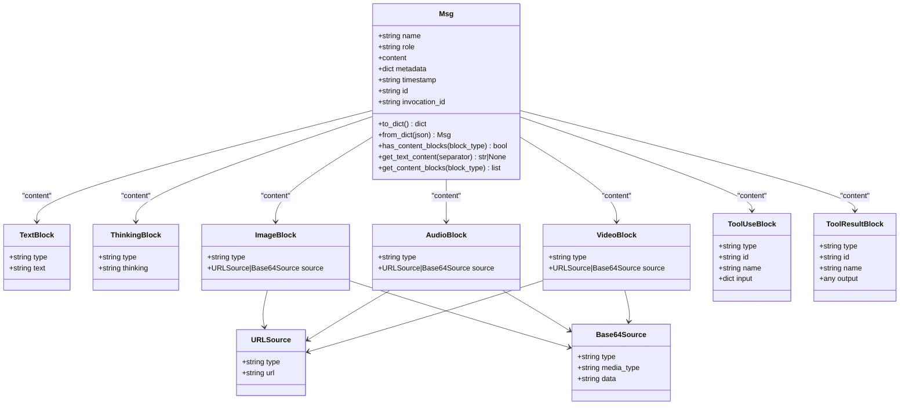
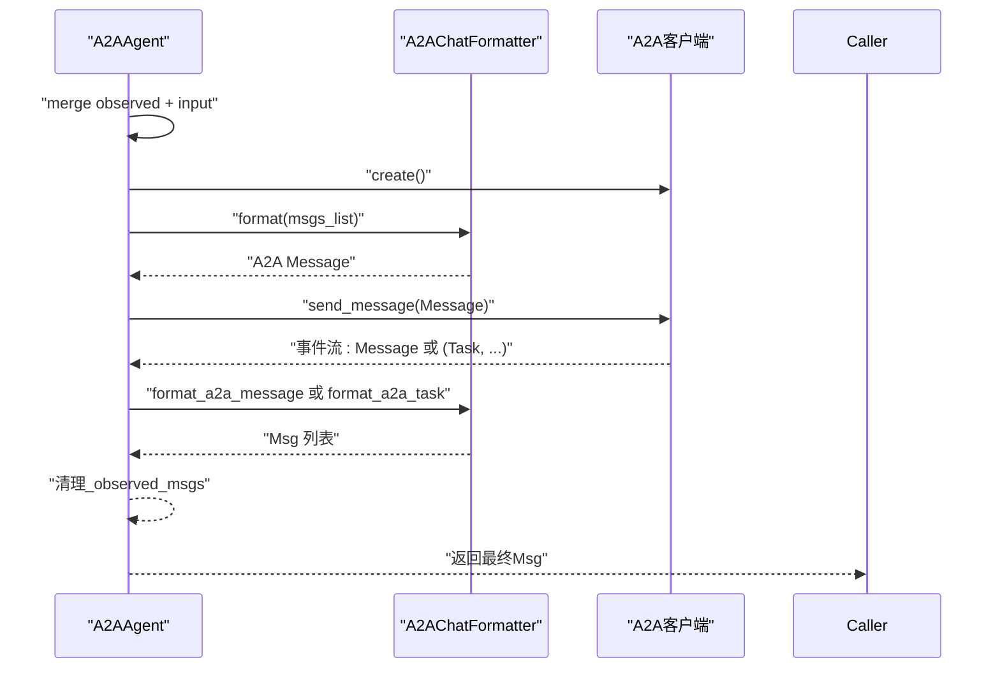
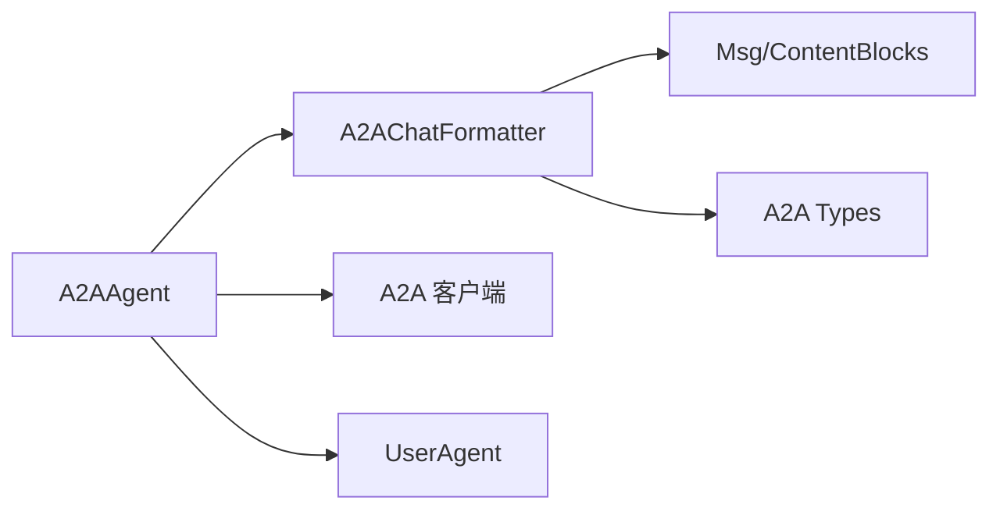

# 消息格式转换机制

<cite>
**本文引用的文件**
- [src/agentscope/formatter/_a2a_formatter.py](file://src/agentscope/formatter/_a2a_formatter.py)
- [src/agentscope/message/_message_base.py](file://src/agentscope/message/_message_base.py)
- [src/agentscope/message/_message_block.py](file://src/agentscope/message/_message_block.py)
- [src/agentscope/agent/_a2a_agent.py](file://src/agentscope/agent/_a2a_agent.py)
- [tests/formatter_a2a_test.py](file://tests/formatter_a2a_test.py)
- [examples/agent/a2a_agent/main.py](file://examples/agent/a2a_agent/main.py)
- [examples/agent/a2a_agent/agent_card.py](file://examples/agent/a2a_agent/agent_card.py)
</cite>

## 目录
1. [简介](#简介)
2. [项目结构](#项目结构)
3. [核心组件](#核心组件)
4. [架构总览](#架构总览)
5. [详细组件分析](#详细组件分析)
6. [依赖关系分析](#依赖关系分析)
7. [性能考量](#性能考量)
8. [故障排查指南](#故障排查指南)
9. [结论](#结论)
10. [附录](#附录)

## 简介
本文件聚焦于A2AAgent中消息格式的双向转换机制，系统性说明A2AChatFormatter如何将AgentScope的Msg对象转换为符合A2A协议的Message对象，以及如何将接收到的A2A消息转换回AgentScope的消息格式。重点覆盖：
- parts字段的结构与内容块（content blocks）的序列化与反序列化过程
- 元数据（metadata）在转换中的映射规则
- 文本、工具调用、思考块、多模态媒体（图像/音频/视频）等类型的内容转换逻辑
- 转换过程中的错误处理与边界条件

## 项目结构
围绕消息格式转换的相关模块与文件如下：
- 格式化器：A2AChatFormatter负责双向转换
- 消息模型：Msg类及内容块类型定义
- A2A代理：A2AAgent使用格式化器进行消息转换与通信
- 测试与示例：验证转换逻辑与典型用例

图表来源
- [src/agentscope/formatter/_a2a_formatter.py](file://src/agentscope/formatter/_a2a_formatter.py#L31-L365)
- [src/agentscope/message/_message_base.py](file://src/agentscope/message/_message_base.py#L21-L242)
- [src/agentscope/message/_message_block.py](file://src/agentscope/message/_message_block.py#L1-L127)
- [src/agentscope/agent/_a2a_agent.py](file://src/agentscope/agent/_a2a_agent.py#L1-L289)

章节来源
- [src/agentscope/formatter/_a2a_formatter.py](file://src/agentscope/formatter/_a2a_formatter.py#L31-L365)
- [src/agentscope/message/_message_base.py](file://src/agentscope/message/_message_base.py#L21-L242)
- [src/agentscope/message/_message_block.py](file://src/agentscope/message/_message_block.py#L1-L127)
- [src/agentscope/agent/_a2a_agent.py](file://src/agentscope/agent/_a2a_agent.py#L1-L289)

## 核心组件
- A2AChatFormatter：实现从AgentScope Msg到A2A Message的序列化，以及从A2A Message/Task到AgentScope Msg的反序列化。
- Msg：AgentScope消息主体，包含name、role、content（字符串或内容块列表）、metadata、时间戳等。
- 内容块类型：TextBlock、ThinkingBlock、ToolUseBlock、ToolResultBlock、ImageBlock、AudioBlock、VideoBlock及其源类型（URLSource/Base64Source）。
- A2AAgent：封装A2A客户端，负责观察消息、合并上下文、调用格式化器进行转换并打印响应。

章节来源
- [src/agentscope/formatter/_a2a_formatter.py](file://src/agentscope/formatter/_a2a_formatter.py#L31-L365)
- [src/agentscope/message/_message_base.py](file://src/agentscope/message/_message_base.py#L21-L242)
- [src/agentscope/message/_message_block.py](file://src/agentscope/message/_message_block.py#L1-L127)
- [src/agentscope/agent/_a2a_agent.py](file://src/agentscope/agent/_a2a_agent.py#L1-L289)

## 架构总览
下图展示A2AAgent在一次交互中的消息转换流程，包括从本地消息到A2A消息的序列化，以及从A2A消息/任务到本地消息的反序列化。

图表来源
- [src/agentscope/agent/_a2a_agent.py](file://src/agentscope/agent/_a2a_agent.py#L177-L261)
- [src/agentscope/formatter/_a2a_formatter.py](file://src/agentscope/formatter/_a2a_formatter.py#L35-L146)
- [src/agentscope/formatter/_a2a_formatter.py](file://src/agentscope/formatter/_a2a_formatter.py#L147-L272)

## 详细组件分析

### A2AChatFormatter：双向转换实现
- 序列化（AgentScope Msg → A2A Message）
  - 输入：Msg列表（多条消息会被合并为单个A2A Message，角色统一为user）
  - 处理：遍历每条消息的内容块，根据类型生成A2A Part：
    - 文本/思考：映射为TextPart
    - 图像/音频/视频：根据source类型映射为FileWithUri或FileWithBytes
    - 工具调用/结果：映射为DataPart，保留原始数据字典
    - 其他不支持类型：记录错误日志
  - 输出：A2A Message（含message_id、role=user、parts）

- 反序列化（A2A Message → AgentScope Msg）
  - 输入：发送者名称、A2A Message
  - 处理：逐个Part转换为ContentBlock：
    - TextPart → TextBlock
    - FilePart(FileWithUri) → Image/Audio/Video Block（通过mime类型或URI推断类型）
    - FilePart(FileWithBytes) → Image/Audio/Video Block（通过mime类型推断）
    - DataPart：
      - 若包含“type/tool_use/name/input/id”且type为tool_use → ToolUseBlock
      - 若包含“type/tool_result/name/output/id”且type为tool_result → ToolResultBlock
      - 否则降级为TextBlock（将data转为字符串）
  - 角色映射：A2A Role.user → AgentScope role=user；Role.agent → role=assistant；其他角色抛出异常
  - 输出：AgentScope Msg（name、role、content、metadata=None）

- 反序列化（A2A Task → AgentScope Msg 列表）
  - 将Task.status.message转换为Msg，再与Task.artifacts中的每个Artifact.parts逐一转换为ContentBlock
  - 合并策略：若最后一条Msg与当前Msg角色相同，则将内容追加到最后一项；否则新建Msg
  - Artifact.metadata会设置到对应Msg的metadata字段

- 类型推断与错误处理
  - _guess_type：根据URI或MIME类型推断媒体类型（image/video/audio/unknown），当两者都为空时抛出异常
  - 不支持的Part/Source类型：抛出异常或记录错误日志
  - 不支持的角色：抛出异常

图表来源
- [src/agentscope/formatter/_a2a_formatter.py](file://src/agentscope/formatter/_a2a_formatter.py#L35-L146)

章节来源
- [src/agentscope/formatter/_a2a_formatter.py](file://src/agentscope/formatter/_a2a_formatter.py#L35-L146)
- [src/agentscope/formatter/_a2a_formatter.py](file://src/agentscope/formatter/_a2a_formatter.py#L147-L272)
- [src/agentscope/formatter/_a2a_formatter.py](file://src/agentscope/formatter/_a2a_formatter.py#L273-L365)

### Msg与内容块：数据结构与序列化
- Msg
  - 字段：name、role（user/assistant/system）、content（字符串或内容块列表）、metadata、timestamp、id、invocation_id
  - 方法：to_dict/from_dict、has_content_blocks、get_text_content、get_content_blocks（按类型筛选）
- 内容块类型
  - TextBlock：type=text，text
  - ThinkingBlock：type=thinking，thinking
  - ToolUseBlock：type=tool_use，id、name、input
  - ToolResultBlock：type=tool_result，id、name、output
  - ImageBlock/AudioBlock/VideoBlock：type=image/audio/video，source为URLSource或Base64Source
  - Source类型：
    - URLSource：type=url，url
    - Base64Source：type=base64，media_type，data

图表来源
- [src/agentscope/message/_message_base.py](file://src/agentscope/message/_message_base.py#L21-L242)
- [src/agentscope/message/_message_block.py](file://src/agentscope/message/_message_block.py#L1-L127)

章节来源
- [src/agentscope/message/_message_base.py](file://src/agentscope/message/_message_base.py#L21-L242)
- [src/agentscope/message/_message_block.py](file://src/agentscope/message/_message_block.py#L1-L127)

### A2AAgent：集成与调用链
- observe：接收消息但不回复，存储到内部_observed_msgs，用于后续reply合并
- reply：合并观察消息与输入消息，创建A2A客户端，调用formatter.format序列化为A2A Message，发送并流式接收响应；对A2A Message调用format_a2a_message，对Task调用format_a2a_task，最终返回最后一个Msg
- 状态管理：state_dict/load_state_dict用于持久化_observed_msgs

图表来源
- [src/agentscope/agent/_a2a_agent.py](file://src/agentscope/agent/_a2a_agent.py#L154-L261)
- [src/agentscope/formatter/_a2a_formatter.py](file://src/agentscope/formatter/_a2a_formatter.py#L35-L146)
- [src/agentscope/formatter/_a2a_formatter.py](file://src/agentscope/formatter/_a2a_formatter.py#L147-L272)

章节来源
- [src/agentscope/agent/_a2a_agent.py](file://src/agentscope/agent/_a2a_agent.py#L154-L261)

## 依赖关系分析
- A2AChatFormatter依赖：
  - AgentScope消息与内容块类型（Msg、TextBlock、ThinkingBlock、ToolUseBlock、ToolResultBlock、ImageBlock、AudioBlock、VideoBlock、URLSource、Base64Source）
  - A2A协议类型（Message、Part、TextPart、FilePart、FileWithUri、FileWithBytes、DataPart、Role、Task、Artifact、TaskStatus）
- A2AAgent依赖：
  - A2AChatFormatter进行消息转换
  - A2A客户端（ClientFactory/Client）进行网络通信
  - 用户代理UserAgent进行交互演示

图表来源
- [src/agentscope/formatter/_a2a_formatter.py](file://src/agentscope/formatter/_a2a_formatter.py#L31-L365)
- [src/agentscope/agent/_a2a_agent.py](file://src/agentscope/agent/_a2a_agent.py#L1-L289)

章节来源
- [src/agentscope/formatter/_a2a_formatter.py](file://src/agentscope/formatter/_a2a_formatter.py#L31-L365)
- [src/agentscope/agent/_a2a_agent.py](file://src/agentscope/agent/_a2a_agent.py#L1-L289)

## 性能考量
- 遍历与合并：format阶段对每条消息的所有内容块进行线性扫描，复杂度O(N)（N为内容块总数）
- 类型判断与推断：_guess_type基于MIME类型或URI推断，开销极低
- 数据复制：DataPart直接透传字典，避免额外序列化/反序列化成本
- 异步流式处理：A2A客户端返回事件流，A2AAgent边接收边转换，降低整体等待时间

[本节提供一般性建议，无需特定文件来源]

## 故障排查指南
- 常见错误与定位
  - 不支持的Block类型：在序列化阶段会记录错误日志；请确认内容块类型是否在支持范围内
  - 不支持的Part/Source类型：在反序列化阶段抛出异常；检查A2A Part根类型与文件类型
  - 不支持的角色：A2A Message的role必须为user或agent；否则抛出异常
  - URI与MIME均为空：_guess_type会抛出异常；请确保至少提供其中之一
  - 无响应：若未收到任何响应，reply会抛出异常；检查网络连接与远程代理状态
- 单元测试参考
  - 测试覆盖了从AgentScope到A2A的序列化、从A2A消息到AgentScope的反序列化、从A2A任务到AgentScope消息的反序列化，以及未知DataPart的降级处理
- 示例运行
  - 使用示例脚本启动A2A代理与用户交互，便于快速验证转换效果

章节来源
- [src/agentscope/formatter/_a2a_formatter.py](file://src/agentscope/formatter/_a2a_formatter.py#L133-L146)
- [src/agentscope/formatter/_a2a_formatter.py](file://src/agentscope/formatter/_a2a_formatter.py#L170-L184)
- [src/agentscope/formatter/_a2a_formatter.py](file://src/agentscope/formatter/_a2a_formatter.py#L203-L223)
- [src/agentscope/formatter/_a2a_formatter.py](file://src/agentscope/formatter/_a2a_formatter.py#L361-L365)
- [src/agentscope/agent/_a2a_agent.py](file://src/agentscope/agent/_a2a_agent.py#L255-L261)
- [tests/formatter_a2a_test.py](file://tests/formatter_a2a_test.py#L160-L248)
- [tests/formatter_a2a_test.py](file://tests/formatter_a2a_test.py#L249-L299)
- [tests/formatter_a2a_test.py](file://tests/formatter_a2a_test.py#L300-L405)
- [examples/agent/a2a_agent/main.py](file://examples/agent/a2a_agent/main.py#L1-L29)
- [examples/agent/a2a_agent/agent_card.py](file://examples/agent/a2a_agent/agent_card.py#L1-L38)

## 结论
A2AChatFormatter实现了AgentScope与A2A协议之间的高保真双向转换，覆盖文本、思考、工具调用、多模态媒体等主流内容类型，并在错误处理与类型推断方面提供了稳健的边界条件保障。A2AAgent通过整合格式化器与A2A客户端，构建了完整的消息往返链路，适用于聊天场景下的Agent间通信。

[本节为总结性内容，无需特定文件来源]

## 附录
- 关键路径参考
  - 序列化入口：[format](file://src/agentscope/formatter/_a2a_formatter.py#L35-L146)
  - 反序列化消息：[format_a2a_message](file://src/agentscope/formatter/_a2a_formatter.py#L147-L184)
  - 反序列化任务：[format_a2a_task](file://src/agentscope/formatter/_a2a_formatter.py#L224-L272)
  - 单Part转换：[_format_a2a_part](file://src/agentscope/formatter/_a2a_formatter.py#L273-L365)
  - 类型推断：[_guess_type](file://src/agentscope/formatter/_a2a_formatter.py#L187-L223)
  - 消息主体：[Msg](file://src/agentscope/message/_message_base.py#L21-L242)
  - 内容块类型：[内容块定义](file://src/agentscope/message/_message_block.py#L1-L127)
  - 代理集成：[A2AAgent](file://src/agentscope/agent/_a2a_agent.py#L1-L289)
  - 测试用例：[formatter_a2a_test](file://tests/formatter_a2a_test.py#L1-L405)
  - 示例脚本：[main.py](file://examples/agent/a2a_agent/main.py#L1-L29)，[agent_card.py](file://examples/agent/a2a_agent/agent_card.py#L1-L38)