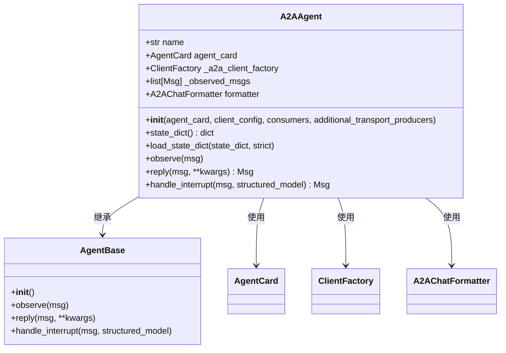
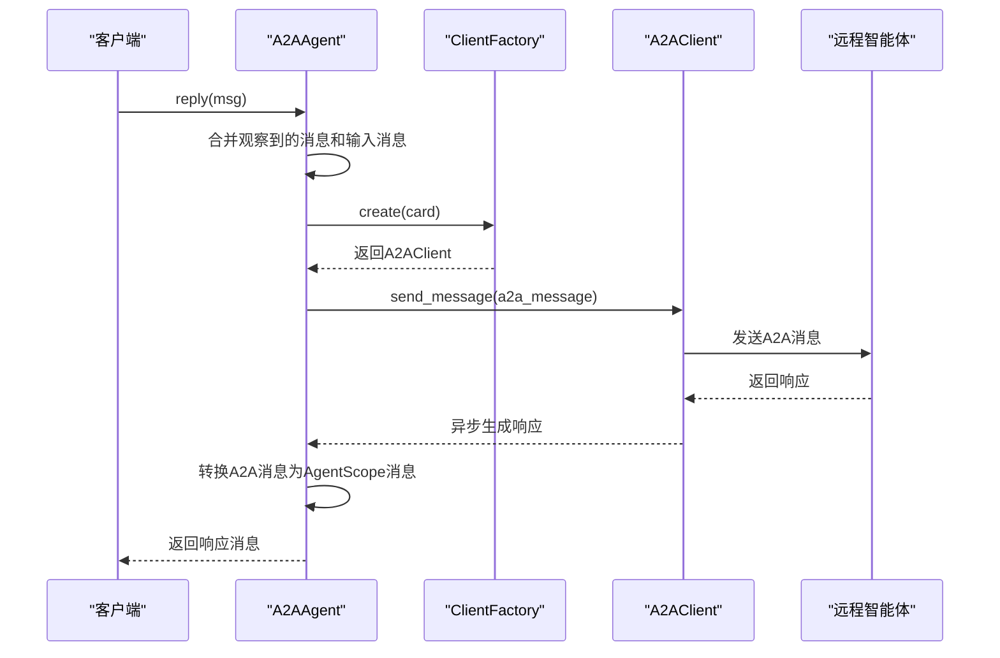
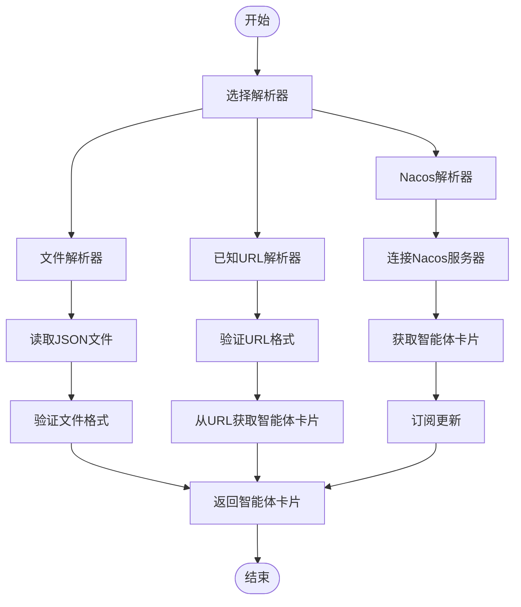

# A2A智能体

<cite>
**本文档引用的文件**
- [A2AAgent](file://src/agentscope/agent/_a2a_agent.py)
- [agent_card.py](file://examples/agent/a2a_agent/agent_card.py)
- [main.py](file://examples/agent/a2a_agent/main.py)
- [setup_a2a_server.py](file://examples/agent/a2a_agent/setup_a2a_server.py)
- [A2AChatFormatter](file://src/agentscope/formatter/_a2a_formatter.py)
- [FileAgentCardResolver](file://src/agentscope/a2a/_file_resolver.py)
- [WellKnownAgentCardResolver](file://src/agentscope/a2a/_well_known_resolver.py)
- [NacosAgentCardResolver](file://src/agentscope/a2a/_nacos_resolver.py)
</cite>

## 目录
1. [简介](#简介)
2. [核心架构与实现原理](#核心架构与实现原理)
3. [智能体间通信与协作机制](#智能体间通信与协作机制)
4. [配置与部署方法](#配置与部署方法)
5. [智能体卡片（Agent Card）](#智能体卡片agent-card)
6. [A2A协议实现细节](#a2a协议实现细节)
7. [消息传递模式](#消息传递模式)
8. [错误处理策略](#错误处理策略)
9. [性能优化建议](#性能优化建议)
10. [常见部署问题解决方案](#常见部署问题解决方案)

## 简介

A2A智能体是AgentScope框架中的一个核心组件，它实现了A2A（Agent-to-Agent）协议，使得智能体之间能够进行高效、标准化的通信和协作。该协议支持分布式环境下的智能体交互，通过服务发现和解析机制，实现了智能体间的动态连接和通信。A2A智能体不仅支持基本的文本消息传递，还支持复杂的任务处理和状态管理，为构建多智能体系统提供了强大的基础。

**Section sources**
- [A2AAgent](file://src/agentscope/agent/_a2a_agent.py#L1-L289)
- [README.md](file://README.md#L56-L65)

## 核心架构与实现原理

A2A智能体的核心架构基于异步通信模型，通过`A2AAgent`类实现。该类继承自`AgentBase`，并实现了与远程智能体的通信功能。`A2AAgent`的主要职责包括：

1. **初始化**：通过`__init__`方法接收`agent_card`参数，该参数包含了远程智能体的URL、能力等信息。同时，可以配置客户端配置、消费者列表和额外的传输生产者。
2. **消息转换**：使用`A2AChatFormatter`将AgentScope的消息格式转换为A2A协议的消息格式，反之亦然。这种双向转换确保了不同系统之间的兼容性。
3. **任务生命周期管理**：支持任务的创建、执行和状态跟踪。通过`reply`方法发送消息并接收响应，支持流式和轮询两种模式。
4. **状态管理**：通过`state_dict`和`load_state_dict`方法管理智能体的状态，确保在分布式环境中的一致性和可恢复性。



**Diagram sources**
- [A2AAgent](file://src/agentscope/agent/_a2a_agent.py#L29-L289)

**Section sources**
- [A2AAgent](file://src/agentscope/agent/_a2a_agent.py#L29-L289)

## 智能体间通信与协作机制

A2A智能体通过`reply`方法实现与远程智能体的通信。该方法首先合并观察到的消息和输入消息，然后通过`_a2a_client_factory`创建A2A客户端，将消息转换为A2A协议格式并发送。接收响应后，再将A2A消息转换回AgentScope消息格式。整个过程支持流式处理，确保了实时性和高效性。



**Diagram sources**
- [A2AAgent](file://src/agentscope/agent/_a2a_agent.py#L177-L259)

**Section sources**
- [A2AAgent](file://src/agentscope/agent/_a2a_agent.py#L177-L259)

## 配置与部署方法

A2A智能体的配置和部署主要涉及服务发现和解析机制。AgentScope提供了多种解析器来获取智能体卡片（Agent Card），包括文件解析器、已知URL解析器和Nacos解析器。

### 文件解析器

`FileAgentCardResolver`从JSON文件中加载智能体卡片。文件路径在初始化时指定，解析器会读取文件内容并验证其格式。

```python
resolver = FileAgentCardResolver(file_path="./agent_card.json")
agent_card = await resolver.get_agent_card()
```

### 已知URL解析器

`WellKnownAgentCardResolver`从预定义的URL中加载智能体卡片。该解析器支持基本的URL验证和错误处理。

```python
resolver = WellKnownAgentCardResolver(base_url="http://localhost:8000")
agent_card = await resolver.get_agent_card()
```

### Nacos解析器

`NacosAgentCardResolver`从Nacos服务器获取智能体卡片，并订阅更新。Nacos是一个动态服务发现、配置和管理平台，适用于云原生应用。

```python
resolver = NacosAgentCardResolver(
    remote_agent_name="Friday",
    nacos_client_config=nacos_client_config,
    version="1.0.0"
)
agent_card = await resolver.get_agent_card()
```



**Diagram sources**
- [FileAgentCardResolver](file://src/agentscope/a2a/_file_resolver.py#L15-L79)
- [WellKnownAgentCardResolver](file://src/agentscope/a2a/_well_known_resolver.py#L15-L91)
- [NacosAgentCardResolver](file://src/agentscope/a2a/_nacos_resolver.py#L17-L99)

**Section sources**
- [FileAgentCardResolver](file://src/agentscope/a2a/_file_resolver.py#L15-L79)
- [WellKnownAgentCardResolver](file://src/agentscope/a2a/_well_known_resolver.py#L15-L91)
- [NacosAgentCardResolver](file://src/agentscope/a2a/_nacos_resolver.py#L17-L99)

## 智能体卡片（Agent Card）

智能体卡片（Agent Card）是A2A智能体的核心配置文件，包含了智能体的基本信息和能力。一个典型的智能体卡片包括以下字段：

- `name`：智能体的名称
- `description`：智能体的描述
- `url`：智能体的URL
- `version`：智能体的版本
- `capabilities`：智能体的能力，如推送通知、状态转换历史、流式处理等
- `default_input_modes`：默认输入模式
- `default_output_modes`：默认输出模式
- `skills`：智能体的技能列表

```json
{
    "name": "Friday",
    "description": "A simple ReAct agent that handles input queries",
    "url": "http://localhost:8000",
    "version": "1.0.0",
    "capabilities": {
        "push_notifications": false,
        "state_transition_history": true,
        "streaming": true
    },
    "default_input_modes": ["text/plain"],
    "default_output_modes": ["text/plain"],
    "skills": [
        {
            "name": "execute_python_code",
            "id": "execute_python_code",
            "description": "Execute Python code snippets.",
            "tags": ["code_execution"]
        },
        {
            "name": "execute_shell_command",
            "id": "execute_shell_command",
            "description": "Execute shell commands on the server.",
            "tags": ["code_execution"]
        },
        {
            "name": "view_text_file",
            "id": "view_text_file",
            "description": "View the content of a text file on the server.",
            "tags": ["file_viewing"]
        }
    ]
}
```

**Section sources**
- [agent_card.py](file://examples/agent/a2a_agent/agent_card.py#L5-L37)

## A2A协议实现细节

A2A协议的实现细节主要体现在消息格式和通信流程上。消息格式包括文本、文件、数据等多种类型，每种类型都有特定的结构和处理方式。通信流程则通过异步方法实现，确保了高并发和低延迟。

### 消息格式

A2A消息由多个部分组成，每个部分可以是文本、文件或数据。文本部分包含纯文本内容，文件部分包含文件的URI或字节流，数据部分包含结构化数据。

### 通信流程

1. **初始化**：客户端创建`A2AAgent`实例，传入智能体卡片和其他配置。
2. **发送消息**：调用`reply`方法，传入消息内容。`A2AAgent`将消息转换为A2A格式，并通过`A2AClient`发送。
3. **接收响应**：`A2AClient`异步接收响应，`A2AAgent`将响应转换回AgentScope格式，并返回给客户端。

**Section sources**
- [A2AAgent](file://src/agentscope/agent/_a2a_agent.py#L38-L46)
- [A2AChatFormatter](file://src/agentscope/formatter/_a2a_formatter.py#L31-L365)

## 消息传递模式

A2A智能体支持多种消息传递模式，包括单向消息、双向消息和流式消息。单向消息适用于简单的请求-响应场景，双向消息适用于需要持续交互的场景，流式消息适用于大数据量传输的场景。

### 单向消息

客户端发送一条消息，等待服务器返回响应。这是最常见的消息传递模式。

### 双向消息

客户端和服务器之间可以互相发送消息，适用于需要持续交互的场景，如聊天机器人。

### 流式消息

消息以流的形式传输，适用于大数据量传输的场景，如视频流或音频流。

**Section sources**
- [A2AAgent](file://src/agentscope/agent/_a2a_agent.py#L177-L259)
- [A2AChatFormatter](file://src/agentscope/formatter/_a2a_formatter.py#L31-L365)

## 错误处理策略

A2A智能体在通信过程中可能会遇到各种错误，如网络错误、解析错误等。为了确保系统的稳定性和可靠性，A2A智能体采用了多种错误处理策略。

### 异常捕获

在`reply`方法中，使用`try-except`语句捕获可能的异常，并返回错误消息。

### 重试机制

对于网络错误，可以配置重试机制，尝试重新发送消息。

### 日志记录

使用日志记录工具记录错误信息，便于调试和监控。

```python
try:
    response = await self._a2a_client_factory.create(card=self.agent_card).send_message(a2a_message)
except Exception as e:
    logger.error(f"Failed to send message: {e}")
    return Msg(name=self.name, content="An error occurred during communication.", role="assistant")
```

**Section sources**
- [A2AAgent](file://src/agentscope/agent/_a2a_agent.py#L232-L259)
- [WellKnownAgentCardResolver](file://src/agentscope/a2a/_well_known_resolver.py#L80-L90)

## 性能优化建议

为了提高A2A智能体的性能，可以采取以下优化措施：

1. **异步处理**：充分利用异步编程的优势，减少等待时间，提高并发处理能力。
2. **缓存机制**：对于频繁访问的数据，可以使用缓存机制，减少网络请求。
3. **连接池**：使用连接池管理HTTP客户端连接，减少连接建立和关闭的开销。
4. **压缩传输**：对于大数据量传输，可以使用压缩技术，减少传输时间和带宽消耗。

**Section sources**
- [A2AAgent](file://src/agentscope/agent/_a2a_agent.py#L90-L98)
- [WellKnownAgentCardResolver](file://src/agentscope/a2a/_well_known_resolver.py#L69-L71)

## 常见部署问题解决方案

在部署A2A智能体时，可能会遇到一些常见问题，如网络连接问题、配置错误等。以下是这些问题的解决方案：

### 网络连接问题

- **检查URL**：确保智能体的URL正确无误。
- **防火墙设置**：检查防火墙设置，确保端口开放。
- **DNS解析**：确保DNS解析正常，可以使用`ping`命令测试。

### 配置错误

- **验证配置文件**：确保智能体卡片的JSON格式正确，所有必需字段都已填写。
- **环境变量**：确保必要的环境变量已设置，如API密钥。

### 依赖问题

- **安装依赖**：确保所有依赖库已正确安装，特别是Nacos SDK。
- **版本兼容**：检查依赖库的版本是否与A2A智能体兼容。

**Section sources**
- [setup_a2a_server.py](file://examples/agent/a2a_agent/setup_a2a_server.py#L1-L132)
- [NacosAgentCardResolver](file://src/agentscope/a2a/_nacos_resolver.py#L69-L73)