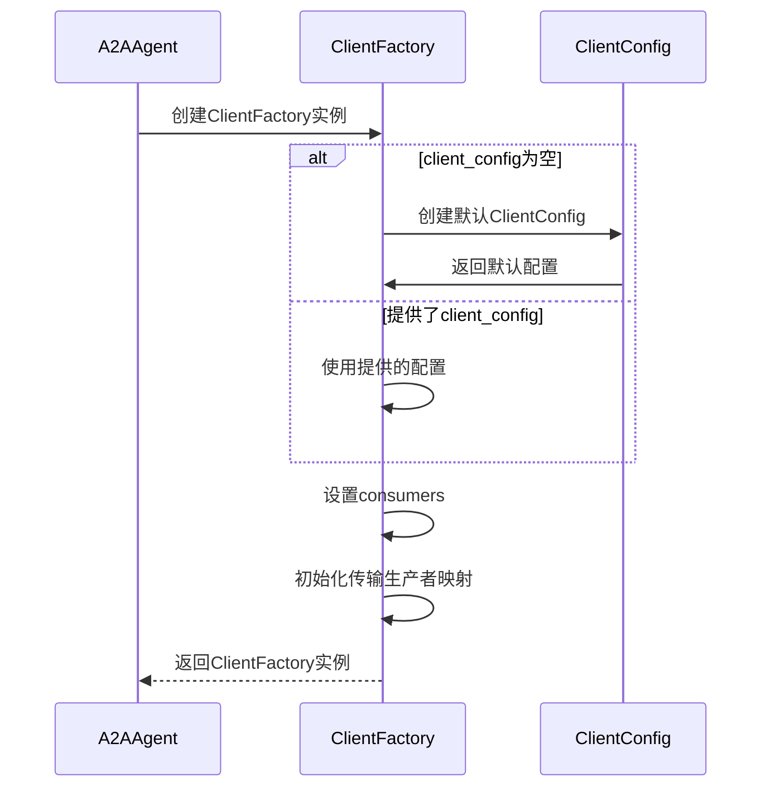
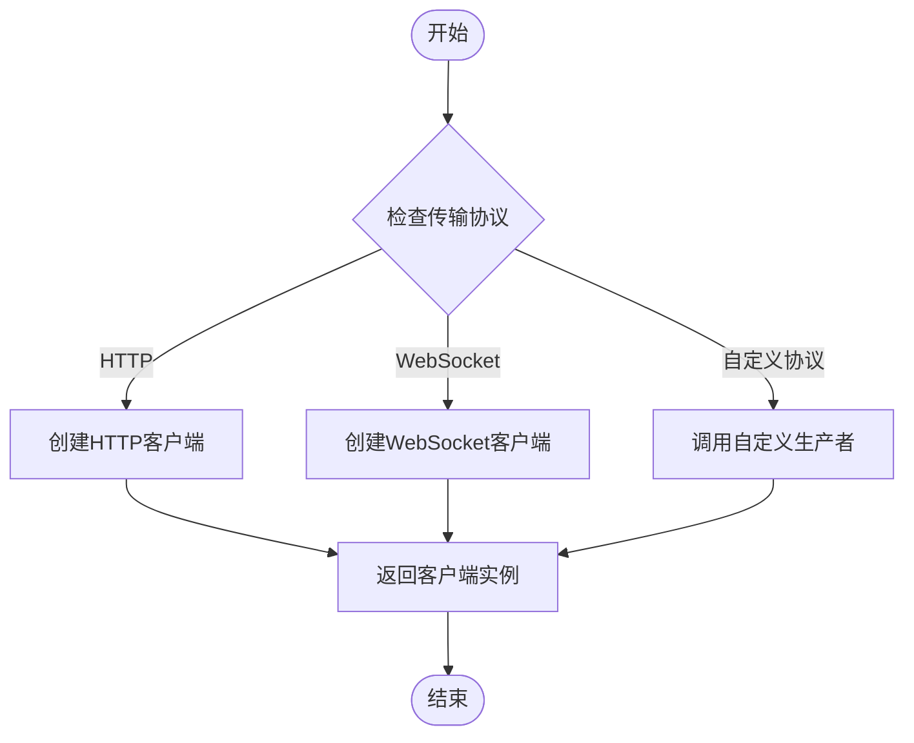
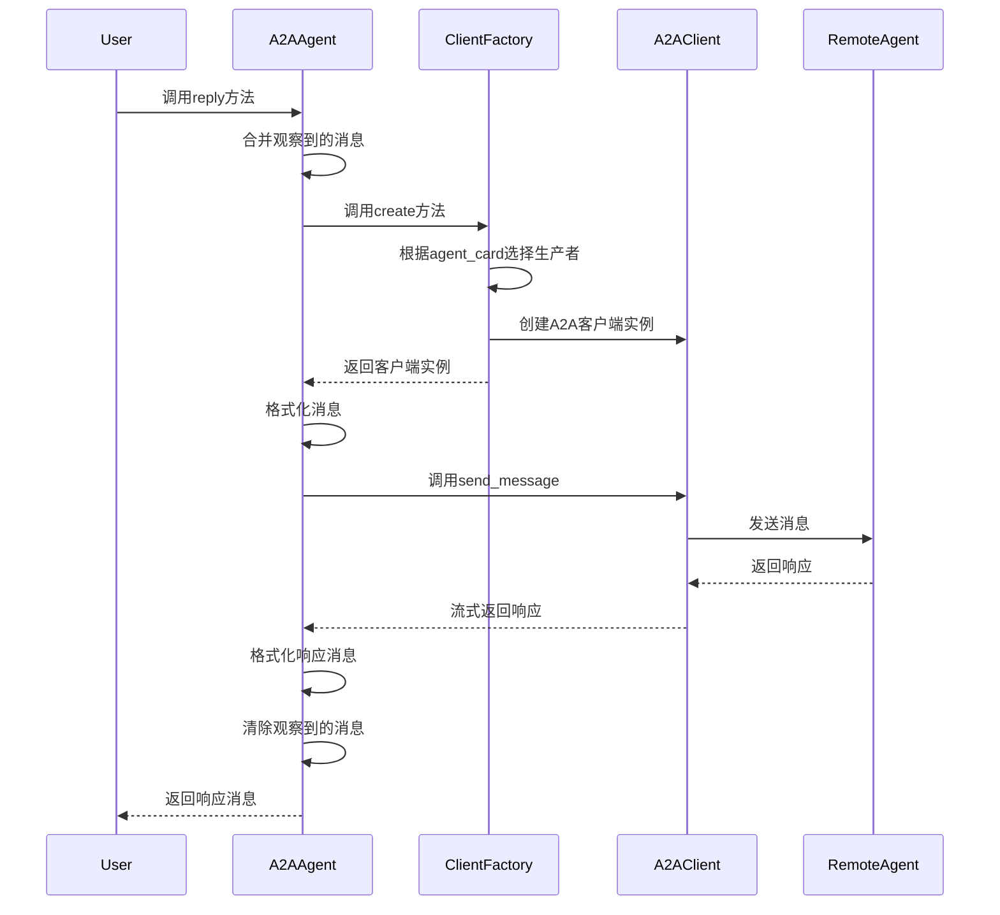

# A2A客户端工厂

<cite>
**本文档中引用的文件**  
- [src\agentscope\agent\_a2a_agent.py](file://src/agentscope/agent/_a2a_agent.py)
- [src\agentscope\formatter\_a2a_formatter.py](file://src/agentscope/formatter/_a2a_formatter.py)
- [tests\a2a_agent_test.py](file://tests/a2a_agent_test.py)
</cite>

## 目录
1. [简介](#简介)
2. [A2AAgent中的_a2a_client_factory字段](#a2aagent中的_a2a_client_factory字段)
3. [ClientFactory的初始化过程](#clientfactory的初始化过程)
4. [传输协议生产者的管理](#传输协议生产者的管理)
5. [reply方法中的客户端工厂调用流程](#reply方法中的客户端工厂调用流程)
6. [错误处理机制](#错误处理机制)
7. [性能优化建议](#性能优化建议)

## 简介
A2A（Agent-to-Agent）协议为不同AI智能体之间的互操作通信提供了开放标准。在AgentScope框架中，A2AAgent类通过客户端工厂模式实现与远程智能体的通信。本文档深入解析A2A客户端工厂的核心机制，包括其在A2AAgent中的作用、初始化过程、传输协议管理以及调用流程。

## A2AAgent中的_a2a_client_factory字段

`_a2a_client_factory`字段是A2AAgent类中的核心组件，负责创建与远程智能体通信的客户端实例。该字段在A2AAgent初始化时被创建，并在`reply`方法中用于根据agent_card创建相应的A2A客户端。

`_a2a_client_factory`的主要作用包括：
- 封装客户端创建逻辑，实现创建者与使用者的解耦
- 管理客户端配置、消费者和传输生产者
- 根据远程智能体的agent_card信息动态创建合适的客户端实例
- 支持多种传输协议的扩展

该字段的生命周期与A2AAgent实例绑定，在A2AAgent初始化时创建，在A2AAgent销毁时释放。

**Section sources**
- [src\agentscope\agent\_a2a_agent.py](file://src/agentscope/agent/_a2a_agent.py#L88-L107)

## ClientFactory的初始化过程

ClientFactory的初始化过程在A2AAgent的构造函数中完成，涉及client_config、consumers和additional_transport_producers三个关键参数的配置。



**Diagram sources**
- [src\agentscope\agent\_a2a_agent.py](file://src/agentscope/agent/_a2a_agent.py#L90-L98)

### client_config参数配置

`client_config`参数用于配置A2A客户端的基本行为，包括HTTP客户端配置、超时设置等。如果未提供此参数，系统将创建一个包含默认配置的ClientConfig实例：

- 使用httpx.AsyncClient作为HTTP客户端
- 设置600秒的超时时间
- 配置适当的HTTP头信息

### consumers参数配置

`consumers`参数是一个消费者列表，用于处理A2A客户端事件。这些消费者可以拦截请求/响应流，实现日志记录、指标收集和安全检查等功能。每个消费者都实现了特定的事件处理接口，可以在通信的不同阶段执行自定义逻辑。

### additional_transport_producers参数配置

`additional_transport_producers`参数允许注册额外的传输生产者，以支持特定的传输协议。这是一个字典结构，键为传输协议标签，值为对应的传输生产者函数。这些生产者在初始化后通过`register`方法注册到客户端工厂中。

**Section sources**
- [src\agentscope\agent\_a2a_agent.py](file://src/agentscope/agent/_a2a_agent.py#L90-L107)

## 传输协议生产者的管理

客户端工厂通过传输生产者映射来管理不同传输协议的生产者。每个传输生产者是一个函数，负责根据agent_card和配置创建特定协议的客户端实例。



**Diagram sources**
- [src\agentscope\agent\_a2a_agent.py](file://src/agentscope/agent/_a2a_agent.py#L100-L106)

### 自定义传输生产者的注册

通过`additional_transport_producers`参数可以注册自定义传输生产者。以下是一个注册自定义传输生产者的示例：

```python
def custom_transport_producer(config, card):
    # 自定义传输协议的客户端创建逻辑
    return CustomClient(config, card)

# 在A2AAgent初始化时注册
agent = A2AAgent(
    agent_card=agent_card,
    additional_transport_producers={
        "custom_protocol": custom_transport_producer
    }
)
```

每个传输生产者必须接受两个参数：配置对象和agent_card，并返回一个实现了必要通信接口的客户端实例。

**Section sources**
- [src\agentscope\agent\_a2a_agent.py](file://src/agentscope/agent/_a2a_agent.py#L100-L106)

## reply方法中的客户端工厂调用流程

在A2AAgent的`reply`方法中，客户端工厂的调用流程如下：



**Diagram sources**
- [src\agentscope\agent\_a2a_agent.py](file://src/agentscope/agent/_a2a_agent.py#L225-L253)

调用流程的关键步骤包括：
1. 合并观察到的消息和输入消息
2. 通过客户端工厂的`create`方法创建A2A客户端实例
3. 使用A2AChatFormatter将消息格式化为A2A协议格式
4. 通过客户端发送消息并接收响应
5. 将响应消息格式化回AgentScope消息格式
6. 清除已处理的观察消息

客户端工厂根据agent_card中的信息选择合适的传输生产者来创建客户端实例，实现了对不同传输协议的透明支持。

**Section sources**
- [src\agentscope\agent\_a2a_agent.py](file://src/agentscope/agent/_a2a_agent.py#L225-L253)

## 错误处理机制

A2A客户端工厂和A2AAgent实现了一套完整的错误处理机制：

- 在初始化阶段验证agent_card类型，确保输入的有效性
- 在`reply`方法中检查不支持的参数（如structured_model）
- 处理通信过程中的网络错误和协议错误
- 当没有收到响应时抛出明确的异常
- 通过消费者机制支持自定义错误处理逻辑

错误处理遵循分层原则，底层处理具体的技术异常，上层提供有意义的业务异常信息。同时，系统保留了扩展点，允许通过消费者和自定义生产者添加特定的错误处理逻辑。

**Section sources**
- [src\agentscope\agent\_a2a_agent.py](file://src/agentscope/agent/_a2a_agent.py#L258-L260)

## 性能优化建议

基于A2A客户端工厂的架构特点，提出以下性能优化建议：

1. **连接复用**：对于频繁通信的场景，考虑实现客户端连接池，避免重复创建和销毁客户端实例的开销。

2. **批量处理**：当需要发送多个消息时，尽量合并为单次调用，减少网络往返次数。

3. **异步流式处理**：充分利用A2A协议的流式特性，实现边接收边处理，提高响应速度。

4. **缓存机制**：对于不经常变化的agent_card信息，可以实现缓存机制，减少重复解析的开销。

5. **消费者优化**：合理配置消费者，避免过多的拦截处理影响通信性能。

6. **超时设置**：根据实际网络环境调整超时设置，平衡可靠性和响应速度。

通过合理应用这些优化策略，可以显著提升基于A2A客户端工厂的应用性能。

**Section sources**
- [src\agentscope\agent\_a2a_agent.py](file://src/agentscope/agent/_a2a_agent.py#L94-L95)