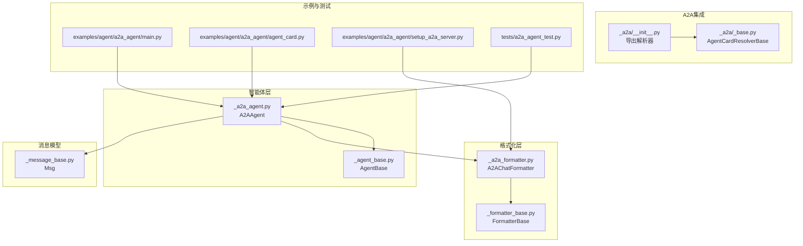
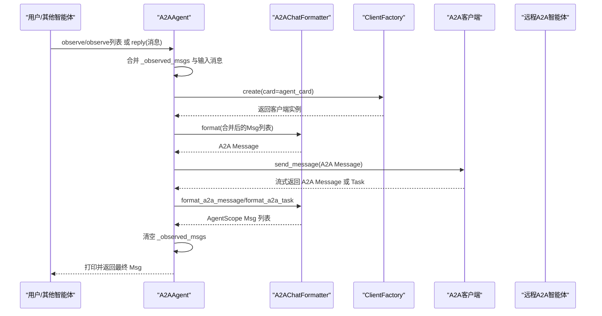
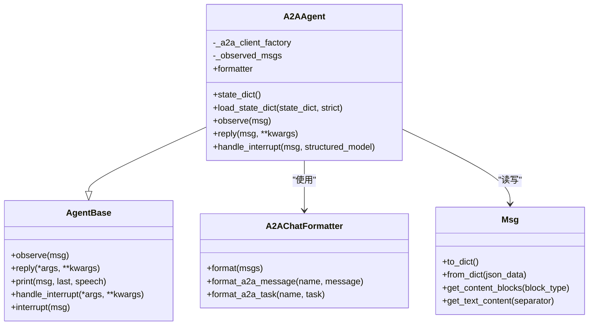
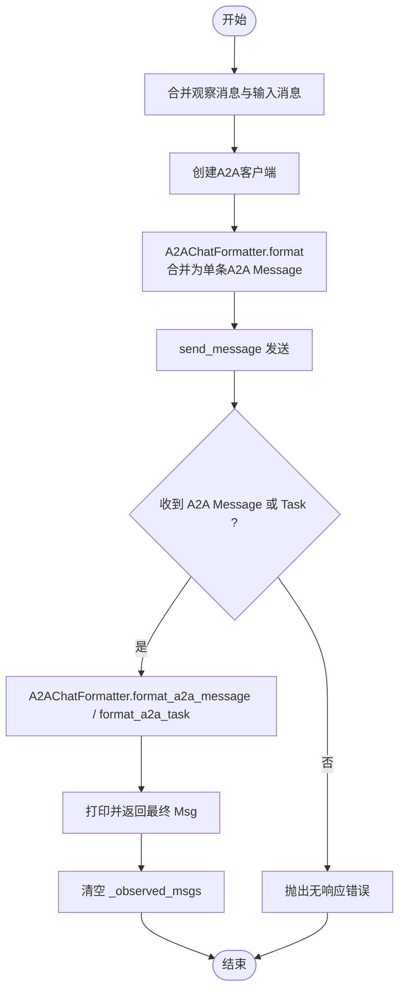

# A2A智能体架构设计

<cite>
**本文引用的文件列表**
- [A2A智能体实现](file://src/agentscope/agent/_a2a_agent.py)
- [智能体基类](file://src/agentscope/agent/_agent_base.py)
- [A2A消息格式化器](file://src/agentscope/formatter/_a2a_formatter.py)
- [格式化器基类](file://src/agentscope/formatter/_formatter_base.py)
- [A2A模块入口](file://src/agentscope/a2a/__init__.py)
- [A2A基础解析器](file://src/agentscope/a2a/_base.py)
- [消息基类](file://src/agentscope/message/_message_base.py)
- [A2A示例：主程序](file://examples/agent/a2a_agent/main.py)
- [A2A示例：代理卡定义](file://examples/agent/a2a_agent/agent_card.py)
- [A2A示例：服务器设置](file://examples/agent/a2a_agent/setup_a2a_server.py)
- [A2A单元测试：智能体行为](file://tests/a2a_agent_test.py)
</cite>

## 目录
1. [简介](#简介)
2. [项目结构](#项目结构)
3. [核心组件](#核心组件)
4. [架构总览](#架构总览)
5. [关键组件详解](#关键组件详解)
6. [依赖关系分析](#依赖关系分析)
7. [性能与可扩展性](#性能与可扩展性)
8. [故障排查指南](#故障排查指南)
9. [结论](#结论)
10. [附录](#附录)

## 简介
本设计文档围绕A2A智能体（Agent-to-Agent）在AgentScope中的实现进行系统化梳理，重点解释A2AAgent如何继承AgentBase，以及其核心组件_a2a_client_factory、formatter与_observed_msgs的设计目的与工作原理。文档还阐述了A2AAgent通过ClientFactory与远程智能体建立连接的方式，A2AChatFormatter在AgentScope消息与A2A协议消息之间的双向转换机制，智能体状态管理（state_dict/load_state_dict）的实现方式，以及如何利用_observed_msgs实现消息累积与上下文管理。最后结合示例与测试，说明A2AAgent与其他智能体的协作模式。

## 项目结构
A2A智能体相关代码主要位于以下路径：
- 智能体实现：src/agentscope/agent/_a2a_agent.py
- 智能体基类：src/agentscope/agent/_agent_base.py
- A2A消息格式化器：src/agentscope/formatter/_a2a_formatter.py
- 格式化器基类：src/agentscope/formatter/_formatter_base.py
- A2A模块入口与解析器：src/agentscope/a2a/__init__.py、src/agentscope/a2a/_base.py
- 示例与测试：examples/agent/a2a_agent/*、tests/a2a_agent_test.py
- 消息模型：src/agentscope/message/_message_base.py

图表来源
- [A2A智能体实现](file://src/agentscope/agent/_a2a_agent.py#L1-L289)
- [智能体基类](file://src/agentscope/agent/_agent_base.py#L1-L733)
- [A2A消息格式化器](file://src/agentscope/formatter/_a2a_formatter.py#L1-L365)
- [格式化器基类](file://src/agentscope/formatter/_formatter_base.py#L1-L130)
- [A2A模块入口](file://src/agentscope/a2a/__init__.py#L1-L15)
- [A2A基础解析器](file://src/agentscope/a2a/_base.py#L1-L26)
- [A2A示例：主程序](file://examples/agent/a2a_agent/main.py#L1-L29)
- [A2A示例：代理卡定义](file://examples/agent/a2a_agent/agent_card.py#L1-L38)
- [A2A示例：服务器设置](file://examples/agent/a2a_agent/setup_a2a_server.py#L80-L131)
- [A2A单元测试：智能体行为](file://tests/a2a_agent_test.py#L198-L253)
- [消息基类](file://src/agentscope/message/_message_base.py#L1-L242)

章节来源
- [A2A智能体实现](file://src/agentscope/agent/_a2a_agent.py#L1-L120)
- [A2A消息格式化器](file://src/agentscope/formatter/_a2a_formatter.py#L1-L120)
- [A2A模块入口](file://src/agentscope/a2a/__init__.py#L1-L15)
- [A2A基础解析器](file://src/agentscope/a2a/_base.py#L1-L26)

## 核心组件
- 继承关系：A2AAgent继承自AgentBase，复用其异步回调、钩子、中断处理、打印与订阅广播等通用能力。
- 客户端工厂：_a2a_client_factory用于按AgentCard动态创建A2A客户端，支持注册额外传输生产者以适配不同传输协议。
- 消息格式化器：formatter为A2AChatFormatter实例，负责将AgentScope的Msg对象转换为A2A协议的Message对象，以及反向转换。
- 观察消息缓存：_observed_msgs用于累积observe接收到的消息，在reply时与输入消息合并，完成后清空，确保上下文连续性。

章节来源
- [A2A智能体实现](file://src/agentscope/agent/_a2a_agent.py#L48-L113)
- [智能体基类](file://src/agentscope/agent/_agent_base.py#L140-L205)
- [A2A消息格式化器](file://src/agentscope/formatter/_a2a_formatter.py#L31-L146)

## 架构总览
A2AAgent通过ClientFactory与远程A2A智能体通信，消息在AgentScope与A2A协议之间由A2AChatFormatter完成双向转换。A2AChatFormatter将多条Msg合并为单条A2A Message，同时在接收端将A2A Message与Task转换回AgentScope Msg，支持工具调用/结果块与多媒体资源的映射。

图表来源
- [A2A智能体实现](file://src/agentscope/agent/_a2a_agent.py#L177-L261)
- [A2A消息格式化器](file://src/agentscope/formatter/_a2a_formatter.py#L147-L272)

## 关键组件详解

### 继承与初始化：A2AAgent如何继承AgentBase
- 继承AgentBase：A2AAgent通过super().__init__()初始化AgentBase的通用状态（如任务、钩子、打印队列、订阅者等），并在构造函数中完成A2A特有配置。
- 初始化要点：
  - 校验agent_card类型，提取name作为智能体名称。
  - 构造ClientFactory，支持传入ClientConfig或默认httpx.AsyncClient配置；支持注册additional_transport_producers以扩展传输能力。
  - 初始化A2AChatFormatter作为formatter。
  - 初始化_observed_msgs为空列表，用于累积observe的消息。

章节来源
- [A2A智能体实现](file://src/agentscope/agent/_a2a_agent.py#L48-L113)
- [智能体基类](file://src/agentscope/agent/_agent_base.py#L140-L185)

### 客户端工厂与远程连接：ClientFactory的工作机制
- ClientFactory在A2AAgent中用于按AgentCard动态创建A2A客户端，支持消费者（consumers）拦截请求/响应，便于日志、指标与安全控制。
- 可选地注册additional_transport_producers，允许为特定标签创建不同传输协议的客户端，增强可扩展性。
- 在reply流程中，A2AAgent在每次调用时才创建客户端，避免长期持有连接，降低资源占用。

章节来源
- [A2A智能体实现](file://src/agentscope/agent/_a2a_agent.py#L66-L107)
- [A2A智能体实现](file://src/agentscope/agent/_a2a_agent.py#L224-L228)

### 消息格式化：A2AChatFormatter的双向转换
- 单向转换（AgentScope -> A2A）：
  - 将多条Msg合并为一条A2A Message，角色统一为user，以满足A2A协议单请求消息的要求。
  - 支持文本、思考、图像/视频/音频URL/base64、工具调用/结果等块类型的映射。
- 双向转换（A2A -> AgentScope）：
  - 将A2A Message转换为AgentScope Msg，根据角色映射user/assistant。
  - 将A2A Task转换为AgentScope Msg列表，合并状态消息与产物（artifacts），并保留元数据。
  - 对DataPart尝试识别为tool_use/tool_result，否则降级为文本块。

章节来源
- [A2A消息格式化器](file://src/agentscope/formatter/_a2a_formatter.py#L31-L146)
- [A2A消息格式化器](file://src/agentscope/formatter/_a2a_formatter.py#L147-L272)
- [格式化器基类](file://src/agentscope/formatter/_formatter_base.py#L1-L130)

### 状态管理：state_dict与load_state_dict
- state_dict：返回包含_observed_msgs序列化字典的状态快照，便于持久化或迁移。
- load_state_dict：从外部状态恢复_observed_msgs；strict模式下若存在未预期键则抛错，保证状态一致性。
- 注意：当前实现仅保存_observed_msgs，不涉及其他运行时状态（如客户端、消费者等）。

章节来源
- [A2A智能体实现](file://src/agentscope/agent/_a2a_agent.py#L114-L153)

### 上下文管理：_observed_msgs的累积与清理
- observe：接收单个Msg或Msg列表，追加到_observed_msgs；支持None直接返回。
- reply：在每次调用时将_observed_msgs与输入消息合并，创建客户端并发送；完成后清空_observed_msgs，确保上下文只在一次完整交互中生效。
- 中断处理：handle_interrupt会生成一条assistant消息并加入_observed_msgs，以便下一次reply继续上下文。

章节来源
- [A2A智能体实现](file://src/agentscope/agent/_a2a_agent.py#L154-L176)
- [A2A智能体实现](file://src/agentscope/agent/_a2a_agent.py#L224-L254)
- [A2A智能体实现](file://src/agentscope/agent/_a2a_agent.py#L263-L289)

### 与其他智能体的协作模式
- 与UserAgent协作：示例展示了用户与A2AAgent的简单对话循环，用户输入经A2AAgent转发至远程智能体，再将响应回传给用户。
- 与消息模型协作：A2AChatFormatter依赖Msg与各类ContentBlock（文本、工具调用/结果、多媒体等）进行转换。
- 与A2A解析器协作：可通过AgentCardResolverBase族（文件解析器、已知地址解析器、Nacos解析器）获取AgentCard，从而建立连接。

章节来源
- [A2A示例：主程序](file://examples/agent/a2a_agent/main.py#L1-L29)
- [A2A示例：代理卡定义](file://examples/agent/a2a_agent/agent_card.py#L1-L38)
- [A2A模块入口](file://src/agentscope/a2a/__init__.py#L1-L15)
- [A2A基础解析器](file://src/agentscope/a2a/_base.py#L1-L26)
- [消息基类](file://src/agentscope/message/_message_base.py#L1-L242)

## 依赖关系分析
- 组件耦合：
  - A2AAgent强依赖A2AChatFormatter与ClientFactory；弱依赖AgentBase提供的通用能力。
  - A2AChatFormatter依赖Msg与ContentBlock类型，以及A2A协议的Message/Task/PART类型。
  - A2A模块提供解析器接口，便于从不同来源解析AgentCard。
- 外部依赖：
  - a2a.types与a2a.client（ClientConfig、ClientFactory、Consumer、TransportProducer等）。
  - httpx.AsyncClient用于网络请求。
- 潜在环路：
  - 当前模块间无循环导入迹象，A2AChatFormatter与A2AAgent分别位于formatter与agent目录，通过类型提示解耦。

图表来源
- [智能体基类](file://src/agentscope/agent/_agent_base.py#L1-L205)
- [A2A智能体实现](file://src/agentscope/agent/_a2a_agent.py#L1-L289)
- [A2A消息格式化器](file://src/agentscope/formatter/_a2a_formatter.py#L1-L365)
- [消息基类](file://src/agentscope/message/_message_base.py#L1-L242)

## 性能与可扩展性
- 连接管理：每次reply才创建客户端，避免长连接带来的资源占用；如需复用，可在应用层维护ClientFactory实例并传入A2AAgent。
- 流式处理：A2A协议返回流式事件（Message/Task），A2AChatFormatter将其转换为AgentScope Msg，适合长文本/工具执行场景。
- 扩展点：
  - 通过additional_transport_producers注入自定义传输生产者，适配不同网络/协议栈。
  - 通过consumers注入拦截器，实现日志、指标与安全策略的统一接入。
- 限制与权衡：
  - A2A协议不支持结构化输出，A2AAgent在reply中显式拒绝structured_model参数。
  - 仅支持chatbot场景（单用户-单助手），多智能体协作需服务端正确处理name字段。

章节来源
- [A2A智能体实现](file://src/agentscope/agent/_a2a_agent.py#L38-L46)
- [A2A智能体实现](file://src/agentscope/agent/_a2a_agent.py#L206-L211)
- [A2A智能体实现](file://src/agentscope/agent/_a2a_agent.py#L90-L107)

## 故障排查指南
- 无法创建客户端：
  - 检查agent_card类型是否为a2a.types.AgentCard；确认ClientConfig配置（如httpx.AsyncClient超时）。
- 发送消息失败：
  - 确认AgentCard.url可达且支持A2A协议；检查consumers是否正确拦截并记录错误。
- 消息未合并：
  - 确认observe调用是否在reply之前；检查_observed_msgs长度与合并逻辑。
- 状态恢复异常：
  - 若strict=True，确保state_dict包含_required键；否则抛出KeyError。
- 无响应：
  - A2AAgent在未收到任何响应时会抛出错误，检查远程智能体是否正常返回Message/Task。

章节来源
- [A2A智能体实现](file://src/agentscope/agent/_a2a_agent.py#L79-L84)
- [A2A智能体实现](file://src/agentscope/agent/_a2a_agent.py#L125-L153)
- [A2A智能体实现](file://src/agentscope/agent/_a2a_agent.py#L255-L261)
- [A2A单元测试：智能体行为](file://tests/a2a_agent_test.py#L198-L253)

## 结论
A2AAgent通过继承AgentBase获得了强大的通用能力，同时借助ClientFactory与A2AChatFormatter实现了与远程智能体的高效、可扩展通信。其_observed_msgs机制有效管理上下文，state_dict/load_state_dict提供了状态持久化的基础。尽管A2A协议存在一些限制（如不支持结构化输出、仅chatbot场景），但通过格式化器与解析器的抽象，A2AAgent仍能在AgentScope生态中与用户及其他智能体顺畅协作。

## 附录

### A2A消息转换流程图

图表来源
- [A2A智能体实现](file://src/agentscope/agent/_a2a_agent.py#L177-L261)
- [A2A消息格式化器](file://src/agentscope/formatter/_a2a_formatter.py#L147-L272)