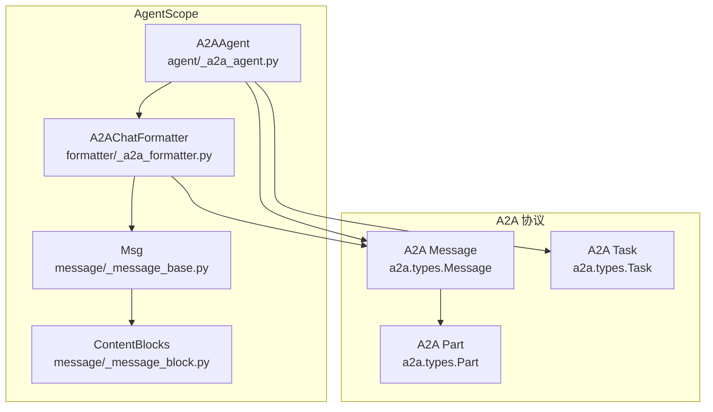
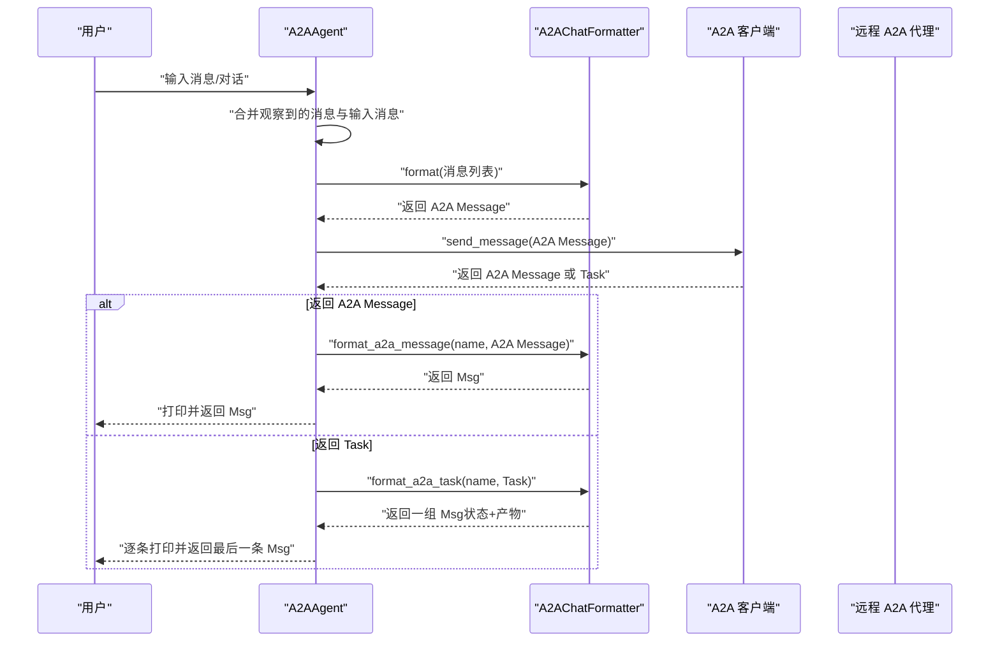
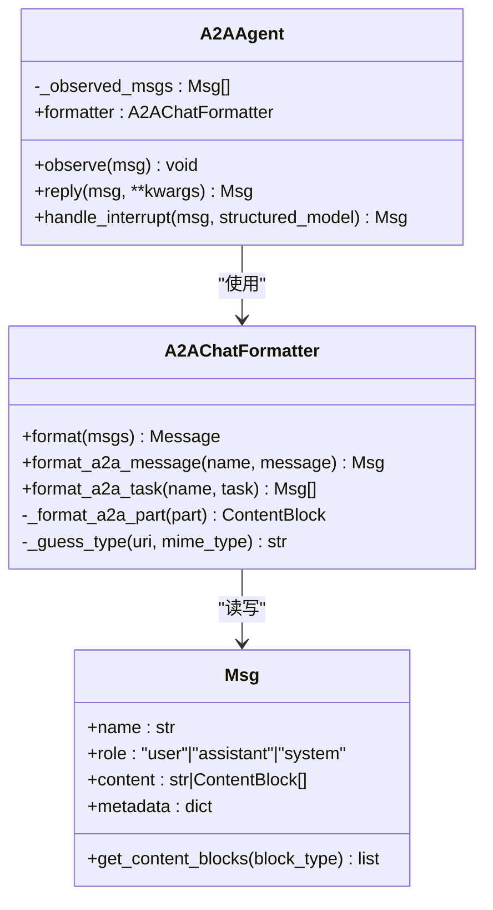

# A2A消息格式化器

<cite>
**本文引用的文件**
- [src/agentscope/formatter/_a2a_formatter.py](file://src/agentscope/formatter/_a2a_formatter.py)
- [src/agentscope/agent/_a2a_agent.py](file://src/agentscope/agent/_a2a_agent.py)
- [src/agentscope/message/_message_base.py](file://src/agentscope/message/_message_base.py)
- [src/agentscope/message/_message_block.py](file://src/agentscope/message/_message_block.py)
- [tests/formatter_a2a_test.py](file://tests/formatter_a2a_test.py)
- [examples/agent/a2a_agent/main.py](file://examples/agent/a2a_agent/main.py)
</cite>

## 目录
1. [简介](#简介)
2. [项目结构](#项目结构)
3. [核心组件](#核心组件)
4. [架构总览](#架构总览)
5. [详细组件分析](#详细组件分析)
6. [依赖关系分析](#依赖关系分析)
7. [性能考量](#性能考量)
8. [故障排查指南](#故障排查指南)
9. [结论](#结论)

## 简介
本文件系统性地阐述 AgentScope 中 A2A 消息格式化器的实现与使用，重点解释 A2AChatFormatter 在 AgentScope 的 Msg 对象与 A2A 协议 Message 对象之间的双向转换机制。文档覆盖以下关键点：
- formatter 字段在 A2AAgent 中的作用与初始化位置
- format 方法如何将 Msg 列表合并为单个 A2A Message
- format_a2a_message 与 format_a2a_task 如何将 A2A 协议消息转换回 AgentScope 的消息格式
- 元数据在转换过程中的处理策略
- 多模态内容（文本、思考、工具调用、工具结果、图像/音频/视频）的映射规则
- 基于测试与示例的完整转换流程说明
- 常见转换错误的排查建议

## 项目结构
围绕 A2A 消息格式化器的相关模块组织如下：
- 格式化器：formatter/_a2a_formatter.py
- A2A 代理：agent/_a2a_agent.py
- 消息模型：message/_message_base.py、message/_message_block.py
- 测试与示例：tests/formatter_a2a_test.py、examples/agent/a2a_agent/main.py

图表来源
- [src/agentscope/agent/_a2a_agent.py](file://src/agentscope/agent/_a2a_agent.py#L110-L113)
- [src/agentscope/formatter/_a2a_formatter.py](file://src/agentscope/formatter/_a2a_formatter.py#L31-L146)
- [src/agentscope/message/_message_base.py](file://src/agentscope/message/_message_base.py#L21-L100)
- [src/agentscope/message/_message_block.py](file://src/agentscope/message/_message_block.py#L9-L127)

章节来源
- [src/agentscope/agent/_a2a_agent.py](file://src/agentscope/agent/_a2a_agent.py#L110-L113)
- [src/agentscope/formatter/_a2a_formatter.py](file://src/agentscope/formatter/_a2a_formatter.py#L31-L146)
- [src/agentscope/message/_message_base.py](file://src/agentscope/message/_message_base.py#L21-L100)
- [src/agentscope/message/_message_block.py](file://src/agentscope/message/_message_block.py#L9-L127)

## 核心组件
- A2AChatFormatter：负责双向消息转换的核心类，继承自通用格式化基类，提供以下关键方法：
  - format：将 AgentScope Msg 列表转换为单个 A2A Message
  - format_a2a_message：将 A2A Message 转换回 AgentScope Msg
  - format_a2a_task：将 A2A Task 转换为一组 AgentScope Msg（含状态与产物）
  - _format_a2a_part：将单个 A2A Part 转换为 AgentScope ContentBlock
  - _guess_type：根据 URI 或 MIME 类型推断媒体类型（image/audio/video/unknown）

- A2AAgent：在 AgentScope 中使用 A2A 协议通信的代理，内部持有 A2AChatFormatter 实例作为 formatter 字段，用于消息转换。

- Msg 与 ContentBlock：AgentScope 的消息与内容块类型，支持文本、思考、工具调用/结果、图像/音频/视频等多模态内容。

章节来源
- [src/agentscope/formatter/_a2a_formatter.py](file://src/agentscope/formatter/_a2a_formatter.py#L31-L365)
- [src/agentscope/agent/_a2a_agent.py](file://src/agentscope/agent/_a2a_agent.py#L110-L113)
- [src/agentscope/message/_message_base.py](file://src/agentscope/message/_message_base.py#L21-L100)
- [src/agentscope/message/_message_block.py](file://src/agentscope/message/_message_block.py#L9-L127)

## 架构总览
下图展示了 A2AAgent 使用 A2AChatFormatter 进行消息转换的整体流程，包括从本地 Msg 到 A2A Message 的发送路径，以及从 A2A Message/Task 到本地 Msg 的接收与合并路径。

图表来源
- [src/agentscope/agent/_a2a_agent.py](file://src/agentscope/agent/_a2a_agent.py#L177-L261)
- [src/agentscope/formatter/_a2a_formatter.py](file://src/agentscope/formatter/_a2a_formatter.py#L147-L271)

## 详细组件分析

### A2AChatFormatter 双向转换机制
- 初始化与依赖
  - 继承自通用格式化基类，导入 AgentScope 的 Msg、TextBlock、URLSource、Base64Source、ContentBlock 等类型
  - 通过 a2a.types 引入 Message、Part、TextPart、FilePart、FileWithUri、FileWithBytes、DataPart、Role、Task 等 A2A 协议类型

- format：将 AgentScope Msg 列表合并为单个 A2A Message
  - 输入校验：确保输入为 Msg 列表
  - 遍历每个 Msg 的内容块，按类型映射到 A2A Part：
    - 文本/思考：映射为 TextPart
    - 图像/音频/视频：映射为 FilePart（支持 URL 或 Base64）
    - 工具调用/工具结果：映射为 DataPart（保持原始结构）
    - 其他类型：记录日志并忽略
  - 输出：构造 A2A Message（角色固定为 user，message_id 唯一）

- format_a2a_message：将 A2A Message 转回 AgentScope Msg
  - 遍历 A2A Message 的 parts，逐个调用 _format_a2a_part
  - 角色映射：A2A 的 Role.user -> AgentScope 的 user；Role.agent -> assistant；其他抛错
  - 输出：返回 Msg（metadata 当前为 None）

- format_a2a_task：将 A2A Task 转为一组 Msg
  - 若 Task 包含状态消息，则先转换为 Msg 并加入结果列表
  - 合并相邻同角色的 Msg（同角色则拼接 content）
  - 若 Task 包含产物（artifacts），将每个 artifact 的 parts 转换为 ContentBlock，并追加到最近的 assistant Msg 的 content 中，同时设置 metadata 为 artifact.metadata
  - 输出：返回一组 Msg（通常包含状态 Msg 和产物 Msg）

- _format_a2a_part：单个 A2A Part 转换
  - TextPart：转为 TextBlock
  - FilePart：
    - FileWithUri：转为 image/audio/video（基于 URI/MIME 推断）的 URLSource
    - FileWithBytes：转为 image/audio/video（基于 MIME 推断）的 Base64Source
  - DataPart：
    - 若 data 含有 tool_use 结构，直接返回该字典
    - 若 data 含有 tool_result 结构，直接返回该字典
    - 否则降级为 TextBlock（字符串化 data）
  - 不支持的 Part 类型：抛出异常

- _guess_type：媒体类型推断
  - 必须提供 uri 或 mime_type 其中之一
  - 优先使用显式 mime_type，否则从 uri 推断
  - 前缀匹配 image/video/audio，否则返回 unknown

章节来源
- [src/agentscope/formatter/_a2a_formatter.py](file://src/agentscope/formatter/_a2a_formatter.py#L31-L365)

### A2AAgent 中 formatter 字段的实现机制
- 字段定义与初始化
  - A2AAgent 在构造函数中实例化 A2AChatFormatter，并赋值给 self.formatter
  - 该字段贯穿 A2AAgent 的 observe/reply/handle_interrupt 等方法，用于消息转换

- observe/reply 的转换链路
  - observe：将外部传入的 Msg 或 Msg 列表存入内部缓存列表（_observed_msgs）
  - reply：
    - 合并 _observed_msgs 与输入 msg
    - 调用 self.formatter.format 将消息列表转换为 A2A Message
    - 通过 A2A 客户端发送，异步遍历返回项：
      - 若为 A2A Message：调用 self.formatter.format_a2a_message 转换为 Msg
      - 若为 Task：调用 self.formatter.format_a2a_task 转换为一组 Msg，并取最后一个作为最终响应
    - 清空 _observed_msgs

- 元数据处理
  - format_a2a_message：当前实现未从 A2A Message 中提取元数据，返回 Msg 的 metadata 为 None
  - format_a2a_task：将 artifact.metadata 设置到对应 assistant Msg 的 metadata 字段

章节来源
- [src/agentscope/agent/_a2a_agent.py](file://src/agentscope/agent/_a2a_agent.py#L110-L113)
- [src/agentscope/agent/_a2a_agent.py](file://src/agentscope/agent/_a2a_agent.py#L177-L261)

### 多模态内容映射规则
- 文本与思考
  - AgentScope：TextBlock、ThinkingBlock
  - A2A：TextPart
  - 映射：直接转换为 TextPart；ThinkingBlock 转为 TextPart 的 text

- 工具调用与工具结果
  - AgentScope：ToolUseBlock、ToolResultBlock
  - A2A：DataPart（data 为字典）
  - 映射：保持原字典结构；_format_a2a_part 识别 tool_use/tool_result 并原样返回

- 图像/音频/视频
  - AgentScope：ImageBlock/AudioBlock/VideoBlock（source 支持 URLSource/Base64Source）
  - A2A：FilePart（FileWithUri/FileWithBytes）
  - 映射：根据 source 类型选择 FileWithUri 或 FileWithBytes；_guess_type 基于 MIME/URI 推断类型

- 其他类型
  - 未识别的 AgentScope 内容块：记录错误日志并跳过
  - 未识别的 A2A Part：抛出异常

章节来源
- [src/agentscope/formatter/_a2a_formatter.py](file://src/agentscope/formatter/_a2a_formatter.py#L64-L145)
- [src/agentscope/formatter/_a2a_formatter.py](file://src/agentscope/formatter/_a2a_formatter.py#L273-L365)
- [src/agentscope/message/_message_block.py](file://src/agentscope/message/_message_block.py#L9-L127)

### 完整转换流程（基于测试与示例）
- 测试覆盖
  - Msg 列表到 A2A Message：验证文本、思考、工具调用/结果、图像/音频/视频等多模态内容均被正确映射
  - A2A Message 到 Msg：验证角色映射、内容块还原、未知 DataPart 降级为文本
  - A2A Task 到 Msg：验证状态消息与产物消息的合并与元数据传递

- 示例入口
  - examples/agent/a2a_agent/main.py 展示了 A2AAgent 与 UserAgent 的简单对话循环，体现 formatter 在实际交互中的使用

章节来源
- [tests/formatter_a2a_test.py](file://tests/formatter_a2a_test.py#L160-L248)
- [tests/formatter_a2a_test.py](file://tests/formatter_a2a_test.py#L249-L299)
- [tests/formatter_a2a_test.py](file://tests/formatter_a2a_test.py#L300-L405)
- [examples/agent/a2a_agent/main.py](file://examples/agent/a2a_agent/main.py#L1-L29)

## 依赖关系分析
- 组件耦合
  - A2AChatFormatter 依赖 AgentScope 的 Msg 与 ContentBlock 类型，以及 a2a.types 的 Message/Part/Task 等类型
  - A2AAgent 依赖 A2AChatFormatter 进行双向转换，并通过 A2A 客户端发送/接收消息

- 外部依赖
  - a2a.types：A2A 协议的数据结构定义（Message、Part、Task、Role 等）
  - httpx：A2A 客户端的异步 HTTP 客户端配置

图表来源
- [src/agentscope/agent/_a2a_agent.py](file://src/agentscope/agent/_a2a_agent.py#L110-L113)
- [src/agentscope/formatter/_a2a_formatter.py](file://src/agentscope/formatter/_a2a_formatter.py#L31-L365)
- [src/agentscope/message/_message_base.py](file://src/agentscope/message/_message_base.py#L21-L100)

章节来源
- [src/agentscope/agent/_a2a_agent.py](file://src/agentscope/agent/_a2a_agent.py#L110-L113)
- [src/agentscope/formatter/_a2a_formatter.py](file://src/agentscope/formatter/_a2a_formatter.py#L31-L365)
- [src/agentscope/message/_message_base.py](file://src/agentscope/message/_message_base.py#L21-L100)

## 性能考量
- 批量转换
  - format 将多条 Msg 合并为单个 A2A Message，减少网络往返开销
- 异步处理
  - A2AChatFormatter 与 A2AAgent 的相关方法均为异步，适合高并发场景
- 内容块遍历
  - 转换过程对每条 Msg 的内容块进行线性扫描，复杂度 O(N)，其中 N 为内容块总数
- 媒体类型推断
  - _guess_type 依赖 MIME/URI 解析，通常为常数时间操作

[本节为一般性指导，不涉及具体文件分析]

## 故障排查指南
- 常见错误与定位
  - 不支持的内容块类型：format 过程会记录错误日志并跳过；检查 Msg 的 content 是否包含受支持的类型
  - 不支持的 A2A Part 类型：_format_a2a_part 抛出异常；确认 A2A 服务端是否返回受支持的 Part 类型
  - 不支持的 A2A 角色：format_a2a_message 对非 user/agent 的角色抛错；检查 A2A 服务端的角色设置
  - 缺少媒体类型信息：_guess_type 需要提供 uri 或 mime_type；确保 FileWithUri 或 FileWithBytes 提供足够的类型信息
  - 未收到响应：A2AAgent 在无响应时抛出异常；检查网络连接与 A2A 服务端状态

- 排查步骤
  - 使用测试用例思路复现问题：准备最小化的 Msg 列表或 A2A Message/Task，逐步缩小范围
  - 检查 Msg 的 content 结构与类型，确保符合映射规则
  - 检查 A2A 服务端返回的 Message/Task 结构，确认 parts 与角色设置

章节来源
- [src/agentscope/formatter/_a2a_formatter.py](file://src/agentscope/formatter/_a2a_formatter.py#L133-L145)
- [src/agentscope/formatter/_a2a_formatter.py](file://src/agentscope/formatter/_a2a_formatter.py#L209-L222)
- [src/agentscope/formatter/_a2a_formatter.py](file://src/agentscope/formatter/_a2a_formatter.py#L361-L365)
- [src/agentscope/agent/_a2a_agent.py](file://src/agentscope/agent/_a2a_agent.py#L255-L261)

## 结论
A2AChatFormatter 在 AgentScope 与 A2A 协议之间提供了清晰、可扩展的消息转换层。通过统一的 Msg 与 ContentBlock 抽象，以及严格的 A2A Part 映射规则，实现了多模态内容（文本、思考、工具调用/结果、图像/音频/视频）的双向转换。A2AAgent 通过 formatter 字段将转换逻辑内聚在代理内部，简化了外部调用方的集成成本。未来可在以下方面进一步完善：
- 在 format_a2a_message 中引入更丰富的元数据提取
- 对 DataPart 的其他类型进行更细粒度的识别与转换
- 增强对 A2A 协议扩展字段的支持（如 context_id、extensions 等）

[本节为总结性内容，不涉及具体文件分析]