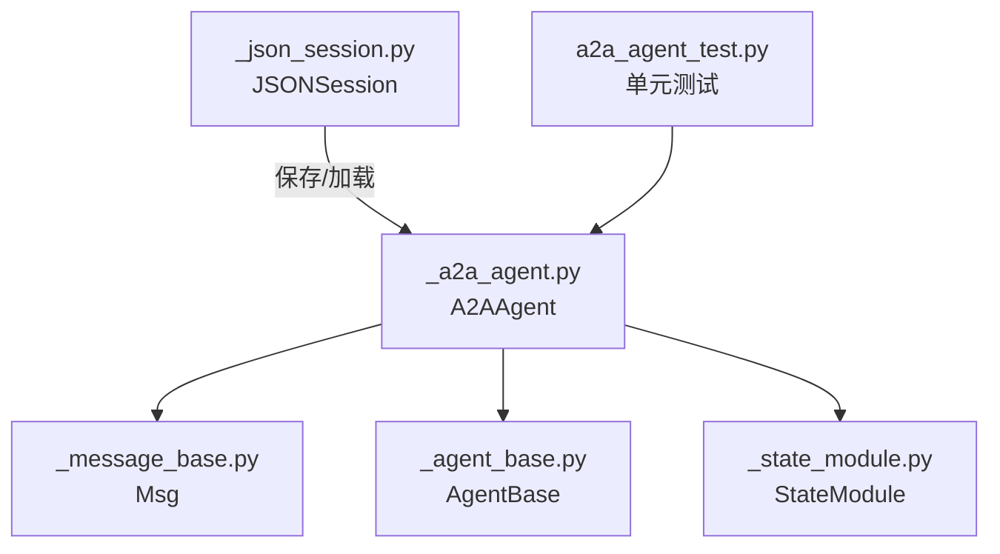
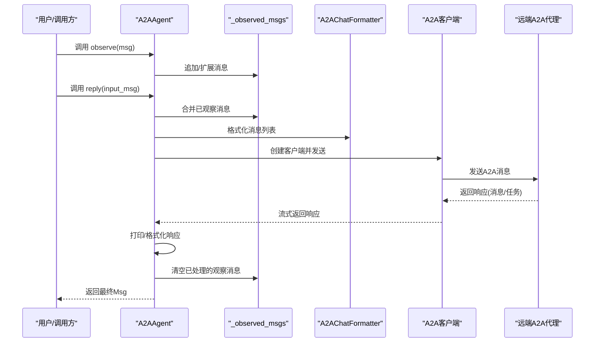
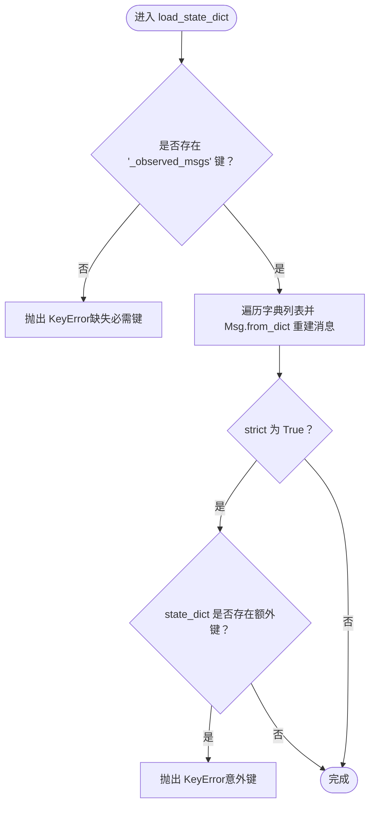
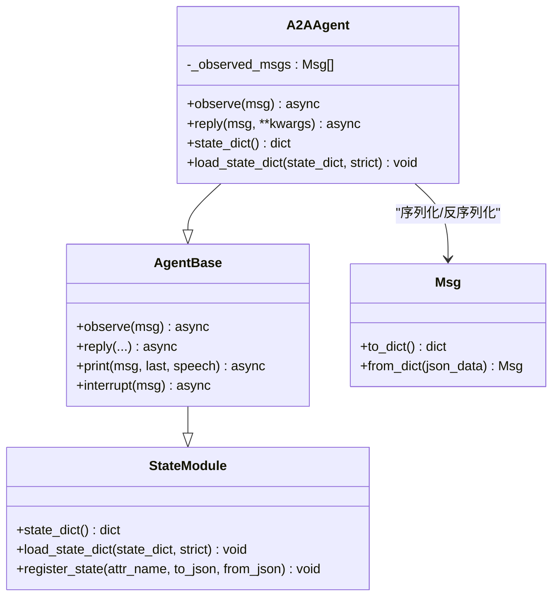

# A2A状态管理

<cite>
**本文引用的文件列表**
- [src/agentscope/agent/_a2a_agent.py](file://src/agentscope/agent/_a2a_agent.py)
- [src/agentscope/message/_message_base.py](file://src/agentscope/message/_message_base.py)
- [src/agentscope/agent/_agent_base.py](file://src/agentscope/agent/_agent_base.py)
- [src/agentscope/module/_state_module.py](file://src/agentscope/module/_state_module.py)
- [tests/a2a_agent_test.py](file://tests/a2a_agent_test.py)
- [src/agentscope/session/_json_session.py](file://src/agentscope/session/_json_session.py)
</cite>

## 目录
1. [简介](#简介)
2. [项目结构与定位](#项目结构与定位)
3. [核心组件](#核心组件)
4. [架构总览](#架构总览)
5. [详细组件分析](#详细组件分析)
6. [依赖关系分析](#依赖关系分析)
7. [性能与可扩展性](#性能与可扩展性)
8. [故障排查指南](#故障排查指南)
9. [结论](#结论)
10. [附录](#附录)

## 简介
本文件聚焦于A2A智能体的状态管理，系统性阐述以下主题：
- _observed_msgs字段的设计目的与实现方式：如何存储观察到的消息并参与上下文管理。
- state_dict与load_state_dict的序列化与反序列化流程，尤其是_observed_msgs的JSON转换细节。
- 生命周期中的状态作用：在reply调用后自动清空观察消息的机制。
- 严格模式(strict)下的状态加载验证逻辑及对缺失或意外键的处理策略。
- 状态持久化的最佳实践与性能考量。

## 项目结构与定位
A2A智能体位于agentscope的agent子模块中，负责与远端A2A协议代理通信；消息模型由message子模块提供；通用状态管理能力由module子模块的StateModule提供；会话持久化由session子模块提供。

图表来源
- [src/agentscope/agent/_a2a_agent.py](file://src/agentscope/agent/_a2a_agent.py#L1-L289)
- [src/agentscope/message/_message_base.py](file://src/agentscope/message/_message_base.py#L1-L242)
- [src/agentscope/agent/_agent_base.py](file://src/agentscope/agent/_agent_base.py#L1-L733)
- [src/agentscope/module/_state_module.py](file://src/agentscope/module/_state_module.py#L1-L152)
- [src/agentscope/session/_json_session.py](file://src/agentscope/session/_json_session.py#L1-L120)
- [tests/a2a_agent_test.py](file://tests/a2a_agent_test.py#L1-L254)

章节来源
- [src/agentscope/agent/_a2a_agent.py](file://src/agentscope/agent/_a2a_agent.py#L1-L289)
- [src/agentscope/message/_message_base.py](file://src/agentscope/message/_message_base.py#L1-L242)
- [src/agentscope/agent/_agent_base.py](file://src/agentscope/agent/_agent_base.py#L1-L733)
- [src/agentscope/module/_state_module.py](file://src/agentscope/module/_state_module.py#L1-L152)
- [src/agentscope/session/_json_session.py](file://src/agentscope/session/_json_session.py#L1-L120)
- [tests/a2a_agent_test.py](file://tests/a2a_agent_test.py#L1-L254)

## 核心组件
- A2AAgent：实现A2A协议通信、消息格式化、观察消息合并与清理、状态序列化与反序列化。
- Msg：消息载体，提供to_dict/from_dict用于JSON序列化。
- StateModule：通用状态模块基类，支持嵌套模块与属性注册的序列化/反序列化。
- AgentBase：定义observe/reply等生命周期方法，A2AAgent继承该基类并覆盖具体行为。
- JSONSession：提供基于JSON文件的状态保存与加载接口，便于外部持久化。

章节来源
- [src/agentscope/agent/_a2a_agent.py](file://src/agentscope/agent/_a2a_agent.py#L1-L289)
- [src/agentscope/message/_message_base.py](file://src/agentscope/message/_message_base.py#L1-L242)
- [src/agentscope/module/_state_module.py](file://src/agentscope/module/_state_module.py#L1-L152)
- [src/agentscope/agent/_agent_base.py](file://src/agentscope/agent/_agent_base.py#L1-L733)
- [src/agentscope/session/_json_session.py](file://src/agentscope/session/_json_session.py#L1-L120)

## 架构总览
A2A智能体的状态管理围绕“观察消息”展开，形成如下闭环：
- 观察阶段：通过observe收集Msg对象，暂存于_A2A_Agent._observed_msgs。
- 回复阶段：在reply中合并_observed_msgs与输入消息，发送至远端代理，并在完成后清空_observed_msgs。
- 序列化阶段：state_dict将_observed_msgs转换为字典列表（每个Msg调用to_dict），load_state_dict从字典列表重建Msg对象。
- 持久化阶段：通过JSONSession将state_dict写入/读取到JSON文件。

图表来源
- [src/agentscope/agent/_a2a_agent.py](file://src/agentscope/agent/_a2a_agent.py#L134-L254)
- [src/agentscope/message/_message_base.py](file://src/agentscope/message/_message_base.py#L75-L100)

## 详细组件分析

### _observed_msgs字段设计与实现
- 设计目的
  - 存储在一次交互周期内“被动观察”的消息，作为上下文的一部分参与后续回复。
  - 支持多条消息的累积，便于在无显式输入时仍能维持对话连贯性。
- 实现要点
  - 类型：list[Msg]，初始化为空列表。
  - 写入路径：observe方法接收单个Msg或消息列表，类型校验后追加/扩展到_observed_msgs。
  - 清理策略：在reply完成（无论成功与否）后，调用clear清空，确保每轮交互独立且不泄漏历史。
- 上下文管理
  - reply内部先使用_observed_msgs，再合并输入消息，保证观察到的历史信息优先参与本次交互。

章节来源
- [src/agentscope/agent/_a2a_agent.py](file://src/agentscope/agent/_a2a_agent.py#L108-L176)
- [src/agentscope/agent/_a2a_agent.py](file://src/agentscope/agent/_a2a_agent.py#L213-L254)
- [tests/a2a_agent_test.py](file://tests/a2a_agent_test.py#L191-L254)

### state_dict与load_state_dict的JSON转换
- state_dict
  - 将_observed_msgs中的每个Msg对象调用to_dict，得到字典列表，作为状态字典的唯一键值。
  - 该过程仅包含消息的结构化字段，不涉及消息内容块的深层解析。
- load_state_dict
  - 若state_dict中缺少_required键（_observed_msgs），在strict模式下抛出KeyError。
  - 若strict为True，且state_dict包含除_required键以外的其他键，同样抛出KeyError，防止意外键污染。
  - 若strict为False，则忽略未识别键，仅处理_required键。
  - 对_observed_msgs键，将字典列表逐项调用Msg.from_dict重建Msg对象，替换当前_observed_msgs。

图表来源
- [src/agentscope/agent/_a2a_agent.py](file://src/agentscope/agent/_a2a_agent.py#L125-L153)
- [src/agentscope/message/_message_base.py](file://src/agentscope/message/_message_base.py#L75-L100)

章节来源
- [src/agentscope/agent/_a2a_agent.py](file://src/agentscope/agent/_a2a_agent.py#L114-L153)
- [src/agentscope/message/_message_base.py](file://src/agentscope/message/_message_base.py#L75-L100)

### 生命周期中的状态作用与自动清理
- 生命周期关键点
  - observe：接收消息并暂存，不生成回复。
  - reply：合并观察消息与输入消息，发送给远端代理，打印响应，最后清空_observed_msgs。
  - handle_interrupt：在中断后将提示消息加入_observed_msgs，以便下一次回复继续上下文。
- 自动清理机制
  - reply在结束时调用clear，确保每轮交互结束后_observed_msgs为空，避免跨轮次污染。
  - 单元测试验证了合并与清理的行为，确保语义正确。

章节来源
- [src/agentscope/agent/_a2a_agent.py](file://src/agentscope/agent/_a2a_agent.py#L154-L289)
- [tests/a2a_agent_test.py](file://tests/a2a_agent_test.py#L212-L254)

### 严格模式(strict)下的验证逻辑
- 必需键检查
  - 缺失_required键时直接抛错，保证状态完整性。
- 额外键检查
  - strict=True时，若state_dict包含未预期键，抛出KeyError，防止误加载。
  - strict=False时，忽略未识别键，仅处理_required键。
- 建议
  - 生产环境建议使用strict=True，确保状态一致性。
  - 开发调试阶段可临时使用strict=False，但需明确风险。

章节来源
- [src/agentscope/agent/_a2a_agent.py](file://src/agentscope/agent/_a2a_agent.py#L125-L153)

### 与通用状态管理框架的关系
- A2AAgent继承自AgentBase，后者继承自StateModule，具备通用状态管理能力。
- StateModule支持：
  - 嵌套模块状态聚合（state_dict）与递归加载（load_state_dict）。
  - 属性注册（register_state）以定制JSON序列化/反序列化函数。
- A2AAgent的state_dict/load_state_dict覆盖了A2A特有的_observed_msgs字段，遵循通用框架的约定。

章节来源
- [src/agentscope/agent/_agent_base.py](file://src/agentscope/agent/_agent_base.py#L1-L200)
- [src/agentscope/module/_state_module.py](file://src/agentscope/module/_state_module.py#L1-L152)
- [src/agentscope/agent/_a2a_agent.py](file://src/agentscope/agent/_a2a_agent.py#L114-L153)

## 依赖关系分析
- 组件耦合
  - A2AAgent与Msg强耦合：状态序列化依赖Msg的to_dict/from_dict。
  - A2AAgent与AgentBase弱耦合：继承关系提供生命周期钩子与通用行为。
  - A2AAgent与StateModule：通过覆盖state_dict/load_state_dict实现A2A特有状态。
- 外部集成
  - JSONSession提供文件级持久化入口，便于将A2A智能体状态保存为JSON文件。
- 潜在循环依赖
  - 当前文件间无循环导入迹象；若未来扩展更多状态模块，应避免在StateModule中引入对A2A的直接依赖。

图表来源
- [src/agentscope/module/_state_module.py](file://src/agentscope/module/_state_module.py#L1-L152)
- [src/agentscope/agent/_agent_base.py](file://src/agentscope/agent/_agent_base.py#L1-L200)
- [src/agentscope/agent/_a2a_agent.py](file://src/agentscope/agent/_a2a_agent.py#L1-L289)
- [src/agentscope/message/_message_base.py](file://src/agentscope/message/_message_base.py#L1-L242)

## 性能与可扩展性
- 性能特征
  - _observed_msgs为简单列表，append/extend/clear均为O(1)操作，开销极低。
  - JSON序列化/反序列化主要成本在于Msg对象数量与内容块规模；建议控制每轮交互的观察消息数量。
- 可扩展性
  - 若未来需要持久化更多状态字段，可在A2AAgent中扩展state_dict/load_state_dict，同时保持strict模式默认开启以保障一致性。
  - 对于超大量消息，可考虑分页或压缩策略，但需评估对A2A协议兼容性的潜在影响。

[本节为通用指导，无需列出章节来源]

## 故障排查指南
- 常见问题
  - 缺失_required键：strict=True时会抛KeyError，检查保存/加载流程是否遗漏状态字典。
  - 意外键导致失败：strict=True时若state_dict包含未识别键会抛KeyError，检查状态字典来源与版本。
  - 观察消息未清理：确认reply流程未被提前中断；若使用handle_interrupt，确认其逻辑正确。
- 定位手段
  - 使用单元测试验证observe/merge/clear行为。
  - 在严格模式下逐步加载状态，定位第一个引发异常的键。
  - 对Msg对象进行to_dict/from_dict的最小化回归测试，确保消息结构稳定。

章节来源
- [src/agentscope/agent/_a2a_agent.py](file://src/agentscope/agent/_a2a_agent.py#L125-L153)
- [tests/a2a_agent_test.py](file://tests/a2a_agent_test.py#L191-L254)

## 结论
A2A智能体通过_observed_msgs实现了轻量而高效的上下文管理：在observe阶段收集历史，在reply阶段合并并自动清理，配合state_dict/load_state_dict的JSON序列化/反序列化，满足会话级状态持久化需求。严格模式下的验证逻辑确保了状态一致性，建议在生产环境默认启用strict=True，并结合JSONSession进行文件级持久化。

[本节为总结性内容，无需列出章节来源]

## 附录

### 状态持久化最佳实践
- 文件命名与目录
  - 使用会话ID作为文件名，便于检索与版本管理。
- 保存策略
  - 在关键节点（如交互开始/结束）调用state_dict并写入JSON文件。
- 加载策略
  - 先清理或初始化相关状态，再调用load_state_dict(strict=True)，确保一致性。
- 版本兼容
  - 若未来扩展状态字段，保持向后兼容或提供迁移脚本。

章节来源
- [src/agentscope/session/_json_session.py](file://src/agentscope/session/_json_session.py#L40-L84)
- [src/agentscope/agent/_a2a_agent.py](file://src/agentscope/agent/_a2a_agent.py#L114-L153)