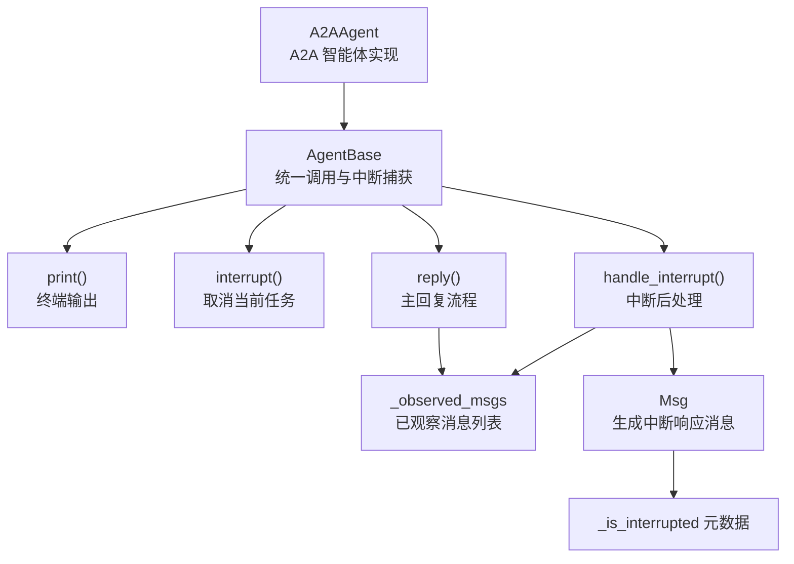
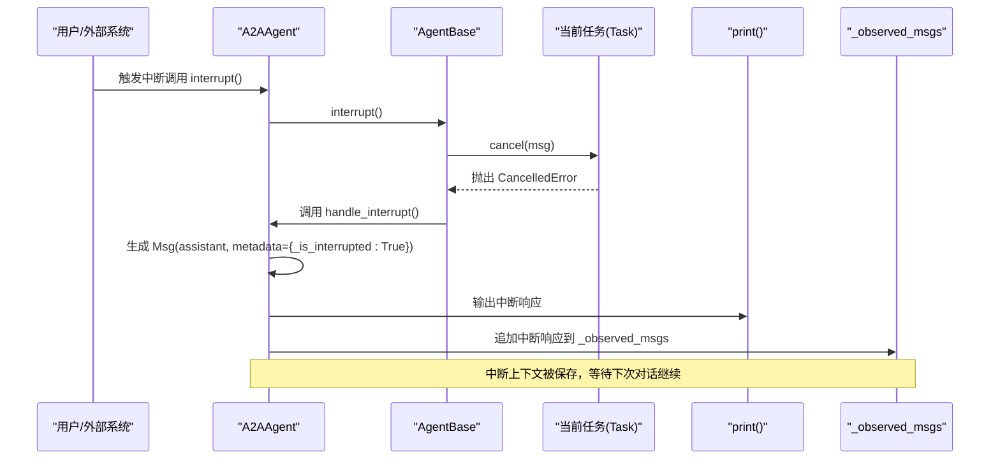
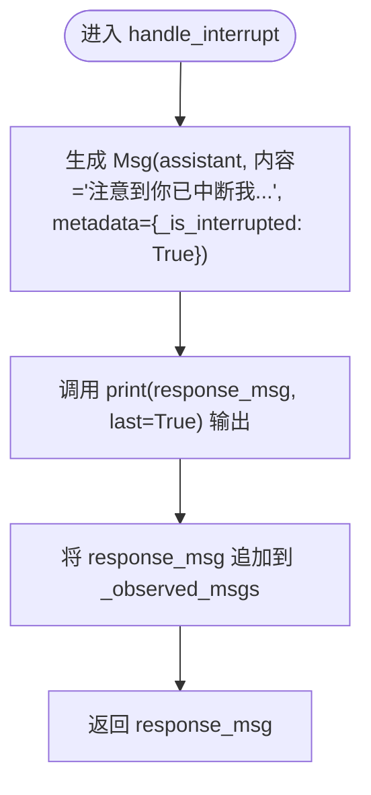
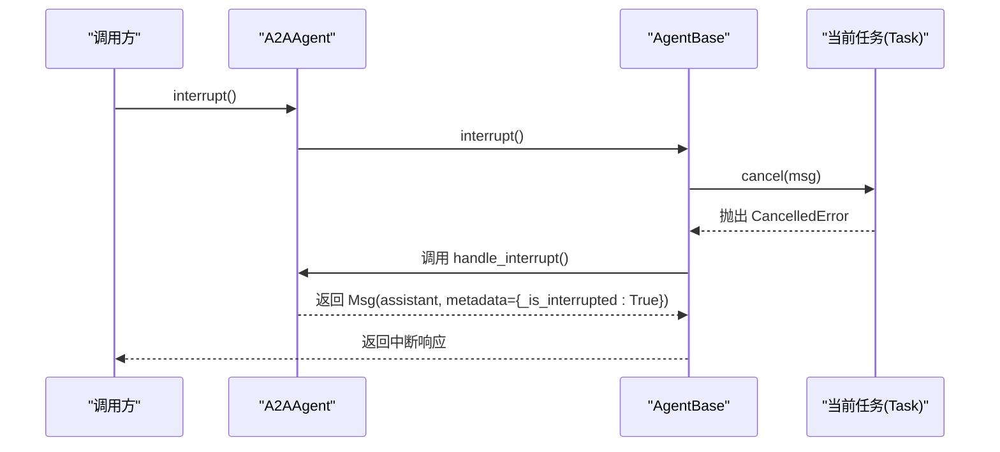
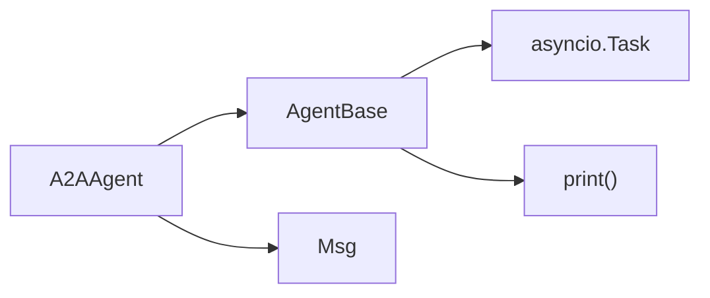

# 中断处理机制

<cite>
**本文引用的文件**
- [src/agentscope/agent/_a2a_agent.py](file://src/agentscope/agent/_a2a_agent.py)
- [src/agentscope/agent/_agent_base.py](file://src/agentscope/agent/_agent_base.py)
- [src/agentscope/message/_message_base.py](file://src/agentscope/message/_message_base.py)
- [examples/agent/a2a_agent/main.py](file://examples/agent/a2a_agent/main.py)
- [tests/a2a_agent_test.py](file://tests/a2a_agent_test.py)
- [docs/tutorial/zh_CN/src/task_a2a.py](file://docs/tutorial/zh_CN/src/task_a2a.py)
</cite>

## 目录
1. [简介](#简介)
2. [项目结构](#项目结构)
3. [核心组件](#核心组件)
4. [架构总览](#架构总览)
5. [详细组件分析](#详细组件分析)
6. [依赖关系分析](#依赖关系分析)
7. [性能考量](#性能考量)
8. [故障排查指南](#故障排查指南)
9. [结论](#结论)

## 简介
本文件围绕 A2A 智能体的中断处理机制展开，重点解释在用户中断场景下，A2AAgent 的 handle_interrupt() 方法如何生成携带“_is_interrupted”元数据的中断响应消息，并通过 print() 输出给用户；同时阐明该方法将中断响应消息重新加入 _observed_msgs 的设计初衷，确保中断后的上下文能在后续对话中延续，维持对话状态连贯性。文档还结合实际交互场景，说明该机制如何提升用户体验，并梳理在异步任务取消（asyncio.CancelledError）时的完整调用链路。

## 项目结构
与中断处理直接相关的核心文件与职责如下：
- A2AAgent 实现：负责与远程 A2A 代理通信、消息合并、打印输出、以及中断后的响应生成与上下文保留。
- AgentBase 基类：统一的调用入口、异常捕获与广播机制，以及中断触发与恢复流程。
- Msg 消息模型：承载消息内容、角色、元数据（含 _is_interrupted 标记）。
- 示例与测试：验证 observe/reply 行为、中断响应生成与上下文保留。

图表来源
- [src/agentscope/agent/_a2a_agent.py](file://src/agentscope/agent/_a2a_agent.py#L154-L289)
- [src/agentscope/agent/_agent_base.py](file://src/agentscope/agent/_agent_base.py#L444-L490)
- [src/agentscope/message/_message_base.py](file://src/agentscope/message/_message_base.py#L21-L74)

章节来源
- [src/agentscope/agent/_a2a_agent.py](file://src/agentscope/agent/_a2a_agent.py#L154-L289)
- [src/agentscope/agent/_agent_base.py](file://src/agentscope/agent/_agent_base.py#L444-L490)
- [src/agentscope/message/_message_base.py](file://src/agentscope/message/_message_base.py#L21-L74)

## 核心组件
- A2AAgent.handle_interrupt()
  - 作用：在中断发生后，生成一条提示用户“已中断”的响应消息，标记元数据 _is_interrupted，并通过 print() 输出；随后将该消息追加至 _observed_msgs，以便后续对话继续使用。
  - 关键点：元数据字段 _is_interrupted 明确指示本次对话曾被中断；print() 输出保证用户即时感知；_observed_msgs 的追加确保上下文延续。
- AgentBase.__call__() 与 interrupt()
  - 作用：统一入口调用 reply()；当收到 asyncio.CancelledError 时，自动转交到 handle_interrupt()；interrupt() 会取消当前正在执行的 _reply_task。
- Msg
  - 作用：消息载体，支持 metadata 字段，便于携带 _is_interrupted 等标记。

章节来源
- [src/agentscope/agent/_a2a_agent.py](file://src/agentscope/agent/_a2a_agent.py#L262-L289)
- [src/agentscope/agent/_agent_base.py](file://src/agentscope/agent/_agent_base.py#L444-L490)
- [src/agentscope/message/_message_base.py](file://src/agentscope/message/_message_base.py#L21-L74)

## 架构总览
中断处理的总体流程如下：
- 用户或外部系统触发中断（调用 interrupt()），导致当前 reply() 所在任务被取消（asyncio.CancelledError）。
- AgentBase.__call__() 捕获 CancelledError，调用 handle_interrupt() 生成中断响应。
- A2AAgent.handle_interrupt() 生成 Msg，设置 metadata={_is_interrupted: True}，通过 print() 输出，并将该消息加入 _observed_msgs。
- 下一次对话（如用户再次发起交互）时，A2AAgent 会在 reply() 中合并 _observed_msgs 与新输入，使中断上下文得以延续。

图表来源
- [src/agentscope/agent/_agent_base.py](file://src/agentscope/agent/_agent_base.py#L444-L490)
- [src/agentscope/agent/_a2a_agent.py](file://src/agentscope/agent/_a2a_agent.py#L262-L289)

## 详细组件分析

### A2AAgent.handle_interrupt() 方法详解
- 输入参数
  - msg: 可为 Msg、list[Msg] 或 None（A2A 智能体的 handle_interrupt() 允许传入，但不强制使用）
  - structured_model: 类型提示参数，A2A 智能体不支持结构化输出，此处仅为签名兼容
- 处理逻辑
  - 生成 Msg 对象，角色为 assistant，内容为“注意到你已中断我，我可以做什么”，并设置 metadata={_is_interrupted: True}
  - 调用 print(response_msg, last=True) 输出给用户
  - 将 response_msg 追加到 self._observed_msgs，以便后续对话继续使用
- 返回值
  - 返回 Msg，作为中断后的最终输出，供上层订阅者接收与传播

图表来源
- [src/agentscope/agent/_a2a_agent.py](file://src/agentscope/agent/_a2a_agent.py#L262-L289)

章节来源
- [src/agentscope/agent/_a2a_agent.py](file://src/agentscope/agent/_a2a_agent.py#L262-L289)

### 中断响应消息的元数据设计
- 元数据字段 _is_interrupted
  - 作用：明确标识该条消息来自中断后的处理，便于上层逻辑识别与差异化展示（如 UI 层可高亮提示、下游处理器可跳过某些步骤）
  - 生成位置：A2AAgent.handle_interrupt() 中显式设置
- 与 Msg 的关系
  - Msg 支持 metadata 字段，A2A 智能体在生成中断响应时将其写入，确保消息具备可追踪的中断标记

章节来源
- [src/agentscope/agent/_a2a_agent.py](file://src/agentscope/agent/_a2a_agent.py#L272-L281)
- [src/agentscope/message/_message_base.py](file://src/agentscope/message/_message_base.py#L21-L74)

### 重新加入 _observed_msgs 的设计原理
- 设计目标
  - 维持对话状态连贯性：中断后，用户可能希望继续之前的上下文，而非丢失历史
  - 保持 A2A 协议语义：A2AAgent 在 reply() 中会合并 _observed_msgs 与新输入，中断响应作为“已观察消息”参与下一轮对话
- 行为验证
  - 测试用例验证 observe() 可累积消息，且在 reply() 合并后清空 _observed_msgs；中断响应同样被加入并可用于后续对话

章节来源
- [src/agentscope/agent/_a2a_agent.py](file://src/agentscope/agent/_a2a_agent.py#L154-L176)
- [src/agentscope/agent/_a2a_agent.py](file://src/agentscope/agent/_a2a_agent.py#L215-L253)
- [tests/a2a_agent_test.py](file://tests/a2a_agent_test.py#L191-L211)
- [tests/a2a_agent_test.py](file://tests/a2a_agent_test.py#L212-L233)

### 用户体验提升
- 即时反馈：中断后立即输出提示消息，避免用户困惑
- 上下文延续：中断响应被保存为“已观察消息”，使用户在下一轮对话中无需重复说明背景
- 一致性：与 AgentBase 的统一中断处理机制配合，保证所有智能体在中断场景下行为一致

章节来源
- [src/agentscope/agent/_a2a_agent.py](file://src/agentscope/agent/_a2a_agent.py#L262-L289)
- [src/agentscope/agent/_agent_base.py](file://src/agentscope/agent/_agent_base.py#L444-L490)

### 异步任务取消（asyncio.CancelledError）的完整调用链
- 触发点：调用 interrupt() 取消当前任务
- 捕获点：AgentBase.__call__() 捕获 CancelledError
- 处理点：调用 handle_interrupt() 生成中断响应
- 输出点：通过 print() 输出给用户
- 保存点：将中断响应写入 _observed_msgs，供后续对话使用

图表来源
- [src/agentscope/agent/_agent_base.py](file://src/agentscope/agent/_agent_base.py#L444-L490)
- [src/agentscope/agent/_a2a_agent.py](file://src/agentscope/agent/_a2a_agent.py#L262-L289)

章节来源
- [src/agentscope/agent/_agent_base.py](file://src/agentscope/agent/_agent_base.py#L444-L490)
- [src/agentscope/agent/_a2a_agent.py](file://src/agentscope/agent/_a2a_agent.py#L262-L289)

### 实际交互场景与示例
- 示例程序展示了用户与 A2AAgent 的循环对话，中断后可通过下一轮交互继续使用中断上下文
- 文档教程强调 A2A 的实验性特性与限制，包括不支持实时打断等，但中断响应机制仍可帮助维持对话连贯性

章节来源
- [examples/agent/a2a_agent/main.py](file://examples/agent/a2a_agent/main.py#L1-L29)
- [docs/tutorial/zh_CN/src/task_a2a.py](file://docs/tutorial/zh_CN/src/task_a2a.py#L30-L41)

## 依赖关系分析
- A2AAgent 依赖
  - AgentBase：统一调用入口、中断捕获与广播
  - Msg：消息结构与元数据承载
  - A2AChatFormatter：消息格式转换（与中断处理无直接耦合，但在正常回复流程中使用）
- AgentBase 依赖
  - asyncio.Task：用于记录当前任务并支持取消
  - print()：终端输出与流式播放（与中断处理无直接耦合）

图表来源
- [src/agentscope/agent/_a2a_agent.py](file://src/agentscope/agent/_a2a_agent.py#L154-L289)
- [src/agentscope/agent/_agent_base.py](file://src/agentscope/agent/_agent_base.py#L444-L490)
- [src/agentscope/message/_message_base.py](file://src/agentscope/message/_message_base.py#L21-L74)

章节来源
- [src/agentscope/agent/_a2a_agent.py](file://src/agentscope/agent/_a2a_agent.py#L154-L289)
- [src/agentscope/agent/_agent_base.py](file://src/agentscope/agent/_agent_base.py#L444-L490)
- [src/agentscope/message/_message_base.py](file://src/agentscope/message/_message_base.py#L21-L74)

## 性能考量
- 中断响应生成与输出为轻量级操作，对整体性能影响可忽略
- 将中断响应加入 _observed_msgs 仅增加少量内存占用，但能显著改善用户体验
- 若频繁中断，建议在上层逻辑中对中断频率进行控制，避免过多上下文累积

## 故障排查指南
- 中断未生效
  - 检查是否正确调用了 interrupt()，确认当前任务存在且未完成
  - 确认 AgentBase.__call__() 是否捕获到 CancelledError 并调用 handle_interrupt()
- 中断响应未输出
  - 检查 print() 是否被禁用（环境变量 AGENTSCOPE_DISABLE_CONSOLE_OUTPUT）
  - 确认 handle_interrupt() 已执行并调用 print()
- 中断上下文未延续
  - 确认 _observed_msgs 是否被正确追加
  - 确认下一次对话时 A2AAgent.reply() 是否合并了 _observed_msgs 与新输入

章节来源
- [src/agentscope/agent/_agent_base.py](file://src/agentscope/agent/_agent_base.py#L444-L490)
- [src/agentscope/agent/_a2a_agent.py](file://src/agentscope/agent/_a2a_agent.py#L154-L289)
- [tests/a2a_agent_test.py](file://tests/a2a_agent_test.py#L191-L233)

## 结论
A2AAgent 的中断处理机制通过 handle_interrupt() 生成携带 _is_interrupted 元数据的响应消息，并通过 print() 即时反馈给用户，同时将该消息加入 _observed_msgs，确保中断后的上下文在后续对话中得以延续。该机制与 AgentBase 的统一中断捕获与恢复流程协同工作，形成一致、可控且用户友好的中断体验。尽管 A2A 协议在实时打断方面存在限制，但中断响应与上下文保留的设计有效提升了交互的连贯性与可用性。