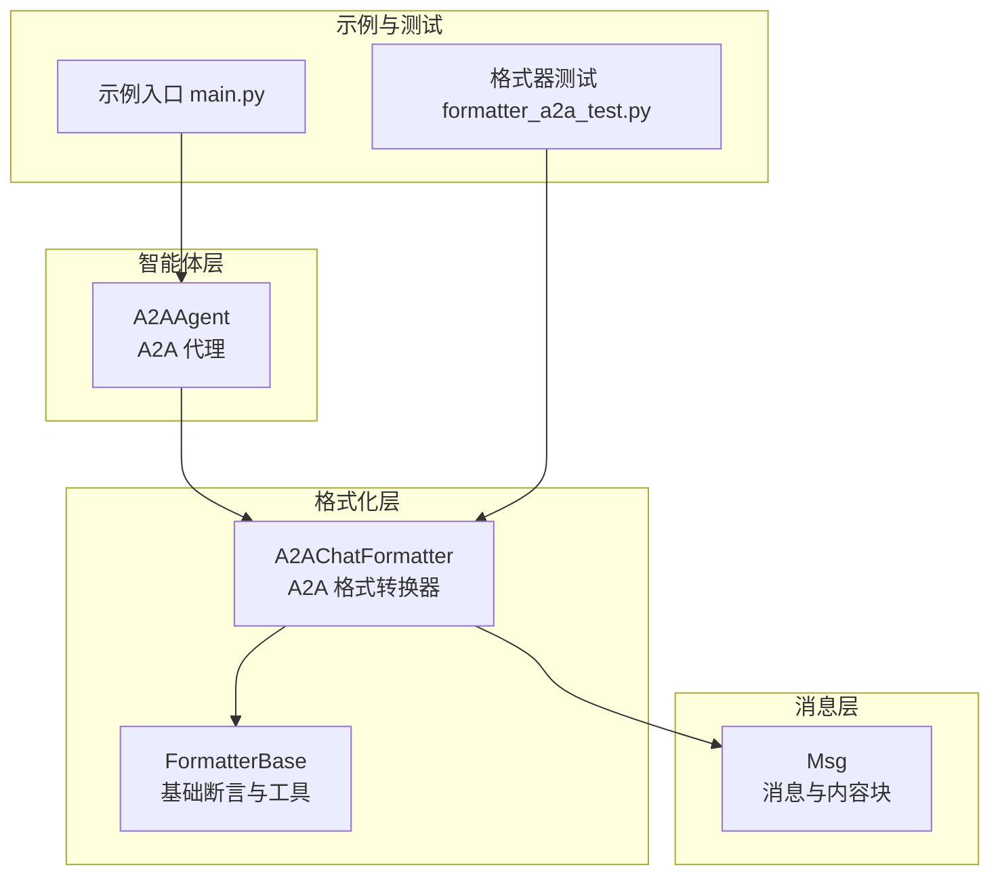
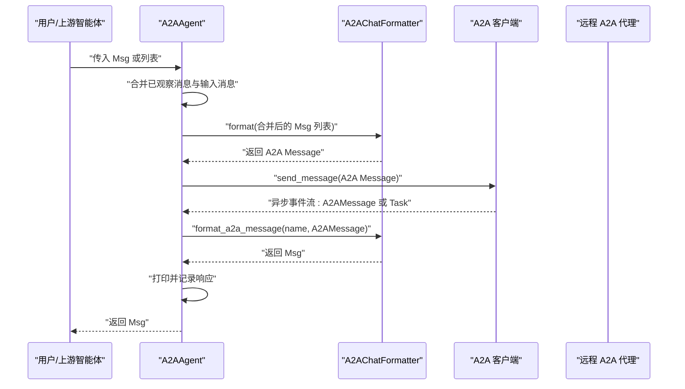
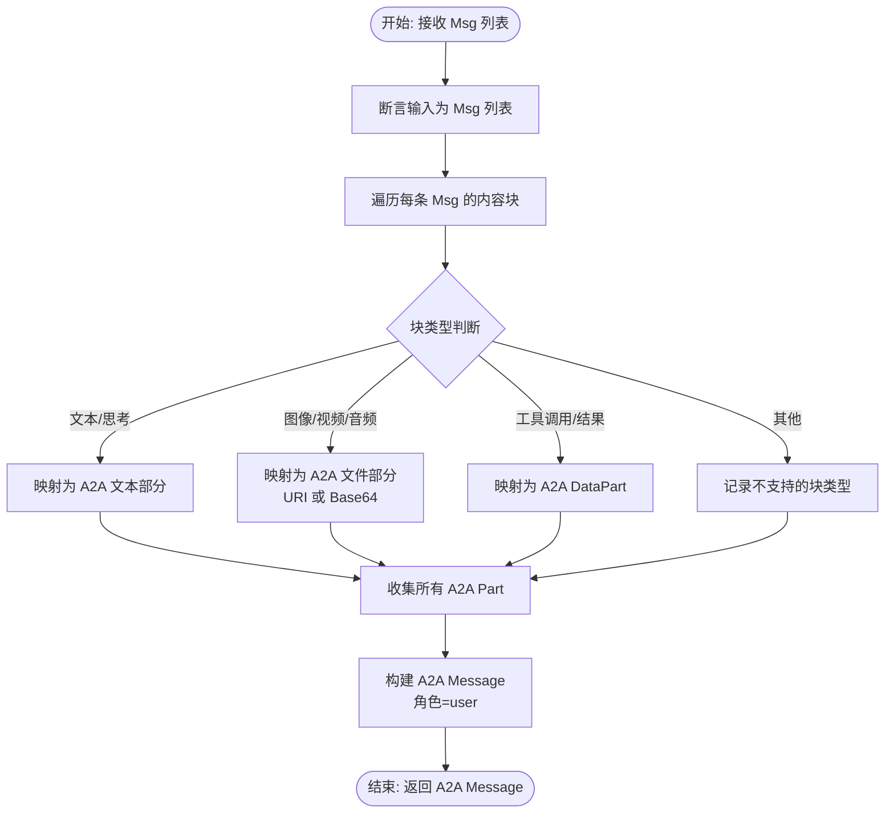
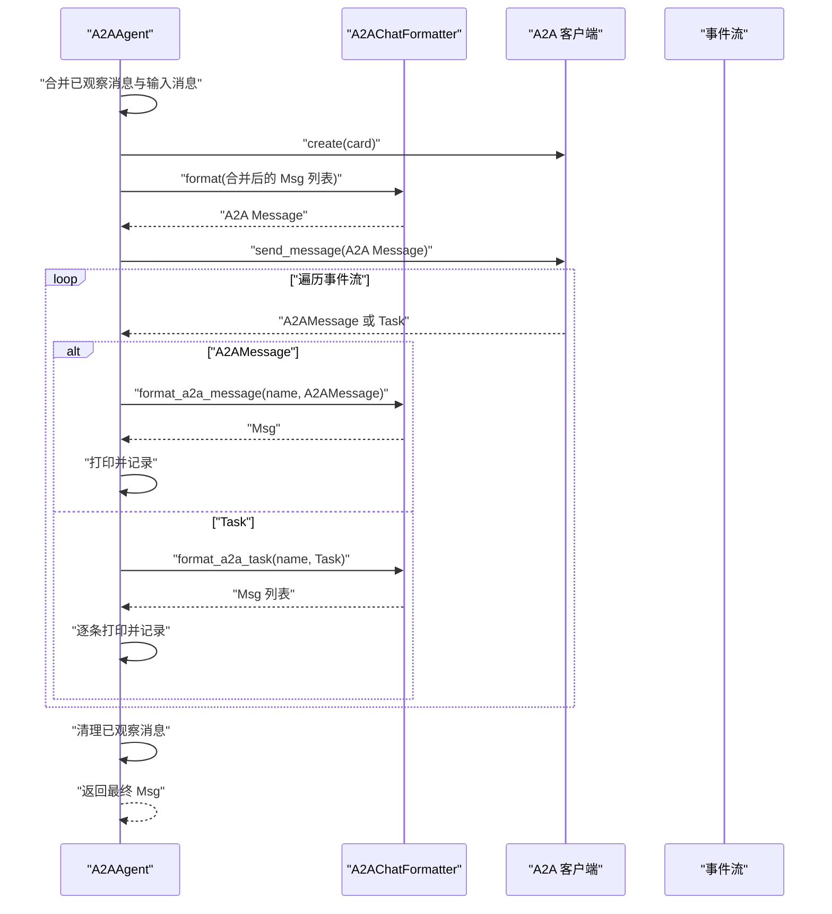
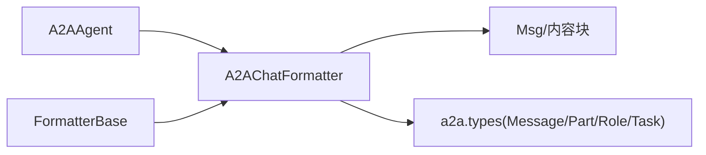

# 协议格式转换

<cite>
**本文引用的文件列表**
- [A2AChatFormatter 类](file://src/agentscope/formatter/_a2a_formatter.py)
- [A2AAgent 类](file://src/agentscope/agent/_a2a_agent.py)
- [FormatterBase 基类](file://src/agentscope/formatter/_formatter_base.py)
- [Msg 消息类](file://src/agentscope/message/_message_base.py)
- [A2A 协议示例入口](file://examples/agent/a2a_agent/main.py)
- [A2A 格式器测试](file://tests/formatter_a2a_test.py)
</cite>

## 目录
1. [引言](#引言)
2. [项目结构](#项目结构)
3. [核心组件](#核心组件)
4. [架构总览](#架构总览)
5. [详细组件分析](#详细组件分析)
6. [依赖关系分析](#依赖关系分析)
7. [性能考量](#性能考量)
8. [故障排查指南](#故障排查指南)
9. [结论](#结论)

## 引言
本文件聚焦于 AgentScope 中 A2A（Agent-to-Agent）协议的消息格式转换机制，系统性解析以下要点：
- A2AChatFormatter 在 reply() 流程中的作用：如何将 AgentScope 的 Msg 对象序列转换为 A2A 协议的 Message 对象；如何将接收到的 A2AMessage 转换回 AgentScope 消息。
- formatter.format() 与 formatter.format_a2a_message() 方法的调用时机与数据转换逻辑。
- 这种格式抽象层如何实现协议解耦、支持不同消息协议的灵活替换，并在多智能体系统互操作性中发挥关键作用。

## 项目结构
围绕 A2A 协议格式转换的相关模块分布如下：
- 格式化器：formatter/_a2a_formatter.py 提供 A2AChatFormatter，负责双向转换。
- 智能体：agent/_a2a_agent.py 定义 A2AAgent，封装与远程 A2A 代理的交互与消息合并策略。
- 基类与消息模型：formatter/_formatter_base.py 提供通用断言与工具；message/_message_base.py 定义 Msg 及内容块类型。
- 示例与测试：examples/agent/a2a_agent/main.py 展示典型使用；tests/formatter_a2a_test.py 验证转换正确性。

图表来源
- [A2AChatFormatter 类](file://src/agentscope/formatter/_a2a_formatter.py#L1-L365)
- [A2AAgent 类](file://src/agentscope/agent/_a2a_agent.py#L1-L289)
- [FormatterBase 基类](file://src/agentscope/formatter/_formatter_base.py#L1-L130)
- [Msg 消息类](file://src/agentscope/message/_message_base.py#L1-L242)
- [A2A 协议示例入口](file://examples/agent/a2a_agent/main.py#L1-L29)
- [A2A 格式器测试](file://tests/formatter_a2a_test.py#L1-L405)

章节来源
- [A2AChatFormatter 类](file://src/agentscope/formatter/_a2a_formatter.py#L1-L365)
- [A2AAgent 类](file://src/agentscope/agent/_a2a_agent.py#L1-L289)
- [FormatterBase 基类](file://src/agentscope/formatter/_formatter_base.py#L1-L130)
- [Msg 消息类](file://src/agentscope/message/_message_base.py#L1-L242)
- [A2A 协议示例入口](file://examples/agent/a2a_agent/main.py#L1-L29)
- [A2A 格式器测试](file://tests/formatter_a2a_test.py#L1-L405)

## 核心组件
- A2AChatFormatter：面向 A2A 协议的消息格式化器，提供从 AgentScope Msg 到 A2A Message 的转换，以及反向转换。
- A2AAgent：封装 A2A 通信生命周期，负责消息合并、客户端创建、事件流处理与格式化器调用。
- FormatterBase：提供输入校验与通用工具（如工具结果转文本），为各格式化器提供统一基类能力。
- Msg：AgentScope 内部消息模型，包含文本、多媒体、工具调用/结果等内容块。

章节来源
- [A2AChatFormatter 类](file://src/agentscope/formatter/_a2a_formatter.py#L1-L365)
- [A2AAgent 类](file://src/agentscope/agent/_a2a_agent.py#L1-L289)
- [FormatterBase 基类](file://src/agentscope/formatter/_formatter_base.py#L1-L130)
- [Msg 消息类](file://src/agentscope/message/_message_base.py#L1-L242)

## 架构总览
下图展示 A2AAgent 在一次 reply() 调用中的关键流程，以及 A2AChatFormatter 在其中的角色与调用点。

图表来源
- [A2AAgent 类](file://src/agentscope/agent/_a2a_agent.py#L177-L261)
- [A2AChatFormatter 类](file://src/agentscope/formatter/_a2a_formatter.py#L35-L185)

章节来源
- [A2AAgent 类](file://src/agentscope/agent/_a2a_agent.py#L177-L261)
- [A2AChatFormatter 类](file://src/agentscope/formatter/_a2a_formatter.py#L35-L185)

## 详细组件分析

### A2AChatFormatter：双向转换与数据映射
- 输入验证与断言
  - 使用 FormatterBase.assert_list_of_msgs 确保输入为 Msg 对象列表，避免非法类型。
- 正向转换（AgentScope Msg → A2A Message）
  - 将多条 Msg 合并为单个 A2A Message，角色统一映射为 user。
  - 支持的内容块类型：
    - 文本与思考：映射为 A2A 的文本部分。
    - 图像/视频/音频：根据来源类型映射为 URI 或 Base64 的文件部分。
    - 工具调用/工具结果：映射为 DataPart，保留原始结构。
  - 不支持的块类型会被记录日志但不会抛错，确保转换稳健性。
- 反向转换（A2A Message → AgentScope Msg）
  - 遍历 A2A Message 的 parts，逐个转换为 AgentScope 的内容块。
  - 角色映射：A2A 的 user 映射为 user，agent 映射为 assistant。
  - 对 DataPart 的特殊处理：若包含工具调用/结果字段，则直接作为工具块返回；否则降级为文本块。
- 任务转换（A2A Task → AgentScope Msg 列表）
  - 若任务包含状态消息，先转换为 Msg 并按角色合并。
  - 若包含制品（artifacts），将其内容块追加到最后一个 assistant 消息，或新建 assistant 消息，并附带元数据。
- 辅助能力
  - _guess_type：基于 URI 或 MIME 类型推断媒体类型（图像/视频/音频）。
  - format_a2a_task：整合状态消息与制品，形成最终的 Msg 列表。

图表来源
- [A2AChatFormatter 类](file://src/agentscope/formatter/_a2a_formatter.py#L35-L145)

章节来源
- [A2AChatFormatter 类](file://src/agentscope/formatter/_a2a_formatter.py#L1-L365)
- [FormatterBase 基类](file://src/agentscope/formatter/_formatter_base.py#L1-L130)

### A2AAgent：在 reply() 中的调用时机与控制流
- 消息合并策略
  - 将已观察消息与输入消息合并，形成发送给远程代理的完整上下文。
- 客户端与格式化器
  - 动态创建 A2A 客户端实例，使用 A2AChatFormatter 执行正向转换。
- 事件流处理
  - 遍历客户端返回的异步事件：
    - 若为 A2AMessage，调用 formatter.format_a2a_message() 转换为 Msg 并打印。
    - 若为 Task 元组，调用 formatter.format_a2a_task() 转换为 Msg 列表并逐条打印，最后一条作为最终响应。
- 清理与返回
  - 处理完成后清空已观察消息，返回最终 Msg；若无响应则抛出错误。

图表来源
- [A2AAgent 类](file://src/agentscope/agent/_a2a_agent.py#L177-L261)
- [A2AChatFormatter 类](file://src/agentscope/formatter/_a2a_formatter.py#L147-L271)

章节来源
- [A2AAgent 类](file://src/agentscope/agent/_a2a_agent.py#L177-L261)

### Msg 与内容块：AgentScope 内部的数据模型
- Msg 支持字符串或内容块列表两种形式，内容块包括文本、图像、音频、视频、工具调用/结果等。
- 提供 get_content_blocks、get_text_content 等便捷方法，便于格式化器进行类型筛选与拼接。
- 该模型与 A2A 的 Part/DataPart/文件部分形成一一对应关系，保证跨协议的语义一致性。

章节来源
- [Msg 消息类](file://src/agentscope/message/_message_base.py#L1-L242)

### 示例与测试：验证转换正确性
- 示例入口展示了 A2AAgent 与 UserAgent 的简单对话循环，体现格式化器在真实场景中的集成方式。
- 测试覆盖了：
  - AgentScope Msg → A2A Message 的正向转换，包括文本、思考、工具调用/结果、图像/音频/视频等。
  - A2A Message → AgentScope Msg 的反向转换，含 DataPart 的工具块识别与未知内容的降级处理。
  - A2A Task → AgentScope Msg 列表的转换，含状态消息与制品的合并与角色处理。

章节来源
- [A2A 协议示例入口](file://examples/agent/a2a_agent/main.py#L1-L29)
- [A2A 格式器测试](file://tests/formatter_a2a_test.py#L1-L405)

## 依赖关系分析
- 组件耦合与内聚
  - A2AAgent 与 A2AChatFormatter 通过组合关系耦合，职责清晰：前者负责生命周期与事件处理，后者负责协议转换。
  - A2AChatFormatter 依赖 Msg 与内容块类型，同时依赖 A2A 协议的类型（Message/Part/Role/Task），形成协议抽象层。
- 外部依赖与接口契约
  - A2AChatFormatter 仅依赖 a2a.types 的类型定义，不关心具体实现细节，从而实现协议解耦。
  - A2AAgent 依赖 A2A 客户端工厂与消费者，但内部通过格式化器屏蔽协议差异。
- 潜在循环依赖
  - 当前结构未发现循环依赖；FormatterBase 为通用基类，不依赖上层智能体。

图表来源
- [A2AAgent 类](file://src/agentscope/agent/_a2a_agent.py#L1-L289)
- [A2AChatFormatter 类](file://src/agentscope/formatter/_a2a_formatter.py#L1-L365)
- [FormatterBase 基类](file://src/agentscope/formatter/_formatter_base.py#L1-L130)
- [Msg 消息类](file://src/agentscope/message/_message_base.py#L1-L242)

章节来源
- [A2AAgent 类](file://src/agentscope/agent/_a2a_agent.py#L1-L289)
- [A2AChatFormatter 类](file://src/agentscope/formatter/_a2a_formatter.py#L1-L365)
- [FormatterBase 基类](file://src/agentscope/formatter/_formatter_base.py#L1-L130)
- [Msg 消息类](file://src/agentscope/message/_message_base.py#L1-L242)

## 性能考量
- 异步事件流处理：A2A 客户端以异步迭代器返回事件，A2AAgent 逐条处理，避免阻塞主线程。
- 合并与去重：format_a2a_task 中对连续相同角色的消息进行内容合并，减少冗余 Msg 数量。
- 转换复杂度：正向转换为 O(N)，N 为内容块总数；反向转换同样为 O(N)。媒体类型猜测基于 MIME 推断，开销较小。
- I/O 与网络：A2A 客户端使用异步 HTTP 客户端，超时配置可调，适合长连接与流式传输场景。

## 故障排查指南
- 输入类型错误
  - 现象：抛出类型错误异常。
  - 排查：确认传入 A2AChatFormatter.format 的参数为 Msg 列表。
  - 参考路径：[FormatterBase.assert_list_of_msgs](file://src/agentscope/formatter/_formatter_base.py#L19-L35)
- 不支持的块类型
  - 现象：日志记录“不支持的块类型”，但转换继续。
  - 排查：检查 Msg 的内容块类型是否属于支持集合（文本/思考/图像/视频/音频/工具调用/工具结果）。
  - 参考路径：[A2AChatFormatter.format](file://src/agentscope/formatter/_a2a_formatter.py#L120-L145)
- 不支持的 A2A 角色
  - 现象：抛出“不支持的角色”错误。
  - 排查：确认 A2AMessage 的角色为 user 或 agent。
  - 参考路径：[A2AChatFormatter.format_a2a_message](file://src/agentscope/formatter/_a2a_formatter.py#L169-L184)
- 不支持的文件类型
  - 现象：抛出“不支持的文件类型”错误。
  - 排查：确认 FilePart 的文件类型为 URI 或 Base64。
  - 参考路径：[A2AChatFormatter._format_a2a_part](file://src/agentscope/formatter/_a2a_formatter.py#L328-L331)
- 无响应返回
  - 现象：抛出“未收到响应”的错误。
  - 排查：确认客户端事件流中确实返回了 A2AMessage 或 Task。
  - 参考路径：[A2AAgent.reply](file://src/agentscope/agent/_a2a_agent.py#L255-L261)

章节来源
- [FormatterBase 基类](file://src/agentscope/formatter/_formatter_base.py#L19-L35)
- [A2AChatFormatter 类](file://src/agentscope/formatter/_a2a_formatter.py#L120-L184)
- [A2AAgent 类](file://src/agentscope/agent/_a2a_agent.py#L255-L261)

## 结论
- A2AChatFormatter 通过明确的类型映射与稳健的错误处理，实现了 AgentScope 与 A2A 协议之间的双向转换。
- A2AAgent 将消息合并、客户端创建与事件流处理封装在统一的 reply() 流程中，配合格式化器完成端到端的互操作。
- 该抽象层有效隔离了协议细节，支持未来替换为其他消息协议（如 OpenAI、Anthropic 等），在多智能体系统中具备良好的扩展性与互操作性。