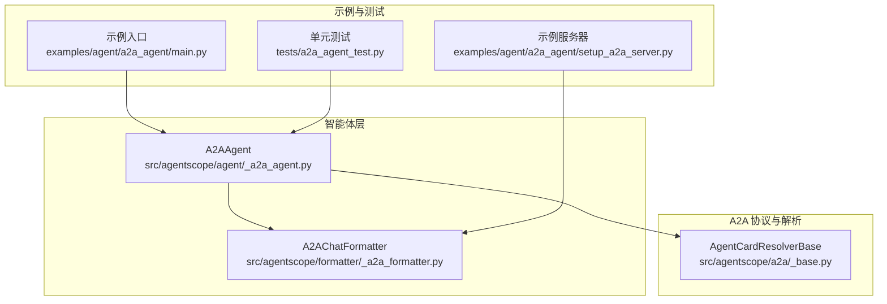
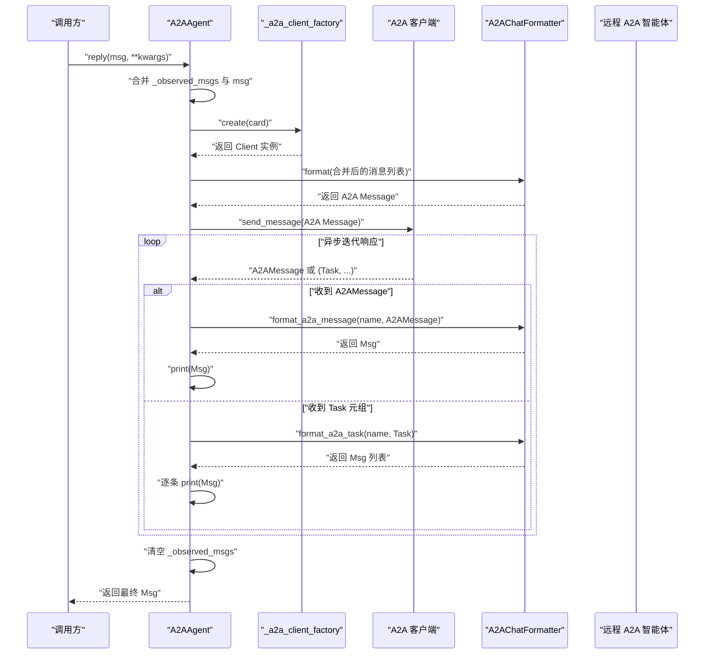
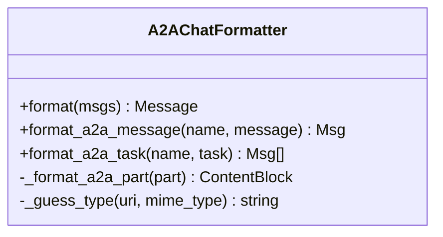
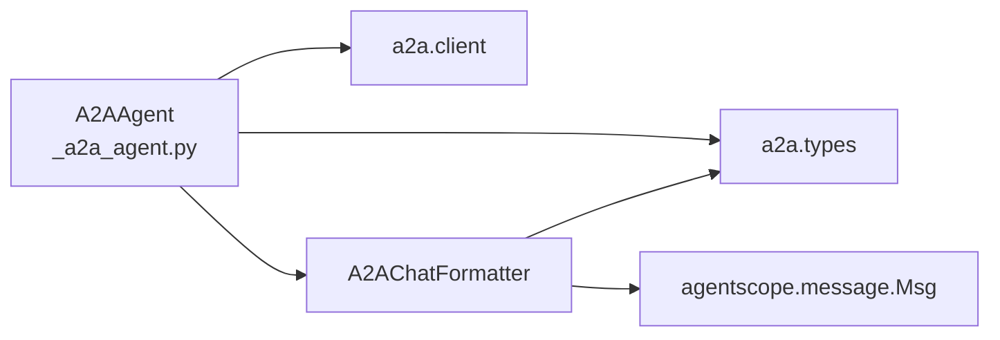

# 回复处理流程

<cite>
**本文引用的文件**
- [src/agentscope/agent/_a2a_agent.py](file://src/agentscope/agent/_a2a_agent.py)
- [src/agentscope/formatter/_a2a_formatter.py](file://src/agentscope/formatter/_a2a_formatter.py)
- [src/agentscope/a2a/_base.py](file://src/agentscope/a2a/_base.py)
- [examples/agent/a2a_agent/main.py](file://examples/agent/a2a_agent/main.py)
- [examples/agent/a2a_agent/setup_a2a_server.py](file://examples/agent/a2a_agent/setup_a2a_server.py)
- [tests/a2a_agent_test.py](file://tests/a2a_agent_test.py)
</cite>

## 目录
1. [简介](#简介)
2. [项目结构](#项目结构)
3. [核心组件](#核心组件)
4. [架构总览](#架构总览)
5. [详细组件分析](#详细组件分析)
6. [依赖关系分析](#依赖关系分析)
7. [性能考量](#性能考量)
8. [故障排查指南](#故障排查指南)
9. [结论](#结论)

## 简介
本文件围绕 A2A 智能体的回复处理流程展开，重点解释以下内容：
- reply() 方法如何将内部暂存的观察消息（_observed_msgs）与本次调用传入的 msg 参数合并，形成完整的消息序列；
- 如何通过 _a2a_client_factory 创建 A2A 客户端并与远程智能体通信；
- 使用 formatter 将 AgentScope 的消息格式转换为 A2A 协议消息的实现细节；
- 异步消息流处理机制：如何通过 client.send_message() 接收 A2AMessage 或任务元组，并分别进行格式转换与打印；
- 处理完成后自动清空 _observed_msgs 的设计意图；
- 对 structured_model 参数不支持的限制说明。

## 项目结构
与 A2A 智能体回复处理直接相关的核心模块如下：
- 智能体实现：src/agentscope/agent/_a2a_agent.py
- 格式化器：src/agentscope/formatter/_a2a_formatter.py
- A2A 基础类型与解析器：src/agentscope/a2a/_base.py
- 示例与服务器集成：examples/agent/a2a_agent/main.py、examples/agent/a2a_agent/setup_a2a_server.py
- 单元测试：tests/a2a_agent_test.py



图表来源
- [src/agentscope/agent/_a2a_agent.py](file://src/agentscope/agent/_a2a_agent.py#L1-L289)
- [src/agentscope/formatter/_a2a_formatter.py](file://src/agentscope/formatter/_a2a_formatter.py#L1-L365)
- [src/agentscope/a2a/_base.py](file://src/agentscope/a2a/_base.py#L1-L26)
- [examples/agent/a2a_agent/main.py](file://examples/agent/a2a_agent/main.py#L1-L29)
- [examples/agent/a2a_agent/setup_a2a_server.py](file://examples/agent/a2a_agent/setup_a2a_server.py#L1-L132)
- [tests/a2a_agent_test.py](file://tests/a2a_agent_test.py#L1-L254)

章节来源
- [src/agentscope/agent/_a2a_agent.py](file://src/agentscope/agent/_a2a_agent.py#L1-L289)
- [src/agentscope/formatter/_a2a_formatter.py](file://src/agentscope/formatter/_a2a_formatter.py#L1-L365)
- [src/agentscope/a2a/_base.py](file://src/agentscope/a2a/_base.py#L1-L26)
- [examples/agent/a2a_agent/main.py](file://examples/agent/a2a_agent/main.py#L1-L29)
- [examples/agent/a2a_agent/setup_a2a_server.py](file://examples/agent/a2a_agent/setup_a2a_server.py#L1-L132)
- [tests/a2a_agent_test.py](file://tests/a2a_agent_test.py#L1-L254)

## 核心组件
- A2AAgent：负责与远程 A2A 智能体通信，合并观察消息与输入消息，创建客户端并发送请求，处理异步响应流，最终返回 AgentScope 的 Msg。
- A2AChatFormatter：负责将 AgentScope 的 Msg 转换为 A2A Message，或将 A2A 的 Message/Task 转换回 AgentScope 的 Msg。
- AgentCardResolverBase：A2A 卡片解析器基类，用于从不同来源获取 AgentCard（示例与测试中体现其存在性）。

章节来源
- [src/agentscope/agent/_a2a_agent.py](file://src/agentscope/agent/_a2a_agent.py#L1-L289)
- [src/agentscope/formatter/_a2a_formatter.py](file://src/agentscope/formatter/_a2a_formatter.py#L1-L365)
- [src/agentscope/a2a/_base.py](file://src/agentscope/a2a/_base.py#L1-L26)

## 架构总览
下图展示了 A2AAgent 在一次回复调用中的关键交互路径：初始化客户端工厂、合并消息、格式化、发送请求、接收异步流并转换输出、清理观察消息。



图表来源
- [src/agentscope/agent/_a2a_agent.py](file://src/agentscope/agent/_a2a_agent.py#L177-L261)
- [src/agentscope/formatter/_a2a_formatter.py](file://src/agentscope/formatter/_a2a_formatter.py#L31-L185)
- [examples/agent/a2a_agent/setup_a2a_server.py](file://examples/agent/a2a_agent/setup_a2a_server.py#L31-L131)

## 详细组件分析

### A2AAgent 类与回复流程
- 初始化与客户端工厂
  - 通过 ClientFactory 创建 _a2a_client_factory，并可注册额外传输生产者；默认配置包含异步 HTTP 客户端与超时设置。
  - 维护 _observed_msgs 列表用于暂存观察到的消息。
  - 初始化 A2AChatFormatter 用于消息格式转换。
- observe() 方法
  - 将单个 Msg 或 Msg 列表追加到 _observed_msgs；支持 None 输入但不做任何操作。
- reply() 方法（核心）
  - 合并策略：先取 _observed_msgs，再根据 msg 是否为 None 决定是否追加单个 Msg 或列表。
  - 客户端创建：使用 _a2a_client_factory.create(card=agent_card) 获取 A2A 客户端实例。
  - 格式化：调用 formatter.format(...) 将合并后的消息列表转换为 A2A Message。
  - 异步流处理：遍历 client.send_message(...) 返回的异步迭代器，若为 A2AMessage 则转换为 Msg 并打印；若为 (Task, ...) 元组，则转换为 Msg 列表并逐条打印。
  - 清理：无论成功与否，处理完成后清空 _observed_msgs。
  - 结果：返回最后一个转换得到的 Msg；若无响应则抛出错误。
  - 不支持 structured_model：当 kwargs 中包含 structured_model 时直接报错，因为 A2A 协议不支持结构化输出。

```mermaid
flowchart TD
Start(["进入 reply(msg, **kwargs)"]) --> CheckStructured["检查 kwargs 是否包含 structured_model"]
CheckStructured --> |是| RaiseErr["抛出不支持异常"]
CheckStructured --> |否| MergeObserved["取 _observed_msgs 作为基础列表"]
MergeObserved --> AppendMsg{"msg 是否为 None？"}
AppendMsg --> |否| AppendType{"msg 是单个 Msg 还是列表？"}
AppendType --> |单个| AppendOne["追加单个 Msg"]
AppendType --> |列表| AppendList["扩展多个 Msg"]
AppendMsg --> |是| SkipAppend["跳过追加"]
AppendOne --> BuildClient["创建 A2A 客户端"]
AppendList --> BuildClient
SkipAppend --> BuildClient
BuildClient --> FormatMsg["formatter.format(合并后列表)"]
FormatMsg --> SendIter["client.send_message(A2A Message) 异步迭代"]
SendIter --> ItemCheck{"item 类型？"}
ItemCheck --> |A2AMessage| FormatA2A["formatter.format_a2a_message(name, item)"]
FormatA2A --> PrintA2A["print(Msg)"]
ItemCheck --> |(Task, ...)| FormatTask["formatter.format_a2a_task(name, task)"]
FormatTask --> PrintTask["逐条 print(Msg)"]
PrintA2A --> NextItem["继续迭代"]
PrintTask --> NextItem
NextItem --> Done{"迭代结束？"}
Done --> |否| ItemCheck
Done --> |是| ClearObserved["清空 _observed_msgs"]
ClearObserved --> ReturnMsg{"是否有响应 Msg？"}
ReturnMsg --> |是| ReturnOk["返回 Msg"]
ReturnMsg --> |否| RaiseNoResp["抛出无响应异常"]
```

图表来源
- [src/agentscope/agent/_a2a_agent.py](file://src/agentscope/agent/_a2a_agent.py#L177-L261)

章节来源
- [src/agentscope/agent/_a2a_agent.py](file://src/agentscope/agent/_a2a_agent.py#L88-L113)
- [src/agentscope/agent/_a2a_agent.py](file://src/agentscope/agent/_a2a_agent.py#L149-L176)
- [src/agentscope/agent/_a2a_agent.py](file://src/agentscope/agent/_a2a_agent.py#L177-L261)

### A2AChatFormatter：消息格式转换
- format(msgs)
  - 将多个 AgentScope Msg 合并为一个 A2A Message；所有内容块被展平为 Parts（文本、思考、图像/视频/音频 URL/Base64、工具调用/结果数据等），角色统一设为 user。
- format_a2a_message(name, message)
  - 将 A2A Message 转换回 AgentScope Msg；根据 A2A 角色映射为 user/assistant；内容块由 _format_a2a_part 解析。
- format_a2a_task(name, task)
  - 将 A2A Task 转换为 Msg 列表；优先处理状态消息，再合并工件（artifacts）内容；相同角色的内容会被合并到同一 Msg 中。
- _format_a2a_part(part)
  - 将 A2A Part 转换为 AgentScope ContentBlock；支持 TextPart、FilePart（URI/Base64）、DataPart（工具调用/结果）；无法识别的类型会记录错误。
- _guess_type(uri, mime_type)
  - 依据 URI 或 MIME 类型猜测媒体类型（image/video/audio/unknown）。



图表来源
- [src/agentscope/formatter/_a2a_formatter.py](file://src/agentscope/formatter/_a2a_formatter.py#L31-L365)

章节来源
- [src/agentscope/formatter/_a2a_formatter.py](file://src/agentscope/formatter/_a2a_formatter.py#L31-L185)
- [src/agentscope/formatter/_a2a_formatter.py](file://src/agentscope/formatter/_a2a_formatter.py#L186-L365)

### 异步消息流处理机制
- 客户端迭代：client.send_message(...) 返回异步迭代器，元素类型为 A2AMessage 或 (Task, ...) 元组。
- 分支处理：
  - A2AMessage：formatter.format_a2a_message(...) 转换为 Msg，随后打印；
  - Task 元组：formatter.format_a2a_task(...) 转换为 Msg 列表，逐条打印，最后一条作为最终响应。
- 打印与合并：format_a2a_task 内部会将同角色的内容合并到同一 Msg，便于阅读。

章节来源
- [src/agentscope/agent/_a2a_agent.py](file://src/agentscope/agent/_a2a_agent.py#L232-L253)
- [src/agentscope/formatter/_a2a_formatter.py](file://src/agentscope/formatter/_a2a_formatter.py#L224-L271)

### 观察消息合并与自动清空
- 合并逻辑：_observed_msgs 与 msg（若非 None）合并为一个列表，作为本次请求的完整上下文。
- 自动清空：处理完成后，_observed_msgs 被清空，避免重复携带历史信息。
- 测试验证：单元测试覆盖了 observe 与 reply 的合并行为、仅观察消息的回复、以及处理后清空的行为。

章节来源
- [src/agentscope/agent/_a2a_agent.py](file://src/agentscope/agent/_a2a_agent.py#L149-L176)
- [src/agentscope/agent/_a2a_agent.py](file://src/agentscope/agent/_a2a_agent.py#L215-L253)
- [tests/a2a_agent_test.py](file://tests/a2a_agent_test.py#L191-L253)

### structured_model 参数不支持
- A2A 协议不支持结构化输出，因此 A2AAgent.reply() 显式拒绝 structured_model 关键字参数，直接抛出异常。
- 若业务需要结构化输出，请改用其他支持该能力的智能体实现。

章节来源
- [src/agentscope/agent/_a2a_agent.py](file://src/agentscope/agent/_a2a_agent.py#L206-L211)

### 示例与服务器集成
- 示例入口：examples/agent/a2a_agent/main.py 展示了用户代理与 A2AAgent 的简单对话循环。
- 示例服务器：examples/agent/a2a_agent/setup_a2a_server.py 展示了如何在服务端将 A2A 请求转换为 AgentScope Msg，再通过 ReActAgent 处理并以 A2A 流式事件返回。

章节来源
- [examples/agent/a2a_agent/main.py](file://examples/agent/a2a_agent/main.py#L1-L29)
- [examples/agent/a2a_agent/setup_a2a_server.py](file://examples/agent/a2a_agent/setup_a2a_server.py#L31-L131)

## 依赖关系分析
- A2AAgent 依赖：
  - a2a.types（AgentCard、Message、Task 等）
  - a2a.client（ClientConfig、ClientFactory、Consumer、TransportProducer）
  - A2AChatFormatter（消息格式转换）
  - AgentBase（通用智能体基类）
- A2AChatFormatter 依赖：
  - a2a.types（Message、Part、Role、Task 等）
  - agentscope.message（Msg、ContentBlock 等）



图表来源
- [src/agentscope/agent/_a2a_agent.py](file://src/agentscope/agent/_a2a_agent.py#L1-L113)
- [src/agentscope/formatter/_a2a_formatter.py](file://src/agentscope/formatter/_a2a_formatter.py#L1-L60)

章节来源
- [src/agentscope/agent/_a2a_agent.py](file://src/agentscope/agent/_a2a_agent.py#L1-L113)
- [src/agentscope/formatter/_a2a_formatter.py](file://src/agentscope/formatter/_a2a_formatter.py#L1-L60)

## 性能考量
- 异步迭代：通过异步生成器接收流式响应，避免阻塞主线程，适合长耗时任务与多阶段输出场景。
- 合并策略：将观察消息与输入消息合并为单个 A2A Message，减少往返次数，提高吞吐。
- 清理机制：每次处理后清空 _observed_msgs，防止内存累积与上下文污染。
- 超时与网络：默认使用异步 HTTP 客户端并设置超时，建议结合实际部署环境调整超时参数。

## 故障排查指南
- 无响应异常
  - 现象：未收到任何 A2AMessage 或 Task 元组。
  - 排查：确认远程服务正常、网络可达、AgentCard 配置正确；检查客户端工厂创建与 send_message 调用链路。
  - 参考路径：[src/agentscope/agent/_a2a_agent.py](file://src/agentscope/agent/_a2a_agent.py#L255-L260)
- 结构化输出报错
  - 现象：传入 structured_model 导致异常。
  - 排查：移除 structured_model 参数或改用支持结构化输出的智能体。
  - 参考路径：[src/agentscope/agent/_a2a_agent.py](file://src/agentscope/agent/_a2a_agent.py#L206-L211)
- 格式化错误
  - 现象：A2A Part 类型不受支持或 A2A 角色非法。
  - 排查：检查消息内容块类型与来源（URL/Base64），确认 A2A 角色合法。
  - 参考路径：[src/agentscope/formatter/_a2a_formatter.py](file://src/agentscope/formatter/_a2a_formatter.py#L133-L145)
  - 参考路径：[src/agentscope/formatter/_a2a_formatter.py](file://src/agentscope/formatter/_a2a_formatter.py#L170-L184)
- 观察消息未清空
  - 现象：多次调用后 _observed_msgs 持续增长。
  - 排查：确认 reply() 正常执行且未被中断；检查自定义 handle_interrupt 是否覆盖了清理逻辑。
  - 参考路径：[src/agentscope/agent/_a2a_agent.py](file://src/agentscope/agent/_a2a_agent.py#L252-L253)

章节来源
- [src/agentscope/agent/_a2a_agent.py](file://src/agentscope/agent/_a2a_agent.py#L206-L260)
- [src/agentscope/formatter/_a2a_formatter.py](file://src/agentscope/formatter/_a2a_formatter.py#L133-L184)

## 结论
A2AAgent 的回复处理流程以“观察消息合并 + 客户端异步流式处理”为核心，借助 A2AChatFormatter 实现 AgentScope 与 A2A 协议之间的双向转换。其设计强调：
- 上下文完整性：通过 _observed_msgs 与 msg 的合并确保远程智能体获得完整背景；
- 流式可观测性：异步迭代器使中间状态与最终结果均可被及时打印与消费；
- 明确边界：对不支持的 structured_model 进行显式限制，避免误用；
- 清理与隔离：处理完成后自动清空观察消息，避免跨次调用的上下文污染。