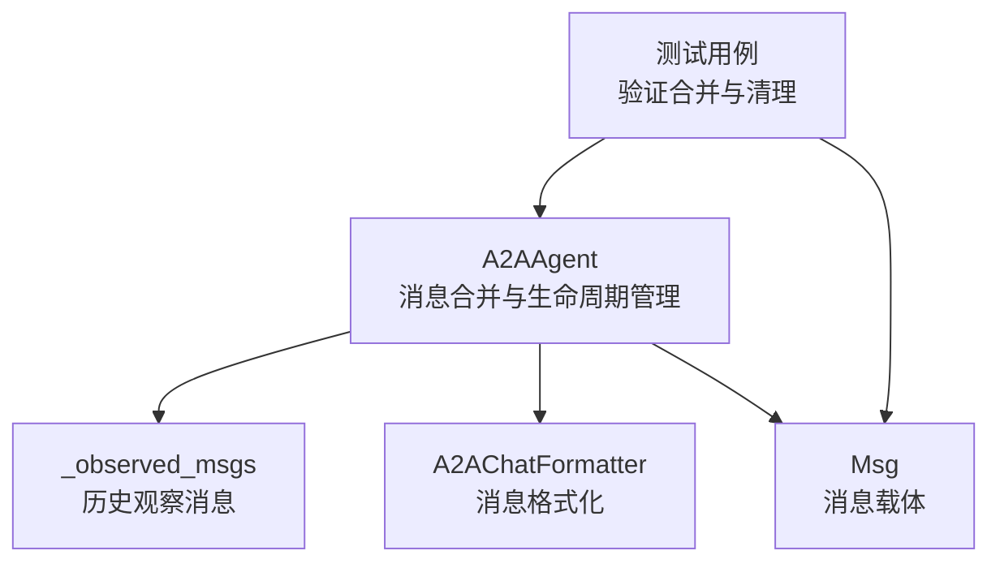
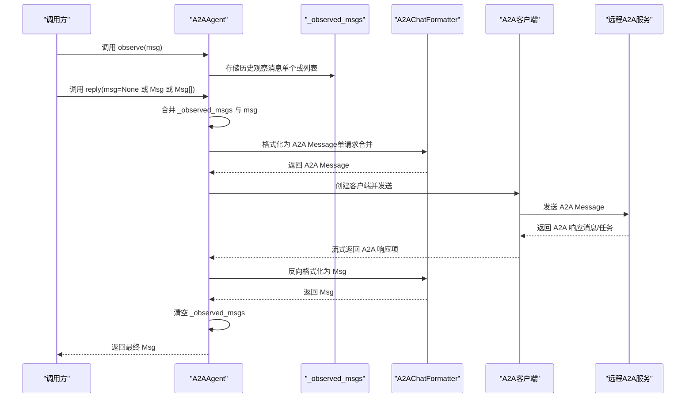
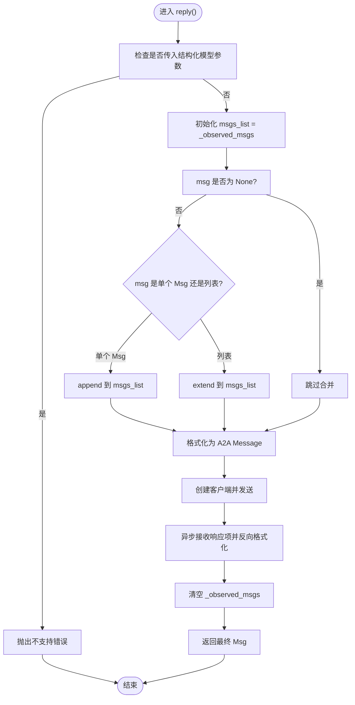
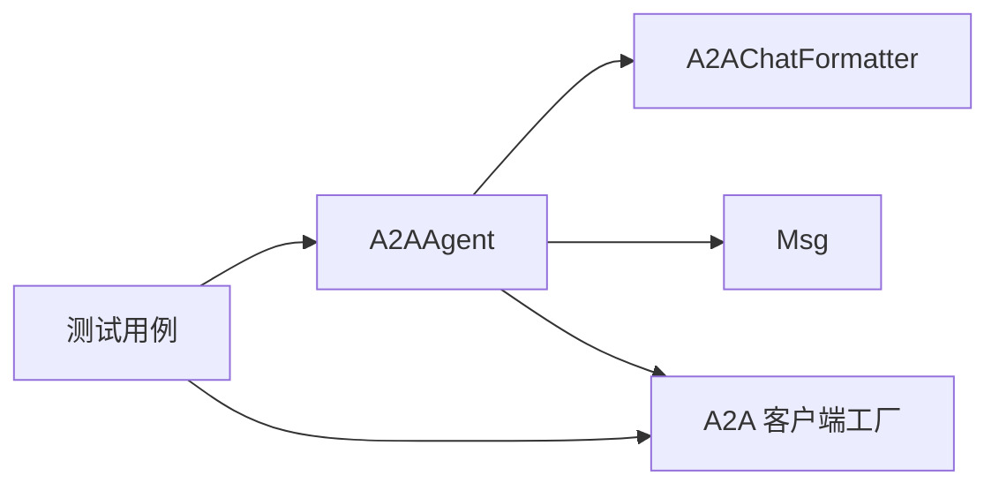

# 消息合并机制

<cite>
**本文引用的文件**
- [src/agentscope/agent/_a2a_agent.py](file://src/agentscope/agent/_a2a_agent.py)
- [src/agentscope/message/_message_base.py](file://src/agentscope/message/_message_base.py)
- [src/agentscope/formatter/_a2a_formatter.py](file://src/agentscope/formatter/_a2a_formatter.py)
- [tests/a2a_agent_test.py](file://tests/a2a_agent_test.py)
</cite>

## 目录
1. [引言](#引言)
2. [项目结构](#项目结构)
3. [核心组件](#核心组件)
4. [架构总览](#架构总览)
5. [详细组件分析](#详细组件分析)
6. [依赖关系分析](#依赖关系分析)
7. [性能考量](#性能考量)
8. [故障排查指南](#故障排查指南)
9. [结论](#结论)

## 引言
本文件聚焦于 A2AAgent 中“消息合并”的实现机制，系统性解析以下关键点：
- 在 reply() 方法中如何将实例变量 _observed_msgs 中的历史观察消息与本次调用传入的 msg 参数合并，形成完整的上下文消息序列；
- 这种设计模式如何维护对话状态与上下文连贯性，尤其在多轮交互场景下的优势；
- 对单个 Msg 对象与 Msg 列表的类型判断与处理逻辑；
- 空消息输入（None、空列表、包含 None 的列表）等边界情况的处理；
- 结合 observe() 方法说明消息生命周期管理：存储、合并与后续自动清除机制。

## 项目结构
围绕消息合并机制的相关文件与职责如下：
- A2AAgent：负责消息的观察、合并、发送与响应接收，并在每次回复后清理已合并的历史消息；
- Msg：消息载体，定义了消息的基本字段与内容块访问接口；
- A2AChatFormatter：负责将 AgentScope 的 Msg 序列转换为 A2A 协议支持的 Message 格式；
- 测试用例：验证 observe 合并与 reply 清理的行为，以及空输入的边界处理。

图表来源
- [src/agentscope/agent/_a2a_agent.py](file://src/agentscope/agent/_a2a_agent.py#L154-L289)
- [src/agentscope/message/_message_base.py](file://src/agentscope/message/_message_base.py#L21-L120)
- [src/agentscope/formatter/_a2a_formatter.py](file://src/agentscope/formatter/_a2a_formatter.py#L31-L169)
- [tests/a2a_agent_test.py](file://tests/a2a_agent_test.py#L150-L254)

章节来源
- [src/agentscope/agent/_a2a_agent.py](file://src/agentscope/agent/_a2a_agent.py#L154-L289)
- [src/agentscope/message/_message_base.py](file://src/agentscope/message/_message_base.py#L21-L120)
- [src/agentscope/formatter/_a2a_formatter.py](file://src/agentscope/formatter/_a2a_formatter.py#L31-L169)
- [tests/a2a_agent_test.py](file://tests/a2a_agent_test.py#L150-L254)

## 核心组件
- A2AAgent
  - 维护 _observed_msgs 列表，用于暂存 observe() 观察到的历史消息；
  - 在 reply() 中将 _observed_msgs 与当前输入 msg 合并，形成完整上下文；
  - 使用 A2AChatFormatter 将合并后的消息序列转换为 A2A Message 并发送；
  - 在回复完成后清空 _observed_msgs，确保每轮对话的上下文独立且可控。
- Msg
  - 定义消息的基本属性（名称、角色、内容、元数据、时间戳等），并提供内容块访问与序列化能力；
  - 支持文本块与多模态内容块的提取与拼接，便于格式化器进行协议转换。
- A2AChatFormatter
  - 将 Msg 列表转换为 A2A Message（单请求合并为一个用户角色的消息），并支持工具调用与结果的数据块；
  - 反向转换时根据 A2A Message 的角色映射回 Msg 的角色，并将内容块还原为 AgentScope 的内容结构。

章节来源
- [src/agentscope/agent/_a2a_agent.py](file://src/agentscope/agent/_a2a_agent.py#L154-L289)
- [src/agentscope/message/_message_base.py](file://src/agentscope/message/_message_base.py#L21-L120)
- [src/agentscope/formatter/_a2a_formatter.py](file://src/agentscope/formatter/_a2a_formatter.py#L31-L169)

## 架构总览
下图展示了从 observe 到 reply 的消息合并与生命周期管理流程，以及格式化转换的关键节点。

图表来源
- [src/agentscope/agent/_a2a_agent.py](file://src/agentscope/agent/_a2a_agent.py#L154-L289)
- [src/agentscope/formatter/_a2a_formatter.py](file://src/agentscope/formatter/_a2a_formatter.py#L31-L169)

## 详细组件分析

### observe() 方法：消息存储与类型校验
- 输入类型支持：
  - 单个 Msg 对象：直接追加到 _observed_msgs；
  - Msg 列表：使用 extend 批量追加；
  - None：不做任何操作，保持历史不变。
- 类型校验：
  - 若传入非 Msg 且非列表或列表元素不全为 Msg，则抛出类型错误，避免污染上下文。
- 生命周期：
  - 仅存储，不发送；等待下一次 reply() 合并发送。

章节来源
- [src/agentscope/agent/_a2a_agent.py](file://src/agentscope/agent/_a2a_agent.py#L154-L176)
- [tests/a2a_agent_test.py](file://tests/a2a_agent_test.py#L191-L211)

### reply() 方法：合并策略与上下文构建
- 合并策略：
  - 初始化 msgs_list 为 _observed_msgs；
  - 若 msg 非空：若为单个 Msg 则 append，否则为列表则 extend；
  - 最终得到包含历史观察消息与本次输入的完整上下文序列。
- 边界情况处理：
  - 当 msg 为 None 时，仅发送历史观察消息；
  - 当 msg 为空列表 [] 或包含 None 的列表时，测试用例表明会返回预设的提示消息（由远程服务返回），这体现了对空输入的容错与提示机制。
- 格式化与发送：
  - 使用 A2AChatFormatter 将合并后的消息序列转换为 A2A Message（单请求合并为用户角色）；
  - 通过 A2A 客户端异步流式接收响应项，反向格式化为 Msg；
  - 若未收到有效响应，抛出错误。
- 自动清理：
  - 回复完成后，显式清空 _observed_msgs，确保下一轮对话的上下文独立。

图表来源
- [src/agentscope/agent/_a2a_agent.py](file://src/agentscope/agent/_a2a_agent.py#L177-L289)
- [src/agentscope/formatter/_a2a_formatter.py](file://src/agentscope/formatter/_a2a_formatter.py#L31-L169)

章节来源
- [src/agentscope/agent/_a2a_agent.py](file://src/agentscope/agent/_a2a_agent.py#L177-L289)
- [tests/a2a_agent_test.py](file://tests/a2a_agent_test.py#L150-L254)

### handle_interrupt() 方法：中断后的上下文延续
- 行为：
  - 生成一条指示被中断的 Msg；
  - 打印该消息；
  - 将其追加到 _observed_msgs，以便下一次 reply() 继续使用，维持上下文连贯性。
- 影响：
  - 保证在用户中断或异常情况下，对话不会丢失上下文，提升用户体验与鲁棒性。

章节来源
- [src/agentscope/agent/_a2a_agent.py](file://src/agentscope/agent/_a2a_agent.py#L262-L289)

### A2AChatFormatter：消息格式化与反格式化
- 正向格式化（Msg[] -> A2A Message）：
  - 将每个 Msg 的内容块（文本、图像/音频/视频 URL/Base64、工具调用/结果）转换为 A2A Part；
  - 合并为单个 A2A Message，角色统一为用户；
  - 支持多种内容块类型，不支持的类型会被记录日志但不影响整体流程。
- 反向格式化（A2A Message -> Msg）：
  - 根据 A2A Message 的角色映射回 Msg 的角色；
  - 将 Part 还原为 AgentScope 的内容块结构，包括工具调用/结果与多模态资源。

章节来源
- [src/agentscope/formatter/_a2a_formatter.py](file://src/agentscope/formatter/_a2a_formatter.py#L31-L169)
- [src/agentscope/formatter/_a2a_formatter.py](file://src/agentscope/formatter/_a2a_formatter.py#L147-L272)

### Msg：消息结构与内容块访问
- 字段与约束：
  - 角色限定为 user、assistant、system；
  - 内容可为字符串或内容块序列；
  - 提供 to_dict/from_dict 序列化能力；
  - 提供获取文本内容与内容块的方法，便于格式化器处理。
- 复杂度与性能：
  - 内容块访问与拼接为线性复杂度，适合多轮对话的批量处理；
  - 序列化开销与消息大小成正比，建议控制每轮消息长度以优化性能。

章节来源
- [src/agentscope/message/_message_base.py](file://src/agentscope/message/_message_base.py#L21-L120)
- [src/agentscope/message/_message_base.py](file://src/agentscope/message/_message_base.py#L123-L242)

## 依赖关系分析
- A2AAgent 依赖：
  - A2AChatFormatter：负责消息格式化与反格式化；
  - Msg：作为消息载体；
  - A2A 客户端工厂：动态创建客户端并发送消息。
- 测试依赖：
  - MockClientFactory：模拟 A2A 客户端，验证 observe 合并与 reply 清理行为；
  - 测试覆盖空输入、列表输入、None 输入等边界场景。

图表来源
- [src/agentscope/agent/_a2a_agent.py](file://src/agentscope/agent/_a2a_agent.py#L154-L289)
- [src/agentscope/formatter/_a2a_formatter.py](file://src/agentscope/formatter/_a2a_formatter.py#L31-L169)
- [tests/a2a_agent_test.py](file://tests/a2a_agent_test.py#L150-L254)

章节来源
- [src/agentscope/agent/_a2a_agent.py](file://src/agentscope/agent/_a2a_agent.py#L154-L289)
- [src/agentscope/formatter/_a2a_formatter.py](file://src/agentscope/formatter/_a2a_formatter.py#L31-L169)
- [tests/a2a_agent_test.py](file://tests/a2a_agent_test.py#L150-L254)

## 性能考量
- 合并成本：
  - 合并 _observed_msgs 与 msg 的 append/extend 操作为 O(n)；
  - 在多轮对话中，_observed_msgs 的增长会线性增加，建议在业务层控制每轮新增消息数量。
- 格式化成本：
  - A2AChatFormatter 需要遍历所有内容块进行转换，复杂度与内容块总数成正比；
  - 对于多模态资源（URL/Base64），需注意网络与解码开销。
- 清理成本：
  - 每次 reply() 完成后清空 _observed_msgs，时间复杂度为 O(k)，k 为历史消息数；
  - 建议在高并发场景下避免在短时间内频繁创建大量 A2A 客户端实例。

## 故障排查指南
- 类型错误
  - 现象：传入非 Msg 且非列表或列表元素不全为 Msg；
  - 处理：修正输入类型，确保传入 Msg 或 Msg 列表。
- 空输入导致无响应
  - 现象：msg 为 None、[] 或包含 None 的列表时，可能返回提示消息；
  - 处理：在业务层明确空输入的语义，必要时在调用前补充上下文或提示信息。
- 未收到响应
  - 现象：远程服务未返回有效响应；
  - 处理：检查网络连接、A2A 客户端配置与远程服务状态；确认格式化链路正常。
- 上下文未清理
  - 现象：多次调用 reply() 后历史消息累积；
  - 处理：确认 reply() 流程未被中断或自定义扩展破坏清理逻辑。

章节来源
- [src/agentscope/agent/_a2a_agent.py](file://src/agentscope/agent/_a2a_agent.py#L154-L289)
- [tests/a2a_agent_test.py](file://tests/a2a_agent_test.py#L150-L254)

## 结论
A2AAgent 的消息合并机制通过 _observed_msgs 实现“历史观察消息 + 当前输入”的上下文聚合，配合 A2AChatFormatter 的单请求合并策略，既满足 A2A 协议限制，又能在多轮交互中维持上下文连贯性。observe() 提供安全的消息存储入口，reply() 负责合并、发送与自动清理，handle_interrupt() 则在中断场景下延续上下文。测试用例进一步验证了空输入与合并清理的行为，确保系统在边界条件下仍具备稳定表现。