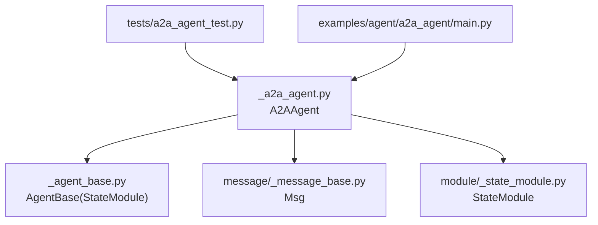
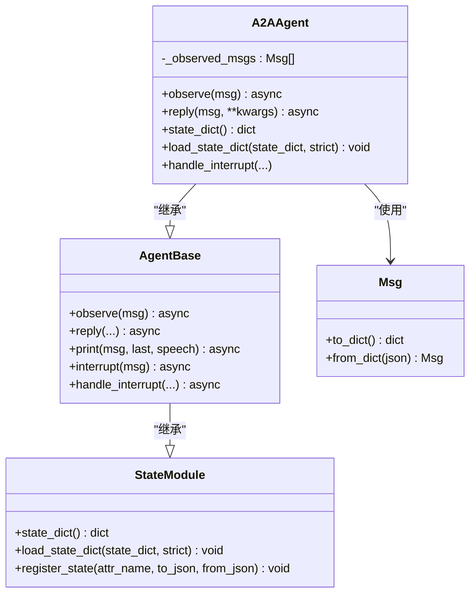
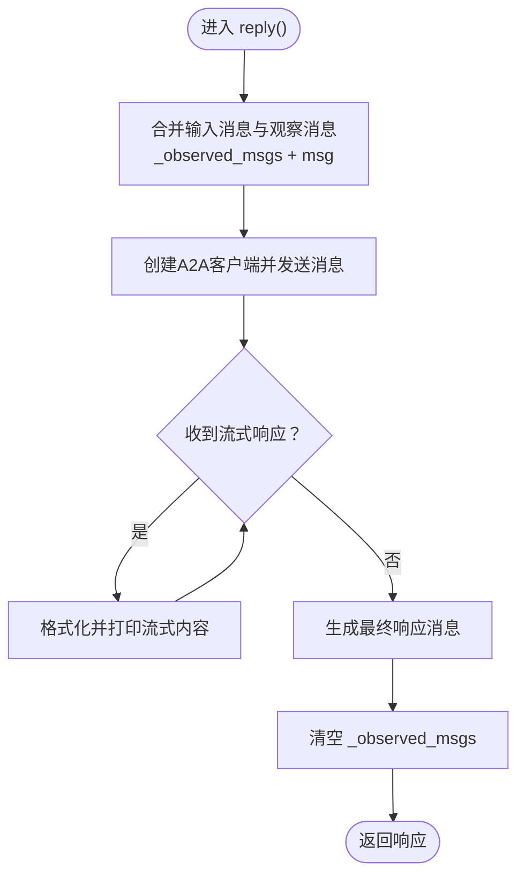
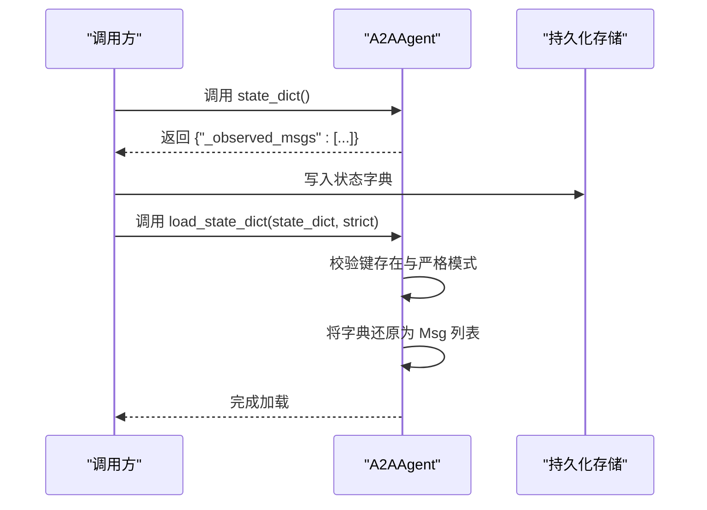
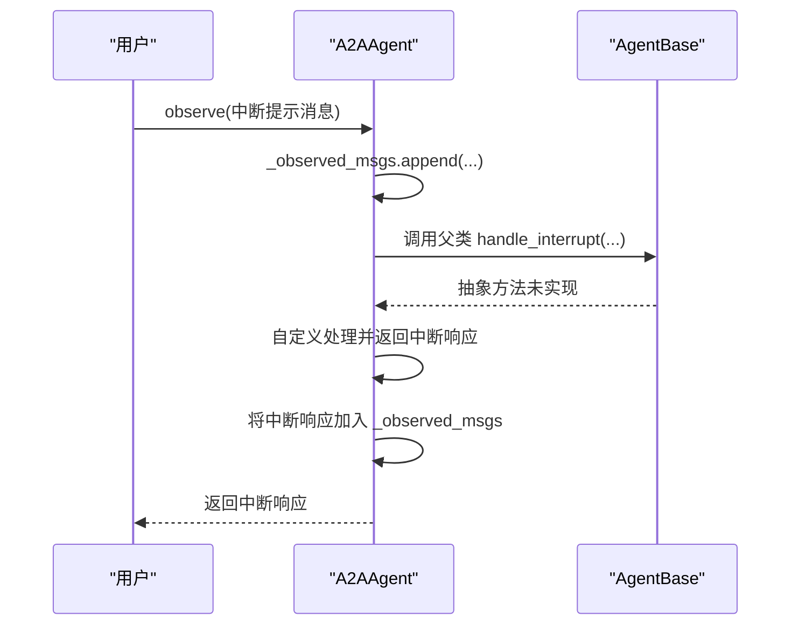
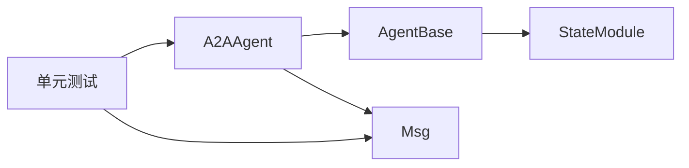

# 状态管理与清理

<cite>
**本文引用的文件**
- [src/agentscope/agent/_a2a_agent.py](file://src/agentscope/agent/_a2a_agent.py)
- [src/agentscope/agent/_agent_base.py](file://src/agentscope/agent/_agent_base.py)
- [src/agentscope/module/_state_module.py](file://src/agentscope/module/_state_module.py)
- [src/agentscope/message/_message_base.py](file://src/agentscope/message/_message_base.py)
- [tests/a2a_agent_test.py](file://tests/a2a_agent_test.py)
- [examples/agent/a2a_agent/main.py](file://examples/agent/a2a_agent/main.py)
</cite>

## 目录
1. [引言](#引言)
2. [项目结构](#项目结构)
3. [核心组件](#核心组件)
4. [架构总览](#架构总览)
5. [详细组件分析](#详细组件分析)
6. [依赖分析](#依赖分析)
7. [性能考虑](#性能考虑)
8. [故障排查指南](#故障排查指南)
9. [结论](#结论)

## 引言
本文件聚焦于A2AAgent的状态管理机制，围绕以下关键点展开：
- reply()执行完成后自动清空_observed_msgs的设计意图与一次性消费模式如何避免重复处理、确保对话幂等。
- 结合state_dict()与load_state_dict()，分析智能体状态的序列化与反序列化，如何支撑会话持久化与状态恢复。
- 在分布式与故障恢复场景下的优势与注意事项，并说明与AgentBase基类状态管理的继承关系。

## 项目结构
本次文档涉及的核心代码位于agentscope模块中，主要文件如下：
- A2AAgent实现：src/agentscope/agent/_a2a_agent.py
- 基类AgentBase：src/agentscope/agent/_agent_base.py
- 状态模块StateModule：src/agentscope/module/_state_module.py
- 消息类型Msg：src/agentscope/message/_message_base.py
- 单元测试：tests/a2a_agent_test.py
- 示例入口：examples/agent/a2a_agent/main.py

图表来源
- [src/agentscope/agent/_a2a_agent.py](file://src/agentscope/agent/_a2a_agent.py#L1-L289)
- [src/agentscope/agent/_agent_base.py](file://src/agentscope/agent/_agent_base.py#L1-L733)
- [src/agentscope/module/_state_module.py](file://src/agentscope/module/_state_module.py#L1-L152)
- [src/agentscope/message/_message_base.py](file://src/agentscope/message/_message_base.py#L1-L242)
- [tests/a2a_agent_test.py](file://tests/a2a_agent_test.py#L1-L254)
- [examples/agent/a2a_agent/main.py](file://examples/agent/a2a_agent/main.py#L1-L29)

章节来源
- [src/agentscope/agent/_a2a_agent.py](file://src/agentscope/agent/_a2a_agent.py#L1-L289)
- [src/agentscope/agent/_agent_base.py](file://src/agentscope/agent/_agent_base.py#L1-L733)
- [src/agentscope/module/_state_module.py](file://src/agentscope/module/_state_module.py#L1-L152)
- [src/agentscope/message/_message_base.py](file://src/agentscope/message/_message_base.py#L1-L242)
- [tests/a2a_agent_test.py](file://tests/a2a_agent_test.py#L1-L254)
- [examples/agent/a2a_agent/main.py](file://examples/agent/a2a_agent/main.py#L1-L29)

## 核心组件
- A2AAgent：继承自AgentBase，实现A2A协议的消息收发、观察消息合并、一次性消费与清理、状态序列化/反序列化。
- AgentBase：提供通用代理能力（钩子、打印、订阅广播、中断处理等），并继承StateModule以支持模块化状态管理。
- StateModule：提供state_dict()/load_state_dict()的通用实现，支持嵌套模块与属性注册。
- Msg：消息对象，提供to_dict()/from_dict()用于序列化/反序列化。

章节来源
- [src/agentscope/agent/_a2a_agent.py](file://src/agentscope/agent/_a2a_agent.py#L29-L114)
- [src/agentscope/agent/_agent_base.py](file://src/agentscope/agent/_agent_base.py#L30-L70)
- [src/agentscope/module/_state_module.py](file://src/agentscope/module/_state_module.py#L20-L152)
- [src/agentscope/message/_message_base.py](file://src/agentscope/message/_message_base.py#L21-L100)

## 架构总览
A2AAgent在AgentBase之上扩展了A2A协议通信能力与一次性观察消息消费模型；其状态管理由StateModule提供基础框架，A2AAgent通过重写state_dict()/load_state_dict()聚焦于_observed_msgs的序列化与恢复。

图表来源
- [src/agentscope/module/_state_module.py](file://src/agentscope/module/_state_module.py#L20-L152)
- [src/agentscope/agent/_agent_base.py](file://src/agentscope/agent/_agent_base.py#L180-L205)
- [src/agentscope/agent/_a2a_agent.py](file://src/agentscope/agent/_a2a_agent.py#L114-L148)
- [src/agentscope/message/_message_base.py](file://src/agentscope/message/_message_base.py#L75-L100)

## 详细组件分析

### A2AAgent状态管理要点
- 观察与合并：A2AAgent通过observe()将外部输入或中间消息暂存至内部列表；在reply()中，会将_observed_msgs与传入msg合并后发送给远端A2A服务。
- 一次性消费与清理：reply()完成（包括流式任务状态与最终响应）后，显式清空_observed_msgs，确保同一轮对话仅消费一次，避免重复处理与非幂等。
- 幂等性保障：由于每次reply()只消费当前轮次的观察消息，后续再次调用时不会携带上一轮的观察消息，从而保证多次调用的幂等行为。

图表来源
- [src/agentscope/agent/_a2a_agent.py](file://src/agentscope/agent/_a2a_agent.py#L177-L261)

章节来源
- [src/agentscope/agent/_a2a_agent.py](file://src/agentscope/agent/_a2a_agent.py#L154-L176)
- [src/agentscope/agent/_a2a_agent.py](file://src/agentscope/agent/_a2a_agent.py#L177-L261)

### 序列化与反序列化：state_dict()与load_state_dict()
- A2AAgent.state_dict()：仅序列化_observed_msgs，将其转换为字典列表，便于持久化存储。
- A2AAgent.load_state_dict()：从state_dict恢复_observed_msgs；strict=True时要求包含必需键且不允许额外键，严格校验状态完整性。
- 与Msg的配合：Msg提供to_dict()/from_dict()，使消息列表可安全序列化/反序列化。

图表来源
- [src/agentscope/agent/_a2a_agent.py](file://src/agentscope/agent/_a2a_agent.py#L114-L148)
- [src/agentscope/message/_message_base.py](file://src/agentscope/message/_message_base.py#L75-L100)

章节来源
- [src/agentscope/agent/_a2a_agent.py](file://src/agentscope/agent/_a2a_agent.py#L114-L148)
- [src/agentscope/message/_message_base.py](file://src/agentscope/message/_message_base.py#L75-L100)

### 与AgentBase的继承关系与状态管理
- 继承链：A2AAgent继承AgentBase，AgentBase继承StateModule，因此A2AAgent天然具备模块化状态管理能力。
- AgentBase的通用状态：AgentBase本身未定义_observed_msgs，其状态管理集中在通用字段与模块注册；A2AAgent通过重写state_dict()/load_state_dict()聚焦自身状态。
- 钩子与中断：AgentBase提供handle_interrupt()默认未实现，A2AAgent覆盖该方法以记录中断后的上下文消息到_observed_msgs，供下一次reply()消费。

图表来源
- [src/agentscope/agent/_agent_base.py](file://src/agentscope/agent/_agent_base.py#L474-L485)
- [src/agentscope/agent/_a2a_agent.py](file://src/agentscope/agent/_a2a_agent.py#L263-L289)

章节来源
- [src/agentscope/agent/_agent_base.py](file://src/agentscope/agent/_agent_base.py#L474-L485)
- [src/agentscope/agent/_a2a_agent.py](file://src/agentscope/agent/_a2a_agent.py#L263-L289)

### 测试验证与示例
- 测试覆盖：
  - observe()正确累积消息，支持单条与列表形式。
  - reply()合并输入与观察消息，且执行后_observed_msgs被清空。
  - 仅观察消息时，reply(None)仍能发送观察消息并清空队列。
- 示例：示例程序展示了A2AAgent与UserAgent的简单对话流程，体现observe与reply的交互。

章节来源
- [tests/a2a_agent_test.py](file://tests/a2a_agent_test.py#L191-L254)
- [examples/agent/a2a_agent/main.py](file://examples/agent/a2a_agent/main.py#L10-L29)

## 依赖分析
- A2AAgent依赖AgentBase提供的通用代理能力与StateModule的状态管理框架。
- A2AAgent依赖Msg进行消息序列化与格式转换。
- 测试通过MockClientFactory与MockA2AClient模拟A2A通信，验证状态管理逻辑。

图表来源
- [src/agentscope/agent/_a2a_agent.py](file://src/agentscope/agent/_a2a_agent.py#L1-L289)
- [src/agentscope/agent/_agent_base.py](file://src/agentscope/agent/_agent_base.py#L1-L733)
- [src/agentscope/module/_state_module.py](file://src/agentscope/module/_state_module.py#L1-L152)
- [src/agentscope/message/_message_base.py](file://src/agentscope/message/_message_base.py#L1-L242)
- [tests/a2a_agent_test.py](file://tests/a2a_agent_test.py#L1-L254)

章节来源
- [src/agentscope/agent/_a2a_agent.py](file://src/agentscope/agent/_a2a_agent.py#L1-L289)
- [src/agentscope/agent/_agent_base.py](file://src/agentscope/agent/_agent_base.py#L1-L733)
- [src/agentscope/module/_state_module.py](file://src/agentscope/module/_state_module.py#L1-L152)
- [src/agentscope/message/_message_base.py](file://src/agentscope/message/_message_base.py#L1-L242)
- [tests/a2a_agent_test.py](file://tests/a2a_agent_test.py#L1-L254)

## 性能考虑
- 一次性消费与清理：在reply()完成后立即清空_observed_msgs，避免长期累积导致内存增长与重复处理开销。
- 序列化成本：state_dict()对_observed_msgs逐条调用to_dict()，在消息较多时需关注序列化/反序列化开销；可通过控制观察消息数量与长度优化。
- 分布式与并发：在多实例或多进程场景下，建议将状态持久化到共享存储（如数据库或缓存），并在启动时load_state_dict()恢复，避免丢失上下文。

## 故障排查指南
- 无响应错误：若远端未返回任何消息，A2AAgent会在reply()中抛出异常，提示未收到响应。检查网络、A2A服务端配置与消息格式。
- 严格模式校验失败：当strict=True且state_dict缺少必需键或包含额外键时，load_state_dict()会抛出KeyError。请确认状态字典完整性与一致性。
- 类型错误：observe()仅接受Msg或Msg列表，否则抛出TypeError。确保传入参数类型正确。
- 中断处理：handle_interrupt()默认未实现，A2AAgent覆盖后会将中断响应加入_observed_msgs，确保下一次reply()能感知中断上下文。

章节来源
- [src/agentscope/agent/_a2a_agent.py](file://src/agentscope/agent/_a2a_agent.py#L206-L211)
- [src/agentscope/agent/_a2a_agent.py](file://src/agentscope/agent/_a2a_agent.py#L140-L153)
- [src/agentscope/agent/_a2a_agent.py](file://src/agentscope/agent/_a2a_agent.py#L165-L175)
- [src/agentscope/agent/_agent_base.py](file://src/agentscope/agent/_agent_base.py#L474-L485)

## 结论
A2AAgent通过“一次性消费+显式清理”的策略，确保每轮对话仅处理一次观察消息，从而实现对话幂等；借助StateModule与Msg的序列化能力，实现了会话状态的可持久化与可恢复。在分布式与故障恢复场景中，建议结合共享存储与严格模式校验，保障状态一致性与系统鲁棒性。同时，A2AAgent在AgentBase之上扩展了A2A协议能力，并通过重写状态管理方法聚焦自身业务需求，体现了良好的继承与扩展设计。