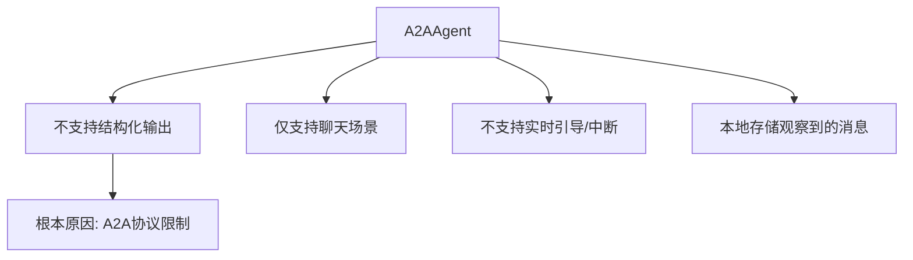
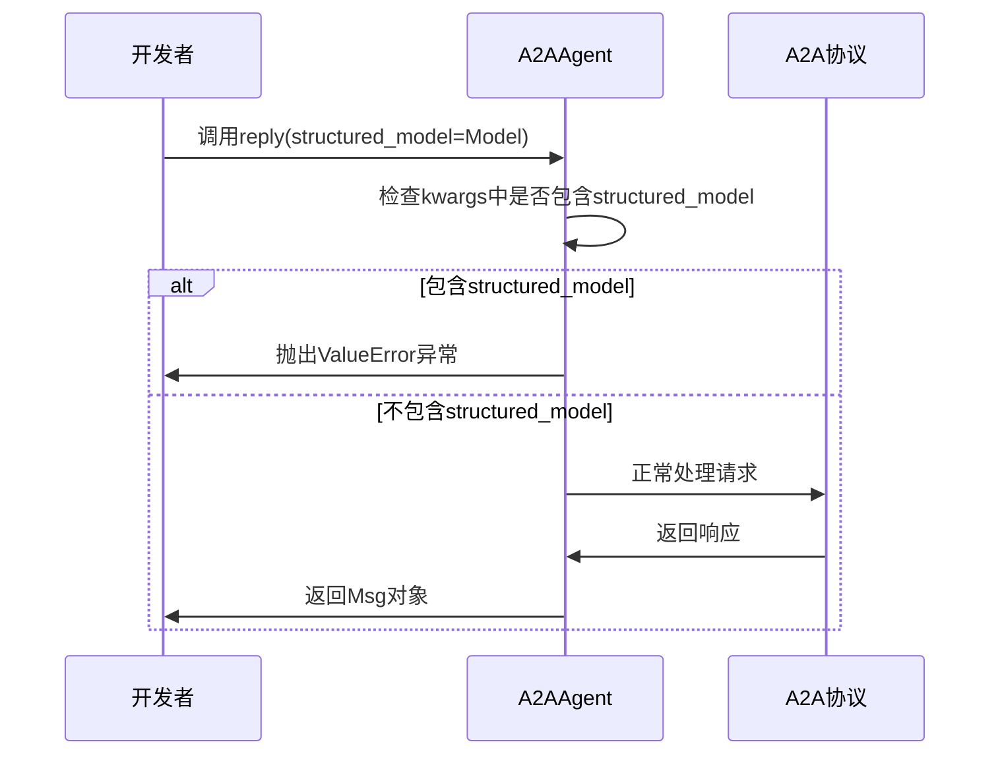
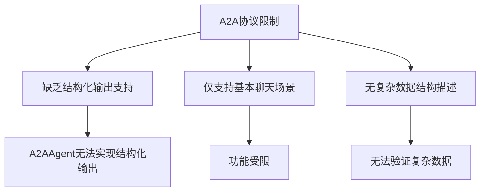
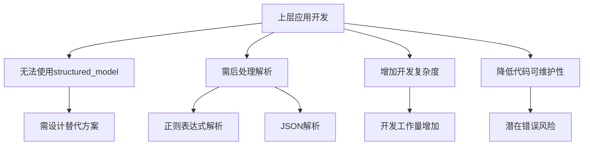
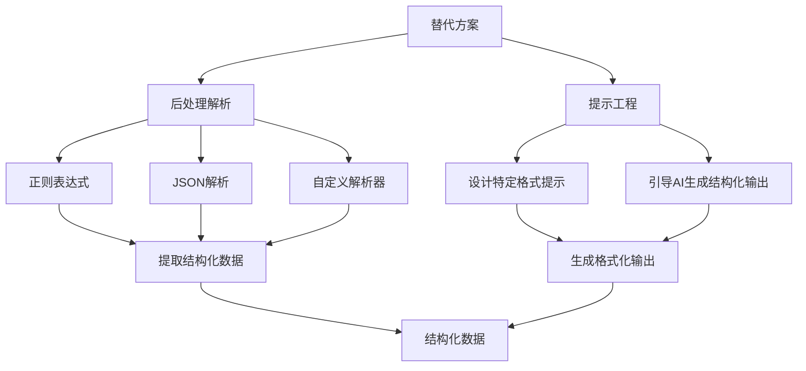
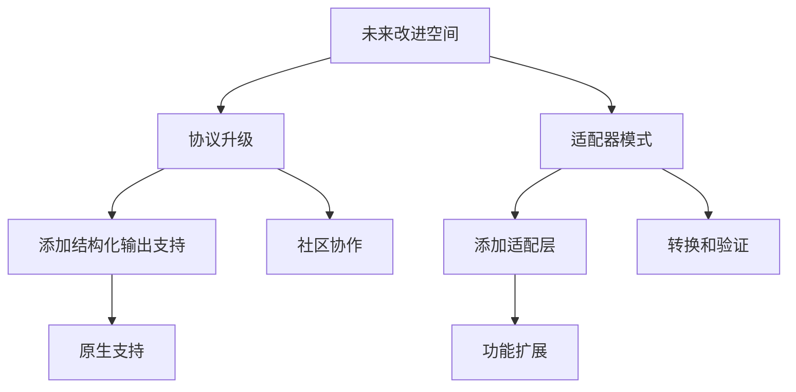

# 结构化输出限制

<cite>
**本文档中引用的文件**  
- [src\agentscope\agent\_a2a_agent.py](file://src\agentscope\agent\_a2a_agent.py)
- [src\agentscope\formatter\_a2a_formatter.py](file://src\agentscope\formatter\_a2a_formatter.py)
- [examples\functionality\structured_output\main.py](file://examples\functionality\structured_output\main.py)
- [examples\agent\a2a_agent\README.md](file://examples\agent\a2a_agent\README.md)
- [docs\tutorial\zh_CN\src\task_a2a.py](file://docs\tutorial\zh_CN\src\task_a2a.py)
</cite>

## 目录
1. [引言](#引言)
2. [A2AAgent中结构化输出的限制](#a2aagent中结构化输出的限制)
3. [reply()方法中的显式检查机制](#reply方法中的显式检查机制)
4. [A2A协议的原生限制](#a2a协议的原生限制)
5. [对上层应用开发的影响](#对上层应用开发的影响)
6. [替代方案设计](#替代方案设计)
7. [未来改进空间](#未来改进空间)
8. [结论](#结论)

## 引言

A2A（Agent-to-Agent）协议是一种开放标准，旨在实现不同AI智能体之间的互操作通信。AgentScope通过A2AAgent类提供了对A2A协议的支持，使本地智能体能够与远程A2A智能体进行通信。然而，由于A2A协议本身的局限性，A2AAgent在功能上无法完全对齐ReActAgent等本地智能体，特别是在结构化输出支持方面存在显著限制。本文档将详细说明这些限制，重点解析reply()方法中对structured_model参数的显式检查和拒绝机制，并探讨其根本原因、对上层应用开发的影响以及可能的替代方案和未来改进空间。

## A2AAgent中结构化输出的限制

A2AAgent类在设计上明确指出了其对结构化输出的支持限制。根据源代码中的注释，A2AAgent不支持在reply()方法中使用structured_model参数，这是由于A2A协议本身缺乏对结构化输出的支持。这一限制在多个文档和示例中都有明确提及。



**图示来源**  
- [src\agentscope\agent\_a2a_agent.py](file://src\agentscope\agent\_a2a_agent.py#L37-L46)

**本节来源**  
- [src\agentscope\agent\_a2a_agent.py](file://src\agentscope\agent\_a2a_agent.py#L37-L46)
- [examples\agent\a2a_agent\README.md](file://examples\agent\a2a_agent\README.md#L6-L13)

## reply()方法中的显式检查机制

A2AAgent的reply()方法中包含了一个显式的检查机制，用于拒绝任何包含structured_model参数的调用。这一机制通过检查kwargs字典中是否包含"structured_model"键来实现。如果检测到该键，则立即抛出ValueError异常，明确指出该功能不被支持。

```python
if "structured_model" in kwargs:
    raise ValueError(
        "structured_model is not supported in A2AAgent.reply() "
        "due to the lack of structured output support in A2A "
        "protocol.",
    )
```

这一检查机制确保了开发者在尝试使用结构化输出功能时会立即收到明确的错误信息，而不是在运行时遇到难以调试的问题。通过这种方式，A2AAgent在API层面强制执行了对结构化输出的限制。



**图示来源**  
- [src\agentscope\agent\_a2a_agent.py](file://src\agentscope\agent\_a2a_agent.py#L206-L211)

**本节来源**  
- [src\agentscope\agent\_a2a_agent.py](file://src\agentscope\agent\_a2a_agent.py#L206-L211)

## A2A协议的原生限制

A2A协议本身缺乏对结构化输出（如JSON模式约束）的原生支持，这是导致A2AAgent无法提供该功能的根本原因。A2A协议的设计主要集中在基本的聊天场景，即用户和助手之间的简单交互，而没有考虑到更复杂的结构化数据交换需求。

A2A协议的消息格式主要基于简单的文本和文件传输，不包含对复杂数据结构的描述和验证机制。这意味着即使A2AAgent想要支持结构化输出，底层协议也无法提供必要的支持。这种限制不仅影响了A2AAgent，也影响了所有基于A2A协议的实现。



**图示来源**  
- [src\agentscope\agent\_a2a_agent.py](file://src\agentscope\agent\_a2a_agent.py#L37-L46)
- [docs\tutorial\zh_CN\src\task_a2a.py](file://docs\tutorial\zh_CN\src\task_a2a.py#L32-L34)

**本节来源**  
- [src\agentscope\agent\_a2a_agent.py](file://src\agentscope\agent\_a2a_agent.py#L37-L46)
- [docs\tutorial\zh_CN\src\task_a2a.py](file://docs\tutorial\zh_CN\src\task_a2a.py#L32-L34)

## 对上层应用开发的影响

A2AAgent对结构化输出的限制对上层应用开发产生了显著影响。开发者在设计需要结构化输出的应用时，必须寻找替代方案或调整设计思路。这可能导致开发复杂度增加，代码可维护性降低，以及潜在的错误风险。

例如，在需要从AI响应中提取结构化数据的场景中，开发者无法直接使用Pydantic模型来约束输出格式，而必须依赖后处理解析技术。这不仅增加了开发工作量，还可能导致数据解析错误和性能下降。



**图示来源**  
- [examples\functionality\structured_output\main.py](file://examples\functionality\structured_output\main.py#L58-L71)

**本节来源**  
- [examples\functionality\structured_output\main.py](file://examples\functionality\structured_output\main.py#L58-L71)

## 替代方案设计

尽管A2AAgent本身不支持结构化输出，但开发者可以通过设计替代方案来实现类似功能。最常见的方法是使用后处理解析技术，即在接收到AI的原始响应后，通过正则表达式、JSON解析或其他文本处理技术将其转换为结构化数据。

另一种方法是使用提示工程（prompt engineering），通过精心设计的提示词引导AI生成符合特定格式的输出，然后在客户端进行解析。这种方法虽然不能保证100%的准确性，但在许多场景下可以达到可接受的效果。



**图示来源**  
- [examples\functionality\structured_output\main.py](file://examples\functionality\structured_output\main.py#L58-L71)

**本节来源**  
- [examples\functionality\structured_output\main.py](file://examples\functionality\structured_output\main.py#L58-L71)

## 未来改进空间

尽管当前A2AAgent对结构化输出的支持有限，但未来仍有改进空间。一种可能的改进方向是通过协议升级，在A2A协议中添加对结构化输出的原生支持。这将需要A2A协议的维护者和社区的共同努力。

另一种可能的改进方向是采用适配器模式，在A2AAgent和A2A协议之间添加一个适配层，负责处理结构化输出的转换和验证。这种方法可以在不修改底层协议的情况下，为上层应用提供更丰富的功能。



**图示来源**  
- [src\agentscope\agent\_a2a_agent.py](file://src\agentscope\agent\_a2a_agent.py#L37-L46)

**本节来源**  
- [src\agentscope\agent\_a2a_agent.py](file://src\agentscope\agent\_a2a_agent.py#L37-L46)

## 结论

A2AAgent对结构化输出的支持限制是由于A2A协议本身缺乏对结构化输出的原生支持。这一限制通过在reply()方法中对structured_model参数的显式检查和拒绝机制来强制执行。虽然这对上层应用开发带来了挑战，但开发者可以通过设计替代方案（如后处理解析）来实现类似功能。未来，通过协议升级或适配器模式，有可能为A2AAgent带来更丰富的功能支持。