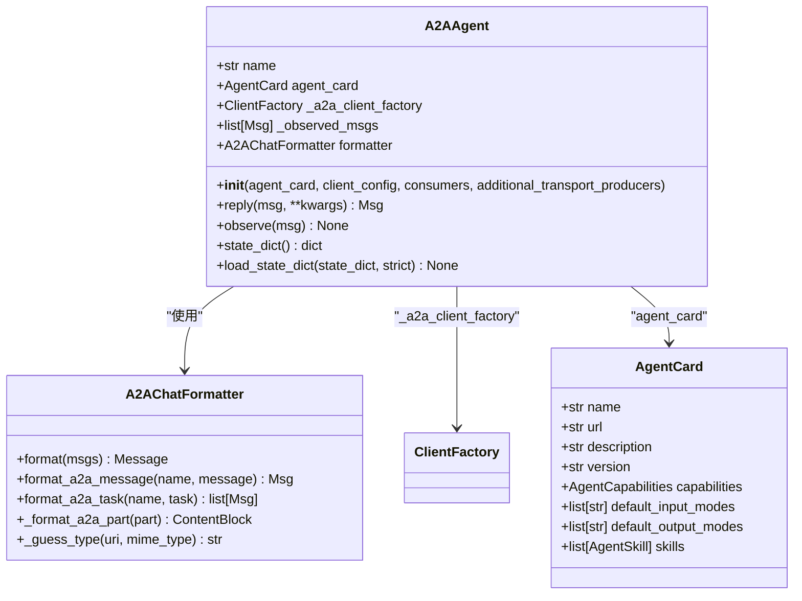
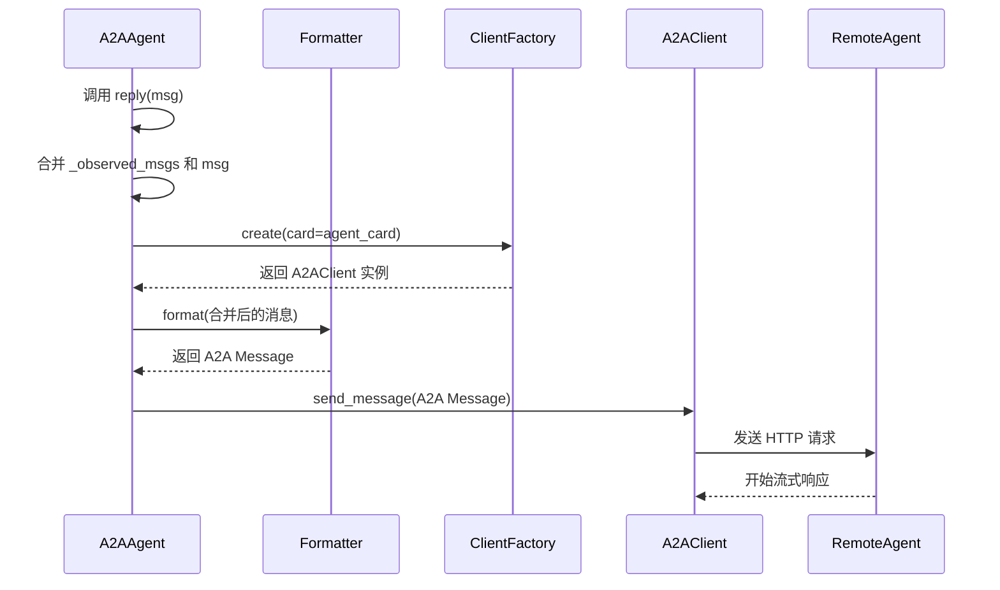
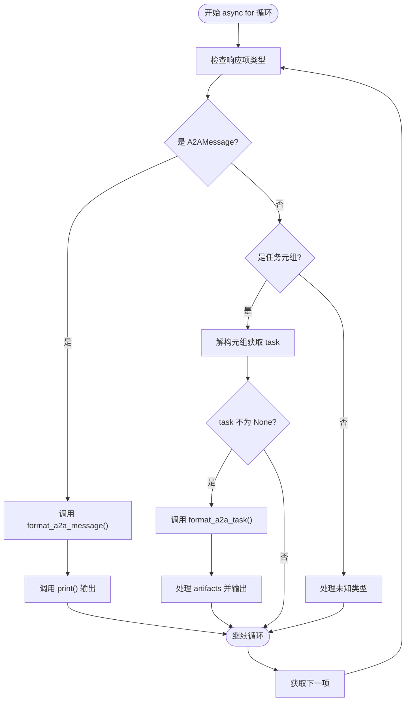

# 远程通信过程

<cite>
**本文档中引用的文件**  
- [A2AAgent.py](file://src/agentscope/agent/_a2a_agent.py)
- [a2a_formatter.py](file://src/agentscope/formatter/_a2a_formatter.py)
- [agent_card.py](file://examples/agent/a2a_agent/agent_card.py)
- [main.py](file://examples/agent/a2a_agent/main.py)
- [setup_a2a_server.py](file://examples/agent/a2a_agent/setup_a2a_server.py)
</cite>

## 目录
1. [引言](#引言)
2. [核心组件分析](#核心组件分析)
3. [通信流程详解](#通信流程详解)
4. [异步消息流处理机制](#异步消息流处理机制)
5. [客户端工厂与配置管理](#客户端工厂与配置管理)
6. [传输协议扩展机制](#传输协议扩展机制)
7. [实时交互与长任务支持](#实时交互与长任务支持)

## 引言
A2AAgent 是 AgentScope 框架中用于实现智能体间通信的核心组件，它基于 A2A（Agent-to-Agent）协议，支持与远程智能体进行异步、流式通信。该机制通过工厂模式创建客户端实例，利用异步迭代处理响应数据，实现了高效的消息交换和任务处理能力。本文将深入解析其通信过程的关键技术实现。

## 核心组件分析

A2AAgent 的核心功能围绕消息转换、客户端创建和状态管理展开。其主要依赖 `A2AChatFormatter` 进行消息格式的双向转换，并通过 `_a2a_client_factory` 工厂模式动态创建与远程智能体通信的客户端实例。`agent_card` 提供了远程智能体的元数据信息，如名称、URL 和能力描述，是建立通信的基础。

**图表来源**  
- [A2AAgent.py](file://src/agentscope/agent/_a2a_agent.py#L29-L289)
- [a2a_formatter.py](file://src/agentscope/formatter/_a2a_formatter.py#L31-L365)
- [agent_card.py](file://examples/agent/a2a_agent/agent_card.py#L5-L37)

**本节来源**  
- [A2AAgent.py](file://src/agentscope/agent/_a2a_agent.py#L29-L289)
- [a2a_formatter.py](file://src/agentscope/formatter/_a2a_formatter.py#L31-L365)

## 通信流程详解

A2AAgent 与远程智能体的通信始于 `reply()` 方法的调用。该方法首先将本地存储的观察消息（`_observed_msgs`）与传入的新消息合并，然后通过 `_a2a_client_factory.create()` 方法创建一个 A2A 客户端实例。此客户端使用 `agent_card` 中的 URL 信息来定位远程服务。

创建客户端后，系统使用 `A2AChatFormatter` 将合并后的 `Msg` 对象列表转换为符合 A2A 协议的 `Message` 对象。最后，通过调用客户端的 `send_message()` 方法发起异步通信，将格式化后的消息发送至远程智能体。

**图表来源**  
- [A2AAgent.py](file://src/agentscope/agent/_a2a_agent.py#L177-L257)
- [a2a_formatter.py](file://src/agentscope/formatter/_a2a_formatter.py#L35-L145)

**本节来源**  
- [A2AAgent.py](file://src/agentscope/agent/_a2a_agent.py#L177-L257)

## 异步消息流处理机制

A2AAgent 的核心优势在于其对异步流式响应的处理能力。`send_message()` 方法返回一个异步可迭代对象（async iterator），允许客户端通过 `async for` 循环逐个接收响应项。

在循环中，系统会检查每个响应项的类型：
- 当接收到 `A2AMessage` 类型时，使用 `formatter.format_a2a_message()` 将其转换回 AgentScope 的 `Msg` 格式，并通过 `print()` 方法输出。
- 当接收到包含任务元组（如 `(task, _)`）的响应时，系统会检查任务状态，并使用 `formatter.format_a2a_task()` 处理任务更新或最终产物，同样进行格式转换和输出。

这种设计使得客户端能够实时处理部分结果，而无需等待整个响应完成，极大地提升了交互的实时性。

**图表来源**  
- [A2AAgent.py](file://src/agentscope/agent/_a2a_agent.py#L233-L253)
- [a2a_formatter.py](file://src/agentscope/formatter/_a2a_formatter.py#L147-L271)

**本节来源**  
- [A2AAgent.py](file://src/agentscope/agent/_a2a_agent.py#L233-L253)

## 客户端工厂与配置管理

`_a2a_client_factory` 是一个基于工厂模式的 `ClientFactory` 实例，负责创建和管理 A2A 客户端。在 `A2AAgent` 初始化时，如果未提供 `client_config`，系统会创建一个默认配置，其中包含一个设置了 600 秒超时的 `httpx.AsyncClient`。

该工厂还支持通过 `consumers` 参数注入消费者（Consumers），这些消费者可以拦截请求/响应流，用于日志记录、指标收集和安全检查等横切关注点。这种设计将通信逻辑与辅助功能解耦，提高了系统的可扩展性和可维护性。

**本节来源**  
- [A2AAgent.py](file://src/agentscope/agent/_a2a_agent.py#L90-L98)

## 传输协议扩展机制

为了支持多样化的传输协议，A2AAgent 提供了 `additional_transport_producers` 参数。这是一个字典，键为协议标签，值为 `TransportProducer` 类型的可调用对象。在初始化时，这些额外的传输生产者会被注册到 `_a2a_client_factory` 中。

这种机制允许开发者轻松扩展客户端以支持新的传输方式（如 WebSocket、gRPC 等），而无需修改核心通信逻辑，体现了良好的开放封闭原则。

**本节来源**  
- [A2AAgent.py](file://src/agentscope/agent/_a2a_agent.py#L101-L106)

## 实时交互与长任务支持

A2AAgent 的异步流式通信模型完美支持实时交互和长时间运行的任务处理。通过 `async for` 循环，客户端可以即时接收并处理远程智能体返回的中间结果，实现类似流式输出的效果。

对于长时间任务，远程服务可以发送 `TaskStatusUpdateEvent` 来报告任务状态（如“进行中”），并在任务完成后发送包含最终产物的 `Task` 对象。A2AAgent 能够正确解析这些状态更新和产物，为用户提供持续的反馈，从而构建出响应迅速、体验流畅的智能体应用。

**本节来源**  
- [A2AAgent.py](file://src/agentscope/agent/_a2a_agent.py#L233-L253)
- [setup_a2a_server.py](file://examples/agent/a2a_agent/setup_a2a_server.py#L86-L117)