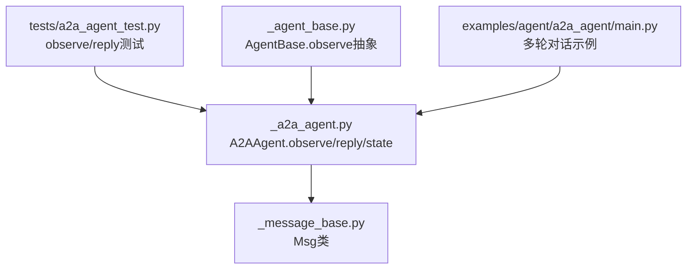
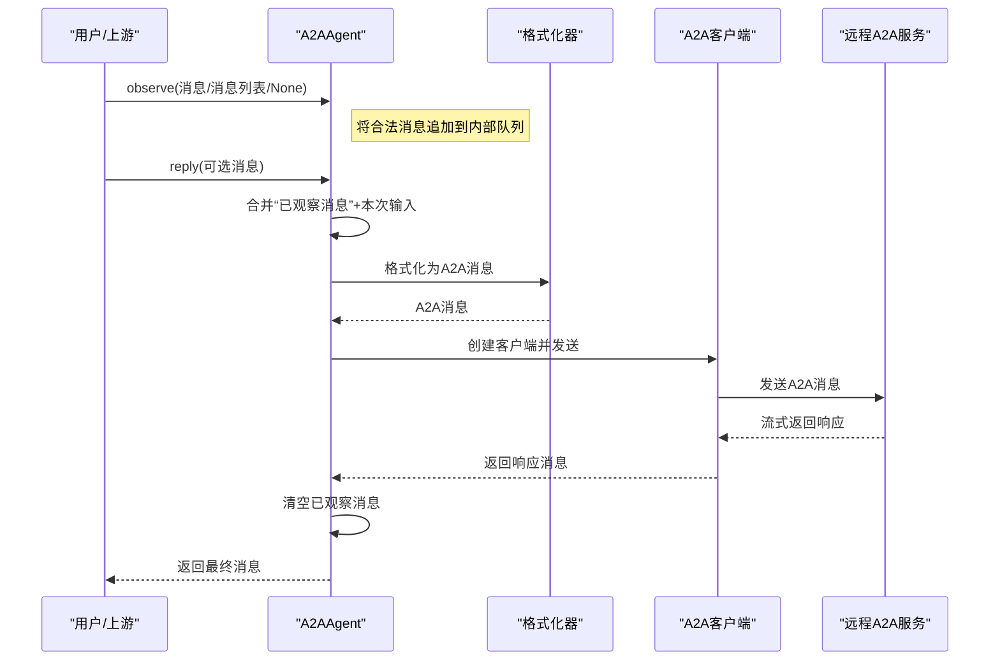
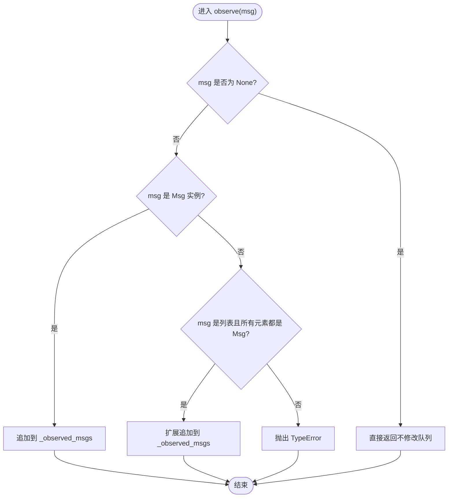
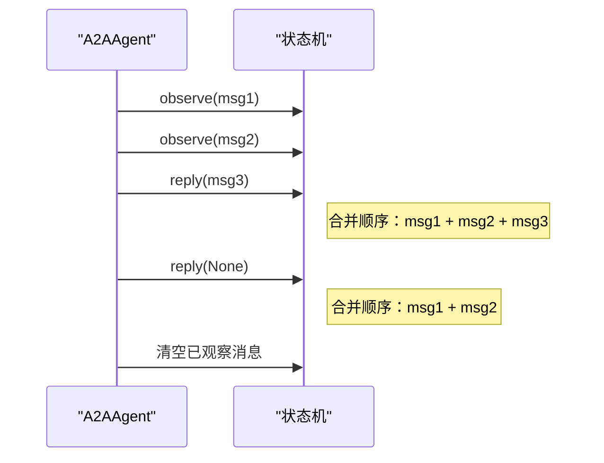
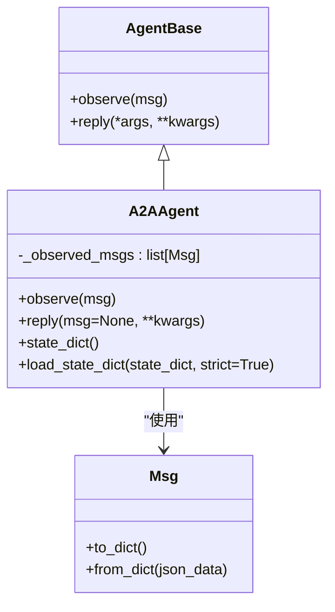

# 消息观察机制

<cite>
**本文引用的文件**
- [src/agentscope/agent/_a2a_agent.py](file://src/agentscope/agent/_a2a_agent.py)
- [src/agentscope/message/_message_base.py](file://src/agentscope/message/_message_base.py)
- [tests/a2a_agent_test.py](file://tests/a2a_agent_test.py)
- [src/agentscope/agent/_agent_base.py](file://src/agentscope/agent/_agent_base.py)
- [examples/agent/a2a_agent/main.py](file://examples/agent/a2a_agent/main.py)
</cite>

## 目录
1. [引言](#引言)
2. [项目结构](#项目结构)
3. [核心组件](#核心组件)
4. [架构总览](#架构总览)
5. [详细组件分析](#详细组件分析)
6. [依赖关系分析](#依赖关系分析)
7. [性能考量](#性能考量)
8. [故障排查指南](#故障排查指南)
9. [结论](#结论)

## 引言
本节聚焦于A2A智能体的消息观察机制，系统阐述observe()方法如何接收Msg或Msg列表类型的消息，并将其暂存至实例变量中；说明对None输入的空处理逻辑；解析严格的类型校验策略（仅接受Msg实例或Msg对象列表）；并阐明该机制在多轮对话中的作用：通过在后续reply调用时将已观察到的历史消息与新消息合并，从而维持对话上下文的连续性。同时提供单条消息与多条消息的观察流程示例路径，并说明异常处理机制（非法类型时抛出TypeError）。

## 项目结构
与消息观察机制直接相关的核心文件如下：
- A2A智能体实现：负责observe/reply等关键流程
- 消息模型：定义Msg类型及其序列化/反序列化能力
- 测试用例：覆盖observe行为、合并逻辑与异常场景
- 基类接口：定义observe抽象接口及Hook机制
- 示例程序：演示A2A智能体在多轮对话中的典型用法

图表来源
- [src/agentscope/agent/_a2a_agent.py](file://src/agentscope/agent/_a2a_agent.py#L154-L256)
- [src/agentscope/message/_message_base.py](file://src/agentscope/message/_message_base.py#L21-L120)
- [tests/a2a_agent_test.py](file://tests/a2a_agent_test.py#L191-L254)
- [src/agentscope/agent/_agent_base.py](file://src/agentscope/agent/_agent_base.py#L186-L196)
- [examples/agent/a2a_agent/main.py](file://examples/agent/a2a_agent/main.py#L1-L29)

章节来源
- [src/agentscope/agent/_a2a_agent.py](file://src/agentscope/agent/_a2a_agent.py#L154-L256)
- [src/agentscope/message/_message_base.py](file://src/agentscope/message/_message_base.py#L21-L120)
- [tests/a2a_agent_test.py](file://tests/a2a_agent_test.py#L191-L254)
- [src/agentscope/agent/_agent_base.py](file://src/agentscope/agent/_agent_base.py#L186-L196)
- [examples/agent/a2a_agent/main.py](file://examples/agent/a2a_agent/main.py#L1-L29)

## 核心组件
- A2AAgent.observe：接收单个Msg、Msg列表或None，执行严格类型校验并将合法消息追加到内部暂存队列
- A2AAgent.reply：在调用前合并“已观察消息”与本次输入消息，发送给远程A2A服务，并在完成后清空已观察消息
- Msg：消息载体，支持序列化/反序列化，作为observe/reply的输入输出基础类型
- 测试用例：验证observe行为、合并逻辑、None处理与异常抛出

章节来源
- [src/agentscope/agent/_a2a_agent.py](file://src/agentscope/agent/_a2a_agent.py#L154-L256)
- [src/agentscope/message/_message_base.py](file://src/agentscope/message/_message_base.py#L21-L120)
- [tests/a2a_agent_test.py](file://tests/a2a_agent_test.py#L191-L254)

## 架构总览
下图展示了A2A智能体在多轮对话中，observe与reply之间的协作关系：observe暂存历史消息，reply在每次调用时将这些历史消息与当前输入合并后发送。

图表来源
- [src/agentscope/agent/_a2a_agent.py](file://src/agentscope/agent/_a2a_agent.py#L154-L256)

## 详细组件分析

### observe()方法：类型校验与暂存逻辑
- 接收参数类型：Msg | list[Msg] | None
- 空处理逻辑：当输入为None时，直接返回，不改变已观察消息队列
- 类型校验策略：
  - 若为Msg实例：直接追加到内部队列
  - 若为列表且所有元素均为Msg实例：扩展追加到内部队列
  - 其他情况：抛出TypeError，明确提示仅允许Msg或Msg列表
- 存储位置：实例变量_observed_msgs（列表）

图表来源
- [src/agentscope/agent/_a2a_agent.py](file://src/agentscope/agent/_a2a_agent.py#L154-L176)

章节来源
- [src/agentscope/agent/_a2a_agent.py](file://src/agentscope/agent/_a2a_agent.py#L154-L176)
- [tests/a2a_agent_test.py](file://tests/a2a_agent_test.py#L191-L211)

### 多轮对话中的作用：上下文合并与清理
- 上下文合并：reply在调用前会将当前已观察消息与本次输入消息合并，确保远程服务收到完整的上下文
- 清理策略：reply完成一次往返后，会清空内部已观察消息队列，避免重复发送历史消息
- 使用场景：
  - 单轮：仅输入消息，未调用observe
  - 多轮：多次observe历史消息，随后reply一次性合并发送
  - 仅历史：reply传入None，仅发送之前observe的历史消息

图表来源
- [src/agentscope/agent/_a2a_agent.py](file://src/agentscope/agent/_a2a_agent.py#L215-L256)
- [tests/a2a_agent_test.py](file://tests/a2a_agent_test.py#L212-L254)

章节来源
- [src/agentscope/agent/_a2a_agent.py](file://src/agentscope/agent/_a2a_agent.py#L215-L256)
- [tests/a2a_agent_test.py](file://tests/a2a_agent_test.py#L212-L254)

### 异常处理机制
- 非法类型：当传入非Msg且非Msg列表时，抛出TypeError，错误信息明确指出期望类型
- 结构化输出限制：reply不支持structured_model参数，若传入将抛出ValueError
- 无响应：若远程服务未返回有效响应，reply将抛出ValueError

章节来源
- [src/agentscope/agent/_a2a_agent.py](file://src/agentscope/agent/_a2a_agent.py#L173-L176)
- [src/agentscope/agent/_a2a_agent.py](file://src/agentscope/agent/_a2a_agent.py#L206-L211)
- [src/agentscope/agent/_a2a_agent.py](file://src/agentscope/agent/_a2a_agent.py#L258-L261)

### 数据模型与序列化
- Msg类提供to_dict/from_dict，便于状态持久化与恢复
- A2AAgent.state_dict/load_state_dict基于Msg的字典表示进行序列化/反序列化

章节来源
- [src/agentscope/message/_message_base.py](file://src/agentscope/message/_message_base.py#L75-L100)
- [src/agentscope/agent/_a2a_agent.py](file://src/agentscope/agent/_a2a_agent.py#L114-L148)

### 代码示例路径（不含具体代码内容）
- 单条消息观察示例路径：[tests/a2a_agent_test.py](file://tests/a2a_agent_test.py#L196-L201)
- 多条消息观察示例路径：[tests/a2a_agent_test.py](file://tests/a2a_agent_test.py#L202-L206)
- None输入观察示例路径：[tests/a2a_agent_test.py](file://tests/a2a_agent_test.py#L208-L211)
- 观察与回复合并示例路径：[tests/a2a_agent_test.py](file://tests/a2a_agent_test.py#L212-L233)
- 仅观察消息回复示例路径：[tests/a2a_agent_test.py](file://tests/a2a_agent_test.py#L234-L254)
- 多轮对话示例入口路径：[examples/agent/a2a_agent/main.py](file://examples/agent/a2a_agent/main.py#L1-L29)

## 依赖关系分析
- A2AAgent依赖Msg类型进行消息建模与格式化
- observe/reply依赖内部状态_observed_msgs进行上下文暂存
- 测试用例验证observe类型校验、合并逻辑与异常行为
- 基类AgentBase定义observe抽象接口，A2AAgent实现之

图表来源
- [src/agentscope/agent/_agent_base.py](file://src/agentscope/agent/_agent_base.py#L186-L196)
- [src/agentscope/agent/_a2a_agent.py](file://src/agentscope/agent/_a2a_agent.py#L154-L256)
- [src/agentscope/message/_message_base.py](file://src/agentscope/message/_message_base.py#L75-L100)

章节来源
- [src/agentscope/agent/_agent_base.py](file://src/agentscope/agent/_agent_base.py#L186-L196)
- [src/agentscope/agent/_a2a_agent.py](file://src/agentscope/agent/_a2a_agent.py#L154-L256)
- [src/agentscope/message/_message_base.py](file://src/agentscope/message/_message_base.py#L75-L100)

## 性能考量
- 暂存策略：_observed_msgs为列表，append/extend操作时间复杂度为O(1)/O(n)，整体受消息数量影响
- 合并策略：reply在每次调用时进行合并，避免重复发送历史消息，减少网络往返
- 序列化成本：Msg的to_dict/from_dict用于状态持久化，建议在必要时使用，避免频繁序列化

## 故障排查指南
- 传入非法类型导致TypeError：检查传入参数是否为Msg或Msg列表
- reply不支持structured_model：移除该参数或改用支持结构化输出的代理
- 无响应异常：确认远程A2A服务正常运行，检查网络与认证配置
- 多轮对话上下文异常：确保在每次reply后未再次发送相同历史消息（内部已自动清空）

章节来源
- [src/agentscope/agent/_a2a_agent.py](file://src/agentscope/agent/_a2a_agent.py#L173-L176)
- [src/agentscope/agent/_a2a_agent.py](file://src/agentscope/agent/_a2a_agent.py#L206-L211)
- [src/agentscope/agent/_a2a_agent.py](file://src/agentscope/agent/_a2a_agent.py#L258-L261)

## 结论
A2A智能体的observe()方法通过严格的类型校验与暂存机制，为多轮对话提供了可靠的上下文管理。在后续reply调用中，observe暂存的历史消息与本次输入被合并发送，既保证了对话连贯性，又避免了重复发送历史消息的问题。配合完善的异常处理与测试覆盖，该机制在实际应用中具备良好的稳定性与可维护性。