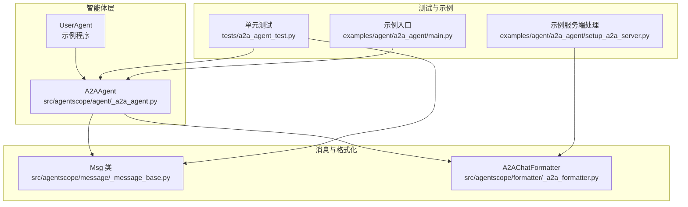
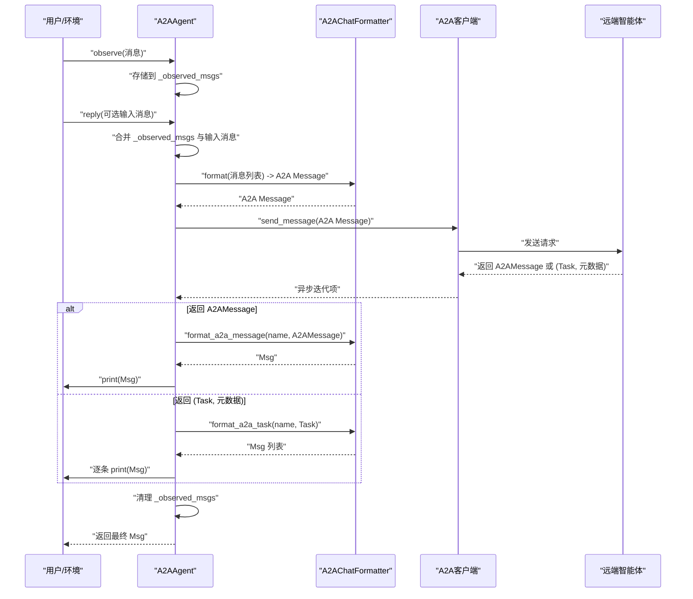
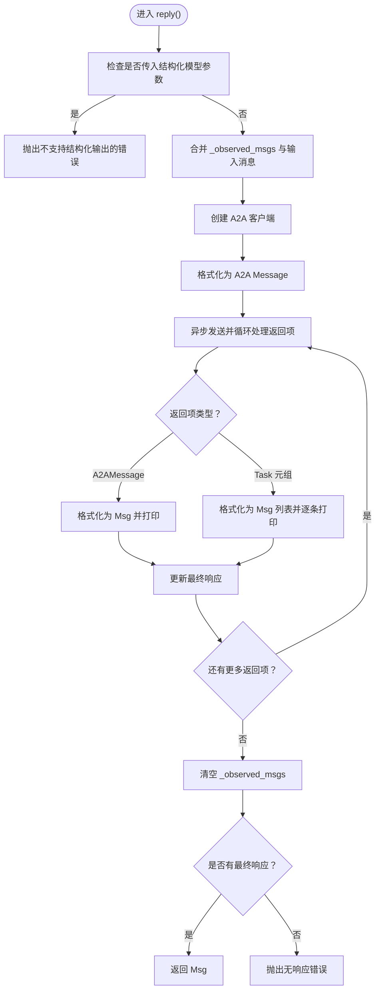
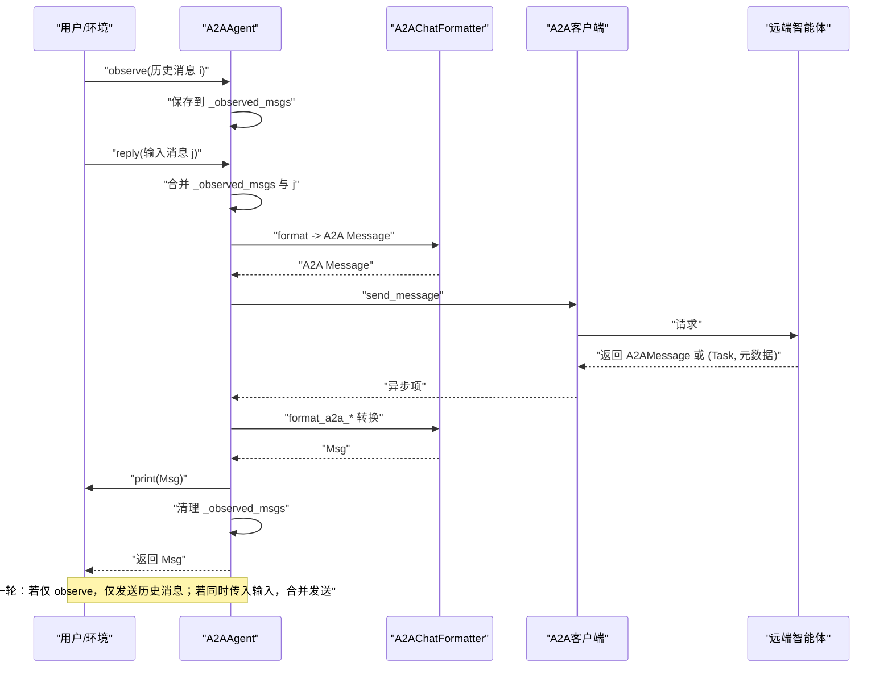
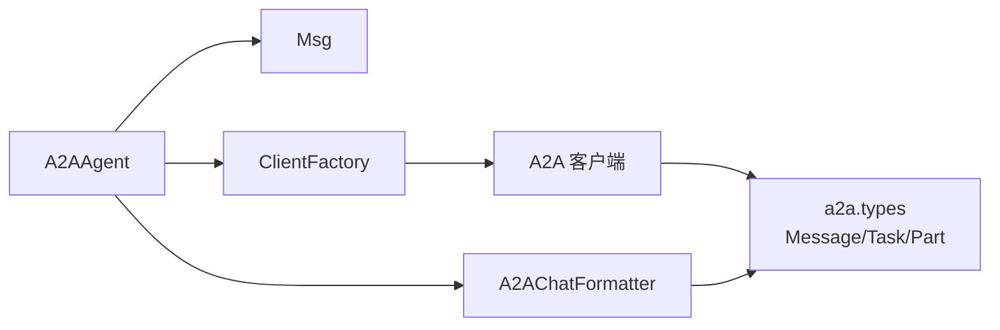

# 通信机制

<cite>
**本文引用的文件**
- [src/agentscope/agent/_a2a_agent.py](file://src/agentscope/agent/_a2a_agent.py)
- [src/agentscope/formatter/_a2a_formatter.py](file://src/agentscope/formatter/_a2a_formatter.py)
- [src/agentscope/message/_message_base.py](file://src/agentscope/message/_message_base.py)
- [tests/a2a_agent_test.py](file://tests/a2a_agent_test.py)
- [examples/agent/a2a_agent/main.py](file://examples/agent/a2a_agent/main.py)
- [examples/agent/a2a_agent/setup_a2a_server.py](file://examples/agent/a2a_agent/setup_a2a_server.py)
</cite>

## 目录
1. [引言](#引言)
2. [项目结构](#项目结构)
3. [核心组件](#核心组件)
4. [架构总览](#架构总览)
5. [详细组件分析](#详细组件分析)
6. [依赖关系分析](#依赖关系分析)
7. [性能考量](#性能考量)
8. [故障排查指南](#故障排查指南)
9. [结论](#结论)

## 引言
本节聚焦于A2A智能体（Agent-to-Agent）的通信机制，系统阐述以下关键点：
- observe()方法如何将外部传入或环境产生的消息存储至本地的_observed_msgs列表，用于后续合并与回复。
- reply()方法如何将已观察到的消息与本次输入消息合并，并通过A2A客户端异步流式发送至远端智能体；同时说明其对A2AMessage与任务元组的处理逻辑。
- handle_interrupt()方法在用户中断时的特殊处理：构造中断响应消息并将其加入_observed_msgs，以维持上下文连续性。
- 通过时序图展示多轮对话中消息的流动过程，帮助读者建立端到端的理解。

## 项目结构
围绕A2A通信机制的相关文件组织如下：
- 智能体实现：A2AAgent位于agent模块，负责消息观察、合并、发送与中断处理。
- 格式化器：A2AChatFormatter负责将AgentScope的Msg对象转换为A2A Message，以及反向转换。
- 消息模型：Msg类提供统一的消息结构与序列化能力。
- 测试用例：覆盖observe与reply的行为验证，以及对任务响应的处理。
- 示例程序：演示A2A智能体与用户智能体的交互流程。

图表来源
- [src/agentscope/agent/_a2a_agent.py](file://src/agentscope/agent/_a2a_agent.py#L1-L289)
- [src/agentscope/formatter/_a2a_formatter.py](file://src/agentscope/formatter/_a2a_formatter.py#L1-L365)
- [src/agentscope/message/_message_base.py](file://src/agentscope/message/_message_base.py#L1-L242)
- [tests/a2a_agent_test.py](file://tests/a2a_agent_test.py#L1-L254)
- [examples/agent/a2a_agent/main.py](file://examples/agent/a2a_agent/main.py#L1-L29)
- [examples/agent/a2a_agent/setup_a2a_server.py](file://examples/agent/a2a_agent/setup_a2a_server.py#L80-L131)

章节来源
- [src/agentscope/agent/_a2a_agent.py](file://src/agentscope/agent/_a2a_agent.py#L1-L289)
- [src/agentscope/formatter/_a2a_formatter.py](file://src/agentscope/formatter/_a2a_formatter.py#L1-L365)
- [src/agentscope/message/_message_base.py](file://src/agentscope/message/_message_base.py#L1-L242)
- [tests/a2a_agent_test.py](file://tests/a2a_agent_test.py#L1-L254)
- [examples/agent/a2a_agent/main.py](file://examples/agent/a2a_agent/main.py#L1-L29)
- [examples/agent/a2a_agent/setup_a2a_server.py](file://examples/agent/a2a_agent/setup_a2a_server.py#L80-L131)

## 核心组件
- A2AAgent：封装A2A协议的通信、消息合并、格式化与中断处理。
- A2AChatFormatter：负责Msg与A2A Message之间的双向转换，支持文本、多媒体与工具调用数据块。
- Msg：统一的消息载体，包含名称、角色、内容与元数据等字段。

章节来源
- [src/agentscope/agent/_a2a_agent.py](file://src/agentscope/agent/_a2a_agent.py#L1-L289)
- [src/agentscope/formatter/_a2a_formatter.py](file://src/agentscope/formatter/_a2a_formatter.py#L1-L365)
- [src/agentscope/message/_message_base.py](file://src/agentscope/message/_message_base.py#L1-L242)

## 架构总览
下图展示了A2A智能体在一次交互中的整体流程：用户或环境产生消息，A2AAgent先进行observe存储，随后在reply中合并消息并通过A2A客户端异步发送，最终将远端返回的A2AMessage或任务状态转换为Msg并输出。

图表来源
- [src/agentscope/agent/_a2a_agent.py](file://src/agentscope/agent/_a2a_agent.py#L154-L289)
- [src/agentscope/formatter/_a2a_formatter.py](file://src/agentscope/formatter/_a2a_formatter.py#L31-L365)
- [tests/a2a_agent_test.py](file://tests/a2a_agent_test.py#L1-L254)

## 详细组件分析

### observe() 方法：消息存储与合并策略
- 存储行为
  - 当传入参数为单个Msg或Msg列表时，直接追加到内部列表；当为None时不改变现有状态。
  - 类型校验确保仅接受Msg或Msg列表，否则抛出类型错误。
- 合并与使用
  - 在reply()中，会将_observed_msgs与本次输入消息合并后再发送，保证上下文连续性。
  - 发送完成后，内部列表会被清空，避免重复发送历史消息。

章节来源
- [src/agentscope/agent/_a2a_agent.py](file://src/agentscope/agent/_a2a_agent.py#L154-L176)
- [tests/a2a_agent_test.py](file://tests/a2a_agent_test.py#L191-L211)

### reply() 方法：异步消息流处理全流程
- 输入与合并
  - 若传入消息非None，则将其追加到合并后的消息列表；若为None则仅使用已观察到的消息。
- 客户端创建与消息转换
  - 使用ClientFactory按AgentCard创建A2A客户端。
  - 通过A2AChatFormatter将消息列表合并为单个A2A Message（A2A协议要求单请求消息）。
- 异步流式接收与处理
  - 通过client.send_message()异步迭代返回值：
    - 若返回A2AMessage：调用format_a2a_message转换为Msg，并打印；记录为最终响应。
    - 若返回元组(Task, 元数据)：调用format_a2a_task转换为Msg列表，逐条打印并更新最终响应。
- 上下文清理
  - 无论是否收到有效响应，都会清空_observed_msgs，确保下一轮对话的独立性。
- 错误处理
  - 若未收到任何响应，抛出异常提示无响应。

图表来源
- [src/agentscope/agent/_a2a_agent.py](file://src/agentscope/agent/_a2a_agent.py#L177-L289)
- [src/agentscope/formatter/_a2a_formatter.py](file://src/agentscope/formatter/_a2a_formatter.py#L147-L272)

章节来源
- [src/agentscope/agent/_a2a_agent.py](file://src/agentscope/agent/_a2a_agent.py#L177-L289)
- [src/agentscope/formatter/_a2a_formatter.py](file://src/agentscope/formatter/_a2a_formatter.py#L31-L365)
- [tests/a2a_agent_test.py](file://tests/a2a_agent_test.py#L120-L178)

### handle_interrupt() 方法：中断场景的上下文保持
- 行为概述
  - 在收到中断信号时，构造一条assistant角色的提示消息，标记中断状态，并打印该消息。
  - 将该消息追加到_observed_msgs，以便在下一次reply()中自动纳入上下文，维持对话连贯性。
- 设计意图
  - 通过显式中断响应消息，使下游逻辑无需额外判断即可感知中断状态，简化上层控制流。

章节来源
- [src/agentscope/agent/_a2a_agent.py](file://src/agentscope/agent/_a2a_agent.py#L262-L289)

### 多轮对话时序：从observe到reply的完整流程
- 第一轮
  - 用户/环境通过observe()传入若干消息，A2AAgent保存至_observed_msgs。
  - 调用reply()时，合并_observed_msgs与本次输入消息，发送至远端。
  - 远端返回A2AMessage或任务状态，A2AAgent转换为Msg并打印，随后清理_observed_msgs。
- 第二轮及以后
  - 若本轮仅observe而未传入新输入，A2AAgent仅发送之前观察到的历史消息。
  - 若本轮既observe又传入新消息，将两者合并后发送，形成新的上下文。

图表来源
- [src/agentscope/agent/_a2a_agent.py](file://src/agentscope/agent/_a2a_agent.py#L154-L289)
- [src/agentscope/formatter/_a2a_formatter.py](file://src/agentscope/formatter/_a2a_formatter.py#L147-L272)
- [examples/agent/a2a_agent/main.py](file://examples/agent/a2a_agent/main.py#L1-L29)

章节来源
- [src/agentscope/agent/_a2a_agent.py](file://src/agentscope/agent/_a2a_agent.py#L154-L289)
- [examples/agent/a2a_agent/main.py](file://examples/agent/a2a_agent/main.py#L1-L29)

## 依赖关系分析
- 组件耦合
  - A2AAgent依赖A2AChatFormatter进行消息格式化，依赖ClientFactory创建A2A客户端，依赖Msg作为内部消息表示。
  - A2AChatFormatter依赖a2a.types中的Message、Task、Part等类型进行双向转换。
- 关键依赖链
  - observe() -> _observed_msgs（本地存储）
  - reply() -> ClientFactory.create() -> client.send_message() -> 异步迭代处理 -> A2AChatFormatter.format_a2a_message/format_a2a_task -> Msg
  - handle_interrupt() -> Msg构造 -> _observed_msgs（上下文延续）

图表来源
- [src/agentscope/agent/_a2a_agent.py](file://src/agentscope/agent/_a2a_agent.py#L1-L289)
- [src/agentscope/formatter/_a2a_formatter.py](file://src/agentscope/formatter/_a2a_formatter.py#L1-L365)

章节来源
- [src/agentscope/agent/_a2a_agent.py](file://src/agentscope/agent/_a2a_agent.py#L1-L289)
- [src/agentscope/formatter/_a2a_formatter.py](file://src/agentscope/formatter/_a2a_formatter.py#L1-L365)

## 性能考量
- 异步流式处理
  - 通过异步迭代client.send_message()，能够尽早输出中间状态（如任务状态），提升用户体验。
- 消息合并策略
  - 将多条消息合并为单个A2A Message，减少网络往返次数，但需注意A2A协议对单请求消息的要求。
- 内存与状态管理
  - _observed_msgs在每次reply后清空，避免长期累积导致内存压力；建议在长对话中合理控制observe频率与消息大小。

## 故障排查指南
- 无响应错误
  - 现象：reply()未收到任何响应项，抛出“无响应”错误。
  - 排查要点：确认远端智能体正常运行、网络连通性、A2A客户端配置正确；检查format阶段是否成功生成A2A Message。
- 结构化输出参数
  - 现象：传入structured_model参数时报错。
  - 原因：A2A协议不支持结构化输出。
  - 处理：移除该参数或改用支持结构化输出的协议。
- 中断处理
  - 现象：用户中断后对话上下文断裂。
  - 处理：确保调用handle_interrupt()，使其生成中断响应消息并写入_observed_msgs，以便下一轮继续。

章节来源
- [src/agentscope/agent/_a2a_agent.py](file://src/agentscope/agent/_a2a_agent.py#L177-L289)
- [tests/a2a_agent_test.py](file://tests/a2a_agent_test.py#L120-L178)

## 结论
A2A智能体的通信机制以observe()与reply()为核心，通过_observed_msgs实现上下文的持久化与合并，借助A2AChatFormatter完成跨协议的消息转换，并通过异步流式处理提升交互效率。handle_interrupt()进一步完善了中断场景下的上下文保持，确保多轮对话的连贯性。结合测试与示例，可以稳定地构建基于A2A协议的智能体间通信系统。