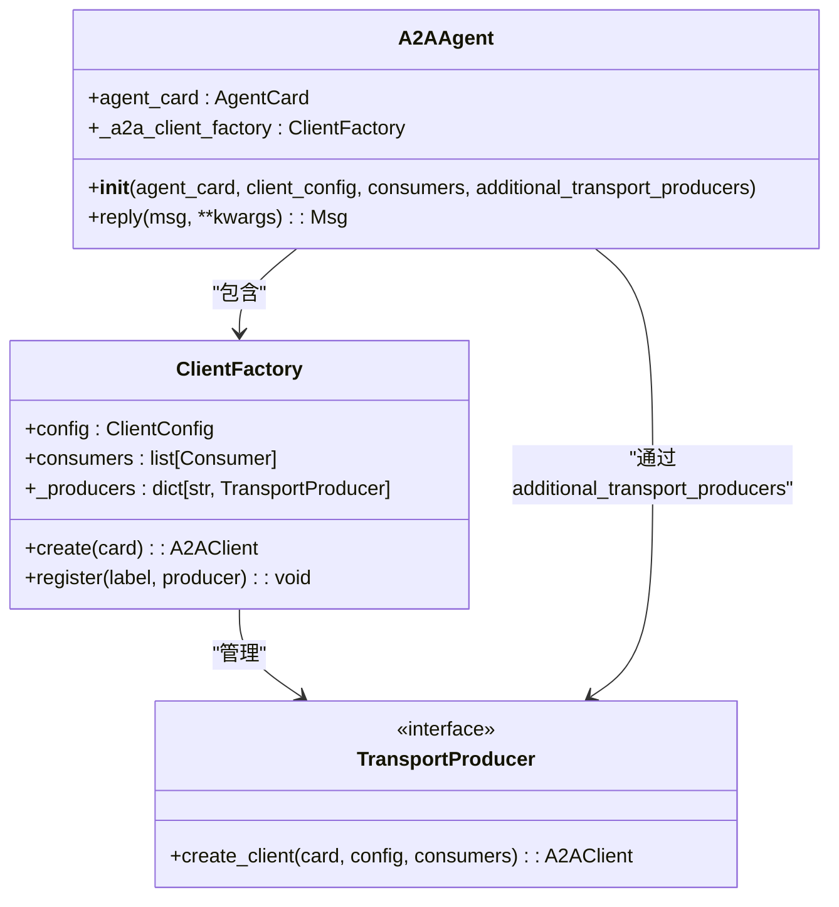
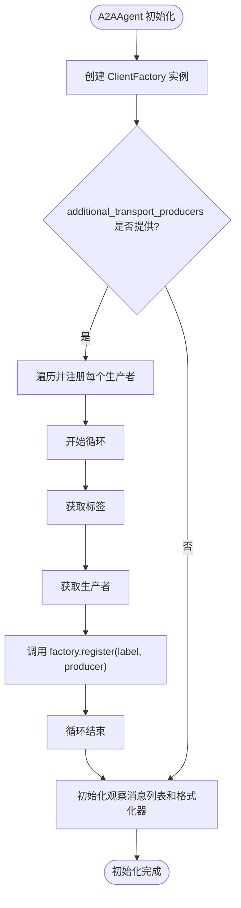
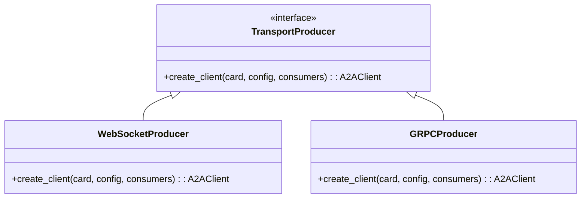

# 传输协议扩展

<cite>
**本文档中引用的文件**  
- [src\agentscope\agent\_a2a_agent.py](file://src\agentscope\agent\_a2a_agent.py)
- [src\agentscope\a2a\_well_known_resolver.py](file://src\agentscope\a2a\_well_known_resolver.py)
</cite>

## 目录
1. [简介](#简介)
2. [项目结构](#项目结构)
3. [核心组件](#核心组件)
4. [架构概述](#架构概述)
5. [详细组件分析](#详细组件分析)
6. [依赖分析](#依赖分析)
7. [性能考虑](#性能考虑)
8. [故障排除指南](#故障排除指南)
9. [结论](#结论)

## 简介
本文档详细介绍了如何通过 `additional_transport_producers` 参数扩展 A2A 智能体的传输协议支持。重点解释了 `TransportProducer` 接口的设计原理和注册机制，说明了如何为特定传输协议（如 WebSocket、gRPC 等）创建自定义生产者。同时分析了 `ClientFactory` 中 `register` 方法的实现逻辑，以及标签（label）与传输生产者之间的映射关系。最后提供了扩展传输协议的实际示例，包括自定义生产者的开发步骤、错误处理和性能优化建议，确保新协议与现有 A2A 架构的无缝集成。

## 项目结构
A2A 模块位于 `src\agentscope\a2a` 目录下，主要包含核心的代理通信功能实现。该模块通过 `ClientFactory` 和 `TransportProducer` 机制支持灵活的传输协议扩展，允许开发者注册自定义的传输生产者以支持不同的通信协议。

```mermaid
graph TD
subgraph "A2A模块"
A2AAgent["A2AAgent (src\\agentscope\\agent\\_a2a_agent.py)"]
ClientFactory["ClientFactory (a2a.client.client_factory)"]
TransportProducer["TransportProducer (a2a.client.client_factory)"]
WellKnownResolver["WellKnownAgentCardResolver (src\\agentscope\\a2a\\_well_known_resolver.py)"]
end
A2AAgent --> ClientFactory : "使用"
A2AAgent --> TransportProducer : "通过additional_transport_producers注入"
ClientFactory --> TransportProducer : "注册和管理"
A2AAgent --> WellKnownResolver : "用于代理卡解析"
```

**图示来源**  
- [src\agentscope\agent\_a2a_agent.py](file://src\agentscope\agent\_a2a_agent.py#L49-L55)
- [src\agentscope\a2a\_well_known_resolver.py](file://src\agentscope\a2a\_well_known_resolver.py#L15-L18)

**本节来源**  
- [src\agentscope\agent\_a2a_agent.py](file://src\agentscope\agent\_a2a_agent.py#L1-L289)
- [src\agentscope\a2a\_well_known_resolver.py](file://src\agentscope\a2a\_well_known_resolver.py#L1-L91)

## 核心组件
A2A 智能体的核心组件包括 `A2AAgent` 类、`ClientFactory` 和 `TransportProducer` 接口。`A2AAgent` 是 A2A 协议的主要实现，负责与远程代理进行通信。`ClientFactory` 负责创建和管理 A2A 客户端实例，而 `TransportProducer` 接口则提供了扩展传输协议的机制。

**本节来源**  
- [src\agentscope\agent\_a2a_agent.py](file://src\agentscope\agent\_a2a_agent.py#L29-L289)

## 架构概述
A2A 智能体的架构基于客户端-工厂-生产者模式，通过 `ClientFactory` 统一管理不同传输协议的客户端创建。`additional_transport_producers` 参数允许在初始化 `A2AAgent` 时注入自定义的传输生产者，从而支持扩展的传输协议。



**图示来源**  
- [src\agentscope\agent\_a2a_agent.py](file://src\agentscope\agent\_a2a_agent.py#L48-L55)
- [src\agentscope\agent\_a2a_agent.py](file://src\agentscope\agent\_a2a_agent.py#L90-L98)

## 详细组件分析
### A2AAgent 分析
`A2AAgent` 类是 A2A 协议在 AgentScope 中的主要实现，它通过 `ClientFactory` 创建客户端实例来与远程代理通信。该类支持通过 `additional_transport_producers` 参数扩展传输协议。

#### 初始化过程


**图示来源**  
- [src\agentscope\agent\_a2a_agent.py](file://src\agentscope\agent\_a2a_agent.py#L90-L106)

**本节来源**  
- [src\agentscope\agent\_a2a_agent.py](file://src\agentscope\agent\_a2a_agent.py#L48-L113)

### TransportProducer 接口设计
`TransportProducer` 是一个接口，定义了创建 A2A 客户端的标准方法。通过实现此接口，可以为特定传输协议创建自定义的客户端生产者。



**图示来源**  
- [src\agentscope\agent\_a2a_agent.py](file://src\agentscope\agent\_a2a_agent.py#L21)

## 依赖分析
A2A 模块依赖于 `a2a` 库的核心组件，包括 `AgentCard`、`ClientConfig` 和 `ClientFactory`。这些依赖通过动态导入的方式在运行时加载，确保了模块的灵活性和可扩展性。

```mermaid
graph TD
A2AAgent --> a2a.types : "AgentCard"
A2AAgent --> a2a.client : "ClientConfig, ClientFactory"
A2AAgent --> a2a.client.client_factory : "TransportProducer"
WellKnownResolver --> a2a.client : "A2ACardResolver"
WellKnownResolver --> a2a.utils : "AGENT_CARD_WELL_KNOWN_PATH"
```

**图示来源**  
- [src\agentscope\agent\_a2a_agent.py](file://src\agentscope\agent\_a2a_agent.py#L76-L78)
- [src\agentscope\a2a\_well_known_resolver.py](file://src\agentscope\a2a\_well_known_resolver.py#L43-L44)

**本节来源**  
- [src\agentscope\agent\_a2a_agent.py](file://src\agentscope\agent\_a2a_agent.py#L76-L78)
- [src\agentscope\a2a\_well_known_resolver.py](file://src\agentscope\a2a\_well_known_resolver.py#L42-L44)

## 性能考虑
在扩展传输协议时，需要考虑以下性能因素：
- 自定义生产者的初始化开销
- 不同传输协议的连接建立时间
- 数据序列化和反序列化的效率
- 并发连接的管理

建议对自定义生产者进行充分的性能测试，确保其在高负载场景下的稳定性和效率。

## 故障排除指南
当扩展传输协议遇到问题时，可以参考以下步骤进行排查：
1. 确认 `additional_transport_producers` 字典中的标签和生产者正确注册
2. 检查自定义生产者的 `create_client` 方法是否正确实现
3. 验证传输协议的配置参数是否正确
4. 查看日志输出以获取详细的错误信息

**本节来源**  
- [src\agentscope\agent\_a2a_agent.py](file://src\agentscope\agent\_a2a_agent.py#L100-L106)

## 结论
通过 `additional_transport_producers` 参数，A2A 智能体提供了灵活的传输协议扩展机制。开发者可以通过实现 `TransportProducer` 接口来支持新的传输协议，并通过 `ClientFactory` 的注册机制将其集成到现有架构中。这种设计模式既保持了核心代码的稳定性，又提供了良好的可扩展性。